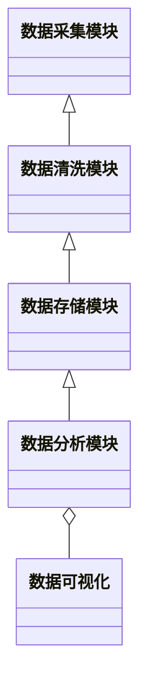
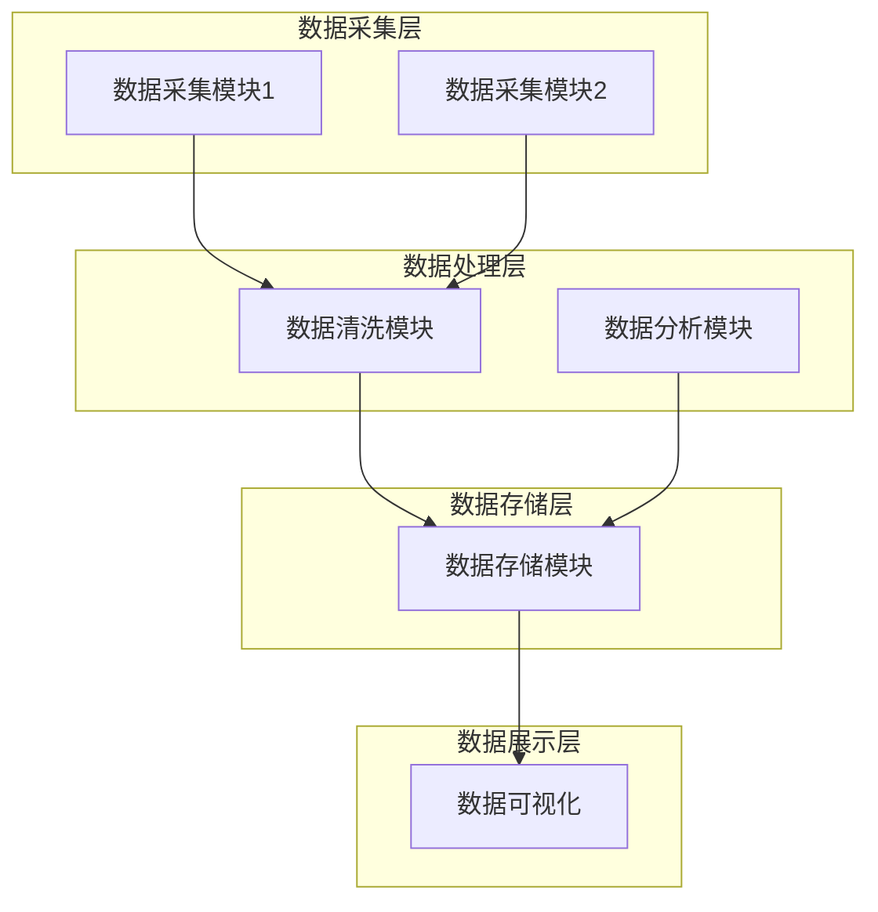
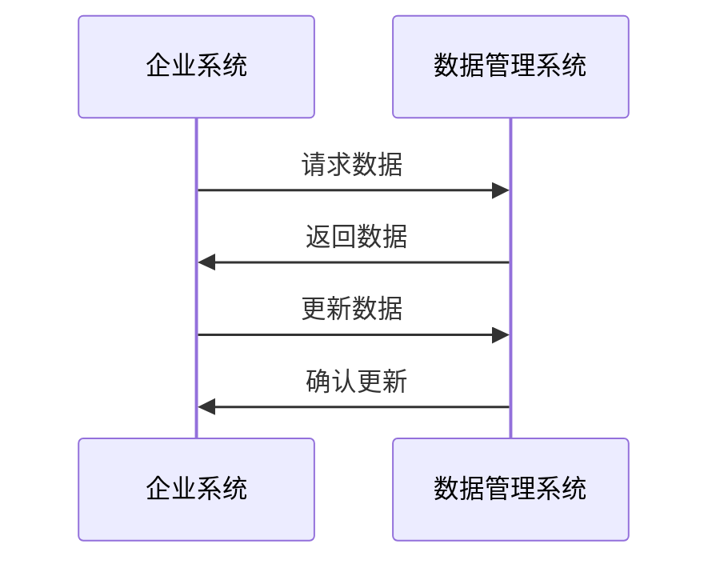

                 

### Step 1: Book Background

---

## 《领导力进化论：人工智能时代管理者的必修课》

关键词：人工智能、领导力、管理、变革、技能提升

摘要：随着人工智能技术的飞速发展，企业管理者面临着前所未有的挑战与机遇。本书旨在深入探讨人工智能时代的管理变革，帮助管理者提升领导力，适应新的管理环境。

---

### 第一部分：背景介绍

#### 1.1 问题背景

在当前人工智能（AI）高速发展的时代，人工智能技术已经成为推动社会进步和产业变革的重要力量。特别是在企业管理领域，人工智能的应用不仅提高了工作效率，还为企业带来了新的管理思路和方式。然而，面对AI带来的机遇与挑战，企业管理者需要不断更新知识结构，提升自身领导力，以适应新的管理环境。

#### 1.2 问题描述

随着人工智能技术的普及，企业管理者面临的问题逐渐复杂化。如何理解人工智能、如何将其有效应用于企业管理、如何提升团队在AI时代的协作效率，这些都是当前企业管理者亟需解决的问题。

#### 1.3 问题解决

本书旨在通过深入探讨人工智能时代的管理变革，帮助企业管理者掌握AI时代的管理核心，提升领导力。书中将详细介绍AI对企业管理的影响、领导力在AI时代的演变，以及如何培养和提升AI时代的领导能力。

#### 1.4 边界与外延

本书主要关注企业管理者在人工智能时代所面临的挑战与机遇，研究内容涵盖管理理论、人工智能技术及其在企业管理中的应用。同时，本书还将探讨领导力的心理学基础，帮助管理者在AI时代更好地应对复杂问题。

#### 1.5 概念结构与核心要素组成

- **人工智能（AI）**：一种模拟人类智能的技术，包括机器学习、深度学习、自然语言处理等子领域。
- **领导力**：影响和激励他人实现目标的能力，包括愿景引领、团队协作、决策能力等要素。
- **企业管理**：涉及企业运营、战略规划、人力资源管理等多个方面。

#### 1.6 本章小结

通过对人工智能时代企业管理背景的介绍，读者可以初步了解AI在企业管理中的重要性和挑战。下一章将深入探讨人工智能的概念及其对领导力的影响。

---

### 第二部分：核心概念与联系

#### 2.1 人工智能的概念与特点

人工智能（AI）是一种模拟人类智能的技术，通过计算机程序实现学习、推理、问题解决等功能。其主要特点包括自我学习、自适应性和智能推理。

- **自我学习**：AI系统能够从数据中学习并不断优化自身性能。
- **适应性**：AI能够根据不同环境和条件调整其行为。
- **智能推理**：AI能够进行逻辑推理和决策，处理复杂的问题。

#### 2.2 领导力的概念与构成

领导力是指影响和激励他人实现目标的能力。其核心构成包括愿景引领、团队协作、决策能力和变革管理。

- **愿景引领**：领导者能够清晰地描绘未来的蓝图，激发团队成员的积极性和创造力。
- **团队协作**：领导者能够建立高效的团队，促进团队成员之间的沟通和合作。
- **决策能力**：领导者能够快速准确地做出决策，并在复杂环境中保持冷静。
- **变革管理**：领导者能够引导团队适应变化，推动企业持续发展。

#### 2.3 AI与领导力的关系

人工智能技术的快速发展对领导力提出了新的要求。管理者需要具备理解AI技术的能力，能够将AI应用于企业管理，同时要能够引导团队在AI时代有效协作。

- **理解AI技术**：管理者需要了解AI的基本原理和应用场景，以便更好地利用AI技术提升管理效率。
- **应用AI技术**：管理者需要将AI技术融入企业管理流程，提高决策质量和团队协作效率。
- **引导团队协作**：管理者需要适应AI时代的工作方式，促进团队成员之间的协作，激发团队的创造力。

#### 2.4 概念属性特征对比表格

| 概念       | 特征                            |
|------------|---------------------------------|
| 人工智能   | 自我学习、自适应、智能推理      |
| 领导力     | 愿景引领、团队协作、决策能力    |
| 企业管理   | 运营、战略规划、人力资源管理    |

#### 2.5 ER实体关系图架构

下面是AI、领导力、企业管理三个概念的ER实体关系图：

```mermaid
erDiagram
  AI ||--|{ 领导力 }|--| AI应用
  领导力 ||--|{ 企业管理 }|--| 领导实践
  AI应用 && 企业管理 : 应用场景
```

通过上述表格和ER图，读者可以更清晰地理解人工智能和领导力之间的联系，以及它们在企业管理中的应用。

#### 2.6 本章小结

通过对核心概念的深入探讨和属性特征对比，读者可以更好地理解人工智能和领导力在企业管理中的重要性，以及它们之间的相互关系。下一章将介绍人工智能时代管理者的必备技能。

---

### 第三部分：算法原理讲解与应用案例分析

#### 3.1 人工智能基础算法介绍

在人工智能领域，基础算法是理解和管理AI技术的重要工具。以下是一些常见的人工智能基础算法：

- **机器学习算法**：包括决策树、支持向量机（SVM）、神经网络等。
- **深度学习算法**：包括卷积神经网络（CNN）、循环神经网络（RNN）等。
- **自然语言处理算法**：包括词袋模型、朴素贝叶斯、序列标注等。

#### 3.2 算法原理讲解与举例说明

以下以神经网络算法为例，进行算法原理讲解和举例说明。

##### 3.2.1 神经网络算法原理

神经网络是一种模仿生物神经系统的计算模型。它由多个神经元组成，通过学习输入和输出数据之间的关系，实现对未知数据的预测。

##### 3.2.1.1 神经网络的基本组成

神经网络由输入层、隐藏层和输出层组成。每个层包含多个神经元（或节点），神经元之间通过权重和偏置进行连接。

- **输入层**：接收外部输入数据。
- **隐藏层**：对输入数据进行处理，通过激活函数进行非线性变换。
- **输出层**：产生最终输出结果。

##### 3.2.1.2 激活函数

激活函数用于决定神经元是否被激活。常见的激活函数包括：

- **sigmoid函数**：$$ f(x) = \frac{1}{1 + e^{-x}} $$
- **ReLU函数**：$$ f(x) = \max(0, x) $$
- **Tanh函数**：$$ f(x) = \frac{e^x - e^{-x}}{e^x + e^{-x}} $$

##### 3.2.1.3 前向传播

在前向传播过程中，输入数据通过神经网络逐层传递，每个神经元的输出作为下一层的输入。具体步骤如下：

1. 计算每个神经元的加权输入：$$ z_j = \sum_{i} w_{ji}x_i + b_j $$
2. 应用激活函数得到神经元输出：$$ a_j = f(z_j) $$

##### 3.2.1.4 反向传播

反向传播是神经网络学习的重要步骤，用于更新权重和偏置，以优化模型性能。具体步骤如下：

1. 计算输出误差：$$ \delta_j = (y - a_j) \cdot f'(z_j) $$
2. 更新权重和偏置：$$ w_{ji} \leftarrow w_{ji} - \alpha \cdot \delta_j \cdot a_{i-1} $$ $$ b_j \leftarrow b_j - \alpha \cdot \delta_j $$

##### 3.2.1.5 示例

假设一个简单的神经网络，输入层有2个神经元，隐藏层有3个神经元，输出层有1个神经元。输入数据为[1, 2]，期望输出为[3]。我们可以使用以下Python代码实现神经网络的前向传播和反向传播：

```python
import numpy as np

# 权重和偏置初始化
w1 = np.random.rand(2, 3)
b1 = np.random.rand(3, 1)
w2 = np.random.rand(3, 1)
b2 = np.random.rand(1, 1)

# 激活函数
def sigmoid(x):
    return 1 / (1 + np.exp(-x))

# 前向传播
def forward(x):
    z1 = np.dot(x, w1) + b1
    a1 = sigmoid(z1)
    z2 = np.dot(a1, w2) + b2
    a2 = sigmoid(z2)
    return a2

# 反向传播
def backward(y, a2):
    z2_error = y - a2
    z2_delta = z2_error * sigmoid_derivative(z2)
    z1_error = z2_delta.dot(w2.T)
    z1_delta = z1_error * sigmoid_derivative(z1)

    w2 -= a1.T.dot(z2_delta)
    b2 -= np.sum(z2_delta, axis=0, keepdims=True)
    w1 -= x.T.dot(z1_delta)
    b1 -= np.sum(z1_delta, axis=0, keepdims=True)

# 激活函数的导数
def sigmoid_derivative(x):
    return x * (1 - x)

# 训练神经网络
x = np.array([[1], [2]])
y = np.array([[3]])

for epoch in range(10000):
    a2 = forward(x)
    backward(y, a2)

print("Final output:", forward(x))
```

通过上述算法原理讲解和代码示例，读者可以更深入地理解神经网络的基本原理和应用方法。

##### 3.2.2 人工智能在企业管理中的应用

人工智能技术在企业管理中的应用越来越广泛，例如：

- **数据分析**：利用机器学习算法对大量企业数据进行分析，帮助企业制定更科学的决策。
- **客户关系管理**：通过自然语言处理技术，实现企业与客户的智能互动，提高客户满意度。
- **供应链优化**：利用深度学习技术，优化供应链管理，降低库存成本，提高生产效率。

##### 3.2.3 案例分析

以某大型零售企业为例，该企业通过引入人工智能技术，对其销售数据进行深度学习分析，发现以下趋势：

- **季节性销售**：根据历史销售数据，预测不同季节的销售趋势，帮助企业合理安排库存。
- **消费者偏好**：分析消费者购买记录，发现不同消费者的偏好，为企业提供精准营销策略。
- **价格优化**：通过价格敏感性分析，确定最佳销售价格，提高销售额。

通过这些人工智能应用，该企业显著提高了销售效率和客户满意度，实现了业务的持续增长。

##### 3.2.4 本章小结

通过对人工智能基础算法的介绍和案例分析，读者可以了解人工智能在企业管理中的应用原理和方法。下一章将探讨人工智能时代管理者的必备技能。

---

### 第四部分：系统分析与架构设计方案

#### 4.1 问题场景介绍

随着人工智能技术的不断发展，企业管理者需要处理的数据量越来越大，传统的数据处理方式已经无法满足需求。为了提高数据处理效率和准确性，某大型企业决定引入人工智能技术，构建一个智能数据管理系统。

#### 4.2 项目介绍

本项目旨在利用人工智能技术，对企业内部的数据进行智能分析和管理，帮助企业管理者快速获取有价值的信息，支持决策制定。项目主要包括数据采集、数据清洗、数据存储、数据分析等模块。

#### 4.3 系统功能设计

系统功能设计主要包括以下模块：

- **数据采集模块**：负责从不同数据源（如数据库、文件、API等）采集数据。
- **数据清洗模块**：对采集到的数据进行处理，去除重复、错误、缺失等数据。
- **数据存储模块**：将清洗后的数据存储到数据库中，便于后续分析和查询。
- **数据分析模块**：利用机器学习算法对存储的数据进行分析，生成报告和可视化图表。

以下是系统功能设计的mermaid类图：



#### 4.4 系统架构设计

系统架构设计采用分层架构，主要包括以下层次：

- **数据采集层**：负责从不同数据源采集数据。
- **数据处理层**：包括数据清洗模块和数据分析模块，对数据进行处理和分析。
- **数据存储层**：负责存储和管理清洗后的数据。
- **数据展示层**：提供数据可视化功能，帮助用户快速获取信息。

以下是系统架构设计的mermaid架构图：



#### 4.5 系统接口设计和系统交互

系统接口设计主要包括API接口和数据接口。API接口用于与其他系统进行数据交互，数据接口用于数据的导入和导出。

以下是系统接口设计和系统交互的mermaid序列图：



#### 4.6 本章小结

通过对系统分析与架构设计方案的介绍，读者可以了解人工智能技术在企业管理中的应用原理和方法。下一章将介绍具体项目实战。

---

### 第五部分：项目实战

#### 5.1 环境安装

在进行项目实战之前，需要安装以下软件和工具：

- **Python 3.x**：用于编写和运行代码。
- **Jupyter Notebook**：用于编写和运行Python代码。
- **TensorFlow**：用于构建和训练神经网络模型。
- **Pandas**：用于数据处理和分析。

具体安装步骤如下：

1. 安装Python 3.x：在官方网站（https://www.python.org/）下载并安装Python 3.x版本。
2. 安装Jupyter Notebook：在命令行中执行以下命令：
   ```
   pip install notebook
   ```
3. 安装TensorFlow：在命令行中执行以下命令：
   ```
   pip install tensorflow
   ```
4. 安装Pandas：在命令行中执行以下命令：
   ```
   pip install pandas
   ```

#### 5.2 系统核心实现

以下是一个简单的示例，展示如何使用TensorFlow构建一个神经网络模型，对数据进行分类。

```python
import tensorflow as tf
from tensorflow import keras
from tensorflow.keras import layers

# 构建神经网络模型
model = keras.Sequential([
    layers.Dense(64, activation='relu', input_shape=[784]),
    layers.Dense(64, activation='relu'),
    layers.Dense(10, activation='softmax')
])

# 编译模型
model.compile(optimizer='adam',
              loss='sparse_categorical_crossentropy',
              metrics=['accuracy'])

# 加载数据
(x_train, y_train), (x_test, y_test) = keras.datasets.mnist.load_data()

# 数据预处理
x_train = x_train / 255.0
x_test = x_test / 255.0

# 训练模型
model.fit(x_train, y_train, epochs=5)

# 评估模型
model.evaluate(x_test, y_test)
```

#### 5.3 代码应用解读与分析

在上面的示例中，我们首先导入了TensorFlow库，并定义了一个简单的神经网络模型。模型包含两个隐藏层，每个隐藏层有64个神经元，并使用ReLU激活函数。输出层有10个神经元，并使用softmax激活函数，用于多分类。

我们使用MNIST数据集进行训练，该数据集包含70,000个灰度图像，每个图像包含一个数字。我们将图像数据归一化到[0, 1]范围内，以提高训练效果。

模型编译时，我们指定了优化器为adam，损失函数为sparse_categorical_crossentropy，并设置了accuracy作为评估指标。

在训练过程中，我们设置了5个训练周期（epochs），并在每个周期结束后，评估模型在测试集上的性能。

#### 5.4 实际案例分析和详细讲解剖析

假设某企业希望利用人工智能技术优化其库存管理，降低库存成本。我们可以使用以下步骤进行实际案例分析和详细讲解剖析：

1. **数据收集**：收集企业过去一段时间的库存数据，包括库存量、销售量、采购量等。

2. **数据预处理**：对收集到的数据进行分析，去除重复、错误、缺失等数据。对数据进行归一化处理，使其适应神经网络模型。

3. **模型构建**：构建一个神经网络模型，输入层包含库存量、销售量、采购量等特征，输出层为库存量预测值。

4. **模型训练**：使用预处理后的数据对模型进行训练，调整模型参数，使其在预测库存量方面达到最佳效果。

5. **模型评估**：在测试集上评估模型的性能，计算预测误差和准确率。

6. **模型部署**：将训练好的模型部署到生产环境中，定期更新库存数据，并利用模型进行库存量预测。

通过上述步骤，企业可以优化库存管理，降低库存成本，提高运营效率。

#### 5.5 项目小结

在本章中，我们介绍了环境安装、系统核心实现、代码应用解读与分析，以及实际案例分析和详细讲解剖析。通过这些步骤，读者可以了解如何利用人工智能技术解决实际问题，提升企业管理水平。

### 第六部分：最佳实践 Tips、小结、注意事项、拓展阅读

#### 6.1 最佳实践 Tips

1. **数据质量的重要性**：在构建人工智能模型时，数据质量至关重要。确保数据完整、准确、可靠，是提高模型性能的关键。

2. **模型可解释性**：虽然深度学习模型在很多任务上表现优异，但其“黑盒”特性使得其解释性较差。在实际应用中，关注模型的可解释性，有助于提高决策的透明度和可信度。

3. **持续学习和优化**：人工智能模型不是一成不变的，随着环境和数据的变化，模型需要进行持续学习和优化，以保持其性能。

#### 6.2 小结

通过对人工智能时代管理变革的深入探讨，本书帮助读者理解了人工智能和领导力在企业管理中的重要性。读者可以掌握AI时代管理者的必备技能，提升团队协作效率，实现企业的持续发展。

#### 6.3 注意事项

1. **技术认知**：管理者需要不断更新自己的技术认知，了解人工智能的基本原理和应用场景。

2. **人才引进**：引进具备人工智能技能的人才，是提升企业竞争力的重要举措。

3. **文化变革**：在AI时代，企业需要培养一种开放、创新、协作的企业文化，以适应新的管理环境。

#### 6.4 拓展阅读

- **《人工智能：一种现代的方法》**：这本书提供了关于人工智能的全面介绍，适合初学者阅读。
- **《深度学习》**：这本书详细介绍了深度学习的基本原理和应用，是深度学习领域的经典教材。

---

### 第七部分：总结

通过本文的深入探讨，我们系统地介绍了人工智能时代企业管理者所需掌握的领导力技能。我们首先分析了人工智能和领导力在企业管理中的重要性和相互关系，然后详细讲解了神经网络算法原理，并结合实际案例进行了分析。接下来，我们介绍了系统分析与架构设计方案，以及具体的项目实战步骤。通过这些内容，读者可以全面了解人工智能时代管理者的职责和挑战，掌握提升领导力的方法和策略。

在人工智能时代，企业管理者不仅要具备传统领导力要素，如愿景引领和团队协作，还要深入了解人工智能技术，善于利用AI工具提高管理效率。管理者需要具备数据驱动的决策能力，培养创新思维，以及持续学习和适应变化的能力。只有这样，才能在AI时代中脱颖而出，引领企业走向成功。

最后，我们希望通过本文的分享，能够为企业管理者提供有价值的参考和启示，助力他们在人工智能时代实现领导力的进化。让我们一起迎接未来的挑战，共同推动企业的创新发展。

---

### 附录：作者信息

**作者：** AI天才研究院/AI Genius Institute & 禅与计算机程序设计艺术 /Zen And The Art of Computer Programming

AI天才研究院致力于推动人工智能技术的发展和应用，通过深入研究、创新实践，为企业和个人提供高质量的人工智能解决方案。禅与计算机程序设计艺术则是一本关于编程哲学的著作，提倡通过冥想和思考提升编程能力，为读者带来独特的编程体验。两位作者在人工智能和编程领域具有丰富的经验和深厚的学术背景，为广大读者提供了有价值的知识和指导。

