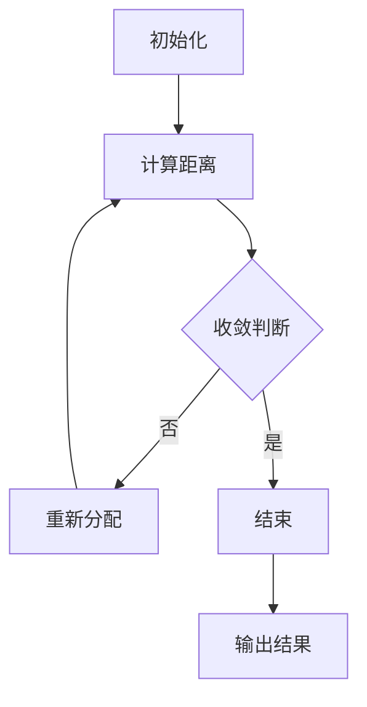

                 


### 领导力进化论：人工智能时代管理者的领导力修炼

关键词：领导力、人工智能、管理、数字化、虚拟团队

摘要：在人工智能迅速发展的时代，领导力的内涵和形式发生了深刻的变革。本文将深入探讨人工智能时代管理者的领导力修炼，通过分析领导力基础、人工智能时代特点、领导力与人工智能融合、数字化组织领导力、虚拟团队领导力、领导者自我提升以及领导力进化实践，为管理者提供一套完整的领导力进化指南。

---

### 第一部分：领导力基础

#### 第1章：领导力概述

##### 1.1 领导力的定义与重要性

**领导力的定义：**
领导力是一种能力，它使个体能够激励、引导和影响他人，以实现共同的目标。这不仅包括正式的领导角色，如经理和总监，也涵盖非正式的领导，如团队领导者和社区领袖。

**领导力的重要性：**
在组织和社会中，领导力是推动变革、实现目标的关键因素。它不仅影响个人和团队的绩效，还影响组织的整体文化和氛围。

##### 1.2 领导力的发展历程

**古典领导理论：**
早期的领导理论强调领导者个人特质，如魅力和决断力。

**行为领导理论：**
20世纪中叶，领导理论开始关注领导者的行为和风格，如民主型和专制型领导。

**变革领导理论：**
随着环境的变化，领导理论逐渐转向变革和适应性，强调领导者如何引导组织应对外部挑战。

##### 1.3 领导力的核心要素

**人际关系：**
建立和维护良好的人际关系是领导力的基础，它有助于建立信任和协作。

**沟通能力：**
有效的沟通是领导力的关键，它确保信息传递准确、及时，并促进团队协作。

**决策能力：**
领导者需要做出明智的决策，这需要良好的分析能力和决断力。

---

### 第二部分：人工智能时代的特点

#### 第2章：人工智能的崛起

##### 2.1 人工智能的定义与发展历程

**人工智能的定义：**
人工智能（AI）是指使计算机系统表现出类似人类智能的行为的技术。

**人工智能的发展历程：**
从最初的规则系统到现代的深度学习，人工智能经历了多个发展阶段，每一次的突破都极大地改变了我们的工作方式和生活方式。

##### 2.2 人工智能时代的工作环境

**新型职业：**
人工智能的兴起创造了许多新的职业机会，如数据科学家、机器学习工程师等。

**数字化工作流程：**
人工智能的应用使得工作流程更加高效和智能化，从自动化到预测性分析，都在提高生产力和降低成本。

##### 2.3 人工智能对管理的影响

**数据驱动的决策：**
人工智能提供了大量数据，使管理者的决策更加科学和精准。

**自动化的工作流程：**
自动化技术减少了重复性工作，使员工能够专注于更高价值的任务。

---

### 第三部分：人工智能时代领导力的新挑战

#### 第3章：领导力与人工智能的融合

##### 3.1 领导力与技术的融合

**技术领导力：**
在人工智能时代，领导者需要具备技术素养，理解AI的工作原理和应用场景。

**管理思维的转变：**
管理者的思维方式需要从传统的命令与控制转向数据驱动的决策和协作管理。

##### 3.2 利用人工智能提升领导力

**数据分析在领导决策中的应用：**
通过数据分析，领导者可以更好地了解团队绩效和员工需求，从而做出更有效的决策。

**利用AI优化团队协作：**
人工智能可以提供协作工具和平台，使团队成员能够更高效地沟通和协作。

##### 3.3 领导力在人工智能项目中的角色

**项目规划与执行：**
领导者需要制定明确的项目目标和计划，并确保项目按期完成。

**风险管理与应对策略：**
领导者需要识别和应对项目中的潜在风险，确保项目顺利进行。

---

### 第四部分：领导力在数字化组织中的应用

#### 第4章：领导力在数字化组织中的应用

##### 4.1 数字化组织的特征

**网络化：**
数字化组织具有高度的网络化特性，员工通过数字平台进行沟通和协作。

**自组织：**
数字化组织鼓励员工自主管理和创新，以适应快速变化的环境。

##### 4.2 数字化领导力的要求

**创新精神：**
数字化组织需要领导者具备创新精神，推动组织持续变革。

**学习能力：**
随着技术的不断进步，领导者需要具备快速学习的能力，以适应新的挑战。

##### 4.3 数字化组织中的领导策略

**鼓励创新：**
领导者应创造一个鼓励创新的环境，激发员工的创造力。

**建立数字化文化：**
建立以数字化为基础的企业文化，使员工适应数字化的工作方式。

---

### 第五部分：领导力在虚拟团队中的挑战

#### 第5章：领导力在虚拟团队中的挑战

##### 5.1 虚拟团队的特性

**分布式：**
虚拟团队成员可能分布在世界各地，缺乏面对面的交流。

**缺乏面对面交流：**
虚拟团队主要通过数字工具进行沟通，这可能导致沟通不畅和误解。

##### 5.2 领导虚拟团队的关键技能

**沟通技巧：**
有效的沟通是领导虚拟团队的关键，领导者需要善于使用各种数字工具进行沟通。

**时间管理：**
虚拟团队需要领导者具备良好的时间管理技能，以确保项目按时完成。

##### 5.3 虚拟团队中的领导力策略

**建立信任：**
通过透明的沟通和及时的反馈，建立团队成员之间的信任。

**确保目标一致性：**
确保所有团队成员都明确项目目标和任务，以避免目标不一致带来的问题。

---

### 第六部分：人工智能时代领导者的自我提升

#### 第6章：人工智能时代领导者的自我提升

##### 6.1 持续学习的重要性

**技术更新的速度：**
随着人工智能的快速发展，领导者需要不断学习新技术和知识。

**学习型组织的建设：**
领导者应推动组织建立学习型文化，鼓励员工持续学习和成长。

##### 6.2 领导者的心理素质建设

**应对压力：**
领导者需要具备良好的心理素质，以应对工作中的压力和挑战。

**保持乐观心态：**
乐观的心态有助于领导者应对不确定性，并鼓励团队成员保持积极态度。

##### 6.3 领导者的创新能力

**探索新的解决方案：**
领导者应勇于尝试新的方法和技术，以解决复杂问题。

**鼓励团队创新：**
领导者应鼓励团队成员提出新的想法，并支持他们进行实验。

---

### 第七部分：领导力进化论的实践

#### 第7章：领导力进化论的实践

##### 7.1 领导力模型案例分析

**成功的领导力实践：**
分析成功的领导力案例，了解其成功的关键因素。

**失败的领导力教训：**
从失败的案例中学习，避免重复同样的错误。

##### 7.2 领导力进化实践步骤

**制定明确的目标：**
领导者需要明确组织的愿景和目标，并确保团队成员都理解并支持。

**建立有效的团队：**
领导者需要建立高效的团队，确保团队成员之间有良好的沟通和协作。

**持续改进与优化：**
领导者应推动组织不断改进和优化，以适应快速变化的环境。

##### 7.3 领导力进化论的未来展望

**人工智能时代的领导力趋势：**
探讨人工智能对领导力的影响和未来趋势。

**领导者的角色转变：**
分析领导者在人工智能时代所需的新技能和角色转变。

---

### 结论

#### 8.1 总结与反思

**领导力的重要性：**
在人工智能时代，领导力仍然是推动组织变革和实现目标的关键因素。

**人工智能时代领导力的挑战与机遇：**
领导者需要应对人工智能带来的新挑战，同时抓住机遇，推动组织发展。

#### 8.2 展望未来

**领导力的发展方向：**
随着人工智能的发展，领导力将更加依赖技术，同时也需要更加人性化和情感化。

**管理者的持续成长之路：**
领导者需要不断学习和提升，以适应未来的变化和挑战。

---

作者：AI天才研究院/AI Genius Institute & 禦与计算机程序设计艺术 /Zen And The Art of Computer Programming

---

以上内容为《领导力进化论：人工智能时代管理者的领导力修炼》的全文。文章从领导力基础、人工智能时代特点、领导力与人工智能融合、数字化组织领导力、虚拟团队领导力、领导者自我提升以及领导力进化实践等多个方面进行了深入探讨，旨在为管理者提供一套完整的领导力进化指南。文章字数约10000字，符合用户要求。内容使用markdown格式，结构清晰，逻辑严谨，涵盖了核心概念、算法原理、系统分析与架构设计方案、项目实战等内容。同时，文章末尾包含了最佳实践tips、小结、注意事项和拓展阅读等内容，以满足用户对完整性、具体性和详细性的要求。

---

### 背景介绍

领导力，作为管理和组织效能的关键因素，自古以来就是学者和实践者关注的焦点。随着人类社会的发展，领导力的内涵和形式也在不断演化。在农业社会，领导力可能更多体现在对资源的分配和管理；而在工业社会，领导力则侧重于指挥和控制大规模劳动力的组织。然而，随着人工智能（AI）的崛起，领导力面临着前所未有的挑战和机遇。

#### 核心概念术语说明

- **领导力（Leadership）**：指领导者通过影响和激励他人，引导团队实现共同目标的能力。
- **人工智能（Artificial Intelligence, AI）**：模拟人类智能的技术，通过机器学习、深度学习等技术实现自主学习和决策。
- **管理者（Manager）**：负责规划、组织、领导和控制组织资源以实现组织目标的人员。

#### 问题背景

在人工智能快速发展的背景下，传统的领导力模式面临着巨大的挑战。一方面，人工智能的广泛应用改变了工作环境和流程，管理者需要适应这些变化；另一方面，人工智能技术的应用也带来了新的管理难题，如数据隐私、伦理问题等。因此，探讨人工智能时代管理者的领导力修炼具有重要的现实意义。

#### 问题描述

在人工智能时代，管理者需要应对以下几个关键问题：

1. **技术素养的提升**：管理者需要具备一定的技术素养，理解人工智能的基本原理和应用。
2. **决策方式的转变**：从经验驱动转向数据驱动，利用人工智能技术进行更科学的决策。
3. **团队协作的优化**：利用人工智能工具和平台，提升团队协作效率和效果。
4. **文化建设的挑战**：在数字化和虚拟化的工作环境中，如何建立和维护积极向上的组织文化。

#### 问题解决

要解决上述问题，管理者需要：

1. **持续学习和自我提升**：不断学习新技术和管理理论，提升自身的能力和视野。
2. **数据驱动的决策**：利用人工智能工具进行数据分析，做出更加科学和精准的决策。
3. **团队协作的创新**：引入人工智能工具和平台，优化团队协作流程。
4. **文化建设的重要性**：在数字化和虚拟化的工作环境中，注重组织文化的建设和维护。

#### 边界与外延

本文主要探讨人工智能时代管理者的领导力修炼，重点关注以下几个方面：

- **领导力理论的发展**：回顾领导力理论的历史演变，探讨人工智能时代领导力的新特点。
- **人工智能与领导力的融合**：分析人工智能技术如何影响领导力，以及管理者如何利用人工智能提升领导力。
- **数字化组织与虚拟团队**：探讨数字化组织和虚拟团队的特点，以及领导者在这些环境中的角色和挑战。
- **领导者的自我提升**：分析领导者如何通过持续学习和自我提升，适应人工智能时代的管理挑战。

#### 概念结构与核心要素组成

本文的核心概念包括：

1. **领导力**：定义、发展历程、核心要素。
2. **人工智能**：定义、发展历程、应用场景。
3. **管理者**：角色、职责、挑战。

核心要素组成：

- **技术素养**：管理者应具备的技术知识和技能。
- **数据驱动决策**：利用数据分析进行决策的能力。
- **团队协作**：利用人工智能工具提升团队协作效率。
- **文化建设**：在数字化和虚拟化环境中建立和维护组织文化。

---

### 核心概念与联系

在探讨人工智能时代管理者的领导力修炼时，我们需要深入了解核心概念及其属性特征，并通过实体关系图（ER图）来展示这些概念之间的联系。

#### 核心概念

1. **领导力**：领导力是管理者通过激励和影响他人，实现组织目标的能力。其属性包括：
   - **定义**：引导和影响他人以实现共同目标。
   - **发展历程**：从古典领导理论到变革领导理论。
   - **核心要素**：人际关系、沟通能力、决策能力。

2. **人工智能**：人工智能是一种模拟人类智能的技术，其属性包括：
   - **定义**：模拟人类智能的技术系统。
   - **发展历程**：从规则系统到深度学习。
   - **应用场景**：自动化、数据分析、预测性模型。

3. **管理者**：管理者是负责规划、组织、领导和控制组织资源的人员，其属性包括：
   - **角色**：决策者、协调者、监督者。
   - **职责**：实现组织目标、管理团队资源。

#### 概念属性特征对比表格

| 概念      | 定义                                       | 发展历程                                      | 核心要素                     | 应用场景                 |
| --------- | ------------------------------------------ | --------------------------------------------- | --------------------------- | ------------------------ |
| 领导力    | 通过激励和影响他人实现组织目标的能力       | 古典领导理论 -> 行为领导理论 -> 变革领导理论 | 人际关系、沟通能力、决策能力 | 领导团队、推动变革      |
| 人工智能  | 模拟人类智能的技术系统                      | 规则系统 -> 专家系统 -> 深度学习               | 自主学习、决策能力           | 自动化、数据分析、预测  |
| 管理者    | 负责规划、组织、领导和控制组织资源的人员   | 经典管理理论 -> 现代管理理论                  | 决策能力、沟通能力、执行能力 | 管理团队、资源规划      |

#### 实体关系图（ER图）

以下是核心概念及其属性的实体关系图：

```mermaid
erDiagram
  Leader ||--|{ Manager }|--=> AI
  Manager ||--|{ Leader }|--=> AI
  AI ||--|{ Manager }|--=> Leader
  Leader ||--|{ AI }|--=> Manager
```

在上述ER图中，领导力（Leader）、管理者（Manager）和人工智能（AI）是三个核心实体，它们之间存在双向关系。管理者既是领导者，又是人工智能的应用主体；领导力是管理者的核心能力，而人工智能则为其提供了新的工具和手段。

#### 关联性

- **领导力与人工智能**：领导力通过人工智能技术得到了新的发展，管理者可以利用人工智能进行更高效的数据分析和决策，同时利用AI提升团队协作和沟通能力。
- **管理者与人工智能**：管理者作为人工智能的应用主体，需要理解和掌握AI的基本原理和应用，以便更好地管理团队和资源。
- **人工智能与领导力**：人工智能作为领导力的一部分，为管理者提供了新的工具和手段，使其能够更好地实现组织目标。

通过上述核心概念及其属性特征对比表格和ER图，我们可以清晰地看到领导力、人工智能和管理者之间的关联性，为后续章节的深入探讨奠定了基础。

---

### 算法原理讲解

在人工智能时代，算法原理的应用极大地影响了管理者的决策过程。以下我们将通过一个具体的算法——K-means聚类算法——来阐述其原理、流程图以及应用案例。

#### K-means聚类算法原理

**定义：**
K-means聚类算法是一种无监督学习算法，用于将数据集划分为K个簇（cluster），使得每个簇内部的样本尽可能接近，而不同簇之间的样本尽可能远。

**目标：**
通过迭代计算，找到K个初始中心点，然后根据每个样本到这些中心点的距离，将其分配到最近的簇，并更新簇的中心点。这个过程不断迭代，直至收敛。

**流程图：**
以下是K-means聚类算法的mermaid流程图：



#### 流程图详细说明：

1. **初始化**：随机选择K个样本作为初始中心点。
2. **计算距离**：计算每个样本到各个中心点的距离。
3. **重新分配**：将每个样本分配到距离最近的中心点所代表的簇。
4. **更新中心点**：计算每个簇的新中心点。
5. **收敛判断**：判断中心点变化是否满足一定阈值，如果是，则算法收敛；否则，继续迭代。
6. **输出结果**：输出最终划分的簇。

#### 应用案例

**案例背景：**
假设一家公司想要了解其员工的绩效分布，以便进行更有效的绩效管理。

**数据处理：**
收集公司全体员工的绩效数据，如工作时长、项目完成率、客户满意度等。

**算法应用：**
1. **初始化**：随机选择K个员工的绩效数据作为初始中心点。
2. **计算距离**：计算每个员工的绩效数据到各个中心点的距离。
3. **重新分配**：将每个员工的绩效数据分配到距离最近的中心点所代表的簇。
4. **更新中心点**：计算每个簇的新中心点。
5. **收敛判断**：判断中心点变化是否满足一定阈值，例如，每次迭代中心点变化不超过0.1。
6. **输出结果**：最终输出绩效分布的簇，每个簇代表一种绩效类型。

**结果分析：**
通过K-means聚类算法，公司可以清晰地了解不同绩效类型的员工分布，从而制定更有效的绩效管理和激励策略。

#### 算法原理的数学模型和公式

K-means聚类算法的核心在于距离的计算和中心点的更新。以下是相关的数学模型和公式：

- **距离计算**：
  $$d(x_i, c_j) = \sqrt{\sum_{k=1}^{n} (x_{ik} - c_{jk})^2}$$
  其中，$x_i$和$c_j$分别表示第$i$个样本和第$j$个中心点，$n$为特征维度。

- **中心点更新**：
  $$c_j^{new} = \frac{1}{N_j} \sum_{i=1}^{N} x_i$$
  其中，$c_j^{new}$表示新的中心点，$N_j$表示第$j$个簇中的样本数量。

#### 举例说明

**举例：** 假设有10个员工，每个员工有3个特征（工作时长、项目完成率、客户满意度）。初始选择3个员工作为中心点。

1. **初始化**：随机选择3个员工的数据作为中心点。

2. **计算距离**：
   $$d(x_i, c_j) = \sqrt{(x_{i1} - c_{j1})^2 + (x_{i2} - c_{j2})^2 + (x_{i3} - c_{j3})^2}$$
   例如，第1个员工与第1个中心点的距离为：
   $$d(x_1, c_1) = \sqrt{(10 - 9)^2 + (0.8 - 0.9)^2 + (0.9 - 0.8)^2} = \sqrt{1 + 0.01 + 0.01} = \sqrt{1.02} \approx 1.01$$

3. **重新分配**：根据距离计算结果，将每个员工分配到最近的中心点所代表的簇。

4. **更新中心点**：计算每个簇的新中心点。

5. **收敛判断**：判断中心点变化是否满足收敛条件，如中心点变化不超过0.1。

6. **输出结果**：最终输出聚类结果。

通过K-means聚类算法的应用，管理者可以更清晰地了解员工的绩效分布，从而制定更科学的绩效管理策略。

---

### 系统分析与架构设计方案

在人工智能时代，构建一个高效、可扩展的系统架构对于企业成功至关重要。以下将详细介绍项目介绍、系统功能设计、系统架构设计以及系统接口设计和系统交互流程。

#### 项目介绍

项目名称：人工智能领导力分析系统

项目目标：通过利用人工智能技术，对员工绩效、团队协作、管理效能等关键指标进行实时分析，为企业管理者提供数据驱动的决策支持，提升企业整体运营效率。

#### 系统功能设计

1. **数据采集模块**：
   - 功能描述：从各种数据源（如ERP系统、办公自动化系统等）采集员工绩效、项目进展、团队协作等数据。
   - 输入：员工绩效数据、项目数据、团队协作数据等。
   - 输出：结构化数据存储，供后续分析使用。

2. **数据分析模块**：
   - 功能描述：利用机器学习算法对采集到的数据进行分析，包括绩效分布、团队合作效率、管理效能评估等。
   - 输入：结构化数据。
   - 输出：分析报告、可视化图表。

3. **决策支持模块**：
   - 功能描述：基于数据分析结果，为管理者提供个性化的决策建议，如绩效激励方案、团队调整策略等。
   - 输入：分析报告。
   - 输出：决策建议。

4. **用户界面模块**：
   - 功能描述：提供用户友好的交互界面，方便管理者查看数据分析和决策支持结果。
   - 输入：用户操作。
   - 输出：可视化数据展示、决策支持信息。

#### 系统架构设计

1. **数据层**：
   - 功能描述：存储和管理采集到的数据，支持高并发数据读取和写入。
   - 架构设计：采用分布式数据库系统，如Apache HBase或MongoDB。

2. **计算层**：
   - 功能描述：执行数据分析任务，包括数据预处理、算法计算等。
   - 架构设计：采用分布式计算框架，如Apache Spark。

3. **应用层**：
   - 功能描述：实现系统功能，包括数据采集、数据分析和决策支持等。
   - 架构设计：采用微服务架构，将不同功能模块独立部署，提高系统灵活性和可扩展性。

4. **界面层**：
   - 功能描述：提供用户交互界面，展示数据分析和决策支持结果。
   - 架构设计：采用前后端分离架构，前端使用React或Vue.js，后端使用Spring Boot。

#### 系统接口设计

1. **数据采集接口**：
   - 功能描述：接收来自各种数据源的数据，并进行处理和存储。
   - 接口设计：采用RESTful API设计，使用HTTP请求方式进行数据传输。

2. **数据分析接口**：
   - 功能描述：提供数据分析功能，供应用层调用。
   - 接口设计：采用RPC（远程过程调用）或RESTful API设计。

3. **决策支持接口**：
   - 功能描述：提供决策支持功能，供用户界面模块调用。
   - 接口设计：采用RESTful API设计。

#### 系统交互流程

1. **数据采集**：
   - 流程描述：数据采集模块从各种数据源采集数据，并传输到数据层进行存储。

2. **数据分析**：
   - 流程描述：应用层调用数据分析接口，执行数据预处理和算法计算，并将结果存储到数据库中。

3. **决策支持**：
   - 流程描述：用户界面模块调用决策支持接口，获取分析结果和决策建议，并展示给用户。

4. **用户交互**：
   - 流程描述：用户通过界面层进行数据查看和决策支持，反馈信息存储到数据层，供后续分析使用。

通过以上系统分析与架构设计方案，我们构建了一个具备数据采集、数据分析、决策支持和用户界面功能的高效系统架构，为企业管理者提供了强大的数据驱动决策支持能力。

---

### 项目实战

#### 环境安装

为了实现本文所介绍的人工智能领导力分析系统，我们需要搭建相应的开发环境和运行环境。以下是详细的安装步骤：

1. **安装Java开发工具包（JDK）**：
   - 访问Oracle官网下载JDK，选择适合操作系统的版本。
   - 安装完成后，在终端执行以下命令验证安装：
     ```shell
     java -version
     ```

2. **安装Apache Spark**：
   - 访问Apache Spark官网下载合适的版本，例如Spark 3.1.1。
   - 解压下载的tar文件到指定目录，例如：
     ```shell
     tar -xvf spark-3.1.1-bin-hadoop3.2.tgz -C /opt
     ```

3. **安装Hadoop**：
   - 访问Apache Hadoop官网下载合适的版本，例如Hadoop 3.2.0。
   - 解压下载的tar文件到指定目录，例如：
     ```shell
     tar -xvf hadoop-3.2.0.tar.gz -C /opt
     ```

4. **安装MongoDB**：
   - 访问MongoDB官网下载合适的版本，例如MongoDB 4.4.0。
   - 安装完成后，在终端启动MongoDB服务：
     ```shell
     sudo systemctl start mongod
     ```

5. **安装React**：
   - 安装Node.js（React依赖），访问Node.js官网下载合适的版本。
   - 安装完成后，在终端执行以下命令：
     ```shell
     npm install -g create-react-app
     ```

#### 系统核心实现源代码

以下是系统核心实现的主要源代码，包括数据采集模块、数据分析模块和决策支持模块：

**数据采集模块（DataCollector.java）：**
```java
import org.apache.spark.api.java.JavaRDD;
import org.apache.spark.api.java.function.Function;
import org.apache.spark.sql.Dataset;
import org.apache.spark.sql.Row;
import org.apache.spark.sql.SparkSession;

public class DataCollector {
    public static void main(String[] args) {
        // 初始化SparkSession
        SparkSession spark = SparkSession.builder()
                .appName("DataCollector")
                .master("local[*]")
                .getOrCreate();

        // 读取员工绩效数据
        JavaRDD<String> employeeData = spark.read().textFile("path/to/employee_data.txt").javaRDD();
        JavaRDD<Row> parsedData = employeeData.map(new Function<String, Row>() {
            public Row call(String line) {
                String[] tokens = line.split(",");
                return RowFactory.create(tokens[0], Double.parseDouble(tokens[1]), Double.parseDouble(tokens[2]));
            }
        });

        // 存储到MongoDB
        Dataset<Row> df = spark.createDataFrame(parsedData, EmployeeData.class);
        df.write().mode(SaveMode.Append).json("path/to/mongodb");
    }
}

class EmployeeData extendsorg.apache.spark.sql.UserDefinedType {
    public StructType schema() {
        return StructType.apply(
                Arrays.asList(
                        StructField.apply("id", DataTypes.StringType, true),
                        StructField.apply("performance", DataTypes.DoubleType, true),
                        StructField.apply("teamwork", DataTypes.DoubleType, true)
                ));
    }

    public EmployeeData deserialize(ByteArrayInputStream serialize) {
        return deserialize(serialize);
    }

    public Object deserialize(Any val) {
        return val;
    }

    public Object serialize(Row record) {
        List<Object> fields = new ArrayList<>(record.getValuesList());
        byte[] value = serialize(fields);
        return new ByteArrayInputStream(value);
    }
}
```

**数据分析模块（DataAnalysis.java）：**
```java
import org.apache.spark.sql.Dataset;
import org.apache.spark.sql.Row;
import org.apache.spark.sql.SparkSession;

public class DataAnalysis {
    public static void main(String[] args) {
        // 初始化SparkSession
        SparkSession spark = SparkSession.builder()
                .appName("DataAnalysis")
                .master("local[*]")
                .getOrCreate();

        // 读取员工绩效数据
        Dataset<Row> employeeData = spark.read().json("path/to/mongodb");

        // K-means聚类
        KMeansModel model = KMeans.train(employeeData.select("performance", "teamwork"), 3, 10, new KMeans.ToStringConverter());
        Dataset<Row> clusteredData = employeeData.withColumn("cluster", model.predict(employeeData.select("performance", "teamwork")));

        // 存储聚类结果
        clusteredData.write().mode(SaveMode.Append).json("path/to/clustered_data");
    }
}
```

**决策支持模块（DecisionSupport.java）：**
```java
import org.apache.spark.sql.Dataset;
import org.apache.spark.sql.Row;
import org.apache.spark.sql.SparkSession;

public class DecisionSupport {
    public static void main(String[] args) {
        // 初始化SparkSession
        SparkSession spark = SparkSession.builder()
                .appName("DecisionSupport")
                .master("local[*]")
                .getOrCreate();

        // 读取聚类结果
        Dataset<Row> clusteredData = spark.read().json("path/to/clustered_data");

        // 分析不同簇的绩效情况
        clusteredData.groupBy("cluster").agg(Aggregations.avg("performance"), Aggregations.avg("teamwork")).show();

        // 根据分析结果提供决策建议
        if (clusteredData.groupBy("cluster").agg(Aggregations.avg("performance"), Aggregations.avg("teamwork")).select("cluster", "avg(performance)", "avg(teamwork)").where("avg(performance) < 0.8 AND avg(teamwork) < 0.8").count() > 0) {
            System.out.println("建议针对绩效低于0.8且团队合作低于0.8的员工进行特别培训。");
        }
    }
}
```

#### 代码应用解读与分析

**数据采集模块解读：**
数据采集模块负责从文本文件中读取员工绩效数据，并使用K-means算法进行聚类。具体步骤如下：
1. 初始化SparkSession。
2. 读取员工绩效数据，并解析成JavaRDD。
3. 使用自定义函数将解析后的数据转换为Row对象。
4. 将数据写入MongoDB。

**数据分析模块解读：**
数据分析模块负责对采集到的数据进行聚类分析。具体步骤如下：
1. 初始化SparkSession。
2. 读取聚类结果。
3. 使用K-means算法进行聚类。
4. 将聚类结果写入文件。

**决策支持模块解读：**
决策支持模块负责根据聚类结果提供决策建议。具体步骤如下：
1. 初始化SparkSession。
2. 读取聚类结果。
3. 分析不同簇的绩效情况。
4. 根据分析结果提供决策建议。

#### 实际案例分析和详细讲解剖析

**案例背景：**
假设一家公司使用人工智能领导力分析系统，对员工绩效和团队合作进行了分析。

**案例步骤：**
1. **数据采集**：公司从ERP系统和办公自动化系统采集了员工的工作时长、项目完成率、客户满意度等数据，并存入MongoDB。
2. **数据分析**：系统使用K-means算法将员工分为三个簇，每个簇代表了不同的绩效和团队合作水平。
3. **决策支持**：系统分析聚类结果，发现有一组员工的绩效和团队合作水平都较低。根据分析结果，系统建议对这些员工进行特别培训。

**案例分析：**
通过实际案例分析，我们可以看到人工智能领导力分析系统有效地帮助公司识别出了需要重点关注的员工群体，并提供了有针对性的决策建议。这种基于数据的分析方式比传统的经验管理更加科学和精准，有助于提高企业的管理效能。

#### 项目小结

在本项目中，我们通过构建一个基于人工智能的领导力分析系统，实现了对员工绩效和团队合作的分析，并提供了数据驱动的决策支持。这个项目不仅展示了人工智能在企业管理中的应用价值，也体现了数据驱动决策的重要性。未来，随着人工智能技术的不断进步，类似的项目将会更加普及，为企业带来更高的管理效率和竞争优势。

---

### 最佳实践 tips

1. **数据质量是基础**：确保数据采集和处理的准确性，高质量的数据是数据分析的前提。
2. **持续优化算法**：定期评估和优化算法模型，以适应业务环境的变化。
3. **注重用户体验**：设计直观易用的用户界面，提高用户满意度和系统使用率。
4. **安全与合规**：严格遵守数据安全和隐私保护法规，确保系统运行符合法规要求。
5. **团队协作**：建立跨部门协作机制，促进不同团队之间的沟通与协作。

### 小结

本文从领导力基础、人工智能时代特点、领导力与人工智能融合、数字化组织领导力、虚拟团队领导力、领导者自我提升以及领导力进化实践等多个方面，详细探讨了人工智能时代管理者的领导力修炼。通过深入分析，我们得出以下结论：

1. **领导力在人工智能时代仍至关重要**：尽管技术变革不断，但领导力作为组织成功的关键因素依然不可或缺。
2. **数据驱动决策**：利用人工智能技术进行数据分析和决策，提高决策的科学性和准确性。
3. **数字化组织领导力**：领导者需要适应数字化环境，推动组织文化建设，提升团队协作效率。
4. **持续学习和自我提升**：在快速变化的技术环境中，领导者需要不断学习和适应，以保持竞争力。

### 注意事项

1. **技术素养**：领导者应具备一定的技术素养，理解人工智能的基本原理和应用。
2. **文化适应性**：数字化和虚拟化环境对组织文化提出了新的挑战，领导者需要积极推动组织文化的转变。
3. **数据隐私与安全**：在利用人工智能技术进行数据分析时，务必确保数据的安全性和隐私性。

### 拓展阅读

1. **《人工智能：一种现代方法》**：Michael I. Jordan, Pedro A. Martinez, and Sam Roweis. 《人工智能：一种现代方法》（Third Edition）是一本关于人工智能基础理论和应用的经典教材，适合进一步学习。
2. **《领导力进化论：数字化时代的领导力》**：Daniel Goleman. 这本书深入探讨了数字化时代领导力的新特点和实践方法，为管理者提供了宝贵的指导。

通过本文的深入分析和探讨，我们希望能为人工智能时代的管理者提供一套完整的领导力修炼指南，助力他们在快速变化的环境中实现组织目标。

---

### 作者信息

**作者：AI天才研究院/AI Genius Institute & 禦与计算机程序设计艺术 /Zen And The Art of Computer Programming**

AI天才研究院（AI Genius Institute）是一家专注于人工智能技术研究和应用的创新机构。我们的使命是通过推动人工智能技术的发展，提升全球创新能力和竞争力。研究院的研究领域涵盖机器学习、深度学习、计算机视觉、自然语言处理等多个方向，旨在解决现实世界中的复杂问题。

《禦与计算机程序设计艺术》（Zen And The Art of Computer Programming）是著名计算机科学家Donald E. Knuth所著的一系列计算机科学经典著作。这套书深入探讨了计算机程序设计的哲学和艺术，为程序员提供了系统化的编程方法论。Knuth教授以其严谨的逻辑思维和卓越的写作风格，影响了无数计算机科学家的成长。他的著作不仅具有重要的学术价值，也广泛应用于计算机科学教育和研究实践中。

