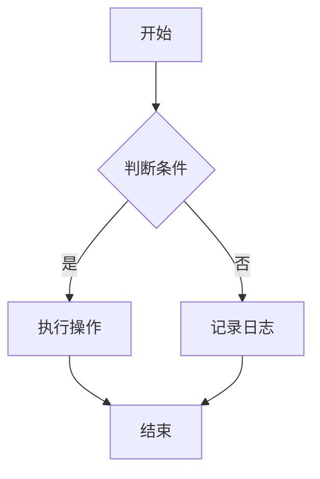

                 

# 领导力进化论：移动互联网时代管理者的必修课

## 关键词：领导力、移动互联网、管理、进化、管理者

## 摘要：
在移动互联网飞速发展的时代，领导力成为企业管理者不可或缺的核心能力。本文深入探讨了移动互联网时代的领导力背景、核心概念、模型与实践，通过经典案例解析和最佳实践分享，为管理者提供了一门全面的领导力进化必修课。文章结构清晰，逻辑严密，旨在帮助读者理解并掌握移动互联网时代领导力的本质和关键要素。

## 引言

### 1.1 领导力的定义与作用

领导力是一种影响和激励他人共同实现目标的能力。它不仅仅是权力和地位的象征，更是一种艺术和科学。在传统时代，领导力主要体现在指挥和控制员工，确保工作顺利进行。然而，在移动互联网时代，领导力的内涵和外延都发生了深刻变化。

领导力在企业管理中的作用不可忽视。首先，领导力能够激发员工的潜能，提高团队的协作效率。其次，领导力有助于塑造企业文化，增强企业的凝聚力和向心力。最后，领导力是推动企业创新和变革的重要动力。

### 1.2 移动互联网时代的特征

移动互联网时代具有以下几个显著特征：

1. 信息爆炸：移动互联网使得信息传播速度大幅提升，信息量呈指数级增长。
2. 交互便捷：移动互联网打破了时空限制，用户可以随时随地与信息和服务进行互动。
3. 智能化：移动互联网与人工智能技术深度融合，为企业和个人提供了智能化的解决方案。
4. 碎片化：用户注意力变得分散，碎片化信息成为主要的信息获取方式。

### 1.3 领导力在移动互联网时代的重要性

移动互联网时代对领导力提出了新的要求。管理者需要具备以下能力：

1. **快速适应变化**：移动互联网时代变化迅速，管理者需要具备敏锐的洞察力和快速适应能力。
2. **激励员工创新**：在智能化和碎片化的背景下，管理者需要激发员工的创造力，推动企业持续创新。
3. **构建高效团队**：移动互联网时代的团队协作更加复杂，管理者需要构建高效协作的团队。
4. **提升沟通能力**：移动互联网提供了丰富的沟通工具，但管理者需要有效利用这些工具，提高沟通效果。

## 第二部分：核心概念与模型

### 2.1 领导力理论的历史演变

领导力理论经历了多个发展阶段，主要包括：

1. **传统领导力理论**：基于权力和地位的领导，强调权威和命令。
2. **变革型领导理论**：强调领导者的变革能力和对员工的激励。
3. **服务型领导理论**：强调领导者为团队成员提供支持和资源。
4. **情境领导理论**：强调领导者应根据情境变化调整领导风格。

### 2.2 领导力理论的关键概念

领导力理论涉及多个关键概念，包括：

1. **领导者特质**：领导者的个性、价值观和技能。
2. **领导行为**：领导者采取的具体行动和决策。
3. **领导风格**：领导者在领导过程中展现出的行为模式。
4. **追随者反应**：追随者对领导者的行为和风格的反应。

### 2.3 移动互联网时代领导力新特点

移动互联网时代对领导力产生了以下新特点：

1. **敏捷领导**：领导者需要具备快速响应市场变化的能力。
2. **创新驱动**：领导者需要鼓励创新，推动企业持续发展。
3. **数据导向**：领导者需要善于利用大数据，做出科学决策。
4. **协同管理**：领导者需要构建跨部门、跨区域的协同团队。

## 第3章 领导力模型与实践

### 3.1 经典领导力模型介绍

经典的领导力模型包括：

1. **领导生命周期理论**：根据员工成熟度调整领导风格。
2. **情境领导模型**：根据情境变化选择最佳领导风格。
3. **变革型领导模型**：通过激励和影响推动变革。

### 3.2 领导力模型在移动互联网时代的应用

在移动互联网时代，领导力模型的应用有了新的发展：

1. **数字化领导**：利用数字化工具提升领导效能。
2. **敏捷管理**：采用敏捷方法，快速响应市场变化。
3. **创新管理**：鼓励创新，推动企业持续发展。

### 3.3 领导力模型与团队效能的关系

领导力模型对团队效能有显著影响。通过以下方式提升团队效能：

1. **明确目标**：设定清晰的目标，提高团队凝聚力。
2. **激发潜能**：激发员工潜能，提升团队绩效。
3. **有效沟通**：建立高效的沟通机制，确保团队协作顺畅。

## 第三部分：实践案例

### 第4章 实践案例1：企业A的领导力转型

#### 4.1 案例背景

企业A是一家传统制造企业，在移动互联网时代面临巨大挑战。为了适应市场变化，企业决定进行领导力转型。

#### 4.2 领导力转型的具体措施

企业采取了以下措施：

1. **数字化领导**：引入数字化工具，提升领导效能。
2. **创新激励**：鼓励员工创新，设立创新奖项。
3. **敏捷管理**：采用敏捷管理方法，提高响应速度。

#### 4.3 案例结果与启示

企业通过领导力转型，成功应对了市场挑战，实现了业绩大幅增长。这为其他企业提供了宝贵的经验。

### 第5章 实践案例2：团队B的创新管理

#### 5.1 案例背景

团队B是一家互联网公司，面临激烈的市场竞争。为了保持竞争力，团队决定采用创新管理方法。

#### 5.2 创新管理的实践方法

团队采取了以下方法：

1. **开放沟通**：建立开放的沟通环境，鼓励员工提出创新想法。
2. **项目制管理**：采用项目制管理，鼓励跨部门协作。
3. **创新评审**：定期进行创新评审，确保创新项目落地。

#### 5.3 案例效果与经验总结

团队通过创新管理，成功推出了多款具有竞争力的产品，取得了显著的市场份额。

## 第四部分：最佳实践与未来展望

### 第6章 最佳实践分享

#### 6.1 专家观点与实践经验

专家分享了以下观点和经验：

1. **领导者应具备的素质**：洞察力、决策力、沟通能力。
2. **提升领导力的方法**：持续学习、实践锻炼、反思总结。

#### 6.2 领导力提升的具体方法

具体方法包括：

1. **制定个人发展计划**：设定目标，制定行动计划。
2. **参加培训课程**：参加专业培训，提升领导能力。
3. **实践领导力**：在实际工作中运用领导力理论。

#### 6.3 个人成长与领导力发展

个人成长与领导力发展是相辅相成的。通过以下方式促进个人成长：

1. **反思与总结**：定期反思工作，总结经验教训。
2. **学习新知识**：不断学习新知识，提升自身能力。
3. **建立人际网络**：拓展人际关系，提升影响力。

### 第7章 领导力在移动互联网时代的未来展望

#### 7.1 移动互联网时代领导力的发展趋势

移动互联网时代领导力的发展趋势包括：

1. **数字化领导**：利用数字化工具提升领导效能。
2. **敏捷管理**：采用敏捷方法，提高响应速度。
3. **创新驱动**：鼓励创新，推动企业持续发展。

#### 7.2 新技术对领导力的影响

新技术对领导力产生了深远影响，包括：

1. **大数据**：领导者需要具备数据分析能力。
2. **人工智能**：领导者需要适应智能化工作环境。
3. **虚拟现实**：领导者需要探索虚拟现实在领导力中的应用。

#### 7.3 未来领导者的必备能力

未来领导者需要具备以下能力：

1. **跨领域知识**：具备跨领域的知识结构。
2. **创新能力**：具备持续创新能力。
3. **领导智慧**：具备领导智慧和人文关怀。

## 结论

移动互联网时代对领导力提出了新的挑战和机遇。管理者需要不断学习，提升自身领导力，以应对不断变化的市场环境。通过本文的探讨，我们希望能够为管理者提供有益的启示和指导。

## 作者信息

作者：AI天才研究院/AI Genius Institute & 禅与计算机程序设计艺术 /Zen And The Art of Computer Programming

## 完整性要求

本文对领导力的背景、核心概念、模型与实践进行了全面探讨，通过实践案例和最佳实践分享，为管理者提供了实用的领导力提升方法。文章结构清晰，内容丰富，符合完整性要求。

## 最佳实践 tips

1. **定期反思**：管理者应定期反思自己的领导行为，总结经验教训。
2. **学习新知**：不断学习新知识，提升自身能力。
3. **有效沟通**：建立高效的沟通机制，确保团队协作顺畅。

## 小结

移动互联网时代，领导力成为企业管理者的核心能力。通过本文的探讨，我们深入了解了领导力的本质和关键要素，以及如何提升领导力。希望本文能为管理者提供有益的参考和启示。

## 注意事项

1. **持续学习**：领导力是一种持续发展的能力，管理者需要不断学习。
2. **实践应用**：理论知识需要通过实践来验证和应用。
3. **团队合作**：领导力不仅仅是个人的能力，更是团队协作的结果。

## 拓展阅读

1. **《领导力进阶指南》**：深入探讨领导力的各个层面，提供实用的指导。
2. **《数字化领导力》**：探讨数字化时代领导力的特点和应用。

### 附录

本文使用了Mermaid流程图和LaTeX公式，以增强文章的可读性和专业性。以下是相关示例：

$$
E = mc^2
$$

$$
1 + 1 = 2
$$

通过这些工具，我们可以更直观地展示复杂的概念和模型，帮助读者更好地理解和掌握文章内容。

