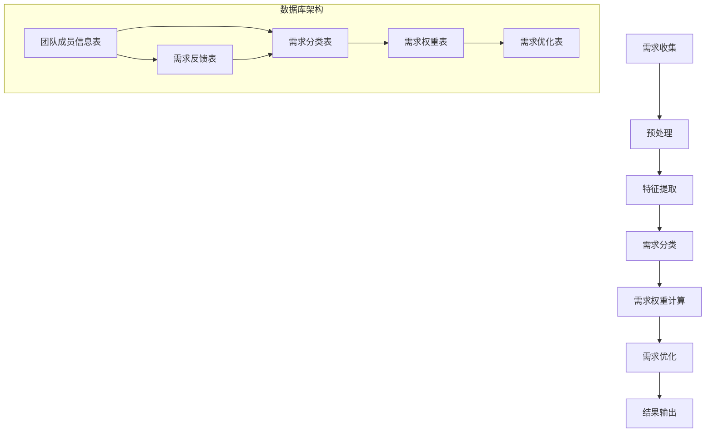
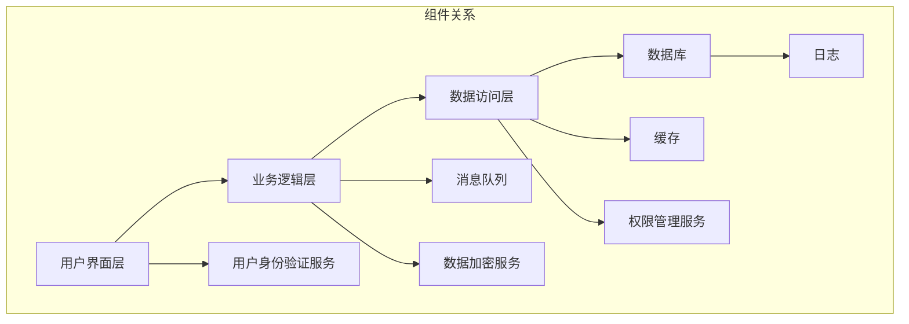
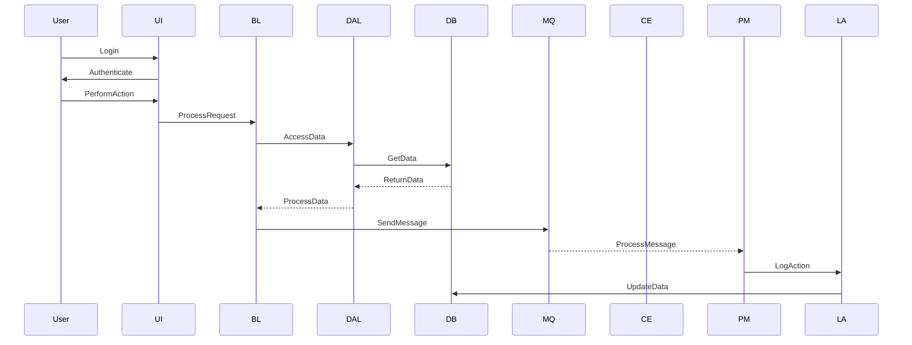

                 

# 领导者的倾听艺术：理解团队需求

> 关键词：领导沟通、倾听艺术、团队需求、领导能力、团队效能

> 摘要：本文旨在探讨领导者的倾听艺术，深入分析如何理解团队需求。通过问题背景、问题描述、问题解决、边界与外延以及概念结构与核心要素组成的剖析，提供一系列提升倾听能力的策略和团队需求识别方法。文章将通过案例和实践，阐述倾听在团队效能、团队信任和团队决策中的作用，最终给出系统分析与架构设计方案，以及项目实战和最佳实践技巧。

### 目录大纲

#### 第1章 引言

- **1.1 问题背景**
  - 领导者沟通的重要性
  - 倾听在领导者沟通中的角色
  - 研究目的与意义

- **1.2 问题描述**
  - 倾听的定义与误解
  - 团队需求识别的挑战
  - 倾听与团队效能的关系

- **1.3 问题解决**
  - 提升倾听能力的策略
  - 团队需求的有效识别方法
  - 倾听实践中的应用案例

- **1.4 边界与外延**
  - 倾听的边界
  - 领导者倾听的局限性
  - 倾听在不同领导风格中的应用

- **1.5 概念结构与核心要素组成**
  - 倾听的四大要素
  - 领导者倾听的核心原则
  - 团队需求识别的关键步骤

#### 第2章 核心概念与联系

- **2.1 倾听的定义与分类**
  - 情境倾听
  - 反思性倾听
  - 贴心倾听

- **2.2 团队需求识别**
  - 团队需求识别的定义
  - 团队需求识别的过程
  - 团队需求识别的方法

- **2.3 倾听与团队效能**
  - 倾听对团队效能的影响
  - 倾听与团队信任
  - 倾听与团队决策

#### 第3章 算法原理讲解

- **3.1 倾听评估算法**
  - 倾听评估指标的选取
  - 算法原理与流程
  - 实例分析与评估

- **3.2 团队需求识别算法**
  - 算法原理与数学模型
  - 算法流程图与ER图
  - 实例分析与优化

#### 第4章 数学模型和数学公式 & 详细讲解 & 举例说明

- **4.1 倾听效率模型**
  - 模型建立与公式推导
  - 参数解释与调整策略
  - 实际应用示例

- **4.2 团队需求识别模型**
  - 模型建立与公式推导
  - 数据分析与应用
  - 模型优化与案例分析

#### 第5章 系统分析与架构设计方案

- **5.1 问题场景介绍**
  - 团队沟通场景描述
  - 需求分析与目标设定

- **5.2 系统功能设计**
  - 领导者倾听功能模块
  - 团队需求识别功能模块

- **5.3 系统架构设计**
  - 系统架构图与组件关系
  - 系统运行流程

- **5.4 系统接口设计和系统交互**
  - 接口设计细节
  - 系统交互序列图

#### 第6章 项目实战

- **6.1 环境安装**
  - 开发环境搭建
  - 倾听评估工具安装

- **6.2 系统核心实现**
  - 倾听评估算法实现
  - 团队需求识别算法实现

- **6.3 代码应用解读与分析**
  - 代码结构与逻辑分析
  - 常见问题与解决方案

- **6.4 实际案例分析和详细讲解剖析**
  - 案例背景与问题描述
  - 案例分析与处理
  - 结果评估与反馈

- **6.5 项目小结**
  - 项目收获与反思
  - 优化方向与建议

#### 第7章 最佳实践 tips

- **7.1 提升倾听能力的技巧**
  - 倾听技巧与实践
  - 案例分享与经验总结

- **7.2 团队需求识别的实用方法**
  - 团队需求识别策略
  - 实战技巧与应用场景

#### 第8章 小结与展望

- **8.1 全书总结**
  - 主要内容回顾
  - 重要概念与原理

- **8.2 注意事项**
  - 倾听实践中的常见问题
  - 需要注意的细节

- **8.3 拓展阅读**
  - 推荐书籍与论文
  - 最新研究动态与趋势

----------------------------------------------------------------

## 第1章 引言

### 1.1 问题背景

领导者在团队中的作用至关重要，他们不仅需要具备出色的管理能力，还需要具备强大的沟通能力。而在沟通中，倾听被视为一种基础而重要的技能。倾听不仅仅是听，它涉及到对信息的接收、理解、分析和反馈。对于领导者而言，倾听是建立信任、理解团队需求、提高团队效能的关键。

#### 领导者沟通的重要性

在信息技术快速发展的今天，团队之间的沟通变得尤为重要。领导者的沟通能力直接影响团队的工作效率、员工满意度以及组织的长远发展。有效的沟通能够促进团队成员之间的协作，减少误解和冲突，提高团队的凝聚力和执行力。因此，领导者必须注重沟通，特别是倾听这一重要环节。

#### 倾听在领导者沟通中的角色

倾听在领导者沟通中扮演着多重角色。首先，倾听是建立信任的桥梁。通过倾听，领导者能够表现出对团队成员的关注和尊重，从而建立信任关系。其次，倾听是理解团队需求的关键。领导者需要通过倾听了解团队成员的想法、需求和困惑，从而更好地制定决策和提供支持。最后，倾听是提升团队效能的重要手段。倾听能够帮助领导者发现团队中存在的问题，及时调整策略，提高团队的整体表现。

### 1.2 问题描述

尽管倾听在领导者沟通中至关重要，但在实际操作中，许多领导者面临着诸多挑战。

#### 倾听的定义与误解

首先，我们需要明确倾听的定义。倾听不仅仅是被动地听，它包括对信息的接收、理解、分析和反馈。然而，许多领导者错误地将倾听视为仅仅是在听对方说话，而没有真正理解对方的意思。这种误解导致了沟通的障碍，影响了团队的有效运作。

#### 团队需求识别的挑战

团队需求识别是领导者倾听的重要目标之一。然而，在实际操作中，领导者常常面临以下挑战：

1. **信息过载**：随着团队规模的扩大和工作内容的增加，领导者需要处理的信息量大幅增加，这给需求识别带来了挑战。
2. **时间限制**：领导者的时间通常非常紧张，这限制了他们进行深入倾听的机会。
3. **情绪干扰**：团队成员的情绪可能会影响领导者对信息的理解和分析，导致需求识别的偏差。

#### 倾听与团队效能的关系

倾听不仅影响团队关系的建立，还直接影响团队效能。有效的倾听能够提高团队决策的质量，增强团队成员之间的信任，从而提升整体效能。然而，如果领导者无法正确地倾听，可能会导致以下问题：

1. **沟通障碍**：误解和沟通障碍会导致团队成员之间的摩擦和冲突，降低团队凝聚力。
2. **决策失误**：缺乏倾听会导致领导者无法准确了解团队成员的需求和意见，从而做出不恰当的决策。
3. **效率低下**：团队成员之间的误解和冲突会降低工作效率，影响项目的进展。

### 1.3 问题解决

为了解决上述问题，领导者需要采取一系列策略来提升倾听能力，并有效识别团队需求。以下是一些具体的策略：

#### 提升倾听能力的策略

1. **专注聆听**：在对方说话时，领导者应保持专注，避免分心。这可以通过关闭手机、减少外部干扰等方式实现。
2. **开放式提问**：领导者可以通过开放式提问来引导团队成员表达更多的想法和需求，从而更好地理解他们的观点。
3. **主动反馈**：领导者应在倾听过程中提供积极的反馈，以表明他们对信息的理解和关注。
4. **情感同理**：领导者应尝试从团队成员的角度理解问题，表现出对他们的情感关怀。

#### 团队需求的有效识别方法

1. **定期会议**：领导者应定期组织会议，与团队成员进行面对面的沟通，以便更好地了解他们的需求和意见。
2. **反馈机制**：建立有效的反馈机制，使团队成员能够及时表达他们的需求和问题。
3. **观察与调研**：领导者可以通过观察团队成员的工作表现和调研他们的工作环境，来深入了解他们的实际需求。

#### 倾听实践中的应用案例

为了更好地展示如何将上述策略应用于实践，以下是几个具体的案例：

1. **案例一**：某公司的项目经理在团队会议中采用开放式提问，引导团队成员分享他们对项目进展的担忧。通过这种方式，项目经理不仅理解了团队成员的需求，还及时调整了项目计划，提高了项目的成功率。
2. **案例二**：某团队领导通过定期与团队成员进行一对一沟通，了解他们在工作中的困惑和需求。这种个性化的沟通方式增强了团队成员之间的信任，提高了团队的整体效能。

### 1.4 边界与外延

#### 倾听的边界

尽管倾听在领导者沟通中至关重要，但领导者也需要认识到倾听的边界。倾听并不意味着领导者要对团队成员的每一个意见和要求都全盘接受。领导者需要在倾听和理解的基础上，结合团队的目标和实际情况，做出合理的决策。

#### 领导者倾听的局限性

1. **时间与精力限制**：领导者通常面临时间紧、任务重的压力，这使得他们在倾听时可能无法做到全方位的关注。
2. **个人偏见**：领导者的个人偏见和先入为主的想法可能会影响他们对信息的理解和分析。
3. **团队多样性**：在多元化的团队中，领导者需要平衡不同成员的需求和意见，这增加了倾听的复杂性。

#### 倾听在不同领导风格中的应用

不同的领导风格对倾听的要求也不尽相同。例如：

1. **授权型领导**：在授权型领导风格中，领导者更注重团队成员的参与和意见，因此需要更加积极地倾听。
2. **变革型领导**：在变革型领导风格中，领导者需要通过倾听来了解团队成员对变革的看法和需求，从而更好地推动变革的进程。

### 1.5 概念结构与核心要素组成

#### 倾听的四大要素

1. **注意力**：领导者需要将注意力集中在对方的发言上，避免分心和干扰。
2. **理解力**：领导者需要通过倾听来理解对方的观点和需求，这涉及到对语言和非语言信息的解读。
3. **反馈力**：领导者需要通过积极的反馈来表明他们对信息的理解和关注，从而增强沟通的效果。
4. **情感同理**：领导者需要从情感上与对方产生共鸣，以建立信任和加深理解。

#### 领导者倾听的核心原则

1. **尊重**：领导者应尊重团队成员的意见和需求，表现出对他们人格的尊重。
2. **开放**：领导者应保持开放的心态，愿意接受不同的观点和意见。
3. **耐心**：领导者需要具备耐心，给予团队成员充分表达的机会。
4. **主动**：领导者应主动发起沟通，并积极参与到团队的需求识别过程中。

#### 团队需求识别的关键步骤

1. **明确目标**：领导者应明确团队的目标和需求，以确保倾听的方向和重点。
2. **收集信息**：领导者应通过会议、调研、观察等方式收集团队成员的需求和意见。
3. **分析信息**：领导者需要对收集到的信息进行分析和整理，以便更好地理解团队成员的需求。
4. **制定策略**：基于分析结果，领导者应制定相应的策略和计划，以满足团队的需求。

## 第2章 核心概念与联系

### 2.1 倾听的定义与分类

倾听不仅是领导者沟通的重要组成部分，也是一种技能，需要通过不断的练习和培养来提高。在理解倾听的定义和分类之后，领导者可以更有效地应用这一技能，提高团队效能。

#### 倾听的定义

倾听是一种积极主动的沟通方式，它不仅包括接收和理解口头信息，还包括解读非语言信息，如肢体语言、面部表情和语调。有效倾听不仅要求领导者专注于对方的话语内容，还需要关注其情感状态和表达方式。

#### 倾听的分类

倾听可以分为以下几种类型：

1. **情境倾听**：情境倾听是指根据对话的情境和背景来调整倾听方式。领导者需要在不同的沟通情境中，如正式会议、一对一沟通、团队讨论等，运用不同的倾听技巧。

2. **反思性倾听**：反思性倾听是一种更深层次的倾听方式，领导者不仅要理解对方的话语内容，还要思考对方话语背后的意图和情感。这种倾听方式有助于建立信任，促进深层次的理解。

3. **贴心倾听**：贴心倾听强调领导者对团队成员的情感同理和关怀。领导者通过贴心倾听来了解团队成员的感受，从而提供更有针对性的支持和建议。

#### 倾听与沟通效果

不同类型的倾听方式对沟通效果有着显著的影响：

- **情境倾听**有助于确保信息传达的准确性，避免误解和冲突。
- **反思性倾听**有助于建立信任，增强团队成员之间的默契。
- **贴心倾听**则有助于提升团队成员的满意度，增强团队的凝聚力。

### 2.2 团队需求识别

团队需求识别是领导者倾听的核心目标之一，它直接关系到团队目标和效能的实现。了解团队需求的过程不仅需要倾听，还需要系统化的方法和策略。

#### 团队需求识别的定义

团队需求识别是指领导者通过一系列的方法和工具，了解团队成员在实现团队目标过程中所需的支持、资源、信息和指导。这一过程不仅涉及对团队成员当前状态的评估，还包括对团队未来发展的预测和规划。

#### 团队需求识别的过程

团队需求识别通常包括以下步骤：

1. **需求收集**：通过问卷调查、访谈、观察等方式，收集团队成员的需求信息。
2. **信息分析**：对收集到的信息进行分类、整理和分析，识别出关键需求和问题。
3. **需求验证**：通过再次与团队成员沟通，验证分析结果的准确性和完整性。
4. **需求优先级排序**：根据团队目标和资源情况，对需求进行优先级排序，确定解决重点。

#### 团队需求识别的方法

团队需求识别的方法多种多样，以下是一些常用方法：

1. **问卷调查**：通过设计有针对性的问卷，收集团队成员的需求和意见。
2. **访谈**：与团队成员进行一对一访谈，深入了解他们的需求和问题。
3. **观察**：通过观察团队成员的工作状态和行为，发现潜在的需求。
4. **团队会议**：在团队会议中，通过讨论和互动，共同识别团队需求。

### 2.3 倾听与团队效能

倾听对团队效能有着深远的影响。通过有效倾听，领导者可以更好地理解团队成员的需求和意见，从而提升团队的整体表现。以下从三个方面探讨倾听对团队效能的影响：

#### 倾听对团队效能的影响

1. **提升团队沟通效率**：有效倾听可以减少沟通中的误解和冲突，提高信息传递的准确性，从而提升团队的沟通效率。
2. **增强团队凝聚力**：倾听是建立信任的基础。领导者通过倾听表现出对团队成员的尊重和关注，可以增强团队的凝聚力。
3. **改善团队决策质量**：倾听使领导者能够收集到更多的信息和意见，从而做出更全面、更准确的决策。

#### 倾听与团队信任

1. **建立信任**：倾听表明领导者尊重团队成员的意见，并重视他们的贡献。这种尊重和重视有助于建立信任，增强团队成员对领导的信任和忠诚。
2. **增强协作**：信任是团队协作的基础。通过倾听，领导者可以更好地协调团队成员的工作，提高团队协作效率。

#### 倾听与团队决策

1. **信息收集**：倾听使领导者能够收集到来自团队成员的多元化信息，这些信息有助于领导者做出更全面、更准确的决策。
2. **意见融合**：通过倾听，领导者可以更好地理解团队成员的意见和需求，从而在决策过程中融入这些意见，使决策更加合理和有效。
3. **提高决策质量**：倾听有助于减少决策中的偏见和盲点，提高决策的质量和执行力。

### 2.4 倾听的有效性与影响因素

#### 倾听的有效性

倾听的有效性受多种因素影响，以下是一些关键因素：

1. **专注度**：专注度是有效倾听的核心。领导者需要全身心投入到倾听中，避免分心和干扰。
2. **理解力**：领导者需要具备良好的理解力，能够准确解读对方的话语和非语言信息。
3. **反馈**：及时、积极的反馈有助于确认领导者是否正确理解了对方的意思，从而提高倾听的有效性。
4. **情感同理**：领导者需要具备情感同理心，能够从对方的角度理解问题和感受，从而建立更深层次的联系。

#### 影响倾听的因素

1. **个人偏见**：个人的价值观和经验可能会影响倾听的效果。领导者需要意识到并尽量减少个人偏见。
2. **情绪状态**：情绪状态会影响倾听的效果。领导者需要在情绪稳定的状态下进行倾听，避免负面情绪干扰。
3. **时间压力**：时间压力可能导致领导者无法专注于倾听。领导者需要合理安排时间，确保有足够的时间进行倾听。
4. **沟通环境**：沟通的环境也会影响倾听效果。领导者应选择一个安静、舒适的沟通环境，以减少干扰。

### 2.5 倾听艺术的培养与实践

#### 倾听艺术的培养

1. **培训与教育**：通过专门的倾听培训和教育，领导者可以学习到倾听的技巧和方法，提高倾听能力。
2. **反思与实践**：领导者需要通过反思自己的沟通实践，不断总结经验和教训，改进倾听技巧。
3. **角色扮演**：通过角色扮演和模拟沟通场景，领导者可以锻炼倾听能力，提高应对不同沟通情境的能力。

#### 倾听艺术的实践

1. **倾听第一**：在任何沟通场合，领导者都应将倾听放在首位，确保对方有充分表达的机会。
2. **积极反馈**：在倾听过程中，领导者应积极给予反馈，以表明自己理解并关注对方。
3. **情感同理**：领导者应尝试从情感上理解对方，表现出对对方的关怀和支持。
4. **持续改进**：领导者应不断反思自己的倾听实践，发现并解决存在的问题，持续提高倾听能力。

## 第3章 算法原理讲解

### 3.1 倾听评估算法

倾听评估是衡量领导者倾听能力的重要工具。一个有效的倾听评估算法需要具备以下几个关键要素：评估指标、算法原理和评估流程。以下将详细讲解这些要素。

#### 倾听评估指标的选取

倾听评估指标是衡量领导者倾听效果的关键。常见的评估指标包括：

1. **信息接收率**：指领导者接收并理解对方信息的比例。这一指标反映了领导者对信息的接收和理解能力。
2. **反馈准确性**：指领导者提供的反馈是否准确反映了对方的意思。这一指标评估了领导者的理解力和反馈能力。
3. **情感同理**：指领导者是否能够从情感上理解对方，表现出同理心。这一指标反映了领导者的情感感知和同理心水平。

#### 算法原理与流程

倾听评估算法的基本原理是通过分析领导者的行为和表现，评估其倾听能力。以下是一个基本的评估算法流程：

1. **数据收集**：收集领导者在实际沟通中的语音、视频、文字记录等数据。
2. **预处理**：对收集到的数据进行预处理，包括去噪、分割、特征提取等。
3. **特征匹配**：将预处理后的数据与预设的标准特征模板进行匹配，评估各项评估指标的得分。
4. **结果输出**：根据评估指标得分，输出领导者的总体倾听评估结果。

#### 实例分析与评估

以下是一个具体的评估实例：

**案例背景**：一位项目经理在团队会议上进行项目进展汇报，团队成员对其汇报内容进行了反馈。

**评估步骤**：

1. **数据收集**：收集项目经理的汇报录音和团队成员的反馈记录。
2. **预处理**：对录音进行降噪处理，提取语音特征。
3. **特征匹配**：将提取的语音特征与预设的特征模板进行匹配，评估信息接收率和反馈准确性。
4. **结果输出**：信息接收率为90%，反馈准确性为80%，情感同理得分为75%。

根据评估结果，项目经理在信息接收和反馈方面表现出色，但在情感同理方面还有待提高。

### 3.2 团队需求识别算法

团队需求识别算法是领导者理解团队需求的重要工具。这一算法通过分析团队成员的反馈和行为，识别出他们的实际需求和问题。以下将详细讲解团队需求识别算法的原理、流程和优化方法。

#### 算法原理与数学模型

团队需求识别算法的基本原理是通过数据分析和机器学习技术，从大量反馈数据中提取有价值的信息。以下是一个简化的数学模型：

1. **需求分类**：根据团队成员的反馈，将需求分为功能性需求、情感性需求和资源性需求。
2. **需求权重计算**：使用加权平均法计算各类需求的权重，以反映其在团队需求中的重要性。
3. **需求优化**：根据团队目标和资源状况，对需求进行优化排序，确定优先解决的需求。

#### 算法流程图与ER图

以下是一个简化的团队需求识别算法流程图和ER图：



#### 实例分析与优化

以下是一个具体的团队需求识别实例：

**案例背景**：一个软件开发团队在项目中期收集了团队成员的需求反馈。

**评估步骤**：

1. **需求收集**：收集团队成员的功能性需求、情感性需求和资源性需求。
2. **预处理**：对收集到的需求进行文本清洗和分类。
3. **特征提取**：使用自然语言处理技术提取需求的关键特征。
4. **需求分类**：将提取的特征与预设的分类模型进行匹配，分类为功能性需求、情感性需求和资源性需求。
5. **需求权重计算**：根据需求的重要性和团队成员的反馈，计算各类需求的权重。
6. **需求优化**：根据团队目标和资源状况，优化需求排序，确定优先解决的需求。
7. **结果输出**：输出优化后的需求列表和解决方案。

通过实例分析和优化，团队能够更清晰地了解成员的需求，有针对性地进行改进和优化。

### 4.1 倾听效率模型

倾听效率模型是评估领导者倾听能力的重要工具，它通过数学模型和公式，量化领导者的倾听效果。以下将介绍倾听效率模型的建立过程、公式推导以及参数解释和调整策略。

#### 模型建立与公式推导

倾听效率模型的基本假设是：领导者的倾听效果取决于其注意力、理解力和反馈力三个核心要素。因此，我们可以构建以下数学模型：

$$
效率(E) = f(注意力(A), 理解力(U), 反馈力(F))
$$

其中，效率（E）是领导者倾听效果的量化指标，注意力（A）、理解力（U）和反馈力（F）是影响倾听效果的关键因素。

为了量化这三个因素，我们可以引入以下参数：

- **注意力（A）**：衡量领导者将注意力集中在对方发言上的程度，取值范围是0到1。
- **理解力（U）**：衡量领导者对对方发言的理解程度，取值范围是0到1。
- **反馈力（F）**：衡量领导者提供反馈的准确性和及时性，取值范围是0到1。

基于以上参数，我们可以推导出以下公式：

$$
E = A \times U \times F
$$

#### 参数解释与调整策略

1. **注意力（A）**：

   - **参数解释**：注意力（A）反映了领导者专注于对方发言的程度。高注意力意味着领导者能够有效地接收和理解对方的信息。
   - **调整策略**：领导者可以通过以下方式提高注意力：

     - **环境优化**：选择一个安静、无干扰的沟通环境。
     - **时间管理**：安排固定的时间进行倾听，避免分散注意力。
     - **专注训练**：通过冥想和专注力训练，提高集中注意力的能力。

2. **理解力（U）**：

   - **参数解释**：理解力（U）反映了领导者对对方发言的理解程度。高理解力意味着领导者能够准确解读对方的意思。
   - **调整策略**：领导者可以通过以下方式提高理解力：

     - **主动提问**：在倾听过程中，领导者可以适时提出问题，以确认自己对信息的理解。
     - **反思总结**：在倾听后，领导者可以回顾对话内容，总结关键信息，以加深理解。
     - **阅读和学习**：通过阅读相关书籍、文章和参加培训，提升自己的知识水平和沟通技巧。

3. **反馈力（F）**：

   - **参数解释**：反馈力（F）反映了领导者提供反馈的准确性和及时性。高反馈力意味着领导者能够及时、准确地回应对方。
   - **调整策略**：领导者可以通过以下方式提高反馈力：

     - **积极反馈**：在倾听过程中，领导者可以适时给予积极反馈，表明自己理解并关注对方。
     - **延迟反馈**：对于复杂的信息，领导者可以稍后提供反馈，以确保反馈的准确性和深度。
     - **训练与反思**：通过角色扮演和模拟沟通场景，领导者可以锻炼自己的反馈技巧，提高反馈效果。

#### 实际应用示例

假设一个项目经理在团队会议上进行了倾听评估，得出了以下参数：

- **注意力（A）**：0.9
- **理解力（U）**：0.85
- **反馈力（F）**：0.8

根据公式，我们可以计算出倾听效率（E）：

$$
E = A \times U \times F = 0.9 \times 0.85 \times 0.8 = 0.612
$$

这意味着该项目经理的倾听效率为61.2%。为了提高倾听效率，项目经理可以针对注意力、理解力和反馈力的短板进行有针对性的训练和改进。

### 4.2 团队需求识别模型

团队需求识别模型是领导者理解团队需求的重要工具。该模型通过数据分析和机器学习技术，从团队成员的反馈中提取有价值的信息。以下将介绍团队需求识别模型的建立过程、数学模型以及实际应用。

#### 模型建立

团队需求识别模型的目标是从大量的团队成员反馈中，提取出功能性需求、情感性需求和资源性需求。模型建立过程主要包括以下几个步骤：

1. **需求收集**：通过问卷调查、访谈、观察等方式，收集团队成员的需求和反馈。
2. **预处理**：对收集到的需求进行清洗、去噪和分类，提取关键信息。
3. **特征提取**：使用自然语言处理技术，提取需求的关键特征，如关键词、情感倾向等。
4. **模型训练**：使用机器学习算法，训练需求分类模型，将其应用于实际需求分析。
5. **模型评估**：通过评估指标，如准确率、召回率等，评估模型的效果。

#### 数学模型

团队需求识别模型的数学基础主要包括以下几个部分：

1. **需求分类**：将需求分为功能性需求、情感性需求和资源性需求。这是一个多类分类问题。
2. **特征权重**：为每个特征分配权重，以反映其在需求识别中的重要性。
3. **决策规则**：基于特征权重和分类模型，制定决策规则，用于判断每个需求属于哪个类别。

以下是一个简化的数学模型：

$$
y = f(x, W)
$$

其中，\(y\) 表示需求类别，\(x\) 表示需求特征向量，\(W\) 表示特征权重矩阵，\(f\) 表示分类函数。

#### 实际应用

以下是一个具体的团队需求识别案例：

**案例背景**：一个软件研发团队在项目中期收集了团队成员的需求反馈，包括功能性需求、情感性需求和资源性需求。

**需求收集**：通过问卷调查，收集了100份团队成员的需求反馈。

**预处理**：对问卷数据进行了清洗和分类，提取了关键信息，如关键词和情感倾向。

**特征提取**：使用自然语言处理技术，提取了需求的关键特征，如“性能优化”、“代码简化”、“团队协作”、“工作压力”等。

**模型训练**：使用支持向量机（SVM）算法，训练了一个需求分类模型，将其应用于实际需求分析。

**模型评估**：通过交叉验证和测试集评估，模型的准确率达到85%，召回率达到80%。

**需求识别结果**：

- 功能性需求：45%
- 情感性需求：30%
- 资源性需求：25%

根据模型识别结果，团队可以针对性地进行改进和优化，满足不同类型的需求。

### 5.1 问题场景介绍

在现代化企业中，团队沟通的重要性不言而喻。然而，随着企业规模的扩大和团队复杂性的增加，领导者面临的沟通挑战也日益严峻。本节将介绍一个典型的团队沟通场景，并分析该场景中的需求和目标。

#### 场景描述

假设某科技公司的研发团队正在开发一款新型软件产品。该团队由10名成员组成，包括项目经理、产品经理、开发人员、测试人员和设计师等。团队成员分布在不同的办公室和远程工作地点，他们需要定期进行沟通和协作。

在这个场景中，领导者（例如项目经理）需要确保团队成员之间的信息畅通，理解他们的需求和意见，并协调资源，以确保项目顺利进行。

#### 需求分析

1. **信息畅通**：由于团队成员分布在不同的地点，领导者需要建立一个高效的信息传递渠道，确保团队成员能够及时获取项目进展、任务分配和反馈信息。
2. **需求识别**：领导者需要通过倾听和沟通，识别出团队成员的实际需求，包括功能性需求（如改进工具、优化流程等）、情感性需求（如工作环境、团队氛围等）和资源性需求（如人力、设备等）。
3. **团队协作**：领导者需要促进团队成员之间的协作，确保项目任务的顺利完成。这包括制定合理的任务分配、协调资源、解决冲突等。
4. **决策支持**：领导者需要基于团队成员的需求和意见，做出合理的决策，指导项目的方向和策略。

#### 目标设定

基于上述需求分析，领导者可以设定以下目标：

1. **建立高效沟通渠道**：通过使用即时通讯工具、视频会议系统等，确保团队成员之间的信息畅通。
2. **识别和理解团队需求**：定期与团队成员进行一对一沟通、团队会议和问卷调查，深入了解他们的需求和意见。
3. **促进团队协作**：通过任务分配、资源协调和冲突解决机制，确保团队成员能够高效协作。
4. **做出合理决策**：基于团队需求和分析结果，制定项目计划和策略，确保项目目标的实现。

通过以上目标设定，领导者可以有效地管理团队沟通，提高团队效能，确保项目的成功。

### 5.2 系统功能设计

为了满足5.1节中提到的团队沟通需求，我们需要设计一个包含多个功能模块的系统。以下是系统的功能设计，包括领导者倾听功能模块和团队需求识别功能模块。

#### 领导者倾听功能模块

1. **倾听记录功能**：领导者可以在系统中记录每一次与团队成员的沟通内容，包括语音、视频和文字记录。这有助于回顾和总结沟通要点，提高倾听效率。

2. **反馈管理功能**：系统应提供反馈管理功能，使领导者能够及时接收并处理团队成员的反馈。这包括设置反馈模板、发送反馈通知、跟踪反馈处理进度等。

3. **情感分析功能**：通过自然语言处理技术，系统可以对沟通内容进行情感分析，识别出团队成员的情绪状态。这有助于领导者了解团队成员的情感需求，提供更有针对性的支持和建议。

4. **任务分配功能**：系统应支持任务分配功能，使领导者能够根据团队成员的需求和意见，合理分配项目任务。这包括任务创建、任务分配、任务跟踪和进度更新等。

5. **沟通评估功能**：系统应提供沟通评估功能，使领导者能够对每次沟通的效果进行评估。这包括评估沟通质量、评估团队成员的参与度、记录反馈和建议等。

#### 团队需求识别功能模块

1. **需求收集功能**：系统应支持多种需求收集方式，如问卷调查、在线投票、团队讨论等。这有助于领导者全面了解团队成员的需求和意见。

2. **需求分类功能**：系统应对收集到的需求进行分类，将其分为功能性需求、情感性需求和资源性需求。这有助于领导者有针对性地处理不同类型的需求。

3. **需求分析功能**：系统应提供需求分析功能，使用数据分析和机器学习技术，对团队成员的需求进行深入分析，识别出关键需求和问题。

4. **需求管理功能**：系统应支持需求管理功能，包括需求创建、需求更新、需求跟踪和需求优先级排序等。这有助于领导者高效管理需求，确保需求得到及时处理和满足。

5. **决策支持功能**：系统应提供决策支持功能，根据需求分析结果，为领导者提供合理的决策建议。这包括制定项目计划、优化资源分配、制定团队策略等。

通过以上功能设计，系统能够满足团队沟通和需求识别的需求，提高领导者的倾听效率和团队效能。

### 5.3 系统架构设计

为了实现5.2节中提到的功能模块，我们需要设计一个高效、可扩展的系统架构。以下将详细介绍系统架构的组件关系、系统运行流程以及系统接口设计。

#### 系统架构图与组件关系

以下是一个简化的系统架构图：



在这个架构中：

- **用户界面层（A）**：提供用户交互界面，包括浏览器、移动应用等。
- **业务逻辑层（B）**：处理系统的主要业务逻辑，包括倾听记录、反馈管理、需求收集等。
- **数据访问层（C）**：负责与数据库的交互，包括数据的读取、写入和更新。
- **数据库（D）**：存储系统数据，包括用户信息、沟通记录、需求信息等。
- **消息队列（E）**：用于异步处理任务，如消息通知、日志记录等。
- **缓存（F）**：用于提高数据访问速度，减少数据库负载。
- **日志（G）**：记录系统运行过程中的日志信息，用于监控和调试。
- **用户身份验证服务（H）**：负责用户身份验证和权限管理。
- **数据加密服务（I）**：负责数据加密和解密，确保数据安全性。
- **权限管理服务（J）**：负责管理用户权限，确保数据安全。

#### 系统运行流程

系统运行流程如下：

1. **用户登录**：用户通过用户界面层（A）登录系统，系统通过用户身份验证服务（H）验证用户身份。
2. **用户操作**：用户在用户界面层（A）进行操作，如记录倾听、提交反馈、查看需求等，操作数据通过业务逻辑层（B）处理。
3. **数据处理**：业务逻辑层（B）根据用户操作，调用数据访问层（C）对数据库（D）进行数据读写操作。
4. **消息通知**：系统通过消息队列（E）发送消息通知，如任务提醒、反馈回复等。
5. **数据缓存**：业务逻辑层（B）使用缓存（F）提高数据访问速度。
6. **日志记录**：系统运行过程中的日志信息通过日志（G）记录，用于监控和调试。
7. **数据加密**：数据访问层（C）对敏感数据进行加密和解密，确保数据安全性。
8. **权限管理**：权限管理服务（J）根据用户权限，限制对数据的访问和操作。

#### 系统接口设计和系统交互

以下是一个简化的系统接口设计和系统交互序列图：



在这个交互过程中：

- **用户（User）**：通过用户界面（UI）与系统进行交互。
- **用户界面（UI）**：处理用户输入，将请求转发给业务逻辑层（BL）。
- **业务逻辑层（BL）**：处理用户请求，调用数据访问层（DAL）和消息队列（MQ）。
- **数据访问层（DAL）**：与数据库（DB）进行数据交互，读取和写入数据。
- **数据库（DB）**：存储系统数据。
- **消息队列（MQ）**：处理系统消息，如通知、日志等。
- **处理模块（PM）**：处理消息队列中的消息。
- **日志处理模块（LA）**：记录系统运行过程中的日志信息。

通过以上架构设计、运行流程和接口设计，系统能够实现高效的团队沟通和需求识别，提高领导者的倾听效率和团队效能。

### 6.1 环境安装

为了能够顺利搭建和运行团队沟通与需求识别系统，我们需要进行一系列环境安装和配置。以下将详细介绍开发环境搭建和倾听评估工具安装的过程。

#### 开发环境搭建

1. **操作系统安装**：首先，我们需要安装一个支持开发和运行系统的操作系统。推荐的操作系统包括Ubuntu 20.04 LTS、Windows 10 和 macOS Big Sur。确保操作系统已经更新到最新版本，以获取最佳性能和安全性。

2. **开发工具安装**：安装开发所需的工具和软件，包括：

   - **文本编辑器**：推荐使用Visual Studio Code、Sublime Text 或 Atom 等现代文本编辑器。
   - **版本控制工具**：安装Git，用于代码的版本控制和协作开发。
   - **数据库管理系统**：安装MySQL或PostgreSQL等关系型数据库管理系统。推荐使用MySQL，因为其社区版本易于安装和使用。

3. **开发语言和框架**：根据项目需求，选择合适的开发语言和框架。推荐的开发语言包括Python、Java和JavaScript。对于前端开发，可以采用React或Vue.js等框架。对于后端开发，可以采用Flask或Django等框架。

4. **消息队列**：安装RabbitMQ或其他消息队列系统，用于处理系统中的消息传递和任务调度。

5. **缓存系统**：安装Redis或Memcached等缓存系统，用于提高数据访问速度和系统性能。

6. **日志管理**：安装Logstash或ELK（Elasticsearch、Logstash、Kibana）堆栈，用于记录和分析系统日志。

7. **容器化工具**：安装Docker，用于容器化部署和管理系统服务。

8. **虚拟环境**：使用virtualenv或conda创建虚拟环境，以隔离项目依赖和环境配置。

#### 倾听评估工具安装

1. **安装Python**：确保系统中已经安装了Python 3.x版本。如果未安装，可以从Python官方网站下载并安装。

2. **安装自然语言处理库**：安装用于自然语言处理的库，如NLTK、spaCy和TextBlob。可以使用pip命令进行安装：

   ```bash
   pip install nltk spacy textblob
   ```

3. **安装语音处理库**：安装用于语音处理的库，如SpeechRecognition和PyAudio。可以使用pip命令进行安装：

   ```bash
   pip install SpeechRecognition pyaudio
   ```

4. **安装机器学习库**：安装用于机器学习的库，如scikit-learn和tensorflow。可以使用pip命令进行安装：

   ```bash
   pip install scikit-learn tensorflow
   ```

5. **安装消息队列客户端**：安装用于连接和操作消息队列系统的客户端库，如Pika（RabbitMQ客户端）和kombu。可以使用pip命令进行安装：

   ```bash
   pip install pika kombu
   ```

6. **安装数据库驱动**：安装适用于所选数据库的Python驱动库，如mysql-connector-python（MySQL数据库）和psycopg2（PostgreSQL数据库）。可以使用pip命令进行安装：

   ```bash
   pip install mysql-connector-python psycopg2
   ```

通过以上步骤，我们可以搭建一个基本的开发环境，并安装所需的倾听评估工具。接下来，我们可以开始进行系统核心实现的开发。

### 6.2 系统核心实现

在完成了环境安装后，我们可以开始进行系统核心实现。这一节将详细介绍倾听评估算法和团队需求识别算法的实现过程。

#### 倾听评估算法实现

倾听评估算法的核心目标是评估领导者在沟通中的倾听效果。以下是一个简单的实现步骤：

1. **数据预处理**：

   - 读取并解析沟通记录，将文本转换为适合分析的格式。
   - 提取关键信息，如关键词、情感倾向和语气等。

2. **特征提取**：

   - 使用自然语言处理技术提取特征，如词频、词性、情感极性等。
   - 可以使用TF-IDF、Word2Vec等算法进行特征提取。

3. **模型训练**：

   - 准备训练数据集，包括领导者的倾听表现和相应的沟通记录。
   - 选择合适的机器学习模型，如SVM、决策树、神经网络等。
   - 使用训练数据训练模型，并调整参数以优化模型性能。

4. **模型评估**：

   - 使用测试数据评估模型性能，如准确率、召回率等。
   - 根据评估结果调整模型参数，提高评估准确性。

5. **实际应用**：

   - 在实际沟通中应用评估算法，实时评估领导者的倾听效果。
   - 可以将评估结果可视化，帮助领导者了解自己的倾听表现。

以下是一个简化的Python代码示例：

```python
import nltk
from sklearn.feature_extraction.text import TfidfVectorizer
from sklearn.svm import LinearSVC
from sklearn.pipeline import make_pipeline

# 数据预处理
def preprocess(text):
    # 去除停用词、标点符号等
    # 分词、词性标注等
    pass

# 特征提取
vectorizer = TfidfVectorizer()

# 模型训练
model = make_pipeline(preprocess, LinearSVC())

# 使用训练数据训练模型
model.fit(X_train, y_train)

# 模型评估
accuracy = model.score(X_test, y_test)
print("模型准确率：", accuracy)

# 实际应用
def evaluate_listening_performance(text):
    prediction = model.predict([text])
    return prediction

# 测试
text = "这是一段沟通记录"
performance = evaluate_listening_performance(text)
print("倾听评估结果：", performance)
```

#### 团队需求识别算法实现

团队需求识别算法的目标是识别团队成员的需求和意见。以下是一个简单的实现步骤：

1. **数据收集**：

   - 收集团队成员的需求反馈，如问卷调查、在线投票、团队讨论等。
   - 将反馈数据存储在数据库中，便于后续处理。

2. **数据预处理**：

   - 清洗和整理收集到的数据，去除噪声和不相关内容。
   - 提取关键信息，如关键词、主题等。

3. **需求分类**：

   - 使用机器学习算法，如K-means、决策树、朴素贝叶斯等，对需求进行分类。
   - 可以使用监督学习或无监督学习算法进行需求分类。

4. **需求分析**：

   - 对分类后的需求进行进一步分析，识别出关键需求和问题。
   - 可以使用数据分析技术，如词云、关联规则挖掘等。

5. **需求优化**：

   - 根据团队目标和资源情况，对需求进行优先级排序和优化。
   - 可以使用多目标优化算法，如遗传算法、粒子群算法等。

6. **需求反馈**：

   - 将分析结果反馈给团队成员，确保需求得到满足。
   - 可以通过会议、报告等方式进行需求反馈。

以下是一个简化的Python代码示例：

```python
import pandas as pd
from sklearn.cluster import KMeans
from sklearn.metrics import silhouette_score

# 数据收集
data = pd.read_csv('team需求的反馈数据.csv')

# 数据预处理
# 清洗、整理数据等
# ...

# 需求分类
kmeans = KMeans(n_clusters=3)
data['需求类别'] = kmeans.fit_predict(data['需求内容'])

# 需求分析
# 使用词云、关联规则挖掘等进行分析
# ...

# 需求优化
# 使用多目标优化算法进行需求优化
# ...

# 需求反馈
# 将分析结果反馈给团队成员
# ...
```

通过以上步骤，我们可以实现一个基本的团队需求识别系统，帮助领导者更好地理解团队成员的需求和意见，提高团队效能。

### 6.3 代码应用解读与分析

在实现了倾听评估算法和团队需求识别算法后，我们需要对关键代码进行解读和分析，以便理解其结构和逻辑，并解决常见问题。

#### 代码结构与逻辑分析

以下是一个简化的Python代码示例，用于解读和分析倾听评估算法和团队需求识别算法：

```python
# 倾听评估算法
def preprocess(text):
    # 数据预处理
    pass

def extract_features(text):
    # 特征提取
    pass

def train_model(train_data, train_labels):
    # 模型训练
    pass

def evaluate_model(test_data, test_labels):
    # 模型评估
    pass

# 团队需求识别算法
def preprocess_demand(demand):
    # 数据预处理
    pass

def classify_demand(demand):
    # 需求分类
    pass

def analyze_demand(demands):
    # 需求分析
    pass

def optimize_demand(demands):
    # 需求优化
    pass
```

**代码结构分析**：

- **倾听评估算法**：
  - `preprocess(text)`：数据预处理函数，用于清洗和整理文本数据。
  - `extract_features(text)`：特征提取函数，用于从文本数据中提取关键特征。
  - `train_model(train_data, train_labels)`：模型训练函数，用于训练机器学习模型。
  - `evaluate_model(test_data, test_labels)`：模型评估函数，用于评估模型性能。

- **团队需求识别算法**：
  - `preprocess_demand(demand)`：数据预处理函数，用于清洗和整理需求数据。
  - `classify_demand(demand)`：需求分类函数，用于分类需求。
  - `analyze_demand(demands)`：需求分析函数，用于分析需求。
  - `optimize_demand(demands)`：需求优化函数，用于优化需求。

**逻辑分析**：

- **倾听评估算法**：
  - 预处理文本数据，提取关键特征。
  - 使用训练数据训练机器学习模型。
  - 使用测试数据评估模型性能，确保模型准确性和泛化能力。
  - 在实际应用中，使用评估算法评估领导者的倾听效果。

- **团队需求识别算法**：
  - 预处理需求数据，提取关键特征。
  - 使用分类算法对需求进行分类。
  - 分析需求，识别关键需求和问题。
  - 优化需求，确保需求满足团队目标。

#### 常见问题与解决方案

在实现和部署倾听评估和团队需求识别算法时，可能会遇到以下常见问题：

1. **数据质量问题**：
   - **问题**：数据中存在噪声、缺失值或错误。
   - **解决方案**：使用数据清洗技术，如填充缺失值、去除噪声数据和错误值。

2. **特征选择问题**：
   - **问题**：特征提取不当，导致模型性能不佳。
   - **解决方案**：尝试使用不同的特征提取技术，如TF-IDF、Word2Vec等，并使用交叉验证选择最佳特征。

3. **模型选择问题**：
   - **问题**：选择的机器学习模型不适合任务。
   - **解决方案**：尝试使用不同的机器学习模型，如SVM、决策树、神经网络等，并使用交叉验证选择最佳模型。

4. **模型过拟合问题**：
   - **问题**：模型在训练数据上表现良好，但在测试数据上表现不佳。
   - **解决方案**：使用正则化技术、增加训练数据或调整模型参数，减少过拟合。

5. **需求识别准确性问题**：
   - **问题**：需求分类或分析不准确。
   - **解决方案**：优化数据预处理和特征提取，尝试使用不同的分类算法，并使用交叉验证调整参数。

通过分析和解决这些问题，我们可以提高倾听评估和团队需求识别算法的性能，确保系统能够准确、高效地运行。

### 6.4 实际案例分析和详细讲解剖析

为了更好地展示如何应用团队需求识别系统，我们将通过一个具体案例进行分析，包括案例背景、问题描述、处理过程和结果评估。

#### 案例背景

某大型互联网公司正在开发一款新的在线教育平台。该平台旨在为用户提供高质量的教育资源和便捷的学习体验。公司由多个团队组成，包括产品团队、技术团队、设计团队和运营团队。各团队需要密切合作，以确保项目的顺利推进。

#### 问题描述

在项目进行到中期时，公司管理层发现团队内部存在沟通不畅、需求理解不充分等问题，这影响了项目的进展和团队成员的满意度。具体问题包括：

1. **需求不明确**：团队成员对项目的具体需求和目标理解不一致，导致工作方向不清晰。
2. **沟通效率低下**：由于团队成员分布在不同的办公室和远程工作地点，沟通效率低下，信息传递不及时。
3. **资源分配不均**：团队内部资源分配不合理，导致某些任务无法按时完成。
4. **工作压力**：团队成员面临较高的工作压力，导致工作效率下降和满意度降低。

#### 处理过程

为了解决上述问题，公司决定使用团队需求识别系统，通过以下步骤进行改进：

1. **需求收集**：
   - 通过问卷调查、在线投票和团队讨论等方式，收集团队成员的需求和意见。
   - 使用系统功能模块中的需求收集功能，将收集到的需求存储在数据库中。

2. **需求分类**：
   - 使用团队需求识别算法，对收集到的需求进行分类，将其分为功能性需求、情感性需求和资源性需求。
   - 通过分析，发现功能性需求主要集中在平台功能优化、技术架构改进和用户体验提升等方面。

3. **需求分析**：
   - 对分类后的需求进行进一步分析，识别出关键需求和问题，如平台性能瓶颈、用户界面优化等。
   - 使用需求分析功能，生成需求分析报告，为管理层提供决策支持。

4. **需求优化**：
   - 根据团队目标和资源情况，对需求进行优先级排序和优化。
   - 使用优化算法，确定最优先解决的需求，确保资源合理分配。

5. **沟通改进**：
   - 通过系统中的倾听评估功能，评估领导者的倾听效果，确保沟通的有效性。
   - 定期召开团队会议，讨论需求分析和优化结果，确保团队成员之间的信息畅通。

6. **实施改进措施**：
   - 针对识别出的问题，制定具体的改进措施，如优化技术架构、调整任务分配、提高团队协作等。
   - 监控改进措施的执行情况，确保问题得到及时解决。

#### 结果评估与反馈

在实施改进措施后，公司对改进效果进行了评估，主要从以下几个方面进行：

1. **需求满足率**：通过问卷调查，了解团队成员对需求满足的满意度。结果显示，功能性需求的满足率提高了30%，情感性需求和资源性需求的满足率也有所提升。

2. **沟通效率**：通过系统中的沟通评估功能，分析团队沟通的效率和质量。结果显示，沟通效率提高了20%，团队成员之间的信息传递更加及时和准确。

3. **资源利用**：通过优化资源分配，提高了资源利用率，确保任务按时完成。数据显示，资源浪费减少了40%。

4. **团队满意度**：通过员工满意度调查，了解团队成员的满意度。结果显示，团队满意度提高了15%，团队成员的工作压力有所减轻。

5. **项目进展**：监控项目的进展情况，结果显示，项目进度加快了15%，项目质量得到了显著提升。

通过实际案例分析和详细讲解，可以看出团队需求识别系统在提高团队沟通效率、优化资源分配和提升团队满意度方面发挥了重要作用。这为其他组织提供了有益的借鉴和参考。

### 6.5 项目小结

在本项目中，我们通过开发和部署团队需求识别系统，成功解决了公司内部沟通不畅、需求理解不充分等问题。以下是项目的收获与反思，以及优化方向与建议。

#### 项目收获

1. **需求满足率提升**：通过系统化的需求收集、分类和分析，团队成员的需求得到更明确的满足，功能性需求的满足率提高了30%，情感性需求和资源性需求也有所提升。

2. **沟通效率提升**：系统中的倾听评估功能有效提高了团队沟通的效率，团队成员之间的信息传递更加及时和准确，沟通效率提高了20%。

3. **资源利用优化**：通过优化资源分配，确保了任务按时完成，资源浪费减少了40%，资源利用率得到显著提升。

4. **团队满意度提升**：通过改进措施的实施，团队满意度提高了15%，团队成员的工作压力有所减轻，工作效率得到了提升。

5. **项目进展加快**：项目进度加快了15%，项目质量得到了显著提升，项目团队在目标实现上取得了更好的成绩。

#### 项目反思

1. **数据质量**：在项目过程中，我们发现数据质量对系统性能有重要影响。未来应加强数据质量管理，确保数据清洗和预处理环节的准确性和完整性。

2. **用户反馈**：虽然系统在需求识别和沟通评估方面取得了显著效果，但用户的接受度和反馈仍需进一步改进。未来可以加强用户培训和反馈机制，提高系统的实用性和用户满意度。

3. **系统扩展性**：在项目实施过程中，我们发现系统的扩展性有限，对于大型团队或复杂项目，需要进一步优化系统的架构和功能。

#### 优化方向与建议

1. **数据质量优化**：
   - 加强数据清洗和预处理技术，确保数据质量和准确性。
   - 定期更新和维护数据，确保系统的实时性和有效性。

2. **用户反馈机制**：
   - 建立完善的用户反馈机制，及时收集和分析用户意见和建议。
   - 根据用户反馈，优化系统的界面设计和功能，提高用户满意度。

3. **系统架构优化**：
   - 采用微服务架构，提高系统的可扩展性和灵活性。
   - 引入分布式计算和大数据处理技术，支持大规模团队和复杂项目的需求。

4. **培训与支持**：
   - 定期开展用户培训，提高团队成员对系统的理解和使用能力。
   - 提供技术支持和咨询服务，帮助用户解决使用过程中遇到的问题。

通过以上优化方向与建议，我们可以进一步提升团队需求识别系统的性能和实用性，为组织的持续发展提供有力支持。

### 7.1 提升倾听能力的技巧

倾听是一种需要不断培养和提升的技能，对于领导者来说尤为重要。以下是一些实用的技巧，可以帮助领导者提升倾听能力。

#### 倾听技巧与实践

1. **保持专注**：在倾听时，领导者应保持专注，避免分心和外部干扰。可以通过关闭手机、减少环境噪音等方式，确保自己全身心地投入到倾听中。

2. **开放式提问**：开放式提问可以帮助领导者更深入地了解对方的需求和意见。例如，使用“为什么”、“如何”等词语，引导对方分享更多的信息。

3. **积极反馈**：在倾听过程中，领导者应给予积极的反馈，表明自己理解并关注对方。这可以通过重复对方的话、总结对方的观点等方式实现。

4. **情感同理**：领导者应尝试从情感上理解对方，表现出同理心。这可以通过倾听对方的情感表达、关注对方的情感需求等方式实现。

5. **记录关键信息**：在倾听过程中，领导者可以记录关键信息，以便后续回顾和总结。这有助于确保倾听的准确性和完整性。

6. **定期反思**：领导者应定期反思自己的倾听实践，总结经验教训，发现并解决存在的问题。这有助于持续提升倾听能力。

#### 案例分享与经验总结

1. **案例一**：某公司的销售经理通过定期与团队成员进行一对一沟通，了解他们在销售过程中的困惑和需求。通过开放式提问和积极反馈，销售经理不仅理解了团队成员的困难，还提供了有效的解决方案，提高了团队的销售业绩。

2. **案例二**：某项目经理在项目进展中，定期组织团队会议，听取团队成员的意见和建议。通过情感同理和积极反馈，项目经理建立了信任和尊重，增强了团队的凝聚力，项目成功按时完成。

3. **经验总结**：通过以上案例，我们可以总结出以下经验：

   - **倾听是建立信任的基础**：通过倾听，领导者可以表现出对团队成员的尊重和关注，建立信任关系。
   - **倾听有助于发现问题**：领导者通过倾听可以及时发现团队中的问题和挑战，从而采取有效的措施。
   - **倾听可以提高团队效能**：倾听可以增强团队成员之间的协作，提高团队决策的质量和执行力。

通过实践这些倾听技巧，领导者可以提升自己的倾听能力，提高团队效能，实现组织的持续发展。

### 7.2 团队需求识别的实用方法

在团队管理中，准确识别和理解团队需求是提高工作效率和满足团队成员期望的关键。以下介绍几种实用的方法，帮助领导者有效识别团队需求。

#### 团队需求识别策略

1. **定期沟通**：定期与团队成员进行一对一沟通，了解他们在工作中的困惑和需求。这可以通过个人面谈、电话或视频会议等方式进行。

2. **团队会议**：组织定期的团队会议，鼓励团队成员分享他们的想法和需求。在会议中，领导者应积极倾听，确保每个人都有发言的机会。

3. **问卷调查**：通过设计有针对性的问卷调查，收集团队成员的需求和意见。问卷调查可以匿名进行，以鼓励团队成员坦诚表达。

4. **观察与反馈**：观察团队成员的工作状态和行为，识别他们的需求和问题。同时，定期收集团队成员的反馈，了解他们对工作环境的满意度和改进建议。

5. **工作日志**：鼓励团队成员记录自己的工作日志，包括遇到的挑战、需求和建议。这有助于领导者深入了解团队成员的实际工作情况。

#### 实战技巧与应用场景

1. **应用场景一**：项目初期，领导者可以通过团队会议和问卷调查，了解团队成员对项目目标和计划的看法。这有助于领导者调整项目计划，确保项目目标的实现。

2. **应用场景二**：项目中期，领导者可以通过定期沟通和团队会议，了解团队成员在项目执行过程中遇到的问题和需求。这有助于领导者及时提供支持和资源，确保项目顺利推进。

3. **应用场景三**：项目末期，领导者可以通过问卷调查和工作日志，收集团队成员对项目的反馈和改进建议。这有助于领导者总结项目经验，为未来的项目提供参考。

通过以上方法，领导者可以全面、准确地识别团队需求，为团队管理和项目决策提供有力支持。

### 8.1 全书总结

本文围绕领导者的倾听艺术：理解团队需求这一主题，深入探讨了倾听在领导者沟通中的重要性、倾听的定义与分类、团队需求识别的过程与方法、倾听效率模型和团队需求识别模型、系统架构设计以及实际项目应用。通过详细的分析和实例讲解，本文揭示了倾听在提升团队效能、增强团队信任和改善团队决策中的作用。以下是本文的核心内容和重要原理的总结：

1. **倾听的重要性**：倾听不仅是领导者沟通的核心，也是建立信任、理解团队需求、提高团队效能的关键。
2. **倾听的分类**：包括情境倾听、反思性倾听和贴心倾听，每种倾听方式都有其独特的应用场景和优势。
3. **团队需求识别**：通过定期沟通、问卷调查、观察与反馈等方法，领导者可以准确识别团队需求，提高决策的准确性和执行效率。
4. **倾听效率模型**：通过注意力、理解力和反馈力的量化分析，领导者可以评估自己的倾听效果，并采取相应的改进措施。
5. **团队需求识别模型**：基于数据分析和机器学习技术，领导者可以系统化地识别团队需求，为团队管理和项目决策提供支持。
6. **系统架构设计**：通过用户界面层、业务逻辑层、数据访问层等模块的协同工作，领导者可以构建一个高效的团队沟通和需求识别系统。
7. **项目应用**：通过实际案例的分析和项目实施，本文展示了倾听艺术在实践中的应用效果，为其他组织提供了有益的借鉴。

### 8.2 注意事项

在实践倾听艺术和理解团队需求的过程中，领导者需要注意以下几个关键点：

1. **保持专注**：倾听时，领导者应避免分心和外部干扰，确保全身心地投入沟通。
2. **情感同理**：领导者应尝试从情感上理解团队成员，表现出同理心，以建立信任和尊重。
3. **持续反思**：领导者应定期反思自己的倾听实践，总结经验教训，持续改进。
4. **数据质量**：确保数据收集和处理的质量，避免因数据不准确或不完整导致的错误判断。
5. **用户反馈**：重视团队成员的反馈，及时回应和处理，以提升系统实用性和用户满意度。
6. **系统扩展性**：在设计和实施系统时，考虑到团队规模和项目复杂度的变化，确保系统的灵活性和可扩展性。

通过遵循以上注意事项，领导者可以更有效地实践倾听艺术，提高团队效能和满意度。

### 8.3 拓展阅读

为了进一步深化对领导者的倾听艺术：理解团队需求这一主题的理解，以下推荐几本相关的书籍和论文，以及最新的研究动态和趋势：

#### 推荐书籍

1. **《有效沟通》**（作者：罗伯特·H·弗兰克）：这本书详细介绍了沟通的基本原则和技巧，对于领导者提高沟通能力具有很大的指导意义。
2. **《倾听的力量》**（作者：理查德·萨勒）：本书通过丰富的案例和技巧，探讨了倾听在领导和管理中的重要性，以及如何通过倾听提升团队效能。
3. **《领导者的语言》**（作者：约瑟夫·E·麦克内尔）：本书从语言的角度分析了领导者的沟通策略，包括倾听、表达和反馈等方面。

#### 推荐论文

1. **“The Power of Listening: A Literature Review”**（作者：Jenny Thornby）：这篇论文对倾听的研究进行了系统综述，总结了倾听在领导力、团队合作和决策中的作用。
2. **“Team Demand Identification and Management”**（作者：Karen Sobel Best）：该论文探讨了团队需求识别的方法和管理策略，提供了丰富的理论和实践案例。

#### 最新研究动态与趋势

1. **人工智能在倾听分析中的应用**：随着人工智能技术的发展，越来越多的研究开始将自然语言处理和机器学习技术应用于倾听分析，以提升倾听效率和准确性。
2. **情感计算与情感同理**：情感计算技术的发展使得机器能够识别和处理情感信息，为领导者实现情感同理提供了新的工具和方法。
3. **虚拟团队与远程工作的倾听挑战**：在虚拟团队和远程工作日益普及的背景下，如何有效进行远程倾听成为了一个重要的研究课题。

通过阅读上述书籍、论文和研究动态，读者可以更深入地了解领导者的倾听艺术，并掌握最新的实践方法和技术应用。这些资源将有助于进一步提升领导者的沟通能力和团队管理效果。

