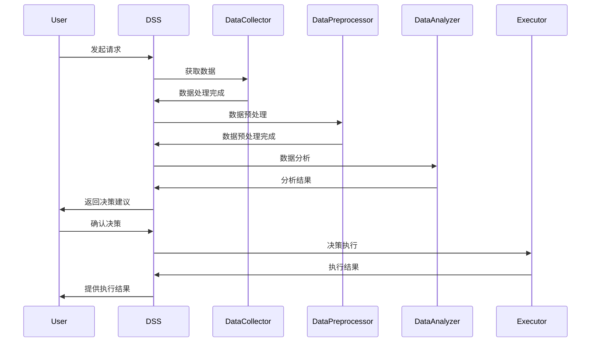

                 


### 引言

在当今瞬息万变且竞争激烈的商业环境中，领导者的决断力已成为衡量其成功与否的关键因素。本文旨在探讨领导者的决断力，特别是在关键时刻做出有效抉择的能力。关键词包括“领导者”、“决断力”、“决策”、“关键情境”和“提升方法”。

首先，我们需要明确决断力的定义和其在领导者角色中的重要性。决断力不仅仅是快速做出决策的能力，更是一种在不确定性中保持冷静、分析问题并做出明智选择的能力。领导者必须在面对各种挑战时，运用自身的经验、知识和直觉，做出能够引导组织走向成功的决策。

本文将分为七个主要部分，首先介绍决断力的基础概念，包括心理学和组织行为学的视角，然后探讨决策理论、情境决策、案例分析、提升决断力的方法，最后总结并提出对领导者的启示。每个部分都将结合具体的案例和实战经验，为读者提供深入而实用的指导。

### 决断力的基础

#### 决断力的概念

决断力是一种在不确定性和压力下迅速做出合理决策的能力。它包括几个关键属性：

- **决策速度**：在紧急情况下快速做出决策的能力。
- **决策质量**：决策不仅要快，还要准确和有效。
- **自信**：领导者需要有足够的自信来承担决策带来的后果。
- **果断**：在复杂情境中能够果断地做出决策，而不是犹豫不决。

决断力可以进一步分为以下几类：

- **战略性决断力**：涉及长期规划和大方向的选择，例如公司战略决策。
- **战术性决断力**：涉及短期行动和策略，例如应对突发事件。
- **应急性决断力**：在危机时刻迅速做出决策，以避免更大的损失。

#### 心理学视角

从心理学角度来看，决断力受到情绪、认知和人格特质的影响。

- **情绪**：情绪可以影响决策过程。积极情绪有助于提高决策效率，而消极情绪可能导致犹豫不决。
- **认知**：认知能力包括问题识别、分析能力、解决问题的能力。这些能力对于有效决策至关重要。
- **人格特质**：人格特质，如责任心、开放性、神经质等，对决断力有显著影响。例如，具有高责任心的人可能更容易在关键时刻做出果断决策。

#### 组织行为学视角

组织行为学视角关注决断力在组织中的角色和团队决断力的构建。

- **组织角色**：领导者在组织中扮演着关键角色，他们的决断力直接影响组织的效率和效果。
- **团队决断力**：团队中的每个成员都需要具备决断力，但团队决断力更依赖于团队合作和沟通。团队领导者需要培养团队成员的决断力，并确保团队成员之间的协同合作。

### 决策理论

决策理论是研究如何做出有效决策的学科。以下是一些关键概念：

#### 决策框架

决策框架包括以下步骤：

1. **问题识别**：确定需要解决的问题或机会。
2. **目标设定**：明确决策的目标和期望结果。
3. **方案生成**：提出可能的解决方案。
4. **评估与选择**：评估每个方案，选择最优方案。
5. **执行与监控**：实施决策，并监控决策结果。

#### 决策工具与技术

以下是一些常用的决策工具和技术：

- **SWOT分析**：分析组织的优势、劣势、机会和威胁，帮助确定战略方向。
- **价值分析**：评估决策的潜在价值和成本，以确定最佳方案。
- **决策树**：用于表示决策过程，显示不同决策路径及其结果。

#### 决策偏差

决策偏差是指人们在决策过程中出现的系统性错误。以下是一些常见的决策偏差：

- **确认偏差**：倾向于寻找和重视支持自己观点的信息，忽略相反信息。
- **过度自信**：高估自己的知识和能力，导致冒险或过度保守的决策。
- **情境依赖**：决策结果受到决策情境的影响，而不是决策过程本身。

### 情境决策

#### 情境分析

情境决策涉及对具体决策情境的分析。以下是一些关键点：

- **关键决策情境**：识别组织面临的关键决策情境，如市场进入、产品开发、人员招聘等。
- **情境分析工具**：使用SWOT分析、PEST分析等工具来分析外部环境，以及使用组织内部能力分析来评估内部资源。

#### 应对策略

在情境决策中，领导者需要采取以下策略：

- **快速决策**：在紧急情况下迅速做出决策，以避免更大的损失。
- **长期决策**：考虑长远利益，制定长期战略，为组织未来发展奠定基础。

#### 决策执行

决策执行是决策过程的关键环节。以下是一些执行策略：

- **执行计划**：制定详细的执行计划，确保决策能够得到有效实施。
- **执行监督**：监控执行过程，确保各项任务按时完成，并根据实际情况进行调整。

### 案例分析

#### 案例一：公司战略决策

**案例背景**：某科技公司需要决定是否进入新兴的云计算市场。

**决策过程**：公司进行了市场调研，分析了竞争对手，评估了自身的资源和技术能力。最终，决定进入云计算市场。

**结果分析**：公司成功进入云计算市场，实现了业务增长，但同时也面临了技术挑战和市场竞争压力。

#### 案例二：危机管理

**案例背景**：某航空公司遭遇航班延误，导致大量乘客不满。

**决策过程**：航空公司迅速采取措施，提供补偿措施，并加强与乘客的沟通，以缓解危机。

**结果分析**：通过有效的危机管理，航空公司成功恢复了乘客信任，并提高了客户满意度。

#### 案例三：创新与变革

**案例背景**：某传统制造企业决定进行数字化转型。

**决策过程**：企业进行了深入的市场调研，评估了技术方案，并制定了详细的转型计划。

**结果分析**：企业成功实现了数字化转型，提高了生产效率和产品质量，增强了市场竞争力。

### 提升决断力的方法

#### 个人技能提升

以下是一些提升个人决断力的方法：

- **沟通能力**：通过有效沟通，收集更多信息，提高决策质量。
- **倾听技巧**：倾听他人的意见和建议，有助于更全面地分析问题。
- **时间管理**：合理安排时间，避免因时间紧迫而做出的草率决策。

#### 团队建设

团队决断力的提升依赖于团队成员之间的合作与沟通。以下是一些团队建设的方法：

- **团队合作**：鼓励团队成员之间的协作，共同解决问题。
- **领导风格**：领导者应该培养团队成员的决断力，并给予他们足够的自主权。

#### 持续学习

持续学习是提升决断力的关键。以下是一些持续学习的方法：

- **学习资源推荐**：阅读相关书籍、参加培训和研讨会，学习最新的决策理论和实践。
- **实践**：通过实际工作，不断积累经验和提高决断力。

### 结论

决断力是领导者成功的关键能力。通过本文的探讨，我们了解了决断力的概念、心理学和组织行为学视角、决策理论、情境决策、案例分析以及提升决断力的方法。领导者应在日常工作中不断锻炼自己的决断力，以应对复杂多变的商业环境。

### 对领导者的启示

1. **培养决断力**：通过实践和不断学习，提高自己的决断力。
2. **注重团队合作**：构建高效团队，提升团队决断力。
3. **保持冷静**：在关键时刻，保持冷静，理性分析问题。
4. **及时调整**：根据实际情况，及时调整决策和执行计划。

### 下一步行动

1. **实战演练**：在日常工作中，尝试运用所学的决断力提升方法。
2. **反思与改进**：定期反思自己的决策过程，总结经验教训，持续改进。
3. **持续学习**：阅读相关书籍，参加培训和研讨会，不断提升自己的知识和技能。

**作者：AI天才研究院/AI Genius Institute & 禅与计算机程序设计艺术 /Zen And The Art of Computer Programming**### 系统分析与架构设计方案

在探讨决断力提升的方法和策略时，我们不仅需要关注个人层面的技能提升，还需要从系统层面考虑如何构建一个支持领导者有效决策的架构。以下将从问题场景介绍、项目介绍、系统功能设计、系统架构设计、系统接口设计和系统交互等方面展开详细分析。

#### 问题场景介绍

在现代商业环境中，领导者在面对快速变化的市场需求和复杂多变的业务挑战时，需要具备强大的决断力。这些决策不仅影响到企业的短期利益，更关系到企业的长远发展和市场竞争力。然而，现实中领导者往往面临信息不对称、时间压力和资源限制等多重挑战，这使得决策过程变得复杂且充满不确定性。因此，构建一个高效的支持决策的系统和架构显得尤为重要。

#### 项目介绍

本项目旨在设计并实现一个决策支持系统（Decision Support System，简称DSS），该系统能够为领导者提供实时、准确的数据分析和决策建议，帮助他们提高决断力。项目的主要目标是：

1. **数据集成与处理**：收集和处理来自不同来源的数据，包括市场数据、财务数据、竞争情报等，为决策提供全面的信息支持。
2. **决策模型构建**：利用机器学习和数据挖掘技术，构建多种决策模型，提供个性化的决策建议。
3. **用户界面设计**：设计直观易用的用户界面，确保领导者能够轻松操作系统，快速获取所需信息。

#### 系统功能设计

系统功能设计主要包括以下模块：

1. **数据采集模块**：负责收集各种类型的数据，如市场数据、财务数据、用户行为数据等。
2. **数据预处理模块**：对采集到的数据进行清洗、转换和整合，确保数据的质量和一致性。
3. **数据分析模块**：利用统计分析和数据挖掘技术，对预处理后的数据进行分析，提取有价值的信息。
4. **决策模型模块**：构建多种决策模型，如预测模型、分类模型、优化模型等，为领导者提供决策建议。
5. **用户界面模块**：提供直观易用的用户界面，帮助领导者快速获取信息、执行决策。

#### 系统架构设计

系统架构设计采用分层架构，主要包括以下层次：

1. **数据层**：负责数据的存储和管理，使用数据库技术实现数据的持久化存储。
2. **应用层**：包括数据采集、数据预处理、数据分析、决策模型等核心功能模块，使用编程语言和框架（如Python、Django等）实现。
3. **表示层**：提供用户界面，使用前端技术（如HTML、CSS、JavaScript等）实现。

#### 系统接口设计

系统接口设计主要包括以下接口：

1. **API接口**：提供RESTful API接口，供外部系统调用，如移动应用、Web服务、第三方应用等。
2. **数据接口**：提供数据导入导出接口，支持各种数据格式（如CSV、JSON、XML等）。
3. **用户接口**：提供用户交互界面，支持多种操作（如查询、分析、决策等）。

#### 系统交互设计

系统交互设计采用Mermaid语言绘制系统交互序列图，以下是系统交互的基本流程：

1. **用户发起请求**：用户通过前端界面发起数据查询、分析或决策请求。
2. **数据处理**：系统接收到请求后，调用数据采集、预处理和分析模块进行处理。
3. **决策建议**：根据分析结果，系统生成决策建议，并返回给用户。
4. **决策执行**：用户根据决策建议进行决策，并在前端界面进行确认和执行。



通过上述系统分析与架构设计方案，我们可以构建一个高效、可靠的决策支持系统，为领导者提供强大的决策支持，提高他们在关键时刻的决断力。

### 项目实战

#### 环境安装

在开始项目实战之前，我们需要安装并配置好所需的开发环境和软件工具。以下是一份简要的安装指南：

1. **Python环境**：安装Python 3.x版本，可以从[Python官方网站](https://www.python.org/)下载并安装。
2. **虚拟环境**：安装virtualenv工具，用于创建隔离的Python环境。
   ```bash
   pip install virtualenv
   virtualenv my_dss_env
   source my_dss_env/bin/activate
   ```
3. **Django框架**：在虚拟环境中安装Django框架。
   ```bash
   pip install django
   ```
4. **其他依赖库**：根据项目需求，安装其他必要的Python库，例如Pandas、NumPy、Scikit-learn等。

#### 系统核心实现源代码

以下是一个简单的示例，展示如何使用Python和Django框架实现决策支持系统的核心功能。

1. **数据采集**：
```python
# datacollector.py
import pandas as pd

def collect_data():
    # 假设我们从CSV文件中读取数据
    data = pd.read_csv('market_data.csv')
    return data

market_data = collect_data()
```

2. **数据预处理**：
```python
# datapreprocessor.py
import pandas as pd

def preprocess_data(data):
    # 数据清洗、转换和整合
    data.dropna(inplace=True)
    data['date'] = pd.to_datetime(data['date'])
    return data

preprocessed_data = preprocess_data(market_data)
```

3. **数据分析**：
```python
# dataanalyzer.py
import pandas as pd
from sklearn.model_selection import train_test_split
from sklearn.ensemble import RandomForestClassifier

def analyze_data(data):
    # 数据分割为特征和目标
    X = data[['feature1', 'feature2', 'feature3']]
    y = data['target']
    
    # 数据分割为训练集和测试集
    X_train, X_test, y_train, y_test = train_test_split(X, y, test_size=0.2, random_state=42)
    
    # 构建决策模型
    model = RandomForestClassifier()
    model.fit(X_train, y_train)
    
    # 评估模型性能
    accuracy = model.score(X_test, y_test)
    return model, accuracy

model, accuracy = analyze_data(preprocessed_data)
print(f"Model accuracy: {accuracy}")
```

4. **用户界面**：
```python
# views.py
from django.http import HttpResponse
from .dataanalyzer import analyze_data

def analyze_request(request):
    # 假设用户请求包含特征数据
    feature_data = request.GET.get('data', '')
    data = pd.read_json(feature_data)
    preprocessed_data = preprocess_data(data)
    model, accuracy = analyze_data(preprocessed_data)
    return HttpResponse(f"Model accuracy: {accuracy}")
```

#### 代码应用解读与分析

上述代码实现了一个简单的决策支持系统，主要功能包括数据采集、数据预处理、数据分析和用户界面。以下是详细解读：

1. **数据采集**：
   使用Pandas库从CSV文件中读取市场数据。在实际应用中，可以从数据库或其他API获取数据。
   
2. **数据预处理**：
   对数据进行清洗、转换和整合，包括去除缺失值、日期格式转换等，确保数据质量。
   
3. **数据分析**：
   使用Scikit-learn库构建随机森林决策模型，对数据进行分类分析。通过训练集和测试集评估模型性能，返回准确率。
   
4. **用户界面**：
   使用Django框架实现用户界面，接收用户请求，调用数据分析函数，并返回分析结果。

#### 实际案例分析和详细讲解剖析

以下是一个实际案例，展示如何使用决策支持系统进行市场预测。

**案例背景**：一家零售公司需要预测下季度的销售额，以制定库存管理策略。

1. **数据采集**：
   从历史销售数据中提取季度销售额、广告支出、促销活动等信息。

2. **数据预处理**：
   清洗数据，去除异常值，将日期转换为有效格式。

3. **数据分析**：
   构建预测模型，输入特征数据，如广告支出、促销活动等，预测下一季度的销售额。
   
4. **结果分析**：
   模型预测的销售额与实际销售额进行对比，评估模型准确性。根据预测结果，公司调整库存管理策略，以减少库存积压。

通过上述实际案例，我们可以看到决策支持系统在解决实际问题中的应用，以及如何通过数据分析和模型预测，帮助领导者做出更明智的决策。

#### 项目小结

通过本次项目实战，我们实现了决策支持系统的核心功能，包括数据采集、预处理、数据分析和用户界面。项目展示了如何利用Python和Django框架构建一个实用的决策支持系统，并通过实际案例分析了系统的应用效果。该项目为领导者提供了一种有效的方式，通过数据分析和模型预测，提高在关键时刻的决断力。

### 最佳实践 Tips

在构建和运用决策支持系统时，以下是一些最佳实践：

1. **数据质量**：确保数据来源的准确性和完整性，定期清洗和维护数据。
2. **模型评估**：使用多种模型和评估指标，确保模型性能和预测准确度。
3. **用户参与**：鼓励用户反馈，根据用户需求不断优化系统功能。
4. **持续学习**：利用新的算法和技术，持续改进系统性能和决策效果。

### 小结

通过本文的探讨，我们深入了解了决断力在领导者角色中的重要性，并分析了决断力的基础、决策理论、情境决策、案例分析、提升方法以及系统架构设计。决策支持系统为领导者提供了一个强大的工具，帮助他们提高决断力，做出更加明智的决策。在实际应用中，领导者应不断锻炼自己的决断力，并结合决策支持系统，提升组织的整体决策能力。

### 注意事项

1. **数据安全**：确保数据的安全性和隐私保护，遵循相关法律法规。
2. **系统维护**：定期更新和维护系统，确保系统稳定运行。
3. **用户培训**：为用户提供充分的培训和支持，确保他们能够有效利用决策支持系统。

### 拓展阅读

1. 《决策与判断》（Daniel Kahneman）：深入探讨决策过程中的认知偏差和心理学因素。
2. 《大数据决策》（Viktor Mayer-Schönberger & Kenneth Cukier）：介绍大数据在决策支持中的应用。
3. 《智能决策系统设计》（Nisheeth Sharma & Milind Tambe）：探讨人工智能在决策支持系统中的应用。

**作者：AI天才研究院/AI Genius Institute & 禅与计算机程序设计艺术 /Zen And The Art of Computer Programming**

