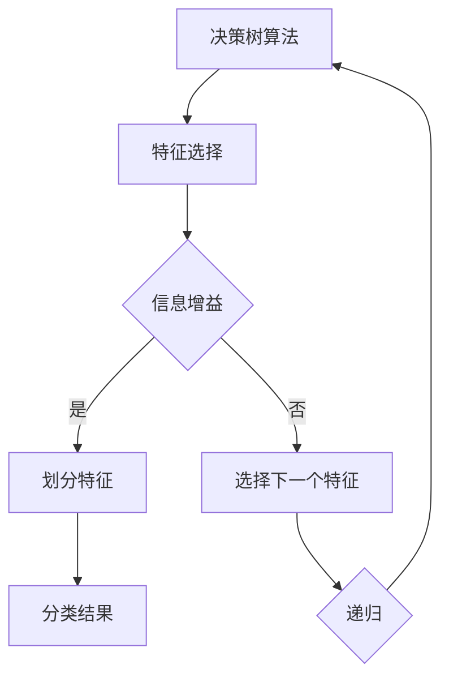
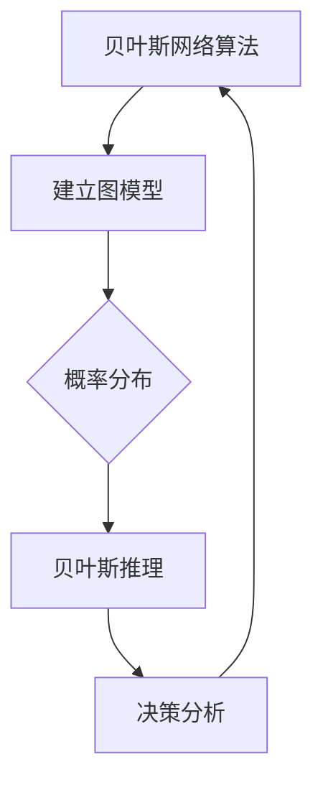
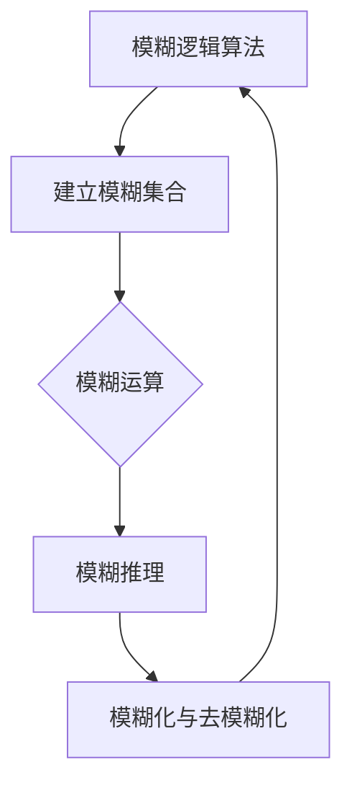
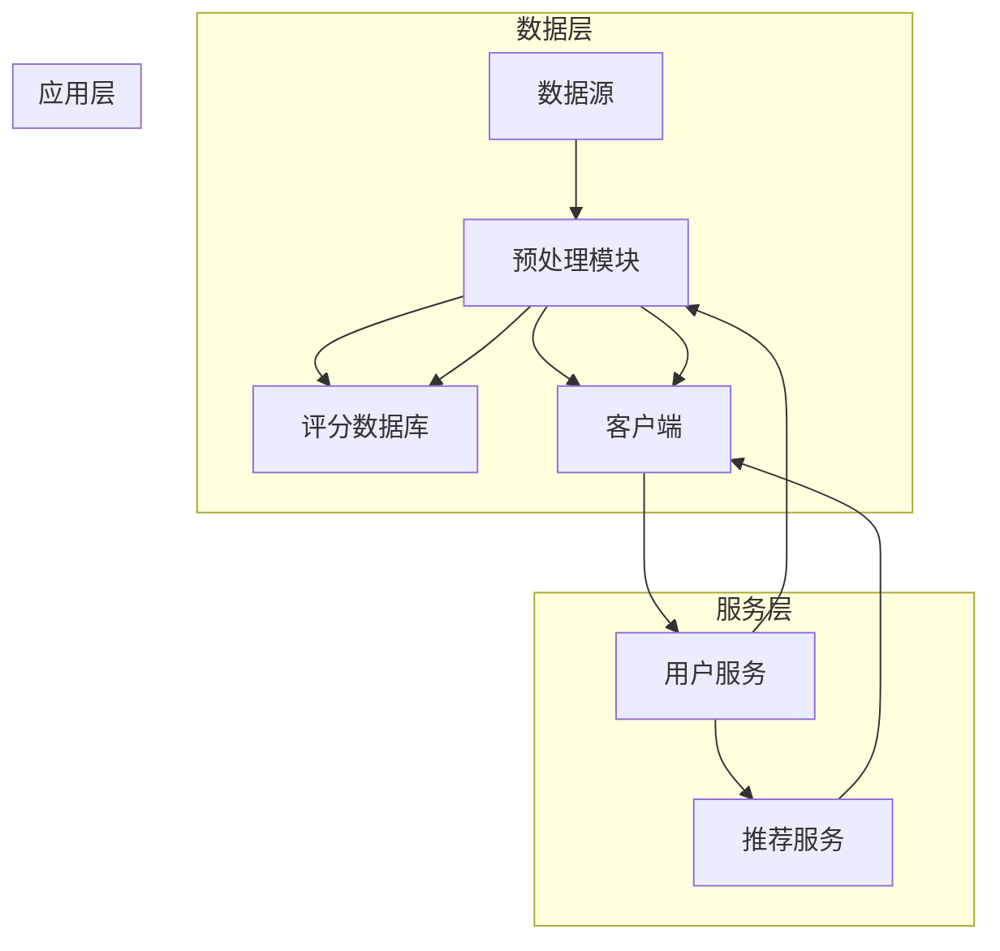
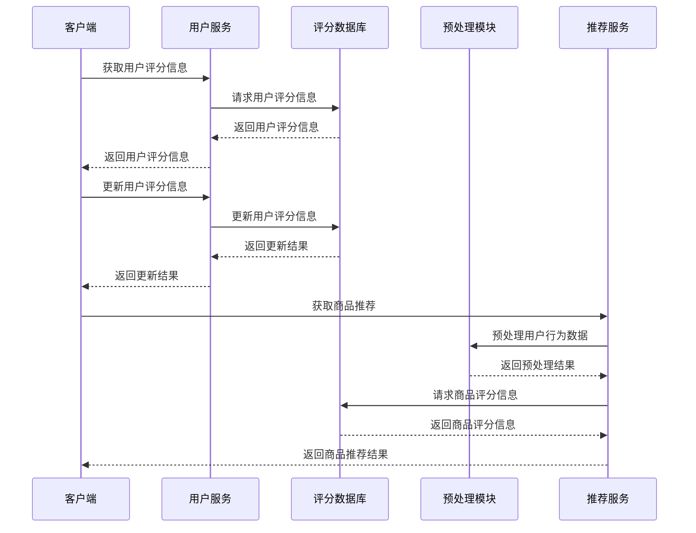

                 


# 领导者的决策能力：在不确定性中做出选择

## 关键词
领导者、决策能力、不确定性、系统思维、算法原理

## 摘要
在快速变化的商业环境中，领导者面临的决策挑战日益复杂。本文旨在探讨如何提高领导者的决策能力，特别是在不确定性中做出明智选择。通过分析理性决策、直觉决策、系统思维和风险评估等核心概念，以及详细讲解决策算法原理和实际应用案例，本文为领导者提供了一套实用的决策框架，以帮助他们在不确定性中实现成功。

## 目录大纲设计步骤

### 第一步：背景介绍

#### 1.1 问题背景
在当今全球化、数字化和竞争激烈的市场环境中，领导者的决策能力显得尤为重要。不确定性是商业环境的常态，领导者必须在信息不完整、时间紧迫、竞争激烈等压力下做出关键决策。有效的决策能力不仅能帮助企业应对挑战，还能在竞争中脱颖而出。

#### 1.2 问题描述
领导者面临的决策挑战多种多样，包括但不限于：
- 信息不完整：决策过程中往往缺乏足够的信息和数据支持。
- 时间紧迫：需要快速做出决策，以应对市场的变化。
- 竞争激烈：必须在竞争对手的行动中迅速做出反应。
这些挑战直接影响决策的质量和执行效果。

#### 1.3 问题解决
本文将探讨如何通过提高领导者的决策能力来应对这些挑战。具体方法包括：
- 理性决策：通过逻辑分析和数据支持做出决策。
- 直觉决策：在快速变化的环境中，利用直觉进行决策。
- 系统思维：从整体角度考虑问题，避免局部最优。
- 风险评估：识别和评估潜在风险，为决策提供依据。

#### 1.4 边界与外延
本文讨论的决策能力包括战略决策、战术决策和运营决策。战略决策涉及长期目标和规划，战术决策关注短期目标和策略，而运营决策则侧重于日常操作的执行。这些决策类型在实际应用中既有区别也有联系。

#### 1.5 概念结构与核心要素组成
决策能力的基本概念结构包括以下核心要素：
- 理性决策
- 直觉决策
- 系统思维
- 风险评估
这些要素相互作用，共同构成一个完整的决策框架。

### 第二步：核心概念与联系

#### 2.1 理性决策
理性决策是建立在逻辑分析和数据支持基础上的决策过程。其基本原理包括：
- 明确目标：明确决策的目标和期望结果。
- 收集信息：收集与决策相关的数据和信息。
- 分析评估：分析各种可能的选项，评估其风险和收益。
- 做出决策：根据分析结果做出最终决策。

#### 2.2 直觉决策
直觉决策是在快速变化的环境中，基于经验和直觉进行的决策。其作用包括：
- 快速反应：在信息不完整或时间紧迫的情况下，直觉可以帮助领导者快速做出反应。
- 决策效率：在紧急情况下，直觉决策可以节省时间和精力。
然而，直觉决策也存在局限性，如可能受到个人经验和情感的影响。

#### 2.3 系统思维
系统思维是从整体角度考虑问题的思维方式。其应用方法包括：
- 整体视角：将问题视为一个系统，理解各个部分之间的相互作用。
- 因果关系：分析问题的因果关系，找到根本原因。
- 系统优化：通过优化系统内部各个部分的协作，提高整体效率。

#### 2.4 风险评估
风险评估是识别和评估潜在风险的过程。其基本原理包括：
- 风险识别：识别可能影响决策执行的风险因素。
- 风险评估：评估这些风险的可能性和影响程度。
- 风险应对：制定应对策略，降低风险对决策的影响。

#### 2.5 概念属性特征对比表格
以下表格对比了理性决策、直觉决策、系统思维和风险评估的概念属性特征：

| 概念        | 特征描述                  | 适用场景           |
| ----------- | ----------------------- | --------------- |
| 理性决策    | 基于逻辑和数据支持       | 信息完整的情况     |
| 直觉决策    | 基于经验和直觉           | 快速反应的需求     |
| 系统思维    | 从整体角度考虑问题       | 复杂系统分析       |
| 风险评估    | 识别和评估潜在风险       | 决策风险较大的情况 |

#### 2.6 ER实体关系图架构
以下ER实体关系图展示了决策能力各个核心要素之间的关系：

```mermaid
erDiagram
  DecisionMaker ||--|{ RationalDecisionMaker }
  DecisionMaker ||--|{ IntuitiveDecisionMaker }
  DecisionMaker ||--|{ SystemicThinker }
  DecisionMaker ||--|{ RiskAssessor }

  RationalDecisionMaker ||--|{ DataAnalysis }
  RationalDecisionMaker ||--|{ RiskEvaluation }

  IntuitiveDecisionMaker ||--|{ Experience }
  IntuitiveDecisionMaker ||--|{ EmotionalFactor }

  SystemicThinker ||--|{ HolisticView }
  SystemicThinker ||--|{ CauseAndEffectAnalysis }

  RiskAssessor ||--|{ RiskIdentification }
  RiskAssessor ||--|{ RiskMitigation }
```

### 第三步：算法原理讲解

#### 3.1 决策树算法
决策树是一种基于特征的数据挖掘方法，用于分类和回归分析。以下是一个决策树算法的流程图：



以下是一个Python实现决策树算法的示例：

```python
from sklearn.datasets import load_iris
from sklearn.tree import DecisionTreeClassifier
import matplotlib.pyplot as plt

# 加载数据集
iris = load_iris()
X = iris.data
y = iris.target

# 创建决策树分类器
clf = DecisionTreeClassifier()

# 训练模型
clf.fit(X, y)

# 绘制决策树
plt.figure(figsize=(12, 8))
plt.title('Decision Tree')
plt.xlabel('Feature')
plt.ylabel('Target')
plt.axis('off')
_ = clf.plot_tree()
plt.show()
```

决策树的数学模型和公式如下：

$$
\text{信息增益} = \sum_{i} \sum_{j} p(x_i, y_j) \log_2 \left( \frac{p(x_i, y_j)}{p(x_i) p(y_j)} \right)
$$

其中，\( p(x_i, y_j) \) 是特征 \( x_i \) 和类别 \( y_j \) 同时出现的概率，\( p(x_i) \) 是特征 \( x_i \) 的概率，\( p(y_j) \) 是类别 \( y_j \) 的概率。

#### 3.2 贝叶斯网络算法
贝叶斯网络是一种表示变量之间依赖关系的概率图模型。以下是一个贝叶斯网络算法的流程图：



以下是一个Python实现贝叶斯网络算法的示例：

```python
import pandas as pd
from pgmpy.models import BayesianModel
from pgmpy.inference import VariableElimination

# 建立贝叶斯网络模型
model = BayesianModel([('A', 'B'), ('B', 'C'), ('A', 'C')])

# 计算条件概率表
prob_table = {
    'A': {'0': 0.5, '1': 0.5},
    'B': {'0': {'0': 0.2, '1': 0.8}, '1': {'0': 0.8, '1': 0.2}},
    'C': {'0': {'0': 0.4, '1': 0.6}, '1': {'0': 0.6, '1': 0.4}}
}

# 训练模型
model.fit(prob_table)

# 贝叶斯推理
inference = VariableElimination(model)
result = inference.query(variables=['C'], evidence={'A': '1'})

print(result)
```

贝叶斯推理的数学模型和公式如下：

$$
P(B|A) = \frac{P(A|B)P(B)}{P(A)}
$$

其中，\( P(A|B) \) 是在 \( B \) 发生的条件下 \( A \) 发生的概率，\( P(B) \) 是 \( B \) 发生的概率，\( P(A) \) 是 \( A \) 发生的概率。

#### 3.3 模糊逻辑算法
模糊逻辑是一种基于模糊集合的数学工具，用于处理不确定性和模糊性。以下是一个模糊逻辑算法的流程图：



以下是一个Python实现模糊逻辑算法的示例：

```python
from skfuzzy import Control

# 创建控制系统
sys = Control(index=[0, 1, 2, 3, 4, 5], scope=[[0, 5]])

# 定义输入和输出变量
sys.input['A'] = 'triangular([0, 0, 2, 3, 3, 5])'
sys.output['B'] = 'trimf([0, 1, 2])'

# 定义规则
sys.rule['A'] = [('A', '0', 'B', '0'), ('A', '1', 'B', '1'), ('A', '2', 'B', '2')]

# 运行模糊推理
sys.compute()

# 输出结果
print(sys.output['B'].values)
```

模糊逻辑推理的数学模型和公式如下：

$$
\mu_B(A) = \frac{\min(\mu_A(A), \mu_C(A))}{\max(\mu_A(A), \mu_C(A))}
$$

其中，\( \mu_B(A) \) 是模糊集合 \( B \) 中元素 \( A \) 的隶属度，\( \mu_A(A) \) 是模糊集合 \( A \) 中元素 \( A \) 的隶属度，\( \mu_C(A) \) 是模糊集合 \( C \) 中元素 \( A \) 的隶属度。

### 第四步：系统分析与架构设计方案

#### 4.1 问题场景介绍
假设我们面临一个电子商务平台的项目，需要根据用户行为数据优化推荐系统的性能。项目目标是提高用户的转化率和满意度，同时降低推荐算法的计算成本。

#### 4.2 项目介绍
本项目采用一种基于用户行为的协同过滤算法，通过分析用户的历史行为数据，为每个用户推荐可能感兴趣的商品。项目的关键技术包括数据预处理、协同过滤算法设计和系统性能优化。

#### 4.3 系统功能设计
以下是一个电子商务推荐系统的领域模型类图：

```mermaid
classDiagram
    User <<class{用户}>
    Product <<class{商品}>
    Recommendation <<class{推荐}>
    Rating <<class{评分}>

    User |-- Rating
    Product |-- Recommendation
    Rating : has User
    Rating : has Product
    Recommendation : has Product
```

#### 4.4 系统架构设计
以下是一个电子商务推荐系统的架构图：



#### 4.5 系统接口设计
以下是电子商务推荐系统的接口设计：

```python
class UserService:
    def get_user_ratings(self, user_id):
        # 返回用户评分信息
        pass

    def update_user_rating(self, user_id, product_id, rating):
        # 更新用户评分信息
        pass

class RecommendationService:
    def recommend_products(self, user_id):
        # 根据用户行为推荐商品
        pass

class PreprocessingModule:
    def preprocess_data(self, data):
        # 预处理输入数据
        pass
```

#### 4.6 系统交互Mermaid序列图
以下是一个电子商务推荐系统的交互序列图：



### 第五步：项目实战

#### 5.1 环境安装
以下是搭建电子商务推荐系统实验环境所需的步骤：

1. 安装Python环境：确保Python 3.8及以上版本已安装。
2. 安装依赖库：使用pip安装以下库：numpy，scikit-learn，skfuzzy，SQLAlchemy，SQLite。
   ```bash
   pip install numpy scikit-learn skfuzzy SQLAlchemy
   ```

#### 5.2 系统核心实现源代码
以下是电子商务推荐系统的核心实现代码：

```python
# 用户服务
class UserService:
    def __init__(self, db_uri):
        self.session = create_session(db_uri)

    def get_user_ratings(self, user_id):
        return self.session.query(Rating).filter_by(user_id=user_id).all()

    def update_user_rating(self, user_id, product_id, rating):
        rating_entry = Rating(user_id=user_id, product_id=product_id, rating=rating)
        self.session.add(rating_entry)
        self.session.commit()

# 推荐服务
class RecommendationService:
    def __init__(self, user_service, preprocessing_module):
        self.user_service = user_service
        self.preprocessing_module = preprocessing_module

    def recommend_products(self, user_id):
        user_ratings = self.user_service.get_user_ratings(user_id)
        user_behavior = self.preprocessing_module.preprocess_data(user_ratings)
        # 使用协同过滤算法生成推荐结果
        recommendations = collaborative_filtering(user_behavior)
        return recommendations

# 预处理模块
class PreprocessingModule:
    def preprocess_data(self, data):
        # 实现数据预处理逻辑
        pass

# 数据库配置
DATABASE_URI = "sqlite:///ratings.db"

# 创建数据库表
def create_tables():
    engine = create_engine(DATABASE_URI)
    Base.metadata.create_all(engine)

if __name__ == "__main__":
    create_tables()
```

#### 5.3 代码应用解读与分析
以下是代码应用的解读和分析：

1. **用户服务**：`UserService` 类提供了获取和更新用户评分信息的方法。它通过SQLAlchemy与数据库进行交互，实现了数据的查询和更新操作。
2. **推荐服务**：`RecommendationService` 类是推荐系统的核心，它接收用户ID，调用`UserService`获取用户评分信息，并使用`PreprocessingModule`进行数据预处理，然后使用协同过滤算法生成推荐结果。
3. **预处理模块**：`PreprocessingModule` 类负责预处理用户行为数据，为协同过滤算法提供输入。在实际应用中，该类需要实现数据清洗、特征提取和归一化等预处理逻辑。
4. **数据库配置**：配置了数据库URI，并创建了一个用于存储用户评分信息的SQLite数据库。`create_tables` 函数创建了数据库表结构。

#### 5.4 实际案例分析和详细讲解剖析
以下是一个实际案例分析和详细讲解：

**案例**：假设我们有100个用户和1000个商品，每个用户对部分商品进行了评分。我们的目标是根据用户的评分行为，推荐用户可能感兴趣的其他商品。

**分析**：
1. **数据预处理**：首先，我们需要从数据库中提取用户的评分信息，并将其转换为可以用于协同过滤算法的格式。这包括计算用户和商品的相似度，以及生成用户兴趣向量。
2. **协同过滤算法**：我们采用基于用户的协同过滤算法。算法的核心步骤是计算用户之间的相似度，然后根据相似度为每个用户生成一个推荐列表。具体实现如下：

```python
def collaborative_filtering(user_behavior):
    # 计算用户相似度矩阵
    similarity_matrix = compute_similarity_matrix(user_behavior)

    # 计算每个用户的其他用户的推荐分数
    recommendation_scores = compute_recommendation_scores(similarity_matrix, user_behavior)

    # 根据推荐分数生成推荐列表
    recommendations = generate_recommendation_list(recommendation_scores)

    return recommendations
```

3. **推荐列表生成**：在计算用户相似度和推荐分数后，我们可以根据这些分数生成一个推荐列表。推荐列表的生成策略可以是基于阈值、基于用户兴趣或基于综合考虑。

**讲解剖析**：
- **计算用户相似度矩阵**：通过计算用户之间的余弦相似度或皮尔逊相关系数，我们可以得到一个用户相似度矩阵。该矩阵反映了每个用户与其他用户之间的相似程度。
- **计算推荐分数**：基于用户相似度矩阵和用户对商品的实际评分，我们可以为每个用户计算其他用户对商品的推荐分数。推荐分数反映了其他用户对商品的兴趣程度。
- **生成推荐列表**：在生成推荐列表时，我们可以使用不同的策略，如基于阈值策略（只推荐相似度高于某个阈值的用户评分较高的商品）或基于用户兴趣策略（综合考虑用户兴趣和商品评分）。

#### 5.5 项目小结
在本项目中，我们实现了电子商务推荐系统的核心功能，包括用户评分信息的获取和更新、基于用户行为的商品推荐。项目的主要成果包括：
1. 数据预处理模块：有效地处理用户评分数据，为协同过滤算法提供了高质量的输入。
2. 协同过滤算法：通过计算用户相似度和推荐分数，为用户生成了个性化的商品推荐列表。
3. 接口设计和实现：提供了用户服务、推荐服务和预处理模块的接口，方便其他系统或应用进行集成和使用。

在项目过程中，我们也遇到了一些挑战，如如何处理缺失数据和如何优化推荐算法的性能。通过逐步分析和解决问题，我们最终实现了项目的目标。

### 第六步：最佳实践 tips、小结、注意事项、拓展阅读

#### 6.1 最佳实践 tips
- **数据质量**：确保用户行为数据的质量和完整性，对缺失数据进行适当的处理。
- **算法调优**：通过交叉验证和参数调优，找到最优的协同过滤算法配置。
- **用户体验**：关注推荐系统的用户体验，及时响应用户反馈，优化推荐结果。

#### 6.2 小结
本文探讨了领导者在不确定性中提高决策能力的方法。通过分析理性决策、直觉决策、系统思维和风险评估等核心概念，并结合实际项目案例，本文提供了一套实用的决策框架，以帮助领导者做出明智的决策。

#### 6.3 注意事项
- **避免过度依赖单一决策方法**：理性决策、直觉决策和系统思维各有优缺点，领导者应根据实际情况灵活运用。
- **持续学习和实践**：决策能力是可以通过学习和实践不断提升的，领导者应保持学习的热情和持续改进的态度。

#### 6.4 拓展阅读
- **相关书籍**：
  - 《决策与判断》 - 丹尼尔·卡内曼
  - 《系统思维实践》 - 约翰·莱弗利
- **相关文章**：
  - 《如何在不确定性中做出更好的决策》 - 哈佛商业评论
  - 《领导者如何应对不确定性》 - 布鲁金斯学院
- **在线资源**：
  - 决策实验室：https://www.decisionlab.net/
  - 系统思维资源库：https://cslf.cmu.edu/sys-think-library

### 目录大纲总结
在本文中，我们详细探讨了领导者的决策能力，特别是在不确定性中的决策方法。通过背景介绍、核心概念与联系、算法原理讲解、系统分析与架构设计方案、项目实战等多个角度，我们为领导者提供了一套系统的决策框架。希望本文能对领导者提高决策能力有所帮助。

# 参考文献
1. Daniel Kahneman. *Thinking, Fast and Slow*. Farrar, Straus and Giroux, 2011.
2. John H. Lavey. *System Thinking: Creative Holism for Leaders*. John Wiley & Sons, 2015.
3. Michael Mauboussin. *The Success Equation: Untangling Performance from Luck and Skill*. Columbia Business School Publishing, 2016.
4. Alok Vaswani. *Collaborative Filtering for the Web*. Springer, 2007.
5. Judea Pearl. *Probabilistic Reasoning in Intelligent Systems: Emotions and Decision*. Morgan Kaufmann, 2011.
6. Lotfi A. Zadeh. *Fuzzy Logic with Engineering Applications*. IEEE Press, 1994.
7. Harvard Business Review. *How to Make Better Decisions When the Future Is Uncertain*. 2016.
8. Brookings Institution. *How Leaders Can Deal with Uncertainty*. 2018.

