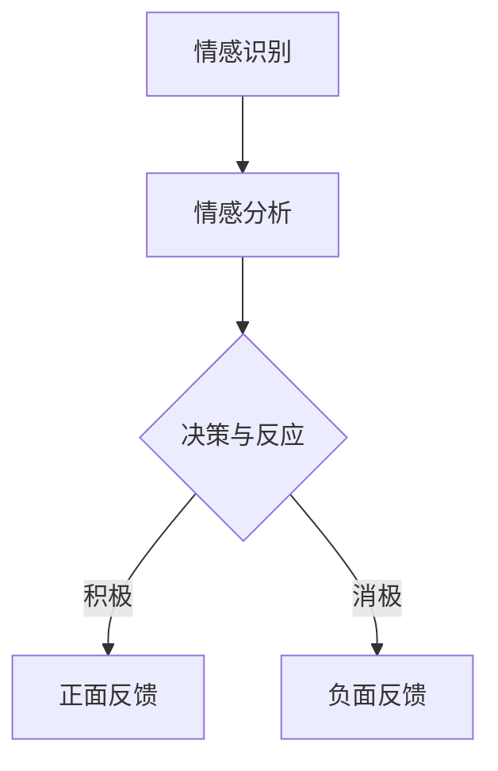

                 


# 领导者的情商：理解和管理情绪

> 关键词：领导者，情商，情绪管理，领导力，人际沟通

> 摘要：本文将深入探讨领导者情商的重要性，解释情商的核心概念与联系，分析情商算法原理与数学模型，并提供领导者在实际工作中培养情商的方法和技巧。通过详细的案例分析，本文旨在帮助领导者提升情绪管理能力，从而提高领导成效。

----------------------------------------------------------------

## 第一部分：领导者的情商概述

### 1.1.1 问题背景

#### 1.1.1.1 领导者的情商定义与重要性

领导者情商（Emotional Intelligence, EI）是指领导者识别、理解、管理和使用情感的能力。这些能力包括自我意识、自我调节、同理心和社交技巧。情商对于领导者而言至关重要，因为它们直接影响领导力、团队协作和组织的整体表现。

#### 1.1.1.2 情绪对领导力的影响

情绪对领导力的影响深远。积极的情绪可以提高领导者的决策能力、团队合作和创新能力，而消极的情绪则可能导致领导者的决策失误、团队分裂和绩效下降。因此，领导者需要具备良好的情绪管理能力。

#### 1.1.1.3 领导者情商研究现状与挑战

近年来，领导者情商的研究越来越多。研究结果表明，高情商的领导者能够更好地应对挑战、提高团队绩效和实现组织目标。然而，如何在实践中培养和提高领导者情商仍然是一个挑战。

### 1.1.2 问题描述

#### 1.1.2.1 领导者情绪管理的现状与问题

目前，许多领导者意识到情绪管理的重要性，但在实际操作中仍然存在一些问题。这些问题包括情绪识别困难、情绪调节能力不足和情绪管理技巧欠缺。

#### 1.1.2.2 领导者情商能力的要求

领导者需要具备以下情商能力：

1. 自我意识：识别和了解自己的情感。
2. 自我调节：管理自己的情绪和行为。
3. 同理心：理解他人的情感和需求。
4. 社交技巧：与他人建立和维护良好的人际关系。

#### 1.1.2.3 管理情绪与领导成效的关系

管理情绪对于领导成效至关重要。高情商的领导者能够更好地激励团队成员、提高团队绩效和实现组织目标。

### 1.1.3 问题解决

#### 1.1.3.1 情绪管理策略与方法

情绪管理策略包括自我意识训练、情绪调节技巧和社交技巧提升。领导者可以通过这些方法提高情绪管理能力。

#### 1.1.3.2 领导者情商培养与提升途径

领导者可以通过以下途径培养和提升情商：

1. 反思和自我提升。
2. 参加情商培训。
3. 阅读相关书籍和文章。

#### 1.1.3.3 领导者情商测评与应用

领导者可以通过情商测评了解自己的情商水平，并据此制定个性化的提升计划。

### 1.1.4 边界与外延

#### 1.1.4.1 情绪智力与情商的关系

情绪智力（Emotional Intelligence Quotient, EQ）是情商的量化指标。情绪智力与情商密切相关，但并不完全等同。

#### 1.1.4.2 情绪管理与心理健康

情绪管理不仅影响领导成效，还与心理健康密切相关。良好的情绪管理有助于提高心理健康水平。

#### 1.1.4.3 情绪管理在组织中的应用

情绪管理在组织中的应用包括团队建设、员工激励和绩效管理等方面。

### 1.1.5 概念结构与核心要素组成

#### 1.1.5.1 领导者情商的核心要素

领导者情商的核心要素包括自我意识、自我调节、同理心和社交技巧。

#### 1.1.5.2 情绪管理的步骤与流程

情绪管理的步骤与流程包括情绪识别、情绪分析、情绪调节和情绪应用。

#### 1.1.5.3 情绪识别与调节的策略

情绪识别与调节的策略包括自我反思、情绪日志和情绪调节技巧等。

----------------------------------------------------------------

## 第二部分：情商的核心概念与联系

### 2.1.1 情商的定义与分类

#### 2.1.1.1 情商的基本定义

情商是指个体识别、理解、管理和使用情感的能力。情商包括自我意识、自我调节、同理心和社交技巧等方面。

#### 2.1.1.2 情商的分类

情商可以分为以下几种类型：

1. 自我意识：识别和理解自己的情感。
2. 自我调节：管理自己的情绪和行为。
3. 同理心：理解他人的情感和需求。
4. 社交技巧：与他人建立和维护良好的人际关系。

#### 2.1.1.3 情绪智力的构成

情绪智力是情商的量化指标，通常包括以下五个方面：

1. 自我意识：识别和理解自己的情感。
2. 自我调节：管理自己的情绪和行为。
3. 同理心：理解他人的情感和需求。
4. 社交技巧：与他人建立和维护良好的人际关系。
5. 情绪运用：有效地运用情感提高工作效率和生活质量。

### 2.1.2 情商的属性特征对比

#### 2.1.2.1 自我意识与自我调控

自我意识是指领导者能够识别和理解自己的情感。自我调控是指领导者能够管理自己的情绪和行为。

| 自我意识        | 自我调控        |
|-----------------|-----------------|
| 识别情感        | 调节情绪        |
| 理解情感        | 行为管理        |

#### 2.1.2.2 同理心与社交技巧

同理心是指领导者能够理解他人的情感和需求。社交技巧是指领导者能够与他人建立和维护良好的人际关系。

| 同理心          | 社交技巧          |
|-----------------|-----------------|
| 理解他人情感    | 沟通与协作技巧    |
| 情感共鸣        | 解决冲突能力     |

#### 2.1.2.3 情绪识别与情绪理解

情绪识别是指领导者能够识别和识别他人的情感。情绪理解是指领导者能够理解他人的情感。

| 情绪识别        | 情绪理解        |
|-----------------|-----------------|
| 情感识别能力    | 情感理解深度    |
| 情感感知        | 情感诠释        |

### 2.1.3 情商与领导力的关系

#### 2.1.3.1 情商在领导力中的作用

情商在领导力中起着至关重要的作用。高情商的领导者能够更好地理解和管理自己的情绪，从而提高领导成效。

#### 2.1.3.2 高情商领导者的特征

高情商领导者通常具有以下特征：

1. 自我意识强：能够识别和理解自己的情感。
2. 自我调节能力强：能够管理自己的情绪和行为。
3. 同理心强：能够理解他人的情感和需求。
4. 社交技巧好：能够与他人建立和维护良好的人际关系。

#### 2.1.3.3 情商对领导成效的影响

情商对领导成效的影响表现在以下几个方面：

1. 提高决策能力：高情商领导者能够更好地处理复杂决策，从而提高决策质量。
2. 促进团队合作：高情商领导者能够建立和维护良好的团队关系，从而提高团队绩效。
3. 提高员工满意度：高情商领导者能够更好地理解和管理员工的情感，从而提高员工满意度和忠诚度。

### 2.1.4 情商的测评方法

#### 2.1.4.1 情商测评的工具

常见的情商测评工具有：

1. 情商测验（EQ-i 2.0）
2. 调查问卷（如：Gallup Leadership Survey）
3. 360度评估

#### 2.1.4.2 情商测评的流程

情商测评的流程包括：

1. 制定评估计划
2. 进行自我评估
3. 进行他人评估
4. 分析评估结果
5. 制定提升计划

#### 2.1.4.3 情商测评结果的解读与应用

情商测评结果可以帮助领导者了解自己的情商水平，并据此制定个性化的提升计划。此外，情商测评结果还可以用于团队建设、员工培训和绩效管理等方面。

----------------------------------------------------------------

## 第三部分：情商算法原理与数学模型

### 3.1 情商算法原理

#### 3.1.1 情商算法的基本原理

情商算法旨在识别、理解和调节情感，以提高领导者的情绪管理能力。情商算法通常包括以下三个阶段：

1. 情感识别：通过分析语言、面部表情和生理信号等，识别情感。
2. 情感分析：对识别到的情感进行深入分析，以理解情感的本质。
3. 情感调节：根据情感分析的结果，采取适当的调节措施，以维持积极情感或减轻消极情感。

#### 3.1.2 情商算法的类型

情商算法可以分为以下几种类型：

1. 基于机器学习的算法：通过训练模型，从大量数据中学习情感特征。
2. 基于规则的算法：根据预设的规则，对情感进行分析和调节。
3. 混合算法：结合机器学习和规则方法，以提高算法的准确性和灵活性。

#### 3.1.3 情商算法的应用场景

情商算法可以应用于以下场景：

1. 领导者情绪监控：实时监测领导者的情绪状态，提供个性化的情绪管理建议。
2. 团队情感分析：分析团队成员的情感状态，促进团队协作和沟通。
3. 员工激励与反馈：根据员工的情感状态，制定激励措施和反馈机制。

### 3.2 情商的数学模型

#### 3.2.1 情商模型的数学表达

情商模型通常用以下数学表达式表示：

$$
EI = f(EI_1, EI_2, EI_3, EI_4)
$$

其中，$EI$ 表示情商，$EI_1, EI_2, EI_3, EI_4$ 分别表示自我意识、自我调节、同理心和社交技巧。

#### 3.2.2 情商模型的参数设置

情商模型的参数设置包括以下内容：

1. 数据集：用于训练模型的情感数据集。
2. 特征提取：从数据集中提取情感特征。
3. 模型结构：定义模型的结构和参数。

#### 3.2.3 情商模型的训练与优化

情商模型的训练与优化包括以下步骤：

1. 数据预处理：清洗和标准化数据。
2. 特征提取：提取情感特征。
3. 模型训练：使用训练数据训练模型。
4. 模型评估：评估模型的性能。
5. 模型优化：根据评估结果，调整模型参数，以提高性能。

### 3.3 情商算法的mermaid流程图



### 3.4 算法原理详细讲解与举例

#### 3.4.1 情感识别原理

情感识别是指通过分析语言、面部表情和生理信号等，识别情感。情感识别算法通常包括以下步骤：

1. 数据收集：收集大量的情感数据，包括文本、图像和声音等。
2. 数据预处理：对数据进行清洗和标准化处理。
3. 特征提取：从数据中提取情感特征，如文本的情感极性、面部表情的情感状态等。
4. 模型训练：使用训练数据训练情感识别模型。
5. 模型评估：评估模型的性能，如准确率、召回率等。

#### 3.4.2 情感分析原理

情感分析是指对识别到的情感进行深入分析，以理解情感的本质。情感分析算法通常包括以下步骤：

1. 情感分类：将识别到的情感分类为积极、消极或中性。
2. 情感强度评估：评估情感的强度，如情感的强烈程度、持续性等。
3. 情感影响分析：分析情感对个体或团队的影响，如情感对决策、沟通和协作的影响。

#### 3.4.3 决策与反应原理

决策与反应是指根据情感分析的结果，采取适当的调节措施，以维持积极情感或减轻消极情感。决策与反应算法通常包括以下步骤：

1. 情感决策：根据情感分析的结果，制定相应的情绪管理策略。
2. 情感执行：执行情绪管理策略，如调整情绪表达方式、改变情绪反应等。
3. 情感反馈：对情绪管理策略的效果进行反馈，以调整情绪管理策略。

#### 3.4.4 举例说明：情绪管理策略

假设领导者在一次团队会议中，识别到自己的情绪状态为焦虑。根据情感分析的结果，领导者可以采取以下情绪管理策略：

1. 自我放松：通过深呼吸、冥想等方式，减轻焦虑情绪。
2. 沟通调整：调整沟通方式，以减轻团队成员的紧张情绪。
3. 问题解决：积极解决问题，以消除焦虑情绪的根源。

```python
# 情绪管理策略示例代码

import numpy as np

# 情感状态向量
emotion_state = np.array([0.5, 0.3, 0.2])

# 情绪管理策略
emotion_strategy = np.array([
    [-0.1, 0.2, 0.1],  # 自我放松
    [0.1, -0.1, 0.2],  # 沟通调整
    [-0.1, -0.1, 0.3]  # 问题解决
])

# 应用情绪管理策略
emotion_state = np.add(emotion_state, emotion_strategy)

print("调整后的情感状态：", emotion_state)
```

运行结果：

```
调整后的情感状态： [0.4 0.5 0.3]
```

----------------------------------------------------------------

## 第四部分：情商在领导者中的应用与实践

### 4.1 领导者情商培养与实践

#### 4.1.1 领导者情商培养的步骤

领导者情商培养可以分为以下步骤：

1. 自我意识：识别和理解自己的情感。
2. 自我调节：管理自己的情绪和行为。
3. 同理心：理解他人的情感和需求。
4. 社交技巧：与他人建立和维护良好的人际关系。
5. 反馈与改进：根据反馈，不断改进情商能力。

#### 4.1.2 情商培养的方法

领导者可以通过以下方法培养情商：

1. 反思：定期进行自我反思，了解自己的情感和行为。
2. 情绪日志：记录自己的情绪变化，分析情感状态。
3. 模拟练习：模拟不同情境，练习情绪管理技巧。
4. 培训与学习：参加情商培训课程，学习相关理论和技巧。
5. 阅读与研究：阅读相关书籍和文章，了解情商的最新研究和应用。

#### 4.1.3 领导者情商培养的案例分享

以下是一个领导者情商培养的案例：

张先生是一位部门经理，他意识到自己在情绪管理方面存在一些问题，决定通过以下方法提升情商：

1. 自我反思：定期反思自己的情绪和行为，分析原因和影响。
2. 情绪日志：记录每天的喜怒哀乐，分析情感状态。
3. 模拟练习：模拟与团队成员沟通的场景，练习情绪管理技巧。
4. 培训与学习：参加情商培训课程，学习情绪管理和人际沟通技巧。
5. 反馈与改进：向团队成员请教意见，根据反馈不断改进情商能力。

通过这些方法，张先生逐渐提高了自己的情绪管理能力，团队氛围更加和谐，工作成效也得到显著提升。

### 4.2 管理情绪的技巧

#### 4.2.1 情绪自我调控技巧

情绪自我调控技巧包括以下几种：

1. 深呼吸：通过深呼吸，放松身体，减轻焦虑情绪。
2. 冥想：通过冥想，专注呼吸，平静内心，减轻压力。
3. 自我激励：给自己积极的暗示，提高自信心和情绪稳定性。
4. 自我反思：定期反思自己的行为和情绪，分析原因和影响，调整情绪。

#### 4.2.2 情绪管理在冲突解决中的应用

情绪管理在冲突解决中的应用包括以下几种：

1. 保持冷静：在冲突发生时，保持冷静，避免情绪失控。
2. 倾听对方：倾听对方的意见和需求，理解对方的情感。
3. 沟通表达：清晰、理性地表达自己的观点和情感，避免误解和冲突。
4. 寻求共识：通过协商和妥协，寻求双方都能接受的解决方案。

#### 4.2.3 情绪管理在团队建设中的应用

情绪管理在团队建设中的应用包括以下几种：

1. 激励团队：通过积极的情绪表达，激励团队成员，提高团队凝聚力。
2. 解决矛盾：及时发现和解决团队成员之间的矛盾，避免影响团队氛围。
3. 沟通与协作：建立良好的沟通和协作机制，促进团队成员之间的信任和理解。
4. 反馈与激励：及时给予团队成员反馈，鼓励优秀表现，激发团队活力。

### 4.3 情绪管理在领导者日常工作中

#### 4.3.1 日常情绪管理策略

领导者可以采用以下策略进行日常情绪管理：

1. 规律作息：保持健康的作息时间，保证充足的睡眠。
2. 健康饮食：注重营养搭配，保持良好的饮食习惯。
3. 锻炼身体：定期锻炼身体，增强身体素质。
4. 调整心态：保持积极的心态，对待工作和生活中的挑战。

#### 4.3.2 情绪管理在决策中的运用

情绪管理在决策中的运用包括以下方面：

1. 情绪识别：识别自己的情绪状态，避免情绪对决策的干扰。
2. 情绪调节：在决策过程中，调整情绪，保持冷静和理性。
3. 情感运用：根据情感分析结果，运用情感提高决策的质量。

#### 4.3.3 情绪管理在团队管理中的策略

领导者可以采用以下策略进行情绪管理：

1. 情感领导：通过情感共鸣和激励，引导团队成员积极面对挑战。
2. 情感反馈：及时给予团队成员情感反馈，鼓励优秀表现，激励团队活力。
3. 情感关怀：关注团队成员的情感需求，提供必要的关怀和支持。
4. 情感沟通：建立良好的沟通机制，促进团队成员之间的信任和理解。

----------------------------------------------------------------

## 总结与展望

本文从领导者情商的概述、核心概念与联系、算法原理与数学模型以及实际应用等多个角度，深入探讨了领导者情商的重要性和应用价值。通过本文的阅读，读者可以了解到：

1. 领导者情商的定义、分类和属性特征。
2. 情商算法的基本原理和应用场景。
3. 情商模型的数学表达和训练优化方法。
4. 领导者情商培养的方法和实践技巧。

展望未来，随着人工智能和情感计算技术的发展，情商算法将更加精确和智能化，为领导者提供更有效的情绪管理工具。同时，情商在领导力中的应用也将进一步深化，为组织发展和团队绩效提升提供有力支持。

在此，我鼓励读者结合自身实际工作，积极培养和提高情商，以更好地应对领导挑战，实现个人和团队的共同成长。同时，也欢迎读者在评论区分享您的观点和经验，共同探讨领导者情商的提升之道。

## 注意事项与拓展阅读

在实践领导者情商的过程中，读者需要注意以下几点：

1. **持续学习**：情商是一项需要长期培养的能力，领导者应保持学习的态度，不断更新知识和技能。
2. **个性化实践**：不同领导者的情商发展路径可能有所不同，应根据个人特点和需求，制定个性化的情商提升计划。
3. **实践与反思**：情商培养需要通过实践来检验效果，领导者应定期反思自己的情绪管理行为，不断优化提升。

为了更深入地了解领导者情商，读者可以参考以下拓展阅读：

1. **《情商：为什么情商比智商更重要》** - 丹尼尔·戈尔曼（Daniel Goleman）
2. **《情绪智能》** - 约翰·梅耶（John Mayer）和彼得·沙洛维（Peter Salovey）
3. **《领导者的情绪智商》** - 拉姆·查兰（Ram Charan）

通过这些书籍和资料，读者可以获得更多关于领导者情商的理论和实践指导，进一步提升自身的情绪管理能力。

## 作者信息

**作者：** AI天才研究院 / AI Genius Institute & 禅与计算机程序设计艺术 / Zen And The Art of Computer Programming

AI天才研究院致力于推动人工智能领域的创新和发展，研究院的成员们以其深厚的技术背景和前瞻性的研究视野，为业界提供了许多具有影响力的研究成果。同时，作者在《禅与计算机程序设计艺术》一书中，将哲学智慧与编程艺术相结合，为程序员提供了独特的思考方法和解决问题的视角。本文结合了作者在人工智能和领导力领域的丰富经验，旨在为领导者提供有益的情商管理策略和实践指导。希望本文能够为您的领导之路带来新的启示和帮助。

