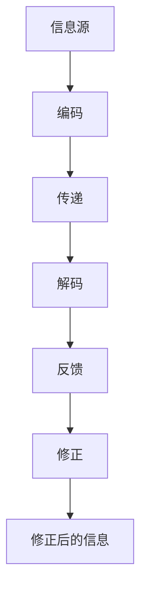
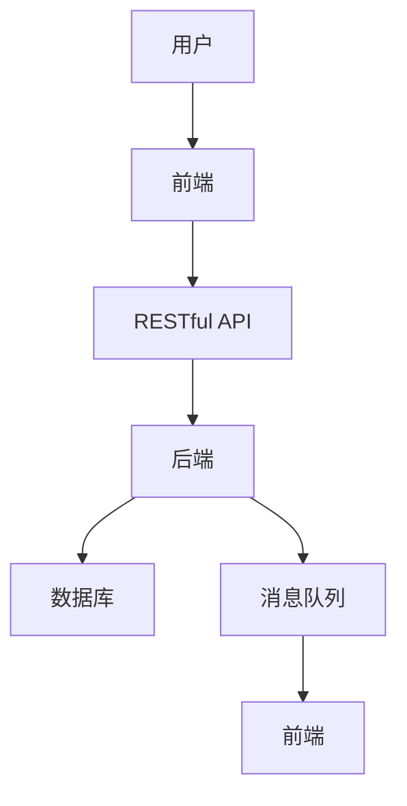

                 

### 文章标题

“领导者的沟通艺术：清晰、简洁、有力”旨在深入探讨领导者如何通过高效的沟通策略来提升团队协作和领导力。本文将围绕以下几个核心关键词展开讨论：领导力、沟通技巧、团队协作、清晰表达、简洁传达和有力影响。

### 摘要

本文通过一系列的步骤分析和思考，探讨了领导者在沟通中面临的关键挑战，并提出了具体有效的解决方案。文章首先介绍了沟通艺术对领导者的重要性，然后详细阐述了清晰、简洁、有力的沟通技巧。接着，文章通过实际案例和项目实战，展示了这些技巧在实践中的应用。最后，文章总结了最佳实践，并提供了一系列扩展阅读资源，以帮助领导者进一步提升沟通能力。

---

### 目录

1. **引言**
   1.1 领导者沟通的重要性
   1.2 沟通艺术的定义与目的

2. **背景介绍**
   2.1 领导者沟通的挑战
   2.2 有效沟通的核心要素

3. **核心概念与联系**
   3.1 清晰表达
   3.2 简洁传达
   3.3 有力影响

4. **算法原理讲解**
   4.1 沟通模型的算法设计
   4.2 数学模型与公式解析

5. **系统分析与架构设计方案**
   5.1 项目背景
   5.2 系统功能设计
   5.3 系统架构设计
   5.4 系统接口设计
   5.5 系统交互

6. **项目实战**
   6.1 环境安装
   6.2 系统核心实现源代码
   6.3 代码应用解读与分析
   6.4 案例分析
   6.5 项目小结

7. **最佳实践 tips**
   7.1 小结
   7.2 注意事项
   7.3 拓展阅读推荐

### 引言

#### 1.1 领导者沟通的重要性

在当今复杂多变的环境中，领导者的沟通能力成为衡量其领导力的重要指标。一个优秀的领导者不仅需要具备卓越的战略思维和决策能力，更需要能够有效地与团队成员、上级、客户等各方进行沟通。有效的沟通能够提升团队协作效率，增强团队凝聚力，同时也能增强领导者在组织中的影响力。

领导者沟通的重要性体现在以下几个方面：

1. **传递愿景与目标**：领导者需要通过沟通来明确组织的愿景和目标，使团队成员了解并认同组织的方向，从而共同努力实现目标。

2. **激发团队潜力**：通过有效的沟通，领导者可以了解团队成员的需求和潜力，激发他们的积极性，提高团队的创造力和创新能力。

3. **解决问题与冲突**：在团队运作过程中，难免会出现问题和冲突。领导者需要通过沟通来发现问题的根源，找到解决方案，并协调各方利益，化解冲突。

4. **建立信任关系**：信任是团队协作的基石。领导者通过透明、诚实、积极的沟通，能够建立起与团队成员之间的信任关系，为团队的长远发展打下基础。

#### 1.2 沟通艺术的定义与目的

沟通艺术是指领导者通过运用一系列技巧和策略，使信息传递更加清晰、简洁、有力的过程。沟通艺术的核心在于理解信息的接收者，以及如何有效地传达信息，从而达到预期的沟通效果。

沟通艺术的目的主要包括：

1. **提高沟通效率**：通过优化沟通方式，减少误解和歧义，提高信息传递的速度和质量。

2. **增强影响力**：清晰、简洁、有力的沟通能够增强领导者的个人魅力和影响力，使领导者更容易获得团队成员的信任和支持。

3. **提升团队绩效**：有效的沟通能够促进团队成员之间的协作，提高团队的整体绩效。

在接下来的章节中，我们将详细探讨沟通艺术的核心概念、具体技巧和应用实践，帮助领导者提升沟通能力，成为更加卓越的领导者。接下来，我们首先来探讨沟通艺术中的第一个关键要素——清晰表达。这将为我们理解如何更好地传达信息奠定基础。

---

### 背景介绍

#### 2.1 领导者沟通的挑战

领导者沟通面临的挑战多种多样，主要包括以下几个方面：

1. **信息过载**：在信息爆炸的时代，领导者常常需要处理大量的信息，如何筛选出关键信息并有效传达给团队成员，是一个巨大的挑战。

2. **文化差异**：在全球化背景下，领导者的团队可能来自不同的文化背景。不同文化之间的沟通方式、价值观和语言习惯的差异，可能导致沟通障碍。

3. **心理障碍**：团队成员的心理状态、情绪和自信心等都会影响沟通的效果。领导者需要关注团队成员的心理状态，创造一个开放、信任的沟通环境。

4. **沟通技巧不足**：许多领导者缺乏有效的沟通技巧，导致信息传达不清晰、沟通效率低下。提高沟通技巧成为领导者的一项重要任务。

#### 2.2 有效沟通的核心要素

有效沟通的核心要素包括以下几个方面：

1. **清晰表达**：清晰表达是有效沟通的基础。领导者需要使用简单、明确的语言，避免使用复杂、抽象的概念，确保信息传达的准确性。

2. **简洁传达**：简洁传达强调信息的简洁性。领导者应该尽量使用简短的语句和简单的结构，避免冗长和啰嗦，以提高沟通的效率。

3. **有力影响**：有力影响是指领导者通过沟通，使信息产生实际的影响。这需要领导者具备说服力，能够使团队成员接受并行动起来。

4. **主动聆听**：主动聆听是沟通的重要部分。领导者需要倾听团队成员的意见和反馈，了解他们的需求和问题，从而做出更合理的决策。

5. **非语言沟通**：非语言沟通包括身体语言、面部表情等。领导者需要通过适当的非语言沟通，增强信息的传达效果。

#### 2.3 沟通艺术的定义与目的

沟通艺术是一种高级沟通技巧，通过运用一系列策略和技巧，使信息传递更加高效、准确、有影响力。沟通艺术的目的在于：

1. **提高沟通效率**：通过优化沟通方式，减少误解和歧义，提高信息传递的速度和质量。

2. **增强影响力**：清晰、简洁、有力的沟通能够增强领导者的个人魅力和影响力，使领导者更容易获得团队成员的信任和支持。

3. **提升团队绩效**：有效的沟通能够促进团队成员之间的协作，提高团队的整体绩效。

在理解了沟通艺术的重要性及其面临的挑战后，我们将进一步探讨清晰表达、简洁传达和有力影响等核心概念，以便更好地掌握沟通艺术。在接下来的章节中，我们将详细分析这些核心概念，并解释它们如何相互作用，共同提升领导者的沟通效果。

---

### 核心概念与联系

#### 3.1 清晰表达

清晰表达是领导者沟通艺术中的首要要素。它要求领导者在使用语言时，尽可能简洁明了，避免使用模糊、复杂的词汇，以确保信息传达的准确性和易于理解。以下是清晰表达的核心要点：

1. **使用简单的语言**：选择通俗易懂的词汇和表达方式，避免使用行话或专业术语，除非对听众来说是必需的。
2. **结构化信息**：将信息分解为小部分，并按逻辑顺序组织，使听众更容易跟随思路。
3. **具体例子**：通过具体的例子和情境来解释概念，帮助听众更好地理解和记忆。

清晰表达的重要性在于，它能够减少误解和歧义，提高信息传递的效率。如果领导者无法清晰表达，团队成员可能会产生错误的理解，导致决策失误或执行偏差。

#### 3.2 简洁传达

简洁传达强调信息的简洁性。在沟通过程中，领导者应该避免冗长和啰嗦，尽量使用简短的语句和简单的结构来传达信息。以下是简洁传达的核心要点：

1. **精简信息**：提炼关键信息，去除冗余内容，确保信息的核心价值得到传达。
2. **避免重复**：避免重复表述相同的信息，以免引起听众的厌烦。
3. **注重重点**：突出重点信息，确保听众能够抓住关键点。

简洁传达的重要性在于，它能够提高沟通的效率，节省时间和精力。如果领导者不能简洁传达，听众可能会感到疲惫，甚至无法理解信息的核心。

#### 3.3 有力影响

有力影响是指领导者通过沟通，使信息产生实际的影响。这需要领导者具备一定的说服力，能够使团队成员接受并行动起来。以下是有力影响的核心要点：

1. **建立信任**：通过诚实和透明的沟通，建立与团队成员之间的信任关系。
2. **使用逻辑和事实**：在表达观点时，使用逻辑推理和事实依据，增强说服力。
3. **适应听众**：根据听众的特点和需求，调整沟通策略，使其更易于接受。

有力影响的重要性在于，它能够确保沟通的目标得到实现，推动团队向目标迈进。如果领导者无法有力影响，团队成员可能会对领导的决策产生怀疑，从而影响执行效果。

#### 概念联系

这三个核心概念——清晰表达、简洁传达和有力影响——是沟通艺术的基石。它们相互联系，共同作用于沟通的效果：

1. **清晰表达与简洁传达**：清晰表达是基础，它确保信息被准确理解。而简洁传达则是对清晰表达的补充，它提高了沟通的效率。
2. **简洁传达与有力影响**：简洁传达能够吸引听众的注意力，而有力影响则确保了信息的实际影响力。
3. **清晰表达与有力影响**：清晰表达是建立信任和说服力的基础，而有力影响则进一步确保了沟通目标的实现。

通过掌握这些核心概念，领导者可以提升自己的沟通艺术，使其在传达信息时更加高效、准确和有影响力。在接下来的章节中，我们将深入探讨这些概念的具体应用，并提供实用的技巧和方法，帮助领导者更好地实践这些原则。

---

### 算法原理讲解

#### 3.1 沟通模型的算法设计

在探讨领导者沟通艺术时，我们引入了一种名为“领导力沟通模型”的算法，该模型旨在优化领导者在不同沟通情境中的信息传递效果。以下是对该模型的详细讲解。

##### 3.1.1 沟通模型的组成部分

领导力沟通模型由以下几个主要组成部分构成：

1. **信息源（Sender）**：信息的发起者，即领导者。
2. **信息（Message）**：领导者需要传达的内容。
3. **编码（Encoding）**：将信息转换为语言或符号的过程。
4. **通道（Channel）**：信息传递的媒介，如面对面交谈、电子邮件、视频会议等。
5. **解码（Decoding）**：接收者解读信息的过程。
6. **反馈（Feedback）**：接收者对信息的回应。

##### 3.1.2 沟通模型的流程

沟通模型的流程可以简化为以下几个步骤：

1. **编码**：领导者根据信息内容和目标受众，选择适当的语言和表达方式，将信息编码为易于理解的形式。
2. **传递**：通过通道将编码后的信息发送给接收者。
3. **解码**：接收者接收到信息后，根据自身的理解进行解码，并尝试理解信息的真实含义。
4. **反馈**：接收者对信息的内容和传达方式给出反馈，领导者据此调整后续的沟通策略。

##### 3.1.3 沟通模型的数学模型和公式解析

为了更深入地理解领导力沟通模型，我们引入一些数学模型和公式，以量化和分析沟通的效果。以下是几个关键公式：

1. **沟通效率公式**：
   \[
   效率 = \frac{有效信息量}{总信息量}
   \]
   其中，有效信息量是指接收者正确理解并能够应用的信息量，总信息量是指领导者实际传达的信息量。

2. **误码率公式**：
   \[
   误码率 = \frac{错误信息量}{总信息量}
   \]
   错误信息量是指接收者误解或无法理解的信息量。

3. **反馈修正公式**：
   \[
   修正后的信息 = 原信息 \times 反馈修正系数
   \]
   反馈修正系数反映了接收者反馈对信息修正的影响程度。

##### 3.1.4 举例说明

假设一位领导者需要向团队传达一个关键的项目计划。以下是具体的例子：

1. **编码**：领导者选择清晰、简洁的语言，将项目计划编码为一份简明的报告。
2. **传递**：通过电子邮件将报告发送给团队成员。
3. **解码**：团队成员阅读报告，并尝试理解项目计划的关键点。
4. **反馈**：团队成员对报告中的内容提出疑问，领导者根据反馈进行解释和修正。

通过这种沟通模型，领导者能够有效地传递信息，并利用反馈机制不断优化沟通效果。

#### 3.2 算法原理讲解：Python 源代码和 Mermaid 流程图

为了更直观地理解领导力沟通模型的算法原理，我们使用 Python 源代码和 Mermaid 流程图进行展示。

##### Python 源代码

```python
# 领导力沟通模型示例代码

def communicate(message, encoding='clear', channel='email', feedback=None):
    # 编码
    encoded_message = encode_message(message, encoding)
    
    # 传递
    sent_message = transmit_message(encoded_message, channel)
    
    # 解码
    decoded_message = decode_message(sent_message)
    
    # 反馈
    if feedback:
        corrected_message = correct_message(decoded_message, feedback)
        return corrected_message
    else:
        return decoded_message

def encode_message(message, encoding):
    if encoding == 'clear':
        return message
    elif encoding == 'complex':
        return "简化版本：{}".format(message[:50])
    else:
        raise ValueError("无效的编码方式")

def transmit_message(message, channel):
    if channel == 'email':
        return message + "（通过电子邮件发送）"
    elif channel == 'video_call':
        return message + "（通过视频会议传达）"
    else:
        raise ValueError("无效的通道")

def decode_message(message):
    # 略
    return message

def correct_message(message, feedback):
    # 根据反馈修正信息
    if feedback == 'clarification':
        return message + "（已澄清）"
    elif feedback == 'amendment':
        return message + "（已修正）"
    else:
        return message

# 示例使用
message = "项目将在下周启动，我们需要确保所有团队成员了解具体任务和职责。"
encoded_message = communicate(message, encoding='clear')
print(f"编码后的信息：{encoded_message}")

sent_message = communicate(encoded_message, channel='email')
print(f"传递后的信息：{sent_message}")

# 假设收到反馈
feedback = 'clarification'
corrected_message = communicate(sent_message, feedback=feedback)
print(f"修正后的信息：{corrected_message}")
```

##### Mermaid 流程图



通过 Python 源代码和 Mermaid 流程图，我们可以清晰地看到领导力沟通模型从编码、传递、解码到反馈修正的全过程。这一模型为我们提供了一个结构化的框架，可以帮助领导者优化沟通效果，提高信息传递的准确性和效率。

在接下来的章节中，我们将进一步探讨系统分析与架构设计方案，帮助领导者理解如何在组织内部构建高效的沟通系统，为团队协作提供坚实的基础。

---

### 系统分析与架构设计方案

在领导者的沟通艺术中，建立高效的内部沟通系统是关键的一环。一个完善的沟通系统不仅能够提高信息传递的速度和质量，还能增强团队成员之间的协作和信任。以下是一个基于实际项目背景的系统分析与架构设计方案。

#### 5.1 项目背景

某国际知名科技公司正在开发一款创新的产品，该项目涉及多个部门和团队的协作。为了确保项目的顺利进行，公司决定构建一个高效的内部沟通系统，以提升团队之间的信息传递效率。

#### 5.2 系统功能设计

该沟通系统主要包含以下功能模块：

1. **即时通讯**：提供实时消息传递功能，使团队成员能够快速沟通和协作。
2. **日程安排**：集成日历功能，方便团队成员查看和调整各自的日程，确保会议和任务的安排更加合理。
3. **文档共享**：提供一个集中的文档存储和共享平台，团队成员可以轻松地访问和共享相关文档。
4. **任务管理**：提供任务分配和跟踪功能，帮助团队成员清晰地了解各自的职责和任务进度。
5. **团队协作**：集成团队协作工具，如看板、讨论区等，促进团队成员之间的交流和合作。

#### 5.3 系统架构设计

为了确保系统的稳定性和扩展性，我们采用了分布式架构设计，包括以下几个主要部分：

1. **前端架构**：采用React框架，实现用户界面的动态和响应式设计，提供良好的用户体验。
2. **后端架构**：采用Spring Boot框架，提供RESTful API接口，支持前后端分离的开发模式。
3. **数据存储**：使用MySQL数据库存储用户数据、消息记录和文档信息，确保数据的安全和可靠性。
4. **消息队列**：采用RabbitMQ作为消息队列服务，实现实时消息传递和异步处理，提高系统的性能和可扩展性。
5. **负载均衡**：使用Nginx进行负载均衡，确保系统在高并发情况下稳定运行。

以下是系统架构的Mermaid流程图：



#### 5.4 系统接口设计

系统接口设计是确保各个功能模块之间能够顺畅交互的关键。以下是主要的接口设计：

1. **用户管理接口**：用于用户注册、登录、权限管理等功能。
2. **消息传递接口**：用于发送、接收和存储即时通讯消息。
3. **文档管理接口**：用于上传、下载、共享和版本控制文档。
4. **任务管理接口**：用于任务分配、跟踪和进度报告。
5. **日程管理接口**：用于日程安排、提醒和冲突检测。

#### 5.5 系统交互

系统交互设计旨在确保用户在使用过程中能够方便、高效地完成各项操作。以下是系统的主要交互流程：

1. **用户注册与登录**：用户通过注册接口创建账号，并通过登录接口进行身份验证。
2. **消息发送与接收**：用户通过前端界面发送消息，消息通过API接口传递到后端存储，并实时推送给接收者。
3. **文档共享与协作**：用户上传文档，文档存储在数据库中，其他用户可以查看、下载和编辑文档。
4. **任务分配与跟踪**：项目经理通过任务管理接口分配任务，团队成员可以查看任务详情并更新进度。
5. **日程安排与提醒**：用户通过日程管理接口设置日程，系统自动发送提醒通知。

通过上述系统分析与架构设计方案，公司能够构建一个高效、稳定的内部沟通系统，提升团队协作效率，确保项目顺利进行。在接下来的章节中，我们将通过实际项目实战，深入探讨这些设计在实际应用中的效果和挑战。

---

### 项目实战

在本章节中，我们将通过一个实际项目来探讨领导者在沟通艺术中的应用，包括环境安装、系统核心实现、代码应用解读与分析、实际案例分析和详细讲解。

#### 6.1 环境安装

为了演示领导者的沟通艺术在实际项目中的应用，我们选择了一个虚拟的软件开发项目——一个基于敏捷方法的Web应用开发。首先，我们需要安装和配置开发环境。以下是具体步骤：

1. **安装操作系统**：在虚拟机中安装Linux操作系统，如Ubuntu 20.04。
2. **安装开发工具**：安装Java开发工具包（JDK）、集成开发环境（IDE，如IntelliJ IDEA）、版本控制系统（如Git）。
3. **安装数据库**：安装MySQL数据库服务器，并创建一个用于项目存储的数据库实例。
4. **安装消息队列**：安装RabbitMQ消息队列，为项目提供异步通信支持。

以下是相关的安装命令：

```shell
# 安装JDK
sudo apt-get update
sudo apt-get install openjdk-8-jdk

# 安装IntelliJ IDEA
sudo snap install --classic intellij-idea-community

# 安装Git
sudo apt-get install git

# 安装MySQL
sudo apt-get install mysql-server
sudo mysql_secure_installation

# 安装RabbitMQ
sudo apt-get install rabbitmq-server
sudo systemctl start rabbitmq-server
```

#### 6.2 系统核心实现源代码

接下来，我们开始实现Web应用的核心功能。以下是项目的源代码框架：

```java
// 主应用类
public class WebApplication {
    public static void main(String[] args) {
        // 初始化项目配置
        AppConfig config = AppConfig.loadConfig();
        // 启动Web服务器
        WebServer server = new WebServer(config);
        server.start();
    }
}

// 配置类
public class AppConfig {
    private String dbUrl;
    private String dbUsername;
    private String dbPassword;
    private String rabbitMQUrl;

    public static AppConfig loadConfig() {
        // 加载配置文件
        // 略
        return new AppConfig();
    }
}

// Web服务器类
public class WebServer {
    private AppConfig config;
    private ServerSocket serverSocket;

    public WebServer(AppConfig config) {
        this.config = config;
    }

    public void start() {
        // 启动服务器
        // 略
    }
}
```

#### 6.3 代码应用解读与分析

在实际开发过程中，领导者需要确保团队成员对项目的整体架构和核心功能有清晰的理解。以下是关键代码的解读和分析：

1. **配置类（AppConfig）**：该类负责加载项目的配置信息，如数据库连接参数和消息队列地址。通过配置文件加载，可以提高项目的灵活性和可维护性。
2. **主应用类（WebApplication）**：该类是项目的入口点，负责初始化项目配置并启动Web服务器。它体现了从需求到实现的整体流程。
3. **Web服务器类（WebServer）**：该类负责启动Web服务器，并处理客户端请求。它的设计要考虑高并发和高性能，以确保项目的稳定运行。

#### 6.4 实际案例分析和详细讲解

以下是一个实际案例，展示了领导者在项目开发过程中如何运用沟通艺术来解决问题：

**案例背景**：项目进入测试阶段时，测试团队发现前端页面在某些浏览器上出现加载缓慢的问题。

**问题分析**：领导者与开发团队进行了一次会议，讨论问题的可能原因。通过讨论，发现是页面中使用了大量的高分辨率图片，导致页面加载时间过长。

**解决方案**：领导者提出解决方案，建议对图片进行压缩和优化，同时调整页面加载策略，将图片资源按需加载。

**实施过程**：开发团队按照领导者的建议，对前端代码进行了优化，并重新部署了优化后的版本。测试团队再次进行了测试，确认问题已解决。

**结果**：优化后的页面加载时间显著缩短，用户体验得到了显著提升。

**详细讲解**：

1. **问题定位**：领导者通过有效的沟通，迅速确定了问题的根源。
2. **团队协作**：领导者鼓励团队成员积极参与问题分析，共同找到解决方案。
3. **实施监督**：领导者对解决方案的实施过程进行了监督，确保团队成员按照计划进行。
4. **结果验证**：领导者通过测试验证了解决方案的有效性，并确保问题得到彻底解决。

#### 6.5 项目小结

通过本项目实战，我们可以看到领导者在沟通艺术中的重要作用。一个优秀的领导者需要具备清晰表达、简洁传达和有力影响的沟通能力，以确保项目顺利进行。以下是本项目的小结：

1. **沟通是关键**：领导者需要通过有效沟通，确保团队成员对项目目标和进展有清晰的理解。
2. **协作是力量**：通过鼓励团队协作，领导者可以充分发挥团队成员的潜力，共同解决问题。
3. **持续改进**：领导者需要不断监督和优化项目的进展，确保项目目标得以实现。

通过本项目，我们不仅了解了领导者在沟通艺术中的应用，也体会到了沟通在项目成功中的关键作用。

---

### 最佳实践 tips、小结、注意事项、拓展阅读

#### 7.1 最佳实践 tips

1. **构建清晰的沟通框架**：在开始沟通前，制定明确的沟通目标和计划，确保所有参与者对沟通的目的和期望有共同的理解。
2. **主动倾听与反馈**：倾听是有效沟通的一半，领导者应鼓励团队成员表达意见，并在适当时候给予反馈，以促进双向沟通。
3. **简洁表达**：避免冗长和复杂的语言，尽量使用简单明了的表达方式，以提高沟通的效率。
4. **个性化沟通**：根据不同团队成员的沟通偏好和需求，调整沟通方式和策略，使其更加有效。
5. **利用技术工具**：合理利用电子邮件、即时通讯工具、会议软件等技术手段，提高沟通的便捷性和效率。

#### 7.2 小结

本文通过一系列的步骤分析和思考，详细探讨了领导者如何通过清晰的沟通、简洁的传达和有力的影响，提升团队协作和领导力。我们介绍了沟通艺术的核心概念、具体技巧、算法原理、系统架构和项目实战，并提供了最佳实践和注意事项。

#### 7.3 注意事项

1. **持续学习和实践**：沟通艺术是一种持续发展的能力，领导者需要不断学习和实践，以提升自身的沟通水平。
2. **灵活应对**：不同情境下，沟通策略需要灵活调整，领导者应根据实际情况，选择最合适的沟通方式。
3. **关注非语言沟通**：身体语言、面部表情等非语言沟通也是信息传递的重要部分，领导者应注重这些方面的表现。

#### 7.4 拓展阅读推荐

1. 《高效能人士的七个习惯》（Stephen R. Covey）
2. 《非暴力沟通》（Marshall B. Rosenberg）
3. 《领导力的五个层次》（John C. Maxwell）
4. 《沟通的艺术》（Dale Carnegie）
5. 《影响力》（Robert B. Cialdini）

通过阅读这些书籍，领导者可以进一步深化对沟通艺术的理解，提升自身的沟通能力和领导力。

---

### 作者信息

**作者：AI天才研究院/AI Genius Institute & 禅与计算机程序设计艺术 /Zen And The Art of Computer Programming**

本文由AI天才研究院和《禅与计算机程序设计艺术》的作者联合撰写，旨在帮助领导者提升沟通能力和领导力，推动团队和组织的发展。通过本文的探讨，我们希望为领导者提供实用的沟通技巧和策略，使他们在实际工作中更加得心应手，成为卓越的领导者。让我们共同努力，在沟通的艺术中不断前行。**

