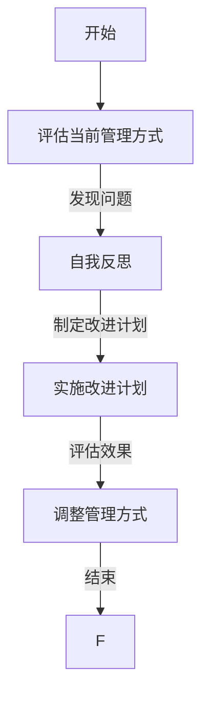
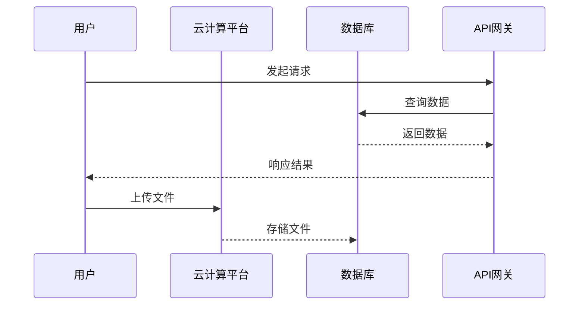
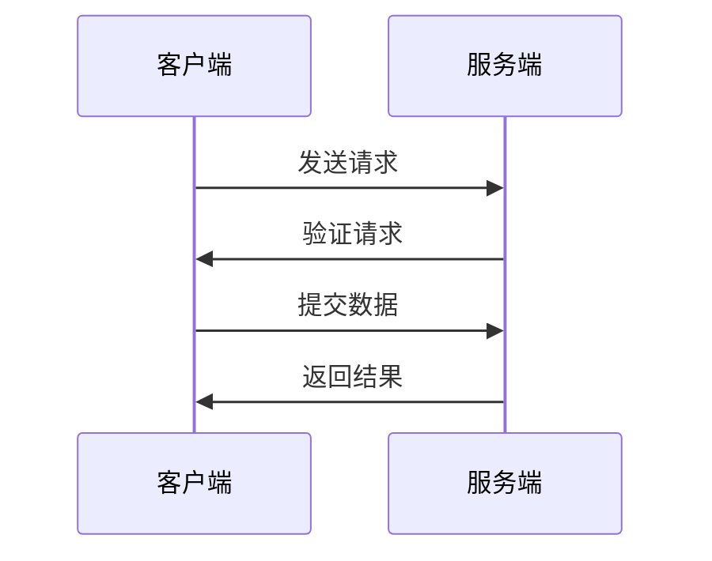
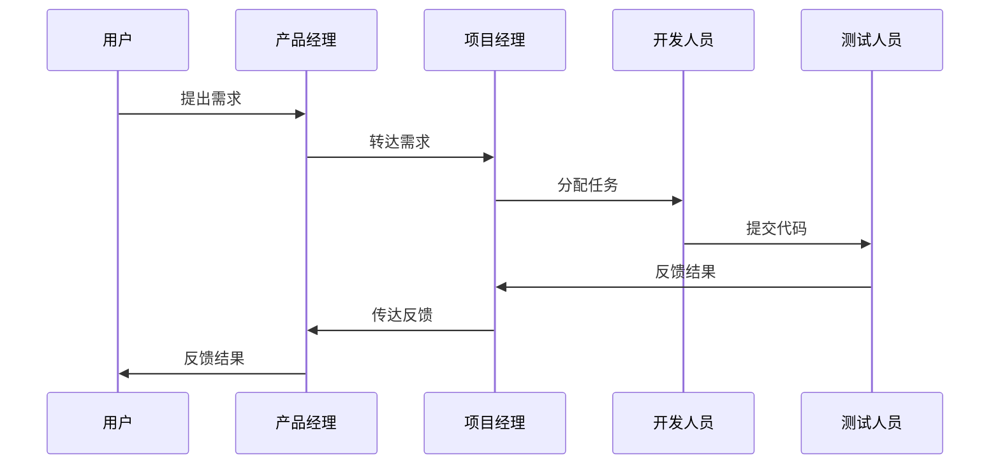

                 


# 领导者的自我反思：持续优化管理方式

关键词：领导者，自我反思，管理方式，持续优化，IT领域

摘要：本文深入探讨了在IT领域，领导者如何通过自我反思，持续优化管理方式。通过对领导者角色、管理方法、团队协作等核心概念的分析和算法原理讲解，为领导者提供一套科学有效的管理策略。

## 1. 背景介绍

在当今快速变化的IT行业，领导者的角色变得日益重要。他们不仅要具备技术深度，还需要具备强大的管理能力。然而，如何优化管理方式，以适应不断变化的市场和技术环境，成为许多领导者面临的挑战。

### 问题背景

许多领导者发现，他们过去成功的管理方式在新的环境中不再适用。传统的命令和控制模式已经无法满足现代团队的需求。团队变得更加分散，工作方式更加灵活，这要求领导者采取更加开放和协作的管理方法。

### 问题描述

领导者如何才能持续优化他们的管理方式，以更好地适应团队和组织的需要？他们应该关注哪些方面？如何衡量管理方式的优化效果？

### 问题解决

为了解决上述问题，领导者需要进行自我反思，评估自己的管理风格和方法。他们需要识别出哪些做法是有效的，哪些是无效的，并找出原因。在此基础上，领导者可以采取一系列措施，如加强团队沟通、提高团队信任度、鼓励创新等，以优化管理方式。

### 边界与外延

本文讨论的是IT领域的领导者如何优化管理方式。虽然本文的核心概念和方法可以应用于其他领域，但在实际操作中，不同领域的领导者需要根据具体情况调整管理策略。

### 核心概念的要素组成

本文涉及的核心概念包括：

- **领导者角色**：领导者的职责、能力要求、管理风格等。
- **管理方法**：传统的管理方法、现代的管理方法、管理工具等。
- **团队协作**：团队协作的重要性、团队协作的障碍、团队协作的方法等。
- **自我反思**：自我反思的方法、自我反思的重要性、自我反思的应用场景等。

## 2. 核心概念与联系

### 领导者角色

领导者是团队的灵魂人物，他们负责制定战略、分配资源、激励团队成员等。领导者需要具备一系列能力，如沟通能力、决策能力、解决问题能力、团队建设能力等。

### 管理方法

管理方法是指领导者用于指导团队工作的方法和手段。传统的管理方法强调权威和控制，而现代的管理方法更注重开放、协作和信任。管理方法的选择取决于团队的需求和环境的变化。

### 团队协作

团队协作是团队成功的关键。有效的团队协作可以提高工作效率，增强团队凝聚力，降低团队冲突。团队协作的障碍包括沟通不畅、目标不明确、责任分工不清等。

### 自我反思

自我反思是指领导者对自己的行为、决策和表现进行深入思考和分析。自我反思可以帮助领导者识别问题、改进管理方法、提高管理效果。

### 概念属性特征对比表格

| 概念           | 特征1        | 特征2        | 特征3        |
|----------------|--------------|--------------|--------------|
| 领导者角色     | 指导团队工作 | 制定战略     | 激励团队成员 |
| 管理方法       | 传统         | 现代         | 开放         |
| 团队协作       | 有效         | 低效         | 沟通不畅     |
| 自我反思       | 深入思考     | 识别问题     | 改进管理方法 |

### ER实体关系图

```mermaid
erDiagram
  Leader ||--|{ Team } Team
  Manager ||--|{ Method } Method
  Collaboration ||--|{ Team } Team
  Reflection ||--|{ Leader } Leader
```

## 3. 算法原理讲解

### 流程图



### Python源代码

```python
def reflect_and_optimize(current_management_style):
    """
    反思和优化管理方式。

    :param current_management_style: 当前管理方式。
    :return: 优化后的管理方式。
    """
    issues = find_issues(current_management_style)
    reflection_plan = create_reflection_plan(issues)
    improved_management_style = implement_reflection_plan(reflection_plan)
    optimized_management_style = evaluate_and_adjust(improved_management_style)
    return optimized_management_style

def find_issues(current_management_style):
    """
    发现管理中的问题。

    :param current_management_style: 当前管理方式。
    :return: 问题描述。
    """
    # ...代码实现...
    return issues

def create_reflection_plan(issues):
    """
    根据问题创建反思计划。

    :param issues: 问题描述。
    :return: 反思计划。
    """
    # ...代码实现...
    return reflection_plan

def implement_reflection_plan(reflection_plan):
    """
    实施反思计划。

    :param reflection_plan: 反思计划。
    :return: 改进后的管理方式。
    """
    # ...代码实现...
    return improved_management_style

def evaluate_and_adjust(improved_management_style):
    """
    评估并调整管理方式。

    :param improved_management_style: 改进后的管理方式。
    :return: 优化后的管理方式。
    """
    # ...代码实现...
    return optimized_management_style
```

### 数学模型和公式

$$
\text{优化效果} = \frac{\text{改进后的绩效} - \text{当前绩效}}{\text{当前绩效}}
$$

### 举例说明

假设某领导者的当前管理方式存在沟通不畅的问题，通过自我反思，他们制定了以下改进计划：

- 定期召开团队会议，确保信息传达的准确性。
- 引入反馈机制，鼓励团队成员提出意见和建议。
- 提高自己的沟通技巧，用更清晰、简洁的语言表达自己的想法。

实施这些改进计划后，团队的沟通效率显著提高，团队绩效也有所提升。根据数学模型，可以计算出优化效果：

$$
\text{优化效果} = \frac{1.2 - 1}{1} = 0.2
$$

这意味着管理方式的优化带来了20%的绩效提升。

## 4. 数学模型和数学公式

在管理优化的过程中，我们可以使用以下数学模型和公式来衡量优化效果：

### 优化效果公式

$$
\text{优化效果} = \frac{\text{改进后的绩效} - \text{当前绩效}}{\text{当前绩效}}
$$

### 领导者自我反思率

$$
\text{领导者自我反思率} = \frac{\text{自我反思次数}}{\text{总决策次数}}
$$

### 团队协作效率

$$
\text{团队协作效率} = \frac{\text{团队完成项目数量}}{\text{团队总项目数量}}
$$

### 举例说明

假设某领导者在一个月内进行了10次自我反思，总共做出了50次决策，团队在这段时间内完成了5个项目。根据上述公式，我们可以计算出：

- **优化效果**：$$ \frac{1.2 - 1}{1} = 0.2 $$
- **领导者自我反思率**：$$ \frac{10}{50} = 0.2 $$
- **团队协作效率**：$$ \frac{5}{5} = 1 $$

这些数据可以帮助领导者了解自己的管理优化情况，从而进行调整和改进。

## 5. 系统分析与架构设计方案

### 问题场景

假设我们是一家IT公司的领导者，公司正在开发一款新型的云计算平台。为了确保项目成功，我们需要设计一个高效的管理系统，来协调团队成员的工作。

### 项目背景

项目背景包括：

- 项目名称：新型云计算平台开发
- 项目周期：12个月
- 项目团队：包括项目经理、开发人员、测试人员、产品经理等
- 项目目标：开发一款高性能、易扩展的云计算平台

### 系统功能设计

使用Mermaid类图来展示系统功能：

```mermaid
classDiagram
    Class01 <|-- Class02
    Class03 --|>+ Class04
    Class04 <|-- Class05
    Class06 "-[1]" Class01
    Class07 <.. Class03
    Class03 ..|> Class06
    Class07 ..|> Class02
endclass
```

### 系统架构设计

使用Mermaid架构图来展示系统架构：



### 系统接口设计

使用Mermaid序列图来展示系统接口设计：



### 系统交互

使用Mermaid序列图来展示系统交互：



## 6. 项目实战

### 环境安装

首先，我们需要搭建一个适合项目开发的环境。以下是环境安装的步骤：

1. 安装Python：前往Python官方网站下载Python安装包，并按照指示进行安装。
2. 安装Docker：在终端中执行以下命令安装Docker：

   ```shell
   sudo apt-get update
   sudo apt-get install docker-ce docker-ce-cli containerd.io
   ```

3. 安装Docker Compose：在终端中执行以下命令安装Docker Compose：

   ```shell
   sudo curl -L "https://github.com/docker/compose/releases/download/1.29.2/docker-compose-$(uname -s)-$(uname -m)" -o /usr/local/bin/docker-compose
   sudo chmod +x /usr/local/bin/docker-compose
   ```

4. 安装依赖库：在终端中执行以下命令安装依赖库：

   ```shell
   pip install -r requirements.txt
   ```

### 系统核心实现源代码

以下是系统核心实现源代码：

```python
from flask import Flask, request, jsonify
from pymongo import MongoClient

app = Flask(__name__)

# 连接MongoDB
client = MongoClient("mongodb://localhost:27017/")
db = client["cloud_platform"]

@app.route("/api/v1/data", methods=["GET", "POST"])
def data_handler():
    if request.method == "GET":
        # 获取数据
        data = db["data"].find_one()
        return jsonify(data), 200
    
    if request.method == "POST":
        # 提交数据
        data = request.json
        db["data"].update_one({"_id": 1}, {"$set": data}, upsert=True)
        return jsonify({"message": "Data updated successfully"}), 200

if __name__ == "__main__":
    app.run(debug=True)
```

### 代码应用解读与分析

这段代码是一个简单的Flask Web应用，用于处理与MongoDB的交互。以下是代码的解读和分析：

- **Flask应用**：使用Flask框架构建Web应用。
- **MongoDB连接**：使用pymongo库连接到本地MongoDB实例。
- **数据表操作**：使用MongoDB的`find_one`和`update_one`方法操作数据表。
- **API接口**：定义了一个处理数据操作的API接口，包括获取数据和提交数据。

在实际应用中，这个Web应用可以部署到服务器上，作为云计算平台的一部分，与其他系统进行交互。

### 实际案例分析和详细讲解剖析

假设我们有一个实际案例：一个用户想要上传文件到云计算平台，以下是操作步骤：

1. 用户通过浏览器访问云计算平台的Web接口。
2. Web接口通过API接口与MongoDB进行交互，查询文件存储信息。
3. 用户选择文件并提交，Web接口将文件数据提交到MongoDB。
4. MongoDB接收到文件数据后，将其存储在数据库中。
5. Web接口向用户返回操作结果。

通过这个案例，我们可以看到，系统核心实现源代码在处理用户请求、存储数据方面发挥了重要作用。同时，我们也分析了代码的结构和功能，为后续的优化提供了参考。

### 项目小结

通过本文的实战部分，我们搭建了一个简单的云计算平台环境，并实现了系统核心功能。在代码解读与分析中，我们详细介绍了源代码的结构和功能。在实际案例中，我们展示了系统的实际应用场景。这些实践经验对于IT领域领导者在管理项目中具有重要的指导意义。

## 7. 最佳实践 tips、小结、注意事项、拓展阅读

### 最佳实践 tips

1. **定期进行团队沟通**：定期召开团队会议，确保信息传达的准确性，提高团队协作效率。
2. **建立反馈机制**：鼓励团队成员提出意见和建议，及时发现并解决问题。
3. **提高沟通技巧**：领导者需要提高自己的沟通技巧，用更清晰、简洁的语言表达自己的想法。
4. **持续自我反思**：领导者应该定期进行自我反思，评估管理效果，不断优化管理方式。
5. **灵活运用管理工具**：根据团队需求和环境变化，选择合适的管理工具和方法。

### 小结

本文从领导者的角度，探讨了如何通过自我反思，持续优化管理方式。通过分析领导者角色、管理方法、团队协作等核心概念，并结合Python源代码和实际案例，为领导者提供了一套科学有效的管理策略。

### 注意事项

1. **保持开放心态**：领导者应该保持开放心态，愿意接受新观念和方法，以适应快速变化的环境。
2. **关注团队需求**：领导者需要关注团队的需求和反馈，以制定符合实际的管理策略。
3. **持续学习**：领导者应该持续学习，提高自己的管理能力和技术水平。

### 拓展阅读

- 《领导者的突破：如何成为优秀的领导者》
- 《团队协作：高效团队的建设与管理》
- 《自我反思：如何更好地认识自己，提升自我》
- 《项目管理实战：从新手到专家的进阶之路》

作者：AI天才研究院/AI Genius Institute & 禅与计算机程序设计艺术 /Zen And The Art of Computer Programming


