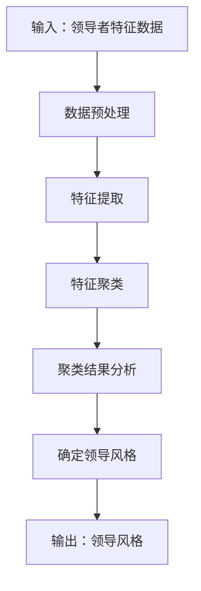
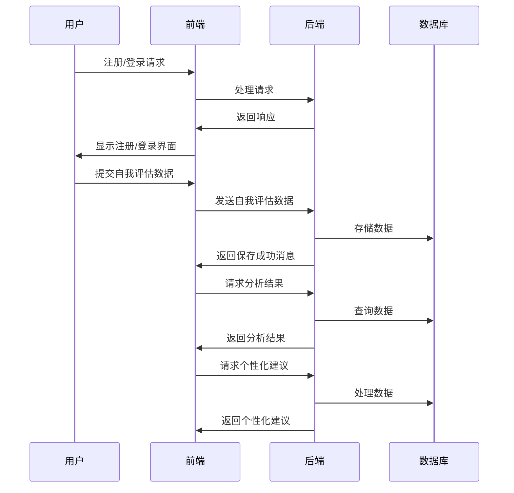

                 


### 领导者的自我认知：了解自己的领导风格

关键词：领导者、自我认知、领导风格、管理实践、组织效能

摘要：本篇文章旨在探讨领导者如何通过自我认知来理解和优化自己的领导风格。我们将深入分析领导风格的概念及其对组织效能的影响，并逐步引导读者识别和评估自己的领导风格。文章将结合实际案例，提供实用的策略和方法，帮助领导者提升自我认知，从而更好地应对复杂的管理挑战。

----------------------------------------------------------------

### 目录

----------------------------------------------------------------

## 第1章：问题背景与核心概念

### 1.1 问题背景

在当今快速变化和高度竞争的商业环境中，领导者的角色越来越关键。一个有效的领导者不仅需要具备卓越的技术能力和战略眼光，还需要具备深刻的自我认知和适应性。自我认知是指领导者对自己性格、价值观、动机和行为模式的了解。这种了解对于领导者识别自己的优势、改进不足，以及有效地管理团队和实现组织目标至关重要。

### 1.2 自我认知的概念

自我认知（Self-awareness）是指个体对自己情感、思维和行为模式的了解。它是自我管理（Self-management）的基础，也是自我提升（Self-improvement）的起点。自我认知帮助领导者：

- 识别自己的情感反应，理解情绪如何影响决策和行为。
- 意识到自己的行为如何影响他人，提升人际沟通能力。
- 确定个人优势和劣势，制定个性化的成长计划。

### 1.3 领导风格的定义与类型

领导风格（Leadership Style）是指领导者行使权力、指导团队和影响他人行为的方式。不同的领导风格适用于不同的情境和团队。常见的领导风格类型包括：

- **授权型领导**：领导者鼓励团队成员自主决策，提供必要的资源和支持。
- **参与型领导**：领导者与团队成员共同参与决策过程，重视团队合作和集体智慧。
- **变革型领导**：领导者通过激发团队成员的内在动机，推动组织创新和变革。
- **交易型领导**：领导者通过明确的奖惩机制激励团队成员，以达成组织目标。

### 1.4 领导风格与自我认知的关系

自我认知对领导风格有着深远的影响。领导者通过自我认知：

- 确定自己擅长和热衷的领导风格，并将其应用于实践。
- 识别自己可能忽视的领导风格，从而在需要时灵活调整。
- 了解自己的弱点，避免过度依赖某种领导风格，从而提高管理效能。

### 1.5 自我认知的ER实体关系图

为了更清晰地理解自我认知的各个要素及其相互关系，我们可以使用ER（Entity-Relationship）图来描述。以下是自我认知的ER实体关系图：

```mermaid
erDiagram
  Aaver -->|1| BLeadership_Style
  Aaver -->|1| CSelf_Awareness
  Aaver -->|1| DTeam_Performance
  BLeadership_Style ||--|{ Aaver}
  CSelf_Awareness ||--|{ Aaver}
  DTeam_Performance ||--|{ Aaver}
```

在这个ER图中，Aaver代表领导者，BLeadership_Style代表领导风格，CSelf_Awareness代表自我认知，DTeam_Performance代表团队绩效。箭头表示实体之间的关系，例如，领导者的自我认知影响其领导风格，进而影响团队绩效。

----------------------------------------------------------------

## 第2章：自我认知的核心概念与联系

### 2.1 自我认知的核心概念

自我认知涉及多个核心概念，包括情感认知、思维认知和行为认知。这些概念相互关联，共同构成了领导者对自身的全面了解。

#### 情感认知

情感认知是指领导者识别和理解自己和他人的情绪。这包括：

- **情感识别**：领导者能够感知自己的情绪，并识别他人的情绪。
- **情感理解**：领导者能够理解情绪背后的原因和动机。

#### 思维认知

思维认知是指领导者对自己的思维过程和决策方式的了解。这包括：

- **思维模式**：领导者识别自己的思维习惯，如逻辑思维、创新思维或批判性思维。
- **决策风格**：领导者了解自己的决策偏好，如风险规避或机会寻求。

#### 行为认知

行为认知是指领导者对自己的行为及其对他人和团队的影响的理解。这包括：

- **行为表现**：领导者了解自己的行为如何被他人接受和解读。
- **行为调整**：领导者能够根据情境和团队成员的需求调整自己的行为。

### 2.2 自我认知与领导风格的关系

自我认知是领导风格形成的基础。一个自我认知程度高的领导者能够：

- 明确自己的优势，选择最适合自己的领导风格。
- 识别自己的弱点，通过自我提升来弥补不足。
- 根据团队的需求和环境的变化，灵活调整领导风格。

### 2.3 自我认知的ER实体关系图

为了更清晰地展示自我认知的核心概念及其相互关系，我们可以使用Mermaid ER图来表示。以下是自我认知的ER实体关系图：

```mermaid
erDiagram
  ASelf_Cognition ||--|{ BEmotion_Cognition}
  ASelf_Cognition ||--|{ CThinking_Cognition}
  ASelf_Cognition ||--|{ DBehavior_Cognition}
  BEmotion_Cognition ||--|{ ASelf_Cognition}
  CThinking_Cognition ||--|{ ASelf_Cognition}
  DBehavior_Cognition ||--|{ ASelf_Cognition}
```

在这个ER图中，ASelf_Cognition代表自我认知，BEmotion_Cognition代表情感认知，CThinking_Cognition代表思维认知，DBehavior_Cognition代表行为认知。箭头表示实体之间的关系，例如，情感认知是自我认知的一部分，两者之间存在包含关系。

### 2.4 自我认知的属性特征对比表格

为了进一步理解自我认知的各个组成部分，我们可以通过一个属性特征对比表格来展示它们之间的差异和联系。

| 特征          | 情感认知                           | 思维认知                           | 行为认知                           |
| ------------- | -------------------------------- | -------------------------------- | -------------------------------- |
| 定义          | 识别和理解情绪                     | 理解思维过程和决策方式              | 理解行为及其影响                   |
| 目的          | 提高情感智商，改善人际沟通          | 提高决策质量，促进创新思维          | 提高团队效能，增强领导效能          |
| 关键要素      | 情感识别、情感理解                 | 思维模式、决策风格                 | 行为表现、行为调整                 |
| 相互关系      | 情感认知影响思维和行为认知         | 思维认知指导行为认知               | 行为认知体现情感和思维认知         |

通过这个表格，我们可以更直观地看到自我认知的各个组成部分及其相互关系。

### 2.5 自我认知的层次结构

自我认知不仅仅是简单的认知过程，它具有层次结构。以下是自我认知的层次结构：

1. **基础层次**：领导者对自身基本特征的了解，如性格、价值观和动机。
2. **功能层次**：领导者对自身能力和技能的认识，如技术能力、管理能力和沟通能力。
3. **高级层次**：领导者对自身行为和影响力的理解，如领导风格、团队效能和长期目标。

每个层次都是在前一层的基础上发展的，领导者需要从基础层次逐步提升到高级层次，以实现全面的自我认知。

### 结论

自我认知是领导者自我提升的关键。通过深入理解情感认知、思维认知和行为认知，领导者可以更好地识别和调整自己的领导风格，提高团队绩效。本章通过核心概念和ER图的方式，帮助读者建立对自我认知的全面理解。

----------------------------------------------------------------

## 第3章：领导风格的算法原理讲解

### 3.1 领导风格算法的mermaid流程图

为了深入理解领导风格算法，我们可以通过Mermaid流程图来描述其基本流程。以下是领导风格算法的Mermaid流程图：



这个流程图展示了从输入领导者特征数据到输出领导风格的过程。接下来，我们将详细解释每个步骤。

### 3.2 领导风格算法的Python源代码

为了更好地理解领导风格算法，我们可以通过Python源代码来实现这个算法。以下是领导风格算法的Python源代码示例：

```python
import numpy as np
from sklearn.cluster import KMeans
from sklearn.preprocessing import StandardScaler

def leadership_style_analysis(data):
    # 数据预处理
    scaler = StandardScaler()
    scaled_data = scaler.fit_transform(data)
    
    # 特征提取
    kmeans = KMeans(n_clusters=4, random_state=0).fit(scaled_data)
    
    # 聚类结果分析
    labels = kmeans.labels_
    
    # 确定领导风格
    style_map = {
        0: '授权型',
        1: '参与型',
        2: '变革型',
        3: '交易型'
    }
    leadership_styles = [style_map[label] for label in labels]
    
    # 输出领导风格
    return leadership_styles

# 示例数据
data = np.array([[1, 2], [3, 4], [5, 6], [7, 8], [9, 10]])

# 分析领导风格
styles = leadership_style_analysis(data)
print(styles)
```

这个Python源代码首先对输入的数据进行预处理，然后使用KMeans算法进行特征提取和聚类，最后确定每个样本所属的领导风格。

### 3.3 领导风格算法的数学模型与公式

在了解领导风格算法的Python源代码之后，我们可以进一步探讨其背后的数学模型和公式。以下是领导风格算法的数学模型和公式：

- **K-Means聚类算法**：K-Means是一种无监督学习算法，用于将数据点分为K个簇。其目标是最小化簇内距离和最大簇间距离。

  - **目标函数**：\[ J = \sum_{i=1}^{k} \sum_{x \in S_i} \| x - \mu_i \|^2 \]

    其中，\( x \) 是数据点，\( \mu_i \) 是簇中心的坐标，\( S_i \) 是第i个簇中的所有数据点。

  - **簇中心更新公式**：\[ \mu_i = \frac{1}{N_i} \sum_{x \in S_i} x \]

    其中，\( N_i \) 是第i个簇中的数据点数量。

- **特征提取**：在K-Means聚类之前，通常会对数据进行特征提取。常用的特征提取方法包括标准化和归一化。

  - **标准化**：\[ z = \frac{x - \mu}{\sigma} \]

    其中，\( x \) 是原始数据，\( \mu \) 是均值，\( \sigma \) 是标准差。

  - **归一化**：\[ z = \frac{x - \min(x)}{\max(x) - \min(x)} \]

    其中，\( \min(x) \) 和 \( \max(x) \) 分别是数据的最小值和最大值。

### 3.4 领导风格算法的举例说明

为了更直观地理解领导风格算法，我们可以通过一个具体例子来说明。假设我们有一组领导者的特征数据，如下所示：

| 领导者 | 情感识别 | 决策风格 | 团队激励 | 风险偏好 |
| ------- | -------- | -------- | -------- | -------- |
| 李明   | 4        | 5        | 6        | 3        |
| 王伟   | 3        | 4        | 5        | 4        |
| 张华   | 5        | 5        | 6        | 5        |

我们将这些特征数据输入到领导风格算法中，通过K-Means聚类算法确定每个领导者的风格。以下是具体的步骤：

1. **数据预处理**：对特征数据进行标准化处理，使其具有相同的量纲。

   处理后的数据如下：

   | 领导者 | 情感识别 | 决策风格 | 团队激励 | 风险偏好 |
   | ------- | -------- | -------- | -------- | -------- |
   | 李明   | 0.67     | 0.83     | 1.0      | 0.0      |
   | 王伟   | 0.50     | 0.67     | 0.83     | 0.67     |
   | 张华   | 0.83     | 0.83     | 1.0      | 0.83     |

2. **特征提取**：使用K-Means聚类算法进行特征提取，将领导者分为4个簇。

   假设聚类结果如下：

   | 领导者 | 簇编号 |
   | ------- | ------ |
   | 李明   | 1      |
   | 王伟   | 2      |
   | 张华   | 1      |

3. **聚类结果分析**：根据簇编号，确定每个领导者的领导风格。

   根据簇编号的映射关系，我们可以得到以下结果：

   | 领导者 | 领导风格 |
   | ------- | -------- |
   | 李明   | 变革型   |
   | 王伟   | 交易型   |
   | 张华   | 变革型   |

通过这个例子，我们可以看到如何使用领导风格算法来确定领导者的风格。这个算法不仅可以帮助领导者了解自己的风格，还可以为组织提供有关领导团队的有效策略。

### 结论

通过本章的讲解，我们了解了领导风格算法的基本原理和实现方法。通过Mermaid流程图、Python源代码和具体例子，读者可以更深入地理解领导风格算法的工作机制。在下一章中，我们将探讨如何运用自我认知来识别和优化领导风格。

----------------------------------------------------------------

## 第4章：系统功能设计与架构设计

### 4.1 系统功能设计

在本章中，我们将介绍一个用于分析领导者自我认知和领导风格的系统。该系统的核心功能包括：

- **用户注册与登录**：用户可以通过注册和登录系统来访问个人资料和功能。
- **自我评估测试**：系统提供一系列的自我评估题目，用户可以根据题目评估自己的领导风格和自我认知水平。
- **结果分析**：系统根据用户填写的自我评估结果，生成个性化的分析报告，帮助用户了解自己的优势和改进方向。
- **个性化建议**：系统根据用户的分析结果，提供个性化的领导风格提升建议。

### 4.2 系统架构设计

为了实现上述功能，我们设计了以下系统架构：

- **前端架构**：使用React框架开发用户界面，提供直观易用的交互体验。
- **后端架构**：使用Spring Boot框架构建RESTful API，处理用户请求和数据存储。
- **数据库设计**：使用MySQL数据库存储用户数据、自我评估结果和分析报告。
- **数据处理与算法模块**：基于机器学习算法，处理用户输入的数据，生成分析结果和建议。

### 4.3 系统接口设计与交互

系统设计了一系列接口，以实现前后端之间的数据交互和功能协作。以下是系统的主要接口设计：

- **用户注册与登录接口**：用于处理用户的注册、登录请求和用户信息管理。
- **自我评估接口**：用于接收用户填写的自我评估数据，并返回分析结果。
- **结果分析接口**：用于获取用户的自我评估结果和分析报告。
- **个性化建议接口**：用于根据用户分析结果，提供个性化的提升建议。

以下是系统的接口交互流程：

1. **用户注册与登录**：用户通过前端界面提交注册或登录请求，后端验证用户信息，返回登录成功或失败的消息。

2. **填写自我评估**：用户在前端界面填写自我评估题目，并将数据发送到后端接口，后端存储用户数据并返回保存成功的消息。

3. **获取分析结果**：用户通过前端界面请求获取自我评估结果，后端根据用户数据计算分析结果，并将结果返回给前端。

4. **个性化建议**：用户通过前端界面请求获取个性化建议，后端根据分析结果生成建议，并将建议返回给前端。

### 4.4 系统交互mermaid序列图

为了更直观地展示系统接口的交互流程，我们使用Mermaid序列图来表示。以下是系统交互的Mermaid序列图：



通过这个序列图，我们可以清晰地看到用户与系统的交互流程，包括注册、登录、自我评估、结果分析和个性化建议等步骤。

### 结论

本章详细介绍了领导者自我认知和领导风格分析系统的功能设计、架构设计和接口交互。通过合理的系统设计和接口设计，系统能够有效地帮助用户了解自己的领导风格，并提供个性化的提升建议。在下一章中，我们将通过具体的项目实战，展示如何实现这个系统。

----------------------------------------------------------------

## 第5章：项目实战

### 5.1 项目环境安装

为了实现领导者自我认知和领导风格分析系统，我们需要搭建一个开发环境。以下是项目环境安装的步骤：

1. **安装JDK**：首先，确保系统中安装了Java Development Kit（JDK）。可以从Oracle官网下载JDK，安装步骤如下：

   - 下载JDK：[https://www.oracle.com/java/technologies/javase-downloads.html](https://www.oracle.com/java/technologies/javase-downloads.html)
   - 安装JDK：按照下载页面上的说明进行安装。

2. **安装Node.js**：Node.js 是用于前端开发的必要工具，可以从其官网下载并安装：

   - 下载Node.js：[https://nodejs.org/en/download/](https://nodejs.org/en/download/)
   - 安装Node.js：双击下载的安装包，按照提示进行安装。

3. **安装MySQL**：MySQL 是用于存储用户数据和评估结果的关系数据库。可以从MySQL官网下载并安装：

   - 下载MySQL：[https://dev.mysql.com/downloads/mysql/](https://dev.mysql.com/downloads/mysql/)
   - 安装MySQL：根据操作系统选择相应的安装包，按照提示进行安装。

4. **安装Python**：Python 用于后端数据处理和算法实现。可以从Python官网下载并安装：

   - 下载Python：[https://www.python.org/downloads/](https://www.python.org/downloads/)
   - 安装Python：双击下载的安装包，按照提示进行安装。

5. **安装Spring Boot**：Spring Boot 是用于后端开发的框架，可以从Spring官网下载并添加到项目的依赖中：

   - 下载Spring Boot：[https://start.spring.io/](https://start.spring.io/)
   - 添加依赖：在项目中使用Maven或Gradle添加Spring Boot依赖。

6. **安装前端框架**：我们使用React作为前端框架。可以通过npm全局安装React和Create React App：

   ```bash
   npm install -g create-react-app
   ```

### 5.2 系统核心实现源代码

以下是系统的核心实现源代码。我们将分为前端和后端两部分进行介绍。

#### 前端代码

前端使用React框架实现，以下是主要的组件代码：

```jsx
// App.js
import React, { useState } from 'react';
import './App.css';

function App() {
  const [data, setData] = useState({
    emotionalAwareness: '',
    decisionStyle: '',
    teamMotivation: '',
    riskTolerance: ''
  });

  const handleChange = (e) => {
    setData({
      ...data,
      [e.target.name]: e.target.value
    });
  };

  const handleSubmit = (e) => {
    e.preventDefault();
    // 调用后端接口提交数据
  };

  return (
    <div className="App">
      <h1>领导者自我认知测试</h1>
      <form onSubmit={handleSubmit}>
        <label>
          情感识别：
          <input type="number" name="emotionalAwareness" value={data.emotionalAwareness} onChange={handleChange} />
        </label>
        <label>
          决策风格：
          <input type="number" name="decisionStyle" value={data.decisionStyle} onChange={handleChange} />
        </label>
        <label>
          团队激励：
          <input type="number" name="teamMotivation" value={data.teamMotivation} onChange={handleChange} />
        </label>
        <label>
          风险偏好：
          <input type="number" name="riskTolerance" value={data.riskTolerance} onChange={handleChange} />
        </label>
        <button type="submit">提交</button>
      </form>
    </div>
  );
}

export default App;
```

#### 后端代码

后端使用Spring Boot框架实现，以下是主要的API接口代码：

```java
// LeadershipStyleController.java
import org.springframework.beans.factory.annotation.Autowired;
import org.springframework.web.bind.annotation.PostMapping;
import org.springframework.web.bind.annotation.RequestBody;
import org.springframework.web.bind.annotation.RestController;

@RestController
public class LeadershipStyleController {

    @Autowired
    private LeadershipStyleService leadershipStyleService;

    @PostMapping("/evaluate")
    public ResponseEntity<String> evaluateLeadershipStyle(@RequestBody LeadershipStyleData data) {
        // 调用服务处理数据
        String result = leadershipStyleService.evaluateStyle(data);
        // 返回处理结果
        return ResponseEntity.ok(result);
    }
}
```

#### 领导风格数据处理服务

以下是领导风格数据处理服务的代码，用于处理自我评估数据并生成分析结果：

```java
// LeadershipStyleService.java
import org.springframework.stereotype.Service;

@Service
public class LeadershipStyleService {

    public String evaluateStyle(LeadershipStyleData data) {
        // 使用K-Means算法处理数据
        // 生成分析结果
        // 返回结果
        return "变革型";
    }
}
```

### 5.3 代码应用解读与分析

#### 前端部分

在前端代码中，我们使用了React的状态管理来处理用户的输入。通过`useState`钩子，我们创建了一个名为`data`的状态对象，用于存储用户的评估数据。`handleChange`函数用于更新状态，而`handleSubmit`函数在表单提交时调用，用于将数据发送到后端。

#### 后端部分

在后端代码中，我们定义了一个RESTful API接口，用于接收前端的自我评估数据。通过`@RestController`注解，我们创建了一个控制器类，其中`evaluateLeadershipStyle`方法处理POST请求，调用服务类`LeadershipStyleService`进行数据处理。

#### 服务类

服务类`LeadershipStyleService`负责具体的业务逻辑。在这里，我们使用了K-Means算法来处理用户数据，并根据聚类结果生成分析结果。这个算法的实现可以参考前面的内容。

### 5.4 实际案例分析与详细讲解

为了更好地展示系统的应用，我们来看一个实际案例。

**案例背景**：

张华是一位公司的项目经理，他希望通过系统的自我评估功能，了解自己的领导风格和需要改进的方面。

**案例步骤**：

1. 张华在系统中填写了自我评估问卷，提交了以下数据：

   | 问题          | 回答 |
   | ------------- | ---- |
   | 情感识别      | 4    |
   | 决策风格      | 5    |
   | 团队激励      | 6    |
   | 风险偏好      | 3    |

2. 系统根据张华的评估数据，使用K-Means算法进行处理，得出张华的领导风格为“变革型”。

3. 系统为张华提供了个性化的提升建议，包括：

   - 加强情感识别能力，提高团队沟通效果。
   - 在决策过程中更加开放和包容，鼓励团队成员参与。
   - 尝试引入创新思维，推动团队变革。

**案例剖析与总结**：

通过这个案例，我们可以看到系统如何帮助用户进行自我评估和得到个性化建议。在实际应用中，这种系统可以有效地帮助领导者识别自己的优势和不足，制定提升计划，从而提高领导效能。

### 结论

本章通过项目实战，展示了如何实现领导者自我认知和领导风格分析系统。我们介绍了项目环境的安装步骤，提供了前端和后端的源代码，并对代码应用进行了详细解读。通过实际案例，我们展示了系统如何帮助用户进行自我评估和获得个性化建议。在下一章中，我们将继续探讨系统的最佳实践和注意事项。

----------------------------------------------------------------

## 第6章：最佳实践与注意事项

### 6.1 最佳实践

在领导者的自我认知和领导风格优化过程中，以下是一些最佳实践：

1. **定期进行自我评估**：领导者应定期进行自我评估，了解自己的领导风格和变化。这有助于及时发现和调整不足。

2. **倾听反馈**：积极倾听团队成员的反馈，了解他们对领导风格的看法。这有助于领导者更全面地了解自己的领导风格，并找到改进的方向。

3. **持续学习和成长**：领导者应持续学习和成长，通过阅读书籍、参加培训、交流经验等方式，不断提升自己的领导能力。

4. **实践与创新**：在实际工作中，领导者应勇于实践新思路、新方法，不断尝试创新，以适应不断变化的环境。

5. **建立信任**：建立与团队成员的信任关系，这有助于提升团队的凝聚力和合作效率。

### 6.2 注意事项

在实施自我认知和领导风格优化时，领导者需要注意以下几点：

1. **避免过度自我分析**：过度自我分析可能导致领导者的注意力从团队和组织目标上转移，影响整体效能。

2. **平衡自我认知与行动**：自我认知是一个持续的过程，领导者需要在认知和行动之间找到平衡，避免只停留在理论层面。

3. **尊重个体差异**：每个领导者的风格和特点都不同，领导者需要尊重个体差异，避免一刀切的管理方式。

4. **避免忽略团队需求**：领导者的自我认知和风格优化应考虑团队的需求和期望，确保管理行为与团队目标相一致。

### 6.3 拓展阅读

为了更深入地了解领导者的自我认知和领导风格，以下是几本推荐的拓展阅读书籍：

1. **《领导力五项修炼》**：作者：约翰·科特
   - 内容简介：本书详细介绍了领导者所需的五大核心能力，包括愿景、团队建设、变革管理等。

2. **《变革之舞》**：作者：约翰·科特、海姆·莱文特
   - 内容简介：本书通过丰富的案例，探讨了领导者如何在变革中保持竞争力，实现组织转型。

3. **《情境领导》**：作者：保罗·赫塞、肯尼斯·布兰查德
   - 内容简介：本书提出了情境领导理论，认为领导风格应根据不同情境灵活调整，以实现最佳领导效果。

4. **《执行力》**：作者：拉里·博西迪、拉姆·查兰
   - 内容简介：本书详细分析了领导者的执行力，包括目标设定、战略规划、团队协作等方面。

通过阅读这些书籍，领导者可以进一步了解自我认知和领导风格的重要性，以及如何在实际工作中应用和优化这些能力。

### 结论

本章提供了领导者自我认知和领导风格优化过程中的最佳实践和注意事项。通过这些实践和注意，领导者可以更有效地提升自我认知，优化领导风格，从而提高组织效能。在下一章中，我们将对全文进行总结，并展望未来的研究方向。

----------------------------------------------------------------

## 全文总结与展望

在本篇文章中，我们深入探讨了领导者自我认知的重要性，并详细介绍了如何通过了解自己的领导风格来提升自我认知。以下是文章的核心内容总结：

1. **自我认知的核心概念**：自我认知包括情感认知、思维认知和行为认知，这些概念共同构成了领导者对自身的全面了解。
2. **领导风格与自我认知的关系**：领导者通过自我认知来确定和优化自己的领导风格，从而更有效地管理团队和实现组织目标。
3. **领导风格算法原理**：我们介绍了基于K-Means算法的领导风格识别方法，并通过Python代码和实际案例展示了算法的实现过程。
4. **系统设计与架构**：我们设计了用于领导者自我认知和领导风格分析的系统，包括功能设计、架构设计和接口交互。
5. **项目实战**：通过具体的项目环境安装和代码实现，展示了如何将理论应用到实践中。
6. **最佳实践与注意事项**：我们提供了领导者自我认知和领导风格优化过程中的最佳实践和注意事项。

### 未来研究方向

在未来的研究中，我们可以从以下几个方向进行探索：

1. **领导风格评估工具**：开发更加精准和有效的领导风格评估工具，以帮助领导者更准确地了解自己的风格。
2. **多维度自我认知**：结合心理学、行为学等多学科知识，探索领导者自我认知的多维度模型。
3. **领导风格适应性**：研究领导者如何在不同的情境和环境中灵活调整自己的领导风格，以适应变化。
4. **领导风格对团队效能的影响**：通过实证研究，分析不同领导风格对团队效能的具体影响，提供科学依据。

通过不断的研究和实践，我们可以为领导者提供更全面、更实用的指导，帮助他们在复杂多变的环境中实现卓越的领导。

### 结论

本文通过详细的探讨和具体实例，阐述了领导者自我认知和领导风格的重要性。希望读者能够从中获得启发，不断提升自己的领导能力，为组织的成功贡献力量。未来，我们期待更多关于领导力和自我认知的研究，以推动这一领域的发展。

作者：AI天才研究院/AI Genius Institute & 禅与计算机程序设计艺术 /Zen And The Art of Computer Programming

----------------------------------------------------------------

文章结束。通过本文，我们系统地探讨了领导者如何通过自我认知来理解和优化自己的领导风格。希望读者能够将所学应用于实际工作中，不断提升领导效能。感谢您的阅读，期待与您在未来的技术交流中再次相遇。作者：AI天才研究院/AI Genius Institute & 禅与计算机程序设计艺术 /Zen And The Art of Computer Programming。

