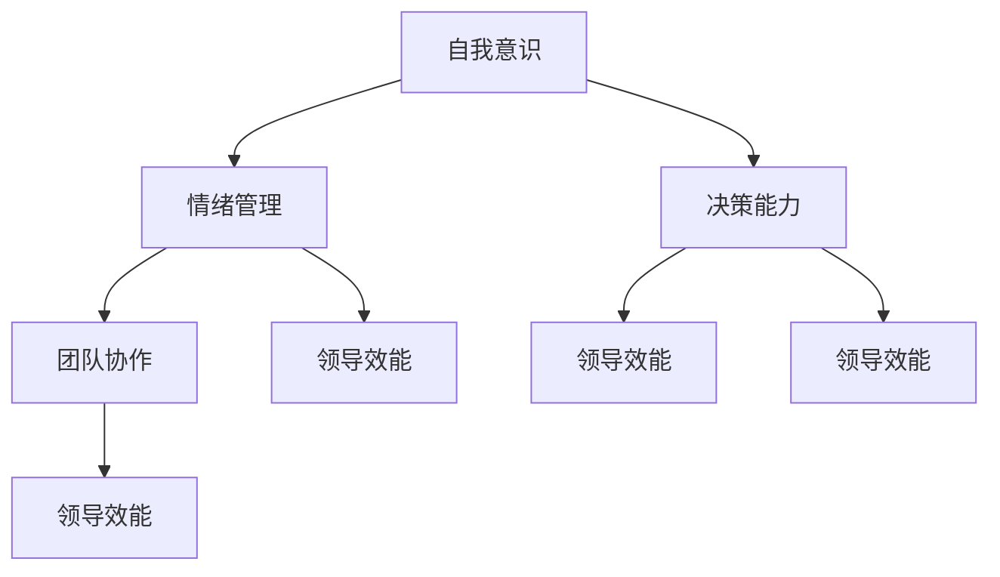

                 

### 领导者自我觉察：提升领导效能的关键

> **关键词：** 领导者自我觉察，领导效能，自我意识，情绪管理，决策能力

> **摘要：** 本文深入探讨了领导者自我觉察的概念、重要性以及其在提升领导效能中的作用。通过分析自我觉察的关键要素，如自我意识、情绪管理和决策能力，本文提出了一系列实用的工具和方法，帮助领导者提高自我觉察能力。此外，文章还通过具体案例展示了自我觉察在领导实践中的应用，并提供了提升自我觉察的策略与实践指南。

----------------------------------------------------------------

# **领导自我觉察的背景与重要性**

## **一、自我觉察的定义**

### **1.1 自我觉察的基本概念**

自我觉察（Self-awareness）是指个体对自己内心状态、情感、思维和行为的认知和了解。在领导力领域，自我觉察尤为重要，因为它直接关系到领导者的决策、团队管理、沟通协调以及领导效能。

### **1.2 自我觉察的重要性**

领导者自我觉察的重要性体现在以下几个方面：

1. **提升自我认知**：自我觉察帮助领导者更好地理解自己的价值观、信念和行为模式，从而做出更明智的决策。

2. **增强情绪管理**：领导者通过自我觉察可以更好地管理自己的情绪，避免情绪波动对团队的影响。

3. **改善决策质量**：自我觉察使领导者能够从更全面的视角看待问题，减少偏见和误导，提高决策质量。

4. **促进团队协作**：领导者通过自我觉察，能够更好地理解团队成员的需求和情感，从而促进团队协作和沟通。

5. **提升领导效能**：自我觉察有助于领导者识别和解决自身问题，提升个人效能，进而提升整个团队的效能。

## **二、问题背景**

在当前复杂多变的社会环境中，领导者面临着越来越多的挑战，如快速变化的市场、日益复杂的团队管理和日益增加的工作压力。这些挑战要求领导者不仅要具备专业的知识技能，还需要具备强大的自我觉察能力，以应对各种复杂局面。

## **三、问题描述**

领导者在面对挑战时，往往会出现以下问题：

1. **缺乏自我认知**：许多领导者对自己的优点和缺点缺乏清晰的认识，导致决策不当或行为失当。

2. **情绪管理能力不足**：领导者情绪波动大，容易受到负面情绪的影响，从而影响决策和团队氛围。

3. **决策质量不高**：领导者由于缺乏自我觉察，容易受到各种偏见和误导，导致决策失误。

4. **沟通协调困难**：领导者缺乏自我觉察，难以理解团队成员的需求和情感，导致沟通不畅。

## **四、问题解决**

为了解决上述问题，领导者需要提升自我觉察能力，具体措施包括：

1. **加强自我反思**：领导者应定期进行自我反思，了解自己的思维模式、行为习惯和情感状态。

2. **学习情绪管理技巧**：领导者可以通过学习心理学知识、参加情绪管理培训等方式，提升自己的情绪管理能力。

3. **培养决策能力**：领导者应通过学习决策理论、实践决策技巧，提升自己的决策能力。

4. **加强团队沟通**：领导者应主动与团队成员沟通，了解他们的需求和情感，促进团队协作。

## **五、边界与外延**

自我觉察不仅仅是一个个体的内部过程，它还涉及到领导者与团队、组织之间的关系。一个具有高度自我觉察的领导者能够更好地理解团队和组织的需求，从而实现个人与组织的共同发展。

## **六、概念结构与核心要素组成**

领导者的自我觉察可以分为以下几个核心要素：

1. **自我意识**：对自身情感、思维和行为模式的认知。

2. **情绪管理**：对自身情绪的识别、理解和调节。

3. **决策能力**：在复杂环境中做出明智决策的能力。

4. **团队协作**：理解并促进团队成员的需求和情感，实现团队协作。

5. **领导效能**：通过自我觉察能力提升个人和团队的工作效能。

在本文接下来的章节中，我们将进一步探讨自我觉察的各个核心要素，并提供实用的工具和方法，帮助领导者提升自我觉察能力，从而提升领导效能。

----------------------------------------------------------------

# **领导者自我觉察的关键要素**

## **一、自我意识**

### **1.1 自我意识的概念**

自我意识（Self-awareness）是指个体对自己内心状态、情感、思维和行为的认知和了解。在领导力领域，自我意识尤为重要，因为它直接关系到领导者的决策、团队管理和领导效能。

### **1.2 自我意识的重要性**

1. **提升自我认知**：自我意识帮助领导者更好地理解自己的优点和缺点，从而做出更明智的决策。

2. **增强情绪管理**：领导者通过自我意识，可以更好地识别和理解自己的情绪，从而有效地管理情绪。

3. **改善沟通**：自我意识使领导者能够更好地理解自己的沟通方式和风格，从而改善与团队成员的沟通。

4. **提升领导效能**：自我意识帮助领导者识别和解决自身问题，提升个人效能，进而提升整个团队的效能。

### **1.3 自我意识的特征**

1. **内省**：领导者通过内省，深入思考自己的思维模式、行为习惯和情感状态。

2. **开放性**：领导者保持开放心态，接受不同观点，从而更好地理解自己和他人。

3. **适应性**：领导者能够根据不同情境调整自己的行为和决策，从而更好地适应环境变化。

4. **同理心**：领导者通过自我意识，培养同理心，更好地理解团队成员的需求和情感。

### **1.4 自我意识的提升方法**

1. **自我反思**：领导者定期进行自我反思，回顾自己的行为和决策，识别自身的优点和不足。

2. **倾听他人意见**：领导者主动倾听团队成员的意见和建议，了解他们的需求和期望。

3. **情绪记录**：领导者记录自己的情绪变化，分析情绪产生的原因，学会管理情绪。

4. **心理辅导**：领导者可以寻求专业的心理辅导，帮助自己更好地理解自己的内心世界。

## **二、情绪管理**

### **2.1 情绪管理的概念**

情绪管理（Emotion Management）是指领导者识别、理解和调节自身情绪的过程。在领导力中，情绪管理对于建立积极的工作氛围、提升团队凝聚力和提高决策质量至关重要。

### **2.2 情绪管理的重要性**

1. **改善决策**：领导者通过情绪管理，减少情绪波动对决策的影响，提高决策质量。

2. **促进团队协作**：情绪稳定的领导者能够更好地理解团队成员的情感需求，促进团队协作。

3. **提升领导效能**：情绪管理的领导者能够保持良好的心态，应对各种挑战，提升个人和团队的效能。

### **2.3 情绪管理的特征**

1. **自我意识**：领导者意识到自己情绪的变化，能够自我调节。

2. **适应性**：领导者能够根据不同情境调整自己的情绪状态。

3. **同理心**：领导者能够理解和关心团队成员的情感需求。

4. **沟通能力**：领导者能够通过有效沟通，表达自己的情绪和需求。

### **2.4 情绪管理的提升方法**

1. **情绪记录**：领导者记录自己的情绪变化，分析情绪产生的原因，学会管理情绪。

2. **放松技巧**：领导者可以练习深呼吸、冥想等放松技巧，缓解压力。

3. **心理辅导**：领导者可以寻求专业的心理辅导，学习情绪管理技巧。

4. **情感教育**：领导者可以参加情感教育课程，提升自己的情感管理能力。

## **三、决策能力**

### **3.1 决策能力的概念**

决策能力（Decision-making Ability）是指领导者在复杂环境中做出明智决策的能力。决策能力对于领导者的领导效能至关重要，它直接影响团队的发展和组织的成功。

### **3.2 决策能力的重要性**

1. **提升领导效能**：具备强大决策能力的领导者能够更好地应对挑战，提升个人和团队的效能。

2. **促进团队发展**：明智的决策有助于团队目标的实现，推动团队不断发展。

3. **降低风险**：领导者通过合理的决策，降低团队面临的风险，确保组织的稳定发展。

### **3.3 决策能力的特征**

1. **信息收集**：领导者能够广泛收集信息，全面了解问题。

2. **分析判断**：领导者具备分析问题、判断形势的能力。

3. **逻辑思维**：领导者具备清晰的逻辑思维，能够逻辑清晰地分析问题。

4. **灵活应对**：领导者能够在不确定的环境中灵活应对，做出合理的决策。

### **3.4 决策能力的提升方法**

1. **学习决策理论**：领导者可以通过学习决策理论，了解不同决策方法，提升自己的决策能力。

2. **经验积累**：领导者通过实践积累经验，提升自己的决策能力。

3. **团队合作**：领导者可以与团队成员合作，共同讨论决策方案，提高决策质量。

4. **定期反思**：领导者定期反思自己的决策，总结经验教训，不断提升决策能力。

## **四、团队协作**

### **4.1 团队协作的概念**

团队协作（Team Collaboration）是指团队成员为了实现共同目标，相互配合、共同完成任务的过程。团队协作是领导者自我觉察的重要组成部分，它关系到团队的凝聚力和工作效率。

### **4.2 团队协作的重要性**

1. **提高工作效率**：通过团队协作，团队成员可以互相补充，提高工作效率。

2. **增强团队凝聚力**：团队协作有助于增强团队成员之间的信任和默契，提升团队凝聚力。

3. **实现共同目标**：团队协作使团队成员能够共同为实现组织目标而努力，提高团队的效能。

### **4.3 团队协作的特征**

1. **沟通有效**：团队成员之间能够有效沟通，理解彼此的需求和期望。

2. **相互支持**：团队成员相互支持，共同克服困难。

3. **协同合作**：团队成员协同合作，共同完成任务。

4. **共同目标**：团队成员明确共同目标，为实现目标共同努力。

### **4.4 团队协作的提升方法**

1. **建立沟通机制**：领导者可以建立有效的沟通机制，确保团队成员之间能够畅通沟通。

2. **培养团队文化**：领导者可以通过培养团队文化，增强团队成员之间的默契和信任。

3. **提供培训机会**：领导者可以为团队成员提供团队协作相关的培训，提升团队协作能力。

4. **鼓励团队合作**：领导者可以通过奖励和表彰，鼓励团队成员积极参与团队合作。

## **五、领导效能**

### **5.1 领导效能的概念**

领导效能（Leadership Effectiveness）是指领导者在领导过程中所表现出的工作能力和效果。领导效能不仅关系到领导者的个人成长，也直接影响到团队和组织的发展。

### **5.2 领导效能的重要性**

1. **提升团队绩效**：领导效能高，团队的整体绩效也会提升。

2. **增强组织竞争力**：优秀的领导者能够带领团队在竞争中脱颖而出，提升组织的竞争力。

3. **推动组织发展**：领导效能高的领导者能够引领组织不断创新和进步。

### **5.3 领导效能的特征**

1. **目标明确**：领导者能够明确团队和组织的目标，并引领团队为之努力。

2. **决策明智**：领导者能够做出明智的决策，推动团队和组织的发展。

3. **团队协作**：领导者具备强大的团队协作能力，能够促进团队凝聚力。

4. **持续学习**：领导者具备持续学习的能力，不断提升自己的领导效能。

### **5.4 领导效能的提升方法**

1. **自我反思**：领导者定期进行自我反思，了解自身的优势和不足，不断提升自我。

2. **学习先进理念**：领导者可以学习先进的管理理念，借鉴其他成功领导者的经验。

3. **实践与经验积累**：领导者通过实践积累经验，不断提升自己的领导能力。

4. **团队建设**：领导者注重团队建设，提升团队的整体效能。

通过以上对领导者自我觉察关键要素的探讨，我们可以看到，自我意识、情绪管理、决策能力和团队协作是领导者自我觉察的核心要素，这些要素的提升将有助于领导者提升领导效能。在接下来的章节中，我们将进一步探讨如何使用具体工具和方法来提升这些关键要素。

----------------------------------------------------------------

# **自我觉察的工具与方法**

提升领导者自我觉察能力是领导力发展的关键。为了帮助领导者更有效地进行自我觉察，我们可以采用多种工具和方法。以下是一些常用的工具和方法，以及它们的具体应用和效果。

## **一、心理测评工具**

### **1.1 心理测评工具的概念**

心理测评工具是一种通过科学方法测量个体心理特质和能力的工具。通过这些工具，领导者可以了解自己的性格特点、情绪状态、行为模式等。

### **1.2 常用的心理测评工具**

1. **MBTI（Myers-Briggs Type Indicator）**：MBTI是一种常用的性格测评工具，通过评估个体的性格类型，帮助领导者了解自己的性格特点和潜在优势。

2. **DISC评估**：DISC评估是一种行为评估工具，通过分析个体的行为模式，帮助领导者了解自己在工作中的行为特点，以及如何与不同类型的团队成员沟通。

3. **情绪智力量表（Emotional Intelligence Scale）**：情绪智力量表用于评估个体的情绪智能力，包括自我情绪管理、同理心和社会技能等。

### **1.3 应用效果**

通过心理测评工具，领导者可以更深入地了解自己的心理特质，从而在领导实践中做出更明智的决策。这些工具可以帮助领导者识别自身优势和不足，制定个人发展计划，提高领导效能。

## **二、自我反思**

### **2.1 自我反思的概念**

自我反思是指领导者通过回顾自己的行为、思维和情感，深入思考自己的领导实践，从而提升自我觉察的过程。

### **2.2 自我反思的方法**

1. **日记法**：领导者可以定期写日记，记录自己的日常工作、思考和情感变化，通过日记反思自己的行为和决策。

2. **日志法**：领导者可以在每天结束时记录当天的工作情况、遇到的问题以及自己的应对措施，通过日志法反思自己的工作方法和效果。

3. **自我对话**：领导者可以定期进行自我对话，思考自己的行为动机、目标实现情况以及如何改进。

### **2.3 应用效果**

自我反思是一种简单而有效的自我觉察方法。通过自我反思，领导者可以更加清晰地了解自己的行为模式、思维方式和情感状态，从而在领导实践中做出更明智的决策，提高领导效能。

## **三、心理辅导**

### **3.1 心理辅导的概念**

心理辅导是指通过专业的心理咨询师，帮助领导者解决心理问题、提升自我觉察的过程。

### **3.2 心理辅导的方法**

1. **一对一咨询**：领导者可以定期与心理咨询师进行一对一咨询，探讨自己的领导实践、情感状态和心理问题。

2. **团体辅导**：领导者可以参加领导力发展的团体辅导，与其他领导者一起分享经验、学习心理辅导技巧。

3. **在线辅导**：通过在线平台，领导者可以随时随地与心理咨询师进行沟通，获取心理辅导。

### **3.3 应用效果**

心理辅导是一种专业而系统的自我觉察方法。通过心理辅导，领导者可以深入了解自己的心理问题，学会有效的情绪管理和自我调节技巧，提高自我觉察能力，从而提升领导效能。

## **四、领导力发展课程**

### **4.1 领导力发展课程的概念**

领导力发展课程是一种系统性的培训，旨在提升领导者的领导技能和自我觉察能力。

### **4.2 领导力发展课程的方法**

1. **工作坊**：通过参与工作坊，领导者可以学习领导力理论和实践技巧，与其他领导者互动交流。

2. **在线课程**：领导者可以通过在线课程学习领导力知识，包括自我觉察、团队管理、决策制定等。

3. **实践项目**：通过参与实践项目，领导者可以将所学知识应用于实际工作中，提升自我觉察能力。

### **4.3 应用效果**

领导力发展课程是一种结构化且系统的自我觉察方法。通过领导力发展课程，领导者可以系统地学习领导力理论和实践技巧，提升自我觉察能力，从而在领导实践中更加得心应手。

## **五、反馈机制**

### **5.1 反馈机制的概念**

反馈机制是指通过收集和反馈领导者的工作表现，帮助领导者了解自己的优势和不足，从而提升自我觉察能力。

### **5.2 反馈机制的方法**

1. **定期评估**：领导者可以定期进行自我评估，评估自己在领导实践中的表现，识别优势和不足。

2. **360度反馈**：通过360度反馈机制，领导者可以收集来自上级、下属和同事的反馈，全面了解自己的工作表现。

3. **反馈会议**：领导者可以定期组织反馈会议，与团队成员讨论工作表现，共同制定改进计划。

### **5.3 应用效果**

反馈机制是一种有效的外部自我觉察方法。通过反馈机制，领导者可以获得多角度的反馈，更全面地了解自己的工作表现，从而有针对性地提升自我觉察能力。

### **六、总结**

自我觉察是领导者提升领导效能的关键。通过使用心理测评工具、自我反思、心理辅导、领导力发展课程和反馈机制等工具和方法，领导者可以更深入地了解自己，提升自我觉察能力，从而在领导实践中取得更好的效果。在下一章中，我们将探讨自我觉察在领导实践中的应用，展示如何将这些工具和方法应用于具体的领导活动中。

----------------------------------------------------------------

# **自我觉察在领导实践中的应用**

自我觉察在领导实践中具有重要的作用。通过自我觉察，领导者可以更好地理解自己和团队成员，从而提升领导效能。以下将探讨自我觉察在团队管理、沟通协调和决策制定等领导活动中的应用。

## **一、团队管理中的应用**

### **1.1 理解团队成员**

领导者通过自我觉察，可以更好地理解团队成员的需求、动机和情感。这有助于领导者制定更有针对性的团队管理策略，促进团队成员的发展。

- **案例**：一位领导者通过自我反思，意识到自己在团队管理中过于强调任务完成，忽视了团队成员的情感需求。通过调整管理风格，该领导者开始更加关注团队成员的情感状态，从而提升了团队的凝聚力和工作满意度。

### **1.2 提升团队效能**

自我觉察使领导者能够识别和解决团队中的问题，提升团队效能。

- **案例**：在一个团队项目中，领导者通过自我觉察，发现团队成员之间存在沟通障碍。通过组织团队沟通会议，领导者帮助团队成员建立了更有效的沟通机制，提高了团队的工作效率和项目成功率。

### **1.3 促进个人发展**

领导者通过自我觉察，可以更好地了解自己的优势和不足，从而制定个人发展计划。

- **案例**：一位领导者通过自我反思，意识到自己在领导力方面存在不足。通过参加领导力发展课程和寻求心理辅导，该领导者不断提升自己的领导技能，取得了显著的进步。

## **二、沟通协调中的应用**

### **2.1 改善沟通方式**

自我觉察帮助领导者识别自己的沟通方式和风格，从而在沟通中做出更合适的选择。

- **案例**：一位领导者意识到自己容易在紧张的情况下变得咄咄逼人，这会伤害团队成员的士气。通过自我觉察和情绪管理技巧的学习，该领导者学会了在沟通中保持冷静和耐心，改善了与团队成员的关系。

### **2.2 促进有效沟通**

自我觉察使领导者能够更好地理解团队成员的需求和情感，从而促进有效沟通。

- **案例**：在一个项目团队中，领导者通过自我觉察，了解到团队成员对项目的期望和担忧。通过主动倾听和沟通，领导者帮助团队成员解决了疑虑，促进了团队的协作和项目进展。

### **2.3 提高沟通效果**

自我觉察帮助领导者提高沟通效果，减少误解和冲突。

- **案例**：一位领导者通过自我反思，发现自己在沟通中经常使用专业术语，导致团队成员难以理解。通过调整沟通方式，该领导者开始使用更通俗易懂的语言，提高了沟通效果，增强了团队的凝聚力。

## **三、决策制定中的应用**

### **3.1 提升决策质量**

自我觉察使领导者能够从更全面的视角看待问题，减少偏见和误导，提高决策质量。

- **案例**：一位领导者通过自我觉察，意识到自己经常受到情绪的影响，导致决策失误。通过学习情绪管理技巧和自我反思，该领导者学会了在决策过程中保持冷静和客观，提高了决策质量。

### **3.2 促进团队共识**

自我觉察使领导者能够更好地理解团队成员的意见和需求，促进团队共识的形成。

- **案例**：在一个团队项目中，领导者通过自我觉察，发现团队成员对项目目标存在不同的看法。通过组织团队讨论和沟通，领导者帮助团队成员达成共识，确保项目目标的顺利实现。

### **3.3 风险管理**

自我觉察使领导者能够更好地识别潜在风险，采取有效措施进行风险管理。

- **案例**：一位领导者通过自我觉察，意识到项目面临的市场风险。通过进行详细的市场调研和风险评估，领导者制定了相应的应对策略，成功规避了潜在风险，确保了项目的顺利进行。

### **四、总结**

自我觉察在领导实践中具有广泛的应用。通过自我觉察，领导者可以更好地理解自己和团队成员，提升团队管理、沟通协调和决策制定的能力，从而提高领导效能。以下是一个总结表，展示了自我觉察在领导实践中的应用：

| 应用领域       | 具体应用                              | 案例说明                                      |
|--------------|--------------------------------------|---------------------------------------------|
| 团队管理       | 理解团队成员需求                      | 通过自我反思，关注团队成员情感，提升团队凝聚力    |
|              | 提升团队效能                          | 通过自我觉察，解决沟通障碍，提高项目成功率          |
|              | 促进个人发展                          | 通过自我反思，参加领导力课程，提升领导技能          |
| 沟通协调       | 改善沟通方式                          | 通过自我觉察，调整沟通风格，改善团队关系            |
|              | 促进有效沟通                          | 通过自我觉察，了解团队成员需求，促进团队协作          |
|              | 提高沟通效果                          | 通过自我觉察，使用更通俗易懂的语言，提高沟通效果      |
| 决策制定       | 提升决策质量                          | 通过自我觉察，减少情绪影响，提高决策质量            |
|              | 促进团队共识                          | 通过自我觉察，促进团队成员达成共识，确保项目成功      |
|              | 风险管理                              | 通过自我觉察，识别潜在风险，制定应对策略            |

通过以上探讨，我们可以看到自我觉察在领导实践中的应用具有重要的意义。在下一章中，我们将通过具体案例分析，进一步展示自我觉察如何帮助领导者提升效能。

----------------------------------------------------------------

# **领导自我觉察的案例分析**

为了更好地理解自我觉察在提升领导效能中的实际应用，以下将通过具体案例来展示自我觉察对领导者的积极影响。

## **案例一：杰克的故事**

**背景介绍：**
杰克是一家中型科技公司的创始人兼CEO，公司成立已有五年。杰克在技术和业务领域都有深厚的积累，但最近他感到公司的发展速度开始放缓，员工士气也有所下降。杰克开始怀疑自己在领导方面的能力，他意识到需要进行自我反思和提升自我觉察。

**问题描述：**
杰克的问题主要体现在以下几个方面：
1. **决策失误**：杰克在做出决策时，容易受到过去经验的束缚，导致决策过于保守，错失了一些市场机会。
2. **团队沟通**：杰克在与团队成员沟通时，常常过于强调业务目标，而忽视了团队成员的情感需求，导致团队凝聚力下降。
3. **情绪管理**：杰克在面对压力和挑战时，容易情绪失控，这对团队的士气产生了负面影响。

**问题解决：**
为了提升自我觉察，杰克采取了一系列措施：
1. **自我反思**：杰克开始定期进行自我反思，回顾自己的决策过程和沟通方式，分析其中的不足。
2. **心理辅导**：杰克寻求了专业心理咨询师的帮助，学习情绪管理技巧，提高自我情绪调节能力。
3. **领导力培训**：杰克参加了领导力发展课程，学习了团队管理、沟通技巧和决策制定的方法。

**边界与外延：**
通过自我觉察，杰克不仅解决了当前的问题，还扩展了自己的领导能力，能够更好地应对未来的挑战。他的自我觉察不仅局限于个人层面，还扩展到了团队和组织层面，提高了整体领导效能。

**核心概念与联系：**
| 核心概念       | 联系                                                         |
|--------------|------------------------------------------------------------|
| 自我反思       | 帮助杰克识别自身不足，找到改进方向                          |
| 情绪管理       | 提高杰克的自我情绪调节能力，减少负面情绪对决策和团队的影响 |
| 领导力培训     | 帮助杰克掌握更有效的领导方法和技巧，提升整体领导效能        |

## **案例二：艾米的故事**

**背景介绍：**
艾米是一家跨国企业的中层管理者，负责一个跨国团队的运营。尽管她在团队管理方面有一定的经验，但她发现随着团队规模的扩大，她开始感到力不从心。

**问题描述：**
艾米面临的问题包括：
1. **团队协作**：团队内部存在沟通障碍，不同文化背景的团队成员难以达成共识。
2. **决策制定**：艾米在做出决策时，常常缺乏足够的依据，导致决策失误。
3. **自我意识**：艾米对自己的领导风格和团队管理能力缺乏清晰的认识。

**问题解决：**
为了提升自我觉察，艾米采取了以下措施：
1. **心理测评**：艾米参加了MBTI测评，了解了自身的性格特点和偏好，这有助于她更好地理解团队成员。
2. **团队建设**：艾米组织了多次团队建设活动，促进团队成员之间的相互了解和信任。
3. **决策培训**：艾米参加了决策制定培训，学习了如何更科学地制定决策，减少主观偏见。

**边界与外延：**
通过自我觉察，艾米不仅解决了团队协作和决策制定方面的问题，还提高了自我意识，能够更有效地管理团队。

**核心概念与联系：**
| 核心概念       | 联系                                                         |
|--------------|------------------------------------------------------------|
| MBTI测评      | 帮助艾米了解自身性格特点，更好地理解团队成员                   |
| 团队建设       | 促进团队内部沟通和信任，提升团队协作能力                      |
| 决策培训      | 帮助艾米制定更科学的决策，减少决策失误                        |

## **案例三：马克的故事**

**背景介绍：**
马克是一家初创公司的创始人，他负责公司的整体运营和战略规划。随着公司的快速发展，马克感到压力越来越大，他开始怀疑自己的领导能力。

**问题描述：**
马克的问题主要体现在以下几个方面：
1. **压力管理**：马克在面临压力时，容易感到焦虑，影响了他的决策和执行力。
2. **时间管理**：马克的时间管理能力不足，导致工作节奏混乱，效率低下。
3. **自我意识**：马克对自己的角色和职责缺乏清晰的认识，导致在领导实践中出现偏差。

**问题解决：**
为了提升自我觉察，马克采取了以下措施：
1. **压力管理**：马克学习了压力管理技巧，如深呼吸、冥想等，提高了自我情绪调节能力。
2. **时间管理**：马克制定了详细的时间管理计划，学会了如何合理安排工作，提高效率。
3. **领导力培训**：马克参加了领导力培训，深入了解了领导者的角色和职责，提高了自我意识。

**边界与外延：**
通过自我觉察，马克不仅解决了自身的问题，还提高了自我觉察能力，能够更有效地领导公司发展。

**核心概念与联系：**
| 核心概念       | 联系                                                         |
|--------------|------------------------------------------------------------|
| 压力管理       | 提高马克的自我情绪调节能力，减少焦虑情绪对决策的影响          |
| 时间管理       | 提高马克的工作效率，确保公司运营顺利进行                      |
| 领导力培训     | 提高马克的自我意识，明确领导者的角色和职责，提升领导效能      |

## **总结与启示**

以上三个案例展示了自我觉察在提升领导效能中的重要作用。通过自我觉察，领导者可以更好地识别和解决问题，提升自我意识和情绪管理能力，从而在领导实践中取得更好的效果。以下是一些启示：

1. **自我反思**：领导者应定期进行自我反思，识别自身的不足，制定改进计划。
2. **心理辅导**：领导者可以寻求专业心理辅导，学习情绪管理和压力管理技巧。
3. **领导力培训**：领导者应积极参加领导力培训，提高领导技能和自我意识。
4. **团队建设**：领导者应重视团队建设，促进团队成员之间的沟通和协作。

通过以上措施，领导者可以不断提升自我觉察能力，从而在领导实践中取得更好的效果。在下一章中，我们将探讨如何通过策略和实践来进一步提升自我觉察。

----------------------------------------------------------------

# **提升自我觉察的策略与实践**

自我觉察是提升领导效能的关键，而要实现这一目标，领导者需要采取一系列的策略和实践。以下是一些具体的策略和实践，以及它们在提升自我觉察中的具体应用。

## **一、培养自我反思的习惯**

### **1.1 自我反思的定义**

自我反思（Self-reflection）是指领导者对自身的思维、行为和情感进行深入思考和分析的过程。通过自我反思，领导者可以更好地了解自己的优点和不足，从而做出更明智的决策。

### **1.2 自我反思的重要性**

1. **提升自我认知**：自我反思帮助领导者识别自身的思维模式和行为习惯，从而提高自我认知。
2. **改善决策质量**：通过反思，领导者可以识别决策过程中的偏差和不足，提高决策质量。
3. **促进个人成长**：自我反思有助于领导者发现自身的成长机会，推动个人发展。

### **1.3 自我反思的方法**

1. **定期写日记**：领导者可以每天或每周写日记，记录自己的所思所感，通过反思回顾自己的行为和决策。
2. **与他人交流**：领导者可以与同事、朋友或导师交流，分享自己的反思，获取反馈和建议。
3. **定期回顾**：领导者可以定期回顾自己的工作表现，总结成功经验和不足之处，制定改进计划。

## **二、学习情绪管理技巧**

### **2.1 情绪管理的定义**

情绪管理（Emotional Management）是指领导者识别、理解和调节自身情绪的过程。有效的情绪管理有助于领导者保持冷静、理性的态度，提高决策质量和领导效能。

### **2.2 情绪管理的重要性**

1. **提升决策能力**：情绪稳定的领导者能够更好地分析问题和制定决策，减少情绪波动对决策的负面影响。
2. **改善团队氛围**：情绪管理的领导者能够营造积极、和谐的工作氛围，提高团队凝聚力和工作效率。
3. **提升领导效能**：情绪稳定的领导者能够更好地应对挑战和压力，提高整体领导效能。

### **2.3 情绪管理的方法**

1. **情绪识别**：领导者需要学会识别自己的情绪，理解情绪产生的原因。
2. **情绪调节**：领导者可以通过深呼吸、冥想、运动等方式调节情绪，保持冷静和理性。
3. **情绪表达**：领导者需要学会在适当的时间和方式下表达自己的情绪，避免情绪对他人产生负面影响。

## **三、参与领导力发展课程**

### **3.1 领导力发展课程的定义**

领导力发展课程是一种旨在提升领导者技能和自我觉察能力的培训课程。通过这些课程，领导者可以学习到领导力的理论知识和实践技巧。

### **3.2 领导力发展课程的重要性**

1. **提升领导技能**：领导力发展课程帮助领导者掌握有效的领导方法和技巧，提高领导效能。
2. **增强自我意识**：通过课程的学习，领导者可以更深入地了解自己，提升自我觉察能力。
3. **拓宽视野**：领导力发展课程通常涉及不同领域的知识和实践，帮助领导者拓宽视野，提升全局观念。

### **3.3 参与领导力发展课程的方法**

1. **参加线下课程**：领导者可以参加线下领导力发展课程，通过面对面的学习和交流，提高领导技能。
2. **在线学习**：通过在线平台，领导者可以随时学习领导力相关课程，方便灵活。
3. **实践经验**：领导者可以通过参与实践活动，如管理实战演练、团队项目等，将所学知识应用于实际工作中，提高领导能力。

## **四、建立反馈机制**

### **4.1 反馈机制的定义**

反馈机制是指领导者通过收集来自上级、下属和同事的反馈，了解自己的工作表现，从而提升自我觉察能力。

### **4.2 反馈机制的重要性**

1. **了解工作表现**：通过反馈机制，领导者可以了解自己在工作中的优点和不足，有针对性地进行改进。
2. **提升自我意识**：反馈机制帮助领导者识别自身的问题，提高自我觉察能力。
3. **促进个人发展**：通过反馈机制，领导者可以了解自己的发展需求，制定个人发展计划。

### **4.3 建立反馈机制的方法**

1. **定期评估**：领导者可以定期进行自我评估，回顾自己的工作表现，识别优势和不足。
2. **360度反馈**：通过360度反馈机制，领导者可以收集来自不同角度的反馈，全面了解自己的工作表现。
3. **反馈会议**：领导者可以定期组织反馈会议，与团队成员讨论工作表现，共同制定改进计划。

## **五、运用心理测评工具**

### **5.1 心理测评工具的定义**

心理测评工具是一种通过科学方法测量个体心理特质和能力的工具。通过这些工具，领导者可以了解自己的性格特点、情绪状态和行为模式。

### **5.2 心理测评工具的重要性**

1. **了解自身特质**：心理测评工具帮助领导者了解自身的性格特点和优势，从而在领导实践中更好地发挥自己的优势。
2. **提升自我意识**：通过心理测评工具，领导者可以更深入地了解自己的心理状态和行为模式，提高自我觉察能力。
3. **制定个人发展计划**：心理测评结果可以帮助领导者制定个人发展计划，提升领导技能和自我觉察能力。

### **5.3 心理测评工具的应用**

1. **MBTI测评**：通过MBTI测评，领导者可以了解自身的性格类型，更好地理解团队成员。
2. **情绪智力量表**：情绪智力量表帮助领导者了解自己的情绪管理能力，从而提升情绪调节技巧。
3. **DISC测评**：DISC测评帮助领导者了解自己在工作中的行为模式，优化领导风格。

## **六、总结**

通过以上策略和实践，领导者可以不断提升自我觉察能力，从而在领导实践中取得更好的效果。以下是一个总结表，展示了提升自我觉察的具体策略和实践：

| 策略和实践        | 具体应用                                           | 作用                                                                                          |
|------------------|----------------------------------------------------|---------------------------------------------------------------------------------------------|
| 自我反思          | 定期写日记、与他人交流、定期回顾                 | 提升自我认知、改善决策质量、促进个人成长                                                       |
| 情绪管理          | 情绪识别、情绪调节、情绪表达                     | 提升决策能力、改善团队氛围、提升领导效能                                                       |
| 领导力发展课程    | 参加线下课程、在线学习、实践经验                 | 提升领导技能、增强自我意识、拓宽视野                                                         |
| 反馈机制          | 定期评估、360度反馈、反馈会议                   | 了解工作表现、提升自我意识、促进个人发展                                                       |
| 心理测评工具      | MBTI测评、情绪智力量表、DISC测评                 | 了解自身特质、提升自我意识、制定个人发展计划                                                   |

通过以上策略和实践，领导者可以不断提升自我觉察能力，从而在领导实践中取得更好的效果。在下一章中，我们将总结全文，并展望未来领导者自我觉察的发展趋势。

----------------------------------------------------------------

# **结论与展望**

自我觉察是提升领导效能的关键，通过对自我意识的认知、情绪管理、决策能力以及团队协作的深入探讨，我们可以看到自我觉察在领导者角色中的重要性。以下是对全文的总结以及对未来领导者自我觉察发展的展望。

## **一、总结**

本文首先介绍了领导者自我觉察的概念和重要性，分析了自我觉察的关键要素，包括自我意识、情绪管理、决策能力和团队协作。接着，我们探讨了提升自我觉察的工具和方法，如心理测评、自我反思、领导力发展课程、反馈机制等。随后，通过具体案例展示了自我觉察在领导实践中的应用，包括团队管理、沟通协调和决策制定等方面。最后，提出了提升自我觉察的具体策略和实践，帮助领导者提升自我觉察能力。

## **二、展望**

在未来，领导者自我觉察的发展将呈现以下几个趋势：

1. **技术赋能**：随着人工智能和大数据技术的发展，自我觉察工具将更加智能化和个性化，为领导者提供更精准的反馈和建议。

2. **全球化视野**：在全球化的背景下，领导者需要具备跨文化沟通和领导能力。自我觉察将成为全球化领导力发展的重要支撑。

3. **持续学习**：领导者自我觉察是一个持续的过程，随着社会和组织的不断发展，领导者需要不断学习新知识和技能，以适应不断变化的环境。

4. **心理韧性**：领导者需要具备强大的心理韧性，以应对各种挑战和压力。自我觉察将成为提高领导者心理韧性的重要途径。

5. **团队合作**：未来领导者的成功将依赖于团队协作。自我觉察将帮助领导者更好地理解团队成员的需求和情感，促进团队合作。

## **三、未来研究方向**

1. **自我觉察与领导效能的关系研究**：深入研究自我觉察如何具体提升领导效能，为领导者提供更有针对性的自我觉察提升策略。

2. **跨文化领导力中的自我觉察**：探讨自我觉察在跨文化领导中的作用，以及如何在不同文化背景下提升自我觉察能力。

3. **自我觉察的量化评估**：开发更科学的自我觉察评估工具，以便领导者能够更准确地了解自己的自我觉察能力。

4. **自我觉察在新兴行业中的应用**：随着新兴行业的不断涌现，探讨自我觉察在这些行业中的具体应用和实践。

通过以上总结和展望，我们可以看到领导者自我觉察在提升领导效能中的关键作用，以及未来自我觉察发展的趋势和方向。领导者应积极提升自我觉察能力，以应对不断变化的挑战，成为更具领导力的领导者。

---

**作者：AI天才研究院/AI Genius Institute & 禅与计算机程序设计艺术 /Zen And The Art of Computer Programming** 

本文为作者原创，未经授权不得转载。如需转载，请联系作者获取授权。谢谢合作！

