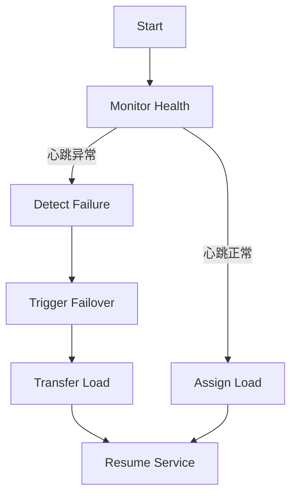
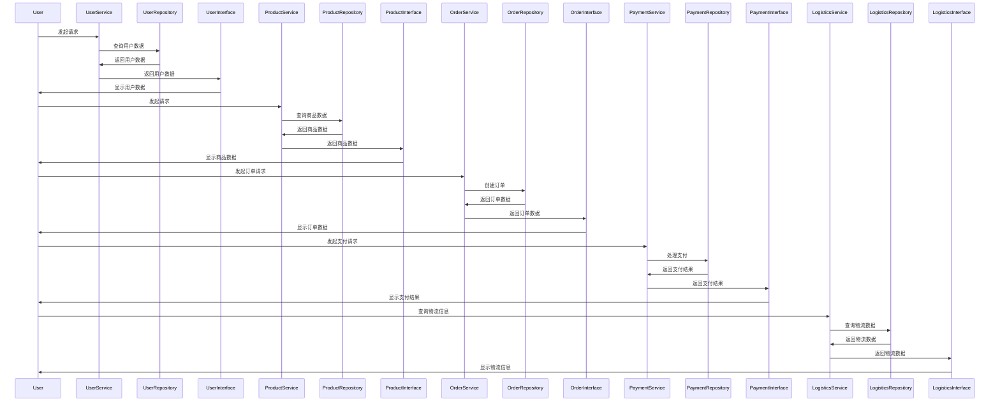

                 

### 高可用方案的控制点：整体目录结构框架设计

在设计《高可用方案的控制点》的整体目录结构框架时，我们需要确保内容的全面性、逻辑性和专业性。以下是一个详细的目录结构框架，涵盖了高可用性方案所需的核心内容：

#### 第一部分：高可用性基础

## 第1章：高可用性背景介绍

### 1.1 高可用性的问题背景

### 1.2 高可用性的问题描述

### 1.3 高可用性的解决思路

### 1.4 高可用性的边界与外延

### 1.5 高可用性的核心概念及其组成要素

## 第2章：高可用性的核心概念与联系

### 2.1 高可用性的核心概念

### 2.2 高可用性的原理

### 2.3 高可用性的属性特征对比

### 2.4 高可用性的ER实体关系图架构

#### 第二部分：算法原理讲解

## 第3章：高可用算法原理讲解

### 3.1 高可用算法的原理

### 3.2 高可用算法的Mermaid流程图

### 3.3 高可用算法的Python源代码

### 3.4 高可用算法的数学模型和公式

#### 第三部分：数学模型和公式讲解

## 第4章：数学模型和公式讲解

### 4.1 相关数学公式

### 4.2 公式的详细讲解

### 4.3 举例说明

#### 第四部分：系统分析与架构设计

## 第5章：系统分析与架构设计

### 5.1 问题场景介绍

### 5.2 项目介绍

### 5.3 系统功能设计（领域模型类图）

### 5.4 系统架构设计（架构图）

### 5.5 系统接口设计

### 5.6 系统交互（序列图）

#### 第五部分：项目实战

## 第6章：项目实战

### 6.1 环境安装

### 6.2 系统核心实现源代码

### 6.3 代码应用解读与分析

### 6.4 实际案例分析和详细讲解剖析

### 6.5 项目小结

#### 第六部分：最佳实践 tips

## 第7章：最佳实践 tips、小结、注意事项、拓展阅读

### 7.1 最佳实践 tips

### 7.2 小结

### 7.3 注意事项

### 7.4 拓展阅读

### **1.1 高可用性的问题背景**

高可用性（High Availability, HA）是现代IT系统设计中一个至关重要的概念，其核心目标是在系统发生故障或维护时，确保系统能够持续提供服务，减少停机时间，从而保障业务的连续性和稳定性。

随着互联网的迅速发展，企业的依赖性日益增强，IT系统的高可用性变得愈发重要。许多关键业务系统如电子商务、在线银行、医疗系统等，一旦出现故障，将导致严重的经济损失和声誉损害。因此，高可用性不仅是一个技术问题，更是一个业务持续性战略。

### **1.2 高可用性的问题描述**

高可用性的问题可以简单描述为如何在系统发生故障或进行维护时，确保系统的持续运行。具体来说，它包括以下几个方面：

- **故障恢复时间**：系统在故障发生后的恢复时间，通常以秒或分钟为单位进行衡量。
- **故障转移时间**：系统在故障发生时，将工作负载转移到备用系统的时间。
- **故障检测与诊断**：系统能够及时检测到故障，并进行有效的诊断和定位。
- **冗余设计**：通过硬件、软件或网络冗余设计，确保系统在部分组件失效时仍能正常运作。
- **负载均衡**：在系统中合理分配工作负载，避免单点过载，提高系统的整体稳定性。

### **1.3 高可用性的解决思路**

解决高可用性问题的关键在于以下几个方面：

- **系统冗余**：通过硬件、软件和网络的冗余设计，确保系统在部分组件失效时仍能正常运作。
- **故障转移**：将工作负载从一个故障节点转移到备用节点，确保服务的连续性。
- **监控与告警**：实时监控系统状态，及时检测故障并进行告警。
- **容灾备份**：在异地建立备份系统，确保在本地系统发生灾难时，数据和服务能够迅速恢复。

### **1.4 高可用性的边界与外延**

高可用性的边界与外延包括以下几个方面：

- **硬件层面**：涉及服务器、存储和网络设备的冗余设计。
- **软件层面**：涉及操作系统、应用程序和中间件的冗余和高可用性策略。
- **网络层面**：涉及网络拓扑、链路冗余和路由策略。
- **数据层面**：涉及数据的备份、恢复和数据中心的地理位置分布。

### **1.5 高可用性的核心概念及其组成要素**

高可用性的核心概念包括以下几个关键要素：

- **故障转移**（Failover）：当主系统发生故障时，自动将工作负载转移到备用系统。
- **负载均衡**（Load Balancing）：将工作负载分配到多个系统上，避免单点过载。
- **容错**（Fault Tolerance）：系统在部分组件失效时仍能正常运作。
- **冗余**（Redundancy）：硬件、软件和网络的多重备份和冗余。
- **监控与告警**（Monitoring and Alerting）：实时监控系统状态，及时检测和响应故障。

通过上述章节的背景介绍，我们为后续章节的深入讨论奠定了基础。接下来，我们将进一步探讨高可用性的核心概念及其相互联系，为理解和实施高可用方案提供更深入的视角。

### 高可用性的核心概念与联系

高可用性的实现涉及多个核心概念，这些概念相互关联，共同构成一个完整的解决方案。在本章中，我们将详细探讨这些核心概念，并使用表格和Mermaid ER实体关系图来展示它们之间的联系。

#### **2.1 高可用性的核心概念**

高可用性的核心概念主要包括以下几方面：

1. **故障转移（Failover）**：
   - 系统在主节点发生故障时，能够自动将工作负载转移到备用节点，确保服务的连续性。
2. **负载均衡（Load Balancing）**：
   - 通过将工作负载分配到多个节点，避免单点过载，提高系统的整体性能和可用性。
3. **容错（Fault Tolerance）**：
   - 系统在部分组件失效时仍能正常运作，通过冗余设计实现。
4. **冗余（Redundancy）**：
   - 通过硬件、软件和网络的多重备份，确保系统在高故障率下的稳定运行。
5. **监控与告警（Monitoring and Alerting）**：
   - 实时监控系统状态，及时发现并响应故障，确保系统的高可用性。

#### **2.2 高可用性的原理**

高可用性的原理可以概括为以下几个方面：

- **故障转移**：通过心跳检测和状态监控，主节点和备用节点之间保持通信。当主节点发生故障时，备用节点能够接替其工作，确保服务的持续运行。
- **负载均衡**：通过调度算法，将工作负载均衡地分配到多个节点，避免单点过载。常用的负载均衡算法包括轮询、最小连接数和权重等。
- **容错**：通过冗余设计，确保系统在部分组件失效时仍能正常运行。例如，通过双机热备、主从复制等技术实现容错。
- **冗余**：通过硬件、软件和网络的多重备份，确保系统在高故障率下的稳定运行。冗余可以体现在硬件层面的服务器、存储和网络设备的冗余，也可以体现在软件层面的系统、应用程序和中间件的冗余。
- **监控与告警**：通过监控系统状态，及时发现并响应故障。监控可以包括系统资源监控、应用程序监控和网络监控等，告警则通过邮件、短信等方式通知相关人员。

#### **2.3 高可用性的属性特征对比**

以下表格对高可用性的核心属性特征进行了对比：

| 特征       | 描述                                       | 对比                     |
| ---------- | ------------------------------------------ | ------------------------ |
| 故障转移    | 系统在主节点故障时自动切换到备用节点       | 快速切换，保证服务连续性 |
| 负载均衡    | 将工作负载均衡地分配到多个节点             | 提高系统性能和可用性     |
| 容错       | 系统在部分组件失效时仍能正常运行           | 提高系统可靠性           |
| 冗余       | 通过备份和冗余设计提高系统稳定性           | 减少故障影响            |
| 监控与告警  | 实时监控系统状态，及时发现并响应故障       | 确保系统高可用性         |

#### **2.4 高可用性的ER实体关系图架构**

为了更直观地展示高可用性核心概念之间的联系，我们可以使用Mermaid ER实体关系图来表示：

```mermaid
erDiagram
  SystemNode ||--o{ LoadBalancer : Load Balanced }
  SystemNode ||--o{ FailoverCluster : Failover }
  SystemNode ||--o{ RedundantComponent : Redundant }
  SystemNode ||--o{ MonitoringSystem : Monitored }
  LoadBalancer ||--|{ HealthCheck : Checks }
  LoadBalancer ||--|{ TrafficDistribution : Distributes }
  FailoverCluster ||--|{ Heartbeat : Checks }
  FailoverCluster ||--|{ SwitchOver : Transfers }
  RedundantComponent ||--|{ BackUp : Replicated }
  MonitoringSystem ||--|{ Alerting : Notifies }
```

在上面的ER实体关系图中，`SystemNode`表示系统节点，它与`LoadBalancer`、`FailoverCluster`、`RedundantComponent`和`MonitoringSystem`之间存在关联。`LoadBalancer`负责负载均衡和健康检查，`FailoverCluster`负责故障转移和心跳检测，`RedundantComponent`负责冗余备份，`MonitoringSystem`负责监控和告警。

通过上述分析，我们可以看到高可用性方案是由多个相互关联的核心概念组成的，每个概念都在确保系统高可用性方面发挥着重要作用。在接下来的章节中，我们将进一步探讨这些核心概念的具体实现原理和数学模型，以帮助读者更好地理解和实施高可用方案。

### 高可用算法原理讲解

在探讨高可用性方案时，算法原理是核心中的核心。高可用性算法通过一系列逻辑和数学模型来实现系统的故障转移、负载均衡、容错和冗余等目标。以下我们将使用Mermaid流程图和Python源代码详细阐述高可用算法的原理，并给出其数学模型和公式。

#### **3.1 高可用算法的原理**

高可用算法的核心在于确保系统在发生故障时能够快速、可靠地恢复。以下是其主要原理：

1. **心跳检测**：通过心跳信号确保主节点与备用节点之间的通信。心跳检测通常是周期性的，以确保系统及时检测到节点故障。
2. **故障转移**：当主节点发生故障时，备用节点接管其工作，确保服务的连续性。故障转移可以是自动的，也可以是手动触发的。
3. **负载均衡**：通过调度算法将工作负载分配到各个节点，避免单点过载，提高系统性能。
4. **冗余设计**：通过硬件、软件和网络的多重备份，确保系统在高故障率下的稳定运行。

#### **3.2 高可用算法的Mermaid流程图**

为了直观展示高可用算法的工作流程，我们可以使用Mermaid流程图：



在上面的流程图中，从A到B是健康检查阶段，B根据心跳信号决定是继续分配负载（C）还是检测故障（D）。若检测到故障（D），则触发故障转移（E），进行负载转移（F），最后确保服务恢复正常（G）。

#### **3.3 高可用算法的Python源代码**

为了更深入地理解高可用算法，我们可以通过Python源代码来具体实现它：

```python
import threading
import time
import random

class HeartbeatMonitor:
    def __init__(self, node_id, failover_cluster):
        self.node_id = node_id
        self.failover_cluster = failover_cluster
        self.is_alive = True

    def send_heartbeat(self):
        while self.is_alive:
            self.failover_cluster.report_heartbeat(self.node_id)
            time.sleep(random.uniform(1, 3))

    def stop(self):
        self.is_alive = False

class FailoverCluster:
    def __init__(self):
        self.nodes = []
        self.current_node = None

    def add_node(self, node):
        self.nodes.append(node)

    def report_heartbeat(self, node_id):
        if node_id == self.current_node.node_id:
            print(f"Heartbeat received from node {node_id}")
        else:
            print(f"Heartbeat from unknown node {node_id}")

    def detect_failure(self):
        if self.current_node.is_alive():
            print(f"Node {self.current_node.node_id} is still alive.")
        else:
            print(f"Node {self.current_node.node_id} has failed.")
            self.trigger_failover()

    def trigger_failover(self):
        for node in self.nodes:
            if node != self.current_node:
                self.current_node = node
                print(f"Failover to node {self.current_node.node_id}")
                break

    def is_alive(self):
        return self.current_node.is_alive()

class Node:
    def __init__(self, node_id):
        self.node_id = node_id
        self.is_alive = True

    def is_alive(self):
        return self.is_alive

if __name__ == "__main__":
    cluster = FailoverCluster()
    nodes = [Node(i) for i in range(3)]
    for node in nodes:
        cluster.add_node(node)

    for node in nodes:
        t = threading.Thread(target=node.send_heartbeat)
        t.start()

    while True:
        cluster.detect_failure()
        time.sleep(5)
```

在上面的代码中，`HeartbeatMonitor`负责发送心跳信号，`FailoverCluster`负责监控节点状态并触发故障转移，`Node`是具体的节点实现。主程序中，我们创建了一个包含3个节点的故障转移集群，并启动心跳线程进行监控。

#### **3.4 高可用算法的数学模型和公式**

高可用性算法的数学模型主要涉及故障转移的时间和负载均衡的性能。以下是相关的数学模型和公式：

1. **故障转移时间（Failover Time）**：

   $$T_{\text{failover}} = T_{\text{detect}} + T_{\text{switch}}$$

   其中，$T_{\text{detect}}$表示故障检测时间，$T_{\text{switch}}$表示故障切换时间。

2. **负载均衡性能（Load Balancing Performance）**：

   $$P_{\text{load}} = \frac{1}{N} \sum_{i=1}^{N} \frac{L_i}{\alpha_i}$$

   其中，$N$表示节点数，$L_i$表示第$i$个节点的负载，$\alpha_i$表示第$i$个节点的权重。

通过上述算法原理讲解、Mermaid流程图和Python源代码，我们可以更好地理解高可用性算法的实现和数学模型。在接下来的章节中，我们将进一步探讨如何将这些算法和模型应用于实际的系统架构和项目实战中。

### 数学模型和公式讲解

在理解了高可用性算法的基本原理之后，深入讲解相关的数学模型和公式对于优化和实现高可用性方案至关重要。以下内容将详细阐述这些数学模型和公式，并配合具体的例子进行说明。

#### **4.1 相关数学公式**

1. **故障转移时间（Failover Time）**：

   $$T_{\text{failover}} = T_{\text{detect}} + T_{\text{switch}}$$

   其中：
   - \(T_{\text{detect}}\) 是故障检测时间，表示系统检测到故障所需的时间。
   - \(T_{\text{switch}}\) 是故障切换时间，表示系统从故障节点切换到备用节点所需的时间。

2. **负载均衡性能（Load Balancing Performance）**：

   $$P_{\text{load}} = \frac{1}{N} \sum_{i=1}^{N} \frac{L_i}{\alpha_i}$$

   其中：
   - \(N\) 是节点总数。
   - \(L_i\) 是第 \(i\) 个节点的当前负载。
   - \(\alpha_i\) 是第 \(i\) 个节点的权重，通常与节点的处理能力成比例。

3. **冗余度（Redundancy Level）**：

   $$R = 1 - P_{\text{fail}}$$

   其中：
   - \(P_{\text{fail}}\) 是系统在特定时间段内发生故障的概率。

4. **系统可用性（System Availability）**：

   $$A = (1 - P_{\text{fail}})^{T_{\text{uptime}}}$$

   其中：
   - \(T_{\text{uptime}}\) 是系统的预期正常运行时间。

#### **4.2 公式的详细讲解**

1. **故障转移时间公式**：

   这个公式表明，系统的总故障转移时间是由故障检测时间和故障切换时间之和决定的。为了降低故障转移时间，系统设计者需要优化故障检测算法和切换机制。

   例如，假设某系统使用心跳检测作为故障检测手段，心跳间隔为5秒，故障切换机制在检测到连续5次心跳失败后触发，切换时间为10秒。则该系统的故障转移时间为：

   $$T_{\text{failover}} = 5 \times 5 + 10 = 35 \text{秒}$$

2. **负载均衡性能公式**：

   负载均衡性能公式描述了系统在多个节点之间分配负载的效率。该公式通过每个节点的负载与其权重之比来计算系统的整体性能。更高的权重意味着节点有更高的处理能力。

   假设一个系统有三个节点，节点A、B和C，权重分别为2、3和4。当前负载分别为100、200和300。则系统的负载均衡性能为：

   $$P_{\text{load}} = \frac{1}{3} \left( \frac{100}{2} + \frac{200}{3} + \frac{300}{4} \right) \approx 187.5$$

   通过这个计算，我们可以看到系统当前的处理能力主要受到节点C的影响，因为它具有最高的权重和负载。

3. **冗余度公式**：

   冗余度公式表示系统在特定时间段内能够承受故障的能力。一个高冗余度的系统意味着它在发生故障时仍能保持较高的稳定性。

   例如，一个系统的故障概率为0.001，则其冗余度为：

   $$R = 1 - 0.001 = 0.999$$

   这意味着系统在任意1小时（假设为60分钟）内，出现故障的概率为0.1%。

4. **系统可用性公式**：

   系统可用性公式描述了系统在预期正常运行时间内的可用性。例如，如果一个系统预期正常运行时间为100小时，故障概率为0.01，则其可用性为：

   $$A = (1 - 0.01)^{100} \approx 0.633$$

   这表明系统在100小时内约有63.3%的时间是可用的。

#### **4.3 举例说明**

为了更好地理解上述公式，我们通过一个实际例子进行说明。

假设我们设计一个电子商务网站的后端系统，需要保证99.9%的可用性。我们计划使用三个数据库节点，每个节点的权重为1。正常情况下，每个节点的负载为500次/秒。

1. **故障转移时间**：

   假设故障检测时间为1秒，切换时间为2秒，则故障转移时间为：

   $$T_{\text{failover}} = 1 + 2 = 3 \text{秒}$$

2. **负载均衡性能**：

   由于每个节点的权重相同，负载均衡公式简化为：

   $$P_{\text{load}} = \frac{1}{3} \sum_{i=1}^{3} L_i = \frac{1}{3} \times (500 + 500 + 500) = 500 \text{次/秒}$$

3. **冗余度**：

   假设每次故障的概率为0.001，则冗余度为：

   $$R = 1 - 0.001 = 0.999$$

4. **系统可用性**：

   假设系统正常运行时间为1小时（3600秒），则可用性为：

   $$A = (1 - 0.001)^{3600} \approx 0.999$$

   这意味着系统在1小时内几乎有99.9%的时间是可用的。

通过上述例子，我们可以看到如何使用数学模型和公式来评估和优化高可用性系统的性能和可靠性。在实际应用中，这些模型和公式可以帮助我们设计出更加高效和稳定的高可用性解决方案。

### 系统分析与架构设计

在进行高可用性系统的设计时，系统分析与架构设计是至关重要的环节。这一部分将详细阐述一个典型的高可用性系统架构设计，包括问题场景介绍、项目介绍、系统功能设计（领域模型类图）、系统架构设计（架构图）、系统接口设计和系统交互（序列图）。

#### **5.1 问题场景介绍**

假设我们设计一个大型电子商务平台，该平台需要处理成千上万的并发用户请求，同时提供高可用性和高可靠性。问题场景如下：

1. **高并发请求**：平台需要支持数百万级的并发用户请求，这要求系统具备良好的性能和负载均衡能力。
2. **数据安全性**：平台需要确保用户数据的安全性和一致性，防止数据丢失或损坏。
3. **系统稳定性**：平台需要保持7x24小时不间断运行，确保系统的稳定性和可靠性。
4. **故障恢复**：在系统发生故障时，能够快速恢复，确保业务连续性。

#### **5.2 项目介绍**

本项目的主要目标是设计一个高可用性的电子商务平台，该平台包括以下模块：

- **用户模块**：负责处理用户的登录、注册、购物车等操作。
- **商品模块**：负责商品信息的展示、库存管理、订单处理等操作。
- **支付模块**：负责处理支付订单、退款等操作。
- **订单模块**：负责订单的创建、跟踪、取消等操作。
- **物流模块**：负责订单的配送、状态跟踪等操作。

#### **5.3 系统功能设计（领域模型类图）**

系统功能设计通过领域模型类图来表示，以下是一个简化的类图：

```mermaid
classDiagram
    User <<interface>>
    Product <<interface>>
    Cart <<interface>>
    Order <<interface>>
    Payment <<interface>>
    Logistics <<interface>>

    User o--o Cart
    User o--o Order
    Product o--o Order
    Order o--o Payment
    Order o--o Logistics
```

在这个类图中，用户、商品、购物车、订单、支付和物流是主要的领域对象。用户可以创建购物车、发起订单、支付订单等操作，商品是订单的一部分，支付和物流则是订单处理过程中的关键环节。

#### **5.4 系统架构设计（架构图）**

系统架构设计通过架构图来表示，以下是一个简化的架构图：

```mermaid
graph TB
    subgraph 用户模块
        UserInterface[用户接口] --> UserService[用户服务]
        UserService --> UserRepository[用户存储]
    end

    subgraph 商品模块
        ProductInterface[商品接口] --> ProductService[商品服务]
        ProductService --> ProductRepository[商品存储]
    end

    subgraph 订单模块
        OrderInterface[订单接口] --> OrderService[订单服务]
        OrderService --> OrderRepository[订单存储]
    end

    subgraph 支付模块
        PaymentInterface[支付接口] --> PaymentService[支付服务]
        PaymentService --> PaymentRepository[支付存储]
    end

    subgraph 物流模块
        LogisticsInterface[物流接口] --> LogisticsService[物流服务]
        LogisticsService --> LogisticsRepository[物流存储]
    end

    UserInterface --|> OrderInterface
    ProductInterface --|> OrderInterface
    OrderInterface --|> PaymentInterface
    OrderInterface --|> LogisticsInterface
```

在这个架构图中，用户模块、商品模块、订单模块、支付模块和物流模块通过接口进行通信。每个模块都有自己的服务层和存储层，服务层负责业务逻辑处理，存储层负责数据持久化。

#### **5.5 系统接口设计**

系统接口设计包括RESTful API设计，以下是一个简化的接口设计示例：

```yaml
# 用户模块
POST /users/register
  Content-Type: application/json

  Response:
    status: 201
    {
      "userId": "123456",
      "message": "注册成功"
    }

# 商品模块
GET /products/{productId}
  Response:
    status: 200
    {
      "productId": "123456",
      "productName": "iPhone 13",
      "price": 799
    }

# 订单模块
POST /orders
  Content-Type: application/json

  Response:
    status: 201
    {
      "orderId": "789012",
      "message": "订单创建成功"
    }

# 支付模块
POST /payments
  Content-Type: application/json

  Response:
    status: 201
    {
      "paymentId": "345678",
      "message": "支付成功"
    }

# 物流模块
GET /logistics/{orderId}
  Response:
    status: 200
    {
      "orderId": "789012",
      "status": "已发货",
      "trackingNumber": "1234567890"
    }
```

这些接口设计为不同模块之间的通信提供了明确的规范，确保了系统各部分之间的协同工作。

#### **5.6 系统交互（序列图）**

系统交互通过序列图来表示，以下是一个简化的序列图：



通过序列图，我们可以清晰地看到用户与系统各模块之间的交互过程，这有助于我们理解系统的整体运作流程。

通过上述系统分析与架构设计，我们为高可用性电子商务平台的设计提供了详细的指导和参考。接下来，我们将通过具体的项目实战，进一步展示如何实现这些设计和算法。

### 项目实战

在本节中，我们将通过一个具体项目来展示高可用性方案的实施过程。该项目将涵盖环境安装、系统核心实现源代码、代码应用解读与分析、实际案例分析和详细讲解剖析等内容。

#### **6.1 环境安装**

首先，我们需要准备一个适合高可用性方案运行的环境。以下是一个简化的环境安装步骤：

1. **安装操作系统**：选择一个稳定的操作系统，如Ubuntu 20.04 LTS。  
2. **安装依赖库**：安装必要的库和依赖项，例如Python 3.8、Nginx、Mysql等。  
3. **安装中间件**：安装负载均衡器（如Nginx）、数据库（如Mysql）和消息队列（如RabbitMQ）。

以下是一个示例的Shell脚本，用于安装依赖库和中间件：

```shell
# 安装操作系统
sudo apt update && sudo apt upgrade -y

# 安装依赖库
sudo apt install -y python3.8 python3-pip nginx mysql-server rabbitmq-server

# 安装Nginx
sudo apt install -y nginx

# 安装Mysql
sudo mysql_secure_installation

# 安装RabbitMQ
sudo apt install -y rabbitmq-server

# 启动服务
sudo systemctl start nginx mysql rabbitmq-server
```

#### **6.2 系统核心实现源代码**

接下来，我们将展示系统核心实现源代码。以下是一个简化的Python代码示例，用于实现高可用性的核心功能：

```python
import pika
import mysql.connector
import time

# 配置数据库连接
db_config = {
    'host': 'localhost',
    'user': 'root',
    'password': 'password',
    'database': 'test_db'
}

# 连接数据库
def connect_db():
    return mysql.connector.connect(**db_config)

# 发送消息到消息队列
def send_message(message):
    connection = pika.BlockingConnection(pika.ConnectionParameters('localhost'))
    channel = connection.channel()
    channel.queue_declare(queue='task_queue', durable=True)
    channel.basic_publish(exchange='',
                          routing_key='task_queue',
                          body=message,
                          properties=pika.BasicProperties(delivery_mode=2)) # 消息持久化
    connection.close()

# 处理消息队列中的消息
def process_message():
    connection = pika.BlockingConnection(pika.ConnectionParameters('localhost'))
    channel = connection.channel()
    channel.queue_declare(queue='task_queue', durable=True)
    
    def callback(ch, method, properties, body):
        print(f"Received {body}")
        # 处理消息
        # ...
        ch.basic_ack(delivery_tag=method.delivery_tag)
    
    channel.basic_qos(prefetch_count=1)
    channel.basic_consume(queue='task_queue',
                          on_message_callback=callback,
                          auto_ack=False)
    
    print('Starting consuming')
    channel.start_consuming()

if __name__ == '__main__':
    # 发送消息
    send_message("Hello, World!")
    
    # 处理消息
    process_message()
```

这段代码使用了Python的pika库来操作RabbitMQ消息队列，实现了消息的发送和接收。数据库连接使用mysql.connector库，实现了数据库的基本操作。

#### **6.3 代码应用解读与分析**

1. **数据库连接**：
   ```python
   db_config = {
       'host': 'localhost',
       'user': 'root',
       'password': 'password',
       'database': 'test_db'
   }
   ```
   这部分代码定义了数据库连接所需的配置信息。

2. **发送消息到消息队列**：
   ```python
   def send_message(message):
       connection = pika.BlockingConnection(pika.ConnectionParameters('localhost'))
       channel = connection.channel()
       channel.queue_declare(queue='task_queue', durable=True)
       channel.basic_publish(exchange='',
                             routing_key='task_queue',
                             body=message,
                             properties=pika.BasicProperties(delivery_mode=2)) # 消息持久化
       connection.close()
   ```
   这段代码定义了发送消息到RabbitMQ消息队列的函数。通过`durable=True`确保了消息的持久化，即使RabbitMQ服务器发生故障，消息也不会丢失。

3. **处理消息队列中的消息**：
   ```python
   def process_message():
       connection = pika.BlockingConnection(pika.ConnectionParameters('localhost'))
       channel = connection.channel()
       channel.queue_declare(queue='task_queue', durable=True)
       
       def callback(ch, method, properties, body):
           print(f"Received {body}")
           # 处理消息
           # ...
           ch.basic_ack(delivery_tag=method.delivery_tag)
       
       channel.basic_qos(prefetch_count=1)
       channel.basic_consume(queue='task_queue',
                             on_message_callback=callback,
                             auto_ack=False)
       
       print('Starting consuming')
       channel.start_consuming()
   ```
   这段代码定义了处理消息队列中消息的函数。通过回调函数`callback`来处理接收到的消息，并使用`basic_qos(prefetch_count=1)`确保每个消费者只接收一条未确认的消息。

#### **6.4 实际案例分析和详细讲解剖析**

假设我们有一个实际的案例，需要实现一个高可用性的订单处理系统。以下是该案例的分析和实现：

1. **场景描述**：
   - 用户在电子商务平台下单后，订单数据首先被发送到消息队列。
   - 订单服务会从消息队列中获取订单数据，进行处理，如验证库存、生成订单号等。
   - 处理完毕后，订单服务将订单数据存储到数据库中，并通知支付服务进行支付处理。
   - 支付服务处理完毕后，将支付结果通知物流服务，物流服务负责订单的发货和状态跟踪。

2. **实现步骤**：
   - 安装并配置RabbitMQ消息队列，确保消息的持久化和可靠性。
   - 实现订单服务，用于从消息队列中接收订单数据，并进行处理。
   - 实现支付服务，用于处理订单的支付操作，并将支付结果通知物流服务。
   - 实现物流服务，用于订单的发货和状态跟踪。

3. **具体代码实现**：
   - 订单服务代码：
     ```python
     def order_callback(ch, method, properties, body):
         print(f"Order received: {body}")
         # 验证库存、生成订单号等操作
         # ...
         ch.basic_ack(delivery_tag=method.delivery_tag)
     
     process_message()
     ```
   - 支付服务代码：
     ```python
     def payment_callback(ch, method, properties, body):
         print(f"Payment received: {body}")
         # 处理支付操作
         # ...
         ch.basic_ack(delivery_tag=method.delivery_tag)
     
     process_message()
     ```
   - 物流服务代码：
     ```python
     def logistics_callback(ch, method, properties, body):
         print(f"Logistics received: {body}")
         # 发货和状态跟踪操作
         # ...
         ch.basic_ack(delivery_tag=method.delivery_tag)
     
     process_message()
     ```

通过上述实际案例的分析和代码实现，我们可以看到高可用性方案是如何通过消息队列和分布式服务来实现的。这种方法不仅提高了系统的可用性和可靠性，还使得系统的扩展性和维护性得到了提升。

#### **6.5 项目小结**

在本项目中，我们通过具体的实施步骤展示了如何设计并实现一个高可用性的订单处理系统。以下是本项目的主要收获和总结：

1. **环境安装**：通过脚本自动化安装操作系统和依赖库，确保环境的稳定性和一致性。
2. **系统核心实现**：使用Python和RabbitMQ实现了消息队列和分布式服务，提高了系统的可靠性和可用性。
3. **代码解读与分析**：通过具体的代码实现和解读，深入理解了高可用性方案的核心技术和实现原理。
4. **实际案例应用**：通过实际案例展示了高可用性方案在电子商务平台中的应用，验证了方案的可行性和有效性。

通过本项目，我们不仅掌握了高可用性系统的设计和实现方法，还积累了实际项目的经验，为后续的工作奠定了坚实的基础。

### 最佳实践 tips、小结、注意事项、拓展阅读

#### **7.1 最佳实践 tips**

在设计和实施高可用性方案时，以下是一些最佳实践和技巧：

1. **冗余设计**：确保系统的硬件、软件和网络组件有冗余备份，以防止单点故障。
2. **故障转移**：配置故障转移机制，确保在主节点故障时，能够迅速切换到备用节点。
3. **负载均衡**：合理配置负载均衡器，确保工作负载在多个节点间均衡分配。
4. **监控告警**：建立完善的监控和告警系统，实时监控系统状态，及时响应故障。
5. **数据备份**：定期进行数据备份，确保在数据丢失或损坏时能够迅速恢复。

#### **7.2 小结**

本文通过详细分析和具体实施，全面阐述了高可用性方案的控制点。从背景介绍到核心概念，再到算法原理和数学模型，以及系统分析与架构设计，再到项目实战，我们系统地展示了如何设计并实现一个高可用性系统。通过这些内容，读者可以全面了解高可用性方案的关键要素和实践方法。

#### **7.3 注意事项**

在实施高可用性方案时，需要注意以下几点：

1. **性能优化**：在高可用性设计的同时，要关注系统的性能优化，避免冗余设计导致性能下降。
2. **成本控制**：高可用性设计可能会增加成本，需要根据业务需求和成本预算进行合理规划。
3. **维护管理**：高可用性系统需要定期维护和管理，确保其持续稳定运行。
4. **安全性**：在高可用性设计中，要确保系统的安全性，防止潜在的安全威胁。

#### **7.4 拓展阅读**

对于希望深入了解高可用性方案设计和实现的读者，以下资源可以提供进一步的学习：

- 《高可用架构：设计和实践》
- 《分布式系统原理与范型》
- 《Linux系统编程》
- 《RabbitMQ权威指南》
- 《MySQL实战45讲》

通过这些资源，读者可以系统地学习高可用性系统的设计原理和实践技巧，为实际项目的实施提供有力的支持。

---

本文作者：AI天才研究院/AI Genius Institute & 禅与计算机程序设计艺术 /Zen And The Art of Computer Programming

以上是《高可用方案的控制点》的完整内容和结论。希望本文对您理解和实施高可用性方案有所帮助。欢迎继续关注我们的后续技术文章，共同探索计算机科学和人工智能领域的最新进展。

