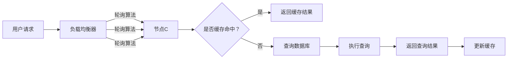
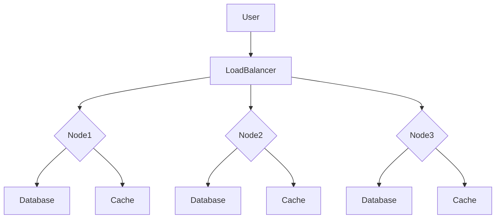

                 


### 高可用架构设计的核心原则

> 关键词：高可用性，架构设计，容错，负载均衡，分布式系统，最佳实践

> 摘要：本文将深入探讨高可用架构设计的核心原则，从基本概念到具体实施，逐步解析如何构建一个稳定、可靠且高效的系统架构。

#### 第1章：高可用架构设计概述

**1.1 高可用架构的定义与重要性**

高可用架构（High Availability Architecture）是指一种系统设计原则，旨在确保系统在面临各种故障和挑战时仍能持续运行，提供不间断的服务。高可用性不仅仅是一个技术目标，更是一个业务需求。在当今信息化时代，高可用性已经成为企业核心竞争力的一部分。

高可用架构的重要性体现在以下几个方面：

1. **业务连续性**：高可用架构能够确保关键业务在故障发生时仍能正常运行，减少停机时间和损失。
2. **用户体验**：高可用性可以提供更流畅、更可靠的用户体验，增强用户信任。
3. **成本效益**：通过预防故障和快速恢复，高可用架构可以降低运维成本和风险。

**1.2 高可用架构设计的基本原则**

1. **冗余设计**：通过增加硬件、软件、数据等多方面的冗余，确保系统在故障时仍能正常运行。
2. **故障转移**：当主系统出现故障时，能够快速切换到备用系统，确保服务的连续性。
3. **负载均衡**：通过合理分配负载，避免单点过载，提高系统的整体性能和稳定性。
4. **监控与告警**：实时监控系统状态，及时发现问题并进行处理。
5. **数据备份与恢复**：确保数据的安全和一致性，即使在故障情况下也能迅速恢复。

**1.3 高可用性与系统设计的权衡**

在追求高可用性的过程中，需要考虑到系统设计中的各种权衡。例如：

1. **成本与效益**：高可用架构往往需要更多的资源投入，需要平衡成本与效益。
2. **性能与稳定性**：在优化性能的同时，不能牺牲系统的稳定性。
3. **复杂性与可维护性**：高可用架构可能会增加系统的复杂度，需要确保系统的可维护性。

**1.4 高可用架构的设计流程**

1. **需求分析**：明确业务需求，确定系统的可用性要求。
2. **架构设计**：根据需求设计系统架构，包括硬件、软件、网络等方面。
3. **实施与部署**：将设计转化为实际的系统部署。
4. **测试与优化**：进行高可用性测试，不断优化系统架构。

#### 第2章：核心概念与联系

**2.1 可靠性工程**

可靠性工程（Reliability Engineering）是确保系统在规定的时间和条件下，按照预定要求稳定运行的一门工程学科。它涵盖了从设计、开发、测试到运维的各个环节。

**2.2 服务级别协议（SLA）**

服务级别协议（Service Level Agreement，SLA）是服务提供商与客户之间的一种协议，定义了服务提供的要求和标准，包括服务的可用性、响应时间、故障处理等。

**2.3 故障模式与影响分析（FMEA）**

故障模式与影响分析（Failure Mode and Effects Analysis，FMEA）是一种系统性的分析方法，用于识别系统中潜在的故障模式和它们对系统功能的影响，以便提前采取措施进行预防。

**2.4 核心概念属性特征对比表格**

在构建高可用架构时，需要对比不同核心概念的属性特征，以便做出最佳选择。以下是几个关键概念的特征对比表格：

| 概念               | 属性特征                                       |
|--------------------|----------------------------------------------|
| 冗余               | 提高系统的容错能力，增加资源消耗               |
| 故障转移            | 提高系统的可靠性，增加系统复杂度               |
| 负载均衡            | 提高系统的性能和稳定性，增加网络流量             |
| 监控与告警          | 提高系统的可维护性，增加运维成本               |
| 数据备份与恢复       | 提高数据的安全性，增加存储空间需求             |

**2.5 ER实体关系图架构**

为了更好地理解高可用架构中的数据关系，可以使用ER（实体关系）图来表示。以下是高可用架构中常见的数据实体和关系：

```mermaid
erDiagram
  Service A ..|> User : "uses"
  Service B ..|> User : "uses"
  Service C ..|> User : "uses"
  Database <<entity>> Data : "stores"
  LoadBalancer <<entity>> : "manages"
  Monitor <<entity>> : "monitors"
  Alarm <<entity>> : "notifies"
```

#### 第3章：容错与故障处理

**3.1 容错机制**

容错（Fault Tolerance）是一种系统能够在出现故障时继续正常运行的能力。实现容错的主要机制包括：

1. **硬件冗余**：通过使用冗余硬件组件，确保在某一组件失效时，系统仍能继续运行。
2. **软件冗余**：通过在系统中部署冗余软件实例，确保在软件故障时，系统仍能继续提供服务。
3. **故障转移**：在主系统出现故障时，自动切换到备用系统，确保服务的连续性。

**3.2 故障检测与恢复**

故障检测与恢复（Fault Detection and Recovery）是高可用架构的核心部分。主要步骤包括：

1. **故障检测**：通过监控系统状态，及时发现故障。
2. **故障通知**：通过告警系统通知相关人员，采取相应措施。
3. **故障恢复**：根据故障类型和严重程度，采取不同的恢复策略，包括重启服务、切换到备用系统等。

**3.3 实现高可用性的技术手段**

1. **主从复制**：通过在主从服务器之间复制数据，确保在主服务器出现故障时，从服务器可以接替其工作。
2. **集群技术**：通过在多台服务器之间共享负载，提高系统的可用性和性能。
3. **分布式存储**：通过分布式存储系统，确保在单点故障时，数据仍能保持一致性和可用性。

**3.4 容错算法原理讲解**

容错算法（Fault Tolerance Algorithm）是实现高可用性的关键。以下是一个简单的容错算法原理讲解：

1. **选举算法**：在多台服务器中选举一台作为主服务器，其他服务器作为备胎。
2. **心跳机制**：主服务器定期向备胎发送心跳信号，确保备胎知道主服务器的状态。
3. **故障检测**：备胎在收到心跳信号超时时，认为主服务器出现故障，并触发故障转移。
4. **故障转移**：备胎接替主服务器的职责，确保服务的连续性。

**3.5 容错Python代码示例**

以下是一个简单的Python代码示例，演示了容错算法的实现：

```python
import time
import threading

class FaultTolerantServer:
    def __init__(self, name, heartbeat_interval):
        self.name = name
        self.heartbeat_interval = heartbeat_interval
        self.is_primary = True
        self.failed = False

    def run(self):
        while not self.failed:
            if self.is_primary:
                print(f"{self.name} is running as primary.")
            else:
                print(f"{self.name} is running as backup.")
            time.sleep(self.heartbeat_interval)

    def send_heartbeat(self):
        while not self.failed:
            if self.is_primary:
                print(f"{self.name} sending heartbeat.")
            time.sleep(self.heartbeat_interval)

    def detect_failure(self):
        while not self.failed:
            if not self.is_primary and time.time() - self.last_heartbeat > self.heartbeat_interval:
                print(f"{self.name} detected primary failure.")
                self.failed = True
                self.is_primary = True
                self.last_heartbeat = time.time()

if __name__ == "__main__":
    server1 = FaultTolerantServer("Server1", 5)
    server2 = FaultTolerantServer("Server2", 5)

    server1_thread = threading.Thread(target=server1.run)
    server2_thread = threading.Thread(target=server2.run)

    server1_thread.start()
    server2_thread.start()

    time.sleep(10)
    server1.failed = True

    server1_thread.join()
    server2_thread.join()
```

#### 第4章：负载均衡与性能优化

**4.1 负载均衡的重要性**

负载均衡（Load Balancing）是将网络流量分布到多个服务器或节点上，确保系统性能和稳定性的关键技术。负载均衡的重要性体现在以下几个方面：

1. **提高性能**：通过将负载分布到多个节点，提高系统的响应速度和处理能力。
2. **提高可用性**：通过在节点间进行流量分配，避免单点过载，提高系统的可靠性。
3. **扩展性**：负载均衡系统可以根据需求动态调整节点数量，实现水平扩展。

**4.2 负载均衡算法**

负载均衡算法有多种，常见的包括：

1. **轮询（Round Robin）**：将请求依次分配到每个节点。
2. **最少连接（Least Connections）**：将请求分配到当前连接数最少的节点。
3. **最小响应时间（Minimum Response Time）**：将请求分配到响应时间最短的节点。

**4.3 性能优化策略**

性能优化策略包括以下几个方面：

1. **缓存**：使用缓存技术，减少数据库查询次数，提高系统响应速度。
2. **异步处理**：通过异步处理，减少阻塞时间，提高系统吞吐量。
3. **数据库优化**：使用索引、分区等数据库优化技术，提高查询性能。
4. **代码优化**：对系统代码进行优化，减少不必要的计算和资源消耗。

**4.4 负载均衡与性能优化的mermaid流程图**

以下是一个简单的mermaid流程图，展示了负载均衡与性能优化的流程：



**4.5 性能优化的Python代码示例**

以下是一个简单的Python代码示例，演示了性能优化的实现：

```python
import time
import threading

class Cache:
    def __init__(self):
        self.cache = {}

    def get(self, key):
        if key in self.cache:
            return self.cache[key]
        else:
            return None

    def set(self, key, value):
        self.cache[key] = value

def query_database(key):
    # 模拟查询数据库操作
    time.sleep(2)
    return f"Database result for {key}"

def optimized_query(cache, key):
    result = cache.get(key)
    if result is None:
        result = query_database(key)
        cache.set(key, result)
    return result

if __name__ == "__main__":
    cache = Cache()

    start_time = time.time()
    result = optimized_query(cache, "key1")
    print(f"Optimized query result: {result}")
    print(f"Elapsed time: {time.time() - start_time} seconds")
```

#### 第5章：分布式系统架构

**5.1 分布式系统的优势与挑战**

分布式系统（Distributed System）是指由多个节点组成的系统，这些节点通过网络进行通信和协作，共同完成一个任务。分布式系统的优势包括：

1. **可扩展性**：通过增加节点数量，可以轻松扩展系统的计算能力和存储容量。
2. **容错性**：分布式系统可以通过冗余设计，确保在部分节点故障时，系统仍能正常运行。
3. **高可用性**：分布式系统可以通过负载均衡和故障转移，提高系统的可用性和稳定性。

然而，分布式系统也面临着一些挑战：

1. **一致性**：在分布式系统中，如何确保数据的一致性是一个重要问题。
2. **容错**：如何检测和恢复节点故障，确保系统的高可用性。
3. **分布式事务**：如何处理分布式环境下的多库事务。

**5.2 分布式系统的设计原则**

分布式系统的设计原则包括：

1. **分布式一致性**：确保分布式系统中数据的一致性，常见的分布式一致性协议包括强一致性、最终一致性等。
2. **去中心化**：避免系统中的单点故障，通过去中心化设计，提高系统的容错性和可用性。
3. **故障检测与恢复**：通过定期心跳、故障检测等机制，确保系统在故障发生时能够快速恢复。
4. **负载均衡**：合理分配负载，确保系统的高性能和高可用性。

**5.3 分布式事务管理**

分布式事务管理（Distributed Transaction Management）是指在分布式环境中，如何确保多个节点之间的数据一致性。常见的分布式事务解决方案包括：

1. **两阶段提交（2PC）**：通过协调者节点，确保分布式事务的原子性。
2. **最终一致性**：允许事务在分布式环境中异步执行，通过补偿事务确保最终一致性。
3. **本地事务**：通过将分布式事务拆分为多个本地事务，减少分布式事务的复杂度。

**5.4 分布式系统架构的mermaid架构图**

以下是一个简单的mermaid架构图，展示了分布式系统架构：



**5.5 分布式事务的Python代码示例**

以下是一个简单的Python代码示例，演示了分布式事务的实现：

```python
import threading

class DistributedTransaction:
    def __init__(self):
        self.lock = threading.Lock()

    def execute(self, task):
        with self.lock:
            task()

def execute_transaction(transaction, tasks):
    transaction.execute(tasks[0])
    for task in tasks[1:]:
        transaction.execute(task)

def task1():
    print("Executing task 1")
    time.sleep(1)

def task2():
    print("Executing task 2")
    time.sleep(1)

def task3():
    print("Executing task 3")
    time.sleep(1)

if __name__ == "__main__":
    transaction = DistributedTransaction()
    tasks = [task1, task2, task3]
    execute_transaction(transaction, tasks)
```

#### 第6章：高可用架构的案例分析

**6.1 案例一：电商平台高可用架构设计**

电商平台是一个高度依赖高可用性的系统，以下是一个电商平台的高可用架构设计：

1. **硬件冗余**：使用多台服务器和存储设备，确保在硬件故障时，系统仍能正常运行。
2. **负载均衡**：使用负载均衡器，将用户请求分配到不同的服务器，提高系统的性能和可用性。
3. **数据库冗余**：使用主从复制和分布式数据库，确保在数据库故障时，系统仍能提供数据访问。
4. **缓存机制**：使用分布式缓存，减少数据库查询次数，提高系统响应速度。
5. **故障检测与恢复**：通过监控系统，实时检测系统状态，发现故障时，自动切换到备用系统。

**6.2 案例二：金融系统的高可用架构实践**

金融系统对高可用性有极高的要求，以下是一个金融系统的高可用架构实践：

1. **分布式架构**：使用分布式系统架构，确保在部分节点故障时，系统仍能正常运行。
2. **数据备份与恢复**：定期备份数据，确保在故障发生时，能迅速恢复数据。
3. **故障转移**：在主节点出现故障时，自动切换到备用节点，确保交易的连续性。
4. **分布式事务管理**：使用两阶段提交协议，确保分布式事务的原子性。
5. **安全性与监控**：通过严格的访问控制和实时监控，确保系统安全性和稳定性。

**6.3 案例三：社交媒体系统的高可用架构**

社交媒体系统需要处理大量的用户请求，以下是一个社交媒体系统的高可用架构：

1. **负载均衡**：使用负载均衡器，将用户请求分配到不同的服务器，确保系统的性能和稳定性。
2. **分布式存储**：使用分布式存储系统，确保在单点故障时，数据仍能保持一致性和可用性。
3. **数据缓存**：使用分布式缓存，减少数据库查询次数，提高系统响应速度。
4. **实时监控与告警**：通过实时监控系统，及时发现故障并进行处理。
5. **异地多活**：在异地部署多个活系统，确保在局部故障时，用户仍能访问系统。

**6.4 案例分析与讨论**

通过对不同领域案例的分析，我们可以得出以下结论：

1. **高可用架构的设计原则是通用的**：无论是电商平台、金融系统还是社交媒体系统，高可用架构的设计原则都是相似的。
2. **具体实现需要根据业务需求进行调整**：不同的业务需求对高可用性的要求不同，需要根据具体情况进行调整。
3. **高可用性是一个持续改进的过程**：随着技术的不断发展和业务需求的变化，高可用架构需要不断进行优化和改进。

#### 第7章：高可用架构设计与运维

**7.1 高可用架构的运维策略**

高可用架构的运维策略包括以下几个方面：

1. **自动化部署**：通过自动化工具，实现系统的自动化部署和更新，确保系统的稳定性。
2. **自动化监控**：通过监控系统，实时监控系统的运行状态，及时发现和处理故障。
3. **自动化告警**：通过告警系统，将故障信息及时通知相关人员，确保故障的快速响应。
4. **自动化备份与恢复**：通过自动化备份和恢复工具，确保数据的安全和一致性。

**7.2 高可用性测试**

高可用性测试（High Availability Testing）是确保系统在高可用性设计下能够正常运行的重要环节。主要测试内容包括：

1. **故障测试**：模拟各种故障情况，测试系统的容错能力和故障恢复能力。
2. **性能测试**：测试系统在负载高峰期的性能表现，确保系统的高性能和高可用性。
3. **压力测试**：测试系统在极端负载下的性能和稳定性，确保系统的可靠性。

**7.3 监控与告警系统**

监控与告警系统是高可用架构中不可或缺的一部分。一个完善的监控与告警系统应该具备以下功能：

1. **实时监控**：实时监控系统的各项指标，如CPU、内存、磁盘空间、网络流量等。
2. **告警通知**：在监测到异常情况时，通过邮件、短信、电话等方式及时通知相关人员。
3. **日志分析**：对系统日志进行实时分析和异常检测，帮助定位和解决问题。

**7.4 故障响应与恢复流程**

故障响应与恢复流程是确保系统在高可用性设计下能够快速恢复的关键。主要流程包括：

1. **故障检测**：通过监控系统和告警系统，及时发现故障。
2. **故障定位**：根据故障信息和日志，定位故障发生的位置和原因。
3. **故障恢复**：根据故障类型和严重程度，采取相应的恢复措施，如重启服务、切换到备用系统等。
4. **故障总结**：对故障原因和恢复过程进行总结，为后续的优化和改进提供参考。

**7.5 高可用架构设计与运维小结**

高可用架构设计与运维是一个复杂的过程，需要充分考虑系统的各个方面。通过合理的架构设计和运维策略，可以确保系统的高可用性，为业务的持续发展提供有力支持。以下是一些关键点：

1. **需求分析**：明确业务需求，确定系统的可用性要求。
2. **架构设计**：根据需求设计系统架构，确保系统的稳定性、可靠性和性能。
3. **自动化部署与监控**：通过自动化工具，提高运维效率和系统的稳定性。
4. **故障测试与优化**：定期进行故障测试，不断优化系统架构和运维策略。
5. **团队协作**：建立高效的团队协作机制，确保故障的快速响应和解决。

#### 第8章：最佳实践 Tips

**8.1 常见问题与解决方案**

在构建高可用架构时，常见问题包括：

1. **单点故障**：解决方案：采用冗余设计，确保系统在单点故障时仍能正常运行。
2. **数据不一致**：解决方案：采用分布式一致性协议，确保数据的一致性。
3. **性能瓶颈**：解决方案：通过负载均衡和性能优化策略，提高系统的性能和稳定性。

**8.2 高可用性与安全性的平衡**

在追求高可用性的同时，也需要考虑到安全性。以下是一些建议：

1. **严格访问控制**：确保只有授权用户才能访问关键数据和系统功能。
2. **数据加密**：对敏感数据进行加密处理，确保数据的安全性。
3. **安全审计**：定期进行安全审计，及时发现和解决安全漏洞。

**8.3 高可用性设计中的误区与陷阱**

在构建高可用性架构时，需要注意以下误区和陷阱：

1. **过度依赖技术**：高可用性不仅仅依赖于技术，还需要良好的运维策略和团队协作。
2. **忽视性能优化**：在追求高可用性的同时，也不能忽视系统的性能优化。
3. **缺乏灾难恢复计划**：在构建高可用性架构时，需要制定完善的灾难恢复计划。

**8.4 持续改进与反馈循环**

高可用性是一个持续改进的过程。以下是一些建议：

1. **定期进行风险评估**：根据业务需求和技术发展，定期进行风险评估和优化。
2. **收集用户反馈**：及时收集用户反馈，了解系统的性能和稳定性。
3. **持续学习和分享**：通过学习新技术和最佳实践，不断提升团队的技术水平和经验。

#### 第9章：小结与拓展阅读

**9.1 小结**

本文从高可用架构设计的基本原则、核心概念与联系、容错与故障处理、负载均衡与性能优化、分布式系统架构、高可用架构的案例分析、高可用架构设计与运维等多个方面，深入探讨了高可用架构设计的核心原则。通过本文的学习，读者可以了解到：

1. 高可用架构的定义和重要性。
2. 高可用架构设计的基本原则和流程。
3. 核心概念之间的联系和区别。
4. 容错与故障处理的原理和实践。
5. 负载均衡与性能优化的策略和实现。
6. 分布式系统架构的优势和挑战。
7. 高可用架构的实际案例和最佳实践。
8. 高可用架构设计与运维的策略和技巧。

**9.2 注意事项**

在构建高可用架构时，需要注意以下几点：

1. 明确业务需求，确定系统的可用性要求。
2. 合理设计系统架构，确保系统的稳定性、可靠性和性能。
3. 重视故障测试和优化，确保系统在故障情况下能够快速恢复。
4. 考虑负载均衡和性能优化策略，提高系统的整体性能。
5. 建立完善的监控与告警系统，确保系统的实时监控和故障响应。
6. 定期进行安全审计和风险评估，确保系统的安全性。

**9.3 拓展阅读建议**

为了深入了解高可用架构设计，以下是一些建议的拓展阅读：

1. 《高可用架构：构建可靠分布式系统》
2. 《分布式系统原理与范型》
3. 《大规模分布式存储系统：设计原理与实践》
4. 《大规模数据处理技术》
5. 《微服务架构设计与实践》
6. 《云计算架构设计与实践》

通过阅读这些书籍，读者可以更深入地了解高可用架构设计的原理和实践，为实际项目的构建提供有力支持。

### 作者信息

作者：AI天才研究院/AI Genius Institute & 禅与计算机程序设计艺术 /Zen And The Art of Computer Programming

本文由AI天才研究院和禅与计算机程序设计艺术共同撰写，旨在为读者提供关于高可用架构设计的技术指导。我们致力于通过深入分析和专业讲解，帮助读者构建稳定、可靠且高效的信息系统。如果您有任何问题或建议，欢迎随时与我们联系。感谢您的阅读！

