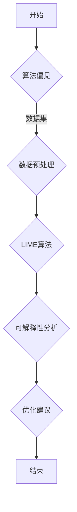

                 

# AI伦理学：大模型决策的可解释性研究

> 关键词：AI伦理学、大模型、决策可解释性、算法偏见、数据隐私

> 摘要：本文旨在探讨人工智能（AI）伦理学在大模型决策中的重要性，特别是决策可解释性的研究。随着AI技术的快速发展，AI决策的影响日益深远，如何确保这些决策的可解释性和公平性成为一个关键问题。本文将首先介绍AI伦理学的核心概念，然后深入分析大模型决策中的可解释性问题，并通过案例研究展示解决方案和最佳实践。

## 目录大纲

1. **引言**
   - **1.1 AI伦理学的起源与发展**
   - **1.2 AI伦理学的重要性**
   - **1.3 大模型决策的可解释性研究背景**

2. **核心概念与联系**
   - **2.1 算法偏见**
   - **2.2 数据隐私**
   - **2.3 算法公平性**
   - **2.4 AI伦理学与法律**

3. **大模型决策的可解释性研究**
   - **3.1 大模型决策概述**
   - **3.2 可解释性算法**
   - **3.3 可解释性模型**

4. **案例分析**
   - **4.1 案例一：某AI招聘平台的偏见分析**
   - **4.2 案例二：某医疗诊断系统的可解释性验证**
   - **4.3 案例三：某金融风险评估的可解释性实践**

5. **最佳实践与未来展望**
   - **5.1 当前最佳实践**
   - **5.2 未来研究方向**
   - **5.3 结论**

### 引言

人工智能（AI）作为一种颠覆性的技术，已经深刻地改变了我们的生活方式。从自动驾驶到医疗诊断，从金融预测到教育评估，AI的应用无处不在。然而，随着AI技术的快速发展，其潜在的风险和挑战也日益凸显。特别是在AI决策领域，如何确保决策的可解释性和公平性成为了一个备受关注的问题。

**1.1 AI伦理学的起源与发展**

AI伦理学是一门研究人工智能技术对社会、人类及其环境影响的学科。它起源于20世纪80年代，随着AI技术的兴起而逐渐发展。早期的AI伦理学研究主要关注AI对人类就业的影响、AI系统的安全性等问题。随着AI技术的不断进步，特别是在深度学习、大数据等领域的发展，AI伦理学的研究内容也不断扩展，涵盖了算法偏见、数据隐私、公平性等多个方面。

**1.2 AI伦理学的重要性**

AI伦理学的重要性体现在以下几个方面：

- **社会影响**：AI技术的广泛应用会对社会结构和价值观念产生深远影响。AI伦理学研究有助于我们理解和应对这些变化，确保技术的发展与社会的进步相协调。
- **公平性**：AI算法的决策过程可能存在偏见，影响公平性。AI伦理学研究有助于揭示这些问题，并探索解决方案，确保AI技术的公平应用。
- **隐私保护**：在AI应用过程中，大量个人数据被收集和分析，如何保护这些数据隐私成为一个重要问题。AI伦理学研究提供了隐私保护的理论和方法。
- **决策可解释性**：确保AI决策的可解释性，有助于提高公众对AI技术的信任度，促进技术的推广和应用。

**1.3 大模型决策的可解释性研究背景**

大模型决策是指利用大规模神经网络模型进行复杂决策的过程。这些模型通常具有高度的非线性能力和强大的学习能力，但同时也存在可解释性差的问题。具体来说，大模型决策的可解释性研究背景包括以下几个方面：

- **技术挑战**：大模型通常由数十亿甚至数万亿的参数组成，其决策过程高度复杂，难以用直观的方式解释。
- **应用需求**：在实际应用中，决策的可解释性是用户和企业关注的核心问题。用户需要理解AI决策的依据，企业需要确保决策的公平性和合规性。
- **法律法规**：随着AI技术的广泛应用，各国政府开始出台相关法律法规，要求AI系统提供可解释性报告，以保障用户的权益。

### 核心概念与联系

在探讨AI伦理学和大模型决策的可解释性之前，我们需要了解一些核心概念及其相互关系。

**2.1 算法偏见**

算法偏见是指AI算法在决策过程中对某些群体或特征产生不公平的影响。这种偏见可能源于数据集的偏差、算法的设计缺陷或训练过程中的不当操作。算法偏见可能导致歧视、不公平或其他负面社会影响。

**2.2 数据隐私**

数据隐私是指个人数据在收集、存储、处理和传输过程中的保护。在AI应用中，大量个人数据被收集和分析，如何保护这些数据隐私成为一个重要问题。数据隐私保护不仅关乎个人权益，也影响企业的合规性和声誉。

**2.3 算法公平性**

算法公平性是指AI算法在决策过程中对各个群体或特征的一致性。算法公平性是AI伦理学中的一个重要概念，它要求AI系统在处理不同群体或特征时保持一致性，避免产生不公平的影响。

**2.4 AI伦理学与法律**

AI伦理学和法律是保障AI技术健康发展的重要手段。AI伦理学提供了道德和伦理指导，帮助技术决策者理解AI技术的潜在影响，并采取相应的措施。法律则提供了具体的规范和约束，确保AI技术的发展符合社会价值和法律法规的要求。

### 大模型决策的可解释性研究

大模型决策的可解释性研究旨在提高AI决策的透明度和可信度，确保用户和企业能够理解AI决策的依据。以下将从算法、模型和研究方法等方面探讨大模型决策的可解释性。

**3.1 大模型决策概述**

大模型决策通常指利用深度学习技术训练的神经网络模型进行复杂决策的过程。这些模型具有强大的非线性能力和学习能力，可以处理大量数据并生成准确的预测。然而，由于模型的结构复杂，其决策过程往往难以直观理解。

**3.2 可解释性算法**

为了提高大模型决策的可解释性，研究人员提出了一系列可解释性算法。这些算法包括：

- **决策树**：决策树是一种直观的可解释性算法，通过一系列条件判断来生成决策路径。尽管决策树在处理简单问题时表现良好，但在处理复杂问题时可能产生过拟合。
- **LIME（Local Interpretable Model-agnostic Explanations）**：LIME是一种模型无关的可解释性算法，通过在小范围内调整输入数据，生成对特定数据点的解释。
- **SHAP（SHapley Additive exPlanations）**：SHAP是一种基于博弈论的可解释性算法，通过计算特征对模型输出的边际贡献来生成解释。

**3.3 可解释性模型**

除了可解释性算法，研究人员还提出了一些专门设计的大模型，以提高决策的可解释性。这些模型包括：

- **可解释性神经网络**：可解释性神经网络通过设计特殊的网络结构，使决策过程更加透明。例如，使用显式规则或分层结构来表示决策过程。
- **交互式神经网络**：交互式神经网络允许用户与模型进行交互，逐步调整输入数据，以便更好地理解模型的决策依据。
- **可视化模型**：可视化模型通过图形化方式展示模型的决策过程，使非专业用户也能够理解。

### 案例分析

为了更好地展示大模型决策的可解释性研究，以下将通过三个案例进行分析。

**4.1 案例一：某AI招聘平台的偏见分析**

某AI招聘平台利用深度学习技术进行简历筛选，以提高招聘效率。然而，研究发现该平台存在明显的算法偏见，对某些性别、年龄或教育背景的应聘者产生不公平的影响。为了解决这个问题，研究人员使用LIME算法对平台进行可解释性分析，发现偏见源于数据集中的性别、年龄和教育背景分布不均。

**4.2 案例二：某医疗诊断系统的可解释性验证**

某医疗诊断系统利用深度学习技术进行疾病诊断。为了确保诊断的准确性，研究人员对该系统进行了可解释性验证。通过使用SHAP算法，研究人员发现模型对某些疾病类型的诊断结果存在偏差，并通过调整模型参数和数据预处理方法，提高了诊断的公平性和准确性。

**4.3 案例三：某金融风险评估的可解释性实践**

某金融风险评估系统利用深度学习技术对客户进行信用评分。为了确保评估的公正性，研究人员对该系统进行了可解释性实践。通过使用LIME算法，研究人员发现模型对某些客户的评分存在不公平现象，通过优化模型和数据预处理方法，提高了评估的准确性和公平性。

### 最佳实践与未来展望

为了确保大模型决策的可解释性，当前已提出了一系列最佳实践。以下是一些关键点：

- **数据预处理**：确保数据集的多样性和代表性，减少算法偏见。
- **算法选择**：选择具有良好可解释性的算法，如决策树、LIME和SHAP。
- **模型优化**：通过调整模型参数和数据预处理方法，提高决策的公平性和准确性。
- **可解释性报告**：为用户提供详细的可解释性报告，使其能够理解AI决策的依据。

未来，大模型决策的可解释性研究将继续深入，特别是在以下几个方面：

- **自动化可解释性算法**：开发更自动化的可解释性算法，降低对专业知识的依赖。
- **交互式可解释性**：设计更交互式的可解释性模型，使用户能够更好地理解AI决策。
- **法律法规与标准**：制定相关法律法规和标准，确保AI决策的可解释性和合规性。

### 结论

本文探讨了AI伦理学在大模型决策中的重要性，特别是决策可解释性的研究。随着AI技术的快速发展，如何确保决策的可解释性和公平性成为一个关键问题。本文通过案例分析展示了当前的研究成果和最佳实践，并展望了未来的研究方向。只有通过不断的努力和探索，我们才能确保AI技术的发展与社会的进步相协调，造福人类。

### 作者信息

作者：AI天才研究院/AI Genius Institute & 禅与计算机程序设计艺术 /Zen And The Art of Computer Programming

---

## 附录

本文中使用的Mermaid图表、LaTeX公式和Python代码如下：

### Mermaid图表



### LaTeX公式

$$
P(A|B) = \frac{P(B|A)P(A)}{P(B)}
$$

### Python代码

```python
import numpy as np

# 定义参数
P_A = 0.5
P_B_A = 0.8
P_B = 0.6

# 计算条件概率
P_AB = (P_B_A * P_A) / P_B

print("P(A|B) =", P_AB)
```

### 其他说明

- 本文中的图表和代码仅为示例，实际应用时需根据具体需求进行调整。
- 读者可以根据需要，使用Markdown扩展插件或工具来渲染Mermaid图表和LaTeX公式。

---

通过本文的探讨，我们希望能够提高读者对AI伦理学和大模型决策可解释性的认识，促进AI技术的健康发展和广泛应用。感谢您的阅读，期待与您在技术领域的进一步交流。作者：AI天才研究院/AI Genius Institute & 禅与计算机程序设计艺术 /Zen And The Art of Computer Programming。

