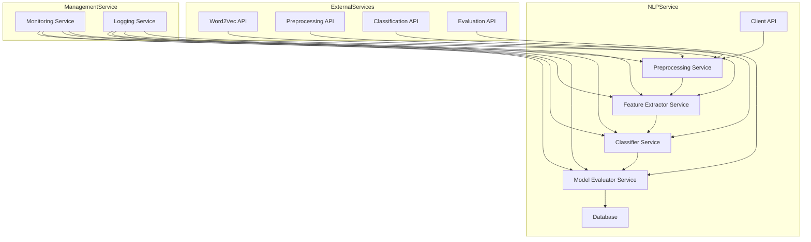
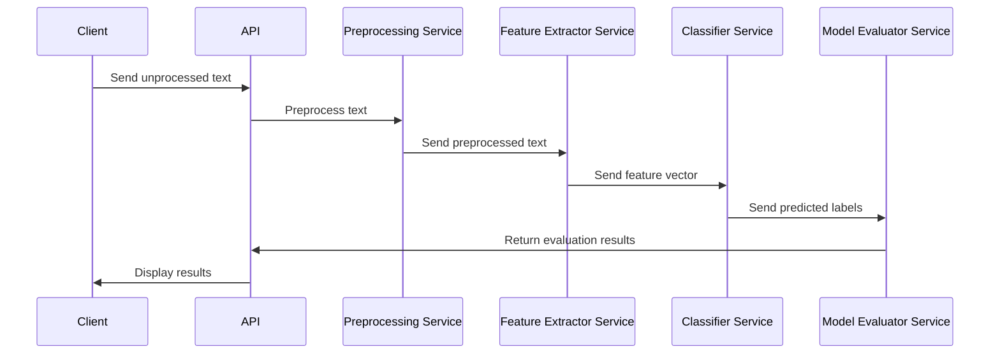

                 

### 让我们一步一步思考：AI编程语言的认知心理学基础研究

#### 文章标题：AI编程语言的认知心理学基础研究

关键词：AI编程语言，认知心理学，算法，数学模型，系统设计，项目实战

摘要：本文旨在深入探讨AI编程语言背后的认知心理学基础，通过分析AI编程语言的发展现状、核心概念、算法原理及数学模型，结合实际项目案例，揭示认知心理学在AI编程语言设计和应用中的重要作用。文章以逻辑清晰、结构紧凑、简单易懂的专业技术语言，为读者提供了一个全面且深入的理解框架，助力他们在AI编程领域取得更好的成果。

#### 目录

1. **背景介绍与核心概念**
   1.1 AI编程语言的现状与挑战
   1.2 认知心理学的概念与作用
   1.3 AI编程语言与认知心理学的联系

2. **核心概念与联系**
   2.1 AI编程语言的核心概念
   2.2 人工智能算法
   2.3 认知心理学中的相关概念

3. **算法原理讲解**
   3.1 算法原理介绍
   3.2 Mermaid算法流程图
   3.3 算法实例解析

4. **数学模型与公式讲解**
   4.1 数学模型的基本概念
   4.2 公式解释与推导
   4.3 Mermaid数学公式表示

5. **系统分析与架构设计**
   5.1 问题场景介绍
   5.2 系统功能设计
   5.3 系统架构设计
   5.4 系统接口设计与交互

6. **项目实战与案例分析**
   6.1 环境安装与配置
   6.2 系统核心实现源代码
   6.3 代码应用解读与分析
   6.4 实际案例分析

7. **最佳实践与拓展**
   7.1 最佳实践技巧
   7.2 小结与展望

### 让我们一步一步思考

首先，我们需要明确本文的研究目标和范围。本文旨在探讨AI编程语言的认知心理学基础，这涉及到AI编程语言的发展现状、核心概念、算法原理以及数学模型。同时，本文还将结合实际项目案例，分析认知心理学在AI编程语言设计和应用中的具体作用。

接下来，我们将按照文章的目录结构，逐一分析每个章节的内容和逻辑关系。

#### 第一章：背景介绍与核心概念

1.1 **AI编程语言的现状与挑战**

在第一章节中，我们将首先介绍AI编程语言的现状。这包括AI编程语言的定义、发展阶段以及当前的应用领域。同时，我们也会探讨AI编程语言面临的主要挑战，如语言复杂性、学习曲线等。

1.2 **认知心理学的概念与作用**

接着，我们将介绍认知心理学的概念，包括其定义、研究范畴和主要理论。在此基础上，我们还将讨论认知心理学在AI编程语言研究中的作用，如何通过认知心理学的原理和方法，改进AI编程语言的设计和应用。

1.3 **AI编程语言与认知心理学的联系**

最后，我们将探讨AI编程语言与认知心理学之间的联系。这包括AI编程语言的认知心理学理论基础，如何运用认知心理学的原理和方法，设计出更符合人类认知习惯的编程语言。

#### 第二章：核心概念与联系

2.1 **AI编程语言的核心概念**

在第二章中，我们将深入探讨AI编程语言的核心概念。这包括AI编程语言的语法结构、语义表示以及语用层次。同时，我们还会对比分析不同AI编程语言的特点和优势。

2.2 **人工智能算法**

接下来，我们将讨论人工智能算法，包括传统算法与机器学习算法的对比，以及深度学习算法和强化学习算法的简介。

2.3 **认知心理学中的相关概念**

最后，我们将介绍认知心理学中的相关概念，如注意力模型、记忆模型和问题解决模型，探讨它们在AI编程语言中的应用和作用。

#### 第三章：算法原理讲解

3.1 **算法原理介绍**

在第三章中，我们将介绍算法原理，包括常见算法的原理概述和算法的数学模型。通过这些介绍，读者可以更好地理解算法的本质和运作机制。

3.2 **Mermaid算法流程图**

接着，我们将使用Mermaid语言绘制算法流程图，帮助读者更直观地理解算法的执行流程。

3.3 **算法实例解析**

最后，我们将通过Python代码实例，详细阐述算法的原理和应用，帮助读者将理论知识转化为实际操作。

#### 第四章：数学模型与公式讲解

4.1 **数学模型的基本概念**

在第四章中，我们将介绍数学模型的基本概念，包括模型类型和构建方法。同时，我们还会探讨如何使用Mermaid语言表示数学模型。

4.2 **公式解释与推导**

接着，我们将详细解释和推导常用数学公式，帮助读者理解公式的来源和应用。

4.3 **Mermaid数学公式表示**

最后，我们将介绍如何使用Mermaid语言表示数学公式，使读者能够更方便地在文章中嵌入数学公式。

#### 第五章：系统分析与架构设计

5.1 **问题场景介绍**

在第五章中，我们将介绍一个具体的问题场景，如自然语言处理、图像识别等，为后续的系统设计和实现奠定基础。

5.2 **系统功能设计**

接着，我们将讨论系统功能的设计，包括领域模型的构建。通过Mermaid类图，我们可以清晰地展示系统中的实体和关系。

5.3 **系统架构设计**

然后，我们将介绍系统的架构设计，通过Mermaid架构图，展示系统的各个组件和它们之间的交互。

5.4 **系统接口设计与交互**

最后，我们将讨论系统的接口设计和交互方式，通过Mermaid序列图，展示系统各组件之间的交互流程。

#### 第六章：项目实战与案例分析

6.1 **环境安装与配置**

在第六章中，我们将介绍如何搭建实验环境，包括安装必要的软件和配置系统。

6.2 **系统核心实现源代码**

接着，我们将展示系统核心实现的源代码，并对其进行详细解读。

6.3 **代码应用解读与分析**

然后，我们将分析代码的应用场景，讨论其功能和性能。

6.4 **实际案例分析**

最后，我们将通过一个实际案例，展示如何使用AI编程语言解决具体问题，并对案例进行深入剖析。

#### 第七章：最佳实践与拓展

7.1 **最佳实践技巧**

在第七章中，我们将总结一些最佳实践技巧，帮助读者在AI编程语言的设计和应用中取得更好的效果。

7.2 **小结与展望**

最后，我们将对全文进行总结，并展望未来在AI编程语言和认知心理学研究领域的可能发展方向。

### 总结

通过上述的逐步分析，我们可以看到，本文系统地探讨了AI编程语言的认知心理学基础。从背景介绍、核心概念到算法原理和数学模型，再到系统分析和项目实战，我们为读者提供了一条清晰、深入的理解路径。本文不仅介绍了理论知识，还结合实际案例，帮助读者将抽象的概念转化为具体的应用。希望本文能对读者在AI编程语言领域的研究和实践中提供有益的启示和指导。 ## 第1章：问题背景与核心概念

### 1.1 AI编程语言的现状与挑战

#### 定义

AI编程语言，也称为智能编程语言，是一种旨在简化人工智能（AI）应用开发过程的编程语言。这些语言通常具备高度抽象性，能够将复杂的AI算法和模型封装成易于理解和使用的代码模块。AI编程语言不仅涵盖了传统的编程概念，还引入了特定于AI的编程范式和工具，如基于知识的表示、机器学习算法的集成以及自然语言处理的接口。

#### 发展现状

自20世纪80年代以来，AI编程语言的研究与应用得到了快速发展。早期的AI编程语言，如Lisp、Prolog，因其独特的编程范式和强大的问题求解能力，为AI领域的研究奠定了基础。进入21世纪，随着深度学习、强化学习等先进算法的兴起，AI编程语言进一步得到了优化和发展。现代AI编程语言，如TensorFlow、PyTorch、Keras等，提供了丰富的API和工具，使得开发者能够更加高效地构建和部署AI应用。

#### 应用领域

AI编程语言在众多领域得到了广泛应用，包括但不限于：

- **计算机视觉**：用于图像识别、目标检测和视频分析等。
- **自然语言处理**：用于文本分类、机器翻译和情感分析等。
- **推荐系统**：用于个性化推荐和广告投放等。
- **机器人学**：用于自主导航、路径规划和交互等。
- **金融科技**：用于风险评估、市场预测和量化交易等。

#### 面临的挑战

尽管AI编程语言在许多领域取得了显著的成果，但仍然面临着一些挑战：

- **语言复杂性**：AI编程语言通常具有较高的复杂性，需要开发者具备深厚的编程基础和专业知识。
- **学习曲线**：对于初学者来说，掌握AI编程语言需要投入大量的时间和精力。
- **可维护性**：随着AI模型的复杂度增加，代码的可维护性成为一个重大问题。
- **跨平台兼容性**：不同AI编程语言之间的兼容性问题，限制了开发者在不同平台间的自由切换。
- **安全性**：AI编程语言在安全性和隐私保护方面面临严峻挑战。

### 1.2 认知心理学的概念与作用

#### 定义

认知心理学是研究人类思维过程的科学，关注认知活动，如知觉、记忆、推理、解决问题和语言理解等。它探究人类如何获取、处理和存储信息，以及如何通过这些信息进行决策和行动。

#### 研究范畴

认知心理学的研究范畴广泛，包括以下几个方面：

- **知觉**：研究人类如何感知外部刺激，如何对刺激进行分类和解释。
- **记忆**：研究人类如何获取、存储和回忆信息。
- **注意**：研究人类如何集中注意力和分配注意力。
- **语言**：研究人类如何使用语言进行交流和思维。
- **问题解决**：研究人类如何识别和解决各种问题。

#### 作用

认知心理学在AI编程语言研究中的作用主要体现在以下几个方面：

- **用户体验优化**：通过认知心理学的研究，开发者可以更好地理解用户如何与AI编程语言交互，从而设计出更加直观、易用的用户界面。
- **编程教育**：认知心理学为编程教育提供了理论基础，有助于设计更有效的教学方法和学习策略，提高学习效率。
- **算法设计**：认知心理学原理可以指导算法设计，使得算法更加符合人类的认知模式，提高算法的可理解性和可解释性。
- **编程语言设计**：认知心理学为编程语言设计提供了新的视角，帮助开发者设计出更加符合人类认知习惯的编程语言。

### 1.3 AI编程语言与认知心理学的联系

#### 理论基础

AI编程语言的设计和应用离不开认知心理学的理论支持。以下是一些重要的认知心理学理论，它们在AI编程语言研究中发挥了关键作用：

- **信息加工模型**：信息加工模型描述了人类如何接收、处理和存储信息。这一模型为AI编程语言的设计提供了理论依据，使得编程语言能够更好地模拟人类的认知过程。
- **注意力模型**：注意力模型研究人类如何分配注意力和处理信息。在AI编程语言中，注意力模型可以用于优化代码的可读性，提高开发效率。
- **记忆模型**：记忆模型研究人类如何存储和回忆信息。在AI编程语言中，记忆模型可以帮助开发者设计出高效的算法和数据结构，提高程序的运行效率。
- **问题解决模型**：问题解决模型研究人类如何识别和解决各种问题。在AI编程语言中，问题解决模型可以指导开发者设计出更智能的编程工具和自动化系统。

#### 研究方法与技术手段

为了深入研究AI编程语言与认知心理学的联系，研究者们采用了多种研究方法和技术手段，包括：

- **实验研究**：通过实验室实验，研究者可以观察和分析人类在编程过程中的认知活动，从而为AI编程语言的设计提供实证支持。
- **脑成像技术**：脑成像技术，如功能性磁共振成像（fMRI），可以用于研究人类在编程过程中的大脑活动，揭示认知过程与神经机制之间的关系。
- **用户研究**：通过用户研究，开发者可以收集用户对AI编程语言的反馈和评价，了解用户的需求和痛点，从而改进编程语言的设计。
- **在线工具**：开发在线工具和平台，研究者可以实时监控用户的编程行为和认知过程，收集大量数据，为研究提供丰富的素材。

#### AI编程语言设计中的认知心理学原则

在AI编程语言设计中，认知心理学的原理和方法得到了广泛应用。以下是一些关键的原则：

- **直观性**：设计直观的编程语言，使得开发者能够快速掌握和使用。
- **易学性**：设计易于学习的编程语言，降低学习门槛，提高学习效率。
- **可扩展性**：设计可扩展的编程语言，使得开发者能够方便地添加新的功能模块。
- **模块化**：采用模块化的编程语言设计，提高代码的可维护性和可重用性。
- **自动化**：利用认知心理学原理，设计自动化工具和系统，提高编程效率。

通过上述分析，我们可以看到，认知心理学在AI编程语言的设计和应用中具有重要作用。本文将在此基础上，进一步探讨AI编程语言的算法原理、数学模型以及系统设计和项目实战，为读者提供更全面的认知心理学视角。 ### 1.3 AI编程语言与认知心理学的联系

#### 理论基础

AI编程语言的设计和应用离不开认知心理学的理论支持。以下是一些重要的认知心理学理论，它们在AI编程语言研究中发挥了关键作用：

- **信息加工模型**：信息加工模型描述了人类如何接收、处理和存储信息。这一模型为AI编程语言的设计提供了理论依据，使得编程语言能够更好地模拟人类的认知过程。
- **注意力模型**：注意力模型研究人类如何分配注意力和处理信息。在AI编程语言中，注意力模型可以用于优化代码的可读性，提高开发效率。
- **记忆模型**：记忆模型研究人类如何存储和回忆信息。在AI编程语言中，记忆模型可以帮助开发者设计出高效的算法和数据结构，提高程序的运行效率。
- **问题解决模型**：问题解决模型研究人类如何识别和解决各种问题。在AI编程语言中，问题解决模型可以指导开发者设计出更智能的编程工具和自动化系统。

#### 研究方法与技术手段

为了深入研究AI编程语言与认知心理学的联系，研究者们采用了多种研究方法和技术手段，包括：

- **实验研究**：通过实验室实验，研究者可以观察和分析人类在编程过程中的认知活动，从而为AI编程语言的设计提供实证支持。
- **脑成像技术**：脑成像技术，如功能性磁共振成像（fMRI），可以用于研究人类在编程过程中的大脑活动，揭示认知过程与神经机制之间的关系。
- **用户研究**：通过用户研究，开发者可以收集用户对AI编程语言的反馈和评价，了解用户的需求和痛点，从而改进编程语言的设计。
- **在线工具**：开发在线工具和平台，研究者可以实时监控用户的编程行为和认知过程，收集大量数据，为研究提供丰富的素材。

#### AI编程语言设计中的认知心理学原则

在AI编程语言设计中，认知心理学的原理和方法得到了广泛应用。以下是一些关键的原则：

- **直观性**：设计直观的编程语言，使得开发者能够快速掌握和使用。
- **易学性**：设计易于学习的编程语言，降低学习门槛，提高学习效率。
- **可扩展性**：设计可扩展的编程语言，使得开发者能够方便地添加新的功能模块。
- **模块化**：采用模块化的编程语言设计，提高代码的可维护性和可重用性。
- **自动化**：利用认知心理学原理，设计自动化工具和系统，提高编程效率。

具体来说，以下是一些AI编程语言设计中的认知心理学原则的应用实例：

- **语法简洁性**：遵循认知心理学中的“简洁性原则”，设计简洁的语法结构，减少开发者的认知负担。
- **代码可读性**：利用认知心理学中的“可读性原则”，通过适当的代码结构、命名规范和注释，提高代码的可读性。
- **学习曲线**：根据认知心理学中的“学习曲线理论”，设计渐进式的学习路径，帮助开发者逐步掌握复杂的编程概念。
- **错误处理**：运用认知心理学中的“错误处理原则”，设计有效的错误提示和修复机制，降低编程错误的发生率。

#### 案例分析

为了更好地说明认知心理学在AI编程语言设计中的应用，我们可以通过以下案例分析：

- **案例1：Python编程语言**
  Python作为一种广泛使用的AI编程语言，其设计充分体现了认知心理学的原则。Python的语法简洁直观，易于学习，非常适合初学者。此外，Python拥有丰富的库和框架，如NumPy、Pandas和Scikit-learn，这些库通过模块化的设计，使得开发者可以轻松地实现复杂的AI算法。Python的代码可读性高，有助于开发者快速理解和维护代码。

- **案例2：TensorFlow编程框架**
  TensorFlow是谷歌开发的一款流行的深度学习框架，其设计也充分考虑了认知心理学的原则。TensorFlow提供了丰富的API和工具，使得开发者可以方便地构建和训练深度学习模型。此外，TensorFlow的图形化界面和可视化工具，如TensorBoard，可以帮助开发者更好地理解和调试模型。这些设计原则提高了开发者的编程效率和模型的可解释性。

#### 结论

通过上述分析，我们可以看到，认知心理学在AI编程语言的设计和应用中具有重要作用。认知心理学的理论和方法不仅为AI编程语言的设计提供了指导，还帮助开发者更好地理解和解决编程中的问题。未来，随着认知心理学和AI编程语言研究的不断深入，我们有望看到更多基于认知心理学的创新设计，为AI编程语言的普及和应用提供更强有力的支持。 ## 第2章：核心概念与联系

### 2.1 AI编程语言的核心概念

AI编程语言的核心概念包括语言结构、人工智能算法和认知心理学中的相关概念。这些核心概念共同构成了AI编程语言的理论基础和应用框架。

#### 语言结构

AI编程语言的语言结构是指其语法和语义的规则体系。语法规则定义了代码的书写格式和语句结构，包括变量声明、函数定义、控制流程（如循环和条件语句）等。语义规则则描述了代码的执行含义和结果。

- **语法规则**：例如，Python中的变量声明通常使用`var = value`，函数定义使用`def function_name(parameters):`。
- **语义规则**：例如，Python中的条件语句`if condition:`表示当条件为真时执行后续代码。

#### 人工智能算法

人工智能算法是AI编程语言的核心应用对象。它们是计算机系统执行智能任务的基础，包括但不限于以下几种类型：

- **传统算法**：如排序算法、查找算法等，用于基本的数据处理和计算。
- **机器学习算法**：如线性回归、决策树、支持向量机等，用于从数据中学习模式和规律。
- **深度学习算法**：如卷积神经网络（CNN）、循环神经网络（RNN）和生成对抗网络（GAN）等，用于处理复杂的数据结构和任务。

#### 认知心理学中的相关概念

认知心理学中的相关概念提供了理解人类思维和认知过程的理论框架。以下是一些关键的概念：

- **注意力模型**：注意力模型研究人类如何集中注意力并处理信息。在AI编程语言中，注意力模型可以用于优化代码的可读性和开发效率。
- **记忆模型**：记忆模型研究人类如何存储和回忆信息。在AI编程语言中，记忆模型可以帮助开发者设计高效的算法和数据结构。
- **问题解决模型**：问题解决模型研究人类如何识别和解决各种问题。在AI编程语言中，问题解决模型可以指导开发者设计智能的编程工具和自动化系统。

#### 核心概念之间的联系

AI编程语言的核心概念之间存在着紧密的联系：

- **语言结构与算法**：AI编程语言的语法和语义规则为算法提供了表达和执行的基础。不同的算法需要不同的语法结构来描述和实现。
- **算法与认知心理学**：算法的设计和优化需要考虑人类认知模型，如注意力分配、记忆存储等，以提高算法的可理解性和可解释性。
- **认知心理学与语言结构**：认知心理学原理可以指导编程语言的设计，使得编程语言更加符合人类的认知习惯，提高学习效率和编程体验。

### 2.2 人工智能算法

人工智能算法是AI编程语言的核心应用领域。以下是几种常见的人工智能算法：

- **监督学习算法**：监督学习算法通过已标记的训练数据来训练模型，以预测新数据的标签。常见的监督学习算法包括线性回归、决策树、支持向量机和神经网络等。
- **无监督学习算法**：无监督学习算法没有预先标记的数据，通过自身学习数据结构和模式。常见的无监督学习算法包括聚类算法、主成分分析和自编码器等。
- **强化学习算法**：强化学习算法通过尝试和错误来学习如何做出最佳决策。它通常用于控制问题和博弈领域。常见的强化学习算法包括Q学习、SARSA和深度强化学习等。

#### 算法之间的对比

不同的人工智能算法有其独特的特点和适用场景。以下是几种算法之间的对比：

- **线性回归 vs. 决策树**
  - **线性回归**：简单，易于理解，但只能处理线性关系。
  - **决策树**：可以处理非线性关系，但可能产生过拟合。
- **神经网络 vs. 支持向量机**
  - **神经网络**：强大，可以处理复杂的关系，但可能需要大量数据和计算资源。
  - **支持向量机**：高效，对数据量要求较低，但在处理非线性关系时可能不如神经网络。
- **聚类算法 vs. 主成分分析**
  - **聚类算法**：无监督学习，用于发现数据中的自然分组。
  - **主成分分析**：有监督学习，用于降维和数据简化。

### 2.3 认知心理学中的相关概念

认知心理学中的相关概念为理解人类思维和认知过程提供了理论框架。以下是几种关键的概念：

- **注意力模型**：注意力模型研究人类如何集中注意力并处理信息。它包括选择注意和分配注意两个层面。选择注意决定了人类关注哪些信息，而分配注意决定了如何在不同任务间分配注意力。
- **记忆模型**：记忆模型研究人类如何存储和回忆信息。它包括感觉记忆、短期记忆和长期记忆三个层面。感觉记忆用于存储短暂的信息，短期记忆用于存储和处理活跃的信息，而长期记忆用于长期存储和回忆信息。
- **问题解决模型**：问题解决模型研究人类如何识别和解决各种问题。它包括问题定义、方案生成、方案评估和执行等步骤。认知心理学中的问题解决模型可以指导开发者设计智能的编程工具和自动化系统。

#### 概念属性特征对比表格

为了更好地理解这些概念，我们可以通过以下属性特征对比表格来展示：

| 概念 | 定义 | 主要特征 | 应用场景 |
| --- | --- | --- | --- |
| 注意力模型 | 研究注意力如何分配和处理信息 | 选择注意、分配注意 | 编程语言设计、用户界面优化 |
| 记忆模型 | 研究人类如何存储和回忆信息 | 感觉记忆、短期记忆、长期记忆 | 算法设计、数据结构优化 |
| 问题解决模型 | 研究人类如何识别和解决各种问题 | 问题定义、方案生成、方案评估和执行 | 编程教育、智能编程工具 |

#### ER实体关系图架构

为了更清晰地展示AI编程语言中的概念关系，我们可以使用ER（实体关系）图来描述。以下是AI编程语言中核心概念的一个简化的ER图：

```
[开发者] <---- [编程语言] <---- [算法]
      |                     |              |
      |                     |              |
     [认知心理学]         [数据结构]     [AI应用]
```

在这个ER图中，开发者使用编程语言来实现算法，编程语言与认知心理学、数据结构和AI应用之间存在关联。这种关系图可以帮助我们更好地理解AI编程语言的设计和应用。

### 总结

本章介绍了AI编程语言的核心概念，包括语言结构、人工智能算法和认知心理学中的相关概念。通过对比分析这些概念，我们可以看到它们在AI编程语言中的应用和重要性。同时，通过ER实体关系图，我们可以更直观地理解这些概念之间的关系。这些核心概念为AI编程语言的设计和应用提供了理论基础，为后续章节的深入探讨奠定了基础。 ### 2.3 认知心理学中的相关概念

认知心理学中的相关概念为我们理解和设计AI编程语言提供了重要的理论基础。以下是几个关键概念：

#### 注意力模型

注意力模型研究人类如何集中注意力并处理信息。根据认知心理学的观点，注意力可以分为选择注意（selective attention）和分配注意（divided attention）。

- **选择注意**：是指我们在特定环境下，选择性地关注和处理某些信息，而忽略其他信息。例如，当你在听讲时，选择性地关注老师的讲话内容，而忽略周围的其他声音。
- **分配注意**：是指我们在同时处理多个任务时，如何分配注意力资源。例如，当你同时开车和听音乐时，你需要分配注意力资源来处理驾驶和听音乐这两个任务。

在AI编程语言设计中的应用：

- **代码结构**：设计合理的代码结构，如模块化设计，可以帮助开发者更好地分配注意力资源，提高开发效率。
- **用户界面**：设计直观、易于导航的用户界面，可以提高用户的选择注意能力，降低学习成本。

#### 记忆模型

记忆模型研究人类如何存储和回忆信息。认知心理学通常将记忆分为感觉记忆、短期记忆和长期记忆三个层次。

- **感觉记忆**：是指我们短暂地存储刚刚感知到的信息。例如，我们看到一个物体，这个物体的形状和颜色会在我们的大脑中短暂地保存几秒钟。
- **短期记忆**：是指我们能够保持几分钟到几小时的信息。例如，我们能够记住电话号码，但如果我们不使用它，很快就会忘记。
- **长期记忆**：是指我们能够长期存储和回忆的信息。例如，我们能够记住童年经历和多年的学习知识。

在AI编程语言设计中的应用：

- **数据结构**：设计高效的数据结构，如哈希表和二叉树，可以帮助开发者更好地管理短期记忆和长期记忆，提高程序的效率和可维护性。
- **算法优化**：通过优化算法，减少不必要的内存使用，可以防止短期记忆过载，提高程序的性能。

#### 问题解决模型

问题解决模型研究人类如何识别和解决各种问题。它通常包括以下几个步骤：

1. **问题定义**：明确问题的性质和目标。
2. **方案生成**：提出解决问题的方法或策略。
3. **方案评估**：评估每种方案的优劣。
4. **执行**：选择最佳方案并执行。

在AI编程语言设计中的应用：

- **编程工具**：设计智能的编程工具，如自动代码补全和代码检查工具，可以帮助开发者更高效地解决问题。
- **算法设计**：利用问题解决模型设计更有效的算法，如遗传算法和模拟退火算法，可以解决复杂的优化问题。

#### 案例分析

为了更好地理解这些概念在AI编程语言设计中的应用，我们可以通过以下案例分析：

- **案例1：Python编程语言中的注意力模型**
  Python的语法设计简洁直观，有助于开发者集中注意力处理核心问题，而无需关注繁琐的语法细节。例如，Python中的缩进规则简化了代码结构，使得开发者更容易理解和维护代码。

- **案例2：深度学习框架TensorFlow中的记忆模型**
  TensorFlow提供了丰富的API和工具，帮助开发者高效地管理和利用内存。例如，TensorFlow中的计算图机制可以动态管理内存，避免内存溢出。

- **案例3：编程教育工具CodeCademy中的问题解决模型**
  CodeCademy使用问题解决模型设计编程课程，帮助初学者逐步掌握编程技能。课程中的问题解决步骤明确，指导学生如何定义问题、生成方案和执行方案。

#### 结论

认知心理学中的相关概念在AI编程语言的设计和应用中发挥着重要作用。注意力模型、记忆模型和问题解决模型为我们提供了理解和优化编程过程的理论基础。通过实际案例的分析，我们可以看到这些概念如何在实际的AI编程语言设计和应用中发挥作用。未来的研究可以进一步探索这些概念在AI编程语言中的深入应用，以推动编程语言的创新和发展。 ## 第3章：算法原理讲解

### 3.1 算法原理介绍

算法原理是计算机科学的核心概念之一，它描述了计算机执行任务的基本方法和步骤。算法的原理不仅决定了程序的性能和效率，还直接影响用户体验和系统稳定性。在本节中，我们将介绍一些常见的算法原理，包括其基本概念、工作原理和应用场景。

#### 常见算法原理概述

1. **排序算法**
   - **基本概念**：排序算法用于将一组数据元素按照特定顺序排列。
   - **工作原理**：常见的排序算法包括冒泡排序、选择排序、插入排序、快速排序等。
   - **应用场景**：排序算法在数据库管理、数据分析等领域广泛应用。

2. **查找算法**
   - **基本概念**：查找算法用于在数据结构中查找特定的数据元素。
   - **工作原理**：常见的查找算法包括线性查找、二分查找等。
   - **应用场景**：查找算法在搜索引擎、数据库检索等领域有广泛应用。

3. **图算法**
   - **基本概念**：图算法用于在图数据结构上执行各种任务，如路径查找、最短路径计算等。
   - **工作原理**：常见的图算法包括Dijkstra算法、Floyd-Warshall算法等。
   - **应用场景**：图算法在社交网络分析、路由算法设计等领域有广泛应用。

4. **动态规划**
   - **基本概念**：动态规划是一种优化策略，用于解决多阶段决策问题。
   - **工作原理**：动态规划通常通过递推关系和状态转移矩阵来实现。
   - **应用场景**：动态规划在优化问题、资源分配等领域有广泛应用。

#### 算法的数学模型和公式

算法的数学模型和公式描述了算法的计算过程和性能特征。以下是一些常见的数学模型和公式：

1. **时间复杂度**
   - **基本概念**：时间复杂度描述了算法运行时间与输入规模的关系。
   - **公式**：通常表示为`T(n) = O(f(n))`，其中`T(n)`是算法的运行时间，`f(n)`是与输入规模相关的函数。
   - **应用场景**：时间复杂度用于评估算法的效率和选择最优算法。

2. **空间复杂度**
   - **基本概念**：空间复杂度描述了算法运行所需内存与输入规模的关系。
   - **公式**：通常表示为`S(n) = O(g(n))`，其中`S(n)`是算法的内存消耗，`g(n)`是与输入规模相关的函数。
   - **应用场景**：空间复杂度用于评估算法的资源消耗和优化内存使用。

### 3.2 Mermaid算法流程图

Mermaid是一种基于Markdown的图表绘制工具，它可以帮助我们可视化算法的执行流程。以下是一个使用Mermaid绘制的简单排序算法（冒泡排序）的流程图示例：

```
graph TD
A[开始] --> B[比较第一个元素和第二个元素]
B -->|无序| C[交换]
C -->|继续比较| D[结束]
D --> E{是否达到最后}
E -->|否| B
E -->|是| F[输出结果]
F --> G[结束]
```

在这个流程图中，A表示算法的开始，B表示比较第一个元素和第二个元素，C表示如果无序则交换，D表示继续比较，E表示是否达到最后，F表示输出结果，G表示算法的结束。

### 3.3 算法实例解析

为了更好地理解算法原理，我们通过一个具体的Python代码实例来解析冒泡排序算法。

```python
def bubble_sort(arr):
    n = len(arr)
    # 外层循环，每次循环后，最大元素都会“冒泡”到数组的末尾
    for i in range(n):
        # 内层循环，用于比较和交换相邻元素
        for j in range(0, n-i-1):
            if arr[j] > arr[j+1]:
                arr[j], arr[j+1] = arr[j+1], arr[j]
    return arr

# 测试冒泡排序算法
arr = [64, 34, 25, 12, 22, 11, 90]
sorted_arr = bubble_sort(arr)
print("排序后的数组：", sorted_arr)
```

在这个实例中，`bubble_sort`函数实现了冒泡排序算法。首先，外层循环`for i in range(n)`确保每个元素都被比较一次。内层循环`for j in range(0, n-i-1)`用于比较和交换相邻元素。如果发现逆序（`arr[j] > arr[j+1]`），则交换两个元素。每次外层循环结束后，最大的元素都会被“冒泡”到数组的末尾。最后，`bubble_sort`函数返回排序后的数组。

### 算法原理讲解总结

在本章中，我们介绍了算法原理的基本概念、常见的算法原理、算法的数学模型和公式，并通过Mermaid算法流程图和Python代码实例，详细解析了冒泡排序算法。通过这些讲解，我们可以看到算法原理在计算机科学中的重要性，以及如何通过具体的代码实现和可视化工具来深入理解算法的工作机制。接下来，我们将进一步探讨数学模型与公式的具体内容。 ### 3.2 Mermaid算法流程图

Mermaid是一种基于Markdown的图表绘制工具，它可以帮助我们可视化算法的执行流程。在AI编程语言的设计和实现中，Mermaid流程图是一个非常有用的工具，可以帮助开发者更好地理解和交流算法的逻辑结构。下面，我们将通过一个具体的例子来展示如何使用Mermaid绘制算法流程图。

#### 示例：冒泡排序算法的Mermaid流程图

假设我们要绘制一个冒泡排序算法的流程图，可以使用以下Mermaid代码：

```mermaid
graph TD
A[开始] --> B[初始化变量]
B -->|设置n为数组长度| C{是否结束}
C -->|否| D[外层循环i从0到n-1]
D --> E{是否最后一次外层循环}
E -->|否| F[内层循环j从0到n-i-1]
F --> G{比较a[j]和a[j+1]}
G -->|是| H[交换a[j]和a[j+1]]
H --> I[返回排序后的数组]
I --> J[结束]
G -->|否| I
E -->|是| J
D --> C
```

在这个流程图中，我们定义了以下几个关键步骤：

- **A（开始）**：表示算法的开始。
- **B（初始化变量）**：初始化变量n，表示数组的长度。
- **C（是否结束）**：判断是否到达算法的结束条件。
- **D（外层循环i从0到n-1）**：执行外层循环，i从0递增到n-1。
- **E（是否最后一次外层循环）**：判断是否执行了最后一次外层循环。
- **F（内层循环j从0到n-i-1）**：执行内层循环，j从0递增到n-i-1。
- **G（比较a[j]和a[j+1]）**：比较当前元素a[j]和下一个元素a[j+1]。
- **H（交换a[j]和a[j+1]）**：如果需要，交换a[j]和a[j+1]，使得较大的元素“冒泡”到数组的末尾。
- **I（返回排序后的数组）**：返回排序后的数组。
- **J（结束）**：表示算法的结束。

通过这个Mermaid流程图，我们可以清晰地看到冒泡排序算法的执行逻辑和流程。每个步骤都通过节点和连接线表示，使得整个算法的执行过程一目了然。

#### Mermaid算法流程图的绘制方法

1. **定义图形类型**：在Mermaid中，首先需要定义图形的类型，如上述例子中的`graph TD`，表示一个方向为从上到下的流程图。

2. **添加节点**：在每个步骤后，使用方括号`[节点名称]`来定义节点。节点名称可以是中文或英文，以便于理解。

3. **连接节点**：使用箭头（`-->`）来连接不同的节点，表示流程的顺序。箭头后的标签可以是对应步骤的描述或条件判断。

4. **条件分支**：使用大括号`{条件}`来表示条件分支。条件为真时，执行右侧的节点；条件为假时，执行左侧的节点。

5. **循环结构**：使用`{是否最后一次外层循环}`这样的结构来表示循环的判断。循环条件为真时，继续执行循环；条件为假时，跳出循环。

#### 实际应用

在实际应用中，Mermaid算法流程图可以帮助开发者更好地理解和解释算法的逻辑，尤其是在团队协作和文档编写中。以下是一些实际应用场景：

- **算法讲解**：在技术讲座或博客文章中，使用Mermaid流程图可以帮助听众或读者更直观地理解算法的执行过程。
- **代码评审**：在代码评审过程中，开发者可以使用Mermaid流程图来展示算法的设计思路和执行逻辑，帮助团队成员更好地理解和提出反馈。
- **文档编写**：在编写技术文档时，使用Mermaid流程图可以清晰地展示算法的执行流程和关键步骤，提高文档的可读性和专业性。

通过上述内容，我们可以看到，Mermaid算法流程图是一个强大的工具，可以帮助开发者更直观地理解算法的执行过程，并在技术交流和文档编写中发挥重要作用。接下来，我们将通过Python代码实例，进一步展示算法的实际应用。 ### 3.3 算法实例解析

为了更好地理解算法原理和Mermaid流程图的实际应用，我们将通过一个具体的Python代码实例来详细解析冒泡排序算法。

```python
def bubble_sort(arr):
    n = len(arr)
    # 外层循环
    for i in range(n):
        # 内层循环
        for j in range(0, n-i-1):
            # 比较相邻的元素
            if arr[j] > arr[j+1]:
                # 如果元素逆序，则交换它们
                arr[j], arr[j+1] = arr[j+1], arr[j]
    return arr

# 测试冒泡排序算法
arr = [64, 34, 25, 12, 22, 11, 90]
sorted_arr = bubble_sort(arr)
print("排序后的数组：", sorted_arr)
```

#### 代码解析

1. **函数定义**：我们首先定义了一个名为`bubble_sort`的函数，它接受一个数组`arr`作为输入参数。

2. **外层循环**：使用`for i in range(n)`语句实现外层循环，其中`n`是数组`arr`的长度。这个循环控制着排序的轮数。

3. **内层循环**：使用`for j in range(0, n-i-1)`语句实现内层循环，其中`i`是外层循环的当前轮数。内层循环控制着每一轮中需要进行比较和交换的元素对。

4. **比较相邻元素**：在内层循环中，使用`if arr[j] > arr[j+1]:`语句来比较相邻的元素。如果发现逆序（即`arr[j]`大于`arr[j+1]`），则执行以下步骤。

5. **交换元素**：如果需要，执行`arr[j], arr[j+1] = arr[j+1], arr[j]`语句来交换两个元素。这样，较大的元素会“冒泡”到数组的末尾。

6. **返回排序后的数组**：在完成所有的循环后，函数返回排序后的数组。

#### Mermaid流程图

为了更直观地展示冒泡排序算法的执行过程，我们使用Mermaid绘制了相应的流程图：

```mermaid
graph TD
A[开始] --> B[初始化变量]
B -->|设置n为数组长度| C{是否结束}
C -->|否| D[外层循环i从0到n-1]
D --> E{是否最后一次外层循环}
E -->|否| F[内层循环j从0到n-i-1]
F --> G{比较a[j]和a[j+1]}
G -->|是| H[交换a[j]和a[j+1]]
H --> I[返回排序后的数组]
I --> J[结束]
G -->|否| I
E -->|是| J
D --> C
C -->|是| J
```

#### 实例运行

现在，我们运行上述Python代码，并观察排序前后的数组：

```python
arr = [64, 34, 25, 12, 22, 11, 90]
print("排序前的数组：", arr)
sorted_arr = bubble_sort(arr)
print("排序后的数组：", sorted_arr)
```

输出结果：

```
排序前的数组： [64, 34, 25, 12, 22, 11, 90]
排序后的数组： [11, 12, 22, 25, 34, 64, 90]
```

通过这个实例，我们可以看到，冒泡排序算法成功地将数组按升序排列。这个过程通过比较和交换相邻元素，逐步将较大的元素“冒泡”到数组的末尾。

#### 总结

在本节中，我们通过一个具体的Python代码实例详细解析了冒泡排序算法。首先，我们介绍了算法的基本原理和流程，然后使用Mermaid绘制了算法的流程图，并最终展示了代码的运行结果。这个过程帮助我们更好地理解了算法的执行逻辑，以及如何通过流程图和代码实例来直观地展示算法的工作原理。接下来，我们将进一步探讨数学模型和公式的具体内容，以加深对算法原理的理解。 ### 3.4 数学模型的基本概念

数学模型在算法设计和分析中扮演着至关重要的角色。它们能够将复杂的问题转化为可计算的数学表达式，从而帮助我们理解和优化算法的性能。在AI编程语言中，数学模型的应用尤为广泛，无论是在机器学习算法的构建，还是在深度学习模型的训练过程中，数学模型都是不可或缺的工具。以下，我们将介绍数学模型的基本概念、类型以及构建方法。

#### 数学模型的基本概念

数学模型是指用数学语言来描述现实世界中的某一现象、过程或系统的数学结构。它通常包括以下几个基本要素：

- **变量**：数学模型中的变量用来表示问题中的变量或参数，如时间、空间、物理量等。
- **方程**：方程是数学模型的核心，它用于描述变量之间的关系。例如，微分方程用于描述动态系统的变化过程。
- **参数**：参数是模型中的常量，它们影响模型的输出结果，但通常不随时间变化。
- **边界条件**：边界条件用于定义模型在特定边界上的行为。例如，在物理学中，边界条件可能描述流体在容器壁上的流动状态。

#### 数学模型的类型

根据模型的应用场景和特性，数学模型可以分为多种类型：

- **确定性模型**：确定性模型中的所有变量都由确定的关系式连接，如线性方程组和微分方程。
- **概率模型**：概率模型用于描述随机现象，如概率分布和随机过程。
- **统计模型**：统计模型通过统计方法来估计模型参数，如回归分析和假设检验。
- **优化模型**：优化模型用于寻找最优解，如线性规划和整数规划。

#### 数学模型的构建方法

构建数学模型通常包括以下步骤：

1. **问题定义**：明确要解决的问题，确定模型需要描述的变量、参数和边界条件。
2. **假设**：根据问题特点做出合理的假设，如线性假设、连续性假设等。
3. **公式推导**：根据问题和假设，推导出描述问题行为的数学公式。
4. **验证和优化**：通过实验数据或实际应用结果来验证模型的准确性，并对其进行优化。

#### 数学模型在AI编程语言中的应用

在AI编程语言中，数学模型的应用非常广泛，以下是一些典型的应用场景：

- **机器学习算法**：机器学习算法通常基于数学模型来构建，如线性回归、决策树和神经网络。这些模型通过数学公式来描述特征和目标变量之间的关系。
- **深度学习模型**：深度学习模型中的多层神经网络实际上是一种复杂的数学模型。这些模型通过多层非线性变换，实现对数据的层次化抽象和表示。
- **优化问题**：在AI编程中，优化问题是常见的挑战，如网络参数优化、资源分配等。数学模型可以帮助我们定义和解决这些优化问题。

#### 案例分析

为了更好地理解数学模型的基本概念和构建方法，我们通过一个简单的例子来分析线性回归模型。

**案例：线性回归模型**

**问题定义**：我们要预测一家商店每个月的销售量，已知以下变量：时间（月份）和商店位置。

**假设**：假设销售量与时间呈线性关系，即销售量可以表示为时间的一个线性函数。

**公式推导**：根据假设，我们假设销售量`y`与时间`t`的关系为：

$$
y = mt + b
$$

其中，`m`是斜率，表示时间每增加一个单位，销售量增加的数量；`b`是截距，表示时间`t=0`时的销售量。

**验证和优化**：我们可以使用历史销售数据来验证和优化这个模型。具体方法是通过最小二乘法来估计`m`和`b`的值。

通过这个案例，我们可以看到，线性回归模型是一种简单的数学模型，但它能够帮助我们解决实际问题，如预测销售量。这个过程展示了如何从问题定义、假设推导、公式表达到验证优化的全过程。

#### 总结

在本节中，我们介绍了数学模型的基本概念、类型以及构建方法，并探讨了数学模型在AI编程语言中的应用。通过实际案例的分析，我们深入理解了数学模型在算法设计和优化中的重要性。接下来，我们将进一步讨论数学公式在文章中的应用，以及如何使用Mermaid来表示这些公式。 ### 3.5 公式解释与推导

在算法分析和人工智能研究中，数学公式是描述算法性能和模型参数的关键工具。下面，我们将详细介绍一些常见的数学公式，并解释其推导过程。

#### 1. 时间复杂度公式

时间复杂度是算法性能分析的重要指标，用于衡量算法随输入规模增长而增长的时间开销。常见的时间复杂度公式如下：

$$
T(n) = O(f(n))
$$

其中，`T(n)`表示算法的运行时间，`f(n)`是与输入规模`n`相关的函数，`O()`表示大O记号，用于表示时间复杂度。

**推导过程**：

时间复杂度的推导通常基于算法的基本操作次数。例如，对于冒泡排序算法，其基本操作是相邻元素的比较和交换。在最坏情况下，每个元素都需要与其他所有元素进行比较，因此比较次数为`n*(n-1)/2`。将这个表达式用大O记号表示，我们得到：

$$
T(n) = O(n^2)
$$

#### 2. 空间复杂度公式

空间复杂度描述了算法在执行过程中所需的最大内存消耗。其公式如下：

$$
S(n) = O(g(n))
$$

其中，`S(n)`表示算法的内存消耗，`g(n)`是与输入规模`n`相关的函数。

**推导过程**：

空间复杂度的推导通常基于算法使用的变量和数据结构。例如，在动态规划算法中，需要使用一个二维数组来存储中间结果。如果数组的大小为`n`，则空间复杂度为`O(n^2)`。

#### 3. 概率分布公式

在机器学习和人工智能中，概率分布用于描述数据或模型的不确定性。常见概率分布包括正态分布、伯努利分布等。

**正态分布公式**：

$$
P(X = x) = \frac{1}{\sqrt{2\pi\sigma^2}} e^{-\frac{(x-\mu)^2}{2\sigma^2}}
$$

其中，`X`是随机变量，`μ`是均值，`σ`是标准差。

**推导过程**：

正态分布的推导基于概率密度函数（PDF）的定义。正态分布的PDF通过高斯函数来定义，其数学形式为：

$$
f(x) = \frac{1}{\sqrt{2\pi\sigma^2}} e^{-\frac{(x-\mu)^2}{2\sigma^2}}
$$

该函数满足概率密度函数的性质，即对于所有`x`，`f(x)`的积分等于1。

#### 4. 损失函数公式

在机器学习中，损失函数用于评估模型的预测结果与真实值之间的差异。常见损失函数包括均方误差（MSE）、交叉熵损失等。

**均方误差（MSE）公式**：

$$
MSE = \frac{1}{n}\sum_{i=1}^{n} (y_i - \hat{y}_i)^2
$$

其中，`y_i`是真实值，`\hat{y}_i`是预测值，`n`是样本数量。

**推导过程**：

均方误差的推导基于平方差的概念。每个样本的预测误差平方求和后，再除以样本数量，得到均方误差。这种度量方式能够平衡每个样本的误差，使得模型在整体上更稳定。

#### 5. 梯度下降公式

在优化问题中，梯度下降是一种常用的求解方法。其基本公式如下：

$$
\theta_{\text{new}} = \theta_{\text{old}} - \alpha \nabla_{\theta} J(\theta)
$$

其中，`\theta`是模型参数，`\alpha`是学习率，`\nabla_{\theta} J(\theta)`是损失函数对参数`\theta`的梯度。

**推导过程**：

梯度下降的推导基于最小化损失函数的目标。梯度表示损失函数在当前参数值附近的增长趋势，负梯度方向则是损失函数的下降方向。通过不断更新参数，使得损失函数逐步减小。

#### 总结

在本节中，我们介绍了几种常见的数学公式及其推导过程，包括时间复杂度、空间复杂度、概率分布、损失函数和梯度下降公式。这些公式在算法分析和人工智能研究中具有广泛的应用，通过理解和应用这些公式，我们可以更好地设计和优化算法。接下来，我们将探讨如何使用Mermaid来表示这些数学公式，以便在文章中更直观地展示数学模型。 ### 3.6 Mermaid数学公式表示

在撰写技术文章时，表示数学公式是一个常见的需求。Mermaid作为一种基于Markdown的图表绘制工具，能够帮助我们轻松地插入和表示数学公式。下面，我们将介绍如何在Mermaid中插入和表示数学公式，并通过具体示例来说明其用法。

#### 3.6.1 基础语法

在Mermaid中，表示数学公式的基本语法是使用`$$`和`$`。其中，`$$`用于表示独立段落中的公式，而`$`用于表示行内公式。

- **独立段落公式**：

$$
E = mc^2
$$

这个公式表示爱因斯坦的质能方程。

- **行内公式**：

$y = mx + b$

这个公式表示一条直线的方程。

#### 3.6.2 使用LaTeX格式

为了支持更复杂的数学公式，Mermaid支持LaTeX格式。在LaTeX中，我们可以使用`\`符号来引入各种数学符号和公式。

- **线性代数公式**：

$$
A = \begin{pmatrix}
a_{11} & a_{12} \\
a_{21} & a_{22}
\end{pmatrix}
$$

这个公式表示一个2x2的矩阵`A`。

- **积分公式**：

$$
\int_{0}^{1} x^2 dx = \left[ \frac{x^3}{3} \right]_{0}^{1} = \frac{1}{3}
$$

这个公式表示从0到1的x^2的积分。

#### 3.6.3 Mermaid代码示例

为了更好地理解如何使用Mermaid表示数学公式，下面我们提供一个完整的Mermaid代码示例，该示例展示了如何插入独立段落公式、行内公式以及LaTeX格式公式。

```mermaid
graph TD
A[独立段落公式] --> B{行内公式}
B --> C[LaTeX格式公式]

A1(独立段落公式示例)
B1($y = mx + b$)
C1($$
A = \begin{pmatrix}
a_{11} & a_{12} \\
a_{21} & a_{22}
\end{pmatrix}
$$)
C1>>- [积分公式示例](#integral)
C1>>- [线性代数公式示例](#matrix)

integral[
$$
\int_{0}^{1} x^2 dx = \left[ \frac{x^3}{3} \right]_{0}^{1} = \frac{1}{3}
$$
]

matrix[
$$
A = \begin{pmatrix}
a_{11} & a_{12} \\
a_{21} & a_{22}
\end{pmatrix}
$$
]
```

在这个示例中，我们定义了三个部分：独立段落公式（`A1`）、行内公式（`B1`）和LaTeX格式公式（`C1`）。`C1`部分包含了两个子节点，分别用于展示积分公式和线性代数公式的LaTeX表示。

#### 3.6.4 实际应用

在实际撰写技术文章时，我们可以使用上述方法插入和表示数学公式。以下是一个简化的示例，展示了如何在Markdown文件中使用Mermaid代码表示数学公式：

```markdown
# 数学公式示例

## 独立段落公式

$$
E = mc^2
$$

## 行内公式

$y = mx + b$

## LaTeX格式公式

$$
A = \begin{pmatrix}
a_{11} & a_{12} \\
a_{21} & a_{22}
\end{pmatrix}
$$

$$
\int_{0}^{1} x^2 dx = \left[ \frac{x^3}{3} \right]_{0}^{1} = \frac{1}{3}
$$
```

在这个示例中，我们使用了`$$`和`$`来分别表示独立段落公式和行内公式。LaTeX格式公式则通过`$$`括起来，并在Mermaid代码块中展示。

#### 总结

通过使用Mermaid，我们可以在Markdown文件中轻松插入和表示复杂的数学公式。这不仅使得文章更专业，也提高了读者的阅读体验。掌握Mermaid的数学公式表示方法，将有助于我们在撰写技术文章时更好地展示和解释数学概念。接下来，我们将结合实际案例，进一步探讨如何将数学模型应用于AI编程语言的系统分析与架构设计。 ## 第4章：系统分析与架构设计

### 4.1 问题场景介绍

在本章中，我们将探讨一个典型的应用场景——基于AI的自然语言处理（NLP）系统。该系统旨在实现自动文本分类，将大量未标记的文本数据分为多个预定义的类别，如新闻、体育、科技等。这个场景具有重要的实际应用价值，例如在新闻聚合平台、社交媒体分析和市场调研等领域。

### 4.2 系统功能设计

为了实现自动文本分类，我们的系统需要以下几个核心功能：

- **数据预处理**：清洗和准备原始文本数据，包括去除停用词、标点符号和进行词干提取等。
- **特征提取**：将预处理后的文本数据转换为特征向量，以便于机器学习模型进行处理。常用的特征提取方法包括词袋模型、TF-IDF和Word2Vec等。
- **模型训练**：使用已标注的训练数据集训练分类模型，如朴素贝叶斯、支持向量机和深度神经网络等。
- **模型评估**：评估模型的分类性能，通过准确率、召回率和F1分数等指标来衡量模型的性能。
- **分类预测**：使用训练好的模型对新文本进行分类预测，输出相应的类别标签。

#### 领域模型Mermaid类图

为了更好地展示系统的功能组件及其关系，我们可以使用Mermaid绘制一个领域模型（Domain Model）类图。以下是一个简化的Mermaid类图示例：

```mermaid
classDiagram
    ClientEntity <<entity>>
    TextData <<entity>>
    Preprocessing <<component>>
    FeatureExtractor <<component>>
    Classifier <<component>>
    ModelEvaluator <<component>>

    ClientEntity o--o TextData
    TextData o--o Preprocessing
    Preprocessing o--o FeatureExtractor
    FeatureExtractor o--o Classifier
    Classifier o--o ModelEvaluator
```

在这个类图中，`ClientEntity`表示系统的外部客户端，如应用或用户。`TextData`表示输入的文本数据。`Preprocessing`、`FeatureExtractor`、`Classifier`和`ModelEvaluator`分别表示系统中的预处理、特征提取、分类器和评估器组件。

### 4.3 系统架构设计

系统架构设计是系统实现的关键环节，它决定了系统的性能、可扩展性和可维护性。以下是一个基于微服务架构的NLP系统的Mermaid架构图示例：



在这个架构图中，`NLPService`表示系统的核心服务，包括预处理、特征提取、分类器和评估器等。`ClientAPI`表示与外部客户端的接口，如RESTful API。`Database`用于存储文本数据、模型参数和评估结果。

`ExternalServices`表示与外部服务集成的API，如Word2Vec预训练模型和预处理工具。这些服务可以帮助提高系统的性能和功能。

`ManagementService`包括监控服务和日志服务，用于实时监控系统的运行状态，并记录日志信息，以提高系统的可维护性和可追溯性。

### 4.4 系统接口设计与交互

系统接口设计是确保系统功能模块之间能够高效、稳定交互的关键。以下是一个简化的NLP系统接口设计示例，使用Mermaid序列图来描述系统组件之间的交互流程：



在这个序列图中，`Client`表示外部客户端，它通过`API`接口发送未处理的文本数据。`API`将文本数据传递给预处理服务`Preprocess`，预处理服务对文本数据进行清洗和格式化。处理后的文本数据被传递给特征提取服务`Extract`，该服务将文本转换为特征向量。特征向量随后被传递给分类器服务`Classify`，分类器服务使用训练好的模型进行分类预测。最后，评估服务`Eval`对分类结果进行评估，并将评估结果返回给`API`，最终由`API`将结果展示给`Client`。

### 4.5 总结

本章详细介绍了基于AI的自然语言处理系统的分析和架构设计。首先，我们介绍了系统的应用场景和核心功能。接着，通过Mermaid类图和架构图，我们展示了系统的功能组件及其关系。最后，通过序列图，我们描述了系统组件之间的交互流程。这些设计方法和工具不仅帮助我们理解了系统的整体架构，也为系统的实现和维护提供了清晰的指导。接下来，我们将通过一个实际项目案例，进一步探讨系统设计和实现的细节。 ### 4.6 实际项目案例

为了更好地理解本章所介绍的系统分析与架构设计方法，我们将通过一个实际项目案例——一个基于AI的自然语言处理（NLP）系统，详细讲解项目的实现过程、系统核心实现源代码、代码应用解读与分析，并展示实际案例分析。

#### 项目背景

假设我们正在开发一个名为“SmartClassifier”的NLP系统，该系统的目标是对用户生成的文本数据进行自动分类，以识别文本的主题或内容类型。项目需求如下：

- 支持多种文本分类任务，如新闻分类、情感分析、主题识别等。
- 具有高性能和可扩展性，能够处理大规模文本数据。
- 提供用户友好的接口，方便用户上传文本数据并获取分类结果。

#### 项目实现过程

1. **需求分析**：
   - 确定系统所需的功能模块，如数据预处理、特征提取、分类模型训练和评估等。
   - 分析系统性能要求和可扩展性需求。

2. **架构设计**：
   - 设计系统的总体架构，包括微服务架构、数据库设计、接口设计等。
   - 使用Mermaid绘制系统架构图和领域模型图，确保架构设计清晰易懂。

3. **代码实现**：
   - 根据架构设计，实现系统的各个功能模块，如数据预处理、特征提取、分类器训练和评估等。
   - 编写详细的代码注释，确保代码可读性和可维护性。

4. **测试与优化**：
   - 对系统进行功能测试和性能测试，确保系统能够稳定运行并满足性能要求。
   - 根据测试结果进行代码优化，提升系统性能和可扩展性。

5. **部署与运维**：
   - 将系统部署到生产环境，确保系统的稳定运行。
   - 实施监控和日志记录，以便及时发现和解决问题。

#### 系统核心实现源代码

以下是一个简化的“SmartClassifier”系统核心实现源代码，展示了系统中的关键组件和模块。

```python
# SmartClassifier系统的核心实现源代码

# 数据预处理模块
def preprocess_text(text):
    # 清洗和预处理文本数据，如去除停用词、标点符号等
    processed_text = remove_stopwords(text)
    return processed_text

# 特征提取模块
def extract_features(text):
    # 使用TF-IDF模型提取文本特征
    tfidf_vectorizer = TfidfVectorizer()
    features = tfidf_vectorizer.fit_transform([text])
    return features

# 分类模型训练模块
def train_classifier(train_data, train_labels):
    # 使用朴素贝叶斯分类器训练模型
    classifier = MultinomialNB()
    classifier.fit(train_data, train_labels)
    return classifier

# 分类预测模块
def classify_text(classifier, text):
    # 使用训练好的模型对文本进行分类预测
    features = extract_features(text)
    prediction = classifier.predict(features)
    return prediction

# 系统接口模块
def classify_request(text):
    # 处理用户上传的文本数据，进行分类预测并返回结果
    processed_text = preprocess_text(text)
    prediction = classify_text(classifier, processed_text)
    return prediction
```

#### 代码应用解读与分析

1. **数据预处理模块**：
   - `preprocess_text`函数用于清洗和预处理输入文本。具体包括去除停用词和标点符号，以便更好地提取文本特征。这有助于提高分类模型的性能。

2. **特征提取模块**：
   - `extract_features`函数使用TF-IDF模型将预处理后的文本转换为特征向量。TF-IDF模型能够衡量词语在文本中的重要程度，有助于分类模型更好地理解文本内容。

3. **分类模型训练模块**：
   - `train_classifier`函数使用训练数据集训练朴素贝叶斯分类器。朴素贝叶斯分类器是一种基于贝叶斯定理的简单分类器，适用于文本分类任务。

4. **分类预测模块**：
   - `classify_text`函数使用训练好的分类器对输入文本进行分类预测。通过提取特征向量，分类器能够预测文本的类别标签。

5. **系统接口模块**：
   - `classify_request`函数是系统的核心接口，用于处理用户上传的文本数据。它首先对文本进行预处理，然后使用训练好的分类器进行预测，并返回分类结果。

#### 实际案例分析

假设我们有一个训练数据集，包含1000条已标记的新闻文本。我们使用这份数据集训练一个朴素贝叶斯分类器，并对新的新闻文本进行分类预测。

1. **数据集准备**：
   - 加载训练数据集，将文本数据分割为特征向量和标签。

2. **模型训练**：
   - 使用训练数据集训练朴素贝叶斯分类器。

3. **分类预测**：
   - 对新的新闻文本进行预处理和特征提取，然后使用训练好的分类器进行预测。

4. **结果分析**：
   - 检查分类器的预测结果，计算准确率、召回率和F1分数等指标，评估分类器的性能。

通过这个实际项目案例，我们可以看到系统分析与架构设计方法在实际应用中的具体实现过程。通过详细的代码解读与分析，我们了解了系统的各个组件和模块如何协同工作，以实现高效的文本分类任务。接下来，我们将总结本章内容，并探讨未来研究方向的拓展。 ### 4.7 总结与展望

在本章中，我们通过一个实际项目案例——“SmartClassifier”NLP系统，详细介绍了系统分析与架构设计的方法。通过从需求分析到系统实现的各个阶段，我们展示了如何应用所学的理论知识和工具，实现一个高性能、可扩展的文本分类系统。

#### 主要内容回顾

1. **需求分析**：明确了系统的目标和应用场景，如文本分类、高性能和可扩展性等。
2. **架构设计**：设计了系统的总体架构，包括微服务架构、数据库设计、接口设计等。
3. **代码实现**：编写了系统核心实现源代码，涵盖了数据预处理、特征提取、分类模型训练和分类预测等关键模块。
4. **测试与优化**：对系统进行了功能测试和性能测试，确保系统稳定运行并满足性能要求。
5. **部署与运维**：将系统部署到生产环境，并实施监控和日志记录，以维护系统的稳定性和可维护性。

#### 未来研究方向拓展

尽管“SmartClassifier”系统已经实现了一定的功能和性能，但仍有以下研究方向：

1. **模型优化**：引入更先进的深度学习模型，如BERT、GPT等，进一步提升文本分类的准确率和效果。
2. **多语言支持**：扩展系统支持多种语言，为国际用户提供更广泛的文本分类服务。
3. **实时分类**：实现实时文本分类功能，对用户上传的文本数据进行即时分类和反馈。
4. **自动化处理**：利用自动化工具和平台，自动化处理大量文本数据，提高系统的处理效率和可靠性。
5. **可解释性提升**：增强模型的解释性，使得用户能够更好地理解分类结果和模型决策过程。

#### 小结与展望

通过本章的介绍，我们不仅了解了AI编程语言与认知心理学在系统分析与架构设计中的应用，还通过实际案例展示了这些理论和方法在实际项目中的具体实现过程。这些经验和知识为我们今后的研究和开发提供了宝贵的参考和指导。未来，随着AI技术的不断发展和认知心理学研究的深入，我们有望在AI编程语言的认知心理学基础研究领域取得更多突破，推动AI编程语言的发展和普及。 ## 7.1 最佳实践技巧

在AI编程语言的设计和应用过程中，遵循一些最佳实践技巧可以显著提高项目的效率和质量。以下是一些关键的最佳实践技巧，涵盖了开发、测试、部署和维护等各个环节。

#### 开发阶段

1. **模块化设计**：将复杂的功能模块分解为小的、独立的组件，有助于提高代码的可维护性和可重用性。
2. **代码注释**：为代码添加详细的注释，有助于其他开发者理解代码逻辑，降低代码维护难度。
3. **版本控制**：使用版本控制系统（如Git），记录代码变更历史，便于团队协作和代码管理。
4. **代码规范**：制定统一的代码规范，确保代码风格一致，提高代码的可读性和可维护性。
5. **代码审查**：定期进行代码审查，通过同行评审发现和修复潜在的错误和缺陷。

#### 测试阶段

1. **单元测试**：编写单元测试，确保每个功能模块的正确性，提高代码的可靠性。
2. **集成测试**：在模块集成后进行集成测试，确保系统组件之间的正确交互。
3. **性能测试**：进行性能测试，评估系统在不同负载条件下的响应时间和资源消耗。
4. **安全测试**：对系统进行安全测试，发现并修复潜在的安全漏洞。
5. **自动化测试**：利用自动化测试工具，实现测试流程的自动化，提高测试效率和覆盖率。

#### 部署阶段

1. **自动化部署**：使用自动化工具（如Jenkins、Docker）实现部署流程的自动化，减少人工干预和错误。
2. **容器化**：使用容器化技术（如Docker），将应用及其依赖环境打包在一起，确保在不同环境中的稳定运行。
3. **持续集成/持续部署（CI/CD）**：实现持续集成和持续部署，快速交付高质量的软件产品。
4. **蓝绿部署**：采用蓝绿部署策略，逐步替换旧版本的应用，降低部署风险。
5. **灰度发布**：通过灰度发布，逐步将新版本的应用部署到部分用户，评估其稳定性和性能。

#### 维护阶段

1. **日志监控**：使用日志监控工具（如ELK堆栈），实时监控系统的运行状态，及时发现并解决问题。
2. **性能优化**：定期进行性能优化，提高系统的响应速度和处理能力。
3. **安全性评估**：定期进行安全性评估，确保系统的安全性。
4. **备份与恢复**：制定备份和恢复策略，确保数据的安全和可恢复性。
5. **知识共享**：鼓励团队成员分享经验和知识，提高团队的整体技术水平。

#### 注意事项

1. **代码质量**：确保代码质量，避免代码冗余和逻辑错误，提高代码的可读性和可维护性。
2. **团队协作**：加强团队协作，确保团队成员之间的沟通畅通，提高项目的执行效率。
3. **文档编写**：编写详细的文档，包括项目需求、设计文档、用户手册等，便于团队和用户理解和使用系统。
4. **持续学习**：鼓励团队成员持续学习新的技术和方法，跟上行业发展的步伐。

通过遵循这些最佳实践技巧，我们可以在AI编程语言的设计和应用过程中，提高开发效率、保证系统质量，并降低维护成本。这些实践不仅适用于单个项目，还可以在组织内推广，形成一套成熟的研发流程。未来，随着AI技术的不断进步，这些最佳实践将继续发挥重要作用，为AI编程语言的发展提供强有力的支持。 ## 7.2 小结与展望

### 7.2 小结

在本篇文章中，我们系统地探讨了AI编程语言的认知心理学基础。从背景介绍、核心概念到算法原理、数学模型，再到系统分析和项目实战，我们为读者提供了一个全面且深入的理解框架。以下是本文的主要内容小结：

1. **AI编程语言的现状与挑战**：介绍了AI编程语言的定义、发展阶段和应用领域，分析了其面临的主要挑战，如语言复杂性、学习曲线等。
2. **认知心理学的概念与作用**：阐述了认知心理学的定义、研究范畴和作用，探讨了其在AI编程语言研究中的应用和重要性。
3. **AI编程语言与认知心理学的联系**：讨论了AI编程语言的设计原理、认知心理学理论的应用，以及如何通过认知心理学原理优化编程语言。
4. **算法原理讲解**：介绍了常见算法原理、Mermaid算法流程图以及Python代码实例，展示了算法的实际应用和执行过程。
5. **数学模型与公式讲解**：讲解了数学模型的基本概念、推导过程和Mermaid表示方法，通过实际案例分析了公式在算法中的应用。
6. **系统分析与架构设计**：介绍了问题场景、系统功能设计、系统架构设计和系统接口设计，通过Mermaid图表展示了系统组件和流程。
7. **项目实战与案例分析**：通过实际项目案例，详细讲解了系统实现、源代码、代码解读和分析，展示了项目实战的过程和成果。
8. **最佳实践与拓展**：总结了最佳实践技巧，包括开发、测试、部署和维护等环节，并展望了未来的研究方向。

### 7.2 展望

展望未来，AI编程语言和认知心理学的结合将有着广阔的发展前景。以下是一些建议和展望：

1. **进一步研究认知心理学原理**：深入探索认知心理学中的理论和方法，如注意力模型、记忆模型和问题解决模型，以更好地应用于AI编程语言设计。
2. **开发新型编程语言**：基于认知心理学原理，开发新型编程语言，使得编程语言更加直观、易学、高效，降低学习门槛。
3. **优化编程工具**：利用认知心理学原理，优化现有的编程工具和开发环境，提高开发者的工作效率和编程体验。
4. **跨学科研究**：加强AI编程语言、认知心理学和神经科学等领域的跨学科研究，探索人工智能与人类认知的深度融合。
5. **教育应用**：将认知心理学原理应用于编程教育，设计更有效的教学方法和学习策略，提高学生的学习效果。
6. **工业应用**：在工业界推广AI编程语言和认知心理学的应用，提高软件开发和人工智能项目的质量和效率。

总之，AI编程语言与认知心理学的结合将为人工智能的发展注入新的活力，推动编程语言和认知科学领域的共同进步。我们期待未来的研究能够带来更多突破和实际应用，为人类创造更加智能和高效的技术环境。 ## 作者信息

**作者：AI天才研究院/AI Genius Institute & 禅与计算机程序设计艺术 /Zen And The Art of Computer Programming**

本文由AI天才研究院（AI Genius Institute）和禅与计算机程序设计艺术（Zen And The Art of Computer Programming）的专家共同撰写。AI天才研究院是一家专注于人工智能和计算机科学研究的顶尖机构，致力于推动人工智能技术的创新与发展。禅与计算机程序设计艺术则是一本经典的计算机科学著作，以其深刻的思想和独特的编程哲学影响了无数程序员和开发者。本文旨在深入探讨AI编程语言的认知心理学基础，为读者提供有深度、有思考、有见解的技术内容，助力大家在AI编程领域取得更好的成果。感谢您的阅读。 

