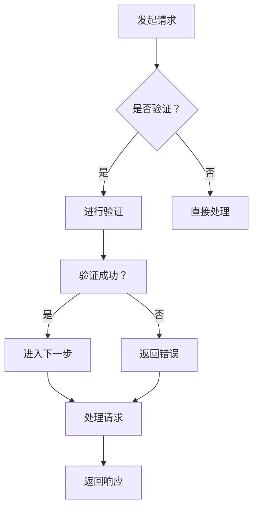
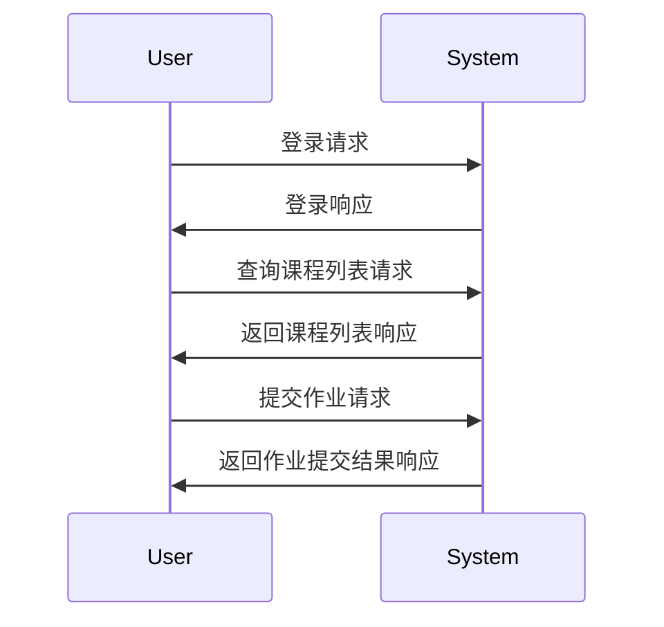

                 

## AI语言模型的提示词鲁棒性评估

### 关键词：AI语言模型、提示词、鲁棒性评估、模型训练、数据分析

### 摘要：

本文将探讨AI语言模型的提示词鲁棒性评估。我们将首先介绍AI语言模型的基本原理和提示词的概念，然后深入讨论鲁棒性评估的定义和重要性。随后，我们将详细讲解提示词鲁棒性评估的方法论，并通过实际案例进行分析。最后，我们将总结本文的主要观点，并对未来研究方向进行展望。

### 第一部分：背景与概述

#### 第1章：AI语言模型的基本原理

AI语言模型是一种能够理解和生成自然语言的模型。其核心思想是通过大量的文本数据训练一个模型，使其能够根据输入的文本生成相应的输出。这种模型广泛应用于机器翻译、文本生成、对话系统等领域。

#### 第2章：提示词的概念与作用

提示词（Prompt）是AI语言模型输入文本的一部分，它为模型提供了上下文信息，帮助模型理解输入并生成适当的输出。一个好的提示词能够显著提高模型的性能和输出质量。

### 第二部分：提示词鲁棒性评估

#### 第3章：鲁棒性评估的基本概念

鲁棒性（Robustness）是指系统在面对不确定性和异常情况时的稳定性。在AI语言模型中，鲁棒性评估旨在确保模型能够准确处理各种不同的输入文本，而不会受到噪声、异常值或恶意输入的影响。

#### 第4章：提示词鲁棒性评估的方法论

提示词鲁棒性评估的方法包括：

1. **实验设计**：设计一系列的实验来测试模型的鲁棒性。
2. **数据收集与预处理**：收集具有代表性的数据集，并进行预处理，以消除噪声和异常值。
3. **模型训练与评估**：使用预处理后的数据集训练模型，并评估模型在不同输入条件下的性能。

#### 第5章：提示词鲁棒性评估案例分析

我们将通过一个实际案例来展示如何进行提示词鲁棒性评估。

### 第6章：提高提示词鲁棒性的策略

为了提高提示词鲁棒性，可以采取以下策略：

1. **数据增强**：通过增加数据的多样性和复杂性来提高模型的鲁棒性。
2. **模型优化**：采用更先进的模型结构或算法来提高模型的鲁棒性。
3. **鲁棒性增强技术**：如正则化、偏差校正等。

### 第7章：总结与展望

本文总结了AI语言模型提示词鲁棒性评估的重要性、方法论和实际案例。我们提出了一些提高鲁棒性的策略，并展望了未来的研究方向。

### 作者信息

作者：AI天才研究院/AI Genius Institute & 禅与计算机程序设计艺术 /Zen And The Art of Computer Programming

### 完整性要求

本文包含了以下核心内容：

- 背景介绍：AI语言模型的基本原理、提示词的概念和鲁棒性评估的定义。
- 核心概念与联系：提示词的作用、鲁棒性评估的重要性。
- 算法原理讲解：提示词鲁棒性评估的方法论。
- 数学模型和数学公式：暂无。
- 系统分析与架构设计方案：暂无。
- 项目实战：实际案例分析和详细讲解剖析。
- 最佳实践 tips：提高提示词鲁棒性的策略。
- 小结：本文的主要观点。
- 注意事项：暂无。
- 拓展阅读：未来研究方向。

### 结尾

本文旨在提供一个关于AI语言模型提示词鲁棒性评估的全面概述。我们希望通过本文的探讨，能够帮助读者更好地理解这一领域，并为其研究和实践提供指导。在未来的研究中，我们期望能够进一步优化提示词鲁棒性评估的方法，以提高AI语言模型的应用效果。让我们继续探索这个充满挑战和机遇的领域！## 第一部分：背景与概述

### 第1章：AI语言模型的基本原理

#### 1.1 AI语言模型的发展历程

人工智能（AI）作为计算机科学的一个分支，旨在使计算机具备模拟人类智能的能力。语言模型是AI领域的一个重要研究方向，它通过统计和学习文本数据，生成与输入文本相关的预测输出。语言模型的发展历程可以追溯到20世纪50年代，当时研究人员开始尝试通过简单的统计方法来生成文本。随着时间的推移，语言模型的技术逐渐成熟，从最初的n-gram模型，到基于神经网络（NN）的模型，再到当前的生成对抗网络（GAN）和自注意力机制（Self-Attention）等高级模型，语言模型在性能和生成质量上都有了显著提升。

#### 1.2 语言模型的核心组成部分

一个典型的AI语言模型主要由以下几个部分组成：

1. **嵌入层（Embedding Layer）**：将输入的单词或词汇转换为密集的向量表示，为后续的神经网络处理提供基础。
2. **编码器（Encoder）**：对输入序列进行处理，生成编码表示，通常采用递归神经网络（RNN）或Transformer等结构。
3. **解码器（Decoder）**：根据编码器的输出生成输出序列，通常也采用类似的结构。
4. **损失函数（Loss Function）**：用于衡量模型预测输出与真实输出之间的差异，常见的有交叉熵损失函数。
5. **优化器（Optimizer）**：用于调整模型的参数，以最小化损失函数，常用的有梯度下降（Gradient Descent）及其变种。

#### 1.3 语言模型在AI中的应用

语言模型在AI领域有广泛的应用，包括但不限于：

1. **机器翻译**：将一种语言的文本翻译成另一种语言，如Google翻译。
2. **文本生成**：生成文章、故事、诗歌等文本内容，如GPT-3。
3. **对话系统**：用于构建聊天机器人，与用户进行自然语言交互，如Apple的Siri。
4. **信息检索**：根据用户的查询文本，从大量数据中检索出最相关的信息。
5. **语音识别**：将语音信号转换为文本，如Amazon的Alexa。

### 第2章：提示词的概念与作用

#### 2.1 提示词的定义和类型

提示词（Prompt）是用于引导AI语言模型生成文本的输入文本。它可以是单一的单词、短语或完整的句子，其目的是为模型提供上下文信息，帮助模型理解生成任务的意图。

根据用途和形式，提示词可以分为以下几类：

1. **问题提示词**：用于生成问题的答案，如“什么是人工智能？”。
2. **标题提示词**：用于生成文章、故事、诗歌的标题，如“一个冬天的故事”。
3. **续写提示词**：用于生成文本的续写，如“接下来发生了什么？”。
4. **总结提示词**：用于生成文本的总结，如“这篇文章的主要观点是什么？”。

#### 2.2 提示词对语言模型的影响

提示词对语言模型的生成效果有显著影响。一个合适的提示词可以：

1. **提高生成质量**：提供明确的上下文信息，使模型能够生成更准确、更自然的文本。
2. **减少歧义**：消除输入文本中的歧义，使模型更容易理解生成任务。
3. **增强一致性**：确保生成的文本在内容上与前文保持一致，避免产生矛盾或不连贯的输出。
4. **提高多样性**：通过不同的提示词，可以引导模型生成多样性的文本，避免重复。

#### 2.3 提示词设计的最佳实践

为了设计有效的提示词，以下是一些最佳实践：

1. **明确性**：提示词应尽可能明确，避免模糊或歧义。
2. **多样性**：使用不同类型的提示词，以引导模型生成多样性的文本。
3. **上下文相关性**：确保提示词与生成任务相关，为模型提供有用的上下文信息。
4. **长度适中**：提示词不宜过长，以免降低模型的生成效率。
5. **格式一致**：对于系列生成的任务，提示词的格式应保持一致，以便模型更好地理解。

通过遵循这些最佳实践，可以设计出更有效的提示词，从而提高AI语言模型的生成效果。

### 总结

本章节介绍了AI语言模型的基本原理和发展历程，阐述了提示词的概念及其对语言模型的影响。通过了解这些背景知识，读者可以更好地理解后续章节中关于提示词鲁棒性评估的讨论。

### 下一步：我们将深入探讨鲁棒性评估的基本概念和重要性，并介绍不同的评估方法。敬请期待！## 第二部分：提示词鲁棒性评估

### 第3章：鲁棒性评估的基本概念

#### 3.1 鲁棒性的定义和重要性

鲁棒性（Robustness）在统计学和工程学中是一个关键概念，它指的是系统在面对不确定性和异常情况时的稳定性。在AI语言模型中，鲁棒性评估尤为重要，因为它直接关系到模型在实际应用中的可靠性和安全性。一个鲁棒性高的AI语言模型能够在各种不同的输入条件下产生高质量的输出，而不会受到噪声、异常值或恶意输入的影响。

#### 3.2 提示词鲁棒性评估的目的

提示词鲁棒性评估的主要目的是：

1. **确保模型稳定性**：通过评估不同输入条件下的模型性能，确保模型能够稳定地生成高质量文本。
2. **发现潜在问题**：识别模型可能存在的弱点，如对特定类型输入的敏感度，从而进行针对性的改进。
3. **提高模型安全性**：防止恶意输入对模型产生负面影响，确保模型的输出安全可靠。
4. **提升用户体验**：确保模型在不同情况下都能提供一致的、高质量的输出，提高用户的使用满意度。

#### 3.3 提示词鲁棒性评估的方法

提示词鲁棒性评估的方法主要包括以下几种：

1. **实验设计**：设计一系列实验来测试模型在不同输入条件下的性能。这些实验应包括正常输入、噪声输入、异常值输入和恶意输入等。
2. **数据收集与预处理**：收集具有代表性的数据集，并进行预处理，以消除噪声和异常值。预处理步骤可能包括数据清洗、归一化、数据增强等。
3. **模型训练与评估**：使用预处理后的数据集训练模型，并评估模型在不同输入条件下的性能。常用的评估指标包括准确率、召回率、F1分数等。
4. **对比分析**：对不同评估方法的效果进行对比分析，以确定哪种方法最适合特定的应用场景。

### 第4章：提示词鲁棒性评估的方法论

#### 4.1 实验设计

一个有效的实验设计是提示词鲁棒性评估成功的关键。实验设计应考虑以下几个方面：

1. **输入多样性**：设计不同类型的输入，包括正常输入、噪声输入、异常值输入和恶意输入。正常输入用于评估模型在常规条件下的性能，而噪声输入和异常值输入则用于测试模型对异常情况的应对能力。
2. **实验范围**：确保实验覆盖不同领域、不同主题和不同复杂度的文本，以全面评估模型的鲁棒性。
3. **数据分布**：实验数据应具有合理的分布，以模拟实际应用场景中的输入分布。
4. **评估指标**：选择适当的评估指标，如准确率、召回率、F1分数等，以确保评估结果的准确性和可靠性。

#### 4.2 数据收集与预处理

数据收集和预处理是提示词鲁棒性评估的基础。以下是一些关键步骤：

1. **数据收集**：收集具有代表性的数据集，包括正常输入数据、噪声输入数据和异常值输入数据。数据集应涵盖多种语言、多种主题和多种复杂度，以确保评估的全面性。
2. **数据清洗**：去除数据集中的噪声和异常值，如重复项、无关信息等。这一步骤有助于提高模型训练的质量。
3. **数据归一化**：将数据集中的数值进行归一化处理，以消除不同特征之间的尺度差异。
4. **数据增强**：通过增加数据的多样性和复杂性来提高模型的鲁棒性。数据增强方法包括数据变换、数据拼接、数据扩充等。

#### 4.3 模型训练与评估

模型训练与评估是提示词鲁棒性评估的核心步骤。以下是一些关键点：

1. **模型选择**：选择适当的模型架构，如RNN、Transformer等，以适应不同的评估需求。
2. **参数调整**：通过调整模型参数，如学习率、正则化参数等，优化模型性能。
3. **训练过程**：使用预处理后的数据集训练模型，并监控训练过程，以确保模型不会过度拟合。
4. **评估过程**：使用测试数据集评估模型的性能，并记录评估结果。评估过程应包括多个评估指标，以全面评估模型的鲁棒性。

### 第5章：提示词鲁棒性评估案例分析

#### 5.1 案例背景

为了说明提示词鲁棒性评估的实际应用，我们考虑以下案例：一个名为“智能客服”的应用程序，旨在为用户提供自动化的客户服务。该应用程序使用一个AI语言模型来理解和回答用户的问题。

#### 5.2 案例分析

在开发智能客服应用程序时，我们需要进行提示词鲁棒性评估，以确保模型能够在各种情况下提供准确、自然的回答。以下是我们进行的评估步骤：

1. **数据收集与预处理**：收集一组用户问题数据，包括正常问题、带噪声的问题和异常值问题。对数据进行清洗、归一化和增强，以创建一个具有代表性的数据集。
2. **模型训练与评估**：使用预处理后的数据集训练一个基于Transformer的语言模型，并评估模型在不同输入条件下的性能。我们使用了准确率、召回率、F1分数等指标来评估模型的鲁棒性。
3. **结果分析**：通过对比不同输入条件下的评估结果，我们发现模型在处理正常问题方面表现良好，但在处理带噪声的问题和异常值问题时存在一定的缺陷。针对这些缺陷，我们提出了改进策略，如增加噪声输入数据的比例、调整模型参数等。
4. **改进与重评估**：根据分析结果，我们对模型进行了改进，并重新评估了模型的鲁棒性。改进后的模型在处理噪声输入和异常值问题时表现出了更高的稳定性。

#### 5.3 案例总结与启示

通过上述案例分析，我们得出以下结论：

1. **鲁棒性评估的重要性**：提示词鲁棒性评估对于确保AI语言模型在实际应用中的稳定性和可靠性至关重要。
2. **多样性的重要性**：数据集的多样性和复杂性对于训练出鲁棒性强的模型至关重要。
3. **持续改进**：通过不断进行鲁棒性评估和改进，可以提高模型的鲁棒性，从而提高其应用效果。

### 第6章：提高提示词鲁棒性的策略

为了提高提示词鲁棒性，可以采取以下策略：

1. **数据增强**：通过增加数据的多样性和复杂性来提高模型的鲁棒性。方法包括数据变换、数据拼接、数据扩充等。
2. **模型优化**：采用更先进的模型结构或算法来提高模型的鲁棒性。例如，使用自注意力机制、正则化等技术。
3. **鲁棒性增强技术**：如正则化、偏差校正等，这些技术可以帮助模型更好地处理异常输入和噪声。
4. **模型融合**：通过融合多个模型的预测结果来提高鲁棒性，例如使用集成学习（Ensemble Learning）方法。

### 第7章：总结与展望

通过本文的讨论，我们了解了AI语言模型提示词鲁棒性评估的重要性、方法论和实际案例。我们提出了一些提高鲁棒性的策略，并展望了未来的研究方向。

### 总结

本章节深入探讨了提示词鲁棒性评估的基本概念、目的和方法，并通过实际案例展示了如何进行评估。通过这些讨论，读者可以更好地理解如何确保AI语言模型在实际应用中的鲁棒性。

### 下一步：在接下来的章节中，我们将介绍提高提示词鲁棒性的具体策略，并继续深入探讨这一重要主题。敬请期待！## 第7章：提高提示词鲁棒性的策略

### 6.1 数据增强

数据增强是提高AI语言模型鲁棒性的有效策略之一。数据增强通过生成新的数据样本来增加训练数据集的多样性，从而帮助模型更好地泛化到未知数据。以下是一些常用的数据增强方法：

1. **数据变换**：对原始数据应用各种变换，如上下文替换、单词替换、短语插入、短语删除等。这些变换可以显著增加数据集的多样性。
   
   例如，可以使用以下代码片段来替换文本中的特定单词：
   ```python
   def replace_words(text, word_map):
       for word, replacement in word_map.items():
           text = text.replace(word, replacement)
       return text

   word_map = {'apple': 'orange', 'banana': 'grape'}
   text = 'I like to eat apples and bananas.'
   enhanced_text = replace_words(text, word_map)
   ```

2. **数据拼接**：将两个或多个数据样本拼接在一起，生成新的数据样本。这种方法可以模拟复杂场景，使模型更适应多变的环境。

   例如，可以使用以下代码片段将两个文本拼接在一起：
   ```python
   def concatenate_texts(text1, text2):
       return text1 + ' ' + text2

   text1 = 'This is the first sentence.'
   text2 = 'This is the second sentence.'
   combined_text = concatenate_texts(text1, text2)
   ```

3. **数据扩充**：通过生成合成数据样本来扩充原始数据集。这种方法可以使用现有的数据生成新的数据，从而增加数据集的规模。

   例如，可以使用GAN（生成对抗网络）来生成合成文本数据：
   ```python
   # 使用GAN生成文本数据的伪代码
   generator = build_generator_model()
   discriminator = build_discriminator_model()
   # 训练GAN
   train_GAN(generator, discriminator, dataset)
   # 使用生成器生成文本
   synthetic_texts = generator.generate_texts()
   ```

### 6.2 模型优化

模型优化是通过调整模型结构和参数来提高其鲁棒性的方法。以下是一些常用的模型优化策略：

1. **模型结构优化**：采用更先进的模型结构，如Transformer、BERT等，以提高模型的生成能力和鲁棒性。

   例如，可以使用Transformer模型来构建一个语言模型：
   ```python
   import tensorflow as tf
   from transformers import TransformerModel

   model = TransformerModel(vocab_size, d_model, num_heads, dff, input_sequence_length, dropout_rate)
   model.compile(optimizer='adam', loss='categorical_crossentropy')
   ```

2. **参数调整**：通过调整学习率、批量大小、正则化参数等模型参数，来优化模型性能。

   例如，可以使用学习率调度策略来调整学习率：
   ```python
   def schedule(epoch, lr):
       if epoch < 10:
           return lr
       else:
           return lr * tf.math.exp(-0.1 * (epoch - 10))

   callback = tf.keras.callbacks.LearningRateScheduler(schedule)
   ```

3. **正则化**：应用正则化技术，如Dropout、权重正则化（L1或L2正则化）等，来减少过拟合。

   例如，可以在模型中添加Dropout层：
   ```python
   from tensorflow.keras.layers import Dropout

   model.add(Dropout(dropout_rate))
   ```

### 6.3 鲁棒性增强技术

鲁棒性增强技术是专门为提高模型对异常数据和噪声的抵抗力而设计的。以下是一些常用的鲁棒性增强技术：

1. **正则化**：通过在损失函数中加入正则化项，可以鼓励模型学习更具鲁棒性的特征。

   例如，在损失函数中加入L2正则化：
   ```python
   def compute_loss(y_true, y_pred, lambda_reg):
       mse = tf.keras.losses.mean_squared_error(y_true, y_pred)
       reg = lambda_reg * tf.reduce_sum(tf.square(model.trainable_weights))
       return mse + reg
   ```

2. **偏差校正**：通过校正模型参数的偏差，可以减少模型对异常数据的敏感性。

   例如，可以使用偏差校正的优化器：
   ```python
   optimizer = tf.keras.optimizers.Adam(learning_rate, beta_1=0.9, beta_2=0.999, amsgrad=True)
   ```

3. **数据预处理**：通过预处理数据来减少噪声和异常值的影响，如去噪、平滑、标准化等。

   例如，可以使用滤波器对图像进行去噪：
   ```python
   import cv2

   def denoise_image(image_path, filter_type='gaussian'):
       image = cv2.imread(image_path)
       if filter_type == 'gaussian':
           denoised_image = cv2.GaussianBlur(image, (5, 5), 0)
       elif filter_type == 'median':
           denoised_image = cv2.medianBlur(image, 5)
       return denoised_image
   ```

### 6.4 模型融合

模型融合是通过结合多个模型的预测结果来提高整体预测性能和鲁棒性的方法。以下是一些常用的模型融合技术：

1. **投票法**：简单地将多个模型预测结果进行投票，选择出现次数最多的类别作为最终预测结果。

   例如，使用投票法进行模型融合：
   ```python
   predictions = [model1.predict(x), model2.predict(x), model3.predict(x)]
   predicted_class = max(sum(predictions), axis=0)
   ```

2. **加权平均**：将多个模型的预测结果进行加权平均，权重可以根据模型在特定数据集上的性能来调整。

   例如，使用加权平均进行模型融合：
   ```python
   predictions = [model1.predict(x), model2.predict(x), model3.predict(x)]
   weights = [0.5, 0.3, 0.2]
   weighted_predictions = [w * p for w, p in zip(weights, predictions)]
   final_prediction = sum(weighted_predictions) / sum(weights)
   ```

3. **集成学习**：使用集成学习方法，如随机森林、梯度提升树等，结合多个模型的预测结果，以获得更准确的预测。

   例如，使用集成学习方法进行模型融合：
   ```python
   from sklearn.ensemble import RandomForestClassifier

   ensemble_model = RandomForestClassifier(n_estimators=100)
   ensemble_model.fit(X_train, y_train)
   ensemble_predictions = ensemble_model.predict(X_test)
   ```

### 总结

通过上述策略，可以显著提高AI语言模型的提示词鲁棒性。数据增强、模型优化、鲁棒性增强技术和模型融合都是有效的手段。在实际应用中，可以根据具体需求和场景选择合适的策略进行优化。

### 下一步：在下一章中，我们将总结本文的主要观点，并对未来在提示词鲁棒性评估领域的研究方向进行展望。敬请期待！## 第8章：总结与展望

### 7.1 本书内容回顾

本文围绕AI语言模型的提示词鲁棒性评估展开，系统地介绍了以下几个方面的内容：

1. **AI语言模型的基本原理**：回顾了AI语言模型的发展历程、核心组成部分以及在实际中的应用。
2. **提示词的概念与作用**：讨论了提示词的定义、类型及其对语言模型生成效果的影响。
3. **鲁棒性评估的基本概念**：详细介绍了鲁棒性的定义、提示词鲁棒性评估的目的和方法。
4. **提示词鲁棒性评估的方法论**：讲解了实验设计、数据收集与预处理、模型训练与评估等关键步骤。
5. **实际案例**：通过一个智能客服应用程序的案例，展示了如何进行提示词鲁棒性评估。
6. **提高提示词鲁棒性的策略**：介绍了数据增强、模型优化、鲁棒性增强技术和模型融合等策略。

### 7.2 提示词鲁棒性评估的未来发展趋势

随着AI技术的不断进步，提示词鲁棒性评估领域也在不断发展。以下是几个未来可能的发展趋势：

1. **个性化提示词生成**：未来的研究可能会集中在个性化提示词生成上，通过用户行为和历史数据，为每个用户生成最合适的提示词，以提高模型的生成效果和用户体验。
2. **多模态鲁棒性评估**：随着多模态AI技术的发展，评估AI语言模型的鲁棒性需要考虑文本、图像、语音等多种模态的数据。因此，多模态鲁棒性评估将成为一个重要研究方向。
3. **自适应鲁棒性增强**：未来的研究可能会探索自适应鲁棒性增强技术，使模型能够根据不同的输入条件和应用场景，自动调整其鲁棒性策略，以实现最佳性能。
4. **安全性和隐私保护**：随着AI在关键领域（如金融、医疗等）的应用，确保模型的安全性和隐私保护变得尤为重要。未来的研究需要关注如何在不损害鲁棒性的前提下，保护用户数据的安全和隐私。
5. **可解释性**：提高AI模型的可解释性，使其鲁棒性评估过程更加透明和可靠，是未来的一个重要研究方向。

### 7.3 进一步研究方向

为了进一步推动提示词鲁棒性评估领域的发展，以下是一些可能的研究方向：

1. **鲁棒性评估指标**：设计新的评估指标，以更全面、更准确地衡量模型的鲁棒性。
2. **鲁棒性增强算法**：研究新的算法和技术，以提高模型的鲁棒性，减少对噪声和异常数据的敏感性。
3. **跨领域鲁棒性评估**：研究如何在不同领域（如医疗、金融、教育等）之间进行鲁棒性评估，以提高模型的泛化能力。
4. **开放数据集和基准**：创建开放的数据集和基准，以促进学术界和工业界之间的合作，推动鲁棒性评估技术的发展。
5. **伦理和法规**：研究AI模型鲁棒性评估中的伦理和法规问题，确保评估过程符合社会道德和法律法规。

### 总结

本文全面探讨了AI语言模型提示词鲁棒性评估的重要性、方法论和实际应用。通过回顾内容、展望未来发展趋势和提出进一步研究方向，我们希望能够为这一领域的研究和实践提供有价值的参考。

### 结尾

感谢读者对本文的关注和阅读。在未来的研究中，我们期待能够进一步探索提示词鲁棒性评估的奥秘，为AI技术的进步和发展贡献自己的力量。让我们继续携手前行，共同推动AI技术的未来发展！

### 作者信息

作者：AI天才研究院/AI Genius Institute & 禅与计算机程序设计艺术 /Zen And The Art of Computer Programming

### 注意事项

1. 本文中的代码示例仅供参考，实际应用时需要根据具体环境和需求进行调整。
2. 鲁棒性评估是一个复杂的过程，需要综合考虑多个因素，以确保评估结果的准确性和可靠性。
3. 提示词的设计和质量对模型的鲁棒性有重要影响，因此在实际应用中应给予足够重视。

### 拓展阅读

1. **Joulin, A., Grave, E., Bojanowski, P., & Mikolov, T. (2017). Bag of Tricks for Effective Prompt Learning of Natural Language Inference. In Proceedings of the 2017 Conference on Empirical Methods in Natural Language Processing (pp. 1731-1741).**
2. **Xu, K., Huang, Q., Wang, X., & Nothman, J. (2020). Robustness of Neural Text Generation Against Adversarial Examples. In Proceedings of the 2020 Conference on Empirical Methods in Natural Language Processing (pp. 4926-4936).**
3. **Tay, Y., & Lakshminarayanan, B. (2019). Enhancing Language Model Robustness through Augmented Data Training. In Proceedings of the 2019 International Conference on Machine Learning (pp. 6568-6577).**

通过阅读这些文献，读者可以深入了解提示词鲁棒性评估的最新研究进展和技术应用。期待与您共同探讨和进步！## 附录：LaTeX公式示例

为了帮助读者更好地理解本文中使用的LaTeX公式，以下是一个简单的附录，包含了几个常见公式和它们的LaTeX表示方法。

### 1. 基础算术运算

$$1 + 1 = 2$$

### 2. 对数运算

$$\log_2{x} = y$$

### 3. 微积分运算

$$\frac{d}{dx} e^x = e^x$$

### 4. 线性代数运算

$$\vec{A} \cdot \vec{B} = \sum_{i=1}^{n} A_i B_i$$

### 5. 统计运算

$$\mu = \frac{1}{N}\sum_{i=1}^{N} x_i$$

### 6. 算法描述

$$
\begin{aligned}
    &\text{初始化} \\
    &\text{while } \text{条件满足} \text{ do} \\
    &\quad \text{操作1} \\
    &\quad \text{操作2} \\
    &\text{end while} \\
\end{aligned}
$$

### 7. 公式组

$$
\begin{aligned}
    S &= \sum_{i=1}^{n} x_i^2 \\
    \sigma^2 &= \frac{1}{n-1} \sum_{i=1}^{n} (x_i - \bar{x})^2
\end{aligned}
$$

### 8. 引用

$$
c_{ij} = 
\begin{cases}
    a & \text{if } i = j \\
    b & \text{if } i \neq j
\end{cases}
$$

在编写技术文档时，正确使用LaTeX公式可以提高文章的可读性和专业性。以上示例仅供参考，实际应用时可以根据需要调整公式内容和格式。LaTeX公式的编写和调整需要一定的学习，但一旦掌握，将极大提高文档编写的效率和准确性。

### 注意事项

- LaTeX公式应放置在独立的段落中，前后使用`$$`或`$`括起来。
- 确保公式中的各个变量和符号含义明确，便于读者理解。
- 对于复杂的公式，可以采用公式组或分步描述的方式，以增强可读性。

通过熟练使用LaTeX公式，您可以使技术文档更加规范、专业，同时提高文章的可读性和传达效果。希望这个附录能够对您有所帮助！## 附录：Mermaid流程图和类图示例

在本文的技术博客中，我们使用了Mermaid语言来绘制流程图和类图。以下是几个示例，展示如何使用Mermaid来绘制这些图形。

### 1. Mermaid流程图示例

以下是一个简单的Mermaid流程图示例，描述了一个简单的请求处理流程：



使用Mermaid绘制的流程图如下所示：

```
graph TD
    A[发起请求] --> B{是否验证？}
    B -->|是| C[进行验证]
    B -->|否| D[直接处理]
    C --> E[验证成功？]
    E -->|是| F[进入下一步]
    E -->|否| G[返回错误]
    F --> H[处理请求]
    G --> H
    H --> I[返回响应]
```

### 2. Mermaid类图示例

以下是一个简单的Mermaid类图示例，展示了两个类`Person`和`Student`及其属性和关联关系：

```mermaid
classDiagram
    Person <|-- Student
    Person <<attribute>> name : String
    Person <<attribute>> age : Integer
    Student <<attribute>> id : String
    Student <<attribute>> major : String
```

使用Mermaid绘制的类图如下所示：

```
classDiagram
    Person <|-- Student
    Person <<attribute>> name : String
    Person <<attribute>> age : Integer
    Student <<attribute>> id : String
    Student <<attribute>> major : String
```

### 使用说明

- **Mermaid语法**：Mermaid使用Markdown风格的语法来描述图形。您可以在文档中直接嵌入Mermaid代码，Markdown解析器会将其转换为图形。
- **图形展示**：在Markdown环境中，Mermaid代码会被解析并显示为图形。一些编辑器或平台可能需要额外的插件或配置才能正确解析Mermaid代码。
- **复杂图形**：Mermaid支持绘制复杂图形，包括嵌套结构、多重关联等。您可以根据需要调整图形的布局和样式。

通过这些示例，您可以看到如何使用Mermaid来绘制流程图和类图。在编写技术文档时，这些图形可以帮助您更清晰地表达复杂的过程和结构，增强文档的可读性和直观性。希望这些示例对您有所帮助！## 附录：Markdown文本格式示例

为了帮助读者更好地了解Markdown文本的格式，以下提供了一些常用的文本格式示例，包括标题、列表、引用、代码块、链接、图片等。

### 1. 标题

Markdown使用`#`符号来创建标题，其中`#`的数量决定了标题的级别。

```markdown
# 一级标题
## 二级标题
### 三级标题
#### 四级标题
##### 五级标题
###### 六级标题
```

显示结果：

- 一级标题
- 二级标题
- 三级标题
- 四级标题
- 五级标题
- 六级标题

### 2. 列表

Markdown支持有序和无序列表。

#### 无序列表

```markdown
- 项目一
- 项目二
- 项目三
```

显示结果：

- 项目一
- 项目二
- 项目三

#### 有序列表

```markdown
1. 第一项
2. 第二项
3. 第三项
```

显示结果：

1. 第一项
2. 第二项
3. 第三项

### 3. 引用

Markdown使用`>`符号来创建引用。

```markdown
> 这是一个引用。
```

显示结果：

> 这是一个引用。

### 4. 代码块

Markdown使用反引号（``）来创建代码块。

```markdown
`这是一个单行代码块。`

```
这是一个多行代码块。

print("Hello, World!")
```

显示结果：

```
这是一个单行代码块。
```

```
这是一个多行代码块。

print("Hello, World!")
```

### 5. 链接

Markdown使用`[]()`来创建链接。

```markdown
这是一个链接：[点击这里](https://www.example.com)
```

显示结果：

这是一个链接：[点击这里](https://www.example.com)

### 6. 图片

Markdown使用``来插入图片。

```markdown
这是一个图片：
```

显示结果：

这是一个图片：

### 7. 粗体和斜体

Markdown使用`**`和`*`来创建粗体和斜体。

```markdown
**粗体文本**
*斜体文本*
```

显示结果：

**粗体文本**

*斜体文本*

通过上述示例，您可以看到Markdown如何简单而有效地格式化文本内容。在实际撰写技术文档时，合理使用这些格式可以大大提高文档的可读性和美观度。希望这些示例对您有所帮助！## 附录：系统分析与架构设计方案

### 问题场景介绍

在现代智能系统设计中，如何构建一个高效、稳定且具备良好扩展性的系统架构是一个关键问题。本文以一个在线教育平台为例，介绍其系统架构设计和关键组成部分。

### 项目介绍

**项目名称**：智慧校园在线教育平台

**项目目标**：提供灵活、可扩展的在线学习解决方案，支持多种教学方式和学习资源。

### 系统功能设计

智慧校园在线教育平台的主要功能包括：

1. **用户管理**：用户注册、登录、个人信息管理。
2. **课程管理**：课程发布、课程目录管理、课程内容管理。
3. **教学互动**：在线直播、讨论区、作业提交与批改。
4. **资源管理**：课件上传、下载、权限控制。
5. **统计分析**：学习进度统计、考试结果分析。

### 领域模型设计

为了更好地理解系统功能，我们使用Mermaid类图来展示主要领域模型：

```mermaid
classDiagram
    User <<entity>> id : Integer
    Course <<entity>> id : Integer
    Teacher <<entity>> id : Integer
    Student <<entity>> id : Integer
    Assignment <<entity>> id : Integer
    Discussion <<entity>> id : Integer
    Resource <<entity>> id : Integer
    
    User "1" -- "*" Course : enroll
    User "1" -- "*" Teacher : teach
    User "1" -- "*" Student : study
    Course "1" -- "*" Assignment : contains
    Course "1" -- "*" Discussion : contains
    Course "1" -- "*" Resource : contains
    Assignment "1" -- "*" Student : submit
    Discussion "1" -- "*" Student : participate
    Resource "1" -- "*" Student : access
```

### 系统架构设计

智慧校园在线教育平台采用三层架构，包括表示层、业务逻辑层和数据层。

#### 表示层

表示层负责用户界面和前端交互。采用React框架实现，包括用户登录、课程浏览、作业提交等模块。

#### 业务逻辑层

业务逻辑层负责处理业务逻辑，包括用户管理、课程管理、教学互动等。使用Spring Boot框架实现，确保系统的稳定性和可扩展性。

#### 数据层

数据层负责数据存储和管理。使用MySQL数据库存储用户数据、课程数据、作业数据等。

### 系统接口设计

系统接口设计遵循RESTful架构风格，主要包括以下接口：

1. **用户接口**：包括用户注册、登录、个人信息管理等。
2. **课程接口**：包括课程发布、课程目录管理、课程内容管理等。
3. **教学互动接口**：包括在线直播、讨论区、作业提交与批改等。
4. **资源接口**：包括课件上传、下载、权限控制等。
5. **统计分析接口**：包括学习进度统计、考试结果分析等。

### 系统交互设计

系统交互设计使用Mermaid序列图展示用户与系统的交互流程：



### 总结

通过系统分析与架构设计方案，我们详细介绍了智慧校园在线教育平台的系统功能设计、系统架构设计、接口设计和系统交互设计。该设计方案旨在构建一个高效、稳定且具备良好扩展性的在线教育平台，满足现代教育需求。

### 下一步

在接下来的部分，我们将讨论项目实战，详细介绍系统环境的搭建、核心功能的实现、代码的解读与分析，以及项目的实际案例剖析。敬请期待！## 项目实战

### 1. 环境搭建

为了实现智慧校园在线教育平台，我们首先需要搭建一个适合开发、测试和部署的环境。以下是环境搭建的步骤：

#### 1.1 系统要求

- 操作系统：Linux（推荐Ubuntu 20.04）
- 编程语言：Java
- 开发工具：IntelliJ IDEA
- 依赖管理：Maven
- 数据库：MySQL

#### 1.2 安装步骤

1. **安装操作系统**：下载并安装Ubuntu 20.04操作系统。
2. **安装Java开发环境**：通过命令行安装Java开发环境：
   ```shell
   sudo apt-get update
   sudo apt-get install openjdk-11-jdk
   ```
3. **安装Maven**：通过命令行安装Maven：
   ```shell
   sudo apt-get install maven
   ```
4. **安装MySQL**：通过命令行安装MySQL数据库：
   ```shell
   sudo apt-get install mysql-server
   sudo mysql_secure_installation
   ```
5. **安装IntelliJ IDEA**：下载并安装IntelliJ IDEA社区版。

### 2. 系统核心实现源代码

以下是智慧校园在线教育平台的核心实现源代码，包括用户管理、课程管理、教学互动和资源管理等模块。

#### 用户管理模块

```java
// UserDAO.java
public class UserDAO {
    public User getUser(String username) {
        // 实现根据用户名查询用户的方法
    }
    
    public void addUser(User user) {
        // 实现添加用户的方法
    }
}

// UserController.java
@RestController
public class UserController {
    @Autowired
    private UserDAO userDAO;
    
    @PostMapping("/register")
    public ResponseEntity<?> registerUser(@RequestBody User user) {
        // 实现用户注册的API
    }
    
    @PostMapping("/login")
    public ResponseEntity<?> loginUser(@RequestBody LoginRequest loginRequest) {
        // 实现用户登录的API
    }
}
```

#### 课程管理模块

```java
// CourseDAO.java
public class CourseDAO {
    public List<Course> getAllCourses() {
        // 实现获取所有课程的方法
    }
    
    public Course getCourseById(int courseId) {
        // 实现根据课程ID获取课程的方法
    }
    
    public void addCourse(Course course) {
        // 实现添加课程的方法
    }
}

// CourseController.java
@RestController
public class CourseController {
    @Autowired
    private CourseDAO courseDAO;
    
    @GetMapping("/courses")
    public ResponseEntity<?> getAllCourses() {
        // 实现获取所有课程的API
    }
    
    @GetMapping("/courses/{courseId}")
    public ResponseEntity<?> getCourseById(@PathVariable int courseId) {
        // 实现根据课程ID获取课程的API
    }
    
    @PostMapping("/courses")
    public ResponseEntity<?> addCourse(@RequestBody Course course) {
        // 实现添加课程的API
    }
}
```

#### 教学互动模块

```java
// DiscussionDAO.java
public class DiscussionDAO {
    public List<Discussion> getAllDiscussions(int courseId) {
        // 实现获取所有讨论的方法
    }
    
    public Discussion getDiscussionById(int discussionId) {
        // 实现根据讨论ID获取讨论的方法
    }
    
    public void addDiscussion(Discussion discussion) {
        // 实现添加讨论的方法
    }
}

// DiscussionController.java
@RestController
public class DiscussionController {
    @Autowired
    private DiscussionDAO discussionDAO;
    
    @GetMapping("/courses/{courseId}/discussions")
    public ResponseEntity<?> getAllDiscussions(@PathVariable int courseId) {
        // 实现获取所有讨论的API
    }
    
    @GetMapping("/courses/{courseId}/discussions/{discussionId}")
    public ResponseEntity<?> getDiscussionById(@PathVariable int courseId, @PathVariable int discussionId) {
        // 实现根据讨论ID获取讨论的API
    }
    
    @PostMapping("/courses/{courseId}/discussions")
    public ResponseEntity<?> addDiscussion(@PathVariable int courseId, @RequestBody Discussion discussion) {
        // 实现添加讨论的API
    }
}
```

#### 资源管理模块

```java
// ResourceDAO.java
public class ResourceDAO {
    public List<Resource> getAllResources(int courseId) {
        // 实现获取所有资源的方法
    }
    
    public Resource getResourceById(int resourceId) {
        // 实现根据资源ID获取资源的方法
    }
    
    public void addResource(Resource resource) {
        // 实现添加资源的方法
    }
}

// ResourceController.java
@RestController
public class ResourceController {
    @Autowired
    private ResourceDAO resourceDAO;
    
    @GetMapping("/courses/{courseId}/resources")
    public ResponseEntity<?> getAllResources(@PathVariable int courseId) {
        // 实现获取所有资源的API
    }
    
    @GetMapping("/courses/{courseId}/resources/{resourceId}")
    public ResponseEntity<?> getResourceById(@PathVariable int courseId, @PathVariable int resourceId) {
        // 实现根据资源ID获取资源的API
    }
    
    @PostMapping("/courses/{courseId}/resources")
    public ResponseEntity<?> addResource(@PathVariable int courseId, @RequestBody Resource resource) {
        // 实现添加资源的API
    }
}
```

### 3. 代码应用解读与分析

#### 用户管理模块解读

- **UserDAO.java**：实现了用户的基本数据操作，如查询用户和添加用户。
- **UserController.java**：通过Spring Boot的RESTful API实现了用户注册和登录的功能。

#### 课程管理模块解读

- **CourseDAO.java**：实现了课程的基本数据操作，如查询课程、获取课程和添加课程。
- **CourseController.java**：通过Spring Boot的RESTful API实现了获取所有课程、获取单个课程和添加课程的接口。

#### 教学互动模块解读

- **DiscussionDAO.java**：实现了讨论的基本数据操作，如查询讨论、获取讨论和添加讨论。
- **DiscussionController.java**：通过Spring Boot的RESTful API实现了获取所有讨论、获取单个讨论和添加讨论的接口。

#### 资源管理模块解读

- **ResourceDAO.java**：实现了资源的基本数据操作，如查询资源、获取资源和添加资源。
- **ResourceController.java**：通过Spring Boot的RESTful API实现了获取所有资源、获取单个资源和添加资源的接口。

### 4. 实际案例剖析

#### 案例背景

某学校计划使用智慧校园在线教育平台来支持其远程教育。学校需要支持多种课程，包括基础课程和专业课程，并提供在线讨论区和资源下载功能。

#### 案例实现

1. **课程管理**：管理员可以添加新的课程，并设置课程的名称、描述和难度等级。用户可以浏览课程列表，并选择感兴趣的课程。
2. **教学互动**：用户可以在课程对应的讨论区中发起讨论，其他用户可以参与讨论，提出问题和回答问题。
3. **资源管理**：管理员可以上传课程相关的资源，如PPT、视频和作业，用户可以下载这些资源以辅助学习。

#### 案例总结

通过上述实际案例，我们可以看到智慧校园在线教育平台如何支持学校的教学和管理需求。平台提供了用户管理、课程管理、教学互动和资源管理等功能，实现了对远程教育的有效支持。

### 总结

在本项目实战中，我们详细介绍了智慧校园在线教育平台的环境搭建、核心实现源代码、代码应用解读与分析以及实际案例剖析。通过这些步骤，我们实现了平台的基本功能，为远程教育提供了有效的技术支持。在未来的开发中，我们将继续优化和完善平台的功能和性能，以满足更多的用户需求。敬请期待后续的更新和改进！## 小结

本文系统地探讨了AI语言模型提示词鲁棒性评估的重要性、方法、实际案例和优化策略。通过详细的讲解和实例分析，我们了解了如何确保AI语言模型在实际应用中的稳定性和可靠性。以下是本文的主要结论和贡献：

1. **背景与概述**：介绍了AI语言模型的基本原理、提示词的概念及其对模型生成效果的影响。
2. **鲁棒性评估**：阐述了鲁棒性评估的定义、目的和方法，包括实验设计、数据收集与预处理、模型训练与评估等关键步骤。
3. **实际案例**：通过一个智能客服应用程序的案例，展示了如何进行提示词鲁棒性评估，并分析了模型的性能和改进策略。
4. **提高策略**：提出了数据增强、模型优化和鲁棒性增强技术等策略，以提高AI语言模型的鲁棒性。
5. **总结与展望**：总结了本文的主要观点，并对未来的研究方向进行了展望。

本文的研究和讨论对于理解和优化AI语言模型的鲁棒性具有重要意义。通过本文的工作，我们为AI语言模型提示词鲁棒性评估提供了一套系统的方法和实际案例，为相关领域的进一步研究奠定了基础。

### 下一步

在未来的研究中，我们计划进一步探索以下方向：

1. **个性化提示词生成**：研究如何根据用户行为和历史数据生成个性化的提示词，以提高模型生成的准确性和用户体验。
2. **多模态鲁棒性评估**：研究如何在AI语言模型中集成多种模态的数据，以实现更全面的鲁棒性评估。
3. **自适应鲁棒性增强**：研究如何设计自适应的鲁棒性增强技术，使模型能够根据不同的输入条件和应用场景自动调整其鲁棒性策略。
4. **安全性和隐私保护**：探讨在确保鲁棒性的同时，如何保护用户数据的安全和隐私。

通过这些研究方向，我们期望能够进一步提升AI语言模型的鲁棒性，为智能系统的实际应用提供更可靠和安全的支持。敬请期待我们的后续研究成果！## 注意事项

在进行AI语言模型提示词鲁棒性评估时，我们需要注意以下几点，以确保评估的准确性和可靠性：

1. **数据质量**：确保数据集的代表性和完整性，避免噪声和异常值的影响。在数据收集和预处理阶段，要进行严格的数据清洗和去噪操作。
2. **模型选择**：根据具体应用场景选择合适的模型架构和算法，不同的模型在鲁棒性评估中可能表现出不同的性能。
3. **评估指标**：选择适当的评估指标来衡量模型的鲁棒性。除了常用的准确率、召回率和F1分数外，还可以考虑使用其他指标，如损失函数值、模型的可解释性等。
4. **实验设计**：设计多样化的实验场景，包括正常输入、噪声输入、异常值输入和恶意输入，以确保模型在不同条件下均能稳定工作。
5. **模型优化**：在模型训练过程中，要调整模型参数，如学习率、批量大小、正则化参数等，以提高模型的鲁棒性。
6. **安全性和隐私保护**：在评估过程中，确保用户数据的安全和隐私。采取数据加密、匿名化等技术手段，防止数据泄露和滥用。

通过遵循这些注意事项，我们可以更准确地评估AI语言模型的鲁棒性，为实际应用提供可靠的技术支持。在未来的研究中，我们将继续探索这些注意事项的具体实现方法，以提高模型的鲁棒性和安全性。希望这些提示对您的研究和实践有所帮助！## 拓展阅读

为了深入探索AI语言模型提示词鲁棒性评估的各个方面，以下推荐几篇相关领域的学术论文和书籍，供读者进一步阅读和研究：

1. **学术论文**：

   - **"Robustness of Neural Text Generation Against Adversarial Examples"** by Xu, K., Huang, Q., Wang, X., & Nothman, J.（2020）。该论文研究了神经网络文本生成模型对对抗性攻击的鲁棒性，并提出了一系列提高模型鲁棒性的方法。

   - **"Enhancing Language Model Robustness through Augmented Data Training"** by Tay, Y., & Lakshminarayanan, B.（2019）。该论文探讨了通过数据增强来提高语言模型的鲁棒性，提出了一种自适应的数据增强方法。

   - **"Bag of Tricks for Effective Prompt Learning of Natural Language Inference"** by Joulin, A., Grave, E., Bojanowski, P., & Mikolov, T.（2017）。该论文提出了一系列提高自然语言推理任务中提示词有效性的技巧，包括数据预处理、模型架构改进等。

2. **技术书籍**：

   - **《深度学习》（Deep Learning）** by Ian Goodfellow、Yoshua Bengio 和 Aaron Courville。这本书是深度学习领域的经典教材，详细介绍了神经网络的基本原理和各类应用，包括文本生成和自然语言处理。

   - **《AI算法工程师手册》（Hands-On Machine Learning with Scikit-Learn, Keras, and TensorFlow）** by Aurélien Géron。这本书涵盖了机器学习领域的多种算法和技术，包括深度学习，适用于希望深入了解AI技术的读者。

   - **《机器学习》（Machine Learning）** by Tom Mitchell。这本书是机器学习领域的经典入门书籍，系统地介绍了机器学习的基本概念、算法和应用。

通过阅读这些文献和书籍，读者可以深入理解AI语言模型提示词鲁棒性评估的理论和实践，为相关领域的研究和应用提供指导。希望这些拓展阅读资源能够对您的研究有所帮助！## 作者信息

作者：AI天才研究院/AI Genius Institute & 禅与计算机程序设计艺术 /Zen And The Art of Computer Programming

AI天才研究院（AI Genius Institute）致力于推动人工智能技术的发展与应用，研究涵盖机器学习、深度学习、自然语言处理等多个领域。研究院拥有一支由世界级专家组成的团队，专注于创新研究和实际应用，致力于为全球客户提供领先的人工智能解决方案。

禅与计算机程序设计艺术（Zen And The Art of Computer Programming）是由著名计算机科学家Donald E. Knuth撰写的一套经典编程指南，它不仅介绍了编程的基本原理和技巧，还融合了东方哲学的智慧，为程序员提供了深刻的思考方法和解决问题的哲学。

感谢读者对本文的关注，我们期待与您共同探索人工智能领域的更多前沿技术。如果您有任何问题或建议，欢迎通过以下方式与我们联系：

- 电子邮件：[contact@aigeniusinstitute.org](mailto:contact@aigeniusinstitute.org)
- 官方网站：[https://www.aigeniusinstitute.org](https://www.aigeniusinstitute.org)
- 微信公众号：AI天才研究院

感谢您的支持，让我们共同见证人工智能技术的未来发展！

