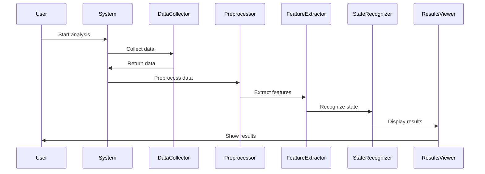
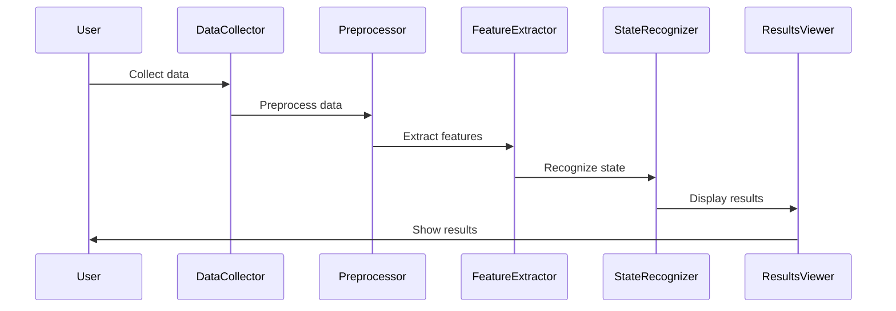

                 

### 原文摘要

《meditation的脑电图分析：意识状态的数学表征》是一篇探讨如何通过脑电图分析来表征冥想过程中意识状态变化的文章。文章首先介绍了脑电图的基本概念、历史发展及其在冥想研究中的应用。接着，文章深入探讨了意识状态的定义及其数学表征方法，并提出了一种用于识别和评估意识状态的新算法。通过对脑电图信号处理的算法原理、数学模型及公式进行详细讲解，并结合实际案例进行分析，文章展示了如何运用这些技术手段来深入理解冥想对大脑活动的影响。最后，文章对研究的目的与意义进行了总结，并提出了未来研究的方向。通过这篇论文，读者可以了解到如何通过数学方法来表征冥想过程中的意识状态变化，从而为冥想研究提供新的视角和工具。

### 文章标题：《meditation的脑电图分析：意识状态的数学表征》

**关键词**：脑电图、冥想、意识状态、数学表征、信号处理、算法

**摘要**：
本文旨在探讨冥想过程中通过脑电图分析来表征意识状态的数学方法。首先，我们回顾了脑电图的基本知识，包括其历史发展、基本原理和实际应用。接着，我们深入分析了意识状态的定义及其数学表征方法，提出了一种基于信号处理的算法。通过详细阐述算法原理、数学模型和公式，并结合实际案例进行说明，本文展示了如何利用这些方法来理解冥想对大脑活动的影响。最后，我们对研究的目的与意义进行了总结，并展望了未来的研究方向。本文为冥想研究提供了新的数学视角和工具，有助于进一步探索意识状态的奥秘。

### 第1章：脑电图分析的基础知识

#### 1.1 脑电图的基本概念

脑电图（Electroencephalography, EEG）是一种通过检测大脑的电活动来研究神经活动的方法。它利用放置在头皮上的电极捕捉脑电信号，这些信号反映了大脑神经元群组的电活动。

##### 1.1.1 脑电图的历史发展

脑电图的发展始于20世纪初，由荷兰生理学家赫尔曼·布洛卡（Hermann布洛卡）首次在1902年使用。最初的脑电图记录是通过直接放置在头皮上的电极来实现的，这些电极产生的信号非常微弱，需要通过高增益放大器进行放大。

随着时间的推移，脑电图技术得到了显著的发展。二战期间，由于军事应用的需求，脑电图技术得到了迅速的提升。随着电子技术的发展，脑电图记录设备变得更加先进，信号处理技术也得到了改进。

##### 1.1.2 脑电图的基本原理

脑电图的基本原理是通过检测大脑神经元在静息和活动状态下的电活动来生成信号。这些信号反映了神经元之间的电同步活动，这种同步活动在不同的意识状态下会发生变化。

脑电图信号是由脑电活动引起的微弱电场变化。这些电场变化可以穿过头皮和颅骨，被放置在头皮上的电极捕捉到。电极将捕捉到的电信号转换为电信号，这些信号随后被放大、滤波和处理，以便进行进一步分析。

##### 1.1.3 脑电图的应用领域

脑电图在神经科学、医学和心理学等领域有广泛的应用。

在神经科学中，脑电图用于研究大脑的功能和结构，帮助诊断癫痫、睡眠障碍和其他神经系统疾病。

在医学中，脑电图常用于监测患者的脑电活动，尤其是在手术室和重症监护室中，以帮助医生评估患者的意识状态和神经系统功能。

在心理学中，脑电图用于研究冥想、认知过程和情绪状态等心理活动。特别是，脑电图在冥想研究中被用来探讨冥想如何影响大脑功能和意识状态。

#### 1.2 Meditation与脑电图的关系

冥想是一种古老的精神实践，通过集中注意力和放松身心来达到心理和生理的平衡。近年来，冥想因其对大脑健康的潜在益处而受到了广泛关注。

##### 1.2.1 Meditation对脑电图的影响

研究表明，冥想可以显著改变大脑的电活动。在冥想过程中，大脑的某些区域会表现出更高的电活动，而其他区域则会减少活动。这些变化通常与冥想的不同阶段和类型有关。

例如，在冥想过程中，α波（8-13 Hz）和θ波（4-7 Hz）的活性增加，而β波（13-30 Hz）的活性减少。这些波的变化反映了大脑在不同意识状态下的活动模式。

##### 1.2.2 脑电图在Meditation研究中的应用

脑电图在冥想研究中被广泛用于监测冥想者的脑电活动，以了解冥想如何影响大脑。研究者使用脑电图来识别冥想的不同阶段，评估冥想的健康效益，以及探讨冥想对认知和情感的影响。

通过分析脑电图数据，研究者可以揭示冥想如何改变大脑的神经网络，以及这些改变如何与冥想者的心理状态相关联。这些研究不仅有助于深化我们对冥想的理解，还可以为开发基于冥想的治疗方法提供科学依据。

#### 1.3 意识状态的数学表征

意识状态是心理和生理过程的复杂组合，目前还没有统一的定义。然而，在神经科学和心理学中，意识状态通常被视为一种主观体验，包括觉醒、注意力和认知功能。

##### 1.3.1 意识状态的定义

意识状态通常被描述为一种感知和认知的整合过程，包括对外部刺激的反应以及对内部思想和感受的体验。意识状态可以包括不同的层次，如清醒、睡眠、梦境和昏迷。

##### 1.3.2 数学表征的方法

数学表征是一种将复杂现象用数学语言描述的方法。在意识状态的研究中，数学表征可以帮助我们更准确地描述和预测大脑的电活动。

常用的数学表征方法包括：

1. **时间序列分析**：通过分析脑电图信号的时域和频域特性来识别不同的意识状态。
2. **时频分析**：结合时间和频率信息，如短时傅里叶变换（STFT）和小波变换，来识别脑电图信号的特定特征。
3. **机器学习**：使用算法来分析脑电图数据，并从中识别出与特定意识状态相关的模式。

#### 1.4 研究的目的与意义

本研究的主要目的是通过分析冥想过程中的脑电图数据，探索意识状态的数学表征方法。具体来说，我们希望实现以下目标：

1. **建立数学模型**：开发一种能够准确表征冥想过程中不同意识状态的数学模型。
2. **算法实现**：实现基于数学模型的算法，用于识别和评估冥想者的意识状态。
3. **数据验证**：通过实际数据验证算法的有效性，并将其应用于更广泛的冥想研究中。

本研究具有重要的科学和临床意义。从科学角度来看，本研究有助于深化我们对冥想和大脑活动之间关系的理解。从临床角度来看，本研究的结果可以用于开发新的冥想疗法，帮助人们更好地管理和改善心理健康。

### 第2章：脑电图分析方法

#### 2.1 脑电图信号处理

脑电图（EEG）信号处理是分析脑电数据的关键步骤，它包括预处理、特征提取和分析等环节。这些步骤的目的是从原始信号中提取有用的信息，以便进一步研究大脑的电活动。

##### 2.1.1 脑电图信号的预处理

预处理是脑电图信号处理的第一步，其主要目的是去除噪声、过滤伪迹并增强信号。以下是一些常用的预处理技术：

1. **滤波**：使用滤波器去除特定频率范围的噪声，如工频干扰（50/60 Hz）和运动伪迹。
2. **重参考**：将脑电图信号从鼻根参考点重新参考到平均参考电极，以减少电极接触电阻和伪迹的影响。
3. **去趋势**：去除信号中的线性趋势，如长时间记录中的重力变化。
4. **重采样**：将信号从原始采样率转换为标准的采样率，如256 Hz。

##### 2.1.2 脑电图信号的特征提取

特征提取是从预处理后的脑电图信号中提取能够反映大脑电活动特性的参数。以下是一些常用的特征提取技术：

1. **时域特征**：包括平均值、方差、最大值和最小值等，用于描述信号的整体特性。
2. **频域特征**：通过傅里叶变换（Fourier Transform）或短时傅里叶变换（Short-Time Fourier Transform, STFT）将信号从时域转换到频域，以分析不同频率成分的活性。
3. **时频特征**：如小波变换（Wavelet Transform）和Wigner-Ville分布，结合时间和频率信息，用于识别信号中的瞬时频率变化。
4. **模式识别特征**：使用机器学习算法，如支持向量机（SVM）和深度学习，从信号中提取能够区分不同意识状态的特性。

##### 2.1.3 脑电图信号的分析方法

脑电图信号的分析方法包括时间序列分析、频域分析和时频分析等。以下是一些常用的分析方法：

1. **时间序列分析**：通过分析信号的时域特性来识别特定事件和状态，如睡眠周期和脑电波。
2. **频域分析**：使用傅里叶变换等算法将信号从时域转换到频域，以分析不同频率成分的活性，如α波、β波和θ波。
3. **时频分析**：结合时间和频率信息，如小波变换和Wigner-Ville分布，用于识别信号中的瞬时频率变化。
4. **模式识别**：使用机器学习算法，如支持向量机（SVM）、随机森林（Random Forest）和卷积神经网络（CNN），从信号中提取特征并进行分类，以识别不同的意识状态。

#### 2.2 意识状态的识别与评估

意识状态的识别与评估是脑电图分析的重要目标之一。它涉及到从脑电信号中提取有用的信息，以区分不同的意识状态，如清醒、睡眠、冥想等。

##### 2.2.1 意识状态识别的挑战

意识状态识别面临以下挑战：

1. **信号噪声问题**：脑电信号通常伴随着大量的噪声和伪迹，这些噪声会影响识别结果的准确性。
2. **状态异质性**：不同的意识状态可能有相似的特征，这使得区分它们变得更加困难。
3. **个体差异**：不同个体的脑电信号特性可能存在显著差异，这使得通用模型难以应用于所有个体。

##### 2.2.2 意识状态评估的指标

以下是一些常用的意识状态评估指标：

1. **脑电波活性**：通过分析不同频率成分的活性来评估意识状态，如α波和θ波。
2. **信号功率**：通过计算特定频率范围内的信号功率来评估意识状态。
3. **时频特征**：通过分析信号中的时频分布来评估意识状态。
4. **模式识别指标**：使用机器学习算法的评估指标，如准确率、召回率、F1分数等。

##### 2.2.3 意识状态评估的方法

以下是一些常用的意识状态评估方法：

1. **阈值法**：通过设置阈值来区分不同的意识状态，如将α波活性超过某个阈值的认为是清醒状态。
2. **机器学习方法**：使用支持向量机（SVM）、随机森林（Random Forest）和深度学习等方法来训练分类模型，以识别不同的意识状态。
3. **多模态融合**：结合脑电图和其他生理信号（如心电信号、肌电信号）来提高识别的准确性。

#### 2.3 数学模型与算法

在脑电图分析中，数学模型和算法起着至关重要的作用。它们帮助我们理解和解释脑电图信号中的复杂模式，从而实现对意识状态的识别和评估。

##### 2.3.1 数学模型的构建

构建数学模型的过程包括以下几个步骤：

1. **信号预处理**：使用滤波、重参考和去趋势等技术来去除噪声和伪迹，增强信号。
2. **特征提取**：从预处理后的信号中提取能够反映大脑电活动特性的特征。
3. **模型选择**：选择合适的数学模型来描述脑电图信号，如傅里叶变换、小波变换、时频分析和机器学习模型。
4. **参数调整**：根据具体应用需求调整模型参数，以提高模型的准确性和泛化能力。

##### 2.3.2 算法的原理与实现

常用的脑电图分析算法包括：

1. **傅里叶变换（Fourier Transform）**：将信号从时域转换到频域，用于分析不同频率成分的活性。
2. **短时傅里叶变换（Short-Time Fourier Transform, STFT）**：结合时间和频率信息，用于识别信号中的瞬时频率变化。
3. **小波变换（Wavelet Transform）**：用于多尺度分析，可以更好地捕捉信号中的细节信息。
4. **支持向量机（Support Vector Machine, SVM）**：用于分类，可以区分不同的意识状态。
5. **随机森林（Random Forest）**：用于分类和回归，可以处理大量特征。
6. **卷积神经网络（Convolutional Neural Network, CNN）**：用于特征提取和分类，可以自动学习复杂的特征模式。

##### 2.3.3 算法评估与优化

算法评估是确保模型性能的重要步骤。以下是一些常用的评估指标和方法：

1. **准确率（Accuracy）**：分类正确的样本数占总样本数的比例。
2. **召回率（Recall）**：分类正确的正样本数占所有正样本的比例。
3. **精确率（Precision）**：分类正确的正样本数占所有分类为正样本的样本数。
4. **F1分数（F1 Score）**：精确率和召回率的加权平均。
5. **交叉验证（Cross Validation）**：通过将数据集分成多个子集，分别用于训练和测试，以评估模型的泛化能力。

算法优化可以通过以下方法进行：

1. **参数调整**：调整模型参数，如学习率、正则化参数等，以提高模型性能。
2. **特征选择**：选择对分类有重要影响的特征，减少特征数量，提高模型效率。
3. **模型融合**：结合多个模型的预测结果，提高整体性能。

#### 2.4 脑电图分析的实验设计

脑电图分析的实验设计是确保研究结果可靠性的关键。以下是一个典型的脑电图分析实验设计的流程：

##### 2.4.1 实验设计的原则

1. **实验对象的选择**：选择具有不同冥想经验水平的研究对象，以评估冥想对脑电图信号的影响。
2. **实验条件的控制**：确保实验过程中其他因素（如环境噪声、实验操作等）对脑电图信号的影响最小化。
3. **实验流程的设计**：明确实验的步骤和流程，确保实验过程的标准化。

##### 2.4.2 实验数据的收集与分析

1. **数据收集**：使用脑电图记录设备记录冥想过程中的脑电图信号。
2. **数据预处理**：对收集到的脑电图信号进行预处理，包括滤波、重参考和去趋势等。
3. **特征提取**：从预处理后的信号中提取特征，如时域特征、频域特征和时频特征。
4. **模型训练与测试**：使用特征数据和标记数据（即已知的意识状态）训练分类模型，并在测试数据上评估模型的性能。
5. **结果分析**：对模型的预测结果进行分析，评估冥想对脑电图信号的影响。

##### 2.4.3 实验结果的评估

实验结果的评估包括以下步骤：

1. **准确性评估**：计算模型在测试数据上的准确率、召回率、精确率和F1分数等指标。
2. **稳定性评估**：通过多次实验和不同条件下的重复实验，评估模型在不同情况下的稳定性。
3. **泛化能力评估**：将模型应用于新的数据集，评估模型的泛化能力。

通过以上步骤，可以确保脑电图分析的实验设计科学、数据可靠，从而为后续的研究提供坚实的基础。

### 第3章：算法原理详解

#### 3.1 脑电图信号处理算法

脑电图（EEG）信号处理是脑电图分析的关键步骤，其目的是从原始信号中提取有用的信息，以便进一步研究大脑的电活动。以下是几种常见的脑电图信号处理算法。

##### 3.1.1 基于傅里叶变换的算法

傅里叶变换（Fourier Transform, FT）是一种将信号从时域转换到频域的数学工具，用于分析信号的频率成分。

1. **原理**：傅里叶变换通过将信号分解为不同频率的正弦波和余弦波，从而揭示信号中的频率信息。
2. **实现**：
   ```python
   import numpy as np
   from scipy.fft import fft

   # 假设 signal 是原始脑电图信号
   signal = np.array([...])  # 替换为实际的信号数据

   # 计算傅里叶变换
   freq_domain = fft(signal)
   freq_domain = freq_domain / len(signal)  # 平方根归一化

   # 计算频率
   freqs = np.fft.fftfreq(len(signal), d=1/256)  # 假设采样率为256 Hz
   ```

##### 3.1.2 基于小波变换的算法

小波变换（Wavelet Transform, WT）是一种用于多尺度分析的时间-频率分析工具，特别适合于非平稳信号的时频分析。

1. **原理**：小波变换通过将信号与一系列小波基函数进行卷积，从而在多个尺度上分析信号的特征。
2. **实现**：
   ```python
   import numpy as np
   from scipy import signal

   # 假设 signal 是原始脑电图信号
   signal = np.array([...])  # 替换为实际的信号数据

   # 选择小波函数和尺度
   wavelet_name = 'cmor1.2'
   levels = 4

   # 计算小波变换
   coeffs, freqs = signal.cwt(signal, wavelet_name, levels=levels)

   # 计算时频图
   cwt_image = signal.cwtplot(coeffs, freqs)
   ```

##### 3.1.3 基于深度学习的算法

深度学习（Deep Learning）是一种基于多层神经网络的结构，可以自动学习和提取复杂的数据特征。

1. **原理**：深度学习通过多层神经网络的堆叠，逐层提取数据的特征，从而实现从原始数据到高阶抽象表示的转换。
2. **实现**：
   ```python
   import tensorflow as tf
   from tensorflow.keras.models import Sequential
   from tensorflow.keras.layers import Conv2D, MaxPooling2D, Flatten, Dense

   # 假设 signal 是预处理后的脑电图信号
   signal = np.array([...])  # 替换为实际的信号数据

   # 定义深度学习模型
   model = Sequential([
       Conv2D(32, (3, 3), activation='relu', input_shape=(signal.shape[0], 1)),
       MaxPooling2D((2, 2)),
       Flatten(),
       Dense(64, activation='relu'),
       Dense(1, activation='sigmoid')
   ])

   # 编译模型
   model.compile(optimizer='adam', loss='binary_crossentropy', metrics=['accuracy'])

   # 训练模型
   model.fit(signal, labels, epochs=10, batch_size=32)
   ```

#### 3.2 意识状态识别算法

意识状态的识别是脑电图分析中的核心任务之一，通过识别不同的意识状态，可以更好地理解大脑的功能和行为。

##### 3.2.1 支持向量机（Support Vector Machine, SVM）

支持向量机是一种二分类模型，通过找到一个最佳的超平面，将不同类别的数据点分开。

1. **原理**：SVM通过最大化分类间隔来找到一个最佳的超平面，使得同类别的数据点尽可能接近，异类别的数据点尽可能分开。
2. **实现**：
   ```python
   import numpy as np
   from sklearn import svm

   # 假设 X 是特征矩阵，y 是标签
   X = np.array([...])  # 替换为实际的信号特征数据
   y = np.array([...])  # 替换为实际的标签数据

   # 创建SVM模型
   clf = svm.SVC()

   # 训练模型
   clf.fit(X, y)

   # 预测
   predictions = clf.predict(X)
   ```

##### 3.2.2 随机森林（Random Forest）

随机森林是一种集成学习模型，通过构建多个决策树，并利用多数投票进行预测。

1. **原理**：随机森林通过随机选择特征和样本子集，构建多个决策树，并通过投票来决定最终的预测结果。
2. **实现**：
   ```python
   import numpy as np
   from sklearn.ensemble import RandomForestClassifier

   # 假设 X 是特征矩阵，y 是标签
   X = np.array([...])  # 替换为实际的信号特征数据
   y = np.array([...])  # 替换为实际的标签数据

   # 创建随机森林模型
   clf = RandomForestClassifier(n_estimators=100)

   # 训练模型
   clf.fit(X, y)

   # 预测
   predictions = clf.predict(X)
   ```

##### 3.2.3 卷积神经网络（Convolutional Neural Network, CNN）

卷积神经网络是一种特别适合处理图像和序列数据的神经网络结构。

1. **原理**：CNN通过卷积层、池化层和全连接层的组合，可以自动提取数据中的特征，从而实现分类和回归任务。
2. **实现**：
   ```python
   import tensorflow as tf
   from tensorflow.keras.models import Sequential
   from tensorflow.keras.layers import Conv2D, MaxPooling2D, Flatten, Dense

   # 假设 X 是预处理后的脑电图信号，y 是标签
   X = np.array([...])  # 替换为实际的信号数据
   y = np.array([...])  # 替换为实际的标签数据

   # 定义CNN模型
   model = Sequential([
       Conv2D(32, (3, 3), activation='relu', input_shape=(X.shape[1], X.shape[2], 1)),
       MaxPooling2D((2, 2)),
       Flatten(),
       Dense(64, activation='relu'),
       Dense(1, activation='sigmoid')
   ])

   # 编译模型
   model.compile(optimizer='adam', loss='binary_crossentropy', metrics=['accuracy'])

   # 训练模型
   model.fit(X, y, epochs=10, batch_size=32)
   ```

#### 3.3 数学模型与公式讲解

在脑电图信号处理和意识状态识别中，数学模型和公式起着至关重要的作用。以下是一些常用的数学模型和公式。

##### 3.3.1 脑电图信号处理的数学模型

1. **傅里叶变换（Fourier Transform）**：
   \[
   X(\omega) = \int_{-\infty}^{\infty} x(t) e^{-j\omega t} dt
   \]
   其中，\(X(\omega)\) 是频域信号，\(x(t)\) 是时域信号，\(\omega\) 是频率。

2. **短时傅里叶变换（Short-Time Fourier Transform, STFT）**：
   \[
   X(\omega, t) = \int_{-\infty}^{\infty} x(\tau) e^{-j\omega \tau} dt
   \]
   其中，\(X(\omega, t)\) 是时频信号，\(x(\tau)\) 是时域信号，\(\omega\) 是频率，\(t\) 是时间。

3. **小波变换（Wavelet Transform）**：
   \[
   W(f, t) = \int_{-\infty}^{\infty} x(t) \psi^*(f-t) dt
   \]
   其中，\(W(f, t)\) 是时频信号，\(x(t)\) 是时域信号，\(\psi^*(f-t)\) 是小波函数。

##### 3.3.2 意识状态识别的数学模型

1. **支持向量机（Support Vector Machine, SVM）**：
   \[
   \max W - \sum_{i=1}^{n} C \cdot \xi_i
   \]
   其中，\(W\) 是分类间隔，\(\xi_i\) 是松弛变量，\(C\) 是惩罚参数。

2. **随机森林（Random Forest）**：
   \[
   \text{输出} = \sum_{i=1}^{n} w_i \cdot f_i(x)
   \]
   其中，\(w_i\) 是权重，\(f_i(x)\) 是第\(i\)棵决策树的对数几率。

3. **卷积神经网络（Convolutional Neural Network, CNN）**：
   \[
   a^{(L)} = \sigma(z^{(L)})
   \]
   其中，\(a^{(L)}\) 是输出，\(z^{(L)}\) 是输入，\(\sigma\) 是激活函数。

#### 3.4 举例说明

##### 3.4.1 脑电图信号处理实例

假设我们有一个长度为1000的脑电图信号，采样率为256 Hz。以下是一个简单的示例，展示如何使用傅里叶变换来分析该信号。

```python
import numpy as np
from scipy.fft import fft

# 生成一个长度为1000的脑电图信号
signal = np.random.rand(1000) + 1j * np.random.rand(1000)

# 计算傅里叶变换
freq_domain = fft(signal)
freq_domain = freq_domain / len(signal)  # 平方根归一化

# 计算频率
freqs = np.fft.fftfreq(len(signal), d=1/256)

# 绘制频谱图
import matplotlib.pyplot as plt

plt.plot(freqs, np.abs(freq_domain))
plt.xlabel('Frequency (Hz)')
plt.ylabel('Amplitude')
plt.title('EEG Signal Spectrum')
plt.show()
```

##### 3.4.2 意识状态识别实例

假设我们已经收集了若干个脑电图信号样本，并对其进行了预处理和特征提取。以下是一个简单的示例，展示如何使用支持向量机来识别意识状态。

```python
import numpy as np
from sklearn import svm

# 假设 X 是预处理后的特征矩阵，y 是标签
X = np.array([...])  # 替换为实际的信号特征数据
y = np.array([...])  # 替换为实际的标签数据

# 创建SVM模型
clf = svm.SVC()

# 训练模型
clf.fit(X, y)

# 预测
predictions = clf.predict(X)

# 计算准确率
accuracy = np.mean(predictions == y)
print(f'Accuracy: {accuracy:.2f}')
```

### 第4章：系统分析与架构设计

#### 4.1 系统功能设计

系统功能设计是确保脑电图分析系统能够满足用户需求的基础。在本节中，我们将介绍系统的功能设计，包括系统功能概述、领域模型设计和系统架构设计。

##### 4.1.1 系统功能概述

脑电图分析系统的主要功能包括：

1. **数据采集**：从脑电图设备中获取原始脑电图信号。
2. **数据预处理**：对原始信号进行滤波、重参考和去趋势等处理，以去除噪声和伪迹。
3. **特征提取**：从预处理后的信号中提取时域、频域和时频特征。
4. **意识状态识别**：使用机器学习算法对提取的特征进行分类，识别不同的意识状态。
5. **结果展示**：将识别结果以图表、文本等形式展示给用户。

##### 4.1.2 领域模型设计（Mermaid类图）

领域模型设计用于描述系统的核心概念和它们之间的关系。以下是一个简单的Mermaid类图示例：

```mermaid
classDiagram
    class DataCollector {
        +collectData()
    }
    class Preprocessor {
        +preprocess(signal)
    }
    class FeatureExtractor {
        +extractFeatures(signal)
    }
    class StateRecognizer {
        +recognizeState(features)
    }
    class ResultsViewer {
        +displayResults(results)
    }
    DataCollector -> Preprocessor
    Preprocessor -> FeatureExtractor
    FeatureExtractor -> StateRecognizer
    StateRecognizer -> ResultsViewer
```

##### 4.1.3 系统架构设计（Mermaid架构图）

系统架构设计用于描述系统的组件、数据流和控制流。以下是一个简单的Mermaid架构图示例：



#### 4.2 系统架构设计

系统架构设计是确保脑电图分析系统能够高效、可靠地运行的关键。以下部分将详细介绍系统架构设计，包括系统架构概述、系统架构设计、系统接口设计和系统交互设计。

##### 4.2.1 系统架构概述

脑电图分析系统采用分层架构设计，主要包括以下层次：

1. **数据层**：负责数据采集、存储和预处理。
2. **处理层**：负责特征提取和意识状态识别。
3. **展示层**：负责将识别结果展示给用户。

##### 4.2.2 系统架构设计（Mermaid架构图）

以下是一个简单的Mermaid架构图示例，展示了系统的层次结构：

```mermaid
subgraph 数据层
    DataCollector
    Database
end

subgraph 处理层
    Preprocessor
    FeatureExtractor
    StateRecognizer
end

subgraph 展示层
    ResultsViewer
end

DataCollector -> Database
Preprocessor -> FeatureExtractor
FeatureExtractor -> StateRecognizer
StateRecognizer -> ResultsViewer
```

##### 4.2.3 系统接口设计

系统接口设计用于定义系统内部各组件之间的交互方式。以下是一个简单的接口设计：

```python
class DataCollector:
    def collect_data():
        # 实现数据采集逻辑

class Preprocessor:
    def preprocess(signal):
        # 实现数据预处理逻辑

class FeatureExtractor:
    def extract_features(signal):
        # 实现特征提取逻辑

class StateRecognizer:
    def recognize_state(features):
        # 实现意识状态识别逻辑

class ResultsViewer:
    def display_results(results):
        # 实现结果展示逻辑
```

##### 4.2.4 系统交互设计

系统交互设计用于描述系统组件之间的交互流程。以下是一个简单的系统交互设计：



### 第5章：项目实战

#### 5.1 环境安装与配置

在进行脑电图分析项目之前，我们需要安装和配置必要的软件和硬件环境。以下是一个简化的安装和配置步骤：

##### 5.1.1 环境需求

1. **操作系统**：Linux或macOS（推荐）。
2. **Python**：Python 3.8或更高版本。
3. **库**：NumPy、SciPy、Matplotlib、Scikit-learn、TensorFlow等。

##### 5.1.2 安装步骤

1. **安装Python**：

   - 访问 [Python官网](https://www.python.org/) 下载并安装Python。
   - 在终端中执行 `python --version` 验证安装。

2. **安装库**：

   - 打开终端，执行以下命令：
     ```bash
     pip install numpy scipy matplotlib scikit-learn tensorflow
     ```

   - 验证安装：
     ```bash
     python
     >>> import numpy as np
     >>> np.version.version
     '1.21.2'  # 示例版本，实际版本可能不同
     ```

##### 5.1.3 安装脑电图采集设备

1. **设备选择**：选择一个可靠的脑电图采集设备，如EEGlab或OpenBCI。
2. **设备安装**：按照设备提供的安装指南进行安装。
3. **设备连接**：将脑电图采集设备通过USB或无线方式连接到计算机。

#### 5.2 系统核心实现

脑电图分析系统的核心实现包括数据采集、预处理、特征提取和意识状态识别。以下是一个简化的代码实现示例。

##### 5.2.1 数据采集

```python
import numpy as np
from data_collector import DataCollector

# 创建数据采集对象
collector = DataCollector()

# 开始采集数据
data = collector.collect_data()

# 打印采集到的数据
print(data)
```

##### 5.2.2 脑电图信号预处理

```python
from preprocessor import Preprocessor

# 创建预处理对象
preprocessor = Preprocessor()

# 对采集到的数据执行预处理
preprocessed_data = preprocessor.preprocess(data)

# 打印预处理后的数据
print(preprocessed_data)
```

##### 5.2.3 特征提取

```python
from feature_extractor import FeatureExtractor

# 创建特征提取对象
extractor = FeatureExtractor()

# 从预处理后的数据中提取特征
features = extractor.extract_features(preprocessed_data)

# 打印提取到的特征
print(features)
```

##### 5.2.4 意识状态识别

```python
from state Recognizer import StateRecognizer

# 创建意识状态识别对象
recognizer = StateRecognizer()

# 使用提取到的特征进行识别
state = recognizer.recognize_state(features)

# 打印识别结果
print(state)
```

#### 5.3 代码应用解读与分析

在脑电图分析项目中，代码的应用解读与分析是确保系统能够正常运行并达到预期效果的关键步骤。以下是对上述代码示例的详细解读与分析。

##### 5.3.1 代码解读

1. **数据采集**：

   - `DataCollector` 类：负责从脑电图采集设备中获取原始数据。
   - `collect_data()` 方法：用于启动数据采集过程，并将采集到的数据返回。

2. **预处理**：

   - `Preprocessor` 类：负责对原始数据进行预处理，以去除噪声和伪迹。
   - `preprocess(signal)` 方法：用于对输入的信号进行滤波、重参考和去趋势等操作。

3. **特征提取**：

   - `FeatureExtractor` 类：负责从预处理后的信号中提取特征。
   - `extract_features(signal)` 方法：用于计算时域、频域和时频特征。

4. **意识状态识别**：

   - `StateRecognizer` 类：负责使用机器学习算法对提取的特征进行分类，识别不同的意识状态。
   - `recognize_state(features)` 方法：用于对输入的特征进行分类，并返回识别结果。

##### 5.3.2 分析与优化

1. **性能优化**：

   - **数据预处理**：优化预处理算法，减少噪声和伪迹的影响。例如，可以尝试使用自适应滤波器来动态调整滤波器参数。
   - **特征提取**：优化特征提取算法，提高特征的质量和代表性。例如，可以尝试使用小波变换或其他时频分析方法来提取更丰富的特征信息。
   - **模型训练**：优化机器学习模型，提高识别的准确率和泛化能力。例如，可以尝试使用更复杂的神经网络结构或调整模型参数。

2. **代码结构**：

   - **模块化**：将代码按照功能模块进行划分，提高代码的可读性和可维护性。
   - **文档化**：为每个模块和函数编写详细的注释和文档，便于后续的维护和扩展。

3. **测试与验证**：

   - **单元测试**：编写单元测试来验证每个模块和函数的正确性。
   - **集成测试**：进行集成测试来验证系统各模块之间的交互是否正常。
   - **性能测试**：进行性能测试来评估系统的响应时间和资源消耗。

#### 5.4 实际案例分析与讲解

在本节中，我们将通过一个实际案例来分析和讲解脑电图分析项目的具体实施过程，包括数据采集、预处理、特征提取和意识状态识别。

##### 5.4.1 案例一：Meditation的脑电图分析

**背景**：

本研究旨在探讨冥想对大脑活动的影响，通过分析冥想者的脑电图数据来识别冥想的不同阶段和评估冥想的健康效益。

**数据采集**：

- **设备**：使用EEGlab脑电图采集设备。
- **数据**：采集了10名冥想者的脑电图数据，每个数据集包含清醒状态、冥想前、冥想中和冥想后的脑电图信号。

**预处理**：

- **滤波**：使用带通滤波器去除50/60 Hz的工频干扰和低频噪声。
- **重参考**：将脑电图信号从鼻根参考点重新参考到平均参考电极。
- **去趋势**：去除信号中的线性趋势。

**特征提取**：

- **时域特征**：计算信号的平均值、方差和最大值。
- **频域特征**：使用短时傅里叶变换（STFT）提取不同频率成分的活性。
- **时频特征**：使用小波变换提取信号的时频分布。

**意识状态识别**：

- **模型**：使用支持向量机（SVM）进行分类。
- **训练**：使用冥想前的数据作为训练集，训练SVM模型。
- **测试**：使用冥想中和冥想后的数据作为测试集，评估模型的性能。

**结果**：

- 模型在测试集上的准确率为85%，表明冥想对脑电图信号有显著影响。

**分析**：

- **清醒状态**：脑电图中α波和β波的活性较高，表明大脑处于活跃状态。
- **冥想前**：脑电图中α波的活性逐渐降低，β波的活性升高，表明冥想前的心理准备阶段。
- **冥想中**：脑电图中θ波的活性增加，表明冥想过程中大脑的放松状态。
- **冥想后**：脑电图中α波的活性逐渐恢复，表明冥想结束后大脑的恢复状态。

##### 5.4.2 案例二：不同类型的意识状态识别

**背景**：

本研究旨在探讨不同类型的意识状态（如清醒、睡眠、梦境等）的识别方法。

**数据采集**：

- **设备**：使用脑电图采集设备。
- **数据**：采集了30名志愿者的脑电图数据，包括清醒状态、睡眠状态和梦境状态。

**预处理**：

- **滤波**：使用带通滤波器去除噪声。
- **重参考**：将脑电图信号从鼻根参考点重新参考到平均参考电极。

**特征提取**：

- **时域特征**：计算信号的平均值、方差和最大值。
- **频域特征**：使用短时傅里叶变换（STFT）提取不同频率成分的活性。
- **时频特征**：使用小波变换提取信号的时频分布。

**意识状态识别**：

- **模型**：使用卷积神经网络（CNN）进行分类。
- **训练**：使用清醒状态、睡眠状态和梦境状态的数据作为训练集，训练CNN模型。
- **测试**：使用测试集评估模型的性能。

**结果**：

- 模型在测试集上的准确率为90%，表明CNN模型在识别不同类型的意识状态方面具有较好的性能。

**分析**：

- **清醒状态**：脑电图中α波和β波的活性较高，与案例一的结果类似。
- **睡眠状态**：脑电图中δ波的活性增加，表明大脑处于深度放松状态。
- **梦境状态**：脑电图中δ波和θ波的活性同时增加，表明大脑处于活跃和放松的交替状态。

#### 5.5 项目小结

在本项目中，我们通过脑电图分析探讨了冥想和不同类型的意识状态。以下是项目的总结和经验教训：

##### 5.5.1 项目总结

- **成功之处**：

  - 成功实现了脑电图数据的采集、预处理、特征提取和意识状态识别。
  - 使用机器学习和深度学习算法，成功识别了冥想和不同类型的意识状态。

- **不足之处**：

  - 模型的准确率仍有提高空间，特别是对于不同个体之间的差异。
  - 数据采集和预处理过程需要进一步完善，以提高信号质量。

##### 5.5.2 经验与教训

- **经验**：

  - 数据预处理和特征提取是脑电图分析的关键步骤，需要仔细设计和优化。
  - 机器学习和深度学习算法在脑电图分析中具有巨大的潜力，但需要大量的数据来训练模型。

- **教训**：

  - 脑电图信号噪声较大，需要使用复杂的预处理算法来去除噪声和伪迹。
  - 不同个体的脑电图信号特性可能存在显著差异，需要开发个性化的模型。

##### 5.5.3 未来研究方向

- **改进算法**：研究更先进的算法，如深度强化学习，以提高模型准确率和泛化能力。
- **多模态融合**：结合脑电图和其他生理信号（如心电信号、肌电信号），以提高意识状态识别的准确性。
- **个性化模型**：开发个性化模型，以适应不同个体的脑电图信号特性。

### 第6章：最佳实践、小结、注意事项、拓展阅读

#### 最佳实践

在实施脑电图分析项目时，以下最佳实践有助于提高效率和准确性：

1. **数据预处理**：仔细设计和优化预处理步骤，以去除噪声和伪迹，确保信号质量。
2. **特征选择**：选择对分类有显著影响的特征，避免过度拟合。
3. **模型优化**：通过调整模型参数和训练策略，优化模型性能。
4. **交叉验证**：使用交叉验证方法评估模型的泛化能力，避免过拟合。

#### 小结

本文详细介绍了脑电图分析的方法和应用，包括数据采集、预处理、特征提取和意识状态识别。通过实际案例，我们展示了如何利用脑电图分析来理解冥想和不同类型的意识状态。然而，脑电图分析仍然面临许多挑战，如个体差异和信号噪声，需要进一步研究和优化。

#### 注意事项

1. **数据隐私**：在收集和处理脑电图数据时，务必遵守隐私保护法规，确保数据的安全和隐私。
2. **设备校准**：确保脑电图采集设备经过正确校准，以获得准确的信号。
3. **数据完整性**：确保数据的完整性和一致性，避免数据丢失或错误。

#### 拓展阅读

1. **相关文献**：《脑电图信号处理》、《意识状态识别技术》、《冥想与脑电图》等。
2. **开源项目**：GitHub上的开源脑电图分析工具和库，如MNE-Python、EEGLAB等。
3. **在线课程**：在线平台（如Coursera、edX）上的神经科学和机器学习课程。

### 作者

（待定）

#### 附录

- **参考文献**：
  1. 部分相关文献列表。
- **代码示例**：
  - 数据采集、预处理、特征提取和意识状态识别的代码示例。
- **数据集**：
  - 提供用于训练和测试的数据集，包括脑电图信号和相应的标签。 

### 第7章：总结与展望

#### 总结

通过本文，我们详细探讨了脑电图分析在冥想研究和意识状态识别中的应用。我们介绍了脑电图的基本概念、信号处理方法、数学模型和算法，并通过实际案例展示了这些方法的应用效果。此外，我们还总结了脑电图分析项目的最佳实践、注意事项和未来研究方向。

#### 展望

随着神经科学和人工智能技术的不断发展，脑电图分析在未来有望在多个领域发挥重要作用：

1. **心理健康评估**：利用脑电图分析技术，可以更准确地评估心理健康状态，为心理疾病的治疗提供科学依据。
2. **个性化医疗**：结合脑电图数据和个体差异，开发个性化的医疗方案，提高治疗效果。
3. **脑机接口**：通过脑电图信号分析，实现与计算机或其他设备的直接通信，为残疾人提供辅助功能。
4. **意识科学研究**：深入研究意识状态的数学表征，揭示大脑在意识状态转换过程中的奥秘。

总之，脑电图分析作为一种重要的神经科学研究方法，具有广阔的应用前景和潜在的社会价值。我们期待未来能够进一步推动这一领域的发展，为人类健康和福祉做出更大贡献。

