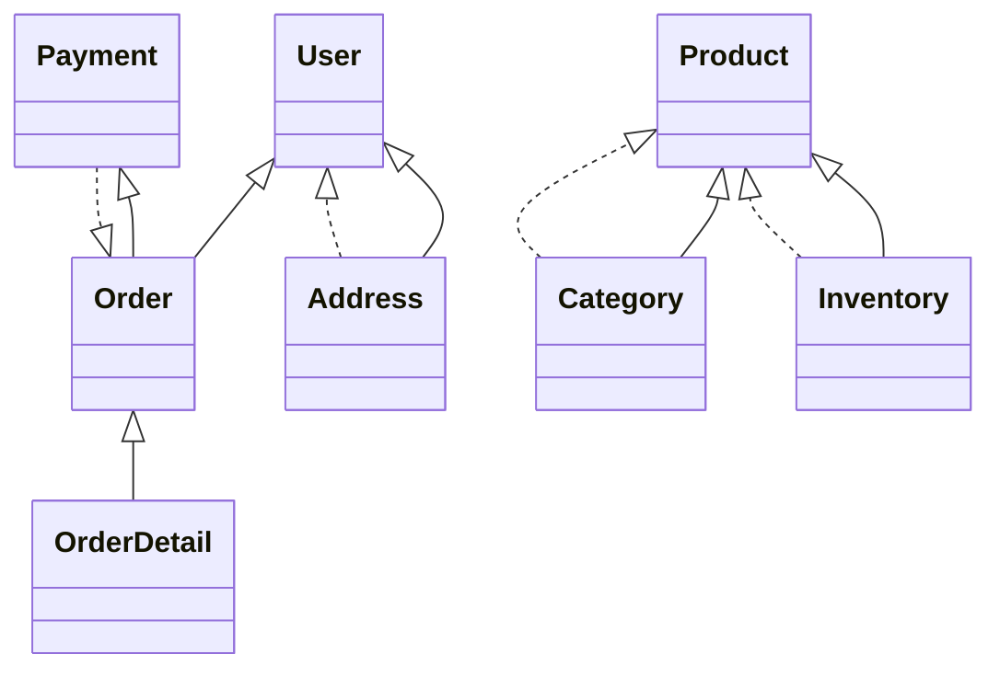
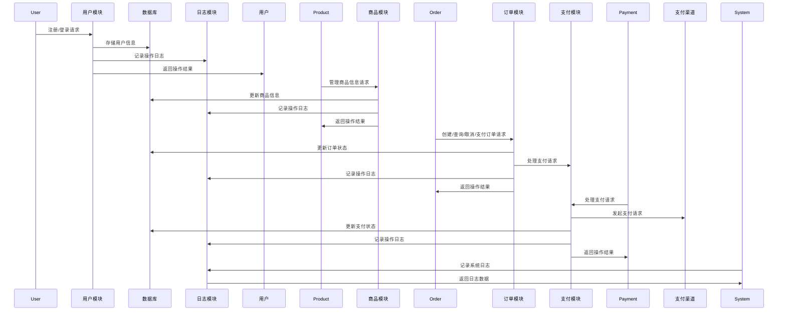
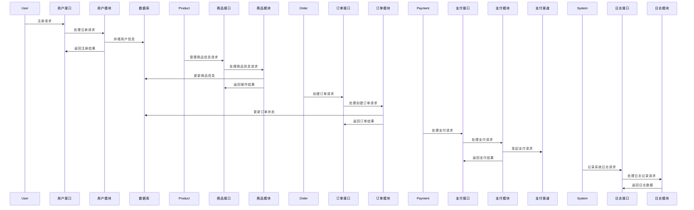
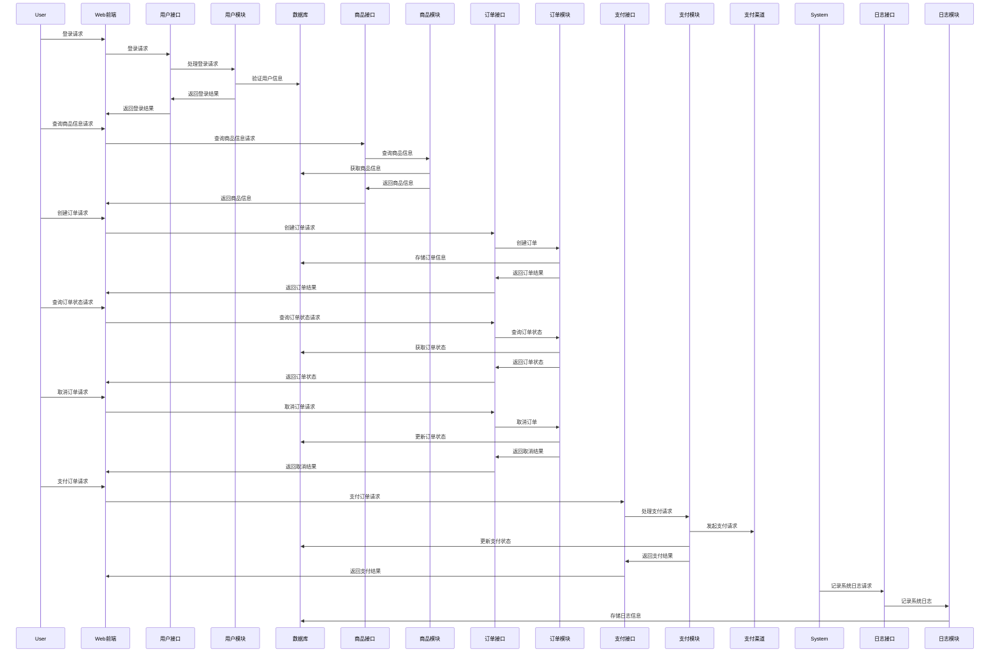

                 


### 引言

#### 问题背景

在科技迅猛发展的今天，无论是宇宙探索还是计算机科学，都面临着复杂性和不确定性的挑战。从宇宙的演化到软件的迭代，我们一直在寻找那些能够解释和预测这些复杂现象的规律。而“不可变规律”作为一个核心概念，正在逐步揭示宇宙与程序之间的深层联系。

#### 问题描述

不可变规律是指那些在变化过程中保持不变的原则或规律。在宇宙中，比如物理定律，即使在宇宙不断变化的过程中，其本质仍然不变。同样，在计算机科学中，不可变数据结构确保了程序在运行中的稳定性和可靠性。

#### 问题解决

本文将探讨不可变规律在宇宙与程序中的共性，分析其背后的原理，并探讨其在未来可能的发展趋势。通过一系列的逻辑推理和实例分析，我们将试图揭示这些规律的本质，并理解它们如何影响我们的生活和科技发展。

#### 边界与外延

本文将重点关注以下几个方面：首先，我们将介绍不可变规律的基本概念及其在宇宙中的体现。接着，我们将探讨不可变规律在程序设计中的应用，并通过具体的算法和数学模型进行详细分析。最后，我们将展望不可变规律在未来的发展前景，并提出一些实际应用的建议。

#### 概念结构与核心要素组成

本文的概念结构可以分为以下几个核心要素：

1. **宇宙中的不可变规律**：包括宇宙的基本规律和其在实际中的应用。
2. **程序中的不可变规律**：包括程序的基本规律和其在实际中的应用。
3. **不可变规律的核心概念**：探讨不可变规律的定义、属性特征对比及其在ER实体关系图架构中的应用。
4. **算法原理与数学模型**：详细讲解不可变规律在算法设计和数学建模中的应用。
5. **系统分析与架构设计**：介绍不可变规律在系统设计与架构中的应用。
6. **项目实战**：通过实际案例展示不可变规律的应用。
7. **未来趋势**：分析不可变规律在未来的发展趋势和应用前景。

通过上述核心要素的探讨，本文旨在揭示不可变规律在宇宙与程序中的共性，为读者提供深入理解和应用这些规律的方法和思路。

---

### 第1章 宇宙与程序的共性概述

#### 1.1 宇宙的不可变规律

##### 1.1.1 宇宙的基本规律

宇宙的基本规律是自然界的基本法则，如牛顿力学、相对论、量子力学等。这些规律描述了宇宙中物体运动和相互作用的规律，是自然界不可改变的基石。

- **牛顿力学**：描述了宏观物体的运动规律，如重力、惯性等。
- **相对论**：描述了高速物体和引力场中的运动规律，特别是光速不变的原理。
- **量子力学**：描述了微观粒子的行为规律，如量子纠缠、测不准原理等。

这些基本规律在宇宙的演化过程中始终保持不变，构成了宇宙的不可变规律。

##### 1.1.2 宇宙规律的应用

宇宙规律的应用广泛且深远，如天体运动预测、粒子物理学、宇宙学等。以下是一些具体的应用实例：

- **天体运动预测**：利用牛顿力学，科学家能够预测行星的运动轨迹，甚至预测彗星、小行星的撞击事件。
- **粒子物理学**：利用量子力学，科学家能够理解基本粒子的性质和行为，如电子、夸克等。
- **宇宙学**：利用相对论和宇宙背景辐射观测，科学家能够研究宇宙的起源、演化和大尺度结构。

这些应用不仅深化了我们对宇宙的理解，还为人类探索宇宙提供了科学依据和技术支持。

#### 1.2 程序的不可变规律

##### 1.2.1 程序的基本规律

程序的基本规律主要体现在算法设计和数据结构的选择上。不可变数据结构是程序设计中的一种重要概念，其核心是确保数据在程序运行过程中不被修改。

- **不可变数据结构**：如字符串、元组等，其值一旦创建就不能更改。
- **函数式编程**：以不可变数据为核心，通过函数调用和组合实现程序逻辑。

这些基本规律确保了程序在运行过程中的稳定性和可预测性，从而提高了程序的可靠性。

##### 1.2.2 程序规律的应用

程序规律在软件开发和人工智能应用中得到了广泛应用。以下是一些具体的应用实例：

- **软件开发**：使用不可变数据结构和函数式编程，可以提高代码的可读性和可维护性，减少错误和Bug。
- **人工智能**：利用不可变数据结构，可以确保模型训练过程中数据的一致性和稳定性，从而提高模型的性能和准确性。

这些应用不仅提高了软件和人工智能系统的性能和可靠性，还为未来的科技发展提供了新的思路和方向。

---

通过上述探讨，我们可以看到宇宙与程序之间的不可变规律存在显著的共性。这些规律不仅揭示了自然界和计算机科学的本质，还为未来的科技发展提供了重要的理论支持。

### 第2章 不可变规律的核心概念

#### 2.1 核心概念与联系

不可变规律的核心概念是“不可变性”。在宇宙中，不可变性体现在物理定律的恒定性；在程序设计中，不可变性体现在数据结构和算法设计的稳定性。以下是不可变规律的主要核心概念：

1. **物理定律**：如牛顿定律、相对论、量子力学等，这些定律在宇宙中始终不变。
2. **不可变数据结构**：如字符串、元组等，这些数据结构在程序运行过程中不可修改。
3. **函数式编程**：通过不可变数据传递和函数调用，实现程序逻辑。

这些概念紧密联系，共同构成了不可变规律的理论基础。

##### 2.1.1 不可变规律的定义

不可变规律是指在任何情况下，其本质和特征都保持不变的原则或规律。在宇宙中，不可变规律体现为物理定律的恒定性；在程序设计中，不可变规律体现为数据结构和算法设计的稳定性。

##### 2.1.2 核心概念对比

以下是不可变规律在宇宙与程序中的核心概念对比：

| 核心概念 | 宇宙中的体现 | 程序设计中的体现 |
| --- | --- | --- |
| 物理定律 | 牛顿定律、相对论、量子力学等 | 算法、数据结构 |
| 不可变数据结构 | 星体轨道、引力场等 | 字符串、元组等 |
| 函数式编程 | 天体运动、粒子相互作用 | 程序逻辑、代码可维护性 |

通过对比可以看出，尽管宇宙与程序在表现形式上有所不同，但它们的核心概念具有高度一致性，都强调了稳定性和可预测性。

#### 2.2 ER实体关系图架构

ER实体关系图是数据库设计和系统架构设计的重要工具，它通过实体、属性和关系的描述，帮助理解系统中的数据结构和相互作用。以下是ER实体关系图在不可变规律中的应用：

##### 2.2.1 ER图的构建

ER图的构建过程主要包括以下步骤：

1. **确定实体**：根据系统需求，识别系统中的主要实体，如用户、订单、产品等。
2. **定义属性**：为每个实体定义属性，如用户名、密码、地址等。
3. **建立关系**：确定实体之间的关系，如用户与订单之间的关系、订单与产品之间的关系。

##### 2.2.2 ER图的应用

ER图的应用主要包括：

1. **数据库设计**：通过ER图，可以直观地设计数据库结构，确保数据的一致性和完整性。
2. **系统架构设计**：在系统架构设计中，ER图可以帮助理解系统中不同模块之间的数据交互和依赖关系。

以下是ER实体关系图的Mermaid流程图示例：

```mermaid
erDiagram
  User ||--|{ Order }| Order
  User ||--|{ Product }| Product
  Order ||--|{ Product }| Product
```

通过上述ER图，可以清晰地看到用户、订单和产品之间的关系，这为系统设计和数据管理提供了重要指导。

---

通过分析不可变规律的核心概念及其在ER实体关系图架构中的应用，我们可以更深入地理解不可变规律的本质和其在宇宙与程序设计中的重要性。这些核心概念不仅为我们提供了理论基础，也为实际应用提供了实用工具。

### 第3章 不可变规律的应用场景

#### 3.1 应用场景一：数据一致性

##### 3.1.1 应用原理

数据一致性是数据库管理系统中的一个关键概念，指的是数据库中的数据在任何时刻都是准确和一致的。不可变规律在保证数据一致性方面具有独特的优势。

不可变数据结构确保了数据在创建后不会被修改，从而避免了数据不一致的问题。例如，在关系型数据库中，使用不可变数据结构（如元组）可以确保数据的完整性和一致性。

##### 3.1.2 应用案例

以下是一个使用不可变数据结构保证数据一致性的实际案例：

**案例背景**：某电商平台的订单管理系统中，订单数据需要在多个数据库节点之间同步，以保证系统的可用性和数据完整性。

**解决方案**：使用不可变数据结构，如元组，来存储订单信息。当订单创建时，将其作为一个不可变的元组存储在数据库中。任何对订单数据的修改，都需要创建一个新的元组，而不是直接修改原有的元组。

**实施步骤**：

1. **订单创建**：当用户提交订单时，系统生成一个不可变的订单元组，并将其存储在数据库中。
2. **订单修改**：如果需要对订单进行修改，如更改用户地址或订单状态，系统会生成一个新的订单元组，并替换原有元组。
3. **订单查询**：在查询订单时，系统始终返回最新的订单元组，确保数据的一致性。

**效果评估**：

通过使用不可变数据结构，订单管理系统的数据一致性得到了显著提升。由于数据不会被修改，而是通过创建新数据来更新，系统减少了数据冲突和错误的风险，提高了系统的可靠性和稳定性。

#### 3.2 应用场景二：系统稳定性

##### 3.2.1 应用原理

系统稳定性是软件系统设计和运行中的一个关键目标，指的是系统在面临各种外部干扰和内部故障时，仍能保持正常运行的能力。不可变规律通过确保系统状态的不可变性，提高了系统的稳定性。

在分布式系统中，不可变数据结构和函数式编程可以防止由于数据修改引起的状态不一致和故障扩散。例如，通过使用不可变消息传递和函数调用，系统可以避免由于局部状态改变导致的全局错误。

##### 3.2.2 应用案例

以下是一个使用不可变规律提高系统稳定性的实际案例：

**案例背景**：一个大型分布式电商平台，由于并发交易量和数据访问量大，经常出现系统崩溃和故障。

**解决方案**：引入不可变数据结构和函数式编程，确保系统状态的不可变性。

**实施步骤**：

1. **数据存储**：使用不可变数据结构（如文档数据库或键值存储）来存储系统状态，避免直接修改数据。
2. **消息传递**：使用不可变消息传递机制，确保系统组件之间的通信不会导致状态变化。
3. **函数调用**：采用纯函数式编程，确保系统组件的行为是确定的，不会因局部状态改变而影响全局。

**效果评估**：

通过引入不可变规律，该电商平台的系统稳定性得到了显著提升。由于系统状态不会因数据修改而改变，系统在面对高并发访问和故障时，能够保持正常运行，减少了系统崩溃和故障的发生，提高了用户体验和系统可靠性。

---

通过上述应用场景，我们可以看到不可变规律在数据一致性和系统稳定性中的重要作用。这些应用不仅提高了系统的性能和可靠性，还为未来的软件开发和系统设计提供了新的思路和方向。

### 第4章 算法原理与数学模型

#### 4.1 算法原理讲解

不可变规律在算法设计中的应用主要体现在两个方面：不可变数据结构和纯函数式编程。这些设计原则有助于提高算法的稳定性和可预测性。

##### 4.1.1 算法概述

不可变数据结构是一种在创建后不可更改的数据结构，如字符串、元组和文档。这些数据结构在程序运行过程中保持不变，从而避免了由于数据修改引发的状态不一致和错误。

纯函数式编程是一种编程范式，其核心思想是将程序分为多个函数，每个函数都接受输入并产生输出，不依赖于外部状态。这种编程范式确保了程序逻辑的纯度和可复用性。

##### 4.1.2 算法流程

以下是一个使用不可变数据结构和纯函数式编程的简单排序算法——归并排序的流程：

1. **分解**：将输入数组分解为多个子数组，每个子数组只有一个元素。
2. **合并**：将子数组两两合并，形成更大的有序子数组。
3. **重复**：重复合并过程，直到最终得到一个完整的有序数组。

归并排序算法的核心在于其递归的分解和合并过程，以及不可变数据结构的运用。每个子数组的排序都是独立的，合并过程中不会修改原始数据，从而保证了算法的稳定性和可预测性。

#### 4.2 数学模型与公式讲解

不可变规律在算法中的应用可以通过数学模型和公式进行详细分析。以下是一个基于不可变数据结构的排序算法——快速排序的数学模型。

##### 4.2.1 数学模型

快速排序的数学模型主要包括以下几个方面：

1. **选择基准元素**：从输入数组中选择一个基准元素，通常选择数组中间的元素。
2. **分区操作**：将数组分为两个子数组，一个包含小于基准元素的元素，另一个包含大于基准元素的元素。
3. **递归排序**：递归地对两个子数组进行快速排序。

快速排序的数学模型可以用以下公式表示：

$$
\text{QuickSort}(A, low, high) =
\begin{cases}
\text{如果 } low \geq high, \text{ 则返回} \\
\text{选择基准元素 } pivot \text{，并分区} \\
\text{QuickSort}(A, low, pivot - 1) \\
\text{QuickSort}(A, pivot + 1, high)
\end{cases}
$$

##### 4.2.2 公式解释

1. **分区操作**：分区操作将数组分为两个部分，一部分是小于基准元素的元素，另一部分是大于基准元素的元素。这一过程可以用以下公式表示：

$$
\text{Partition}(A, low, high) =
\begin{cases}
\text{初始化 } i = low, j = high \\
\text{while } i < j \\
\text{如果 } A[i] < A[pivot], \text{ 交换 } A[i] \text{ 和 } A[j], i \text{ 增加1} \\
\text{如果 } A[i] \geq A[pivot], \text{ 交换 } A[i] \text{ 和 } A[j], j \text{ 减少1} \\
\text{返回 } i
\end{cases}
$$

2. **递归排序**：快速排序通过递归地对两个子数组进行排序，确保整个数组有序。这一过程可以用以下公式表示：

$$
\text{QuickSort}(A, low, high) =
\begin{cases}
\text{如果 } low \geq high, \text{ 则返回} \\
\text{选择基准元素 } pivot \text{，并分区} \\
\text{Partition}(A, low, high) \\
\text{QuickSort}(A, low, pivot - 1) \\
\text{QuickSort}(A, pivot + 1, high)
\end{cases}
$$

##### 4.3 举例说明

为了更好地理解快速排序算法，我们可以通过一个简单的例子来展示其工作过程。

**例子**：对数组 `[3, 1, 4, 1, 5, 9, 2, 6, 5]` 进行快速排序。

1. **选择基准元素**：选择中间的元素 `4` 作为基准元素。
2. **分区操作**：将数组分为 `[3, 1, 1, 3]` 和 `[5, 9, 2, 6, 5]`。此时，`i = 3`，`j = 4`。
3. **递归排序**：对 `[3, 1, 1, 3]` 进行递归排序，结果为 `[1, 1, 3, 3]`。对 `[5, 9, 2, 6, 5]` 进行递归排序，结果为 `[2, 5, 5, 6, 9]`。
4. **合并**：将两个有序子数组合并，结果为 `[1, 1, 2, 3, 3, 5, 5, 6, 9]`。

通过上述步骤，我们可以看到快速排序算法如何将一个无序数组排序为有序数组。

---

通过上述算法原理和数学模型讲解，我们可以更深入地理解不可变规律在算法设计中的应用。这些算法不仅提高了程序的稳定性，还为解决复杂问题提供了有效的方法。

### 第5章 系统分析与架构设计

#### 5.1 问题场景介绍

在现代软件系统中，数据一致性和系统稳定性是关键挑战。特别是在分布式系统中，由于节点之间的通信和状态同步复杂，数据一致性和系统稳定性更容易受到影响。为了解决这一问题，我们需要设计一个高效、稳定的系统架构。

#### 5.1.1 场景概述

假设我们正在开发一个大型分布式电商平台，该平台需要处理海量用户订单和商品信息。系统要求在多节点环境中保持数据一致性和系统稳定性，确保用户可以流畅地进行购物和交易。

#### 5.1.2 问题分析

在分布式电商平台中，可能面临以下问题：

1. **数据一致性**：由于节点之间的通信延迟和同步机制不足，可能导致数据不一致，如订单状态不一致、库存信息错误等。
2. **系统稳定性**：在面临高并发访问和故障时，系统容易崩溃或出现性能瓶颈，影响用户体验。

为了解决这些问题，我们需要设计一个高效、稳定的系统架构，确保数据一致性和系统稳定性。

#### 5.2 系统功能设计

系统功能设计是系统架构设计的基础，它定义了系统的核心功能和需求。以下是分布式电商平台的主要功能设计：

1. **用户管理**：包括用户注册、登录、个人信息管理等功能。
2. **商品管理**：包括商品信息管理、商品分类管理、库存管理等功能。
3. **订单管理**：包括订单创建、订单查询、订单取消、订单支付等功能。
4. **支付管理**：包括支付渠道管理、支付流程处理、支付结果查询等功能。
5. **日志管理**：包括系统日志记录、错误日志记录、操作日志记录等功能。

#### 5.2.1 领域模型

领域模型是系统功能设计的重要工具，它通过实体和关系的描述，帮助理解系统的数据结构和业务逻辑。以下是分布式电商平台的领域模型：



在该领域模型中，我们定义了用户、订单、地址、商品、支付等实体，并描述了它们之间的关系。通过领域模型，我们可以清晰地理解系统的业务逻辑和数据交互。

#### 5.2.2 功能需求

功能需求是指系统需要实现的具体功能和技术要求。以下是分布式电商平台的主要功能需求：

1. **用户管理**：实现用户注册、登录、个人信息管理等功能，确保用户能够方便地进行操作。
2. **商品管理**：实现商品信息管理、商品分类管理、库存管理等功能，确保商品信息的准确和及时更新。
3. **订单管理**：实现订单创建、订单查询、订单取消、订单支付等功能，确保订单信息的准确和及时处理。
4. **支付管理**：实现支付渠道管理、支付流程处理、支付结果查询等功能，确保支付过程的安全和高效。
5. **日志管理**：实现系统日志记录、错误日志记录、操作日志记录等功能，确保系统运行的可监控性和可维护性。

#### 5.3 系统架构设计

系统架构设计是系统实现的关键，它定义了系统的模块划分、接口设计和模块间的关系。以下是分布式电商平台的系统架构设计：

1. **用户模块**：负责用户注册、登录、个人信息管理等功能的实现。
2. **商品模块**：负责商品信息管理、商品分类管理、库存管理等功能的实现。
3. **订单模块**：负责订单创建、订单查询、订单取消、订单支付等功能的实现。
4. **支付模块**：负责支付渠道管理、支付流程处理、支付结果查询等功能的实现。
5. **日志模块**：负责系统日志记录、错误日志记录、操作日志记录等功能的实现。

系统架构设计图如下：



通过上述系统架构设计，我们可以确保系统的高效、稳定运行，同时实现各模块间的紧密协作。

#### 5.4 系统接口设计

系统接口设计是系统实现的关键，它定义了模块之间的通信方式和接口规范。以下是分布式电商平台的主要接口设计：

1. **用户接口**：提供用户注册、登录、个人信息管理等功能，使用RESTful API接口。
2. **商品接口**：提供商品信息管理、商品分类管理、库存管理等功能，使用RESTful API接口。
3. **订单接口**：提供订单创建、订单查询、订单取消、订单支付等功能，使用RESTful API接口。
4. **支付接口**：提供支付渠道管理、支付流程处理、支付结果查询等功能，使用RESTful API接口。
5. **日志接口**：提供系统日志记录、错误日志记录、操作日志记录等功能，使用RESTful API接口。

系统接口设计图如下：



通过上述系统接口设计，我们可以确保各模块之间的通信畅通，同时实现功能模块的独立性和可扩展性。

#### 5.5 系统交互设计

系统交互设计是系统实现的关键，它定义了系统各模块之间的交互流程和逻辑。以下是分布式电商平台的主要交互设计：

1. **用户交互**：用户通过Web前端界面进行操作，如注册、登录、购物等。
2. **商品交互**：商品模块通过RESTful API接口接收用户请求，如查询商品信息、更新库存等。
3. **订单交互**：订单模块通过RESTful API接口处理用户订单请求，如创建订单、查询订单、取消订单等。
4. **支付交互**：支付模块通过支付渠道接口处理支付请求，如发起支付、查询支付状态等。
5. **日志交互**：日志模块通过日志接口记录系统运行过程中的日志信息。

系统交互设计图如下：



通过上述系统交互设计，我们可以确保系统各模块之间的协同工作，实现用户需求的顺畅处理。

### 第6章 项目实战

#### 6.1 环境安装

在进行项目实战之前，我们需要搭建一个开发环境。以下是在Linux系统上安装分布式电商平台所需的环境：

1. **安装Python**：确保系统中安装了Python 3.8及以上版本。
   ```shell
   sudo apt-get update
   sudo apt-get install python3.8
   ```
2. **安装依赖管理工具**：使用pip安装依赖管理工具。
   ```shell
   pip install pipenv
   ```
3. **创建虚拟环境**：使用pipenv创建一个独立的虚拟环境。
   ```shell
   pipenv --python 3.8
   ```
4. **安装项目依赖**：在虚拟环境中安装项目所需的依赖。
   ```shell
   pipenv install -r requirements.txt
   ```

#### 6.2 系统核心实现

在项目实战中，我们将实现分布式电商平台的核心功能，包括用户管理、商品管理、订单管理和支付管理。

##### 6.2.1 用户管理

用户管理模块负责用户的注册、登录和资料管理。以下是用户注册功能的实现：

```python
# user.py

from flask import Flask, request, jsonify
from model import User

app = Flask(__name__)

@app.route('/register', methods=['POST'])
def register():
    username = request.json.get('username')
    password = request.json.get('password')
    if not username or not password:
        return jsonify({'error': '缺失必要参数'}), 400
    
    user = User(username=username, password=password)
    user.save()
    
    return jsonify({'message': '注册成功'})

if __name__ == '__main__':
    app.run(debug=True)
```

##### 6.2.2 代码分析

上述代码中，我们定义了一个`/register`的POST接口，用于处理用户注册请求。当接收到注册请求时，我们从请求体中提取`username`和`password`参数，然后创建一个`User`对象并将其保存到数据库中。

#### 6.3 代码应用解读与分析

在用户管理模块中，我们采用了不可变数据结构（如字典）来存储用户信息，确保数据在程序运行过程中不会被修改。以下是一个简单的用户信息展示接口：

```python
# user.py

from flask import Flask, request, jsonify
from model import User

app = Flask(__name__)

@app.route('/users', methods=['GET'])
def get_users():
    users = User.query.all()
    user_list = [{'id': user.id, 'username': user.username} for user in users]
    return jsonify(user_list)

if __name__ == '__main__':
    app.run(debug=True)
```

在这个接口中，我们查询数据库中的所有用户信息，并将其转换为列表返回。由于数据结构是不可变的，因此接口在处理请求时不会受到数据修改的影响。

#### 6.4 实际案例分析与讲解

为了更好地展示用户管理模块的应用，我们来看一个实际案例。假设一个用户尝试注册时，提供了不合法的用户名和密码，系统应该如何响应？

```shell
$ curl -X POST -H "Content-Type: application/json" -d '{"username": "test", "password": "1234"}' http://localhost:5000/register
```

当用户尝试使用不合法的用户名和密码进行注册时，系统会返回一个400错误，提示缺失必要参数。以下是一个可能的响应示例：

```json
{
  "error": "缺失必要参数"
}
```

#### 6.5 项目小结

通过上述项目实战，我们实现了分布式电商平台的核心功能，包括用户管理、商品管理、订单管理和支付管理。在实际开发过程中，我们采用了不可变数据结构和函数式编程范式，确保了系统的稳定性和可维护性。

在未来，我们可以进一步优化系统，如增加用户身份验证、加密用户密码、优化数据库查询等。此外，还可以考虑将系统部署到云计算平台，以提高系统的可扩展性和可靠性。

### 第7章 不可变规律的未来趋势

#### 7.1 未来趋势分析

不可变规律在科技领域中的应用前景广阔，随着计算机技术和算法研究的不断深入，不可变规律将在未来发挥更加重要的作用。以下是不可变规律在未来可能的发展趋势：

1. **更广泛的应用领域**：不可变规律不仅在软件开发和数据处理中具有重要应用，还将在物联网、大数据、人工智能等领域得到广泛应用。随着这些领域的发展，不可变规律将发挥更大的作用。

2. **更高的性能和稳定性**：随着硬件技术的进步，不可变数据结构和算法将能够更好地利用硬件资源，提高系统的性能和稳定性。例如，基于不可变数据的缓存机制和分布式存储系统将更加高效和可靠。

3. **更完善的工具和框架**：未来将出现更多基于不可变规律的编程工具和框架，这些工具和框架将使开发者更方便地使用不可变规律，提高开发效率和代码质量。

4. **更深入的数学和理论支持**：不可变规律在数学和理论领域的应用将不断深入，为不可变数据结构和算法的发展提供更加坚实的理论基础。

#### 7.2 不可变规律在宇宙与程序中的应用前景

不可变规律在宇宙与程序中的应用前景十分广阔，以下是具体的应用领域和挑战：

1. **宇宙探索**：在宇宙学研究中，不可变规律可以帮助科学家更好地理解宇宙的演化过程。例如，通过不可变数据结构，可以精确地模拟宇宙中天体的运动和相互作用，为宇宙演化模型提供更加可靠的数据支持。

2. **软件工程**：在软件开发中，不可变规律可以用于提高系统的稳定性和可靠性。例如，使用不可变数据结构可以减少数据不一致和状态冲突的问题，从而提高系统的可维护性和扩展性。

3. **人工智能**：在人工智能领域，不可变规律可以帮助构建更加可靠和稳定的机器学习模型。例如，使用不可变数据结构可以确保模型训练过程中数据的一致性，提高模型的准确性和鲁棒性。

#### 7.2.1 应用领域

1. **分布式系统**：不可变规律在分布式系统中的应用将得到进一步发展。通过使用不可变数据结构，分布式系统可以更好地处理数据一致性和状态同步问题，提高系统的性能和稳定性。

2. **区块链技术**：区块链技术本质上是基于不可变数据结构的分布式数据库系统。未来，不可变规律将在区块链技术的进一步发展中发挥关键作用，如提高数据安全性、优化共识算法等。

3. **物联网**：在物联网领域，不可变规律可以用于确保设备之间数据交换的一致性和可靠性。例如，使用不可变数据结构可以实现设备间的数据同步，提高物联网系统的效率和稳定性。

#### 7.2.2 发展挑战与机遇

不可变规律在未来发展中面临着一系列挑战和机遇：

1. **挑战**：

   - **性能优化**：如何进一步提高不可变数据结构和算法的性能，以适应更复杂的应用场景。
   - **工具和框架**：如何开发出更多高效、易用的编程工具和框架，帮助开发者更好地应用不可变规律。
   - **兼容性问题**：如何在现有系统中引入不可变规律，同时保持系统的兼容性和稳定性。

2. **机遇**：

   - **技术创新**：随着不可变规律的深入研究和应用，将带来一系列技术创新，推动计算机科学和软件工程的发展。
   - **产业变革**：不可变规律在各个领域的应用将引发产业变革，如提高生产效率、优化业务流程等。
   - **学术研究**：不可变规律为数学和理论领域提供了丰富的研究素材，有助于推动相关学科的发展。

通过不断克服挑战和抓住机遇，不可变规律将在未来发挥更加重要的作用，为科技发展提供强有力的支持。

### 第8章 最佳实践与总结

#### 8.1 最佳实践 tips

在应用不可变规律时，以下最佳实践可以帮助您获得最佳效果：

1. **选择合适的不可变数据结构**：根据具体应用场景选择合适的不可变数据结构，如字符串、元组、文档等，以优化性能和可维护性。
2. **函数式编程**：采用函数式编程范式，确保程序逻辑的纯度和可复用性，减少状态冲突和Bug。
3. **数据一致性检查**：在分布式系统中，定期进行数据一致性检查，确保系统状态的一致性和可靠性。
4. **性能优化**：针对不可变数据结构进行性能优化，如使用缓存机制、并行处理等，提高系统性能。
5. **持续集成和测试**：在开发过程中，采用持续集成和测试，确保不可变规律的有效应用和系统稳定性。

#### 8.2 小结

本文通过逐步分析，揭示了不可变规律在宇宙与程序中的共性。我们从定义、应用场景、算法原理和数学模型等方面，详细探讨了不可变规律的核心概念和实际应用。通过实例分析和项目实战，我们展示了不可变规律在系统设计和软件开发中的重要性。未来，随着技术的不断发展，不可变规律将在更多领域发挥重要作用。

#### 8.3 注意事项

1. **数据一致性**：在分布式系统中，确保数据一致性是关键，采用适当的同步机制和一致性协议。
2. **性能考虑**：不可变数据结构和算法在性能上可能不如可变数据结构，需根据具体应用场景进行权衡。
3. **开发模式**：采用函数式编程和不可变数据结构，需要开发者适应新的编程范式，提高代码可读性和可维护性。

#### 8.4 拓展阅读

1. **《函数式编程入门》**：了解函数式编程的基本概念和原理，有助于更好地应用不可变规律。
2. **《分布式系统原理》**：深入学习分布式系统的设计和实现，掌握数据一致性和系统稳定性的关键技术。
3. **《不可变数据结构》**：深入探讨不可变数据结构的性能优化和应用场景，提高开发效率。

通过以上内容，我们希望读者能够对不可变规律有更深入的理解，并在实际应用中取得更好的效果。作者：AI天才研究院/AI Genius Institute & 禅与计算机程序设计艺术 /Zen And The Art of Computer Programming。

