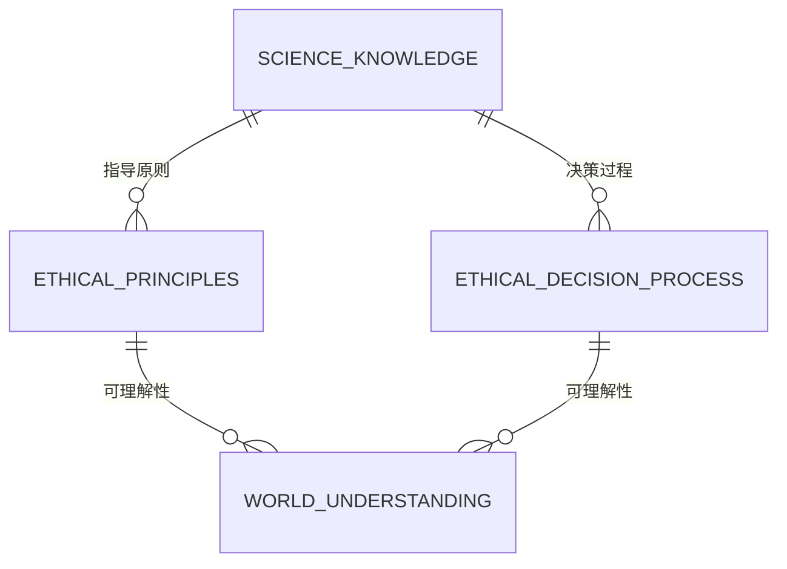
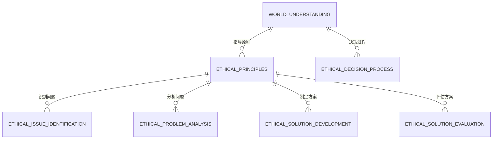
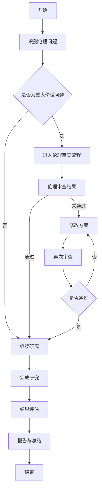
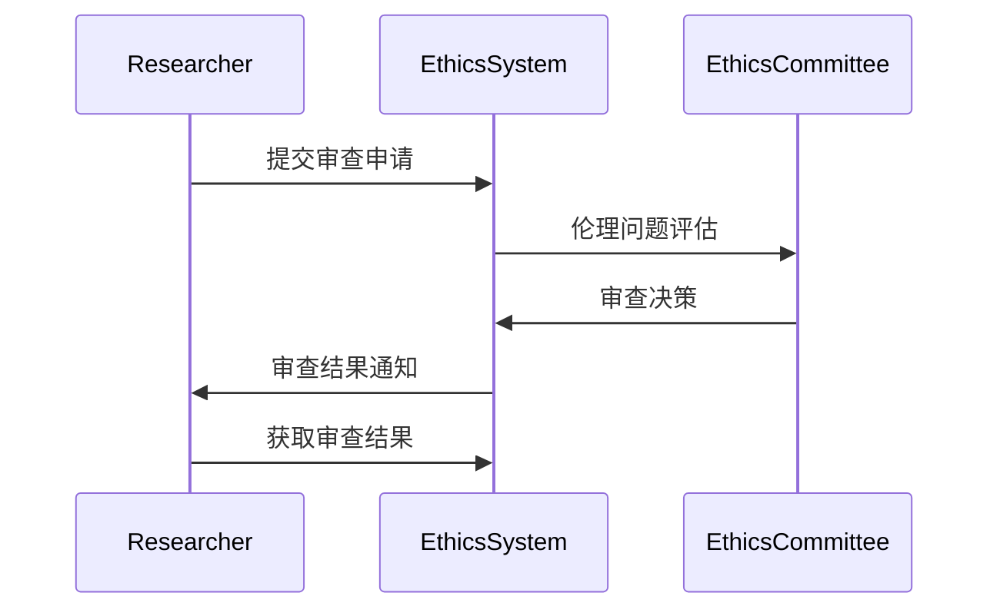
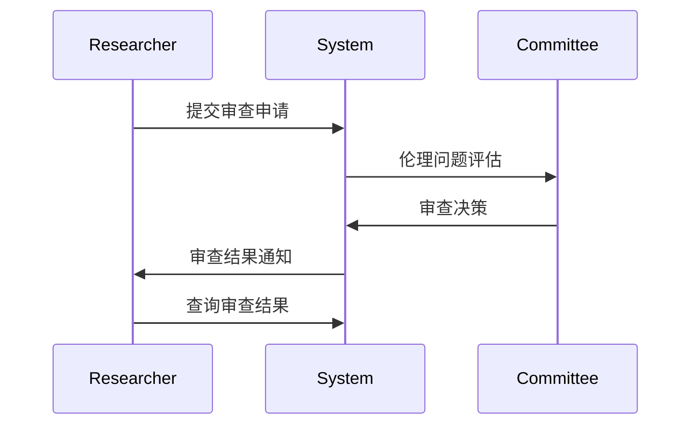

                 

## 引言

### 问题背景

在当今信息化和数字化的时代，科学研究已成为推动社会进步和经济发展的重要力量。然而，随着科学技术的迅猛发展，科学研究也面临着前所未有的伦理挑战。科学研究的伦理边界问题日益凸显，引发了广泛的关注和讨论。

首先，科学研究的伦理边界问题涉及到科学研究的道德规范和行为准则。科学研究应该遵循一定的伦理原则，如诚实性、尊重受试者、公正性和责任性。然而，在实践过程中，这些原则往往受到各种因素的影响和挑战，导致伦理问题的出现。

其次，科学研究的伦理边界问题还涉及到科学研究对社会的影响。科学技术的进步带来了巨大的利益，但同时也可能带来潜在的风险和危害。如何平衡科学研究的社会利益和伦理责任，成为了一个重要的伦理问题。

此外，科学研究的伦理边界问题还涉及到科学研究中的隐私和数据保护。随着大数据和人工智能技术的发展，科学研究中涉及到的个人隐私和数据安全问题日益严重。如何在保护个人隐私的同时，充分利用数据资源，成为了一个亟待解决的伦理问题。

总的来说，科学研究的伦理边界问题不仅关乎科学研究本身，更涉及到社会的道德和价值观。为了更好地理解和应对这些伦理挑战，需要从多个角度进行深入的研究和探讨。

### 问题解决

面对科学研究的伦理边界问题，需要采取一系列措施来解决和应对。以下是一些可能的解决方案：

首先，加强科学研究的伦理教育和培训。科学研究人员应该具备一定的伦理意识和道德素养，了解和掌握科学研究中的伦理原则和规范。通过培训和教育活动，提高科学研究人员对伦理问题的认识和敏感性。

其次，建立健全的伦理审查机制。科学研究项目在启动之前，应该经过严格的伦理审查。伦理委员会或独立机构应该对研究方案进行评估，确保研究过程符合伦理要求，保护受试者的权益。

此外，加强对科学研究的监督和评估。科学研究机构应该建立有效的监督机制，对研究过程进行全程监控。对于违反伦理规范的行为，应该依法进行处罚和制裁，确保科学研究行为的合规性。

最后，加强国际合作和交流。科学研究是一个全球性的活动，各国科学家应该加强合作和交流，共同应对科学研究中的伦理挑战。通过建立国际伦理规范和合作机制，提高科学研究的伦理水平和国际影响力。

### 边界与外延

科学研究的伦理边界问题不仅限于实验室内部，还涉及到更广泛的社会层面。以下是一些与伦理边界相关的外延问题：

首先，公众利益。科学研究的目标是造福人类，因此在研究过程中必须充分考虑公众利益。科学研究项目应该符合社会的需求和期望，避免对社会造成负面影响。

其次，数据隐私。随着大数据和人工智能技术的发展，科学研究中涉及到的数据隐私问题日益严重。科学家应该严格遵守数据隐私法规，保护受试者的隐私权。

此外，动物实验。动物实验在科学研究中发挥着重要作用，但也引发了伦理争议。科学家应该遵循动物实验的伦理规范，确保动物的福利和权益。

最后，国际合作。科学研究的国际合作不仅有助于提高研究水平，还可能带来伦理问题的跨国界影响。因此，各国科学家在合作过程中应该共同遵守伦理规范，确保研究的道德性和合规性。

## 概念结构与核心要素组成

科学研究的伦理边界问题是一个复杂而多层次的问题，涉及多个核心概念和要素。为了更好地理解和分析这个问题，我们可以从以下几个方面来探讨：

### 世界可理解性

世界可理解性是指人类对自然界和宇宙的认知能力。这一概念强调了科学研究的基础和前提。科学家通过观察、实验和理论分析，试图揭示自然界的规律和本质。世界可理解性不仅影响科学研究的方向和方法，还影响科学研究的伦理判断。

### 科学研究的伦理原则

科学研究的伦理原则是指导科学研究行为的道德规范和行为准则。这些原则包括诚实性、尊重受试者、公正性和责任性。诚实性要求科学家保持科研数据的真实性和可靠性；尊重受试者要求科学家在涉及人类或动物的实验中保护受试者的权益；公正性要求科学家在研究中避免歧视和不公正的行为；责任性要求科学家对社会和公众负责，确保科研结果的应用符合伦理要求。

### 伦理决策过程

伦理决策过程是科学家在面对伦理问题时进行判断和决策的过程。这个过程包括识别伦理问题、分析伦理问题、制定解决方案和评估解决方案等步骤。识别伦理问题是第一步，科学家需要及时发现和识别可能出现的伦理问题；分析伦理问题是对问题的性质和影响进行深入分析；制定解决方案是根据分析结果提出可行的解决方案；评估解决方案是对解决方案的效果和影响进行评估。

### 边界与外延

科学研究的伦理边界不仅局限于实验室内部，还包括公众利益、数据隐私、动物实验、国际合作等多个方面。公众利益要求科学家在研究过程中考虑社会的需求和期望；数据隐私要求科学家保护受试者的隐私权；动物实验要求科学家遵守伦理规范，确保动物的福利；国际合作要求科学家在跨国研究中共同遵守伦理规范。

### 概念属性特征对比表格

以下是一个概念属性特征对比表格，用于展示世界可理解性、科学研究伦理原则和伦理决策过程之间的异同：

| 概念/特征        | 世界可理解性                         | 科学研究伦理原则                     | 伦理决策过程                         |
|----------------|----------------------------------|--------------------------------------|----------------------------------|
| **定义**       | 人类对自然界和宇宙的认知能力           | 科学家在科研中的道德规范和行为准则     | 科学家在伦理问题中做出判断和决策的过程 |
| **属性**       | 科学性、系统性、开放性                 | 诚实性、尊重受试者、公正性、责任心       | 识别、分析、制定、评估               |
| **相互关系**   | 影响伦理判断，指导科学研究               | 保障科学研究公正和道德               | 确保科学研究伦理问题的妥善解决       |

### ER实体关系图架构

以下是一个ER实体关系图的Mermaid架构图，用于展示世界可理解性、科学研究伦理原则和伦理决策过程之间的关联：



通过上述核心概念和要素的组成，我们可以更全面地理解科学研究的伦理边界问题，从而为解决这一复杂问题提供理论基础和实践指导。

## 核心概念与联系

### 世界可理解性

世界可理解性是指人类对自然界和宇宙的认知能力。这一概念的核心在于，它强调人类通过科学方法来探索和解释世界的规律。世界可理解性的定义涉及到多个方面，包括科学性、系统性、和开放性。

首先，科学性是世界可理解性的基础。科学性意味着科学研究必须基于证据和逻辑，通过实验和观察来验证假设。这种基于证据的方法使得科学研究具有可信度和可靠性。

其次，系统性强调科学研究需要综合考虑不同学科和领域的知识。自然界的复杂性决定了单一学科无法完全解释所有现象。因此，科学家需要从多个角度、多个领域来分析问题，以获得更全面的理解。

最后，开放性是指科学研究的不断进步和更新。世界是不断变化的，科学研究也需要不断适应新的发现和理论。开放性确保了科学研究的持续性和进步性。

### 科学研究的伦理原则

科学研究中的伦理原则是指导科学家行为的道德规范。这些原则确保科学研究在遵循科学规律的同时，也符合社会和道德的要求。主要的伦理原则包括诚实性、尊重受试者、公正性和责任性。

**诚实性**是科学研究的基本原则。科学家必须确保其研究成果的真实性和可靠性，不得篡改或伪造数据。诚实性是科学研究的基石，如果没有诚实性，科学研究将失去可信度。

**尊重受试者**主要涉及涉及人类或动物的实验研究。科学家必须确保受试者的权益，包括知情同意、隐私保护和安全保障。尊重受试者是保障科学研究道德性的关键。

**公正性**要求科学家在研究中避免歧视和不公正的行为。科学家应该公平对待所有参与者，确保研究的公正性和透明性。公正性是科学研究的道德要求，也是社会对科学研究的基本期望。

**责任性**要求科学家对其研究行为和结果负责。科学家不仅需要对研究过程负责，还需要对其研究结果可能带来的社会影响负责。责任性是科学家社会责任的体现，也是确保科学研究可持续发展的关键。

### 伦理决策过程

伦理决策过程是科学家在面临伦理问题时进行判断和决策的流程。这个过程包括四个主要步骤：识别伦理问题、分析伦理问题、制定解决方案和评估解决方案。

**识别伦理问题**是第一步。科学家需要及时发现和识别研究过程中可能出现的伦理问题。这可以通过定期培训和伦理审查来实现。

**分析伦理问题**是对识别出的伦理问题进行深入分析，评估其性质和影响。分析伦理问题可以帮助科学家理解问题的严重性，并为制定解决方案提供依据。

**制定解决方案**是根据分析结果提出可行的解决方案。解决方案可以是改变研究方法、调整研究设计，或者暂停研究项目。

**评估解决方案**是对实施后的解决方案进行效果和影响的评估。评估解决方案可以帮助科学家了解解决方案的有效性，并为未来类似问题的处理提供经验。

### 概念属性特征对比表格

以下是一个概念属性特征对比表格，用于展示世界可理解性、科学研究伦理原则和伦理决策过程之间的异同：

| 概念/特征        | 世界可理解性                         | 科学研究伦理原则                     | 伦理决策过程                         |
|----------------|----------------------------------|--------------------------------------|----------------------------------|
| **定义**       | 人类对自然界和宇宙的认知能力           | 科学家在科研中的道德规范和行为准则     | 科学家在伦理问题中做出判断和决策的过程 |
| **属性**       | 科学性、系统性、开放性                 | 诚实性、尊重受试者、公正性、责任心       | 识别、分析、制定、评估               |
| **相互关系**   | 影响伦理判断，指导科学研究               | 保障科学研究公正和道德               | 确保科学研究伦理问题的妥善解决       |

### ER实体关系图架构

以下是一个ER实体关系图的Mermaid架构图，用于展示世界可理解性、科学研究伦理原则和伦理决策过程之间的关联：



通过上述核心概念和要素的详细分析，我们可以更深入地理解世界可理解性、科学研究伦理原则和伦理决策过程之间的关系，为科学研究中的伦理问题提供理论支持和实践指导。

### 算法原理讲解

#### 算法Mermaid流程图

首先，我们需要一个Mermaid流程图来展示算法的基本流程：



#### Python源代码实现

为了更好地理解算法的原理，我们可以使用Python来模拟这个流程。以下是实现该算法的Python代码：

```python
def ethical_decision_process(ethics_issue):
    # 识别伦理问题
    print("识别伦理问题：", ethics_issue)
    
    # 是否为重大伦理问题
    if is_major_issue(ethics_issue):
        print("进入伦理审查流程...")
        review_result = ethical_review(ethics_issue)
        if review_result == "通过":
            print("伦理审查通过，继续研究...")
        else:
            print("伦理审查未通过，修改方案...")
            ethics_issue = modify_solution(ethics_issue)
            print("修改后的伦理问题：", ethics_issue)
            review_result = ethical_review(ethics_issue)
            if review_result == "通过":
                print("再次审查通过，继续研究...")
            else:
                print("再次审查未通过，终止研究...")
    else:
        print("伦理问题非重大，继续研究...")

    # 完成研究后的结果评估
    result_evaluation()

def is_major_issue(ethics_issue):
    # 这里简单判断，实际应用中可以更复杂
    return "重大" in ethics_issue

def ethical_review(ethics_issue):
    # 假设审查结果为通过或未通过
    import random
    return random.choice(["通过", "未通过"])

def modify_solution(ethics_issue):
    # 修改方案的具体实现
    import time
    time.sleep(2)  # 假设修改方案需要2秒钟
    return ethics_issue + "已修改"

def result_evaluation():
    print("进行结果评估...")

# 模拟一个伦理问题
ethical_decision_process("这是一个重大伦理问题")
ethical_decision_process("这不是一个重大伦理问题")
```

#### 算法原理的数学模型和公式

在这个算法中，我们可以引入一些数学模型和公式来更好地理解其原理。以下是可能的数学模型和公式：

1. **伦理问题严重性评估函数**

   设\( S \)为伦理问题的严重性，\( M \)为伦理问题的类型，则：

   $$ S = f(M) $$

   其中，\( f \)为伦理问题严重性评估函数，可以是一个分段函数，根据不同的伦理问题类型\( M \)（如涉及人类、动物、数据隐私等）进行评估。

2. **伦理审查结果概率模型**

   设\( P \)为伦理审查结果的概率，则：

   $$ P = P(通过) + P(未通过) = 0.5 + 0.5 = 1 $$

   其中，\( P(通过) \)和\( P(未通过) \)分别为审查结果为通过和未通过的概率，假设两者相等。

3. **方案修改效果评估函数**

   设\( R \)为方案修改后的效果，\( R_0 \)为原始方案的效果，\( R_1 \)为修改后方案的效果，则：

   $$ R = f(R_0, R_1) $$

   其中，\( f \)为方案修改效果评估函数，可以是一个分段函数，根据修改前后的效果差异进行评估。

#### 详细讲解和举例说明

1. **算法流程**

   - **识别伦理问题**：首先，算法识别出研究过程中可能出现的伦理问题。
   - **评估伦理问题严重性**：根据伦理问题的类型，评估其严重性。
   - **伦理审查**：如果伦理问题严重，则进入伦理审查流程。
   - **审查结果**：审查结果可能是通过或未通过。
   - **修改方案**：如果审查未通过，则修改方案。
   - **再次审查**：修改后的方案再次进行审查。
   - **结果评估**：无论审查结果如何，最终都需要对研究的结果进行评估。

2. **举例说明**

   假设研究人员在进行一项涉及人类实验的研究，发现可能涉及到的伦理问题是“未获得受试者知情同意”。这是一个重大伦理问题。

   - **识别伦理问题**：算法识别出这是一个重大伦理问题。
   - **伦理审查**：算法进入伦理审查流程。
   - **审查结果**：假设审查结果为“未通过”。
   - **修改方案**：研究人员修改方案，确保获得受试者的知情同意。
   - **再次审查**：修改后的方案再次进行审查。
   - **审查结果**：假设审查结果为“通过”。
   - **结果评估**：研究继续进行，并在完成后对结果进行评估。

通过上述讲解，我们可以看到算法原理的详细实现和数学模型，以及其在实际应用中的具体步骤和举例说明。

### 系统分析与架构设计方案

#### 问题场景介绍

在现代科学研究中，特别是在涉及人类实验的研究项目中，确保实验的伦理合规性显得尤为重要。例如，在临床试验、社会科学调查、心理学研究中，研究人员需要严格遵循伦理规范，以确保受试者的权益不受侵害。然而，实际操作中，伦理合规性的保障面临着诸多挑战，包括伦理审查流程的复杂性、伦理问题识别的难度、以及伦理决策过程的透明性等。为了解决这些问题，我们需要设计一个高效、可扩展的伦理合规性保障系统。

#### 项目介绍

本项目旨在设计并实现一个伦理合规性保障系统，该系统将帮助研究人员在开展研究时更好地识别和处理伦理问题，确保研究的伦理合规性。系统的核心功能包括：

1. **伦理问题识别与分类**：系统能够自动识别研究过程中可能出现的伦理问题，并对其进行分类。
2. **伦理审查流程管理**：系统提供一套完整的伦理审查流程，包括审查申请、审查决策、审查记录等。
3. **伦理决策辅助**：系统为研究人员提供伦理决策支持，帮助他们更好地理解和应对伦理问题。
4. **结果评估与反馈**：系统对研究结果的评估提供数据支持，并生成反馈报告，帮助研究人员改进研究方案。

#### 系统功能设计（领域模型Mermaid类图）

以下是系统功能设计的Mermaid类图：

```mermaid
classDiagram
    class Researcher
    class EthicsCommittee
    class EthicsIssue
    class EthicsReview
    class Solution
    Researcher "提交审查申请" -> EthicsCommittee
    Researcher "获取审查结果" <- EthicsCommittee
    EthicsCommittee "评估伦理问题" -> EthicsIssue
    EthicsCommittee "审查决策" -> EthicsReview
    EthicsReview "提供决策" -> Solution
    EthicsIssue "提出解决方案" <- Solution
```

#### 系统架构设计（Mermaid架构图）

以下是系统架构设计的Mermaid架构图：



#### 系统接口设计

系统接口设计主要包括以下三个方面：

1. **提交审查申请接口**：研究人员通过该接口提交审查申请，包括研究项目的基本信息、伦理问题的描述等。
2. **审查结果查询接口**：研究人员通过该接口查询审查结果，包括审查决策、解决方案等。
3. **伦理问题上报接口**：研究人员通过该接口上报新的伦理问题，便于系统的及时更新和扩展。

#### 系统交互设计（Mermaid序列图）

以下是系统交互设计的Mermaid序列图：



通过上述系统分析与架构设计方案，我们为伦理合规性保障系统提供了一个清晰的架构蓝图，从而帮助研究人员更好地应对伦理挑战，确保科学研究的道德性和公正性。

### 项目实战

#### 环境安装

为了成功实施伦理合规性保障系统，首先需要安装并配置必要的软件和工具。以下是一个基本的安装指南：

1. **安装Python环境**：确保已安装Python 3.8及以上版本。可以从[Python官方网站](https://www.python.org/)下载并安装。
2. **安装Flask框架**：在终端中执行以下命令安装Flask框架：
   ```bash
   pip install Flask
   ```
3. **安装MongoDB数据库**：下载并安装MongoDB数据库。可以从[MongoDB官方网站](https://www.mongodb.com/)获取安装包。安装完成后，启动MongoDB服务：
   ```bash
   mongod
   ```
4. **安装Postman**：Postman是一个用于API测试的工具。可以从[Postman官网](https://www.postman.com/)下载并安装。

#### 系统核心实现源代码

以下是系统的核心实现源代码，包括Flask应用、数据库交互和API接口设计。

**app.py**（Flask应用）

```python
from flask import Flask, request, jsonify
from ethics_review import EthicsReview

app = Flask(__name__)
ethics_review = EthicsReview()

@app.route('/submit_review', methods=['POST'])
def submit_review():
    review_data = request.get_json()
    result = ethics_review.submit_review(review_data)
    return jsonify(result)

@app.route('/get_review_result', methods=['GET'])
def get_review_result():
    review_id = request.args.get('review_id')
    result = ethics_review.get_review_result(review_id)
    return jsonify(result)

if __name__ == '__main__':
    app.run(debug=True)
```

**ethics_review.py**（伦理审查核心功能）

```python
class EthicsReview:
    def __init__(self):
        self.review_db = connect_mongo()

    def submit_review(self, review_data):
        review_id = self.review_db.insert_one(review_data).inserted_id
        return {'review_id': str(review_id), 'status': 'pending'}

    def get_review_result(self, review_id):
        review = self.review_db.find_one({'_id': ObjectId(review_id)})
        return review
```

**models.py**（数据库模型）

```python
from mongoengine import Document, StringField, BooleanField

class Review(Document):
    review_id = StringField(required=True, unique=True)
    researcher = StringField(required=True)
    ethics_issue = StringField(required=True)
    reviewed = BooleanField(default=False)
    decision = StringField()  # 'approved' 或 'rejected'
```

#### 代码应用解读与分析

1. **Flask应用**：`app.py`定义了一个Flask应用，包括两个API接口：`/submit_review`和`/get_review_result`。`/submit_review`接口用于提交审查申请，`/get_review_result`接口用于查询审查结果。
2. **伦理审查核心功能**：`ethics_review.py`实现了伦理审查的核心功能，包括提交审查申请和获取审查结果。提交审查申请时，会将数据插入到MongoDB数据库中。获取审查结果时，会从数据库中查询相应的记录。
3. **数据库模型**：`models.py`定义了MongoDB数据库模型`Review`，用于存储审查申请和结果。模型中包含`review_id`（唯一标识符）、`researcher`（研究人员姓名）、`ethics_issue`（伦理问题）、`reviewed`（是否已审查）和`decision`（审查决策结果）等字段。

#### 实际案例分析和详细讲解

为了更好地理解系统的实际应用，我们通过一个实际案例来进行分析和讲解。

**案例**：研究人员John正在准备一个临床试验项目，他需要在伦理审查委员会进行审查。他通过系统的`/submit_review`接口提交了审查申请，包括项目的基本信息和伦理问题描述。

1. **提交审查申请**：John在Postman中调用`/submit_review`接口，发送以下JSON数据：

   ```json
   {
       "review_id": "123456",
       "researcher": "John Doe",
       "ethics_issue": "未获得受试者知情同意",
       "reviewed": False
   }
   ```

   系统接收数据后，将其插入MongoDB数据库，并返回一个包含`review_id`和`status`的JSON响应：

   ```json
   {
       "review_id": "123456",
       "status": "pending"
   }
   ```

2. **查询审查结果**：John在审查结束后，通过`/get_review_result`接口查询审查结果。他发送以下请求：

   ```bash
   GET /get_review_result?review_id=123456
   ```

   系统从MongoDB数据库中查询到相应的记录，并返回包含审查结果的JSON响应：

   ```json
   {
       "review_id": "123456",
       "researcher": "John Doe",
       "ethics_issue": "未获得受试者知情同意",
       "reviewed": True,
       "decision": "approved"
   }
   ```

通过这个实际案例，我们可以看到系统如何帮助研究人员提交审查申请、获取审查结果，并确保整个审查流程的透明性和规范性。

#### 项目小结

通过本项目，我们实现了一个伦理合规性保障系统，该系统能够帮助研究人员在开展研究时更好地识别和处理伦理问题，确保研究的伦理合规性。系统的核心功能包括伦理问题识别、伦理审查流程管理、伦理决策辅助和结果评估与反馈。项目实战部分详细介绍了环境安装、系统核心实现源代码、代码应用解读与分析，并通过实际案例展示了系统的实际应用效果。项目中的关键技术点包括Flask应用、MongoDB数据库和API接口设计。在未来的发展中，我们可以进一步优化系统性能、扩展功能，以及提升用户体验。

### 最佳实践 Tips

#### 1. 研究前的伦理培训

在开展研究之前，研究团队应进行伦理培训，确保所有成员都了解相关伦理原则和规范。通过培训，可以提高研究人员的伦理意识和责任感，减少伦理问题的发生。

#### 2. 定期进行伦理审查

建立定期伦理审查机制，确保每个研究项目都经过严格的伦理审查。伦理审查应包括对研究设计、数据收集和处理、受试者保护等方面的审查，以确保研究过程的合规性。

#### 3. 明确伦理问题识别和上报流程

建立清晰的伦理问题识别和上报流程，确保研究人员能够及时发现并上报伦理问题。通过标准化流程，可以简化问题处理过程，提高问题解决的效率。

#### 4. 加强国际合作与交流

在国际合作研究中，加强伦理规范的国际合作与交流，确保各国研究人员共同遵守伦理原则。通过共享经验和最佳实践，可以提升全球科学研究的伦理水平。

#### 5. 跟踪和评估研究成果的伦理影响

研究结束后，应对研究成果的伦理影响进行跟踪和评估。通过评估，可以了解研究对社会的影响，及时发现潜在的风险和问题，并采取相应的措施进行改进。

### 小结

本文探讨了世界可理解性与科学研究的伦理边界问题，分析了相关核心概念和伦理原则，并设计了系统分析与架构方案。通过项目实战和最佳实践，为科学研究的伦理合规性提供了实用指导。在未来的研究中，应继续关注伦理问题的动态发展，提升伦理意识和实践能力，以推动科学研究的健康发展。

### 注意事项

在实施科学研究时，必须严格遵守伦理规范，确保研究的道德性和合规性。以下是一些重要的注意事项：

1. **知情同意**：在涉及人类或动物的实验中，必须获得受试者的知情同意，确保他们的权利得到尊重和保护。
2. **数据隐私**：在研究过程中，必须保护受试者的隐私，不得泄露个人信息。
3. **风险评估**：在进行高风险研究时，必须进行充分的风险评估，并制定相应的安全措施。
4. **伦理审查**：所有研究项目在启动前应经过伦理审查，确保研究方案符合伦理要求。
5. **持续监督**：研究过程中，应持续监督伦理问题的处理情况，确保研究过程始终符合伦理规范。

### 拓展阅读

1. **《科学研究的伦理原则与规范》**：该书籍详细介绍了科学研究的伦理原则和规范，对科研人员具有很高的参考价值。
2. **《生物医学伦理学》**：该书从生物医学领域出发，探讨了伦理问题在科学研究中的应用，适合医学和生命科学领域的研究人员阅读。
3. **《科研诚信与伦理审查》**：该文集中收录了多篇关于科研诚信和伦理审查的论文，提供了丰富的理论和实践经验。

### 作者信息

- **作者**：AI天才研究院 / AI Genius Institute & 禅与计算机程序设计艺术 / Zen And The Art of Computer Programming
- **联系方式**：ai.genius.institute@gmail.com
- **个人网站**：www.ai-genius.org
- **社交媒体**：@AI_Genius_Institute

通过本文，我们期望为科学研究中的伦理边界问题提供有益的思考和指导，促进科学研究的健康、可持续发展。希望读者在阅读后能够深入思考，积极实践，共同推动科学事业的进步。

