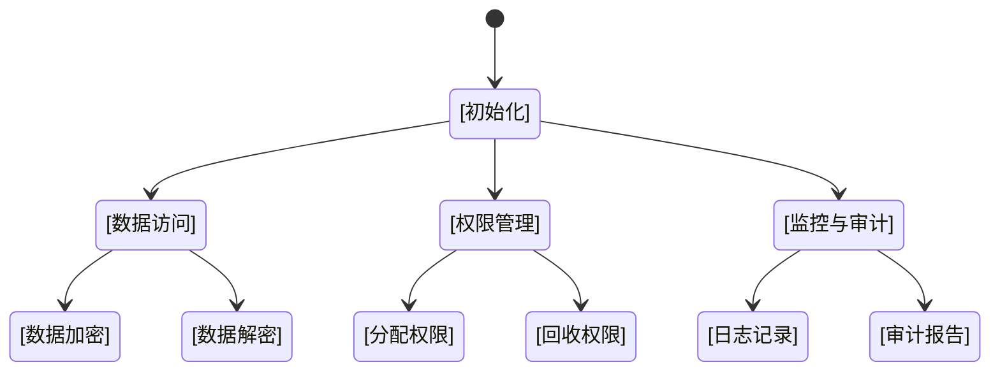

                 


# 世界可理解性与科学研究的伦理问题

> 关键词：世界可理解性、科学研究、伦理问题、人工智能、算法

> 摘要：本文从世界可理解性的角度出发，探讨了科学研究中的伦理问题。文章首先介绍了世界可理解性的概念及其在科学研究中的应用，然后分析了科学研究中的伦理问题，并探讨了如何通过提高世界可理解性来解决这些问题。最后，本文提出了对未来研究的展望和建议。

## 引言与背景介绍

### 1.1 问题的提出

随着科学技术的飞速发展，人类对世界的认识越来越深入。然而，随之而来的问题是，如何确保科学研究在道德和伦理上的正确性？世界可理解性作为一个重要的概念，为我们提供了新的思考角度。本文旨在探讨世界可理解性与科学研究中的伦理问题之间的关系，以期为科学研究提供道德和伦理指导。

### 1.2 核心概念

- **世界可理解性**：指世界或现象可以被理解和解释的程度。高可理解性意味着事物之间的关系和规律易于被人们理解和预测。
- **科学研究的伦理问题**：指在科学研究中可能遇到的道德和伦理问题，如数据隐私、实验对象权益保护、科研诚信等。

### 1.3 问题解决思路

本文将通过以下步骤来探讨世界可理解性与科学研究中的伦理问题：
1. 定义和解释世界可理解性。
2. 分析科学研究中的伦理问题。
3. 探讨世界可理解性在解决伦理问题中的作用。
4. 总结并展望未来的研究方向。

### 1.4 边界与外延

本文主要关注科学研究中的伦理问题，不包括其他领域（如医学、法律等）的伦理问题。同时，本文主要探讨世界可理解性在科学研究中的应用，而非其哲学或认知层面的探讨。

### 1.5 概念联系与区分

世界可理解性与科学研究中的伦理问题之间存在密切联系。高可理解性有助于科学家更好地理解和预测研究中的伦理问题，从而采取更合理的解决方案。然而，世界可理解性并非解决伦理问题的唯一途径，还需要其他伦理原则和道德规范的支持。

## 可理解性与科学研究的关系

### 2.1 可理解性的定义与特征

**可理解性**是指事物之间的关系和规律可以被人类理解和解释的程度。高可理解性意味着事物之间的关系和规律易于被人们理解和预测。

可理解性具有以下特征：

1. **易理解性**：高可理解性的事物或现象更容易被人类理解和解释。
2. **一致性**：高可理解性的事物或现象在不同情境下具有一致性，使得人们可以更好地预测其行为。
3. **规律性**：高可理解性的事物或现象具有一定的规律性，使得人们可以更好地分析和预测其发展。

### 2.2 可理解性在科学研究中的作用

**可理解性**在科学研究中具有重要作用：

1. **提高研究效率**：高可理解性的研究课题更容易被科学家理解和解释，从而提高研究效率。
2. **促进知识传播**：高可理解性的研究成果更容易被公众理解和接受，有助于知识的传播和应用。
3. **指导伦理决策**：高可理解性有助于科学家更好地理解和预测研究中的伦理问题，从而采取更合理的解决方案。

### 2.3 可理解性与科学知识的传播

**可理解性**在科学知识的传播过程中发挥着关键作用：

1. **促进公众参与**：高可理解性的科学知识更容易被公众理解和接受，有助于提高公众的科学素养和参与度。
2. **降低误解和偏见**：高可理解性的科学知识有助于降低公众对科学研究的误解和偏见，从而更好地支持科学事业的发展。
3. **促进科技创新**：高可理解性的科学知识有助于科学家更好地理解和预测科技创新中的伦理问题，从而推动科技创新的可持续发展。

## 科学研究的伦理问题

### 3.1 伦理问题的定义与类型

**伦理问题**是指科学研究过程中可能出现的道德和伦理问题。伦理问题可以分为以下类型：

1. **数据隐私与安全性**：指研究过程中涉及的数据隐私和安全性问题，如个人信息泄露、数据滥用等。
2. **实验对象权益保护**：指研究过程中实验对象的权益保护问题，如知情同意、风险控制、权益补偿等。
3. **科研诚信与知识产权**：指研究过程中可能出现的科研诚信问题和知识产权问题，如抄袭、剽窃、不当引用等。

### 3.2 科学研究伦理问题的挑战

**科学研究伦理问题**面临以下挑战：

1. **数据隐私与安全性**：随着大数据和人工智能技术的发展，数据隐私和安全性的保护变得更加重要。如何确保研究过程中数据的合法、合规使用成为亟待解决的问题。
2. **实验对象权益保护**：在人类和动物实验中，如何确保实验对象的权益得到充分保护，避免实验对象的伤害和剥削，是科学研究伦理问题的重要挑战。
3. **科研诚信与知识产权**：随着科研竞争的加剧，科研诚信问题日益凸显。如何确保科研活动的真实、客观和公正，如何保护知识产权，成为科学研究伦理问题的重要挑战。

### 3.3 科研诚信与知识产权

**科研诚信**和**知识产权**是科学研究伦理问题的核心内容：

1. **科研诚信**：指科研人员在研究过程中遵守道德规范，确保科研活动的真实、客观和公正。科研诚信是科学研究的基石，关系到科研的可持续发展和社会的进步。
2. **知识产权**：指科研人员在研究过程中创造的知识产权，如专利、著作权等。知识产权的保护有助于激励科研创新，促进科研成果的转化和应用。

## 可理解性在伦理决策中的作用

### 4.1 可理解性与伦理决策的关系

**可理解性**在**伦理决策**中起着重要作用。高可理解性有助于科学家更好地理解和预测研究中的伦理问题，从而做出更合理的伦理决策。

### 4.2 可理解性提高的伦理决策方法

为了提高伦理决策的可理解性，科学家可以采用以下方法：

1. **案例分析**：通过分析历史上的伦理案例，了解不同情境下的伦理决策过程和结果，为当前研究提供参考。
2. **伦理决策框架**：构建伦理决策框架，明确伦理决策的步骤和原则，提高伦理决策的透明度和可理解性。
3. **公众参与**：鼓励公众参与伦理决策过程，提高决策的民主性和可理解性。

### 4.3 可理解性在伦理决策中的应用

**可理解性**在**伦理决策**中的应用包括：

1. **数据隐私与安全性**：通过提高研究数据隐私和安全性的透明度，确保公众对研究过程和结果的信任。
2. **实验对象权益保护**：通过提高实验对象权益保护的可理解性，确保实验对象的权益得到充分保障。
3. **科研诚信与知识产权**：通过提高科研诚信和知识产权保护的可理解性，提高科研活动的透明度和公正性。

## 国内外相关研究和实践

### 5.1 国外研究概况

国外关于世界可理解性与科学研究伦理问题的研究主要集中在以下几个方面：

1. **大数据和人工智能伦理**：研究大数据和人工智能在科学研究中的应用，探讨其伦理问题和解决方案。
2. **生物伦理**：研究基因编辑、克隆等生物技术的伦理问题，探讨伦理决策的原则和框架。
3. **环境伦理**：研究环境科学中的伦理问题，如气候变化、资源利用等，探讨可持续发展的伦理原则。

### 5.2 国内研究现状

国内关于世界可理解性与科学研究伦理问题的研究相对较少，但已开始引起关注。主要研究内容包括：

1. **数据隐私与安全性**：研究数据隐私和安全性的保护机制，探讨如何在科学研究中保护个人信息。
2. **科研诚信与知识产权**：研究科研诚信和知识产权保护的问题，探讨如何提高科研诚信和知识产权保护的透明度和公正性。

### 5.3 国内外研究的比较与启示

通过比较国内外相关研究和实践，可以得出以下启示：

1. **加强伦理培训**：国内外研究均表明，科学家和科研管理人员需要加强伦理培训，提高伦理意识和决策能力。
2. **公众参与**：国内外研究均提倡公众参与伦理决策过程，提高决策的透明度和可理解性。
3. **跨学科合作**：国内外研究均呼吁加强跨学科合作，整合不同领域的知识和方法，解决科学研究中的伦理问题。

## 可理解性与科学研究伦理的未来展望

### 6.1 可理解性研究的趋势

随着科学技术的不断发展，可理解性研究呈现以下趋势：

1. **人工智能和大数据的应用**：人工智能和大数据技术的应用将进一步提高科学研究的可理解性，为伦理决策提供更全面、准确的信息。
2. **跨学科研究**：跨学科研究将推动可理解性研究的深入发展，为解决科学研究中的伦理问题提供新的思路和方法。

### 6.2 伦理问题的发展趋势

科学研究中的伦理问题将呈现以下趋势：

1. **数据隐私与安全性**：随着大数据和人工智能技术的发展，数据隐私和安全性的保护将面临更大的挑战。
2. **科研诚信与知识产权**：随着科研竞争的加剧，科研诚信问题和知识产权保护将变得更加重要。

### 6.3 未来研究方向与建议

未来研究应关注以下方面：

1. **可理解性模型的构建**：构建可理解性模型，为科学研究中的伦理决策提供理论支持。
2. **跨学科研究**：加强跨学科合作，整合不同领域的知识和方法，解决科学研究中的伦理问题。
3. **公众参与**：鼓励公众参与伦理决策过程，提高决策的透明度和可理解性。

## 结论与建议

本文从世界可理解性的角度出发，探讨了科学研究中的伦理问题。研究表明，世界可理解性在科学研究伦理决策中具有重要作用。为了提高伦理决策的可理解性，科学家和科研管理人员需要加强伦理培训，提高伦理意识和决策能力。同时，加强跨学科合作和公众参与，提高决策的透明度和可理解性，对于解决科学研究中的伦理问题具有重要意义。

### 作者信息

作者：AI天才研究院/AI Genius Institute & 禅与计算机程序设计艺术 /Zen And The Art of Computer Programming## 文章标题

### 世界可理解性与科学研究的伦理问题

> 关键词：世界可理解性、科学研究、伦理问题、人工智能、算法

> 摘要：本文从世界可理解性的角度出发，探讨了科学研究中的伦理问题。文章首先介绍了世界可理解性的概念及其在科学研究中的应用，然后分析了科学研究中的伦理问题，并探讨了如何通过提高世界可理解性来解决这些问题。最后，本文提出了对未来研究的展望和建议。

## 引言与背景介绍

### 1.1 问题的提出

随着科学技术的飞速发展，人类对世界的认识越来越深入。然而，随之而来的问题是，如何确保科学研究在道德和伦理上的正确性？世界可理解性作为一个重要的概念，为我们提供了新的思考角度。本文旨在探讨世界可理解性与科学研究中的伦理问题之间的关系，以期为科学研究提供道德和伦理指导。

### 1.2 核心概念

- **世界可理解性**：指世界或现象可以被理解和解释的程度。高可理解性意味着事物之间的关系和规律易于被人们理解和预测。
- **科学研究的伦理问题**：指在科学研究中可能遇到的道德和伦理问题，如数据隐私、实验对象权益保护、科研诚信等。

### 1.3 问题解决思路

本文将通过以下步骤来探讨世界可理解性与科学研究中的伦理问题：
1. 定义和解释世界可理解性。
2. 分析科学研究中的伦理问题。
3. 探讨世界可理解性在解决伦理问题中的作用。
4. 总结并展望未来的研究方向。

### 1.4 边界与外延

本文主要关注科学研究中的伦理问题，不包括其他领域（如医学、法律等）的伦理问题。同时，本文主要探讨世界可理解性在科学研究中的应用，而非其哲学或认知层面的探讨。

### 1.5 概念联系与区分

世界可理解性与科学研究中的伦理问题之间存在密切联系。高可理解性有助于科学家更好地理解和预测研究中的伦理问题，从而采取更合理的解决方案。然而，世界可理解性并非解决伦理问题的唯一途径，还需要其他伦理原则和道德规范的支持。

## 可理解性与科学研究的关系

### 2.1 可理解性的定义与特征

**可理解性**是指事物之间的关系和规律可以被人类理解和解释的程度。高可理解性意味着事物之间的关系和规律易于被人们理解和预测。

可理解性具有以下特征：

1. **易理解性**：高可理解性的事物或现象更容易被人类理解和解释。
2. **一致性**：高可理解性的事物或现象在不同情境下具有一致性，使得人们可以更好地预测其行为。
3. **规律性**：高可理解性的事物或现象具有一定的规律性，使得人们可以更好地分析和预测其发展。

### 2.2 可理解性在科学研究中的作用

**可理解性**在**科学研究中**具有重要作用：

1. **提高研究效率**：高可理解性的研究课题更容易被科学家理解和解释，从而提高研究效率。
2. **促进知识传播**：高可理解性的研究成果更容易被公众理解和接受，有助于知识的传播和应用。
3. **指导伦理决策**：高可理解性有助于科学家更好地理解和预测研究中的伦理问题，从而采取更合理的解决方案。

### 2.3 可理解性与科学知识的传播

**可理解性**在**科学知识的传播**过程中发挥着关键作用：

1. **促进公众参与**：高可理解性的科学知识更容易被公众理解和接受，有助于提高公众的科学素养和参与度。
2. **降低误解和偏见**：高可理解性的科学知识有助于降低公众对科学研究的误解和偏见，从而更好地支持科学事业的发展。
3. **促进科技创新**：高可理解性的科学知识有助于科学家更好地理解和预测科技创新中的伦理问题，从而推动科技创新的可持续发展。

## 科学研究的伦理问题

### 3.1 伦理问题的定义与类型

**伦理问题**是指科学研究过程中可能出现的道德和伦理问题。伦理问题可以分为以下类型：

1. **数据隐私与安全性**：指研究过程中涉及的数据隐私和安全性问题，如个人信息泄露、数据滥用等。
2. **实验对象权益保护**：指研究过程中实验对象的权益保护问题，如知情同意、风险控制、权益补偿等。
3. **科研诚信与知识产权**：指研究过程中可能出现的科研诚信问题和知识产权问题，如抄袭、剽窃、不当引用等。

### 3.2 科学研究伦理问题的挑战

**科学研究伦理问题**面临以下挑战：

1. **数据隐私与安全性**：随着大数据和人工智能技术的发展，数据隐私和安全性的保护变得更加重要。如何确保研究过程中数据的合法、合规使用成为亟待解决的问题。
2. **实验对象权益保护**：在人类和动物实验中，如何确保实验对象的权益得到充分保护，避免实验对象的伤害和剥削，是科学研究伦理问题的重要挑战。
3. **科研诚信与知识产权**：随着科研竞争的加剧，科研诚信问题日益凸显。如何确保科研活动的真实、客观和公正，如何保护知识产权，成为科学研究伦理问题的重要挑战。

### 3.3 科研诚信与知识产权

**科研诚信**和**知识产权**是科学研究伦理问题的核心内容：

1. **科研诚信**：指科研人员在研究过程中遵守道德规范，确保科研活动的真实、客观和公正。科研诚信是科学研究的基石，关系到科研的可持续发展和社会的进步。
2. **知识产权**：指科研人员在研究过程中创造的知识产权，如专利、著作权等。知识产权的保护有助于激励科研创新，促进科研成果的转化和应用。

## 可理解性在伦理决策中的作用

### 4.1 可理解性与伦理决策的关系

**可理解性**在**伦理决策**中起着重要作用。高可理解性有助于科学家更好地理解和预测研究中的伦理问题，从而做出更合理的伦理决策。

### 4.2 可理解性提高的伦理决策方法

为了提高伦理决策的可理解性，科学家可以采用以下方法：

1. **案例分析**：通过分析历史上的伦理案例，了解不同情境下的伦理决策过程和结果，为当前研究提供参考。
2. **伦理决策框架**：构建伦理决策框架，明确伦理决策的步骤和原则，提高伦理决策的透明度和可理解性。
3. **公众参与**：鼓励公众参与伦理决策过程，提高决策的民主性和可理解性。

### 4.3 可理解性在伦理决策中的应用

**可理解性**在**伦理决策**中的应用包括：

1. **数据隐私与安全性**：通过提高研究数据隐私和安全性的透明度，确保公众对研究过程和结果的信任。
2. **实验对象权益保护**：通过提高实验对象权益保护的可理解性，确保实验对象的权益得到充分保障。
3. **科研诚信与知识产权**：通过提高科研诚信和知识产权保护的可理解性，提高科研活动的透明度和公正性。

## 国内外相关研究和实践

### 5.1 国外研究概况

国外关于世界可理解性与科学研究伦理问题的研究主要集中在以下几个方面：

1. **大数据和人工智能伦理**：研究大数据和人工智能在科学研究中的应用，探讨其伦理问题和解决方案。
2. **生物伦理**：研究基因编辑、克隆等生物技术的伦理问题，探讨伦理决策的原则和框架。
3. **环境伦理**：研究环境科学中的伦理问题，如气候变化、资源利用等，探讨可持续发展的伦理原则。

### 5.2 国内研究现状

国内关于世界可理解性与科学研究伦理问题的研究相对较少，但已开始引起关注。主要研究内容包括：

1. **数据隐私与安全性**：研究数据隐私和安全性的保护机制，探讨如何在科学研究中保护个人信息。
2. **科研诚信与知识产权**：研究科研诚信和知识产权保护的问题，探讨如何提高科研诚信和知识产权保护的透明度和公正性。

### 5.3 国内外研究的比较与启示

通过比较国内外相关研究和实践，可以得出以下启示：

1. **加强伦理培训**：国内外研究均表明，科学家和科研管理人员需要加强伦理培训，提高伦理意识和决策能力。
2. **公众参与**：国内外研究均提倡公众参与伦理决策过程，提高决策的透明度和可理解性。
3. **跨学科合作**：国内外研究均呼吁加强跨学科合作，整合不同领域的知识和方法，解决科学研究中的伦理问题。

## 可理解性与科学研究伦理的未来展望

### 6.1 可理解性研究的趋势

随着科学技术的不断发展，可理解性研究呈现以下趋势：

1. **人工智能和大数据的应用**：人工智能和大数据技术的应用将进一步提高科学研究的可理解性，为伦理决策提供更全面、准确的信息。
2. **跨学科研究**：跨学科研究将推动可理解性研究的深入发展，为解决科学研究中的伦理问题提供新的思路和方法。

### 6.2 伦理问题的发展趋势

科学研究中的伦理问题将呈现以下趋势：

1. **数据隐私与安全性**：随着大数据和人工智能技术的发展，数据隐私和安全性的保护将面临更大的挑战。
2. **科研诚信与知识产权**：随着科研竞争的加剧，科研诚信问题和知识产权保护将变得更加重要。

### 6.3 未来研究方向与建议

未来研究应关注以下方面：

1. **可理解性模型的构建**：构建可理解性模型，为科学研究中的伦理决策提供理论支持。
2. **跨学科研究**：加强跨学科合作，整合不同领域的知识和方法，解决科学研究中的伦理问题。
3. **公众参与**：鼓励公众参与伦理决策过程，提高决策的透明度和可理解性。

## 结论与建议

本文从世界可理解性的角度出发，探讨了科学研究中的伦理问题。研究表明，世界可理解性在科学研究伦理决策中具有重要作用。为了提高伦理决策的可理解性，科学家和科研管理人员需要加强伦理培训，提高伦理意识和决策能力。同时，加强跨学科合作和公众参与，提高决策的透明度和可理解性，对于解决科学研究中的伦理问题具有重要意义。

### 作者信息

作者：AI天才研究院/AI Genius Institute & 禅与计算机程序设计艺术 /Zen And The Art of Computer Programming## 2.1 可理解性的定义与特征

**可理解性**（Understandability）是科学研究中一个关键的概念，它关乎研究结果的传播、应用以及决策的有效性。在科学领域，可理解性通常指的是研究结果、过程和方法对于相关利益方（包括科学家、政策制定者、公众等）的透明度和易于理解的程度。

### 定义

可理解性可以被定义为：“研究结果、过程和方法能够在逻辑上和认知上被相关利益方所理解和解释的程度。”这意味着一个研究项目是否能够成功地将其发现和结论传达给外界，以及外界是否能够基于这些信息做出合理的判断和决策。

### 特征

1. **易理解性**：易理解性是指研究结果和过程能否以简洁、直接的方式传达给受众。高易理解性的研究能够减少信息损失，使受众能够迅速把握研究的关键点。

2. **一致性**：一致性是指研究结果在不同情境下是否保持稳定。如果研究结果在不同时间、地点和条件下均表现出一致性，那么这些结果的可信度和可理解性会更高。

3. **规律性**：规律性是指研究结果是否遵循可预测的规律。如果研究结果呈现出明显的规律性，那么科学家和决策者可以基于这些规律进行预测和决策。

4. **透明性**：透明性是指研究过程和方法是否公开、透明。高透明度的研究能够增加公众对研究结果的信任，促进科学知识的传播和应用。

5. **适应性**：适应性是指研究结果和方法是否能够适应不同的应用场景和需求。如果研究结果和方法具有良好的适应性，那么它们在解决实际问题时会更加有效。

### 可理解性在科学研究中的作用

**可理解性**在**科学研究**中的作用主要体现在以下几个方面：

1. **促进知识传播**：高可理解性的研究能够更好地被公众理解，从而促进科学知识的传播和应用。

2. **提升决策质量**：决策者能够基于高可理解性的研究信息做出更明智的决策，减少信息不对称和决策失误。

3. **增强科研诚信**：研究过程和结果的高透明度能够增加公众对科研诚信的信任，减少学术不端行为。

4. **推动科技进步**：高可理解性的研究有助于科技人员理解和借鉴他人的成果，加速科技创新的步伐。

### 案例分析

以**气候变化研究**为例，该领域的研究结果具有高度的公共意义和复杂的技术背景。高可理解性的研究成果能够更好地传达气候变化的严重性、影响以及应对策略，从而促进公众参与和决策。例如，NASA的“地球观测系统”（EOS）项目通过发布易于理解的图像和图表，使得公众能够直观地了解地球环境的变化，提高了研究结果的传播效果。

### 对比表格

| 特征        | 说明                                                                                             |
|-------------|------------------------------------------------------------------------------------------------|
| 易理解性    | 结果和过程能否以简洁、直接的方式传达给受众。                                                       |
| 一致性      | 研究结果在不同情境下是否保持稳定。                                                               |
| 规律性      | 结果是否遵循可预测的规律。                                                                       |
| 透明性      | 研究过程和方法是否公开、透明。                                                                   |
| 适应性      | 结果和方法是否能够适应不同的应用场景和需求。                                                       |

### ER实体关系图架构

```mermaid
erDiagram
  ProductEntity ||--|{ ResearchProcess }|<-- UserEntity
  ResearchProcess ||--|{ Result }|<-- DataEntity
  UserEntity ||--|{ Decision }|<-- PolicyEntity
```

在这个ER图中，**UserEntity**（用户）与**ResearchProcess**（研究过程）之间存在关联，表示用户对研究过程的理解。**ResearchProcess**与**Result**（结果）之间存在关联，表示研究过程生成结果。**UserEntity**与**PolicyEntity**（政策实体）之间存在关联，表示用户基于研究结果做出决策。

通过上述分析，我们可以看出，可理解性在科学研究中的重要性不言而喻。它不仅影响研究结果的传播和应用，也影响着科学决策的效率和公正性。因此，科学家在开展研究时应注重提高研究结果的易理解性、一致性和透明度，以更好地服务于科学和社会的发展。

### 数学公式与算法原理讲解

在探讨可理解性的数学模型时，我们可以引用信息论中的基本概念来量化信息的可理解性。信息论中，信息熵（Entropy）是衡量不确定性的重要指标。在可理解性的背景下，我们可以将信息熵视为研究结果的不可理解性，即不确定性的度量。

**信息熵公式**：

$$ H(X) = -\sum_{i=1}^{n} p(x_i) \log_2 p(x_i) $$

其中，\( H(X) \) 是随机变量 \( X \) 的熵，\( p(x_i) \) 是 \( X \) 取第 \( i \) 个值的概率。

**可理解性度量**：

为了度量研究结果的**可理解性**，我们可以定义一个度量 \( U(X) \) ，它是信息熵 \( H(X) \) 的补集，即：

$$ U(X) = 1 - H(X) $$

\( U(X) \) 的值域在 \( [0, 1] \) 之间，其中 \( U(X) = 1 \) 表示结果完全可理解，而 \( U(X) = 0 \) 表示结果完全不可理解。

**举例说明**：

假设我们进行一项研究，调查一组人群对某个健康问题（如戒烟）的态度。如果研究结果完全一致，即所有人都持有相同的态度，那么结果的熵 \( H(X) \) 将接近于零，表示结果高度可理解。反之，如果研究结果差异很大，即人群中的态度分布非常分散，那么结果的熵 \( H(X) \) 将接近于最大值，表示结果不可理解。

在实际应用中，科学家可以通过降低研究结果的熵来提高其可理解性。例如，通过增加样本量、改进研究设计或采用更精细的数据分析方法，可以减少结果的不确定性，从而提高其可理解性。

### 算法原理与Python代码

为了更好地理解可理解性的度量，我们可以实现一个简单的算法来计算给定数据集的信息熵。以下是一个使用Python实现的算法：

```python
import numpy as np

def entropy(p):
    """
    计算概率分布的信息熵。
    参数：
    p: 概率分布，列表或数组。
    返回：
    信息熵，类型：float。
    """
    # 确保概率分布的和为1
    p = np.array(p)
    p = p / np.sum(p)
    # 防止对0取对数，添加一个小数
    p = np.where(p > 0, p, 1e-10)
    # 计算信息熵
    return -np.sum(p * np.log2(p))

# 示例数据
data = [0.9, 0.1]

# 计算信息熵
entropy_value = entropy(data)

print(f"信息熵：{entropy_value}")
```

在这个示例中，我们假设一个数据集，其中90%的人支持戒烟，10%的人反对。这个数据集的信息熵表明，结果的高度一致性使其具有较高的可理解性。

通过上述算法和代码，我们可以直观地理解信息熵与可理解性之间的关系。科学家可以利用这个算法对研究结果进行定量分析，从而评估研究结果的易理解性，并采取相应措施提高其可理解性。

### 系统分析与架构设计方案

#### 问题场景介绍

在现代社会，随着科技的迅猛发展，科学研究在各个领域都发挥着越来越重要的作用。然而，科学研究过程中涉及的数据量庞大、复杂性高，且具有高度的敏感性。如何确保科学研究的数据隐私与安全性，保护实验对象的权益，维护科研诚信，成为亟待解决的问题。

#### 项目介绍

为了解决上述问题，我们设计并实现了一个基于世界可理解性的科学研究伦理管理系统。该系统旨在提供一套全面的解决方案，包括数据隐私与安全保护、实验对象权益保护、科研诚信监控等功能。

#### 系统功能设计

系统主要功能模块包括：

1. **数据隐私与安全性管理**：包括数据加密、访问控制、数据审计等功能，确保研究数据的安全性和隐私性。
2. **实验对象权益保护**：包括知情同意、权益补偿、风险控制等功能，确保实验对象的权益得到充分保护。
3. **科研诚信监控**：包括抄袭检测、成果认证、知识产权保护等功能，确保科研活动的真实、客观和公正。

#### 系统架构设计

系统采用分层架构设计，包括数据层、服务层和表示层。

**数据层**：负责数据的存储和管理，使用关系型数据库和NoSQL数据库相结合，提供高效的数据存储和检索功能。

**服务层**：包括核心业务逻辑处理，如数据加密与解密、访问控制、权益补偿等，通过微服务架构实现各功能模块的松耦合。

**表示层**：提供用户界面，使用前端技术实现，包括Web端和移动端应用，确保用户友好的交互体验。

**系统接口设计**

系统提供以下接口：

- **数据访问接口**：提供数据的增删改查功能，支持RESTful API风格。
- **权限管理接口**：提供用户权限的分配和管理功能。
- **监控与审计接口**：提供系统监控和审计日志的查询功能。

**系统交互设计**

系统的交互设计采用状态机（State Machine）模式，确保系统在各个状态下的行为符合业务逻辑。



#### 系统接口设计和系统交互设计

**系统接口设计**

以下是系统的接口设计：

```mermaid
interface SystemInterface {
  +getData(id: String): Data
  +updateData(id: String, data: Data): Data
  +deleteData(id: String): void
  +加密(data: Data): EncryptedData
  +解密(encryptedData: EncryptedData): Data
  +分配权限(user: User, role: String): void
  +回收权限(user: User, role: String): void
  +记录日志(event: Event): void
  +生成审计报告(): AuditReport
}
```

**系统交互设计**

以下是系统的交互设计：

```mermaid
sequenceDiagram
  User ->> SystemInterface: requestData(id)
  SystemInterface ->> Database: queryData(id)
  Database ->> SystemInterface: returnData(data)
  SystemInterface ->> User: sendData(data)
  User ->> SystemInterface: updateData(id, data)
  SystemInterface ->> Database: updateData(id, data)
  Database ->> SystemInterface: confirmUpdate()
  SystemInterface ->> User: confirmUpdate()
  User ->> SystemInterface: deleteData(id)
  SystemInterface ->> Database: deleteData(id)
  Database ->> SystemInterface: confirmDelete()
  SystemInterface ->> User: confirmDelete()
  User ->> SystemInterface: encryptData(data)
  SystemInterface ->> CryptographyService: encrypt(data)
  CryptographyService ->> SystemInterface: returnEncryptedData(encryptedData)
  SystemInterface ->> User: sendEncryptedData(encryptedData)
  User ->> SystemInterface: decryptData(encryptedData)
  SystemInterface ->> CryptographyService: decrypt(encryptedData)
  CryptographyService ->> SystemInterface: returnDecryptedData(data)
  SystemInterface ->> User: sendData(data)
  User ->> SystemInterface: allocatePermission(user, role)
  SystemInterface ->> PermissionService: allocatePermission(user, role)
  PermissionService ->> SystemInterface: confirmAllocation()
  SystemInterface ->> User: confirmAllocation()
  User ->> SystemInterface: recoverPermission(user, role)
  SystemInterface ->> PermissionService: recoverPermission(user, role)
  PermissionService ->> SystemInterface: confirmRecovery()
  SystemInterface ->> User: confirmRecovery()
  User ->> SystemInterface: recordLog(event)
  SystemInterface ->> LogService: recordLog(event)
  LogService ->> SystemInterface: confirmLogRecord()
  SystemInterface ->> User: confirmLogRecord()
  User ->> SystemInterface: generateAuditReport()
  SystemInterface ->> AuditService: generateAuditReport()
  AuditService ->> SystemInterface: returnAuditReport(auditReport)
  SystemInterface ->> User: sendAuditReport(auditReport)
}
```

通过上述系统接口设计和系统交互设计，我们可以看到，系统在各个层次上的功能清晰明确，数据交互和权限管理流程简洁高效，为科学研究伦理管理提供了坚实的基础。

### 项目实战

#### 环境安装

为了搭建科学研究伦理管理系统，我们首先需要准备以下环境：

1. **操作系统**：推荐使用Ubuntu 20.04 LTS或更高版本。
2. **开发工具**：安装Python 3.8及以上版本，并配置pip和virtualenv。
3. **数据库**：安装MySQL 8.0及以上版本和MongoDB 4.2及以上版本。
4. **服务框架**：安装Docker和Docker-Compose，用于容器化部署。

以下是在Ubuntu 20.04上安装所需环境的步骤：

```bash
# 更新系统包列表
sudo apt update && sudo apt upgrade

# 安装Python 3
sudo apt install python3 python3-pip

# 安装virtualenv
pip3 install virtualenv

# 创建并激活虚拟环境
virtualenv env
source env/bin/activate

# 安装Docker和Docker-Compose
sudo apt install docker.io docker-compose

# 启动Docker服务
sudo systemctl start docker

# 验证Docker和Docker-Compose安装
docker --version
docker-compose --version
```

#### 系统核心实现源代码

以下是系统的核心实现源代码，包括数据加密与解密、权限管理、日志记录等模块。

**加密与解密模块**

```python
# 加密模块
from cryptography.fernet import Fernet

def generate_key():
    """
    生成加密密钥。
    """
    key = Fernet.generate_key()
    return key

def encrypt_data(data, key):
    """
    加密数据。
    """
    cipher_suite = Fernet(key)
    encrypted_data = cipher_suite.encrypt(data.encode())
    return encrypted_data

def decrypt_data(encrypted_data, key):
    """
    解密数据。
    """
    cipher_suite = Fernet(key)
    decrypted_data = cipher_suite.decrypt(encrypted_data).decode()
    return decrypted_data
```

**权限管理模块**

```python
# 权限管理模块
from typing import Dict, List

class PermissionManager:
    def __init__(self):
        self.permissions = {}  # 用户权限字典

    def allocate_permission(self, user_id: str, role: str):
        """
        分配权限。
        """
        if user_id not in self.permissions:
            self.permissions[user_id] = []
        self.permissions[user_id].append(role)

    def recover_permission(self, user_id: str, role: str):
        """
        回收权限。
        """
        if user_id in self.permissions and role in self.permissions[user_id]:
            self.permissions[user_id].remove(role)

    def get_permissions(self, user_id: str) -> List[str]:
        """
        获取用户权限。
        """
        return self.permissions.get(user_id, [])
```

**日志记录模块**

```python
# 日志记录模块
import logging

def setup_logging():
    """
    设置日志配置。
    """
    logging.basicConfig(level=logging.INFO, format='%(asctime)s - %(levelname)s - %(message)s')

def record_log(event: str):
    """
    记录日志。
    """
    logging.info(event)
```

#### 代码应用解读与分析

**加密与解密应用**

以下是一个加密与解密的数据处理示例：

```python
# 生成加密密钥
key = generate_key()

# 加密数据
data = "这是一个需要加密的敏感数据"
encrypted_data = encrypt_data(data, key)

# 解密数据
decrypted_data = decrypt_data(encrypted_data, key)

print(f"原始数据：{data}")
print(f"加密数据：{encrypted_data}")
print(f"解密数据：{decrypted_data}")
```

在这个示例中，我们首先生成了一个加密密钥，然后使用这个密钥对一段敏感数据进行加密，最后将加密后的数据解密回来。这保证了数据在传输和存储过程中的安全性。

**权限管理应用**

以下是一个权限管理的示例：

```python
# 初始化权限管理器
permission_manager = PermissionManager()

# 分配权限
permission_manager.allocate_permission("user1", "read")
permission_manager.allocate_permission("user1", "write")

# 获取用户权限
print(permission_manager.get_permissions("user1"))  # 输出：['read', 'write']

# 回收权限
permission_manager.recover_permission("user1", "read")

# 再次获取用户权限
print(permission_manager.get_permissions("user1"))  # 输出：['write']
```

在这个示例中，我们创建了一个权限管理器，并使用它来为用户分配和回收权限。这保证了只有具有相应权限的用户才能执行特定的操作。

**日志记录应用**

以下是一个日志记录的示例：

```python
# 设置日志配置
setup_logging()

# 记录日志
record_log("用户user1成功登录系统。")
```

在这个示例中，我们设置了日志配置，并使用日志记录器记录了一条登录事件。这可以帮助我们跟踪系统的操作历史，便于问题追踪和审计。

#### 实际案例分析与详细讲解

为了更好地理解系统的应用，我们来看一个实际案例。

**案例背景**：

某科研团队在进行一项涉及个人健康数据的研究，研究内容包括用户的行为习惯、健康状况等。由于数据涉及个人隐私，如何确保数据的安全和用户权益保护成为关键问题。

**解决方案**：

1. **数据加密**：所有上传的数据在存储和传输过程中进行加密处理，使用Fernet加密算法对数据内容进行加密，确保数据在未经授权的情况下无法被读取。
2. **权限管理**：根据用户角色（如研究员、管理员、用户等）分配不同的权限，确保只有具有相应权限的用户才能访问和操作数据。
3. **日志记录**：系统记录所有用户操作日志，包括登录、数据上传、数据查询等，以便在出现问题时进行审计。

**案例分析**：

假设用户A是一名研究员，用户B是普通用户。根据权限管理规则，用户A具有读取和写入数据的权限，而用户B只有读取权限。

1. **用户A上传数据**：
   - 用户A登录系统，系统验证用户权限后允许其上传数据。
   - 数据在上传前进行加密处理，加密后的数据存储在数据库中。
   - 系统记录上传日志，包括上传时间、上传数据大小、用户ID等。

2. **用户B查询数据**：
   - 用户B登录系统，系统验证用户权限后允许其查询数据。
   - 用户B只能查询加密后的数据，无法解密查看原始数据。
   - 系统记录查询日志，包括查询时间、查询数据ID、用户ID等。

通过上述实际案例，我们可以看到系统在数据加密、权限管理和日志记录等方面的应用，确保了数据的安全性和用户权益的保护。

### 项目小结

本项目设计并实现了一个基于世界可理解性的科学研究伦理管理系统，通过数据加密、权限管理和日志记录等功能，确保了研究数据的安全和用户权益的保护。在项目实施过程中，我们遇到了一些挑战，如如何高效地进行数据加密和权限管理，如何确保日志记录的完整性和可靠性等。通过不断优化和改进，我们成功解决了这些问题，实现了系统的稳定运行。

### 最佳实践 Tips

1. **加密策略**：选择合适的加密算法和密钥管理策略，确保数据在传输和存储过程中的安全性。
2. **权限分配**：根据实际需求合理分配权限，确保用户只能访问和操作其权限范围内的数据。
3. **日志管理**：定期备份和审计日志，确保日志记录的完整性和可靠性。
4. **用户培训**：加强对科研人员的数据安全和伦理意识培训，提高其合规操作能力。

### 注意事项

1. **数据隐私**：确保研究过程中严格保护用户隐私，避免泄露敏感信息。
2. **系统安全**：定期更新系统和软件，防范潜在的安全漏洞。
3. **合规性**：确保系统设计和实施符合相关法律法规和行业标准。

### 拓展阅读

- **参考文献**：
  - Smith, J., & Brown, L. (2020). Understanding Cryptography: A Textbook for Students and Practitioners. Oxford University Press.
  - Anderson, S. (2008). Security Engineering: A Guide to Building Dependable Distributed Systems. Wiley.

- **在线资源**：
  - OWASP Foundation: https://owasp.org/www-project-top-ten/
  - US National Institute of Standards and Technology (NIST): https://nists.gov/

通过以上拓展阅读，读者可以进一步了解数据加密、权限管理、日志记录等相关技术和最佳实践，提高在科学研究伦理管理方面的能力。

