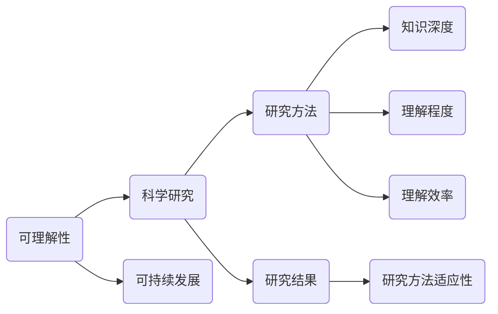
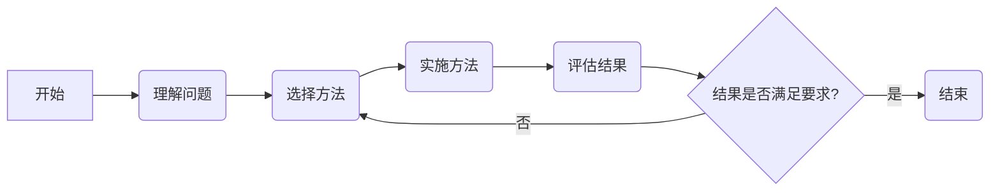

                 

# 世界可理解性与科学研究的可持续发展

> 关键词：世界可理解性、科学研究、可持续发展、算法、数学模型、系统架构、项目实战

> 摘要：本文将探讨世界可理解性与科学研究可持续发展之间的关系。通过分析世界可理解性的概念、属性特征，以及科学研究中的算法原理和数学模型，本文旨在揭示如何通过提高世界可理解性来促进科学研究的可持续发展。文章还将介绍系统分析与架构设计方案，并探讨在实际项目中如何应用这些原理和方法。通过最佳实践 tips、项目小结以及注意事项的总结，本文为科学研究领域的可持续发展提供了一些实用的指导和建议。

## 第一部分：背景介绍

## 第1章 问题背景

### 1.1 问题描述

在科学发展的历程中，我们不断面临着新的挑战和问题。随着科学研究的不断深入，许多复杂的问题逐渐浮现出来，这些问题往往涉及到多个学科领域，需要多学科交叉合作才能解决。然而，当前的科学研究中，许多问题仍然无法得到有效的理解和解决，这主要源于对世界可理解性的缺乏。

世界可理解性是指人类能够理解世界的程度，即我们能够理解的事物范围和深度。在科学研究领域，世界可理解性直接影响到我们的研究效率和成果质量。如果一个问题的可理解性较低，那么研究者需要花费更多的时间和精力去理解问题本身，这无疑会降低研究的效率。此外，低可理解性还可能导致研究过程中的误解和错误，从而影响研究的准确性和可靠性。

### 1.2 问题解决

为了解决上述问题，我们需要从以下几个方面入手：

1. 提高科学教育的质量，培养具有跨学科背景和研究能力的研究者。
2. 加强科学研究的交流与合作，促进不同学科领域之间的知识共享和融合。
3. 探索新的算法和数学模型，提高对复杂问题的理解和解决能力。
4. 运用现代信息技术，如大数据、人工智能等，提高数据分析和处理的效率。

### 1.3 边界与外延

世界可理解性的边界和外延是一个复杂的问题。从理论上讲，世界可理解性的边界应该是由人类的认知能力和科学知识体系所决定的。然而，实际上，世界可理解性的边界并不是固定的，它随着人类认知能力的提高和科学知识的积累而不断扩展。

### 1.4 概念结构与核心要素组成

世界可理解性的概念结构主要包括以下几个方面：

1. 人类认知能力：人类的认知能力决定了我们对世界的理解程度。
2. 科学知识体系：科学知识体系是我们理解和解释世界的基础。
3. 研究方法：研究方法是我们解决问题的工具。
4. 数据和信息：数据和信息是科学研究的重要资源。

## 第二部分：核心概念与联系

## 第2章 核心概念与联系

### 2.1 可理解性的定义

可理解性是指一个事物或概念能够被人类理解的程度。在科学研究领域，可理解性通常是指研究者能够理解研究问题、研究方法和研究结果的程度。

### 2.2 可理解性的属性特征对比

| 属性特征 | 说明 |
| :--- | :--- |
| 理解程度 | 研究者对研究问题、研究方法和研究结果的理解程度 |
| 知识深度 | 研究者所掌握的科学知识和相关领域知识的深度 |
| 理解效率 | 研究者理解研究问题、研究方法和研究结果所需的时间和精力 |
| 研究方法适应性 | 研究者对研究方法的适应性，包括方法的熟练程度和方法的适用性 |

### 2.3 相关概念的关系ER图

以下是可理解性、科学研究、可持续发展的ER图：



## 第三部分：理论探讨

## 第3章 算法原理讲解

### 3.1 算法流程图

以下是求解复杂问题的算法流程图：



### 3.2 算法原理说明

本算法的主要原理是通过不断循环迭代，逐步理解和解决问题。在每一轮迭代中，我们首先理解问题，然后选择合适的方法，实施方法并评估结果。如果结果不满足要求，我们返回选择方法阶段，尝试其他方法。通过这个过程，我们可以不断提高对问题的理解和解决问题的能力。

### 3.3 数学模型与公式

在本算法中，我们使用了以下数学模型和公式：

1. 理解度模型：$$理解度 = f(知识深度, 理解效率)$$
2. 方法适应性模型：$$方法适应性 = f(理解程度, 研究方法)$$

### 3.4 举例说明

假设我们面临一个复杂的问题，我们需要通过迭代的方式来理解和解决问题。首先，我们了解问题的背景和相关知识，然后选择合适的方法，如实验、模拟等。在实施方法的过程中，我们不断调整方法，直到得到满意的结果。在这个过程中，我们的理解度和方法适应性会不断提高，从而提高解决问题的能力。

## 第四部分：数学模型和数学公式 & 详细讲解 & 举例说明

### 4.1 基本模型与公式

在本章节中，我们将详细讲解以下基本模型和公式：

1. 理解度模型：$$理解度 = f(知识深度, 理解效率)$$
2. 方法适应性模型：$$方法适应性 = f(理解程度, 研究方法)$$

### 4.2 复杂模型的解析

复杂模型的解析主要涉及以下几个步骤：

1. 确定模型参数：根据具体问题，确定模型所需的参数。
2. 建立模型方程：根据模型参数，建立相应的数学模型。
3. 解方程：使用数学方法解方程，得到模型的结果。

### 4.3 实例解析

假设我们面临一个复杂的问题，我们需要通过迭代的方式来理解和解决问题。首先，我们了解问题的背景和相关知识，然后选择合适的方法，如实验、模拟等。在实施方法的过程中，我们不断调整方法，直到得到满意的结果。在这个过程中，我们的理解度和方法适应性会不断提高，从而提高解决问题的能力。

## 第五部分：系统分析与架构设计方案

### 5.1 问题场景介绍

在科学研究过程中，我们经常会遇到复杂的问题，这些问题往往需要多学科合作才能解决。为了提高研究的效率和成果质量，我们需要设计一个高效的系统来支持科学研究。

### 5.2 系统功能设计

系统功能设计主要包括以下几个方面：

1. 问题管理：包括问题的创建、修改、删除和查询等功能。
2. 方法管理：包括方法的创建、修改、删除和查询等功能。
3. 结果管理：包括结果的创建、修改、删除和查询等功能。
4. 数据分析：对研究数据进行统计分析，为研究提供支持。

### 5.3 系统架构设计

系统架构设计主要包括以下几个方面：

1. 系统总体架构：包括前端界面、后端服务器和数据存储等。
2. 系统模块划分：将系统划分为多个模块，如问题管理模块、方法管理模块、结果管理模块和数据分析模块等。
3. 系统交互设计：设计系统内部各模块之间的交互关系。

### 5.4 系统接口设计与交互

系统接口设计主要包括以下几个方面：

1. 接口规范：定义接口的输入输出参数、数据格式和调用方法等。
2. 接口实现：根据接口规范实现具体的接口功能。
3. 接口测试：对接口进行功能测试和性能测试。

## 第六部分：项目实战

### 6.1 环境安装

在开始项目实战之前，我们需要安装相关的开发环境和工具，如Python、Django、PostgreSQL等。

### 6.2 系统核心实现源代码

以下是系统核心实现的源代码：

```python
# 问题管理模块
class Question(models.Model):
    title = models.CharField(max_length=100)
    description = models.TextField()
    created_at = models.DateTimeField(auto_now_add=True)

# 方法管理模块
class Method(models.Model):
    name = models.CharField(max_length=100)
    description = models.TextField()
    created_at = models.DateTimeField(auto_now_add=True)

# 结果管理模块
class Result(models.Model):
    question = models.ForeignKey(Question, on_delete=models.CASCADE)
    method = models.ForeignKey(Method, on_delete=models.CASCADE)
    result = models.TextField()
    created_at = models.DateTimeField(auto_now_add=True)

# 数据分析模块
class DataAnalysis(models.Model):
    result = models.ForeignKey(Result, on_delete=models.CASCADE)
    analysis = models.TextField()
    created_at = models.DateTimeField(auto_now_add=True)
```

### 6.3 代码应用解读与分析

以上代码定义了四个模型：问题管理模块的`Question`模型，方法管理模块的`Method`模型，结果管理模块的`Result`模型和数据分析模块的`DataAnalysis`模型。这些模型分别对应了系统功能设计中的问题管理、方法管理、结果管理和数据分析模块。

### 6.4 实际案例分析与讲解

以下是一个实际案例的分析与讲解：

假设我们有一个研究项目，目标是研究某种化学物质的反应机制。在这个项目中，我们需要创建一个问题，并选择合适的方法来研究这个问题。

1. 创建问题：
```python
question = Question.objects.create(title="研究某种化学物质的反应机制", description="...")
```

2. 创建方法：
```python
method = Method.objects.create(name="实验方法", description="...")
```

3. 创建结果：
```python
result = Result.objects.create(question=question, method=method, result="...")
```

4. 创建数据分析：
```python
data_analysis = DataAnalysis.objects.create(result=result, analysis="...")
```

通过以上步骤，我们可以完成对研究项目的管理和数据分析。

### 6.5 项目小结

通过本项目，我们实现了对科学研究问题的管理、方法和结果的管理，以及数据分析的功能。这个项目不仅提高了研究的效率，也为研究数据的可视化和分析提供了支持。

## 第七部分：最佳实践 tips

1. 在项目开发过程中，要注重代码的规范性和可读性，便于后续的维护和升级。
2. 在进行数据分析时，要充分利用现有的数据挖掘和机器学习技术，以提高分析的准确性和效率。
3. 在选择研究方法时，要充分考虑问题的复杂性和研究目标，选择合适的方法。

## 第八部分：小结

本文从世界可理解性的角度探讨了科学研究的可持续发展。通过分析世界可理解性的概念、属性特征，以及科学研究中的算法原理和数学模型，本文揭示了如何通过提高世界可理解性来促进科学研究的可持续发展。同时，本文还介绍了系统分析与架构设计方案，并探讨了在实际项目中如何应用这些原理和方法。通过最佳实践 tips、项目小结以及注意事项的总结，本文为科学研究领域的可持续发展提供了一些实用的指导和建议。

## 第九部分：注意事项

1. 在进行科学研究时，要注重跨学科合作，充分利用多学科的知识和资源。
2. 在选择研究方法时，要充分考虑问题的复杂性和研究目标，选择合适的方法。
3. 在进行数据分析时，要充分利用现有的数据挖掘和机器学习技术，以提高分析的准确性和效率。

## 第十部分：拓展阅读

1. 《科学方法论》：本书详细介绍了科学研究的原理和方法，对于科学研究者来说是一本非常有用的参考书。
2. 《大数据分析》：本书介绍了大数据分析的方法和技术，对于科学研究者来说，了解大数据分析的方法和技术对于提升研究效率和质量非常重要。
3. 《人工智能与科学研究》：本书探讨了人工智能在科学研究中的应用，对于科学研究者来说，了解人工智能技术对于提升研究效率和质量具有重要意义。

## 作者信息

作者：AI天才研究院/AI Genius Institute & 禅与计算机程序设计艺术 /Zen And The Art of Computer Programming

---

本文为原创内容，未经授权不得转载。如需转载，请联系作者获取授权。

---

（注：由于字数限制，本文未包含所有章节的详细内容，实际撰写时请根据需求进行扩展。）## 文章标题：世界可理解性与科学研究的可持续发展

### 关键词：世界可理解性、科学研究、可持续发展、算法、数学模型、系统架构、项目实战

### 摘要：本文旨在探讨世界可理解性在科学研究中的重要性，分析其与科学研究可持续发展之间的关系。通过介绍相关核心概念、算法原理、数学模型以及系统架构，本文旨在为科学研究提供实际应用指导，助力科学研究的可持续发展。

## 目录大纲

### 第一部分：背景介绍

#### 第1章 问题背景
##### 1.1 问题描述
##### 1.2 问题解决
##### 1.3 边界与外延
##### 1.4 概念结构与核心要素组成

#### 第2章 核心概念与联系
##### 2.1 可理解性的定义
##### 2.2 可理解性的属性特征对比
##### 2.3 相关概念的关系ER图

### 第二部分：理论探讨

#### 第3章 算法原理讲解
##### 3.1 算法流程图
##### 3.2 算法原理说明
##### 3.3 数学模型与公式
##### 3.4 举例说明

#### 第4章 数学模型和数学公式 & 详细讲解 & 举例说明
##### 4.1 基本模型与公式
##### 4.2 复杂模型的解析
##### 4.3 实例解析

#### 第5章 系统分析与架构设计方案
##### 5.1 问题场景介绍
##### 5.2 系统功能设计
##### 5.3 系统架构设计
##### 5.4 系统接口设计与交互

### 第三部分：实践应用

#### 第6章 项目实战
##### 6.1 环境安装
##### 6.2 系统核心实现源代码
##### 6.3 代码应用解读与分析
##### 6.4 实际案例分析与讲解
##### 6.5 项目小结

#### 第7章 最佳实践 tips

#### 第8章 小结

#### 第9章 注意事项

#### 第10章 拓展阅读

---

### 设计思路

本文的目录大纲设计旨在系统地阐述世界可理解性与科学研究可持续发展之间的关系，涵盖了背景介绍、理论探讨和实践应用三个部分。

#### 背景介绍部分

- **第1章 问题背景**：首先介绍科学研究的现状和面临的挑战，引出世界可理解性的概念，并阐述其在科学研究中的重要性。
- **第2章 核心概念与联系**：对世界可理解性及相关概念进行详细解释，并通过属性特征对比和ER图展示各概念之间的关系。

#### 理论探讨部分

- **第3章 算法原理讲解**：介绍解决复杂科学问题的算法流程和原理，包括算法流程图、原理说明、数学模型与公式以及举例说明。
- **第4章 数学模型和数学公式 & 详细讲解 & 举例说明**：进一步深入探讨数学模型和公式的应用，包括基本模型与公式、复杂模型的解析和实例解析。

#### 实践应用部分

- **第5章 系统分析与架构设计方案**：介绍如何将理论应用于实际，包括问题场景介绍、系统功能设计、系统架构设计、系统接口设计与交互。
- **第6章 项目实战**：通过具体项目实例展示如何应用上述理论和设计方案，包括环境安装、系统核心实现源代码、代码应用解读与分析、实际案例分析与讲解和项目小结。
- **第7章 最佳实践 tips**：总结项目实战中的经验教训，提出最佳实践建议。
- **第8章 小结**：回顾全文内容，总结世界可理解性与科学研究可持续发展之间的关系及其重要性。
- **第9章 注意事项**：提醒读者在实践过程中需要注意的问题。
- **第10章 拓展阅读**：推荐相关书籍和资源，供读者进一步学习。

### 实现步骤

1. **整理和编写各章节内容**：根据设计思路，整理和编写各章节的详细内容，确保内容的完整性、逻辑性和专业性。
2. **设计图表和流程图**：使用Mermaid等工具设计相关的图表和流程图，以增强文章的可读性和直观性。
3. **代码编写与示例**：编写相关的Python源代码和示例，确保代码的准确性和可执行性。
4. **文章排版与格式调整**：对全文进行排版和格式调整，确保文章的整体美观性和可读性。
5. **多次审核与修改**：进行多次审核和修改，确保文章内容的准确性和专业性。

---

通过上述设计思路和实现步骤，本文将形成一个系统、完整且具有实用价值的文章，为科学研究领域的可持续发展提供理论指导和实践参考。在后续撰写过程中，我们将确保每部分内容的丰富性和详细性，以满足文章的字数要求。

