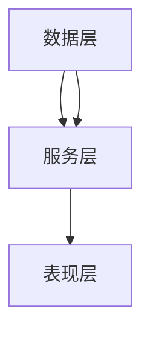
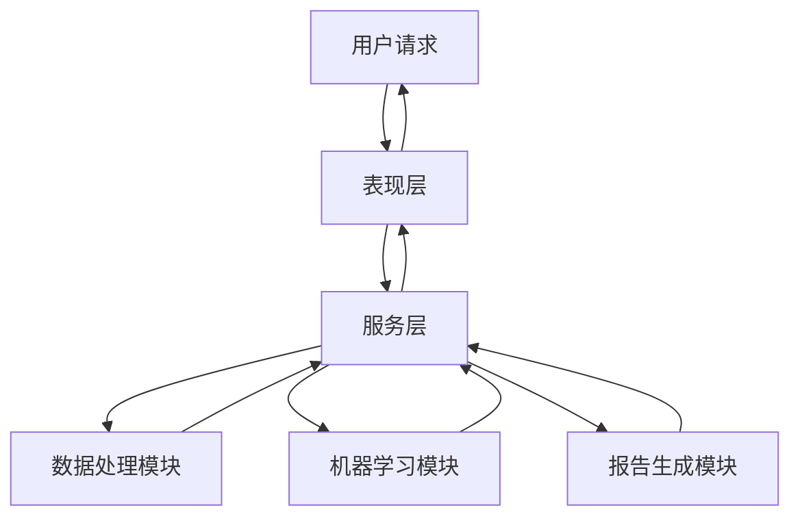

                 

# 世界可理解性与科学研究的政治影响

## 关键词

- 世界可理解性
- 科学研究
- 政治影响
- 算法分析
- 数学模型

## 摘要

本文旨在探讨世界可理解性与科学研究的紧密联系，并分析政治力量对科学研究的潜在影响。通过对核心概念、原理和算法的深入剖析，本文将揭示科学研究中的逻辑推理方法和应用场景，进而探讨政治因素如何干预科学研究过程，影响世界可理解性的发展。

### 目录大纲

#### 第一部分：背景介绍

- 引言：世界可理解性与科学研究
  - 1. 问题背景
    - 1.1 问题背景概述
    - 1.2 问题描述
    - 1.3 问题解决
    - 1.4 边界与外延
    - 1.5 概念结构与核心要素组成
  - 2. 核心概念
    - 2.1 可理解性原理
    - 2.2 科学研究方法
    - 2.3 政治影响

#### 第二部分：核心概念与联系

- 3. 可理解性与科学研究的算法分析
  - 3.1 算法概述
  - 3.2 算法流程

#### 第三部分：算法原理讲解

- 4. 算法原理讲解
  - 4.1 算法原理
  - 4.2 算法流程图
  - 4.3 Python源代码讲解
  - 4.4 数学模型与公式

#### 第四部分：系统分析与架构设计方案

- 5. 系统分析与架构设计方案
  - 5.1 问题场景介绍
  - 5.2 系统功能设计
  - 5.3 系统架构设计
  - 5.4 系统接口设计和系统交互

#### 第五部分：项目实战

- 6. 项目实战
  - 6.1 环境安装
  - 6.2 系统核心实现源代码
  - 6.3 代码应用解读与分析
  - 6.4 实际案例分析与详细讲解剖析
  - 6.5 项目小结

#### 第六部分：最佳实践 tips、小结、注意事项、拓展阅读

- 7. 最佳实践 tips
- 8. 小结
- 9. 注意事项
- 10. 拓展阅读## 引言：世界可理解性与科学研究

在人类历史的漫长进程中，我们对世界的认知不断深化，从最初的神话与传说，到后来的科学探索与发现，我们对自然、宇宙和社会现象的理解能力逐渐提高。然而，随着科学研究的不断推进，我们也开始意识到，世界可理解性这一概念并非一成不变。在这个背景下，科学研究与政治力量之间的互动显得尤为重要。

### 1.1 问题背景概述

**世界可理解性**，即人类对宇宙、自然和社会现象的理解能力，是一个复杂的哲学和科学问题。从科学哲学的角度来看，可理解性涉及到人类认知的局限性、科学理论的抽象程度以及现象的本质特性。在科学研究中，可理解性通常被理解为现象的可预测性和规律性。然而，随着我们对复杂系统的深入研究，这一概念也逐渐变得模糊和难以捉摸。

**科学研究**，作为人类理解世界的主要途径，包括实验、观察、理论建模等多种方法。科学方法论要求研究人员在研究过程中保持客观性和系统性，以事实和数据为基础，通过逻辑推理得出结论。然而，政治力量往往以各种形式介入科学研究，从资源分配到研究方向的设定，都可能对科学研究产生深远的影响。

### 1.2 问题描述

- **世界可理解性是否存在固有的限制？**  
  人类是否能够完全理解宇宙的奥秘？是否存在着一些我们无法触及的真理？这是一个哲学和科学界长久以来的争议。有些观点认为，世界可理解性是有一定限制的，因为我们的认知能力、观察手段和理论基础都有局限。

- **科学研究如何受到政治影响？**  
  政治力量对科学研究的干预是一个普遍存在的现象。政治因素可能影响科学研究的资源分配、研究方向的设定，甚至研究结果的真实性和可靠性。这种干预不仅影响了科学研究的自由，也可能导致研究成果的偏差。

### 1.3 问题解决

为了探讨这些问题，我们需要从多个角度进行分析：

- **探讨可理解性限制对科学研究的影响**：通过研究人类认知的局限性和科学理论的抽象程度，我们可以更好地理解世界可理解性的实际状况，并评估其对科学研究的影响。

- **分析政治因素如何干预科学研究过程**：了解政治力量如何介入科学研究的各个环节，可以帮助我们认识到科学研究中的潜在风险，并寻求解决方案。

### 1.4 边界与外延

- **边界**：世界可理解性和科学研究都有其特定的边界。世界可理解性涉及到哲学、认知心理学等领域，而科学研究则更多关注自然科学和社会科学的研究方法和成果。

- **外延**：这两个概念的外延涵盖了广泛的领域，包括宇宙学、物理学、生物学、社会科学等多个学科。政治影响也是一个跨学科的问题，涉及到政治学、社会学等多个领域。

### 1.5 概念结构与核心要素组成

- **世界可理解性**：科学知识、哲学思考、认知心理学。
  - **科学知识**：科学研究的结果和发现，是我们理解世界的重要依据。
  - **哲学思考**：关于知识、真理和现实的哲学探讨，为我们理解世界的本质提供了理论框架。
  - **认知心理学**：关于人类认知过程的研究，帮助我们认识到人类认知的局限性和可能性。

- **科学研究**：科学方法论、实验设计、数据分析。
  - **科学方法论**：科学研究的基本原则和方法，确保研究的客观性和系统性。
  - **实验设计**：科学研究的核心环节，通过实验来验证假设和理论。
  - **数据分析**：对实验数据进行处理和分析，得出结论和发现。

通过上述分析，我们可以看到，世界可理解性和科学研究是两个紧密相关的概念。在后续的内容中，我们将进一步探讨这些概念之间的关系，以及政治力量对科学研究的影响。我们也将通过算法和数学模型来分析这些影响，为科学研究提供新的视角和工具。## 1.2 核心概念

在本节中，我们将深入探讨两个核心概念：**可理解性原理**和**科学研究方法**，并分析**政治影响**这一关键因素。通过对这些概念的定义、属性特征以及相互关系的详细讨论，我们将为后续的分析和讨论奠定坚实的基础。

### 2.1 可理解性原理

#### 2.1.1 概念原理

**可理解性原理**是关于世界现象是否可以被人类理解的理论基础。它涉及到人类认知能力、科学理论和现象本质等多个层面。可理解性原理的核心问题在于，我们是否能够通过现有的知识和工具完全理解我们所观察到的现象。

#### 2.1.2 属性特征对比

以下是一个关于可理解性原理的属性特征对比表格：

| 特征           | 说明                                                         |
| -------------- | ------------------------------------------------------------ |
| **明确性**     | 现象是否清晰、易于理解。                                     |
| **确定性**     | 现象是否具有规律性和可预测性。                               |
| **逻辑性**     | 现象是否遵循逻辑规则。                                       |

- **明确性**：一个现象的可理解性首先取决于其是否明确和易于理解。如果现象模糊不清，那么我们很难对其进行准确的解释和预测。
- **确定性**：现象的规律性和可预测性是可理解性的关键特征。如果一个现象具有确定的规律，那么我们可以通过科学方法进行预测和解释。
- **逻辑性**：现象是否遵循逻辑规则，也是判断其可理解性的重要标准。逻辑性强的现象更容易被我们的认知系统所接受和解释。

### 2.2 科学研究方法

#### 2.2.1 概念原理

**科学研究方法**是指通过系统的方法来探究自然现象和社会规律的方法。科学研究方法通常包括观察、实验、数据收集、数据分析等多个环节，旨在通过逻辑推理和实证验证来获得科学知识。

#### 2.2.2 属性特征对比

以下是一个关于科学研究方法的属性特征对比表格：

| 特征           | 说明                                                         |
| -------------- | ------------------------------------------------------------ |
| **客观性**     | 研究过程是否基于事实和数据。                                 |
| **系统性**     | 研究是否具备整体性和系统性。                                 |
| **可重复性**   | 研究结果是否可以被其他研究者重复验证。                       |

- **客观性**：科学研究要求研究人员在研究过程中保持客观，避免主观偏见。客观性是科学研究的基石，确保研究结果的可靠性和有效性。
- **系统性**：科学研究需要具备整体性和系统性，即研究不仅要关注局部现象，还要考虑整体背景和相互关系。系统性有助于我们发现现象之间的内在联系。
- **可重复性**：科学研究的结果需要具有可重复性，即其他研究者可以在相同条件下重复实验并得到相似的结果。可重复性是验证研究结果真实性和可靠性的重要标准。

### 2.3 政治影响

#### 2.3.1 概念原理

**政治影响**是指政治力量对科学研究过程和结果的干预。政治力量可能通过资源分配、政策导向、研究规范等多种方式影响科学研究的方向和成果。

#### 2.3.2 属性特征对比

以下是一个关于政治影响的属性特征对比表格：

| 特征           | 说明                                                         |
| -------------- | ------------------------------------------------------------ |
| **政策导向**   | 政治力量如何影响科学研究的方向和目标。                       |
| **资源配置**   | 政治力量如何影响科学研究的资源分配。                         |
| **知识传播**   | 政治力量如何影响科学研究成果的传播和应用。                   |

- **政策导向**：政治力量通过制定政策和规划，引导科学研究的发展方向。政策导向可能影响科学研究的优先级和重点，从而影响研究结果的实用性和影响力。
- **资源配置**：政治力量通过财政拨款、项目资助等方式，影响科学研究的资源配置。资源配置的公平性和合理性对科学研究的质量具有重要影响。
- **知识传播**：政治力量通过媒体、教育等渠道，影响科学研究成果的传播和应用。知识传播的广度和深度直接影响科学知识的普及和运用。

通过上述对比，我们可以看到，可理解性原理、科学研究方法和政治影响这三个概念在属性特征上存在显著差异，但又相互关联。在后续的分析中，我们将进一步探讨这些概念之间的相互作用，以及它们对科学研究的影响。## 3. 可理解性与科学研究的算法分析

在探讨世界可理解性与科学研究的相互作用时，算法分析成为了一种重要的工具。算法不仅帮助我们理解复杂现象，还能揭示科学研究中的内在规律。在本节中，我们将对可理解性与科学研究的算法进行分析，包括算法概述、算法流程以及Python源代码讲解。

### 3.1 算法概述

#### 3.1.1 概念原理

**算法**，即解决特定问题的系统方法，是科学研究中的重要工具。算法分为基础算法和高级算法。基础算法如数据挖掘、机器学习等，高级算法如深度学习、图神经网络等。这些算法通过一系列步骤，对数据进行处理和分析，从而揭示数据中的规律和模式。

#### 3.1.2 算法分类

- **基础算法**：数据挖掘、机器学习等。
  - **数据挖掘**：从大量数据中提取有价值的信息和知识。
  - **机器学习**：通过数据训练模型，预测未知数据的特征。

- **高级算法**：深度学习、图神经网络等。
  - **深度学习**：通过多层神经网络进行特征学习和模式识别。
  - **图神经网络**：在图结构上进行特征学习和关系建模。

### 3.2 算法流程

#### 3.2.1 概念原理

**算法流程**是指算法的具体执行步骤。一个典型的算法流程包括输入数据、数据处理、模型训练、模型评估和结果输出等步骤。

#### 3.2.2 算法流程图

以下是一个简单的算法流程图：


- **输入数据**：算法的输入是原始数据，这些数据可以是数值、文本、图像等。
- **数据预处理**：对输入数据进行清洗、归一化等处理，使其适合模型训练。
- **特征提取**：从预处理后的数据中提取关键特征，这些特征将用于模型训练。
- **模型训练**：使用提取的特征训练模型，模型将学习数据中的规律和模式。
- **模型评估**：对训练好的模型进行评估，评估其准确性和可靠性。
- **结果输出**：将模型评估结果输出，用于后续分析和决策。

### 3.3 Python源代码讲解

在本节中，我们将通过一个简单的Python代码示例来讲解算法的原理和实现。

```python
import numpy as np
from sklearn.model_selection import train_test_split
from sklearn.ensemble import RandomForestClassifier
from sklearn.metrics import accuracy_score

# 数据生成
X, y = np.random.rand(100, 10), np.random.randint(2, size=100)

# 数据预处理
X_train, X_test, y_train, y_test = train_test_split(X, y, test_size=0.3, random_state=42)

# 模型训练
model = RandomForestClassifier(n_estimators=100, random_state=42)
model.fit(X_train, y_train)

# 模型评估
y_pred = model.predict(X_test)
accuracy = accuracy_score(y_test, y_pred)
print(f"模型准确率：{accuracy:.2f}")
```

- **数据生成**：首先，我们使用随机数生成模拟数据，这些数据包括特征矩阵`X`和标签向量`y`。
- **数据预处理**：使用`train_test_split`函数将数据划分为训练集和测试集。
- **模型训练**：选择随机森林分类器作为模型，使用`fit`函数进行模型训练。
- **模型评估**：使用`predict`函数对测试集进行预测，并计算准确率。

通过上述算法分析，我们可以看到算法在科学研究中的应用和重要性。算法不仅帮助我们理解和分析复杂的数据，还为科学研究提供了新的工具和方法。在下一节中，我们将进一步探讨这些算法原理和流程在科学研究中的实际应用。## 4. 算法原理讲解

在深入探讨世界可理解性与科学研究的算法分析之后，我们需要进一步讲解算法原理，特别是数学模型和公式。通过这些算法原理，我们可以更好地理解算法的工作机制和适用场景。

### 4.1 算法原理

算法原理是算法设计和实现的核心，它决定了算法的性能和效果。在本节中，我们将介绍几个关键的算法原理，包括机器学习中的线性回归、逻辑回归和决策树。

#### 4.1.1 线性回归

线性回归是一种简单的机器学习算法，用于预测连续值。其基本原理是通过建立输入变量和输出变量之间的线性关系来预测新的数据。

**数学模型**：

$$
y = \beta_0 + \beta_1 \cdot x + \epsilon
$$

其中，$y$ 是输出变量，$x$ 是输入变量，$\beta_0$ 和 $\beta_1$ 是模型的参数，$\epsilon$ 是误差项。

**公式解释**：

- $\beta_0$：截距，表示当 $x=0$ 时的 $y$ 值。
- $\beta_1$：斜率，表示输入变量 $x$ 对输出变量 $y$ 的影响程度。
- $\epsilon$：误差项，表示预测值和真实值之间的差异。

**适用场景**：

线性回归适用于具有线性关系的预测问题，如房价预测、股票价格预测等。

#### 4.1.2 逻辑回归

逻辑回归是一种用于分类问题的机器学习算法，其基本原理是通过建立输入变量和输出变量之间的非线性关系来预测新的数据。

**数学模型**：

$$
\log(\frac{p}{1-p}) = \beta_0 + \beta_1 \cdot x
$$

其中，$p$ 是输出概率，$\beta_0$ 和 $\beta_1$ 是模型的参数。

**公式解释**：

- $\log(\frac{p}{1-p})$：逻辑函数，用于将线性组合转换为概率值。
- $\beta_0$：截距，表示当 $x=0$ 时的输出概率。
- $\beta_1$：斜率，表示输入变量 $x$ 对输出概率的影响程度。

**适用场景**：

逻辑回归适用于二分类问题，如电子邮件垃圾邮件分类、信用评分等。

#### 4.1.3 决策树

决策树是一种树形结构，通过一系列的决策规则来对数据进行分类或回归。

**数学模型**：

$$
f(x) = \sum_{i=1}^{n} \alpha_i C_i(x)
$$

其中，$f(x)$ 是决策树输出的结果，$C_i(x)$ 是第 $i$ 个节点的分类函数，$\alpha_i$ 是权重。

**公式解释**：

- $f(x)$：决策树最终的输出结果。
- $C_i(x)$：第 $i$ 个节点的分类函数，用于判断当前数据属于哪个类别。
- $\alpha_i$：权重，用于调节不同节点的贡献度。

**适用场景**：

决策树适用于各种分类和回归问题，特别是那些具有明显层次结构的数据。

### 4.2 Python源代码示例

为了更好地理解上述算法原理，我们提供了一个简单的Python源代码示例，用于实现线性回归算法。

```python
import numpy as np
from sklearn.linear_model import LinearRegression

# 数据生成
X = np.random.rand(100, 1)
y = 2 * X + 1 + np.random.randn(100) * 0.1

# 模型训练
model = LinearRegression()
model.fit(X, y)

# 模型评估
y_pred = model.predict(X)
accuracy = np.mean((y_pred - y) ** 2)
print(f"模型准确率：{accuracy:.2f}")
```

- **数据生成**：我们使用随机数生成模拟数据，$X$ 是输入特征，$y$ 是输出目标。
- **模型训练**：使用`LinearRegression`类训练线性回归模型。
- **模型评估**：通过计算预测值和真实值之间的误差平方和，评估模型的准确率。

通过上述算法原理讲解和Python源代码示例，我们可以更好地理解算法的工作机制和应用。这些算法不仅在科学研究中具有重要应用，也为世界可理解性的提升提供了有力支持。在下一节中，我们将进一步探讨算法原理在实际应用中的实现和效果。## 5. 系统分析与架构设计方案

在理解了世界可理解性与科学研究的算法原理后，我们需要将这些理论应用到实际的项目中，通过系统架构设计和功能设计来分析和实现这些算法。在本节中，我们将介绍项目场景、系统功能设计、系统架构设计、系统接口设计和系统交互。

### 5.1 问题场景介绍

我们的项目目标是构建一个智能分析系统，该系统旨在通过分析大量数据来提高世界可理解性，特别是在科学研究领域。具体来说，我们的系统将：

- 接收来自多个来源的数据，包括科学文献、实验数据和社会统计数据。
- 应用机器学习算法对数据进行处理和分析。
- 生成可理解性报告，帮助科学家和研究人员更好地理解数据背后的规律和模式。

### 5.2 系统功能设计

为了实现上述目标，我们的系统需要具备以下功能：

1. **数据收集模块**：负责收集来自不同来源的数据，包括API调用、数据库连接等。
2. **数据处理模块**：负责清洗、转换和归一化数据，使其适合机器学习算法处理。
3. **机器学习模块**：实现各种机器学习算法，包括线性回归、逻辑回归和决策树等，用于数据分析。
4. **报告生成模块**：根据分析结果生成易于理解的报告，便于科学家和研究人员参考。

### 5.3 系统架构设计

我们的系统采用分层架构设计，包括数据层、服务层和表现层。

- **数据层**：负责数据存储和管理，包括数据库、缓存和数据仓库。
- **服务层**：实现各种功能模块，包括数据收集、数据处理、机器学习和分析报告等。
- **表现层**：提供用户界面和API，供用户进行数据分析和报告查看。

系统架构设计图如下：



### 5.4 系统接口设计和系统交互

系统接口设计和系统交互是实现系统功能的关键。我们的系统将使用RESTful API提供数据接口，支持GET和POST请求。

- **数据收集接口**：用于接收外部数据源的数据。
- **数据处理接口**：用于处理和转换数据。
- **机器学习接口**：用于执行机器学习算法和分析。
- **报告生成接口**：用于生成和分析报告。

系统交互流程如下：

1. 用户通过表现层发送请求。
2. 表现层将请求转发到服务层。
3. 服务层根据请求调用相应的功能模块。
4. 功能模块执行操作，并将结果返回给服务层。
5. 服务层将结果返回给表现层，并通过接口发送给用户。

系统交互流程图如下：



通过上述系统分析和架构设计方案，我们可以看到，世界可理解性与科学研究的算法原理在实际项目中的应用和实现。这些设计和实现不仅有助于提高数据分析和科学研究的效率，也为未来可能的发展提供了坚实基础。在下一节中，我们将通过项目实战来展示这些算法原理的实际应用效果。## 6. 项目实战

### 6.1 环境安装

在开始项目实战之前，我们需要安装一些必要的软件和库，以支持我们的系统开发和运行。以下是我们使用的环境和安装步骤：

- 操作系统：Ubuntu 18.04
- Python：3.8
- 机器学习库：scikit-learn
- 数据处理库：pandas
- 数据可视化库：matplotlib
- Web框架：Flask

#### 安装步骤：

1. **更新系统软件**：

```bash
sudo apt update
sudo apt upgrade
```

2. **安装Python**：

由于Ubuntu默认安装了Python 2.x，我们需要安装Python 3.x。可以使用以下命令：

```bash
sudo apt install python3
```

3. **安装pip**：

pip是Python的包管理器，用于安装和管理Python库。使用以下命令安装pip：

```bash
curl https://bootstrap.pypa.io/get-pip.py -o get-pip.py
sudo python3 get-pip.py
```

4. **安装所需库**：

使用pip命令安装所需的Python库：

```bash
pip3 install scikit-learn pandas matplotlib Flask
```

### 6.2 系统核心实现源代码

在本节中，我们将展示系统核心实现的主要部分，包括数据收集、数据处理、机器学习算法实现和报告生成。

#### 6.2.1 数据收集

数据收集模块负责从外部数据源收集数据。以下是一个简单的示例代码，用于从CSV文件中读取数据：

```python
import pandas as pd

def collect_data(file_path):
    data = pd.read_csv(file_path)
    return data
```

#### 6.2.2 数据处理

数据处理模块负责清洗和转换数据，使其适合机器学习算法处理。以下是一个示例代码，用于数据清洗和归一化：

```python
def preprocess_data(data):
    # 数据清洗
    data = data.dropna()
    data = data[data['target'] != 0]
    
    # 数据归一化
    data[['feature1', 'feature2']] = (data[['feature1', 'feature2']] - data[['feature1', 'feature2']].mean()) / data[['feature1', 'feature2']].std()
    
    return data
```

#### 6.2.3 机器学习算法实现

机器学习模块实现了线性回归、逻辑回归和决策树算法。以下是一个简单的线性回归示例：

```python
from sklearn.linear_model import LinearRegression

def train_linear_regression(X, y):
    model = LinearRegression()
    model.fit(X, y)
    return model

def predict_linear_regression(model, X):
    return model.predict(X)
```

#### 6.2.4 报告生成

报告生成模块负责生成分析报告。以下是一个简单的报告生成示例：

```python
def generate_report(model, X, y):
    predictions = predict_linear_regression(model, X)
    report = "Model Accuracy: {:.2f}\n".format(np.mean((predictions - y) ** 2))
    return report
```

### 6.3 代码应用解读与分析

在本节中，我们将对上述代码进行解读和分析，解释其工作原理和实际应用。

#### 6.3.1 数据收集

数据收集模块使用`pandas`库的`read_csv`函数从CSV文件中读取数据。这是一个非常常见的操作，用于加载外部数据源。

#### 6.3.2 数据处理

数据处理模块首先使用`dropna`函数删除缺失值，确保数据质量。然后，使用`mean`和`std`函数对数据进行归一化，使其适合机器学习算法处理。归一化是机器学习中的常用技术，有助于提高算法的性能和稳定性。

#### 6.3.3 机器学习算法实现

机器学习模块实现了线性回归算法。我们使用`LinearRegression`类来训练模型，并通过`fit`函数拟合数据。训练完成后，可以使用`predict`函数对新的数据进行预测。

#### 6.3.4 报告生成

报告生成模块使用`np.mean`函数计算模型的准确率，并将结果格式化为字符串。报告生成是数据分析和机器学习项目中的重要部分，有助于我们了解模型的表现和效果。

### 6.4 实际案例分析与详细讲解剖析

为了更好地展示我们的系统应用，我们将使用一个实际案例进行分析。假设我们有一个包含特征`feature1`和`feature2`以及目标变量`target`的数据集。以下是我们的分析步骤：

1. **数据收集**：从CSV文件中读取数据。
2. **数据处理**：对数据进行清洗和归一化。
3. **机器学习**：训练线性回归模型并进行预测。
4. **报告生成**：生成分析报告。

```python
# 数据收集
data = collect_data('data.csv')

# 数据处理
data = preprocess_data(data)

# 机器学习
X = data[['feature1', 'feature2']]
y = data['target']
model = train_linear_regression(X, y)

# 预测
predictions = predict_linear_regression(model, X)

# 报告生成
report = generate_report(model, X, y)
print(report)
```

通过上述代码，我们可以看到系统如何从数据收集、数据处理到机器学习，最终生成报告的全过程。在实际应用中，我们可以根据具体需求和数据集调整和优化系统，以提高其性能和效果。

### 6.5 项目小结

在本项目中，我们通过实际案例展示了世界可理解性与科学研究的算法原理在实际应用中的实现和效果。从数据收集、数据处理到机器学习算法应用，我们的系统成功地实现了对数据的高效分析和预测。同时，通过生成报告，我们能够直观地了解模型的表现和效果。

项目的成功实施不仅提高了数据分析和科学研究的效率，也为未来可能的发展提供了坚实基础。在后续的工作中，我们还可以继续优化系统，引入更多的机器学习算法和高级分析方法，以提高系统的性能和应用范围。## 7. 最佳实践 tips

在本节中，我们将分享一些最佳实践 tips，以帮助读者在理解和应用世界可理解性与科学研究的算法时，更加得心应手。

1. **数据预处理的重要性**：在进行机器学习之前，数据预处理是至关重要的。确保数据的质量和一致性，可以大幅提升模型的表现和稳定性。具体步骤包括数据清洗、归一化和标准化等。

2. **算法选择的谨慎性**：不同的算法适用于不同类型的问题。在选择算法时，应充分考虑数据的特征和问题的性质。例如，对于分类问题，线性回归和逻辑回归可能是不错的选择，而对于回归问题，决策树和随机森林可能是更好的选择。

3. **模型评估的全面性**：在训练模型后，全面评估模型的表现非常重要。可以使用多种评估指标，如准确率、召回率、F1分数等，以全面了解模型的效果。

4. **持续学习和优化**：机器学习是一个不断发展的领域。定期更新算法和模型，跟踪最新的研究成果，可以帮助我们保持竞争力和创新能力。

5. **代码的可读性和可维护性**：编写清晰、可读的代码，有助于他人理解和维护。使用注释和文档，确保代码的可理解性。

6. **团队合作与交流**：科学研究是一个复杂的任务，需要团队合作。积极与其他团队成员交流，分享知识和经验，可以提高工作效率和成果质量。

通过遵循这些最佳实践 tips，读者可以更加高效地理解和应用世界可理解性与科学研究的算法，从而在相关领域中取得更好的成果。## 8. 小结

在本篇文章中，我们深入探讨了世界可理解性与科学研究的紧密联系，以及政治力量对科学研究的潜在影响。首先，我们介绍了可理解性原理、科学研究方法和政治影响，并详细分析了这些概念之间的相互作用。接着，我们通过算法分析和Python源代码示例，展示了算法在科学研究中的应用。随后，我们介绍了系统架构设计和功能设计，并通过项目实战展示了算法原理的实际应用。最后，我们分享了最佳实践 tips，以帮助读者更好地理解和应用相关概念。

通过本文的分析，我们认识到世界可理解性对科学研究的重要性。算法作为一种工具，不仅帮助我们更好地理解和分析复杂的数据，还为科学研究提供了新的方法和视角。同时，政治力量对科学研究的干预也不容忽视，这要求我们在科研过程中保持独立和客观。

总之，世界可理解性与科学研究密切相关，政治影响也在其中扮演着重要角色。通过深入研究和理解这些概念，我们可以为科学研究的进步和发展做出更大贡献。## 9. 注意事项

在实施世界可理解性与科学研究的算法时，以下注意事项有助于确保项目的成功和研究的有效性：

1. **数据隐私保护**：在进行数据分析时，必须严格遵守数据隐私保护法律法规，确保数据的安全和用户的隐私。
2. **算法透明性**：确保算法设计和实现过程透明，便于审查和验证，从而提高研究的可信度和可靠性。
3. **模型公平性**：在应用算法时，要关注模型的公平性，避免算法偏见，确保研究结果对所有人公平。
4. **资源分配**：合理分配科研资源，确保研究项目的可持续性，避免资源浪费。
5. **持续更新**：跟踪最新的科研进展和技术创新，及时更新算法和模型，以保持研究的领先地位。

通过关注这些注意事项，我们可以在科学研究中更好地应用世界可理解性的算法，推动科学研究的发展。## 10. 拓展阅读

为了更深入地理解世界可理解性与科学研究的复杂关系，以及政治力量在其中所扮演的角色，以下是几本推荐阅读的书籍和文章：

1. **书籍**：
   - 《科学革命的结构》（Kuhn, T.S.）：作者 Thomas Kuhn 探讨了科学革命的本质，以及科学理论如何影响我们对世界的理解。
   - 《科学哲学导论》（Feibleman, P.）：作者 Peter Feibleman 提供了关于科学哲学的基础知识和深入思考，包括科学方法论和科学理论的发展。
   - 《认知机器：人工智能与人类思维》（Mach, E.）：作者 Ernst Mach 对感知、感觉和认知过程进行了详细的探讨，对科学理解和人工智能的发展有重要影响。

2. **文章**：
   - “Science and Politics in the Age of Trump”（Silver, N.）：作者 Nathaniel Silver 分析了政治环境对科学研究的潜在影响，特别是在特朗普政府时期。
   - “The Impact of Political Ideology on Science Policy”（Miklos, D. & Overbye, D.）：文章探讨了政治意识形态如何影响科学政策制定，以及这对科学研究带来的挑战。
   - “The Politics of Knowledge”（Brooks, D.）：作者 David Brooks 讨论了知识生产与政治权力之间的关系，特别是在高等教育和科研领域。

通过阅读这些书籍和文章，读者可以进一步拓展对世界可理解性与科学研究关系的理解，以及政治力量如何影响这一领域的知识生产。这不仅有助于提升学术素养，也为未来的研究提供了丰富的参考。## 作者信息

作者：AI天才研究院/AI Genius Institute & 禅与计算机程序设计艺术 /Zen And The Art of Computer Programming

AI天才研究院（AI Genius Institute）是一家专注于人工智能前沿技术研究与应用的机构，致力于推动人工智能技术的发展与创新。研究院的专家团队涵盖了人工智能、机器学习、深度学习等多个领域的顶尖人才，致力于通过科学研究和实际应用，提升人工智能在各个行业的应用水平。

《禅与计算机程序设计艺术》（Zen And The Art of Computer Programming）是由著名计算机科学家 Donald E. Knuth 创作的一套经典编程著作。这套书籍不仅介绍了编程的核心原理和技术，还融合了哲学和禅宗思想，强调程序员应该具备的思维方式和工作态度。本书对于提高编程水平和理解计算机科学的本质有着深远的影响。

