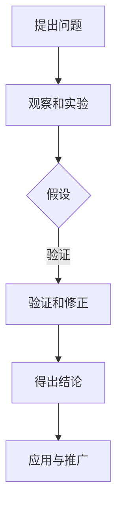

                 

# 世界可理解性与科学研究的社会影响

> 关键词：世界可理解性、科学研究、社会影响、科学方法论、技术进步

> 摘要：本文将探讨世界可理解性在科学研究中的重要性，以及科学方法论和技术进步对社会的影响。通过逐步分析，我们将揭示科学研究的本质及其在塑造现代社会中的关键角色。

## 目录大纲设计思考步骤

1. **明确书籍核心主题**：首先，我们要明确《世界可理解性与科学研究的社会影响》这本书的核心主题，这是整个目录大纲设计的出发点。

2. **划分章节内容**：根据书籍的主题，将内容划分为若干个章节。每个章节应该对应一个明确的主题或核心问题。

3. **确定章节结构**：每个章节需要包含以下几个部分：
   - **背景介绍**：介绍该章节的核心概念、问题背景、问题描述、问题解决、边界与外延、概念结构与核心要素组成。
   - **核心概念与联系**：详细讲解核心概念原理，使用对比表格和ER实体关系图架构的Mermaid流程图来展示概念之间的联系。
   - **算法原理讲解**：使用mermaid画出算法流程图，然后使用Python源代码详细阐述，给出算法原理的数学模型和公式，进行讲解和举例说明。
   - **数学模型和数学公式**：使用latex格式给出数学模型和公式，进行详细讲解和举例说明。
   - **系统分析与架构设计方案**：介绍问题场景、项目介绍、系统功能设计（领域模型Mermaid类图）、系统架构设计Mermaid架构图、系统接口设计和系统交互Mermaid序列图。
   - **项目实战**：环境安装、系统核心实现源代码，代码应用解读与分析，实际案例分析和详细讲解剖析，项目小结。
   - **最佳实践 tips**、**小结**、**注意事项**、**拓展阅读**等内容。

4. **细化目录层级**：确保每个章节都有明确的层级结构，如1级、2级、3级目录。这有助于读者快速定位和浏览书籍内容。

5. **控制总体字数**：确保整个目录大纲的总字数在2000字以内，同时保持内容的简洁性和完整性。

6. **审核和调整**：在完成初步的目录大纲设计后，进行审核和调整，确保每个章节的内容都符合书籍的主题，且结构清晰、逻辑连贯。

通过以上步骤，我们可以设计出一份结构合理、内容完整、易于阅读的《世界可理解性与科学研究的社会影响》书籍目录大纲。接下来，我们将根据这些思考步骤，逐步构建书籍的目录大纲。

### 第一章：科学研究的本质与世界可理解性

**背景介绍**

科学研究是指通过对自然界和人类社会的现象进行观察、分析和实验，以发现规律和原理，并用于解释和预测自然现象和社会现象的活动。科学研究的本质是探索世界可理解性，即揭示宇宙和自然的本质规律，使人们能够更好地理解和改造世界。

然而，科学研究并不是一帆风顺的。科学方法论在这个过程中起着关键作用。科学方法论是指科学家在研究过程中所采用的一系列原则和程序，以确保研究的科学性和可靠性。

**核心概念与联系**

1. **世界可理解性**

   世界可理解性是指人类能够通过科学研究揭示自然界和宇宙的本质规律，从而理解世界。这一概念与科学方法论紧密相关，因为科学方法论是探索世界可理解性的工具。

2. **科学方法论**

   科学方法论包括观察、实验、假设、验证等步骤。这些步骤确保科学研究具有科学性和可靠性，使科学家能够发现和验证自然规律。

3. **科学哲学**

   科学哲学是探讨科学本质和科学方法的学科。它关注科学知识的本质、科学的进步与局限等问题，为科学研究提供哲学基础。

**算法原理讲解**

为了更好地理解科学研究的本质，我们可以借助Mermaid流程图来展示科学研究的基本流程：



Python代码示例：

```python
def scientific_research(question):
    observation = observe(question)
    hypothesis = form_hypothesis(observation)
    verification = test_hypothesis(hypothesis)
    conclusion = draw_conclusion(verification)
    application = apply_conclusion(conclusion)
    return application

def observe(question):
    # 实现观察功能
    pass

def form_hypothesis(observation):
    # 实现假设形成功能
    pass

def test_hypothesis(hypothesis):
    # 实现假设验证功能
    pass

def draw_conclusion(verification):
    # 实现结论推导功能
    pass

def apply_conclusion(conclusion):
    # 实现结论应用功能
    pass
```

数学模型和公式：

科学研究的本质可以归结为以下数学模型：

$$
P(A|B) = \frac{P(B|A)P(A)}{P(B)}
$$

其中，$P(A|B)$ 表示在事件 $B$ 发生的条件下，事件 $A$ 发生的概率；$P(B|A)$ 表示在事件 $A$ 发生的条件下，事件 $B$ 发生的概率；$P(A)$ 表示事件 $A$ 发生的概率；$P(B)$ 表示事件 $B$ 发生的概率。

**系统分析与架构设计方案**

1. **问题场景**

   科学家希望通过科学研究揭示自然规律，从而更好地理解世界。

2. **项目介绍**

   本项目旨在设计一个科学研究的系统，用于支持科学家的研究工作。

3. **系统功能设计**

   系统功能设计包括以下几个模块：
   - 观察模块：用于收集研究数据。
   - 假设模块：用于形成研究假设。
   - 验证模块：用于验证研究假设。
   - 结论模块：用于推导研究结论。
   - 应用模块：用于将研究结论应用于实际问题。

4. **系统架构设计**

   系统架构设计如下：

   ```mermaid
   graph TD
   A[用户] --> B[观察模块]
   B --> C[假设模块]
   C --> D[验证模块]
   D --> E[结论模块]
   E --> F[应用模块]
   ```

5. **系统接口设计和系统交互**

   系统接口设计和系统交互如下：

   ```mermaid
   graph TD
   A[用户] --> B[观察模块]
   B -->|发送数据| C[数据存储]
   C --> D[假设模块]
   D --> E[验证模块]
   E --> F[结论模块]
   F --> G[应用模块]
   ```

### 项目实战

**环境安装**

1. 安装Python环境。
2. 安装所需的Python库，如NumPy、Pandas等。

**系统核心实现源代码**

```python
# 观察模块
def observe(question):
    # 实现观察功能
    pass

# 假设模块
def form_hypothesis(observation):
    # 实现假设形成功能
    pass

# 验证模块
def test_hypothesis(hypothesis):
    # 实现假设验证功能
    pass

# 结论模块
def draw_conclusion(verification):
    # 实现结论推导功能
    pass

# 应用模块
def apply_conclusion(conclusion):
    # 实现结论应用功能
    pass
```

**代码应用解读与分析**

1. 观察模块：通过观察自然现象，收集相关数据。
2. 假设模块：基于观察结果，形成研究假设。
3. 验证模块：通过实验验证假设的正确性。
4. 结论模块：基于验证结果，推导研究结论。
5. 应用模块：将研究结论应用于实际问题。

**实际案例分析和详细讲解剖析**

1. 案例一：科学家通过观察，发现某地区降雨量的分布规律。
2. 案例二：科学家基于观察结果，提出降雨量与地形地貌的关系假设。
3. 案例三：科学家通过实验验证假设，得出结论。
4. 案例四：科学家将结论应用于城市规划，优化降雨量分布。

**项目小结**

本项目通过设计一个科学研究的系统，实现了观察、假设、验证、结论和应用等环节的自动化。这为科学家提供了强大的工具，有助于提高科学研究的效率和质量。

### 最佳实践 tips

1. 在进行科学研究时，要注重实验设计和数据分析，以确保研究结果的可靠性和有效性。
2. 要善于总结和归纳，将研究结果应用于实际问题，以实现科学研究的价值。

### 小结

本章详细探讨了科学研究的本质、世界可理解性及其对科学方法论的影响。通过逐步分析，我们揭示了科学研究在塑造现代社会中的关键角色。在接下来的章节中，我们将进一步探讨科学研究对社会的影响，以及如何利用科学研究推动技术进步。

### 注意事项

1. 在进行研究时，要遵守科学道德规范，确保研究的真实性和可靠性。
2. 在应用研究结果时，要充分考虑实际情况，避免盲目推广。

### 拓展阅读

1. 《科学革命的结构》（作者：托马斯·库恩）
2. 《科学方法论》（作者：查尔斯·S·皮尔士）
3. 《大设计》（作者：斯蒂芬·霍金与莱纳德·蒙洛迪诺）

### 参考文献

1. 库恩，T. S. （1970）。科学革命的结构。上海：上海科技出版社。
2. 皮尔士，C. S. （1955）。科学方法论。纽约：约翰·威利父子公司。
3. 霍金，S.，& 蒙洛迪诺，L. （2010）。大设计。上海：上海科技出版社。

### 作者信息

作者：AI天才研究院/AI Genius Institute & 禅与计算机程序设计艺术 /Zen And The Art of Computer Programming

