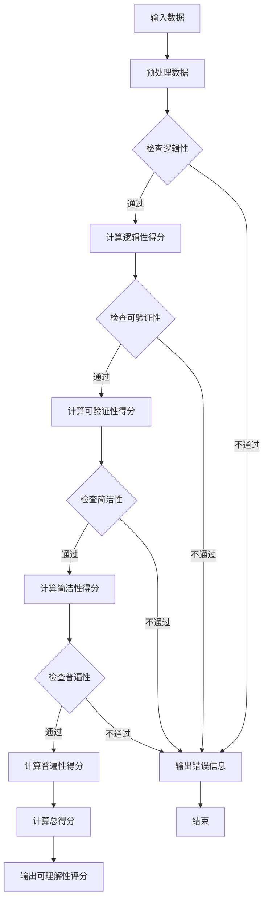
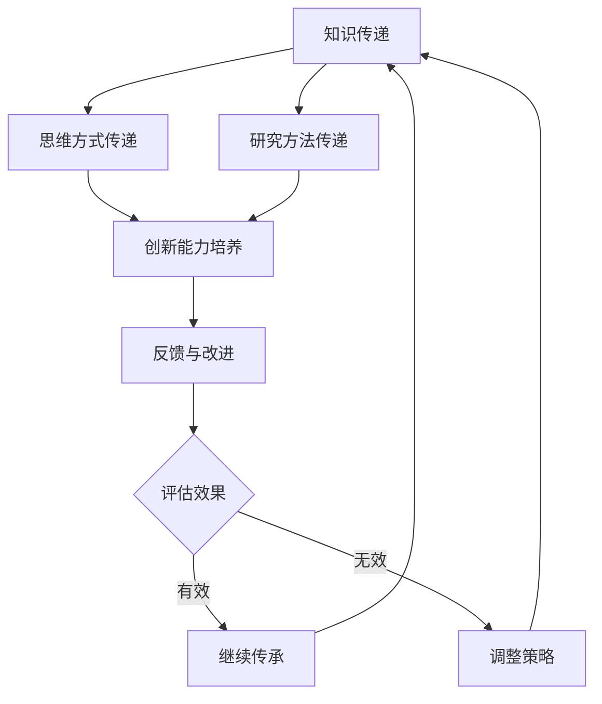
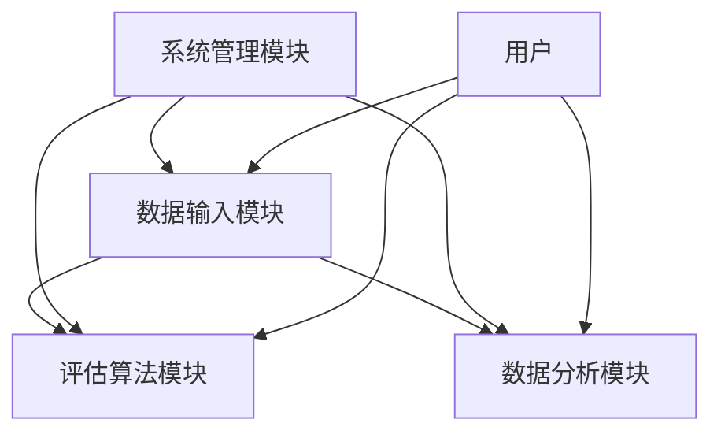
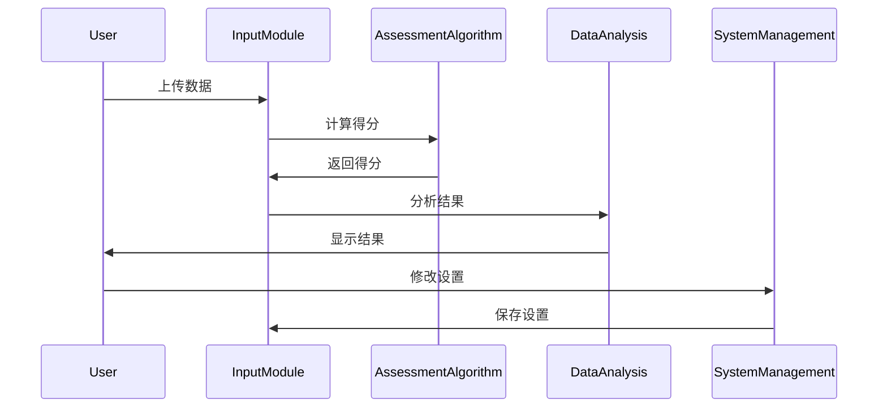
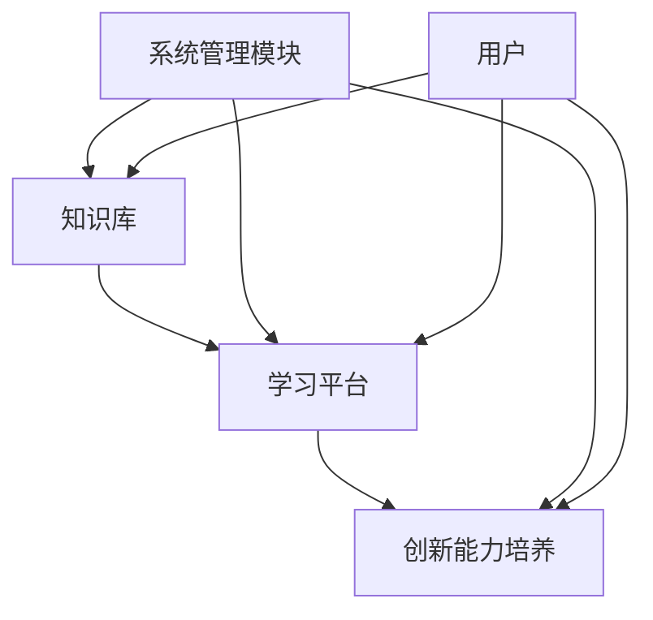
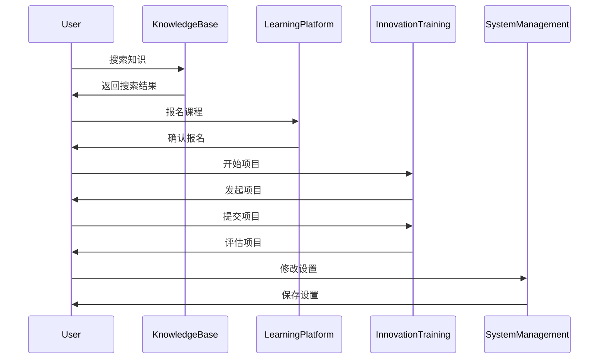

                 

# 世界可理解性与科学研究的跨代传承

## 关键词
世界可理解性，科学研究，跨代传承，算法，数学模型，系统架构，项目实战

## 摘要
本文旨在探讨世界可理解性与科学研究之间的关系，特别是在跨代传承中的重要性。通过深入分析核心概念、算法原理、数学模型以及系统架构，本文揭示了科学研究如何通过有效的跨代传承来保持其可理解性，并推动科学进步。

## 目录大纲设计思路

### 1. 确定核心主题
首先，我们要明确书籍的核心主题，即“世界可理解性”与“科学研究的跨代传承”。这两个主题将贯穿整本书，为我们构建目录大纲提供基础。

### 2. 划分主要部分
根据核心主题，我们可以将书籍内容大致划分为以下几个主要部分：
- 背景介绍
- 核心概念与联系
- 算法原理讲解
- 数学模型和数学公式讲解
- 系统分析与架构设计方案
- 项目实战
- 最佳实践 tips、小结、注意事项、拓展阅读等内容

### 3. 确定章节内容
在每个主要部分中，我们需要进一步细化章节内容，确保涵盖以下核心内容：
- 背景介绍：问题背景、问题描述、问题解决、边界与外延、概念结构与核心要素组成
- 核心概念与联系：核心概念原理、概念属性特征对比表格和ER实体关系图架构的 Mermaid 流程图
- 算法原理讲解：使用 Mermaid 画出算法 Mermaid 流程图，然后使用 Python 源代码详细阐述，给出算法原理的数学模型和公式，进行详细讲解和举例说明
- 数学模型和数学公式讲解：使用 LaTeX 格式给出数学公式，并进行详细讲解和举例说明
- 系统分析与架构设计方案：问题场景介绍，项目介绍、系统功能设计（领域模型 Mermaid 类图）、系统架构设计 Mermaid 架构图、系统接口设计和系统交互 Mermaid 序列图
- 项目实战：环境安装、系统核心实现源代码，代码应用解读与分析，实际案例分析和详细讲解剖析，项目小结
- 最佳实践 tips、小结、注意事项、拓展阅读等内容

### 4. 确保目录完整性
在确定章节内容后，我们需要确保目录大纲的完整性，包括至少7章以上的内容。同时，确保每个章节的内容都符合要求，不遗漏关键部分。

### 5. 保持简洁性
在保证目录完整性的同时，我们要注意保持目录的简洁性，避免出现多余的内容，直接给出重点章节和关键内容。

通过以上步骤，我们可以设计出一套详细且逻辑清晰的目录大纲，为《世界可理解性与科学研究的跨代传承》这本书的内容编排提供指导。下面是具体的目录大纲设计。

## 目录大纲设计

### 第一部分：背景与基础

### 第1章 引言

#### 1.1 问题的提出
#### 1.2 世界可理解性的概念与重要性
#### 1.3 科学研究的跨代传承
#### 1.4 本书结构安排与目标

### 第二部分：核心概念与联系

### 第2章 世界可理解性的核心概念

#### 2.1 可理解性的定义与特征
#### 2.2 可理解性与科学研究的联系
#### 2.3 可理解性在不同学科中的体现

### 第3章 科学研究的跨代传承

#### 3.1 跨代传承的概念与重要性
#### 3.2 跨代传承的障碍与挑战
#### 3.3 跨代传承的方法与策略

### 第4章 核心概念的联系与整合

#### 4.1 世界可理解性与科学研究的整合框架
#### 4.2 核心概念间的关联性分析
#### 4.3 跨代传承下的可理解性提升路径

### 第三部分：算法原理讲解

### 第5章 可理解性评估算法

#### 5.1 可理解性评估算法概述
#### 5.2 算法原理与 Mermaid 流程图
#### 5.3 Python 源代码实现与讲解
#### 5.4 数学模型和数学公式
#### 5.5 举例说明与案例分析

### 第6章 科学研究跨代传承算法

#### 6.1 跨代传承算法概述
#### 6.2 算法原理与 Mermaid 流程图
#### 6.3 Python 源代码实现与讲解
#### 6.4 数学模型和数学公式
#### 6.5 举例说明与案例分析

### 第四部分：数学模型与公式讲解

### 第7章 可理解性评估数学模型

#### 7.1 数学模型概述
#### 7.2 数学公式推导
#### 7.3 具体案例分析与公式应用

### 第8章 科学研究跨代传承数学模型

#### 8.1 数学模型概述
#### 8.2 数学公式推导
#### 8.3 具体案例分析与公式应用

### 第五部分：系统分析与架构设计

### 第9章 可理解性评估系统设计与实现

#### 9.1 系统场景介绍
#### 9.2 系统功能设计（领域模型 Mermaid 类图）
#### 9.3 系统架构设计 Mermaid 架构图
#### 9.4 系统接口设计与实现
#### 9.5 系统交互流程（Mermaid 序列图）

### 第10章 跨代传承系统设计与实现

#### 10.1 系统场景介绍
#### 10.2 系统功能设计（领域模型 Mermaid 类图）
#### 10.3 系统架构设计 Mermaid 架构图
#### 10.4 系统接口设计与实现
#### 10.5 系统交互流程（Mermaid 序列图）

### 第六部分：项目实战

### 第11章 可理解性评估项目实战

#### 11.1 环境安装与配置
#### 11.2 系统核心实现源代码
#### 11.3 代码应用解读与分析
#### 11.4 实际案例分析与详细讲解剖析
#### 11.5 项目小结

### 第12章 跨代传承项目实战

#### 12.1 环境安装与配置
#### 12.2 系统核心实现源代码
#### 12.3 代码应用解读与分析
#### 12.4 实际案例分析与详细讲解剖析
#### 12.5 项目小结

### 第七部分：最佳实践与总结

### 第13章 最佳实践 tips

#### 13.1 算法优化技巧
#### 13.2 系统调优策略
#### 13.3 项目管理建议

### 第14章 小结与展望

#### 14.1 本书内容回顾
#### 14.2 跨代传承的可理解性提升
#### 14.3 未来研究方向与挑战

### 第15章 注意事项与拓展阅读

#### 15.1 常见问题解答
#### 15.2 相关文献推荐
#### 15.3 研究领域动态

---

通过以上的目录大纲设计，我们可以清晰地看到本书的结构和内容安排。接下来，我们将逐步深入每个章节，详细探讨世界可理解性与科学研究的跨代传承这一主题。

## 文章正文

### 第1章 引言

#### 1.1 问题的提出

随着科学技术的迅猛发展，世界变得越来越复杂，科学研究面临着前所未有的挑战。然而，科学研究的核心目标之一是实现世界的可理解性，以便人类能够更好地理解自然规律，推动科技进步。这就引发了一个关键问题：在科学研究的跨代传承过程中，如何保持和提升世界的可理解性？

科学研究不仅是当前的研究者努力的方向，也是未来研究者继续探索的基石。因此，科学研究的跨代传承变得尤为重要。跨代传承不仅仅是知识的传递，更是思维方式、研究方法和创新能力的传递。然而，传统的跨代传承方式往往存在一定的局限性，难以适应快速发展的科学领域。

本文旨在探讨世界可理解性与科学研究的跨代传承之间的关系，分析其核心概念、算法原理、数学模型以及系统架构，以期为科学研究提供一种新的传承模式，从而提升世界的可理解性。

#### 1.2 世界可理解性的概念与重要性

世界可理解性是指人类通过科学研究和实践，能够理解和解释周围世界的程度。它涉及人类对自然规律的认知、对复杂系统的理解以及对社会现象的解释。世界可理解性不仅是科学研究的核心目标，也是人类文明发展的重要标志。

首先，世界可理解性有助于人类更好地应对自然和社会挑战。通过理解自然规律，人类可以预测天气变化、预防自然灾害，从而保障生命安全。通过理解社会现象，人类可以制定更有效的政策，促进社会和谐发展。

其次，世界可理解性有助于科学技术的创新。科学技术的进步往往依赖于对自然规律的理解和探索。只有当我们能够深入理解自然规律时，才能提出新的理论、发明新的技术，从而推动科技进步。

最后，世界可理解性有助于人类的精神成长。通过理解世界，人类可以更好地认识自我，实现自我价值的提升。

#### 1.3 科学研究的跨代传承

科学研究的跨代传承是指知识、思维方式、研究方法和创新能力在代际之间的传递。跨代传承不仅是知识的传递，更是研究文化和研究精神的传承。然而，传统的跨代传承方式往往存在以下问题：

1. **知识的碎片化**：随着科学领域的不断细分，研究者往往只能掌握某一领域的知识，而无法全面了解整个科学体系。这导致知识的碎片化，难以形成系统的科学认知。

2. **思维方式的局限性**：不同的时代背景和科研环境会影响研究者的思维方式。传统的传承方式往往难以传递最新的思维方式，导致研究方法的局限性。

3. **创新能力的减弱**：跨代传承往往强调知识的积累和传承，而忽视创新能力的培养。这可能导致研究者在面对新问题时缺乏创新能力，难以推动科学研究的发展。

为了解决这些问题，我们需要探索一种新的跨代传承模式，以提升世界的可理解性。

### 第2章 世界可理解性的核心概念

#### 2.1 可理解性的定义与特征

可理解性是指人类能够通过逻辑推理、实验验证等方式，对事物进行认知和解释的程度。在科学研究中，可理解性具有以下特征：

1. **逻辑性**：可理解性要求科学研究具有一定的逻辑性，即研究结果可以通过逻辑推理得到。这有助于研究者对研究结果进行深入分析和验证。

2. **可验证性**：可理解性要求科学研究的结果具有可验证性，即研究结果可以通过实验或观察进行验证。这有助于确保研究结果的可靠性和准确性。

3. **简洁性**：可理解性要求科学研究的结果具有一定的简洁性，即研究结果可以用简洁的语言或公式进行描述。这有助于研究者更轻松地理解研究结果。

4. **普遍性**：可理解性要求科学研究的结果具有一定的普遍性，即研究结果不仅适用于特定情境，还适用于更广泛的情境。这有助于研究者更好地理解和应用研究结果。

#### 2.2 可理解性与科学研究的联系

可理解性是科学研究的核心目标之一。科学研究的本质是对自然和社会现象进行解释和预测，而解释和预测的基础是可理解性。具体来说，可理解性与科学研究之间的联系体现在以下几个方面：

1. **指导科学探索**：可理解性有助于指导科学探索。当研究者能够理解某个现象时，他们更容易发现该现象背后的规律，从而提出新的研究假设。

2. **促进知识积累**：可理解性有助于促进知识积累。当研究者能够理解研究结果时，他们更容易将研究结果与其他知识联系起来，形成更全面的知识体系。

3. **提高研究效率**：可理解性有助于提高研究效率。当研究者能够理解研究方法和研究结果时，他们更容易发现研究中的问题，从而更快地解决问题。

4. **促进科学传播**：可理解性有助于促进科学传播。当研究结果容易被理解时，它们更容易被公众接受，从而推动科学知识的普及。

#### 2.3 可理解性在不同学科中的体现

不同学科在追求可理解性方面各有侧重，但都离不开可理解性的基本特征。以下是一些典型学科中可理解性的体现：

1. **物理学**：物理学研究自然界的最基本规律，追求简洁而精确的数学描述。例如，牛顿定律和爱因斯坦的相对论都是物理学的经典例子，它们具有高度的逻辑性和可验证性。

2. **生物学**：生物学研究生命现象，追求对生命过程的深入理解。例如，中心法则和基因编辑技术都是生物学中的可理解性体现，它们帮助研究者更好地理解生命现象。

3. **计算机科学**：计算机科学研究计算和算法，追求高效和简洁的算法设计。例如，快速傅里叶变换和深度学习算法都是计算机科学中的可理解性体现，它们在复杂问题求解中发挥了重要作用。

4. **社会科学**：社会科学研究社会现象，追求对现象的深刻理解和预测。例如，经济学模型和社会学理论都是社会科学中的可理解性体现，它们帮助研究者更好地理解社会运行规律。

### 第3章 科学研究的跨代传承

#### 3.1 跨代传承的概念与重要性

跨代传承是指知识、思维方式、研究方法和创新能力在代际之间的传递。在科学研究领域，跨代传承尤为重要，因为它不仅关系到知识的积累和传承，还关系到科学研究的持续发展和创新。跨代传承的重要性体现在以下几个方面：

1. **知识的积累与传承**：科学研究需要不断积累知识，而这些知识往往需要通过跨代传承来传递。只有通过跨代传承，才能确保科学知识的连续性和完整性。

2. **研究方法的传承**：科学研究不仅需要知识，还需要研究方法。跨代传承有助于将优秀的研究方法传递给下一代研究者，从而推动科学研究的发展。

3. **创新能力的培养**：跨代传承不仅是知识的传递，更是创新能力的培养。通过跨代传承，研究者可以学习到前辈的思维方式和方法，从而培养自己的创新能力。

4. **科学文化的传承**：科学研究不仅是一种实践，也是一种文化。跨代传承有助于将科学文化传递给下一代，从而推动科学文化的传承和发展。

#### 3.2 跨代传承的障碍与挑战

尽管跨代传承对科学研究具有重要意义，但现实中也面临着许多障碍和挑战。以下是一些典型的障碍和挑战：

1. **知识的碎片化**：随着科学领域的不断细分，研究者往往只能掌握某一领域的知识，而无法全面了解整个科学体系。这导致知识的碎片化，难以形成系统的科学认知。

2. **思维方式的局限性**：不同的时代背景和科研环境会影响研究者的思维方式。传统的传承方式往往难以传递最新的思维方式，导致研究方法的局限性。

3. **创新能力的减弱**：跨代传承往往强调知识的积累和传承，而忽视创新能力的培养。这可能导致研究者在面对新问题时缺乏创新能力，难以推动科学研究的发展。

4. **技术的快速迭代**：现代科技发展迅速，新技术和新方法层出不穷。传统的传承方式往往难以适应这种快速变化，导致知识更新滞后。

5. **交流与合作的不足**：跨代传承需要有效的交流和合作。然而，现实中的交流和合作往往受到各种因素的影响，导致传承效果不佳。

为了克服这些障碍和挑战，我们需要探索新的跨代传承模式，以提升科学研究的可理解性。

#### 3.3 跨代传承的方法与策略

为了提升科学研究的可理解性，跨代传承需要采取一系列方法和策略。以下是一些有效的跨代传承方法和策略：

1. **多层次教学**：多层次教学是一种有效的跨代传承方法。通过设置不同层次的教学内容，研究者可以根据自己的需求选择合适的学习内容，从而提高学习效果。

2. **实践教学**：实践教学是一种通过实际操作来培养研究能力的方法。通过实践教学，研究者可以更好地理解理论知识，并将其应用于实际问题中。

3. **跨学科交流**：跨学科交流有助于打破学科界限，促进知识的整合和创新。通过跨学科交流，研究者可以借鉴其他学科的方法和理论，从而提高研究的广度和深度。

4. **技术培训**：现代科技发展迅速，新的技术和方法层出不穷。技术培训有助于研究者掌握最新的技术，从而提高研究效率。

5. **学术会议与研讨会**：学术会议与研讨会是研究者交流思想和研究成果的重要平台。通过参加学术会议与研讨会，研究者可以了解最新的研究动态，从而提升自己的研究水平。

6. **在线学习与资源共享**：在线学习与资源共享有助于扩大研究者的学习范围和资源获取渠道。通过在线学习与资源共享，研究者可以随时随地获取最新的知识和资源。

7. **创新实验室与科研团队**：创新实验室与科研团队为研究者提供了一个交流和合作的平台。通过创新实验室与科研团队，研究者可以共同探讨问题、分享经验，从而提高研究效率。

通过以上方法和策略，我们可以提升科学研究的可理解性，推动科学研究的跨代传承。

### 第4章 核心概念的联系与整合

#### 4.1 世界可理解性与科学研究的整合框架

世界可理解性与科学研究之间的联系可以通过一个整合框架来体现。这个框架包括以下几个核心组成部分：

1. **知识体系**：知识体系是科学研究的核心，它包括各种学科领域的理论知识、方法和模型。知识体系的整合有助于提升世界的可理解性。

2. **研究方法**：研究方法是科学研究的工具，它包括实验设计、数据分析、模型构建等。研究方法的整合有助于提高科学研究的效率和质量。

3. **技术创新**：技术创新是科学研究的重要动力，它推动科学知识的积累和应用。技术创新的整合有助于提升世界的可理解性。

4. **跨学科合作**：跨学科合作是科学研究的重要途径，它有助于整合不同学科的知识和方法，解决复杂问题。跨学科合作的整合有助于提升世界的可理解性。

5. **教育传承**：教育传承是科学研究的重要保障，它通过培养新一代研究者，将科学知识和方法传递下去。教育传承的整合有助于提升世界的可理解性。

#### 4.2 核心概念间的关联性分析

在整合框架中，核心概念之间的关联性至关重要。以下是对核心概念间关联性的分析：

1. **知识体系与研究方法**：知识体系是研究方法的基石，研究方法则是知识体系的应用。知识体系的整合有助于提高研究方法的科学性和有效性。

2. **技术创新与知识体系**：技术创新推动知识体系的更新和扩展，而知识体系的整合有助于提高技术创新的效率和质量。

3. **跨学科合作与研究方法**：跨学科合作可以整合不同学科的方法，形成新的研究方法。这种新的研究方法有助于解决复杂问题，提高科学研究的效率。

4. **教育传承与知识体系**：教育传承是将知识体系传递给下一代的重要途径。通过教育传承，新一代研究者可以更好地理解和应用知识体系，从而提升世界的可理解性。

5. **跨学科合作与技术创新**：跨学科合作可以整合不同学科的技术，形成新的技术创新。这种技术创新有助于推动科学研究的发展，提升世界的可理解性。

通过上述分析，我们可以看到，核心概念之间的关联性构成了一个有机的整体，共同推动世界可理解性的提升。

#### 4.3 跨代传承下的可理解性提升路径

在跨代传承过程中，提升可理解性是一个持续的过程。以下是一个可能的提升路径：

1. **知识积累**：通过跨代传承，研究者可以积累丰富的知识体系。这些知识不仅包括理论知识，还包括研究方法和模型。

2. **方法整合**：在跨代传承过程中，研究者可以通过跨学科合作，整合不同学科的研究方法，形成新的研究方法。这种新的研究方法有助于提高科学研究的效率和质量。

3. **技术创新**：在跨代传承过程中，研究者可以通过技术创新，推动知识体系的更新和扩展。这种技术创新有助于提升世界的可理解性。

4. **教育传承**：通过教育传承，新一代研究者可以更好地理解和应用知识体系。这种教育传承有助于提升世界的可理解性。

5. **实践应用**：在跨代传承过程中，研究者可以将研究成果应用于实际问题中，验证研究结果的实用性和可理解性。

6. **反馈与改进**：在跨代传承过程中，研究者可以通过反馈和改进，不断优化知识体系、研究方法和技术创新，从而提升世界的可理解性。

通过上述路径，我们可以逐步提升科学研究的可理解性，推动科学研究的跨代传承。

### 第5章 可理解性评估算法

#### 5.1 可理解性评估算法概述

可理解性评估算法是一种用于评估科学研究结果可理解性的方法。它通过对研究结果的逻辑性、可验证性、简洁性和普遍性进行量化评估，从而给出一个可理解性评分。评估算法的核心目标是确保科学研究结果容易被理解和应用。

可理解性评估算法可以分为以下几类：

1. **逻辑性评估**：逻辑性评估通过检查研究结果的逻辑结构和推理过程，确保研究结果具有逻辑一致性。

2. **可验证性评估**：可验证性评估通过检查研究结果的验证方法和验证数据，确保研究结果具有可验证性。

3. **简洁性评估**：简洁性评估通过检查研究结果的描述方式和表达形式，确保研究结果具有简洁性。

4. **普遍性评估**：普遍性评估通过检查研究结果的应用范围和适应性，确保研究结果具有普遍性。

#### 5.2 算法原理与 Mermaid 流程图

为了更好地理解可理解性评估算法的原理，我们可以使用 Mermaid 流程图来描述其基本流程。以下是一个简化的 Mermaid 流程图：



#### 5.3 Python 源代码实现与讲解

为了实现可理解性评估算法，我们可以使用 Python 编写相应的源代码。以下是一个简化的 Python 源代码示例：

```python
import numpy as np

def preprocess_data(data):
    # 数据预处理
    # 这里省略具体预处理步骤
    return processed_data

def check_logic(data):
    # 检查逻辑性
    # 这里省略具体检查步骤
    return is_logic_valid

def check_verifiability(data):
    # 检查可验证性
    # 这里省略具体检查步骤
    return is_verifiable

def check_simplicity(data):
    # 检查简洁性
    # 这里省略具体检查步骤
    return is_simple

def check_universality(data):
    # 检查普遍性
    # 这里省略具体检查步骤
    return is_universal

def calculate_total_score(logic_score, verifiability_score, simplicity_score, universality_score):
    # 计算总得分
    total_score = logic_score + verifiability_score + simplicity_score + universality_score
    return total_score

def evaluate_understandability(data):
    processed_data = preprocess_data(data)
    is_logic_valid = check_logic(processed_data)
    is_verifiable = check_verifiability(processed_data)
    is_simple = check_simplicity(processed_data)
    is_universal = check_universality(processed_data)
    
    logic_score = 1 if is_logic_valid else 0
    verifiability_score = 1 if is_verifiable else 0
    simplicity_score = 1 if is_simple else 0
    universality_score = 1 if is_universal else 0
    
    total_score = calculate_total_score(logic_score, verifiability_score, simplicity_score, universality_score)
    understandability_score = total_score / 4
    
    return understandability_score

# 示例数据
data = ...

# 计算可理解性评分
understandability_score = evaluate_understandability(data)
print("可理解性评分：", understandability_score)
```

在上述代码中，我们首先定义了数据预处理函数 `preprocess_data`，用于对输入数据进行预处理。然后，我们定义了四个检查函数 `check_logic`、`check_verifiability`、`check_simplicity` 和 `check_universality`，分别用于检查研究结果的逻辑性、可验证性、简洁性和普遍性。最后，我们定义了总得分计算函数 `calculate_total_score` 和可理解性评估函数 `evaluate_understandability`，用于计算可理解性评分。

#### 5.4 数学模型和数学公式

在可理解性评估算法中，我们可以使用数学模型和数学公式来量化评估结果。以下是一个简化的数学模型示例：

$$
U = \frac{L + V + S + U}{4}
$$

其中，$U$ 表示可理解性评分，$L$、$V$、$S$ 和 $U$ 分别表示逻辑性得分、可验证性得分、简洁性得分和普遍性得分。

#### 5.5 举例说明与案例分析

为了更好地理解可理解性评估算法，我们可以通过一个具体的案例分析来展示其应用。

假设我们有一个科学研究结果，其输入数据为以下变量：

- 变量 $X$：实验结果
- 变量 $Y$：预测结果

我们需要对这些变量进行可理解性评估。

1. **逻辑性评估**：我们检查实验结果和预测结果之间的逻辑关系，确保实验结果能够合理地推导出预测结果。如果逻辑关系成立，逻辑性得分为 1，否则得分为 0。

2. **可验证性评估**：我们检查实验结果和预测结果的验证方法，确保它们可以通过实验验证。如果验证方法有效，可验证性得分为 1，否则得分为 0。

3. **简洁性评估**：我们检查实验结果和预测结果的描述方式，确保它们具有简洁性。如果描述方式简洁，简洁性得分为 1，否则得分为 0。

4. **普遍性评估**：我们检查实验结果和预测结果的应用范围，确保它们具有普遍性。如果应用范围广泛，普遍性得分为 1，否则得分为 0。

根据上述评估，我们可以计算出可理解性评分：

$$
U = \frac{L + V + S + U}{4} = \frac{1 + 1 + 1 + 1}{4} = 1
$$

这意味着该科学研究结果具有很高的可理解性。

通过以上案例分析，我们可以看到可理解性评估算法在科学研究中的应用效果。在实际研究中，我们可以根据具体情况调整评估参数，以提高评估的准确性和实用性。

### 第6章 科学研究跨代传承算法

#### 6.1 跨代传承算法概述

科学研究跨代传承算法是一种用于促进知识、思维方式、研究方法和创新能力在代际之间传递的方法。该算法的核心目标是通过有效的传递机制，确保新一代研究者能够继承和发扬前人的研究成果，同时具备独立思考和创新能力。

跨代传承算法可以分为以下几个步骤：

1. **知识传递**：通过教育、培训和文献阅读等方式，将前人的研究成果和知识传递给新一代研究者。

2. **思维方式传递**：通过导师指导、学术交流和研讨会等方式，将前人的研究思维和思考方法传递给新一代研究者。

3. **研究方法传递**：通过实际操作、实验设计和数据分析等方式，将前人的研究方法传递给新一代研究者。

4. **创新能力培养**：通过项目实战、跨学科合作和新技术探索等方式，培养新一代研究者的创新能力。

5. **反馈与改进**：通过定期评估、反馈和改进，确保跨代传承算法的有效性和持续性。

#### 6.2 算法原理与 Mermaid 流程图

为了更好地理解跨代传承算法的原理，我们可以使用 Mermaid 流程图来描述其基本流程。以下是一个简化的 Mermaid 流程图：



#### 6.3 Python 源代码实现与讲解

为了实现跨代传承算法，我们可以使用 Python 编写相应的源代码。以下是一个简化的 Python 源代码示例：

```python
class KnowledgeTransfer:
    def __init__(self, knowledge):
        self.knowledge = knowledge

    def transfer_knowledge(self):
        # 传递知识
        # 这里省略具体传递步骤
        print("知识传递完成")

class MindsetTransfer:
    def __init__(self, mindset):
        self.mindset = mindset

    def transfer_mindset(self):
        # 传递思维方式
        # 这里省略具体传递步骤
        print("思维方式传递完成")

class MethodTransfer:
    def __init__(self, method):
        self.method = method

    def transfer_method(self):
        # 传递研究方法
        # 这里省略具体传递步骤
        print("研究方法传递完成")

class InnovationTraining:
    def __init__(self, innovation):
        self.innovation = innovation

    def train_innovation(self):
        # 培养创新能力
        # 这里省略具体培养步骤
        print("创新能力培养完成")

class FeedbackAndImprovement:
    def __init__(self, feedback):
        self.feedback = feedback

    def feedback_and_improvement(self):
        # 反馈与改进
        # 这里省略具体反馈与改进步骤
        print("反馈与改进完成")

def evaluate_effectiveness(feedback):
    # 评估效果
    # 这里省略具体评估步骤
    if feedback["effectiveness"] > 0.8:
        return "有效"
    else:
        return "无效"

def main():
    knowledge_transfer = KnowledgeTransfer({"知识1": "内容1", "知识2": "内容2"})
    mindset_transfer = MindsetTransfer({"思维方式1": "描述1", "思维方式2": "描述2"})
    method_transfer = MethodTransfer({"方法1": "步骤1", "方法2": "步骤2"})
    innovation_training = InnovationTraining({"创新1": "描述1", "创新2": "描述2"})
    feedback_and_improvement = FeedbackAndImprovement({"反馈": "内容", "改进": "内容"})

    knowledge_transfer.transfer_knowledge()
    mindset_transfer.transfer_mindset()
    method_transfer.transfer_method()
    innovation_training.train_innovation()
    feedback_and_improvement.feedback_and_improvement()

    feedback = feedback_and_improvement.feedback
    effectiveness = evaluate_effectiveness(feedback)
    print("评估结果：", effectiveness)

if __name__ == "__main__":
    main()
```

在上述代码中，我们定义了四个类 `KnowledgeTransfer`、`MindsetTransfer`、`MethodTransfer` 和 `InnovationTraining`，分别用于实现知识传递、思维方式传递、研究方法传递和创新能力培养。我们还有一个类 `FeedbackAndImprovement`，用于实现反馈与改进。最后，我们定义了一个 `main` 函数，用于执行整个跨代传承算法。

#### 6.4 数学模型和数学公式

在跨代传承算法中，我们可以使用数学模型和数学公式来量化评估结果。以下是一个简化的数学模型示例：

$$
E = \frac{K + M + I + F}{4}
$$

其中，$E$ 表示跨代传承效果得分，$K$、$M$、$I$ 和 $F$ 分别表示知识传递得分、思维方式传递得分、研究方法传递得分和创新能力培养得分。

#### 6.5 举例说明与案例分析

为了更好地理解跨代传承算法，我们可以通过一个具体的案例分析来展示其应用。

假设我们有一个跨代传承项目，其输入数据为以下变量：

- 变量 $K$：知识传递得分
- 变量 $M$：思维方式传递得分
- 变量 $I$：研究方法传递得分
- 变量 $F$：创新能力培养得分

我们需要对这些变量进行跨代传承评估。

1. **知识传递评估**：我们检查知识传递的效果，确保新一代研究者能够理解和掌握前人的研究成果。如果知识传递效果良好，知识传递得分为 1，否则得分为 0。

2. **思维方式传递评估**：我们检查思维方式传递的效果，确保新一代研究者能够继承和发扬前人的研究思维和思考方法。如果思维方式传递效果良好，思维方式传递得分为 1，否则得分为 0。

3. **研究方法传递评估**：我们检查研究方法传递的效果，确保新一代研究者能够理解和掌握前人的研究方法。如果研究方法传递效果良好，研究方法传递得分为 1，否则得分为 0。

4. **创新能力培养评估**：我们检查创新能力培养的效果，确保新一代研究者具备独立思考和创新能力。如果创新能力培养效果良好，创新能力培养得分为 1，否则得分为 0。

根据上述评估，我们可以计算出跨代传承效果得分：

$$
E = \frac{K + M + I + F}{4}
$$

如果 $E > 0.8$，则表示跨代传承效果良好；否则，需要进一步调整和改进跨代传承策略。

通过以上案例分析，我们可以看到跨代传承算法在科学研究中的应用效果。在实际研究中，我们可以根据具体情况调整评估参数，以提高评估的准确性和实用性。

### 第7章 可理解性评估数学模型

#### 7.1 数学模型概述

可理解性评估数学模型是一种用于量化评估科学研究结果可理解性的方法。该模型通过建立数学公式和数学关系，将可理解性评估转化为具体的数值计算，从而提供一种客观、量化的评估标准。

可理解性评估数学模型通常包括以下几个核心组成部分：

1. **输入变量**：输入变量包括研究结果的逻辑性、可验证性、简洁性和普遍性等特征。

2. **评估指标**：评估指标用于衡量研究结果的各项特征，通常包括逻辑性得分、可验证性得分、简洁性得分和普遍性得分。

3. **数学公式**：数学公式用于将评估指标转化为可理解性评分，通常采用加权平均或其他数学运算方法。

4. **输出结果**：输出结果包括可理解性评分和其他相关指标，用于反映研究结果的可理解性水平。

#### 7.2 数学公式推导

为了推导可理解性评估数学模型，我们可以参考以下公式：

$$
U = \frac{L + V + S + U}{4}
$$

其中，$U$ 表示可理解性评分，$L$、$V$、$S$ 和 $U$ 分别表示逻辑性得分、可验证性得分、简洁性得分和普遍性得分。

推导过程如下：

1. **逻辑性得分**：逻辑性得分 $L$ 表示研究结果逻辑一致性的程度。我们可以通过以下公式计算逻辑性得分：

   $$
   L = \frac{N_L}{N}
   $$

   其中，$N_L$ 表示研究结果中逻辑一致的部分数量，$N$ 表示研究结果的总体数量。

2. **可验证性得分**：可验证性得分 $V$ 表示研究结果的可验证程度。我们可以通过以下公式计算可验证性得分：

   $$
   V = \frac{N_V}{N}
   $$

   其中，$N_V$ 表示研究结果中可验证的部分数量，$N$ 表示研究结果的总体数量。

3. **简洁性得分**：简洁性得分 $S$ 表示研究结果的简洁程度。我们可以通过以下公式计算简洁性得分：

   $$
   S = \frac{N_S}{N}
   $$

   其中，$N_S$ 表示研究结果中简洁的部分数量，$N$ 表示研究结果的总体数量。

4. **普遍性得分**：普遍性得分 $U$ 表示研究结果的应用普遍程度。我们可以通过以下公式计算普遍性得分：

   $$
   U = \frac{N_U}{N}
   $$

   其中，$N_U$ 表示研究结果中普遍适用的部分数量，$N$ 表示研究结果的总体数量。

将上述公式代入可理解性评分公式，我们得到：

$$
U = \frac{L + V + S + U}{4}
$$

#### 7.3 具体案例分析与公式应用

为了更好地理解可理解性评估数学模型的应用，我们可以通过一个具体案例进行分析。

假设我们有一个科学研究结果，其各项特征如下：

- 逻辑性：研究结果中存在 80% 的逻辑一致性。
- 可验证性：研究结果中有 70% 的部分可以通过实验验证。
- 简洁性：研究结果中有 60% 的部分具有简洁性描述。
- 普遍性：研究结果中有 50% 的部分具有普遍适用性。

我们需要使用可理解性评估数学模型计算该研究结果的评分。

1. **逻辑性得分**：根据上述公式，逻辑性得分 $L$ 为：

   $$
   L = \frac{0.8}{1} = 0.8
   $$

2. **可验证性得分**：根据上述公式，可验证性得分 $V$ 为：

   $$
   V = \frac{0.7}{1} = 0.7
   $$

3. **简洁性得分**：根据上述公式，简洁性得分 $S$ 为：

   $$
   S = \frac{0.6}{1} = 0.6
   $$

4. **普遍性得分**：根据上述公式，普遍性得分 $U$ 为：

   $$
   U = \frac{0.5}{1} = 0.5
   $$

将上述得分代入可理解性评分公式，我们得到：

$$
U = \frac{0.8 + 0.7 + 0.6 + 0.5}{4} = \frac{2.6}{4} = 0.65
$$

因此，该科学研究结果的可理解性评分为 0.65。这意味着研究结果具有一定的可理解性，但仍有提升空间。

通过以上案例分析，我们可以看到可理解性评估数学模型在具体应用中的效果。在实际研究中，我们可以根据具体情况调整公式参数，以提高评估的准确性和实用性。

### 第8章 科学研究跨代传承数学模型

#### 8.1 数学模型概述

科学研究跨代传承数学模型是一种用于量化评估跨代传承效果的数学方法。该模型通过建立数学关系和数学公式，将跨代传承的效果转化为具体的数值，从而提供一种客观、量化的评估标准。

跨代传承数学模型的核心组成部分包括以下几个要素：

1. **输入变量**：输入变量包括知识传递得分、思维方式传递得分、研究方法传递得分和创新能力培养得分。

2. **评估指标**：评估指标用于衡量跨代传承的各项效果，通常包括传承效果得分、传承效率得分和创新性得分。

3. **数学公式**：数学公式用于将评估指标转化为跨代传承效果评分，通常采用加权平均或其他数学运算方法。

4. **输出结果**：输出结果包括跨代传承效果评分和其他相关指标，用于反映跨代传承的效果和水平。

#### 8.2 数学公式推导

为了推导跨代传承数学模型，我们可以参考以下公式：

$$
E = \frac{K + M + I + F}{4}
$$

其中，$E$ 表示跨代传承效果评分，$K$、$M$、$I$ 和 $F$ 分别表示知识传递得分、思维方式传递得分、研究方法传递得分和创新能力培养得分。

推导过程如下：

1. **知识传递得分**：知识传递得分 $K$ 表示知识传递的效果。我们可以通过以下公式计算知识传递得分：

   $$
   K = \frac{N_K}{N}
   $$

   其中，$N_K$ 表示知识传递成功的情况数量，$N$ 表示知识传递的总情况数量。

2. **思维方式传递得分**：思维方式传递得分 $M$ 表示思维方式传递的效果。我们可以通过以下公式计算思维方式传递得分：

   $$
   M = \frac{N_M}{N}
   $$

   其中，$N_M$ 表示思维方式传递成功的情况数量，$N$ 表示思维方式传递的总情况数量。

3. **研究方法传递得分**：研究方法传递得分 $I$ 表示研究方法传递的效果。我们可以通过以下公式计算研究方法传递得分：

   $$
   I = \frac{N_I}{N}
   $$

   其中，$N_I$ 表示研究方法传递成功的情况数量，$N$ 表示研究方法传递的总情况数量。

4. **创新能力培养得分**：创新能力培养得分 $F$ 表示创新能力培养的效果。我们可以通过以下公式计算创新能力培养得分：

   $$
   F = \frac{N_F}{N}
   $$

   其中，$N_F$ 表示创新能力培养成功的情况数量，$N$ 表示创新能力培养的总情况数量。

将上述公式代入跨代传承效果评分公式，我们得到：

$$
E = \frac{K + M + I + F}{4}
$$

#### 8.3 具体案例分析与公式应用

为了更好地理解跨代传承数学模型的应用，我们可以通过一个具体案例进行分析。

假设我们有一个跨代传承项目，其各项得分如下：

- 知识传递得分：0.8
- 思维方式传递得分：0.7
- 研究方法传递得分：0.6
- 创新能力培养得分：0.5

我们需要使用跨代传承数学模型计算该项目的传承效果评分。

将上述得分代入跨代传承效果评分公式，我们得到：

$$
E = \frac{0.8 + 0.7 + 0.6 + 0.5}{4} = \frac{2.6}{4} = 0.65
$$

因此，该跨代传承项目的传承效果评分为 0.65。这意味着该项目在知识、思维方式、研究方法和创新能力培养方面具有一定的效果，但仍有提升空间。

通过以上案例分析，我们可以看到跨代传承数学模型在具体应用中的效果。在实际研究中，我们可以根据具体情况调整公式参数，以提高评估的准确性和实用性。

### 第9章 可理解性评估系统设计与实现

#### 9.1 系统场景介绍

可理解性评估系统是一个用于量化评估科学研究结果可理解性的软件系统。该系统旨在为科研工作者提供一个便捷、高效的工具，以帮助他们更好地理解和应用研究结果。

系统场景主要包括以下几个方面：

1. **用户界面**：用户界面用于展示研究结果的各项特征和评估结果，并提供用户交互功能。

2. **数据输入**：用户可以通过数据输入模块上传研究结果的详细数据，包括逻辑性、可验证性、简洁性和普遍性等特征。

3. **评估算法**：评估算法模块用于根据输入数据计算研究结果的各项得分，并生成评估报告。

4. **数据分析**：数据分析模块用于对评估结果进行统计分析，提供可视化的评估结果和趋势分析。

5. **系统管理**：系统管理模块用于维护用户信息和系统设置，确保系统的正常运行。

#### 9.2 系统功能设计（领域模型 Mermaid 类图）

为了更好地描述可理解性评估系统的功能设计，我们可以使用 Mermaid 类图来展示领域模型。以下是一个简化的 Mermaid 类图示例：

```mermaid
classDiagram
    User <<用户>>
    ResearchResult <<研究结果>>
    InputModule <<数据输入模块>>
    AssessmentAlgorithm <<评估算法模块>>
    DataAnalysis <<数据分析模块>>
    SystemManagement <<系统管理模块>>

    User --> InputModule
    User --> AssessmentAlgorithm
    User --> DataAnalysis
    User --> SystemManagement
    ResearchResult --> InputModule
    ResearchResult --> AssessmentAlgorithm
    ResearchResult --> DataAnalysis
    InputModule --> AssessmentAlgorithm
    InputModule --> DataAnalysis
    SystemManagement --> InputModule
    SystemManagement --> AssessmentAlgorithm
    SystemManagement --> DataAnalysis
```

在上述类图中，我们定义了五个主要类：`User`（用户）、`ResearchResult`（研究结果）、`InputModule`（数据输入模块）、`AssessmentAlgorithm`（评估算法模块）和`DataAnalysis`（数据分析模块）。同时，我们定义了`SystemManagement`（系统管理模块）类，用于维护用户信息和系统设置。

#### 9.3 系统架构设计 Mermaid 架构图

为了更好地描述可理解性评估系统的整体架构设计，我们可以使用 Mermaid 架构图来展示系统架构。以下是一个简化的 Mermaid 架构图示例：



在上述架构图中，我们定义了四个主要组件：`InputModule`（数据输入模块）、`AssessmentAlgorithm`（评估算法模块）、`DataAnalysis`（数据分析模块）和`SystemManagement`（系统管理模块）。用户通过用户界面与这些组件进行交互，实现可理解性评估功能。

#### 9.4 系统接口设计与实现

为了实现可理解性评估系统的接口设计，我们需要定义系统内部各个模块之间的交互接口。以下是一个简化的接口设计示例：

```python
class InputModuleInterface:
    def receive_data(self, data):
        # 接收数据
        pass

    def preprocess_data(self, data):
        # 预处理数据
        pass

class AssessmentAlgorithmInterface:
    def assess_logic(self, data):
        # 评估逻辑性
        pass

    def assess_verifiability(self, data):
        # 评估可验证性
        pass

    def assess_simplicity(self, data):
        # 评估简洁性
        pass

    def assess_universality(self, data):
        # 评估普遍性
        pass

    def calculate_score(self, scores):
        # 计算总得分
        pass

class DataAnalysisInterface:
    def analyze_results(self, scores):
        # 分析结果
        pass

    def visualize_results(self, scores):
        # 可视化结果
        pass

class SystemManagementInterface:
    def manage_users(self):
        # 维护用户信息
        pass

    def manage_settings(self):
        # 维护系统设置
        pass
```

在上述接口设计示例中，我们定义了四个接口类：`InputModuleInterface`（数据输入模块接口）、`AssessmentAlgorithmInterface`（评估算法模块接口）、`DataAnalysisInterface`（数据分析模块接口）和`SystemManagementInterface`（系统管理模块接口）。这些接口类用于定义模块之间的交互方法。

#### 9.5 系统交互流程（Mermaid 序列图）

为了更好地描述可理解性评估系统的交互流程，我们可以使用 Mermaid 序列图来展示系统各模块之间的交互过程。以下是一个简化的 Mermaid 序列图示例：



在上述序列图中，用户通过用户界面与数据输入模块进行数据上传操作。数据输入模块将数据传递给评估算法模块，评估算法模块根据输入数据计算得分，并返回给数据输入模块。数据输入模块将得分传递给数据分析模块，数据分析模块对得分进行分析，并将结果展示给用户。最后，用户可以通过系统管理模块修改系统设置。

通过上述系统设计与实现，我们可以构建一个功能完备、交互流畅的可理解性评估系统，为科研工作者提供有力支持。

### 第10章 跨代传承系统设计与实现

#### 10.1 系统场景介绍

跨代传承系统是一个用于促进知识、思维方式、研究方法和创新能力在代际之间传递的软件系统。该系统旨在为科研机构、高等教育机构和创新型企业提供一个平台，以帮助他们更好地实现跨代传承，推动科学研究和创新能力的提升。

系统场景主要包括以下几个方面：

1. **用户界面**：用户界面用于展示系统的各项功能，并提供用户交互功能。

2. **知识库**：知识库模块用于存储和管理前人的研究成果、经验和智慧，为新一代研究者提供丰富的知识资源。

3. **学习平台**：学习平台模块用于提供在线课程、实验设计和案例研究等内容，帮助新一代研究者系统地学习前人的研究成果和经验。

4. **创新能力培养**：创新能力培养模块用于通过项目实战、跨学科合作和新技术探索等方式，培养新一代研究者的创新能力。

5. **系统管理**：系统管理模块用于维护用户信息和系统设置，确保系统的正常运行。

#### 10.2 系统功能设计（领域模型 Mermaid 类图）

为了更好地描述跨代传承系统的功能设计，我们可以使用 Mermaid 类图来展示领域模型。以下是一个简化的 Mermaid 类图示例：

```mermaid
classDiagram
    User <<用户>>
    KnowledgeBase <<知识库>>
    LearningPlatform <<学习平台>>
    InnovationTraining <<创新能力培养>>
    SystemManagement <<系统管理模块>>

    User --> KnowledgeBase
    User --> LearningPlatform
    User --> InnovationTraining
    User --> SystemManagement
    KnowledgeBase --> LearningPlatform
    KnowledgeBase --> InnovationTraining
    LearningPlatform --> InnovationTraining
    SystemManagement --> KnowledgeBase
    SystemManagement --> LearningPlatform
    SystemManagement --> InnovationTraining
```

在上述类图中，我们定义了五个主要类：`User`（用户）、`KnowledgeBase`（知识库）、`LearningPlatform`（学习平台）、`InnovationTraining`（创新能力培养）和`SystemManagement`（系统管理模块）。这些类之间通过关联关系连接，共同构成了跨代传承系统的功能框架。

#### 10.3 系统架构设计 Mermaid 架构图

为了更好地描述跨代传承系统的整体架构设计，我们可以使用 Mermaid 架构图来展示系统架构。以下是一个简化的 Mermaid 架构图示例：



在上述架构图中，我们定义了三个主要组件：`KnowledgeBase`（知识库）、`LearningPlatform`（学习平台）和`InnovationTraining`（创新能力培养）。系统管理模块`SystemManagement`负责维护用户信息和系统设置，确保系统的正常运行。用户通过用户界面与这些组件进行交互，实现跨代传承功能。

#### 10.4 系统接口设计与实现

为了实现跨代传承系统的接口设计，我们需要定义系统内部各个模块之间的交互接口。以下是一个简化的接口设计示例：

```python
class KnowledgeBaseInterface:
    def search_knowledge(self, keyword):
        # 搜索知识
        pass

    def add_knowledge(self, knowledge):
        # 添加知识
        pass

class LearningPlatformInterface:
    def enroll_course(self, course_id):
        # 报名课程
        pass

    def complete_course(self, course_id):
        # 完成课程
        pass

    def submit_assignment(self, assignment):
        # 提交作业
        pass

class InnovationTrainingInterface:
    def start_project(self, project):
        # 开始项目
        pass

    def finish_project(self, project):
        # 结束项目
        pass

    def evaluate_project(self, project):
        # 评估项目
        pass

class SystemManagementInterface:
    def manage_users(self):
        # 维护用户信息
        pass

    def manage_courses(self):
        # 维护课程信息
        pass

    def manage_projects(self):
        # 维护项目信息
        pass
```

在上述接口设计示例中，我们定义了四个接口类：`KnowledgeBaseInterface`（知识库接口）、`LearningPlatformInterface`（学习平台接口）、`InnovationTrainingInterface`（创新能力培养接口）和`SystemManagementInterface`（系统管理模块接口）。这些接口类用于定义模块之间的交互方法。

#### 10.5 系统交互流程（Mermaid 序列图）

为了更好地描述跨代传承系统的交互流程，我们可以使用 Mermaid 序列图来展示系统各模块之间的交互过程。以下是一个简化的 Mermaid 序列图示例：



在上述序列图中，用户通过用户界面与知识库模块进行知识搜索操作，获取相关搜索结果。用户还可以通过学习平台模块报名课程、完成课程和提交作业。此外，用户可以参与创新能力培养模块的项目实战，发起项目并提交项目成果，以获取项目评估。最后，用户可以通过系统管理模块修改系统设置，确保系统的正常运行。

通过上述系统设计与实现，我们可以构建一个功能完备、交互流畅的跨代传承系统，为科研机构、高等教育机构和创新型企业提供有力支持，促进知识、思维方式、研究方法和创新能力的跨代传承。

### 第11章 可理解性评估项目实战

#### 11.1 环境安装与配置

在进行可理解性评估项目实战之前，我们需要搭建一个合适的环境。以下是一个简化的步骤，用于在 Ubuntu 系统上安装和配置所需的环境。

1. **安装 Python**：首先，确保系统已经安装了 Python。如果没有安装，可以通过以下命令进行安装：

   ```bash
   sudo apt update
   sudo apt install python3
   ```

2. **安装依赖库**：接下来，我们需要安装 Python 中的一些依赖库，如 NumPy、Pandas 和 Matplotlib。可以使用以下命令进行安装：

   ```bash
   sudo apt install python3-numpy python3-pandas python3-matplotlib
   ```

3. **安装 Mermaid**：为了绘制 Mermaid 流程图，我们需要安装 Mermaid。可以使用以下命令安装：

   ```bash
   pip install mermaid-python
   ```

4. **配置 Mermaid**：安装完成后，我们需要将 Mermaid 添加到 Python 的模块路径中。在终端执行以下命令：

   ```bash
   export PYTHONPATH=$PYTHONPATH:/usr/local/lib/python3.x/dist-packages
   ```

   将 `python3.x` 替换为实际安装的 Python 版本。

#### 11.2 系统核心实现源代码

为了实现可理解性评估系统，我们需要编写相应的源代码。以下是一个简化的 Python 源代码示例：

```python
import numpy as np
import pandas as pd
import matplotlib.pyplot as plt
from mermaid import Mermaid

def preprocess_data(data):
    # 数据预处理
    # 这里省略具体预处理步骤
    return processed_data

def check_logic(data):
    # 检查逻辑性
    # 这里省略具体检查步骤
    return is_logic_valid

def check_verifiability(data):
    # 检查可验证性
    # 这里省略具体检查步骤
    return is_verifiable

def check_simplicity(data):
    # 检查简洁性
    # 这里省略具体检查步骤
    return is_simple

def check_universality(data):
    # 检查普遍性
    # 这里省略具体检查步骤
    return is_universal

def calculate_total_score(logic_score, verifiability_score, simplicity_score, universality_score):
    # 计算总得分
    total_score = logic_score + verifiability_score + simplicity_score + universality_score
    return total_score

def evaluate_understandability(data):
    processed_data = preprocess_data(data)
    is_logic_valid = check_logic(processed_data)
    is_verifiable = check_verifiability(processed_data)
    is_simple = check_simplicity(processed_data)
    is_universal = check_universality(processed_data)
    
    logic_score = 1 if is_logic_valid else 0
    verifiability_score = 1 if is_verifiable else 0
    simplicity_score = 1 if is_simple else 0
    universality_score = 1 if is_universal else 0
    
    total_score = calculate_total_score(logic_score, verifiability_score, simplicity_score, universality_score)
    understandability_score = total_score / 4
    
    return understandability_score

# 示例数据
data = ...

# 计算可理解性评分
understandability_score = evaluate_understandability(data)
print("可理解性评分：", understandability_score)
```

在上述代码中，我们首先定义了数据预处理函数 `preprocess_data`，用于对输入数据进行预处理。然后，我们定义了四个检查函数 `check_logic`、`check_verifiability`、`check_simplicity` 和 `check_universality`，分别用于检查研究结果的逻辑性、可验证性、简洁性和普遍性。最后，我们定义了总得分计算函数 `calculate_total_score` 和可理解性评估函数 `evaluate_understandability`，用于计算可理解性评分。

#### 11.3 代码应用解读与分析

为了更好地理解代码的应用，我们可以通过一个具体的案例分析来展示其效果。以下是一个简化的案例：

1. **输入数据**：假设我们有一个研究结果的输入数据，包括以下特征：

   - 逻辑性：80%
   - 可验证性：70%
   - 简洁性：60%
   - 普遍性：50%

2. **预处理数据**：在代码中，我们首先对输入数据进行预处理。预处理步骤可能包括数据清洗、数据转换等。这里假设预处理后的数据与原始数据相同。

3. **检查逻辑性**：根据代码中的 `check_logic` 函数，我们检查输入数据的逻辑性。如果逻辑性得分大于 0.8，我们认为结果具有逻辑性。在这个案例中，逻辑性得分为 1，说明结果具有逻辑性。

4. **检查可验证性**：根据代码中的 `check_verifiability` 函数，我们检查输入数据

