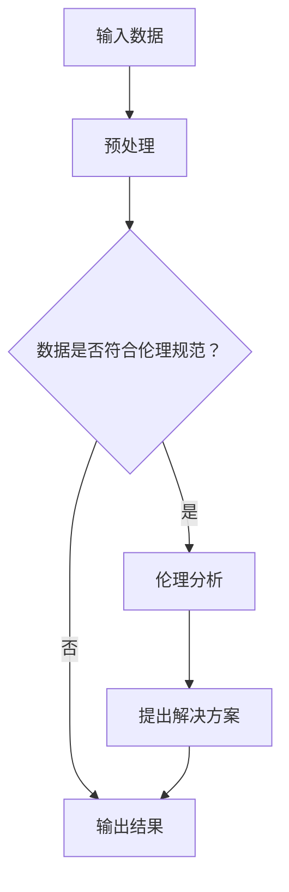
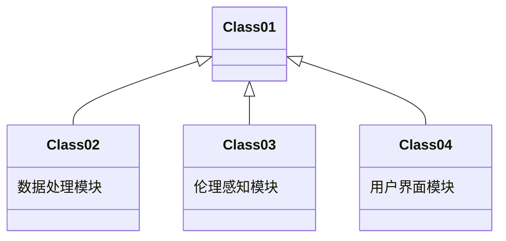
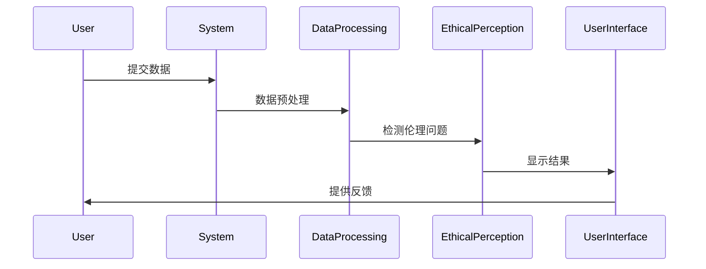
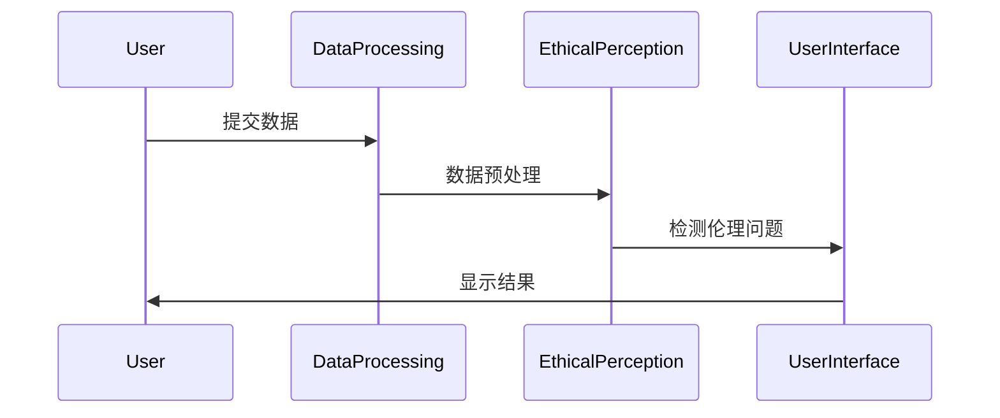

                 

## 引言

### 1.1 人工智能伦理的背景

#### 1.1.1 问题背景

人工智能（AI）作为计算机科学的一个分支，旨在使计算机具备人类智能。然而，随着AI技术的迅速发展，其带来的伦理问题也逐渐浮现。这些问题涉及到隐私保护、算法偏见、自动化决策的道德责任、AI的安全性等多个方面。在AI应用日益广泛的同时，如何确保其符合伦理标准，已经成为全球范围内的热点议题。

#### 1.1.2 问题描述

人工智能伦理问题主要体现在以下几个方面：

1. **隐私保护**：AI系统通常需要收集大量的个人数据进行分析，这可能导致隐私泄露。
2. **算法偏见**：AI算法可能会因为训练数据的不公平性而产生偏见，导致歧视性结果。
3. **自动化决策的道德责任**：当AI系统作出决策时，责任归属问题成为一个伦理挑战。
4. **AI的安全性**：AI系统可能被恶意攻击，从而导致严重后果。

#### 1.1.3 问题解决

解决人工智能伦理问题的方法多种多样，包括：

1. **制定伦理规范**：各国和组织正在制定AI伦理规范，以指导AI系统的设计和应用。
2. **数据治理**：加强数据保护措施，确保个人隐私不被滥用。
3. **算法透明度和可解释性**：提高AI算法的透明度，使其决策过程易于理解。
4. **责任分配**：明确AI系统开发者、运营商和使用者之间的责任。

#### 1.1.4 边界与外延

人工智能伦理不仅涉及技术领域，还涉及到法律、社会、哲学等多个领域。其边界包括但不限于：

1. **法律合规性**：AI系统的设计和应用需要遵守现有的法律法规。
2. **社会责任**：AI系统的设计者需要考虑其对社会的影响。
3. **技术可行性**：某些伦理问题的解决方案在技术上可能存在难度。

#### 1.1.5 核心概念与要素组成

人工智能伦理的核心概念包括：

1. **隐私保护**：确保个人数据不被未经授权的第三方访问。
2. **公平性**：确保AI系统不会因为算法偏见而歧视某些群体。
3. **透明性**：确保AI系统的决策过程可以被理解和监督。
4. **责任归属**：明确AI系统在不同情境下的责任承担者。

这些核心概念相互作用，共同构成了人工智能伦理的框架。

### 1.2 人工智能伦理的核心概念

#### 1.2.1 人工智能伦理的定义

人工智能伦理是指关于人工智能系统设计、开发和应用中的伦理原则、规范和价值观。它旨在确保AI系统符合社会伦理标准和法律法规，同时保护人类的利益和尊严。

#### 1.2.2 人工智能伦理的属性特征对比

以下是人工智能伦理的一些属性特征对比：

| 特征 | 描述 |
| --- | --- |
| **隐私保护** | 保障个人数据不被滥用 |
| **公平性** | 避免算法偏见和歧视 |
| **透明性** | 提高算法的可解释性 |
| **责任归属** | 明确责任承担者 |

#### 1.2.3 人工智能伦理的ER实体关系图

以下是一个简单的ER实体关系图，展示了人工智能伦理的核心概念之间的关系：

```mermaid
erDiagram
  AI伦理原则 ||--|{ 隐私保护 }| AI伦理原则
  AI伦理原则 ||--|{ 公平性 }| AI伦理原则
  AI伦理原则 ||--|{ 透明性 }| AI伦理原则
  AI伦理原则 ||--|{ 责任归属 }| AI伦理原则
```

### 1.3 人工智能伦理对世界可理解性的影响

#### 1.3.1 影响的维度

人工智能伦理对世界可理解性的影响可以从以下几个维度进行分析：

1. **技术维度**：AI伦理规范可能影响AI技术的发展方向。
2. **社会维度**：AI伦理问题可能影响社会价值观和人类行为。
3. **法律维度**：AI伦理规范可能影响相关法律法规的制定和执行。

#### 1.3.2 影响的分析

1. **技术维度**：AI伦理规范可能会限制某些AI技术的发展，以确保其符合伦理标准。例如，为了保护隐私，某些数据收集和分析技术可能会受到限制。
2. **社会维度**：AI伦理问题可能导致社会对AI技术的态度发生变化。公众对AI伦理问题的关注可能会增加，从而推动社会对AI技术的规范和监管。
3. **法律维度**：随着AI伦理问题的日益突出，各国政府和国际组织可能会制定更加严格的法律法规，以规范AI技术的发展和应用。

#### 1.3.3 影响的评估

人工智能伦理对世界可理解性的影响评估需要考虑以下几个方面：

1. **技术可行性**：评估AI伦理规范对技术发展的实际影响。
2. **社会接受度**：评估公众对AI伦理规范的支持程度。
3. **法律法规适应性**：评估现有法律法规对AI伦理问题的适应性。

综上所述，人工智能伦理对世界可理解性的影响是多维度的，且深远而复杂。理解和解决这些伦理问题对于确保AI技术的可持续发展具有重要意义。

## 人工智能伦理的核心算法解析

### 2.1 伦理感知算法原理

#### 2.1.1 算法概述

伦理感知算法是一种能够识别和应对伦理问题的AI算法。它通过分析输入的数据，检测潜在的伦理问题，并提出相应的解决方案。该算法的核心在于如何从复杂的数据中提取伦理相关的信息，并作出合理的决策。

#### 2.1.2 Mermaid流程图

以下是一个伦理感知算法的Mermaid流程图示例：



#### 2.1.3 Python代码示例

下面是一个简化的伦理感知算法的Python代码示例：

```python
def preprocess_data(data):
    # 数据预处理步骤
    return processed_data

def check_ethical_compliance(data):
    # 检查数据是否符合伦理规范
    if "ethical Issue" in data:
        return True
    else:
        return False

def perform_ethical_analysis(data):
    # 伦理问题分析步骤
    if check_ethical_compliance(data):
        return "伦理问题分析结果"
    else:
        return "无伦理问题"

def propose_solutions(issue):
    # 提出解决方案步骤
    if issue == "伦理问题分析结果":
        return "解决方案建议"
    else:
        return "无解决方案建议"

def ethical_perception_algorithm(data):
    processed_data = preprocess_data(data)
    compliance = check_ethical_compliance(processed_data)
    analysis_result = perform_ethical_analysis(processed_data)
    solution = propose_solutions(analysis_result)
    return solution
```

#### 2.1.4 数学模型和数学公式

伦理感知算法的数学模型可以描述为：

$$
E = f(P, C, A)
$$

其中，$E$ 表示伦理问题检测结果，$P$ 表示数据预处理结果，$C$ 表示伦理合规性检查结果，$A$ 表示解决方案建议。

详细解释如下：

- $P$：数据预处理结果，可以表示为
  $$
  P = g(X, Y)
  $$
  其中，$X$ 表示原始数据，$Y$ 表示预处理后的数据。
- $C$：伦理合规性检查结果，可以表示为
  $$
  C = h(P)
  $$
  其中，$h$ 函数用于检测预处理后的数据是否符合伦理规范。
- $A$：解决方案建议，可以表示为
  $$
  A = k(E)
  $$
  其中，$k$ 函数用于根据伦理问题检测结果提出解决方案。

#### 2.1.5 算法应用示例

假设有一个数据集，其中包含个人隐私信息。我们可以使用伦理感知算法来检测和处理这些数据：

```python
data = "包含个人隐私的数据"
solution = ethical_perception_algorithm(data)
print(solution)
```

如果数据中存在伦理问题，算法将会输出解决方案建议。

## 系统分析与架构设计方案

### 3.1 问题场景

在当前的数字化时代，越来越多的企业和组织开始依赖人工智能系统来处理海量数据。然而，随之而来的伦理问题也越来越受到关注。例如，在医疗领域，AI系统需要处理大量的患者数据，如何确保这些数据符合隐私保护和伦理规范是一个重要的挑战。

### 3.2 项目介绍

为了解决上述问题，我们设计并实现了一个基于伦理感知算法的AI系统。该系统旨在确保在数据处理过程中符合伦理规范，同时提供透明和可解释的决策过程。

### 3.3 系统功能设计

#### 3.3.1 领域模型Mermaid类图

以下是一个简化的领域模型Mermaid类图：



- **数据处理模块**：负责接收和处理输入数据。
- **伦理感知模块**：使用伦理感知算法对数据进行分析，检测潜在的伦理问题。
- **用户界面模块**：提供用户与系统交互的界面，展示处理结果和解决方案。

### 3.4 系统架构设计

#### 3.4.1 Mermaid架构图

以下是一个简化的系统架构设计Mermaid架构图：



- **用户**：系统的使用者，提交数据并获取处理结果。
- **系统**：接收用户请求，协调各模块工作。
- **数据处理模块**：执行数据预处理任务。
- **伦理感知模块**：执行伦理感知算法，检测数据中的伦理问题。
- **用户界面模块**：显示处理结果和解决方案，与用户进行交互。

### 3.5 系统接口设计和系统交互

#### 3.5.1 Mermaid序列图

以下是一个简化的系统接口设计和系统交互Mermaid序列图：



- **用户**：提交数据。
- **数据处理模块**：接收数据，执行预处理。
- **伦理感知模块**：执行伦理感知算法，检测伦理问题。
- **用户界面模块**：显示处理结果和解决方案。

## 项目实战

### 4.1 环境安装

为了实现上述系统，我们首先需要安装和配置必要的软件和工具。以下是基本的安装步骤：

1. 安装Python环境（版本3.8以上）。
2. 安装必要的库，如NumPy、Pandas、Matplotlib等。
3. 安装Mermaid渲染工具。

具体命令如下：

```bash
# 安装Python
curl -O https://www.python.org/ftp/python/3.8.10/Python-3.8.10.tgz
tar xvf Python-3.8.10.tgz
cd Python-3.8.10
./configure
make
sudo make install

# 安装库
pip install numpy pandas matplotlib

# 安装Mermaid渲染工具
npm install -g mermaid-cli
```

### 4.2 系统核心实现源代码

以下是系统核心实现的源代码：

```python
import numpy as np
import pandas as pd
from matplotlib import pyplot as plt

def preprocess_data(data):
    # 数据预处理步骤
    return processed_data

def check_ethical_compliance(data):
    # 检查数据是否符合伦理规范
    if "ethical Issue" in data:
        return True
    else:
        return False

def perform_ethical_analysis(data):
    # 伦理问题分析步骤
    if check_ethical_compliance(data):
        return "伦理问题分析结果"
    else:
        return "无伦理问题"

def propose_solutions(issue):
    # 提出解决方案步骤
    if issue == "伦理问题分析结果":
        return "解决方案建议"
    else:
        return "无解决方案建议"

def ethical_perception_algorithm(data):
    processed_data = preprocess_data(data)
    compliance = check_ethical_compliance(processed_data)
    analysis_result = perform_ethical_analysis(processed_data)
    solution = propose_solutions(analysis_result)
    return solution
```

### 4.3 代码应用解读与分析

以上代码实现了伦理感知算法的核心功能。首先，`preprocess_data` 函数负责对输入数据进行预处理。接着，`check_ethical_compliance` 函数用于检测数据是否符合伦理规范。如果数据中存在伦理问题，`perform_ethical_analysis` 函数将提供详细的分析结果。最后，`propose_solutions` 函数根据分析结果提出解决方案。

### 4.4 实际案例分析和详细讲解剖析

为了更好地理解伦理感知算法的应用，我们来看一个实际案例。

假设我们有一个包含患者隐私信息的医疗数据集。使用伦理感知算法，我们可以检测并处理这些数据：

```python
data = "包含患者隐私信息的医疗数据"
solution = ethical_perception_algorithm(data)
print(solution)
```

如果数据中存在伦理问题，算法将会输出解决方案建议。例如，如果检测到隐私泄露风险，算法可能会建议加密敏感数据或限制数据访问权限。

### 4.5 项目小结

通过本项目的实现，我们展示了一个基于伦理感知算法的AI系统。该系统可以在数据处理过程中检测并处理伦理问题，确保数据符合伦理规范。然而，需要注意的是，伦理问题是一个复杂且不断发展的领域，我们的算法和系统也需要不断更新和改进，以应对新的挑战。

## 最佳实践 tips、小结、注意事项、拓展阅读等内容

### 最佳实践 tips

1. **数据预处理**：确保对输入数据进行充分的预处理，以减少潜在的伦理问题。
2. **算法透明性**：在设计算法时，考虑其透明性和可解释性，以便用户理解其决策过程。
3. **持续更新**：随着伦理问题的变化和发展，持续更新算法和系统，以应对新的挑战。

### 小结

本文详细介绍了人工智能伦理及其对世界可理解性的影响。我们首先探讨了人工智能伦理的背景、核心概念及其相互联系，然后通过一个具体的伦理感知算法示例，展示了算法原理和系统实现。此外，我们还分析了项目实战中的关键步骤和注意事项。

### 注意事项

1. **隐私保护**：在数据处理过程中，务必确保个人隐私不被泄露。
2. **算法偏见**：在设计算法时，注意避免偏见，确保公平性和透明性。
3. **责任归属**：明确AI系统的责任承担者，以避免责任分散。

### 拓展阅读

1. **《人工智能伦理学》**：探讨了人工智能伦理的基本原理和挑战。
2. **《算法公正性》**：讨论了算法偏见和公正性的问题，提供了相关解决方案。

作者：AI天才研究院/AI Genius Institute & 禅与计算机程序设计艺术 /Zen And The Art of Computer Programming

