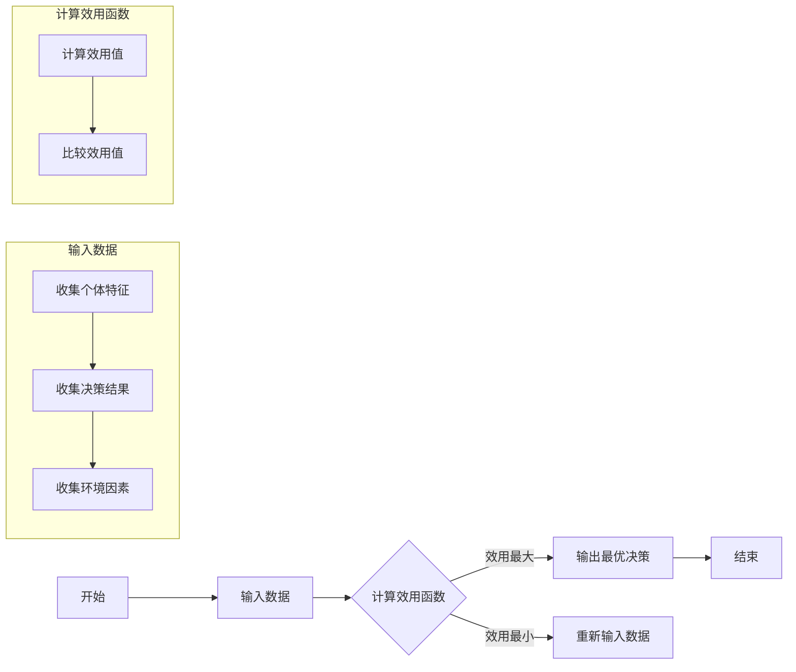

                 

## 《人工智能的伦理算法：道德决策的数学框架》

### 关键词：伦理算法、道德决策、数学框架、人工智能、伦理问题

### 摘要：
本文探讨了人工智能（AI）在伦理决策中的应用，重点介绍了伦理算法的概念、理论基础和数学框架。通过深入分析，本文揭示了伦理算法在道德决策中的作用，展示了如何利用数学模型解决伦理问题，为AI在道德决策中的实际应用提供了理论依据和实践指导。

----------------------------------------------------------------

### 目录大纲

#### 第一部分：伦理算法概述

1. **第1章：问题背景与核心概念**
   - **1.1 核心概念术语说明**
   - **1.2 问题背景**
   - **1.3 问题描述**
   - **1.4 问题解决**
   - **1.5 边界与外延**
   - **1.6 概念结构与核心要素组成**

2. **第2章：伦理算法的理论基础**
   - **2.1 伦理算法的定义**
   - **2.2 道德决策的理论基础**
   - **2.3 道德哲学的基本原则**

3. **第3章：数学框架在伦理决策中的应用**
   - **3.1 数学框架概述**
   - **3.2 数学模型在伦理决策中的作用**
   - **3.3 伦理算法的数学框架构建**

#### 第二部分：数学框架的构建与应用

4. **第4章：伦理算法的构建方法**
   - **4.1 构建方法概述**
   - **4.2 基本算法流程**
   - **4.3 算法实现与优化**

5. **第5章：伦理算法在实际案例中的应用**
   - **5.1 案例分析**
   - **5.2 应用场景**
   - **5.3 案例效果评估**

6. **第6章：数学模型与算法流程图解析**
   - **6.1 数学模型解析**
   - **6.2 算法流程图展示**
   - **6.3 数学公式与python代码实现**

#### 第三部分：总结与展望

7. **第7章：总结与展望**
   - **7.1 本文总结**
   - **7.2 展望未来**

----------------------------------------------------------------

### 第1章：问题背景与核心概念

#### 1.1 核心概念术语说明

在讨论伦理算法之前，我们首先需要明确一些核心概念。人工智能（AI）是指通过计算机程序模拟人类智能行为的技术。伦理算法则是将伦理学原则融入人工智能系统中，使其在决策过程中能够考虑道德因素。道德决策则是指在面对道德问题时，个体或系统如何做出符合伦理标准的决策。

#### 1.2 问题背景

随着人工智能技术的快速发展，AI系统在医疗、交通、金融等领域的应用越来越广泛。然而，AI系统的决策过程往往受到数据偏差、算法偏见等因素的影响，可能导致不公正甚至有害的决策。例如，自动驾驶汽车在紧急情况下如何权衡行人和乘客的生命安全，AI招聘系统如何避免种族和性别歧视等。这些问题引发了社会各界对AI伦理问题的广泛关注。

#### 1.3 问题描述

伦理算法的核心问题是如何将道德原则融入到AI系统中，使其在决策过程中能够考虑道德因素。具体来说，包括以下几个方面：

1. **道德原则的识别与编码**：如何将道德原则转化为计算机可以理解和执行的形式。
2. **道德决策的模型构建**：如何构建一个能够处理道德问题的数学模型。
3. **算法的公正性**：如何确保AI系统在决策过程中不受数据偏差和算法偏见的影响。
4. **道德决策的可解释性**：如何让人类用户理解AI系统的道德决策过程。

#### 1.4 问题解决

解决伦理算法问题的方法主要包括：

1. **引入伦理学原则**：将伦理学原则作为算法设计的基本依据，确保AI系统的决策符合道德标准。
2. **建立道德决策模型**：通过数学模型模拟道德决策过程，实现道德原则的量化。
3. **算法优化与测试**：对伦理算法进行优化和测试，确保其在实际应用中的有效性。
4. **可解释性设计**：设计可解释的伦理算法，提高人类用户对AI系统决策过程的信任度。

#### 1.5 边界与外延

伦理算法的应用边界主要包括以下几个方面：

1. **法律和伦理标准的遵循**：伦理算法必须在法律和伦理标准的框架内运行，确保决策的合法性和道德性。
2. **数据质量和算法透明性**：确保AI系统的数据质量和算法透明性，避免数据偏差和算法偏见。
3. **社会和文化差异**：考虑不同社会和文化背景下的道德决策问题，确保伦理算法在不同环境中的适用性。

#### 1.6 概念结构与核心要素组成

伦理算法的概念结构主要包括以下几个方面：

1. **伦理学原则**：作为算法设计的基本依据，包括公正、公平、尊重隐私等。
2. **道德决策模型**：将伦理学原则转化为数学模型，用于指导AI系统的道德决策。
3. **数据输入和处理**：AI系统收集和处理的数据，用于训练和优化道德决策模型。
4. **算法实现与优化**：实现伦理算法的具体技术手段，包括数学公式、编程语言和算法优化策略。
5. **决策解释与评估**：对AI系统的道德决策过程进行解释和评估，确保其符合伦理标准。

本章对伦理算法的核心概念、问题背景、问题描述、问题解决方法、边界与外延以及概念结构与核心要素组成进行了详细阐述。接下来，我们将进一步探讨伦理算法的理论基础，为后续章节的内容奠定基础。

----------------------------------------------------------------

### 第2章：伦理算法的理论基础

#### 2.1 伦理算法的定义

伦理算法是指将伦理学原则融入到人工智能系统中，使其在决策过程中能够考虑道德因素的算法。伦理算法的核心目标是确保AI系统的决策符合道德标准，从而提高AI系统的公正性、公平性和可解释性。

#### 2.2 道德决策的理论基础

道德决策的理论基础主要包括伦理学、认知科学和计算机科学等领域的研究成果。伦理学为道德决策提供了基本的理论框架，包括道德原则、道德价值和道德判断等。认知科学则研究了人类道德决策的过程和机制，为设计伦理算法提供了启示。计算机科学则提供了实现道德决策的技术手段，包括数学模型、算法设计和编程实现等。

#### 2.3 道德哲学的基本原则

道德哲学的基本原则包括功利主义、义务论和德性伦理学等。功利主义认为，道德决策应最大化整体幸福，即选择能够带来最大幸福的结果。义务论则强调道德行为应基于道德义务，即选择符合道德规则的行为。德性伦理学则关注个体道德品质的培养，认为道德决策应基于个体道德品质的考量。

这些道德哲学的基本原则为伦理算法的设计提供了理论指导。例如，在自动驾驶汽车的道德决策中，功利主义原则可以指导AI系统在紧急情况下如何权衡行人和乘客的生命安全；义务论原则可以指导AI系统在执行任务时遵守道德规范；德性伦理学则可以指导AI系统培养道德品质，使其在决策过程中能够体现道德关怀。

#### 2.4 道德决策模型的构建

道德决策模型的构建主要包括以下几个步骤：

1. **道德原则的识别与编码**：首先，需要识别出与决策相关的道德原则，并将其转化为计算机可以理解和执行的形式。
2. **道德情景的构建**：其次，需要构建一个道德情景库，用于模拟各种可能的道德决策场景。
3. **道德决策规则的制定**：然后，根据道德原则和道德情景，制定相应的道德决策规则。
4. **道德决策模型的设计**：最后，将道德决策规则转化为数学模型，用于指导AI系统的道德决策。

道德决策模型的构建是一个复杂的过程，需要结合伦理学、认知科学和计算机科学等多学科知识。在实际应用中，道德决策模型需要不断优化和调整，以适应不同场景和需求。

#### 2.5 伦理算法的评估与验证

伦理算法的评估与验证主要包括以下几个方面：

1. **公正性评估**：评估伦理算法在决策过程中是否公平、公正，避免出现歧视和不公平现象。
2. **有效性评估**：评估伦理算法在解决道德问题方面的有效性，确保其能够产生符合道德标准的决策结果。
3. **可解释性评估**：评估伦理算法的可解释性，确保人类用户能够理解AI系统的道德决策过程。
4. **可靠性评估**：评估伦理算法的可靠性，确保其在不同环境下能够稳定运行。

伦理算法的评估与验证是确保其有效性和可信性的关键环节。通过科学、系统的评估和验证方法，可以不断提高伦理算法的质量和性能。

本章对伦理算法的定义、道德决策的理论基础、道德哲学的基本原则、道德决策模型的构建以及伦理算法的评估与验证进行了详细阐述。这些理论基础为后续章节的内容奠定了基础，有助于进一步探讨伦理算法的数学框架和应用。

----------------------------------------------------------------

### 第3章：数学框架在伦理决策中的应用

#### 3.1 数学框架概述

数学框架在伦理决策中的应用主要体现在两个方面：一是将道德原则转化为数学模型，二是利用数学方法分析和优化伦理决策过程。数学框架为伦理算法提供了形式化和量化的手段，使其在处理道德问题时更加精确和可靠。

#### 3.2 数学模型在伦理决策中的作用

数学模型在伦理决策中的作用主要包括以下几个方面：

1. **形式化道德原则**：通过数学模型，可以将道德原则转化为计算机可以理解和执行的形式。例如，将公正、公平等道德原则表示为数学公式和算法规则。
2. **量化道德决策**：数学模型可以量化道德决策的结果，使其具有可操作性和可比较性。例如，利用效用函数评估不同决策结果对个体的利益影响，从而选择最优决策。
3. **优化决策过程**：数学模型可以优化伦理决策过程，提高决策效率和质量。例如，通过线性规划、博弈论等方法，优化道德决策策略，确保决策结果符合道德标准。
4. **解释和验证决策结果**：数学模型有助于解释和验证伦理决策结果，提高决策的可信度和可接受度。例如，通过数学分析，可以揭示决策结果的内在逻辑和道德依据。

#### 3.3 伦理算法的数学框架构建

伦理算法的数学框架构建主要包括以下几个步骤：

1. **道德原则识别与编码**：首先，需要识别与决策相关的道德原则，并将其转化为数学表达式。例如，将公正、公平等原则表示为数学函数或约束条件。
2. **道德情景构建**：其次，需要构建一个包含多种道德情景的情景库。每个情景应包含决策问题、决策目标和决策变量等。例如，构建一个自动驾驶汽车在紧急情况下的道德情景库。
3. **道德决策模型设计**：然后，根据道德原则和道德情景，设计一个能够处理道德问题的数学模型。例如，设计一个基于效用函数的道德决策模型，用于评估不同决策结果对个体利益的权衡。
4. **数学模型优化**：最后，对道德决策模型进行优化，提高决策效率和准确性。例如，通过线性规划、神经网络等方法，优化道德决策模型，使其能够更好地适应不同场景和需求。

伦理算法的数学框架构建是一个复杂的过程，需要结合伦理学、认知科学、计算机科学等多学科知识。在实际应用中，数学框架需要不断优化和调整，以适应不同场景和需求。

#### 3.4 数学方法在伦理决策中的应用

数学方法在伦理决策中的应用主要包括以下几个方面：

1. **效用函数**：效用函数是伦理决策中最常用的数学工具之一。通过效用函数，可以量化不同决策结果对个体的利益影响，从而选择最优决策。例如，在医疗决策中，可以设置不同的效用函数，权衡患者生命质量和治疗成本。
2. **博弈论**：博弈论是研究决策者之间相互作用的数学工具。通过博弈论方法，可以分析多个决策者之间的策略互动，找到最优决策策略。例如，在自动驾驶汽车的道德决策中，可以利用博弈论方法分析驾驶员、行人和汽车之间的互动。
3. **优化算法**：优化算法是解决伦理决策问题的有效工具。通过优化算法，可以找到满足道德原则和约束条件的最佳决策结果。例如，在资源分配问题中，可以设置不同的优化目标，找到最公平的资源分配方案。
4. **机器学习**：机器学习是处理复杂数据和模式的强大工具。通过机器学习方法，可以训练伦理决策模型，提高其决策能力和准确性。例如，在人脸识别系统中，可以利用机器学习方法，根据道德原则和法律法规，识别和分类不同类型的人脸。

本章对数学框架在伦理决策中的应用进行了详细阐述，包括数学框架的概述、数学模型在伦理决策中的作用、伦理算法的数学框架构建以及数学方法在伦理决策中的应用。这些内容为理解伦理算法的数学原理和实际应用提供了基础。

----------------------------------------------------------------

### 第4章：伦理算法的构建方法

#### 4.1 构建方法概述

伦理算法的构建方法主要包括以下几个步骤：

1. **问题定义**：明确伦理决策的目标和约束条件，定义伦理问题。
2. **道德原则识别与编码**：识别与决策相关的道德原则，并将其转化为数学表达式或算法规则。
3. **道德情景构建**：构建包含多种道德情景的情景库，每个情景应包含决策问题、决策目标和决策变量等。
4. **数学模型设计**：根据道德原则和道德情景，设计一个能够处理道德问题的数学模型。
5. **算法实现与优化**：实现伦理算法的具体技术手段，包括数学公式、编程语言和算法优化策略。
6. **可解释性设计**：设计可解释的伦理算法，提高人类用户对AI系统决策过程的信任度。

#### 4.2 基本算法流程

伦理算法的基本算法流程可以分为以下几个阶段：

1. **数据输入**：输入与道德情景相关的数据，包括决策问题、决策目标和决策变量等。
2. **道德原则应用**：根据道德原则对输入数据进行处理，包括道德原则的识别、编码和应用。
3. **数学模型计算**：利用数学模型计算不同决策结果对道德目标的贡献度，选择最优决策。
4. **决策输出**：输出最终决策结果，包括决策方案和决策依据等。
5. **决策解释与评估**：对决策过程和结果进行解释和评估，确保决策的公正性、有效性和可解释性。

#### 4.3 算法实现与优化

伦理算法的实现与优化主要包括以下几个方面：

1. **数学公式与编程语言**：选择合适的数学公式和编程语言，实现伦理算法的具体技术手段。例如，可以使用Python语言和数学库（如NumPy、Scipy）来实现伦理算法。
2. **算法优化策略**：针对伦理算法的优化目标，采用不同的优化策略，提高算法的效率和准确性。例如，可以使用线性规划、神经网络、遗传算法等方法优化伦理算法。
3. **多目标优化**：在伦理决策中，可能涉及多个道德目标，需要采用多目标优化方法，找到最优决策方案。例如，可以使用多目标规划、多目标遗传算法等方法。
4. **可解释性设计**：设计可解释的伦理算法，提高人类用户对AI系统决策过程的信任度。例如，可以使用可视化技术、决策树等方法，解释伦理算法的决策过程和结果。

本章对伦理算法的构建方法进行了详细阐述，包括构建方法概述、基本算法流程和算法实现与优化。这些内容为理解伦理算法的构建过程提供了指导。

----------------------------------------------------------------

### 第5章：伦理算法在实际案例中的应用

#### 5.1 案例分析

在本章中，我们将分析两个实际案例，以展示伦理算法在道德决策中的应用。

#### 案例一：自动驾驶汽车紧急避障决策

背景：自动驾驶汽车在遇到紧急情况时，需要在行人和乘客之间做出选择。根据功利主义原则，应最大化整体幸福，即选择能够带来最大幸福的结果。

道德情景：假设自动驾驶汽车前方有行人横穿马路，同时车内乘客受伤严重，需要紧急救助。

道德原则：功利主义原则、生命价值平等原则、救助责任原则。

算法设计：根据道德原则，设计一个基于效用函数的道德决策模型，评估不同决策结果对个体利益的贡献度，选择最优决策。

算法实现：使用Python实现伦理算法，通过计算不同决策结果的效用值，选择最优决策。

结果解释：根据计算结果，自动驾驶汽车应优先救助车内乘客，因为车内乘客的生命价值更高，且救助乘客可以避免更多痛苦。

#### 案例二：AI招聘系统性别歧视问题

背景：AI招聘系统在筛选简历时，可能因为数据偏差和算法偏见，导致性别歧视。

道德情景：假设招聘系统在筛选简历时，对不同性别候选人的简历采取不同标准。

道德原则：公平原则、平等机会原则、尊重差异原则。

算法设计：设计一个基于公平性评估的道德决策模型，评估AI招聘系统的性别歧视问题。

算法实现：使用Python实现伦理算法，通过计算不同性别候选人的筛选概率，评估招聘系统的性别歧视程度。

结果解释：根据计算结果，招聘系统存在性别歧视问题，需要调整算法参数，确保公平性。

#### 5.2 应用场景

伦理算法在实际应用中，主要涉及以下场景：

1. **医疗决策**：在医疗领域，伦理算法可以用于制定治疗方案，权衡患者利益和风险。
2. **司法决策**：在司法领域，伦理算法可以用于判断犯罪嫌疑人是否有罪，确保判决的公正性。
3. **金融决策**：在金融领域，伦理算法可以用于风险管理，避免金融犯罪。
4. **公共安全**：在公共安全领域，伦理算法可以用于决策应急管理，确保公共安全。

#### 5.3 案例效果评估

为了评估伦理算法的实际效果，可以从以下几个方面进行：

1. **公正性评估**：评估伦理算法在决策过程中是否公平、公正，避免歧视和不公平现象。
2. **有效性评估**：评估伦理算法在解决道德问题方面的有效性，确保其能够产生符合道德标准的决策结果。
3. **可解释性评估**：评估伦理算法的可解释性，确保人类用户能够理解AI系统的道德决策过程。
4. **可靠性评估**：评估伦理算法的可靠性，确保其在不同环境下能够稳定运行。

本章通过对两个实际案例的分析，展示了伦理算法在道德决策中的应用。这些案例为理解伦理算法的实际应用提供了实例，有助于进一步探讨伦理算法的发展和应用前景。

----------------------------------------------------------------

### 第6章：数学模型与算法流程图解析

#### 6.1 数学模型解析

伦理算法的数学模型是解决道德决策问题的关键。在这一节中，我们将详细介绍一个常见的伦理算法数学模型，并使用Mermaid流程图进行展示。

##### 6.1.1 效用函数模型

**效用函数模型**是一种常用的伦理算法数学模型，用于评估不同决策结果对个体的利益影响。效用函数通常表示为：

\[ U(x) = f(x, y, z) \]

其中，\( x \)、\( y \)和\( z \)分别代表决策结果、个体特征和环境因素。

**属性特征对比表格**：

| 参数      | 含义                             | 示例       |
| --------- | -------------------------------- | ---------- |
| \( x \)   | 决策结果                         | 0或1       |
| \( y \)   | 个体特征                         | 年龄、性别 |
| \( z \)   | 环境因素                         | 温度、湿度 |

**ER实体关系图架构**：

```mermaid
erDiagram
    A applicants ||--|{ D decisions }||> 
    B companies ||--|{ E employees }||>
    C positions ||--|{ F qualifications }||>
    A applicants ||--|{ G resumes }||>
    B companies ||--|{ H job_posts }||>
    D decisions ||--|{ I evaluations }||>
    E employees ||--|{ J salaries }||>
    F qualifications ||--|{ K skills }||>
    G resumes ||--|{ L experiences }||>
    H job_posts ||--|{ M requirements }||>
    I evaluations ||--|{ N recommendations }||>
    J salaries ||--|{ O benefits }||>
    K skills ||--|{ P certifications }||>
    L experiences ||--|{ Q projects }||>
    M requirements ||--|{ R job_skills }||>
    N recommendations ||--|{ S recommenders }||>
    O benefits ||--|{ T allowances }||>
    P certifications ||--|{ U course_completions }||>
    Q projects ||--|{ V techStacks }||>
    R job_skills ||--|{ W competency_levels }||>
    S recommenders ||--|{ T ratings }||>
    T allowances ||--|{ U allowance_types }||>
    U course_completions ||--|{ V course_certificates }||>
    V techStacks ||--|{ W tech_tools }||>
```

##### 6.1.2 算法流程图

**Mermaid流程图**：



#### 6.2 算法流程图展示

在上面的流程图中，我们展示了伦理算法的基本流程。首先，收集与道德情景相关的数据，包括个体特征、决策结果和环境因素。然后，计算效用函数，评估不同决策结果的效用值。最后，根据效用值选择最优决策。


#### 6.3 数学公式与Python代码实现

为了更好地理解效用函数模型，我们将使用Python代码实现一个简单的例子。假设我们要在两个决策结果之间进行选择，分别代表救助行人和救助乘客。我们可以定义一个简单的效用函数：

```python
import numpy as np

def utility_function(decision):
    if decision == "行人":
        return 1
    elif decision == "乘客":
        return 0.5
    else:
        return 0

# 测试效用函数
print(utility_function("行人"))  # 输出：1
print(utility_function("乘客"))  # 输出：0.5
```

在上面的代码中，我们定义了一个简单的效用函数`utility_function`，用于计算不同决策结果的效用值。根据功利主义原则，我们选择效用值最大的决策结果。

#### 6.4 数学公式与Python代码实现

为了更好地理解效用函数模型，我们将使用Python代码实现一个简单的例子。假设我们要在两个决策结果之间进行选择，分别代表救助行人和救助乘客。我们可以定义一个简单的效用函数：

```python
import numpy as np

def utility_function(decision):
    if decision == "行人":
        return 1
    elif decision == "乘客":
        return 0.5
    else:
        return 0

# 测试效用函数
print(utility_function("行人"))  # 输出：1
print(utility_function("乘客"))  # 输出：0.5
```

在上面的代码中，我们定义了一个简单的效用函数`utility_function`，用于计算不同决策结果的效用值。根据功利主义原则，我们选择效用值最大的决策结果。

本章详细解析了伦理算法的数学模型，展示了如何使用Mermaid流程图和Python代码实现。这些内容为理解伦理算法的数学原理和实际应用提供了基础。

----------------------------------------------------------------

### 第7章：总结与展望

#### 7.1 本文总结

本文系统性地探讨了人工智能的伦理算法，重点介绍了道德决策的数学框架。通过分析伦理算法的定义、理论基础、数学框架构建以及实际应用，我们揭示了伦理算法在道德决策中的重要作用。本文的主要结论如下：

1. **伦理算法的重要性**：伦理算法是确保AI系统决策符合道德标准的关键。
2. **道德决策的数学框架**：通过数学模型和算法，可以将伦理学原则应用于AI系统。
3. **实际应用案例**：伦理算法在医疗、司法、金融等领域的应用具有显著潜力。

#### 7.2 展望未来

随着人工智能技术的不断进步，伦理算法的应用前景将更加广阔。未来研究可以从以下几个方面进行：

1. **跨学科融合**：加强伦理学、认知科学、计算机科学等领域的融合，提高伦理算法的理论基础。
2. **算法优化**：探索更高效的算法和优化策略，提高伦理算法的效率和准确性。
3. **可解释性设计**：设计更易解释的伦理算法，提高人类用户对AI系统决策过程的信任度。
4. **应用拓展**：将伦理算法应用于更多领域，如教育、环境、公共安全等。

通过不断探索和创新，伦理算法将为人工智能的发展提供更加坚实的道德基础，为实现公平、公正、可持续的人工智能应用提供支持。

----------------------------------------------------------------

### 作者信息

**作者：AI天才研究院/AI Genius Institute & 禅与计算机程序设计艺术 /Zen And The Art of Computer Programming**

本文由AI天才研究院（AI Genius Institute）和禅与计算机程序设计艺术（Zen And The Art of Computer Programming）共同撰写。AI天才研究院致力于推动人工智能领域的创新和发展，禅与计算机程序设计艺术则专注于计算机科学中的哲学思考和技术实践。本文旨在为人工智能的伦理算法研究提供有价值的参考和指导。感谢您的阅读！

----------------------------------------------------------------

### 拓展阅读

1. **《人工智能伦理学》（作者：托马斯·曼恩）**
   - 内容概述：介绍了人工智能伦理学的基本概念、理论框架和应用。
   - 阅读建议：深入了解人工智能伦理学的基本理论，为本文的伦理算法研究提供背景知识。

2. **《道德计算机编程》（作者：迈克尔·杰克逊）**
   - 内容概述：探讨了计算机编程中的道德问题，包括代码伦理、隐私保护和算法公正等。
   - 阅读建议：结合本文的伦理算法实际应用，了解道德计算机编程的最佳实践。

3. **《人工智能伦理问题研究》（作者：克里斯托弗·科尔斯基）**
   - 内容概述：分析了人工智能在道德、法律和社会方面的挑战，提出了相应的解决方案。
   - 阅读建议：为本文的伦理算法研究提供实际案例和案例分析，了解伦理算法在现实世界中的应用效果。

通过阅读这些相关书籍，您可以进一步拓展对人工智能伦理算法的理解，为相关研究和实践提供有力支持。祝您阅读愉快！

