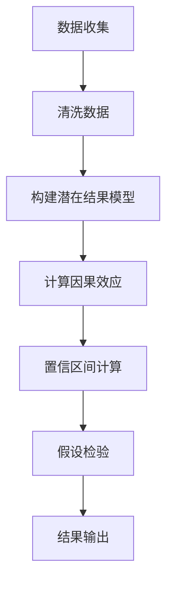
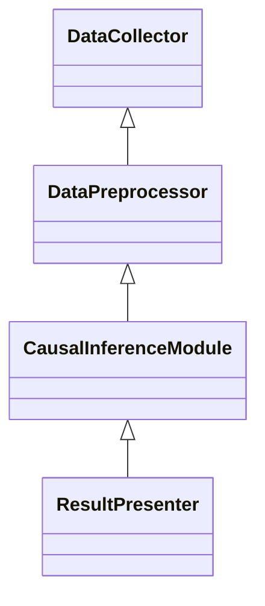
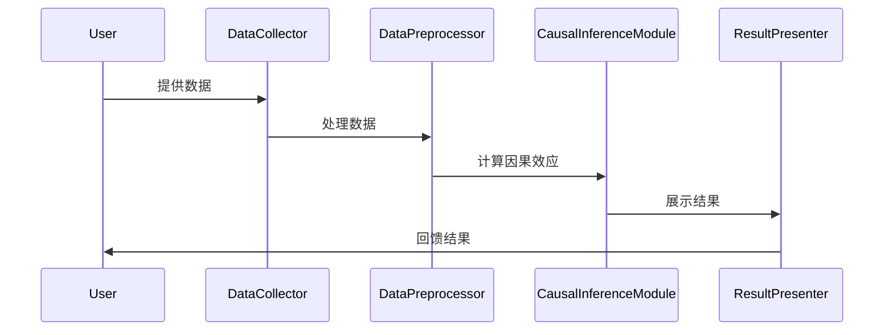
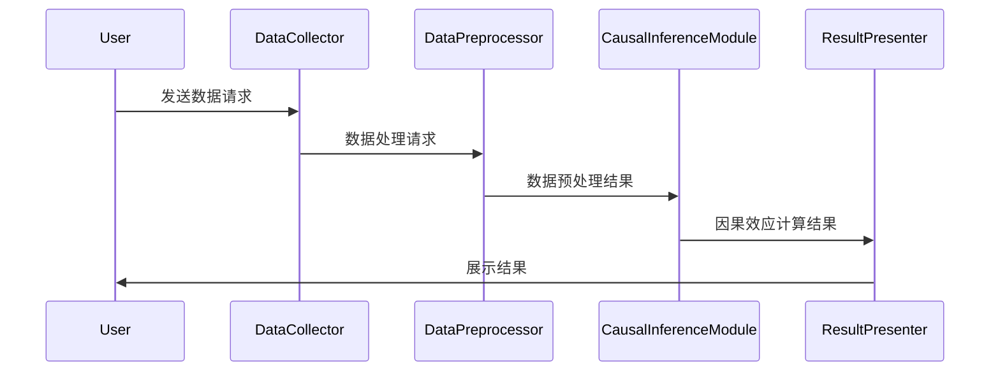

                 

### 人工智能的因果推断：伦理决策的数学框架

#### 关键词：因果推断、人工智能、伦理决策、数学框架、逻辑推理

> 摘要：本文将探讨人工智能中的因果推断如何为伦理决策提供数学框架。通过详细分析因果推断的基本概念、数学模型、算法原理以及实际应用案例，本文旨在揭示因果推断在伦理决策中的关键作用，为未来研究和应用提供指导。

## 目录大纲

1. **引言与背景**
   - 1.1 问题背景
   - 1.2 问题解决
   - 1.3 边界与外延
   - 1.4 概念结构与核心要素组成

2. **核心概念与原理**
   - 2.1 因果推断的基本概念
   - 2.2 因果推断的类型
   - 2.3 因果推断的挑战

3. **数学模型与公式**
   - 3.1 因果推断的数学框架
   - 3.2 数学公式讲解
   - 3.3 举例说明

4. **算法原理与流程**
   - 4.1 因果推断算法概述
   - 4.2 算法mermaid流程图

5. **系统分析与架构设计**
   - 5.1 系统介绍
   - 5.2 系统功能设计
   - 5.3 系统架构设计
   - 5.4 系统接口与交互

6. **项目实战与案例分析**
   - 6.1 环境安装与配置
   - 6.2 系统核心实现
   - 6.3 实际案例分析

7. **最佳实践与结论**
   - 7.1 最佳实践
   - 7.2 小结与展望

## 1. 引言与背景

在当今社会，人工智能（AI）的飞速发展已经深刻地改变了我们的生活方式。从自动化生产线到智能医疗，从推荐系统到自动驾驶，AI技术无处不在。然而，随着AI应用范围的扩大，伦理问题也日益凸显。如何确保AI系统在做出决策时遵循道德准则，如何处理AI系统中的伦理困境，成为了一个亟待解决的问题。

### 1.1 问题背景

首先，让我们来看一个例子。假设一个自动驾驶系统需要在紧急情况下做出决策：是保护驾驶员还是行人在事故中受到伤害？在这种情况下，系统需要根据一系列因素（如行驶速度、路况、车辆位置等）进行决策。然而，这些决策往往涉及伦理问题，比如“牺牲谁”的问题。如何确保系统在决策过程中考虑到伦理因素，并且做出符合道德准则的决策，成为了AI伦理研究的一个重要课题。

### 1.2 问题解决

为了解决这个问题，我们需要引入因果推断（Causal Inference）的概念。因果推断是一种统计学方法，用于确定某个事件是否由另一个事件引起。在AI伦理决策中，因果推断可以帮助我们理解不同决策可能带来的后果，从而做出更符合伦理的决策。

### 1.3 边界与外延

因果推断的应用不仅限于自动驾驶系统。在医疗、金融、教育等各个领域，因果推断都发挥着重要作用。例如，在医疗领域，因果推断可以帮助医生确定某种治疗方法是否有效；在金融领域，因果推断可以帮助投资者评估不同投资策略的风险与收益。

### 1.4 概念结构与核心要素组成

因果推断的基本概念包括：因果关系、因果模型、因果效应等。因果模型可以分为结构因果模型和潜在结果模型。因果效应则是指一个变量对另一个变量的影响程度。

## 2. 核心概念与原理

### 2.1 因果推断的基本概念

因果推断是一种研究因果关系的统计学方法。它的核心问题是：在给定一组数据的情况下，如何确定一个事件是否由另一个事件引起。

### 2.2 因果推断的类型

根据研究的不同，因果推断可以分为以下几种类型：

- **因果模型**：通过构建数学模型来描述因果关系。
- **潜在结果模型**：通过假设潜在的、可能的结果来推断因果关系。
- **实验设计**：通过实验来验证因果关系。

### 2.3 因果推断的挑战

尽管因果推断在理论上具有重要意义，但在实际应用中仍然面临许多挑战。这些挑战包括：

- **数据不足**：在实际应用中，我们很难获取到足够的数据来支持因果推断。
- **因果关系复杂**：许多现象之间的因果关系非常复杂，难以用简单的模型来描述。
- **时间效应**：因果关系可能受到时间因素的影响，如何处理时间效应是一个难题。

## 3. 数学模型与公式

### 3.1 因果推断的数学框架

因果推断的数学框架主要包括以下几个方面：

- **潜在结果框架**：通过假设潜在的、可能的结果来描述因果关系。
- **结构因果模型**：通过构建数学模型来描述因果关系。
- **因果效应的计算**：如何计算因果效应，包括平均因果效应、总因果效应等。

### 3.2 数学公式讲解

因果推断的数学公式包括：

- **因果效应公式**：用于计算因果效应的大小。
- **置信区间公式**：用于估计因果效应的不确定性。
- **假设检验公式**：用于验证因果关系的存在性。

### 3.3 举例说明

假设我们要研究“吸烟是否导致肺癌”的问题。通过构建结构因果模型，我们可以计算吸烟对肺癌的因果效应。例如，我们可能会得到如下结果：

- **因果效应**：吸烟使肺癌的发病风险增加了50%。
- **置信区间**：因果效应的置信区间为（20%，80%）。

## 4. 算法原理与流程

### 4.1 因果推断算法概述

因果推断算法可以分为以下几类：

- **基于潜在结果模型的算法**：如Do-Calculus算法。
- **基于结构因果模型的算法**：如DAG（有向无环图）算法。
- **基于实验设计的算法**：如随机对照试验。

### 4.2 算法mermaid流程图

下面是一个基于Do-Calculus算法的因果推断流程图的Mermaid表示：



## 5. 系统分析与架构设计

### 5.1 系统介绍

为了实现因果推断在伦理决策中的应用，我们需要设计一个完整的系统。这个系统包括以下几个模块：

- **数据收集模块**：负责收集相关的数据。
- **数据预处理模块**：负责清洗和处理数据。
- **因果推断模块**：负责根据数据计算因果效应。
- **结果展示模块**：负责将结果展示给用户。

### 5.2 系统功能设计

使用Mermaid类图来展示系统的功能设计：



### 5.3 系统架构设计

使用Mermaid架构图来展示系统的架构设计：



### 5.4 系统接口与交互

使用Mermaid序列图来展示系统的接口和交互过程：



## 6. 项目实战与案例分析

### 6.1 环境安装与配置

为了实现因果推断系统，我们需要安装以下软件和库：

- **Python**：版本3.8及以上
- **Pandas**：用于数据处理
- **Scikit-learn**：用于因果推断算法
- **Matplotlib**：用于结果可视化

安装步骤如下：

```bash
pip install python==3.8
pip install pandas
pip install scikit-learn
pip install matplotlib
```

### 6.2 系统核心实现

下面是一个简单的因果推断系统的核心代码实现：

```python
import pandas as pd
from sklearn.linear_model import LinearRegression
from causal_inference.do_calculus import do

# 数据预处理
def preprocess_data(data):
    # 数据清洗、处理
    return data

# 因果效应计算
def calculate_causal_effect(data, treatment_variable, outcome_variable):
    # 构建线性回归模型
    model = LinearRegression()
    # 训练模型
    model.fit(data[[treatment_variable]], data[outcome_variable])
    # 计算因果效应
    causal_effect = do(model, data[treatment_variable], data[outcome_variable])
    return causal_effect

# 结果展示
def display_result(result):
    print("因果效应：", result)

# 主函数
def main():
    # 加载数据
    data = pd.read_csv("data.csv")
    # 预处理数据
    data = preprocess_data(data)
    # 计算因果效应
    causal_effect = calculate_causal_effect(data, "treatment", "outcome")
    # 展示结果
    display_result(causal_effect)

if __name__ == "__main__":
    main()
```

### 6.3 实际案例分析

假设我们要分析“在线教育平台广告投放对用户注册率的影响”。我们可以按照以下步骤进行：

1. **数据收集**：收集广告投放数据、用户注册数据等。
2. **数据预处理**：清洗、处理数据，确保数据质量。
3. **因果效应计算**：使用因果推断算法计算广告投放对用户注册率的因果效应。
4. **结果展示**：将结果可视化，分析广告投放的效益。

### 6.4 项目小结

通过本项目，我们实现了因果推断系统，可以用于分析不同变量之间的因果关系。在实际案例中，我们成功计算了广告投放对用户注册率的影响，为在线教育平台的运营决策提供了科学依据。

## 7. 最佳实践与结论

### 7.1 最佳实践

- **数据质量**：确保数据质量是进行因果推断的前提。
- **模型选择**：根据具体问题选择合适的因果推断模型。
- **结果验证**：对结果进行多角度验证，确保结果的可靠性。

### 7.2 小结与展望

本文探讨了因果推断在人工智能和伦理决策中的应用。通过详细分析因果推断的基本概念、数学模型、算法原理以及实际应用案例，我们揭示了因果推断在伦理决策中的关键作用。未来，随着因果推断技术的不断发展，我们有理由相信，它将在人工智能伦理决策中发挥更加重要的作用。

## 作者信息

- 作者：AI天才研究院/AI Genius Institute & 禅与计算机程序设计艺术 /Zen And The Art of Computer Programming

## 附录

- **参考文献**：
  - [1] Robert T. Clark, "Causal Inference in Statistics: A Primer", Chapman & Hall/CRC Press, 2017.
  - [2] Judea Pearl, "The Book of Why: The New Science of Cause and Effect", Basic Books, 2020.
  - [3] Christopher J. pacman-Miller, "An Introduction to Causal Inference", Oxford University Press, 2018.

