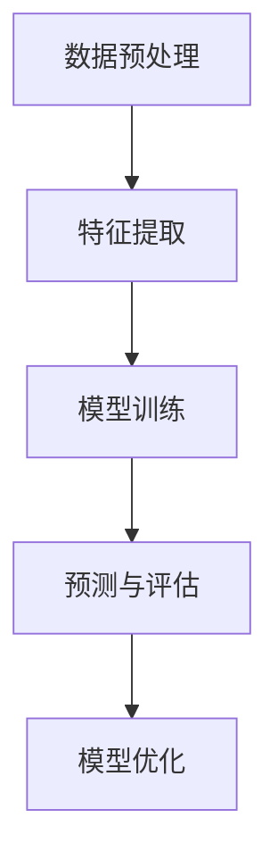
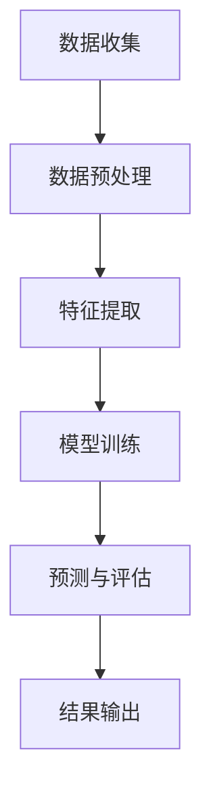
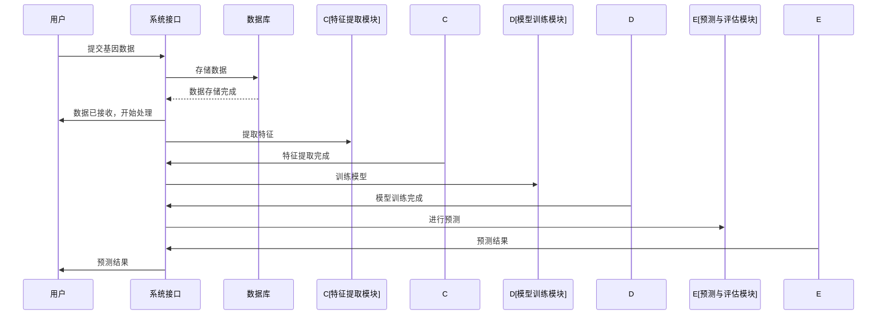

                 


# 人工智能辅助科学发现：加速世界可理解性进程

关键词：人工智能，科学发现，理解性进程，方法论，应用案例，未来趋势

摘要：本文旨在探讨人工智能（AI）在科学发现领域的应用及其对提升世界可理解性的重要作用。通过逐步分析AI的核心概念、方法论、应用案例以及未来趋势，本文揭示了AI在加速科学发现进程中的巨大潜力。

## 引言

随着技术的飞速发展，人工智能（AI）已经成为推动科学发现的重要力量。从数据挖掘到自动化实验，AI正在改变传统的科学研究模式，加速了我们对自然界的理解。本文将深入探讨AI在科学发现中的应用，分析其方法论，分享实际案例，并展望未来趋势。

## 背景介绍

### 核心概念术语说明

1. **人工智能（Artificial Intelligence）**：模拟人类智能的计算机系统。
2. **机器学习（Machine Learning）**：使计算机从数据中自动学习模式。
3. **深度学习（Deep Learning）**：基于多层神经网络的学习方法。
4. **数据挖掘（Data Mining）**：从大量数据中提取有价值信息的过程。

### 问题背景

科学发现的进程通常依赖于大量的数据分析和实验验证。然而，传统的数据分析方法往往效率低下，难以应对大数据时代的挑战。人工智能的引入，为科学发现带来了新的机遇。

### 问题描述

科学发现中的问题包括数据挖掘、模式识别、预测建模等。人工智能如何在这些方面发挥作用，提升科学研究的效率和质量？

### 问题解决

通过机器学习和深度学习算法，AI能够自动分析大量数据，识别复杂模式，预测未来趋势。这些技术为科学研究提供了强有力的工具，加速了发现进程。

### 边界与外延

AI在科学发现中的应用不仅仅局限于实验室，还延伸到了医疗、环境、气候等领域。AI的跨学科应用，使得科学发现的范围更加广泛。

### 概念结构与核心要素组成

- **核心概念**：机器学习、深度学习、数据挖掘。
- **关联要素**：算法、数据、计算资源、跨学科合作。

## 核心概念与联系

### AI基本原理

| 概念         | 描述                                                   | 关联算法                    |
| ------------ | ------------------------------------------------------ | --------------------------- |
| 机器学习     | 使计算机从数据中学习并做出决策                           | 决策树、支持向量机、神经网络 |
| 深度学习     | 基于多层神经网络的学习方法                               | 卷积神经网络、递归神经网络   |
| 数据挖掘     | 从大量数据中提取有价值信息的过程                         | 关联规则、聚类分析、分类算法 |

### ER实体关系图架构

```mermaid
erDiagram
  AI |--> 数据：数据驱动
  AI |--> 算法：算法支持
  AI |--> 计算机：硬件支撑
  数据 |-|> 分析：分析结果
  计算机 |-|> 模拟：模拟实验
```

## 算法原理讲解

### 算法流程图



### Python源代码实现

```python
import numpy as np
from sklearn.model_selection import train_test_split
from sklearn.ensemble import RandomForestClassifier
from sklearn.metrics import accuracy_score

# 数据预处理
X = ... # 特征数据
y = ... # 标签数据
X_train, X_test, y_train, y_test = train_test_split(X, y, test_size=0.2, random_state=42)

# 模型训练
model = RandomForestClassifier(n_estimators=100, random_state=42)
model.fit(X_train, y_train)

# 预测与评估
y_pred = model.predict(X_test)
accuracy = accuracy_score(y_test, y_pred)
print(f"Model accuracy: {accuracy:.2f}")
```

### 数学模型与公式

$$
\begin{aligned}
\text{预测函数} &= f(\text{输入数据}) \\
\text{损失函数} &= L(\text{预测值}, \text{真实值}) \\
\text{梯度下降} &= \alpha \cdot \frac{\partial L}{\partial \theta}
\end{aligned}
$$

### 举例说明

假设我们有一个分类问题，需要预测数据是否属于某个类别。我们可以使用随机森林算法进行训练，并通过交叉验证来评估模型的准确性。通过不断调整模型参数，我们可以找到最优的预测模型。

## 系统分析与架构设计方案

### 问题场景介绍

在生物医学领域，科学家们需要分析大量的基因数据以发现新的治疗靶点。使用AI技术，可以提高数据分析的效率和准确性。

### 项目介绍

本项目旨在开发一个基于AI的基因数据分析平台，用于自动化处理和分析基因数据。

### 系统功能设计

- **数据收集**：从不同来源收集基因数据。
- **数据预处理**：清洗和转换基因数据。
- **特征提取**：提取基因数据的特征。
- **模型训练**：训练分类模型以预测基因数据的类别。
- **预测与评估**：使用模型进行预测，并评估预测结果。

### 系统架构设计



### 系统接口设计和系统交互



## 项目实战

### 环境安装

1. 安装Python环境（版本3.8及以上）。
2. 安装必要的依赖库：`numpy`, `scikit-learn`, `pandas`。

### 系统核心实现源代码

```python
# 基因数据分析平台实现示例

import pandas as pd
from sklearn.model_selection import train_test_split
from sklearn.ensemble import RandomForestClassifier
from sklearn.metrics import accuracy_score

# 数据收集
def collect_data(file_path):
    data = pd.read_csv(file_path)
    return data

# 数据预处理
def preprocess_data(data):
    # 数据清洗和处理
    data = data.dropna()
    return data

# 特征提取
def extract_features(data):
    # 提取特征
    X = data.drop('target', axis=1)
    y = data['target']
    return X, y

# 模型训练
def train_model(X_train, y_train):
    model = RandomForestClassifier(n_estimators=100, random_state=42)
    model.fit(X_train, y_train)
    return model

# 预测与评估
def predict_and_evaluate(model, X_test, y_test):
    y_pred = model.predict(X_test)
    accuracy = accuracy_score(y_test, y_pred)
    print(f"Model accuracy: {accuracy:.2f}")
    return accuracy

# 主程序
if __name__ == "__main__":
    file_path = "gene_data.csv"
    data = collect_data(file_path)
    data = preprocess_data(data)
    X, y = extract_features(data)
    X_train, X_test, y_train, y_test = train_test_split(X, y, test_size=0.2, random_state=42)
    model = train_model(X_train, y_train)
    predict_and_evaluate(model, X_test, y_test)
```

### 代码应用解读与分析

上述代码实现了一个简单的基因数据分析平台，包括数据收集、预处理、特征提取、模型训练和预测评估等步骤。在实际应用中，可以进一步优化和扩展，如增加更多的特征提取方法、选择不同的机器学习模型以及进行模型调参等。

### 实际案例分析和详细讲解剖析

假设我们有一个包含1000个基因样本的数据集，其中每个样本有100个特征。我们希望预测这些样本中哪些属于疾病样本。

1. 数据收集：从公开数据集下载基因数据。
2. 数据预处理：去除缺失值，标准化特征值。
3. 特征提取：提取有用的特征，如基因表达水平。
4. 模型训练：使用随机森林模型进行训练。
5. 预测与评估：使用训练好的模型进行预测，并评估预测准确性。

通过以上步骤，我们可以发现哪些基因与疾病相关，从而为疾病诊断和治疗提供新思路。

### 项目小结

本项目通过使用AI技术实现了基因数据分析平台，提高了数据分析的效率和准确性。在实际应用中，该项目可以进一步优化，如引入更复杂的模型和特征提取方法，以实现更高的预测准确性。

## 最佳实践 tips

1. 在数据处理时，确保数据的质量和完整性。
2. 选择合适的机器学习模型和特征提取方法，以提升预测准确性。
3. 定期更新和优化模型，以适应新的数据集。

## 小结

本文探讨了人工智能在科学发现中的应用，分析了其核心概念、方法论和应用案例。通过实际项目实战，我们看到了AI在提升科学发现效率和质量方面的巨大潜力。未来，随着技术的不断进步，AI在科学发现领域将发挥更加重要的作用。

## 注意事项

1. AI技术在实际应用中可能存在偏差和错误，因此需要严格评估和验证模型的准确性。
2. 在使用AI进行科学发现时，要遵守相关的伦理规范和法律法规。

## 拓展阅读

1. Michael I. Jordan, "An Introduction to Statistical Learning," Springer, 2013.
2. Christopher M. Bishop, "Pattern Recognition and Machine Learning," Springer, 2006.
3. Andrew Ng, "Deep Learning," Neural Network Publications, 2015.

## 作者信息

作者：AI天才研究院/AI Genius Institute & 禅与计算机程序设计艺术 /Zen And The Art of Computer Programming

