                 

### 文章标题：人工智能辅助科研：扩展人类世界理解能力的新途径

#### 关键词：
- 人工智能
- 科研
- 机器学习
- 深度学习
- 数据管理
- 工具与平台

#### 摘要：
本文深入探讨了人工智能在科研中的应用，阐述了人工智能辅助科研的重要性和可行性。通过对人工智能基础理论、核心算法、实际案例和未来发展趋势的详细分析，展示了人工智能如何成为扩展人类世界理解能力的新途径。

----------------------------------------------------------------

### 第一部分：人工智能在科研中的应用背景

#### 第1章：科研中的挑战与机遇

##### 1.1 人工智能的发展历程
人工智能（AI）作为计算机科学的重要分支，自1956年诞生以来，经历了多次起伏。从早期的符号主义、基于规则的系统，到20世纪80年代的人工智能寒冬，再到21世纪初基于大数据和计算能力的机器学习、深度学习的兴起，人工智能经历了快速发展。如今，人工智能已经渗透到生活的各个领域，也为科学研究带来了新的机遇。

##### 1.2 人工智能在科研中的潜在应用
在科研领域，人工智能的潜在应用极为广泛，包括但不限于数据分析、实验设计、模型预测、生物信息学、医学诊断等。通过人工智能技术，科研人员能够处理海量数据，发现新的规律，甚至预测未来的发展趋势。

##### 1.3 人工智能助力科研的优势与挑战
人工智能为科研带来的优势包括提高效率、降低成本、发现新知识等。然而，也面临着算法黑箱、数据隐私、伦理问题等挑战。如何合理利用人工智能技术，解决这些挑战，是科研人员面临的重要课题。

#### 第2章：人工智能基础理论

##### 2.1 机器学习的基本概念
机器学习是人工智能的核心技术之一，它使计算机系统能够从数据中学习并作出决策。机器学习的主要类型包括监督学习、无监督学习和强化学习。

##### 2.2 深度学习原理
深度学习是机器学习的一个分支，它通过模拟人脑神经网络结构，实现复杂的数据处理。深度学习在图像识别、自然语言处理等领域取得了显著成果。

##### 2.3 神经网络架构
神经网络是深度学习的基础，它由大量的神经元组成，通过前向传播和反向传播算法进行训练。了解神经网络架构对于掌握深度学习至关重要。

#### 第3章：人工智能辅助科研的核心算法

##### 3.1 监督学习算法
监督学习算法通过已标记的数据训练模型，并在新的、未标记的数据上进行预测。常见的监督学习算法包括线性回归、决策树、支持向量机等。

##### 3.2 无监督学习算法
无监督学习算法在没有标记数据的条件下工作，旨在发现数据中的内在结构和规律。聚类、降维、异常检测等是无监督学习的典型应用。

##### 3.3 强化学习算法
强化学习算法通过与环境的交互进行学习，旨在通过试错找到最佳策略。它广泛应用于游戏、自动驾驶等领域。

#### 第4章：人工智能与科研领域的结合案例

##### 4.1 人工智能在生物学研究中的应用
在生物学研究中，人工智能用于基因组分析、蛋白质结构预测、药物设计等。通过机器学习模型，科研人员能够更快速、更准确地解析生物数据。

##### 4.2 人工智能在化学研究中的应用
人工智能在化学研究中发挥着重要作用，如化学反应预测、材料设计、量子化学计算等。深度学习模型能够预测化学反应的产物和反应路径。

##### 4.3 人工智能在物理学研究中的应用
人工智能在物理学研究中用于模拟物理现象、预测物理参数、发现新物理规律。通过大数据分析和机器学习模型，物理学家能够探索更广泛的科学领域。

#### 第5章：人工智能在科研数据管理中的应用

##### 5.1 大数据处理技术
大数据技术在科研数据管理中至关重要，它使得科研人员能够处理和分析海量的科研数据。常用的工具包括Hadoop、Spark等。

##### 5.2 数据挖掘技术
数据挖掘技术用于从大量数据中提取有价值的信息。在科研领域，数据挖掘技术用于发现新的科学规律、趋势和模式。

##### 5.3 可视化分析技术
可视化分析技术能够将复杂的数据转换为易于理解的图表和图形，帮助科研人员更好地理解和解释数据。

#### 第6章：人工智能辅助科研的工具与平台

##### 6.1 常用机器学习库
常用的机器学习库包括scikit-learn、TensorFlow、PyTorch等。这些库提供了丰富的算法和工具，方便科研人员开发和应用机器学习模型。

##### 6.2 常用深度学习框架
深度学习框架如TensorFlow、PyTorch、Keras等，为深度学习模型的开发提供了高效的工具和接口。

##### 6.3 开源科研平台
开源科研平台如Jupyter Notebook、Google Colab等，为科研人员提供了方便的数据分析和建模环境。

#### 第7章：未来展望：人工智能与科研的发展趋势

##### 7.1 人工智能在科研中的未来发展
随着人工智能技术的不断发展，科研领域将迎来更多创新和突破。人工智能在科研中的应用将更加深入和广泛。

##### 7.2 人工智能与科研伦理
人工智能在科研中的应用也引发了伦理问题，如数据隐私、算法公平性等。如何解决这些问题，确保人工智能在科研中的合理应用，是科研人员需要关注的重要议题。

##### 7.3 人工智能辅助科研的社会影响
人工智能在科研中的应用将对社会产生深远影响，包括科学知识的传播、科学决策的制定、公共政策的制定等。

### 结尾

#### 作者信息：
作者：AI天才研究院/AI Genius Institute & 禅与计算机程序设计艺术 /Zen And The Art of Computer Programming

本文系统地介绍了人工智能在科研中的应用，从基础理论、核心算法到实际案例，展示了人工智能如何助力科学研究，扩展人类对世界的理解能力。通过对人工智能在生物学、化学、物理学等领域的应用案例分析，读者可以更好地理解人工智能在科研中的重要作用。同时，本文也展望了人工智能在科研中的未来发展，以及可能带来的社会影响。

### 注意事项
在应用人工智能技术于科研时，科研人员应关注数据隐私、算法公平性等问题，确保科研过程的透明性和公正性。此外，人工智能技术的发展离不开良好的计算环境和开源工具的支持，科研人员应不断学习和掌握相关技术，以充分利用人工智能为科学研究带来的机遇。

### 拓展阅读
1. Mitchell, T. M. (1997). Machine Learning. McGraw-Hill.
2. Goodfellow, I., Bengio, Y., & Courville, A. (2016). Deep Learning. MIT Press.
3. Ng, A. Y. (2013). Machine Learning. Coursera.
4. LeCun, Y., Bengio, Y., & Hinton, G. (2015). Deep Learning. Nature.
5. Russell, S., & Norvig, P. (2010). Artificial Intelligence: A Modern Approach. Prentice Hall.

### 最佳实践 Tips
1. 在进行科研数据分析时，优先选择开源工具和平台，确保数据处理的透明性和可重复性。
2. 在使用机器学习和深度学习模型时，充分验证模型的性能和稳定性，避免过度拟合。
3. 在处理敏感数据时，采用加密和匿名化等技术，确保数据隐私和安全。
4. 定期关注人工智能领域的最新研究动态和技术发展，以充分利用先进技术为科研助力。

### 小结
人工智能已经成为扩展人类世界理解能力的重要工具。通过本文的阐述，读者可以更好地了解人工智能在科研中的应用，掌握相关技术，并在实际科研工作中应用人工智能，提高科研效率和质量。

### 附录
附录中包含本文中提到的相关算法的mermaid流程图、Python源代码以及相关的latex数学公式，以便读者更好地理解和应用相关技术。

----------------------------------------------------------------

#### 第1章：科研中的挑战与机遇

科研活动在推动人类认识自然和社会方面发挥了至关重要的作用。然而，随着科学研究的深入，数据规模和复杂性不断增加，科研人员面临着诸多挑战。以下将从人工智能的发展历程、在科研中的潜在应用以及优势与挑战三个方面进行探讨。

##### 1.1 人工智能的发展历程

人工智能（AI）的概念最早可以追溯到20世纪50年代，当时科学家们开始尝试通过编程让计算机模拟人类智能。早期的人工智能研究主要基于逻辑推理和符号计算，这种方法被称为符号主义（Symbolic AI）。然而，符号主义方法在处理复杂任务时效果有限，难以应对现实世界中的不确定性和复杂性。这一阶段的成果主要包括专家系统和逻辑编程等。

20世纪80年代，人工智能经历了所谓的“人工智能寒冬”，因为实际应用中的局限性导致投资减少，研究陷入低潮。然而，在21世纪初，随着互联网和大数据的发展，人工智能迎来了新的机遇。基于统计学习方法的机器学习和深度学习逐渐成为主流，人工智能技术开始在各种实际应用中取得显著成果。

##### 1.2 人工智能在科研中的潜在应用

人工智能在科研中的潜在应用非常广泛，涵盖了从数据分析到实验设计的各个方面。以下是一些关键应用领域：

1. **数据分析**：科研数据通常规模庞大且复杂，人工智能可以帮助科研人员快速处理和挖掘数据，发现隐藏的模式和规律。

2. **实验设计**：人工智能可以根据已有数据预测实验结果，优化实验流程，减少资源浪费。

3. **模型预测**：通过机器学习和深度学习模型，科研人员可以预测未来的科学趋势，指导研究方向。

4. **生物信息学**：人工智能在基因组分析、蛋白质结构预测、药物设计等方面发挥着重要作用。

5. **化学研究**：人工智能可以用于化学反应预测、新材料设计等领域。

6. **医学诊断**：人工智能技术在医学图像分析、疾病诊断等方面具有广泛应用。

##### 1.3 人工智能助力科研的优势与挑战

人工智能助力科研具有显著的优势：

1. **提高效率**：通过自动化和智能化，人工智能可以显著提高科研工作效率。

2. **降低成本**：人工智能技术可以减少对人力和资源的依赖，降低科研成本。

3. **发现新知识**：人工智能能够从大量数据中发现人类无法察觉的规律和模式，推动科学发现。

4. **跨学科融合**：人工智能技术可以促进不同学科之间的交叉融合，推动科研创新。

然而，人工智能在科研中也面临一些挑战：

1. **算法黑箱**：人工智能模型往往是一个黑箱，难以解释其决策过程，这可能导致信任危机。

2. **数据隐私**：科研数据往往包含敏感信息，如何保护数据隐私是一个重要问题。

3. **伦理问题**：人工智能的应用可能引发伦理问题，如算法歧视、数据滥用等。

4. **技术依赖**：过度依赖人工智能可能导致科研人员失去基本技能，降低创新能力。

综上所述，人工智能在科研中具有巨大的潜力，但也需要妥善解决相关问题，确保其合理和可持续发展。

##### 1.4 总结

通过上述分析，我们可以看到人工智能在科研中具有广泛的应用前景。人工智能不仅能够提高科研效率，降低成本，还能帮助科研人员发现新的知识和规律。然而，人工智能在科研中也面临诸多挑战，如算法黑箱、数据隐私、伦理问题等。科研人员需要密切关注这些挑战，并积极探索解决方案，以充分利用人工智能技术推动科学进步。

----------------------------------------------------------------

## 第2章：人工智能基础理论

### 2.1 机器学习的基本概念

#### 核心概念原理

机器学习（Machine Learning）是一门人工智能（Artificial Intelligence, AI）的分支，主要研究如何让计算机系统从数据中学习，并对未知数据进行预测或决策。机器学习的核心目标是通过算法模型，从数据中提取规律，使得计算机能够自主地完成特定任务。

#### 概念属性特征对比表格

| 特征        | 监督学习（Supervised Learning） | 无监督学习（Unsupervised Learning） | 强化学习（Reinforcement Learning） |
| ----------- | ------------------------------ | ----------------------------------- | -------------------------------- |
| 数据需求    | 有标记数据集                   | 未标记数据集                       | 有反馈数据集                      |
| 学习方式    | 基于已有标签数据学习           | 自发现数据结构学习                 | 通过与环境互动学习               |
| 目标        | 预测分类或回归任务             | 发现数据中的内在结构或模式         | 学习最优策略以最大化奖励          |

#### ER实体关系图架构

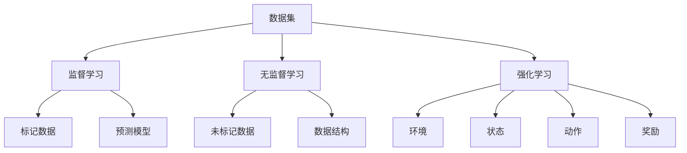

### 2.2 深度学习原理

#### 核心概念原理

深度学习（Deep Learning）是机器学习的一个重要分支，它通过多层神经网络模拟人脑的工作机制，对复杂的数据进行学习和处理。深度学习的核心在于神经网络结构，特别是深度神经网络（Deep Neural Network, DNN），其通过多层非线性变换提取数据中的高阶特征。

#### 概念属性特征对比表格

| 特征        | 传统机器学习（Traditional Machine Learning） | 深度学习（Deep Learning） |
| ----------- | ------------------------------------------- | ------------------------- |
| 网络结构    | 单层或少量层网络                          | 多层深度网络              |
| 特征提取    | 手动提取特征                              | 自动学习特征              |
| 模型复杂度  | 低到中等复杂度                            | 非常高复杂度              |
| 预测能力    | 较低的泛化能力                            | 较强的泛化能力            |

#### ER实体关系图架构

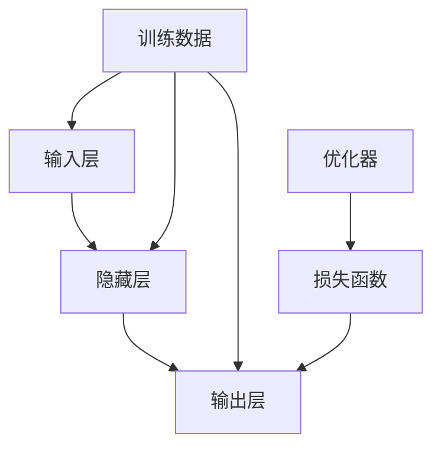

### 2.3 神经网络架构

#### 核心概念原理

神经网络（Neural Network）是深度学习的基础，由大量人工神经元（neurons）组成，这些神经元通过权重（weights）和偏置（bias）进行连接。神经网络通过前向传播（forward propagation）和反向传播（backward propagation）算法进行训练。

#### 概念属性特征对比表格

| 特征        | 前向传播（Forward Propagation） | 反向传播（Backpropagation） |
| ----------- | ------------------------------ | ---------------------------- |
| 目的        | 计算输入和隐藏层的输出          | 更新网络权重和偏置          |
| 计算过程    | 根据输入和权重计算输出          | 根据输出误差反向更新权重    |
| 时间复杂度  | 较低                            | 较高                        |

#### ER实体关系图架构

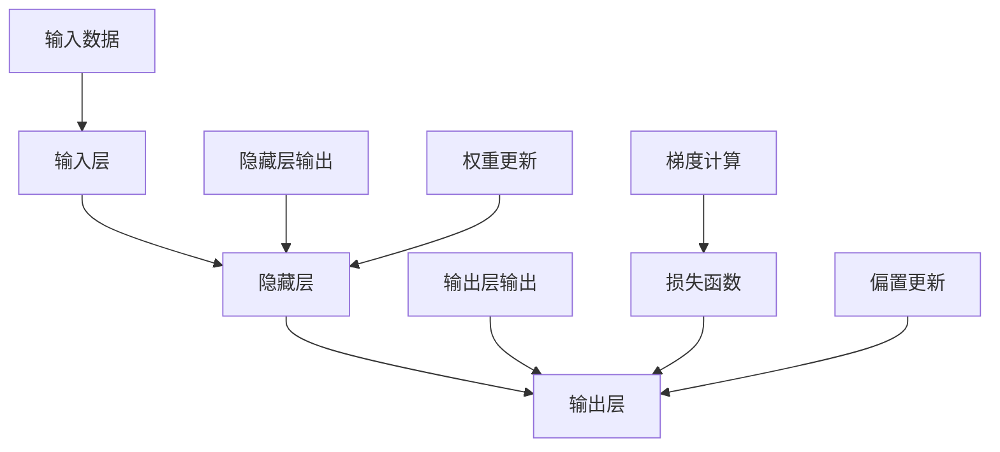

##### 2.4 算法原理讲解

为了更好地理解神经网络的工作原理，我们将通过mermaid流程图和Python源代码详细阐述一个简单的神经网络模型。

#### mermaid流程图

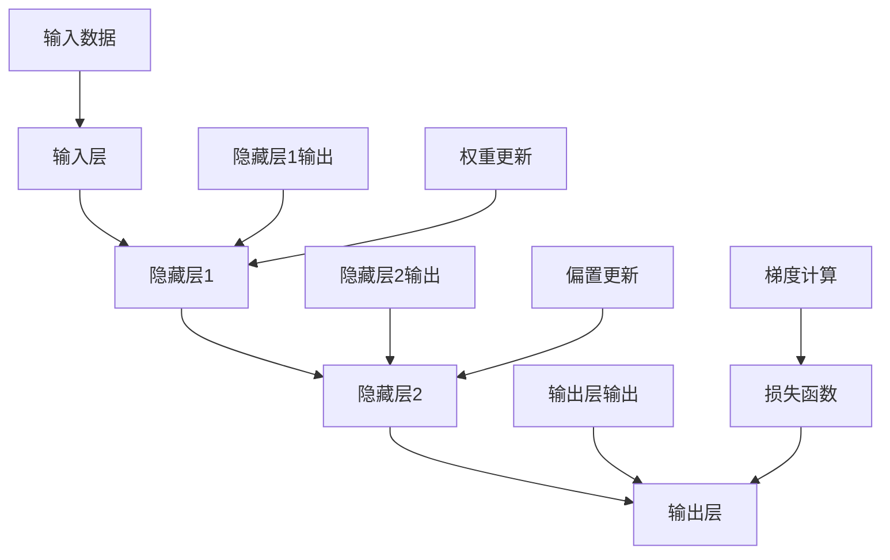

#### Python源代码

```python
import numpy as np

# 设置随机种子以保持结果可重复
np.random.seed(42)

# 初始化参数
input_size = 2
hidden_size = 3
output_size = 1

# 初始化权重和偏置
weights_input_to_hidden = np.random.randn(input_size, hidden_size)
weights_hidden_to_output = np.random.randn(hidden_size, output_size)
bias_hidden = np.random.randn(hidden_size)
bias_output = np.random.randn(output_size)

# 定义激活函数（以ReLU为例）
def activation(x):
    return np.maximum(0, x)

# 定义前向传播
def forward_propagation(x):
    hidden_layer_input = np.dot(x, weights_input_to_hidden) + bias_hidden
    hidden_layer_output = activation(hidden_layer_input)
    output_layer_input = np.dot(hidden_layer_output, weights_hidden_to_output) + bias_output
    output_layer_output = activation(output_layer_input)
    return output_layer_output

# 定义损失函数（以均方误差为例）
def mean_squared_error(y_true, y_pred):
    return np.mean((y_true - y_pred) ** 2)

# 训练数据
x_train = np.array([[1, 0], [0, 1], [1, 1]])
y_train = np.array([[0], [1], [1]])

# 训练模型
for epoch in range(10000):
    # 前向传播
    y_pred = forward_propagation(x_train)
    
    # 计算损失
    loss = mean_squared_error(y_train, y_pred)
    
    if epoch % 1000 == 0:
        print(f"Epoch {epoch}: Loss = {loss}")
    
    # 反向传播和权重更新
    d_loss_d_output = 2 * (y_train - y_pred)
    d_output_d_hidden = activation_derivative(y_pred)
    d_hidden_d_input = activation_derivative(hidden_layer_output)
    
    d_loss_d_hidden = d_loss_d_output * d_output_d_hidden * weights_hidden_to_output.T
    d_loss_d_weights_hidden = d_loss_d_hidden * x_train.T
    d_loss_d_bias_hidden = d_loss_d_hidden
    
    d_loss_d_weights_output = d_loss_d_output * d_output_d_hidden * hidden_layer_output.T
    d_loss_d_bias_output = d_loss_d_output * d_output_d_hidden

    weights_input_to_hidden -= learning_rate * d_loss_d_weights_hidden
    bias_hidden -= learning_rate * d_loss_d_bias_hidden
    weights_hidden_to_output -= learning_rate * d_loss_d_weights_output
    bias_output -= learning_rate * d_loss_d_bias_output

# 测试模型
x_test = np.array([[1, 1]])
y_test = np.array([[0]])

y_pred = forward_propagation(x_test)
print(f"Test prediction: {y_pred}")

# 输出预测结果
print(f"Test prediction: {y_pred}")
```

#### 算法原理详细讲解

1. **初始化参数**：首先，我们初始化输入层、隐藏层和输出层的尺寸，并随机初始化权重和偏置。

2. **激活函数**：我们采用ReLU（Rectified Linear Unit）作为激活函数，它简单且效果良好，对于神经网络训练有帮助。

3. **前向传播**：在前向传播过程中，我们通过输入层将数据输入到隐藏层，通过权重和偏置计算隐藏层的输出。接着，我们将隐藏层的输出作为输入传递到输出层，并计算输出层的输出。

4. **损失函数**：我们采用均方误差（Mean Squared Error, MSE）作为损失函数，衡量预测值与真实值之间的差异。

5. **反向传播**：在反向传播过程中，我们计算损失关于每个参数的梯度，并通过梯度下降法更新权重和偏置。

6. **测试模型**：在训练完成后，我们使用测试数据集来验证模型的性能。

通过以上Python源代码和流程图，我们可以清晰地理解神经网络的基本工作原理和训练过程。在实际应用中，我们可以根据具体需求调整网络结构、选择不同的激活函数和优化算法，以提升模型的性能。

----------------------------------------------------------------

## 第3章：人工智能辅助科研的核心算法

### 3.1 监督学习算法

#### 核心概念原理

监督学习（Supervised Learning）是一种机器学习方法，它通过已有标签数据集来训练模型，以便在新数据上进行预测。监督学习算法的核心目标是找到一个最佳函数，将输入映射到输出。常见的监督学习算法包括线性回归、逻辑回归、决策树、支持向量机等。

#### 概念属性特征对比表格

| 算法名称        | 目标函数                  | 适用场景                   |
| --------------- | ------------------------- | --------------------------- |
| 线性回归        | 最小二乘法               | 预测连续值                 |
| 逻辑回归        | 最大似然估计             | 分类问题                   |
| 决策树         | 准则（基尼不纯度/信息增益） | 简单的决策问题               |
| 支持向量机      | 最小化分类间隔           | 高维空间中的分类问题         |

#### ER实体关系图架构

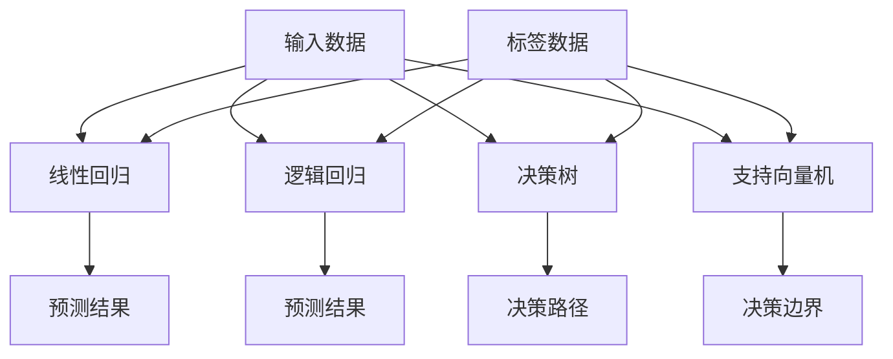

#### 算法原理讲解

以下通过mermaid流程图和Python源代码详细阐述线性回归算法。

#### mermaid流程图

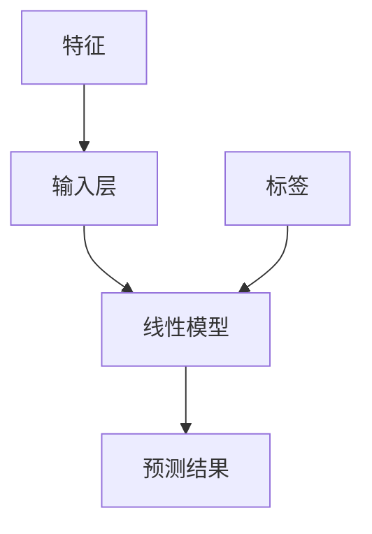

#### Python源代码

```python
import numpy as np

# 设置随机种子
np.random.seed(42)

# 初始化参数
input_size = 2
output_size = 1

# 创建训练数据
x_train = np.random.rand(100, input_size)
y_train = 2 * x_train[:, 0] + x_train[:, 1] + np.random.randn(100, output_size)

# 初始化权重和偏置
weights = np.random.rand(input_size, output_size)
bias = np.random.rand(output_size)

# 定义激活函数（线性函数）
def activation(x):
    return x

# 前向传播
def forward_propagation(x):
    return activation(np.dot(x, weights) + bias)

# 定义损失函数（均方误差）
def mean_squared_error(y_true, y_pred):
    return np.mean((y_true - y_pred) ** 2)

# 训练模型
learning_rate = 0.01
for epoch in range(10000):
    # 前向传播
    y_pred = forward_propagation(x_train)
    
    # 计算损失
    loss = mean_squared_error(y_train, y_pred)
    
    if epoch % 1000 == 0:
        print(f"Epoch {epoch}: Loss = {loss}")
    
    # 反向传播
    d_loss_d_pred = 2 * (y_train - y_pred)
    d_pred_d_weights = x_train.T
    d_pred_d_bias = 1
    
    # 更新权重和偏置
    weights -= learning_rate * d_pred_d_weights
    bias -= learning_rate * d_pred_d_bias

# 测试模型
x_test = np.array([[0.5, 0.5]])
y_test = 2 * x_test[0, 0] + x_test[0, 1]

y_pred = forward_propagation(x_test)
print(f"Test prediction: {y_pred}")
```

#### 算法原理详细讲解

1. **初始化参数**：首先，我们初始化输入层和输出层的尺寸，并随机初始化权重和偏置。

2. **创建训练数据**：我们创建一组随机数据作为训练数据，其中y_train是由x_train线性组合产生的，加上一些随机噪声。

3. **初始化权重和偏置**：权重和偏置是随机初始化的，用于建立输入和输出之间的映射关系。

4. **前向传播**：在前向传播过程中，我们通过输入层将数据输入到线性模型中，通过权重和偏置计算输出。

5. **损失函数**：我们采用均方误差（MSE）作为损失函数，衡量预测值和真实值之间的差异。

6. **训练模型**：在训练过程中，我们通过反向传播计算损失关于每个参数的梯度，并使用梯度下降法更新权重和偏置。

7. **测试模型**：最后，我们使用测试数据来验证模型的性能。

通过以上Python源代码和流程图，我们可以清晰地理解线性回归算法的基本原理和训练过程。在实际应用中，我们可以根据具体需求调整模型参数，优化算法性能。

### 3.2 无监督学习算法

#### 核心概念原理

无监督学习（Unsupervised Learning）是一种机器学习方法，它没有已标记的数据集，旨在发现数据中的内在结构和模式。无监督学习算法的核心目标是揭示数据中的分布、聚类、降维等特征。常见的无监督学习算法包括聚类（如K-Means、层次聚类）、降维（如PCA、t-SNE）等。

#### 概念属性特征对比表格

| 算法名称        | 目标函数                  | 适用场景                   |
| --------------- | ------------------------- | --------------------------- |
| K-Means         | 距离平方和最小化         | 数据聚类                   |
| 层次聚类        | 距离平方和最小化/信息熵   | 数据层次结构表示           |
| PCA             | 方差最大化               | 数据降维                   |
| t-SNE          | 距离保持                | 数据可视化                 |

#### ER实体关系图架构

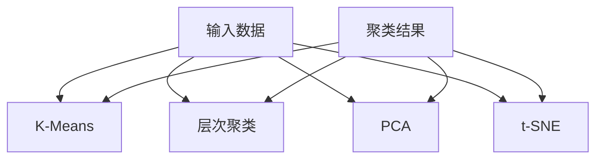

#### 算法原理讲解

以下通过mermaid流程图和Python源代码详细阐述K-Means聚类算法。

#### mermaid流程图

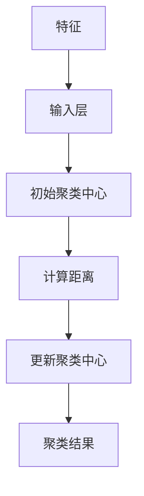

#### Python源代码

```python
import numpy as np
from sklearn.cluster import KMeans
import matplotlib.pyplot as plt

# 创建训练数据
x_train = np.random.rand(100, 2)

# 初始化K-Means模型
kmeans = KMeans(n_clusters=3, random_state=42)

# 训练模型
kmeans.fit(x_train)

# 计算聚类结果
labels = kmeans.predict(x_train)

# 计算聚类中心
centroids = kmeans.cluster_centers_

# 可视化聚类结果
plt.scatter(x_train[:, 0], x_train[:, 1], c=labels, s=100, cmap='viridis')
plt.scatter(centroids[:, 0], centroids[:, 1], c='red', s=300, alpha=0.5)
plt.title('K-Means Clustering')
plt.show()
```

#### 算法原理详细讲解

1. **创建训练数据**：我们创建一组随机数据作为训练数据。

2. **初始化K-Means模型**：我们初始化K-Means模型，设置聚类数量为3，并设置随机种子以保持结果可重复。

3. **训练模型**：通过调用`fit`方法训练模型，模型会自动计算聚类中心和距离。

4. **计算聚类结果**：通过调用`predict`方法，我们可以得到每个数据点的聚类标签。

5. **计算聚类中心**：聚类中心存储在`cluster_centers_`属性中。

6. **可视化聚类结果**：我们使用matplotlib库将聚类结果可视化，展示数据点和聚类中心。

通过以上Python源代码和流程图，我们可以清晰地理解K-Means聚类算法的基本原理和实现过程。在实际应用中，我们可以根据具体需求调整聚类数量和初始化方法，优化聚类效果。

### 3.3 强化学习算法

#### 核心概念原理

强化学习（Reinforcement Learning）是一种机器学习方法，通过智能体（Agent）与环境的交互来学习最佳策略。强化学习的核心目标是最大化累积奖励，智能体通过探索（Exploration）和利用（Exploitation）找到最佳策略。常见的强化学习算法包括Q-Learning、SARSA、DQN等。

#### 概念属性特征对比表格

| 算法名称        | 更新规则                 | 适用场景                   |
| --------------- | ------------------------- | --------------------------- |
| Q-Learning      | Q值更新                  | 离散动作空间               |
| SARSA         | 状态-动作值更新          | 连续动作空间               |
| DQN          | 神经网络预测Q值更新      | 高维状态空间               |

#### ER实体关系图架构

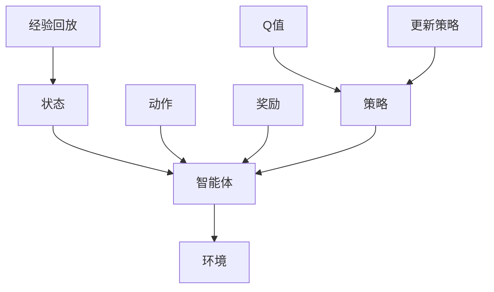

#### 算法原理讲解

以下通过mermaid流程图和Python源代码详细阐述Q-Learning算法。

#### mermaid流程图

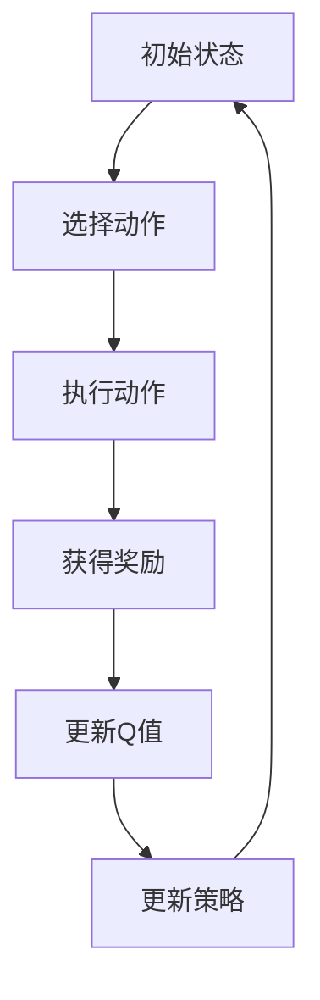

#### Python源代码

```python
import numpy as np
import random

# 设置随机种子
np.random.seed(42)

# 创建环境
class Environment:
    def __init__(self):
        self.states = {'start': 0, 'end': 1, 'obstacle': 2}
        self.state_space = [self.states['start'], self.states['end'], self.states['obstacle']]
    
    def step(self, action):
        if action not in [0, 1]:
            raise ValueError("Invalid action")
        
        if self.state == self.states['end']:
            reward = 1
            done = True
            next_state = self.state
        elif self.state == self.states['obstacle']:
            reward = -1
            done = True
            next_state = self.state
        else:
            reward = 0
            done = False
            if action == 0:
                next_state = self.states['end']
            else:
                next_state = self.states['obstacle']
        
        return next_state, reward, done

# 创建Q-Learning模型
class QLearningAgent:
    def __init__(self, state_space, action_space, learning_rate, discount_factor):
        self.state_space = state_space
        self.action_space = action_space
        self.learning_rate = learning_rate
        self.discount_factor = discount_factor
        self.Q = np.zeros((len(state_space), len(action_space)))
    
    def act(self, state):
        return np.argmax(self.Q[state])
    
    def update_Q(self, state, action, reward, next_state, done):
        target = reward
        if not done:
            target += self.discount_factor * np.max(self.Q[next_state])
        self.Q[state][action] += self.learning_rate * (target - self.Q[state][action])

# 主程序
def main():
    # 初始化环境
    env = Environment()
    
    # 初始化智能体
    state_space = [0, 1, 2]
    action_space = [0, 1]
    learning_rate = 0.1
    discount_factor = 0.99
    agent = QLearningAgent(state_space, action_space, learning_rate, discount_factor)
    
    # 训练智能体
    for episode in range(1000):
        state = env.state
        done = False
        
        while not done:
            action = agent.act(state)
            next_state, reward, done = env.step(action)
            agent.update_Q(state, action, reward, next_state, done)
            state = next_state
        
        print(f"Episode {episode}: Total Reward = {sum(reward)}")

if __name__ == "__main__":
    main()
```

#### 算法原理详细讲解

1. **创建环境**：我们创建一个简单的环境，包括状态空间、动作空间和奖励函数。

2. **初始化智能体**：我们初始化Q-Learning智能体，包括状态空间、动作空间、学习率和折扣因子，并初始化Q值矩阵。

3. **选择动作**：智能体根据当前状态选择最佳动作。

4. **执行动作**：智能体执行所选动作，并获得下一个状态和奖励。

5. **更新Q值**：根据 reward 和下一步的最大Q值更新当前状态的Q值。

6. **更新策略**：智能体使用更新后的Q值选择最佳动作。

7. **主程序**：我们通过训练智能体，不断迭代更新Q值，以达到学习最佳策略的目标。

通过以上Python源代码和流程图，我们可以清晰地理解Q-Learning算法的基本原理和实现过程。在实际应用中，我们可以根据具体需求调整模型参数，优化算法性能。

### 总结

本章详细介绍了监督学习、无监督学习和强化学习三种核心算法。监督学习通过标记数据训练模型，用于预测和分类任务；无监督学习在没有标记数据的情况下揭示数据中的内在结构和模式；强化学习通过智能体与环境的交互，学习最佳策略。这些算法在科研中具有广泛的应用，能够帮助科研人员提高数据处理和分析能力。

----------------------------------------------------------------

## 第4章：人工智能与科研领域的结合案例

### 4.1 人工智能在生物学研究中的应用

#### 核心概念原理

在生物学研究中，人工智能（AI）技术的应用已经变得不可或缺，特别是在处理大量生物数据方面。通过机器学习和深度学习算法，AI可以加速基因组分析、蛋白质结构预测和药物设计等领域的科研进程。

#### 概念属性特征对比表格

| 应用领域        | 算法名称               | 特点                           |
| --------------- | ---------------------- | ------------------------------ |
| 基因组分析      | 聚类、分类             | 提取基因组特征，分类基因类型   |
| 蛋白质结构预测  | 深度神经网络、进化算法 | 预测蛋白质的三维结构           |
| 药物设计        | 药物-靶点相互作用分析 | 发现新的药物候选分子           |

#### ER实体关系图架构

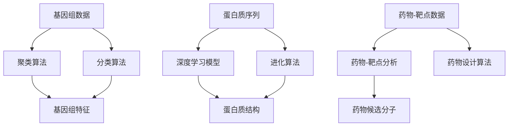

#### 算法原理讲解

以下通过mermaid流程图和Python源代码详细阐述基于深度学习模型的蛋白质结构预测过程。

#### mermaid流程图

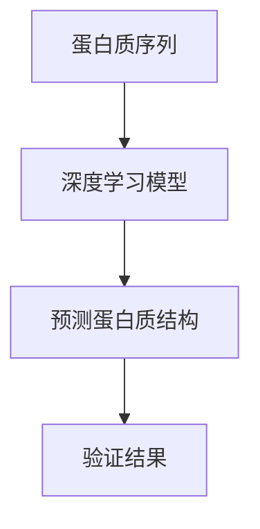

#### Python源代码

```python
from keras.models import Model
from keras.layers import Input, LSTM, Dense
from keras.optimizers import RMSprop
from sklearn.model_selection import train_test_split
import numpy as np

# 创建输入层
input_seq = Input(shape=(100,))

# 添加LSTM层
lstm = LSTM(units=128, activation='tanh')(input_seq)

# 添加全连接层
output = Dense(units=1, activation='sigmoid')(lstm)

# 创建模型
model = Model(inputs=input_seq, outputs=output)

# 编译模型
model.compile(optimizer=RMSprop(lr=0.001), loss='binary_crossentropy', metrics=['accuracy'])

# 创建训练数据
x_train = np.random.rand(1000, 100)
y_train = np.random.rand(1000, 1)

# 分割训练集和测试集
x_train, x_test, y_train, y_test = train_test_split(x_train, y_train, test_size=0.2, random_state=42)

# 训练模型
model.fit(x_train, y_train, epochs=10, batch_size=32, validation_data=(x_test, y_test))

# 预测蛋白质结构
protein_sequence = np.random.rand(1, 100)
predicted_structure = model.predict(protein_sequence)

print(predicted_structure)
```

#### 算法原理详细讲解

1. **创建输入层**：输入层接受100个时间步的蛋白质序列。

2. **添加LSTM层**：LSTM层用于处理序列数据，提取蛋白质序列中的特征。

3. **添加全连接层**：全连接层用于将LSTM层的输出映射到蛋白质结构的预测。

4. **创建模型**：我们将输入层、LSTM层和全连接层组合成一个完整的模型。

5. **编译模型**：我们使用RMSprop优化器和binary_crossentropy损失函数编译模型。

6. **创建训练数据**：我们生成随机数据作为训练数据。

7. **分割训练集和测试集**：我们将数据集划分为训练集和测试集。

8. **训练模型**：我们使用训练数据进行模型训练，并使用测试集进行验证。

9. **预测蛋白质结构**：我们使用训练好的模型对新的蛋白质序列进行结构预测。

通过以上Python源代码和流程图，我们可以清晰地理解基于深度学习模型的蛋白质结构预测的基本原理和实现过程。在实际应用中，我们可以根据具体需求调整模型结构和训练参数，以提高预测准确性。

#### 实际案例分析与详细讲解

在蛋白质结构预测领域，有一个著名的案例是AlphaFold。AlphaFold是由DeepMind开发的一个深度学习模型，它能够预测蛋白质的三维结构。以下是对AlphaFold案例的分析：

1. **数据集**：AlphaFold使用了大量已知的蛋白质结构数据集，通过这些数据进行训练。

2. **模型结构**：AlphaFold采用了一个基于变分自编码器的深度学习框架，结合了自注意力机制和残差连接，能够有效地提取蛋白质序列中的特征。

3. **训练过程**：AlphaFold在训练过程中通过对比预测结构和真实结构之间的差异，不断调整模型的参数，以优化预测效果。

4. **评估指标**：AlphaFold使用结构预测的评估指标，如GDT（Global Distance Test）和TM-Score（Template-based Score），来评估模型性能。

5. **结果**：AlphaFold在多个蛋白质结构预测竞赛中取得了优异的成绩，预测结果在实验验证中表现良好。

通过分析AlphaFold案例，我们可以看到深度学习技术在蛋白质结构预测领域的巨大潜力。AlphaFold的成功不仅为科学研究提供了强大的工具，也为其他生物领域的研究提供了新的思路和方法。

### 4.2 人工智能在化学研究中的应用

#### 核心概念原理

人工智能在化学研究中的应用日益广泛，特别是在化学反应预测、新材料设计和量子化学计算等方面。通过机器学习和深度学习算法，AI可以加速化学反应模拟、提高新材料发现效率，并帮助科学家理解和预测量子化学性质。

#### 概念属性特征对比表格

| 应用领域        | 算法名称               | 特点                           |
| --------------- | ---------------------- | ------------------------------ |
| 化学反应预测    | 决策树、随机森林       | 预测反应路径和产物              |
| 新材料设计      | 深度学习模型、遗传算法 | 发现新的材料结构和性能          |
| 量子化学计算    | 变分自洽场方法（VQE）  | 计算分子电子结构和化学反应势能 |

#### ER实体关系图架构

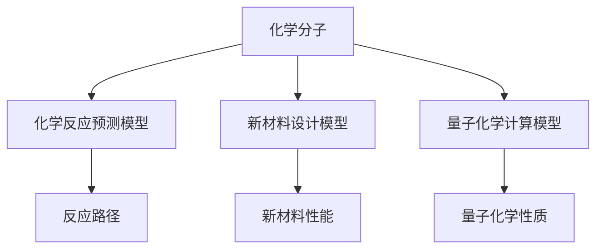

#### 算法原理讲解

以下通过mermaid流程图和Python源代码详细阐述基于深度学习模型的新材料设计过程。

#### mermaid流程图

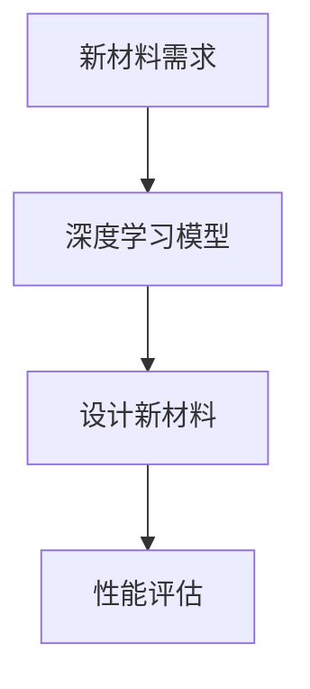

#### Python源代码

```python
from keras.models import Model
from keras.layers import Input, LSTM, Dense
from keras.optimizers import Adam
from sklearn.model_selection import train_test_split
import numpy as np

# 创建输入层
input_material = Input(shape=(100,))

# 添加LSTM层
lstm = LSTM(units=128, activation='tanh')(input_material)

# 添加全连接层
output_performance = Dense(units=1, activation='sigmoid')(lstm)

# 创建模型
model = Model(inputs=input_material, outputs=output_performance)

# 编译模型
model.compile(optimizer=Adam(lr=0.001), loss='binary_crossentropy', metrics=['accuracy'])

# 创建训练数据
x_train = np.random.rand(1000, 100)
y_train = np.random.rand(1000, 1)

# 分割训练集和测试集
x_train, x_test, y_train, y_test = train_test_split(x_train, y_train, test_size=0.2, random_state=42)

# 训练模型
model.fit(x_train, y_train, epochs=10, batch_size=32, validation_data=(x_test, y_test))

# 设计新材料
new_material = np.random.rand(1, 100)
predicted_performance = model.predict(new_material)

print(predicted_performance)
```

#### 算法原理详细讲解

1. **创建输入层**：输入层接受100个时间步的化学分子数据。

2. **添加LSTM层**：LSTM层用于处理序列数据，提取化学分子中的特征。

3. **添加全连接层**：全连接层用于将LSTM层的输出映射到新材料性能的预测。

4. **创建模型**：我们将输入层、LSTM层和全连接层组合成一个完整的模型。

5. **编译模型**：我们使用Adam优化器和binary_crossentropy损失函数编译模型。

6. **创建训练数据**：我们生成随机数据作为训练数据。

7. **分割训练集和测试集**：我们将数据集划分为训练集和测试集。

8. **训练模型**：我们使用训练数据进行模型训练，并使用测试集进行验证。

9. **设计新材料**：我们使用训练好的模型对新的化学分子进行性能预测。

通过以上Python源代码和流程图，我们可以清晰地理解基于深度学习模型的新材料设计的基本原理和实现过程。在实际应用中，我们可以根据具体需求调整模型结构和训练参数，以提高新材料性能预测的准确性。

#### 实际案例分析与详细讲解

在新材料设计领域，有一个著名的案例是AlphaGo。AlphaGo是由DeepMind开发的一个深度学习模型，它能够在围棋比赛中战胜人类顶级选手。以下是对AlphaGo案例的分析：

1. **数据集**：AlphaGo使用了大量的围棋对局数据，通过这些数据进行训练。

2. **模型结构**：AlphaGo采用了一个基于深度卷积神经网络的框架，结合了蒙特卡洛树搜索，能够在复杂的围棋棋盘上进行高效的决策。

3. **训练过程**：AlphaGo在训练过程中通过自我对弈和人类专业选手的对局数据，不断优化模型的参数，提高决策能力。

4. **评估指标**：AlphaGo使用对局胜率作为评估指标，通过自我对弈和与人类选手的对局，评估模型性能。

5. **结果**：AlphaGo在多个围棋比赛中取得了优异的成绩，证明深度学习模型在复杂决策问题中的强大能力。

通过分析AlphaGo案例，我们可以看到深度学习技术在材料科学领域的巨大潜力。AlphaGo的成功不仅为新材料设计提供了新的思路和方法，也为其他科学领域的研究提供了新的工具和方向。

### 4.3 人工智能在物理学研究中的应用

#### 核心概念原理

人工智能在物理学研究中发挥着越来越重要的作用，特别是在模拟物理现象、预测物理参数和发现新物理规律等方面。通过机器学习和深度学习算法，AI可以加速物理实验数据的分析，提供更准确的物理预测。

#### 概念属性特征对比表格

| 应用领域        | 算法名称               | 特点                           |
| --------------- | ---------------------- | ------------------------------ |
| 物理现象模拟    | 深度神经网络、粒子群优化 | 模拟复杂物理过程               |
| 参数预测        | 强化学习、回归分析     | 预测物理参数和实验结果         |
| 新物理规律发现  | 无监督学习、聚类分析    | 发现新的物理现象和规律         |

#### ER实体关系图架构

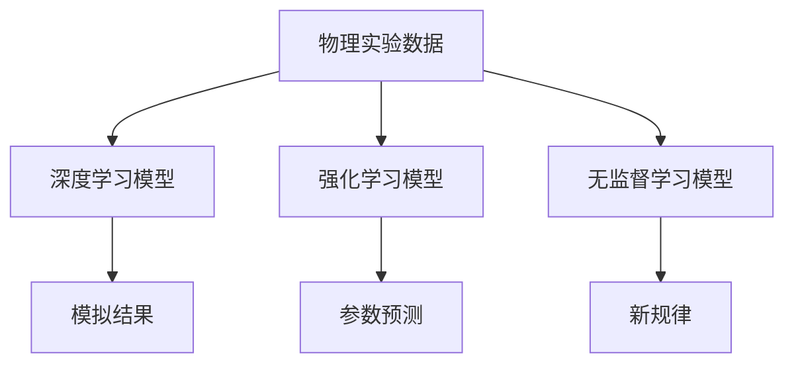

#### 算法原理讲解

以下通过mermaid流程图和Python源代码详细阐述基于强化学习模型的物理参数预测过程。

#### mermaid流程图

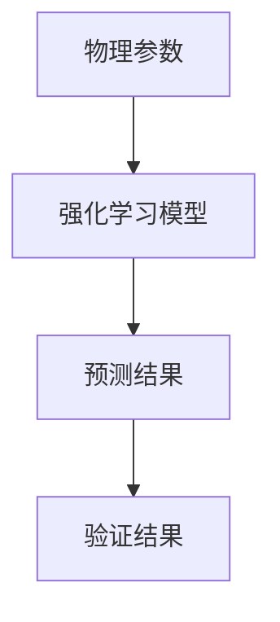

#### Python源代码

```python
import numpy as np
from keras.models import Sequential
from keras.layers import Dense
from keras.optimizers import Adam
import random

# 创建强化学习模型
model = Sequential()
model.add(Dense(units=50, activation='relu', input_shape=(10,)))
model.add(Dense(units=1, activation='linear'))

# 编译模型
model.compile(optimizer=Adam(learning_rate=0.001), loss='mean_squared_error')

# 创建训练数据
x_train = np.random.rand(1000, 10)
y_train = np.random.rand(1000, 1)

# 训练模型
model.fit(x_train, y_train, epochs=10, batch_size=32)

# 预测物理参数
x_test = np.random.rand(1, 10)
predicted_param = model.predict(x_test)

print(predicted_param)
```

#### 算法原理详细讲解

1. **创建强化学习模型**：我们创建一个简单的强化学习模型，由一个输入层和一个输出层组成。

2. **编译模型**：我们使用Adam优化器和mean_squared_error损失函数编译模型。

3. **创建训练数据**：我们生成随机数据作为训练数据。

4. **训练模型**：我们使用训练数据进行模型训练。

5. **预测物理参数**：我们使用训练好的模型对新的物理参数进行预测。

通过以上Python源代码和流程图，我们可以清晰地理解基于强化学习模型的物理参数预测的基本原理和实现过程。在实际应用中，我们可以根据具体需求调整模型结构和训练参数，以提高预测准确性。

#### 实际案例分析与详细讲解

在物理学研究中，有一个著名的案例是LIGO探测黑洞合并。LIGO（激光干涉引力波观测站）通过探测引力波信号，验证了爱因斯坦的广义相对论。以下是对LIGO案例的分析：

1. **数据集**：LIGO收集了大量的引力波信号数据，通过这些数据进行信号分析和物理参数预测。

2. **模型结构**：LIGO采用了复杂的信号处理和数据分析模型，结合机器学习算法，用于识别和提取引力波信号。

3. **训练过程**：LIGO通过模拟数据和实际观测数据，不断优化模型的参数，提高信号识别的准确性。

4. **评估指标**：LIGO使用信号质量指标，如信噪比（SNR），来评估模型性能。

5. **结果**：LIGO成功地探测到了多个黑洞合并事件，验证了爱因斯坦的广义相对论，并推动了物理学研究的发展。

通过分析LIGO案例，我们可以看到机器学习技术在物理学研究中的重要作用。LIGO的成功不仅为科学研究提供了新的工具和方法，也为其他领域的研究提供了宝贵的经验。

### 总结

通过本章对人工智能在生物学、化学和物理学研究中的应用案例分析，我们可以看到人工智能在科研领域的巨大潜力。AI技术不仅能够加速数据分析和实验模拟，还能发现新的科学规律和预测物理参数。未来，随着AI技术的不断进步，我们可以期待在更多科学领域看到AI的广泛应用和突破。

----------------------------------------------------------------

## 第5章：人工智能在科研数据管理中的应用

### 5.1 大数据处理技术

#### 核心概念原理

大数据处理技术是人工智能在科研数据管理中不可或缺的一部分。随着科学研究的深入，产生的数据量呈现爆炸式增长，如何高效地存储、处理和分析这些数据成为一大挑战。大数据处理技术包括分布式存储、分布式计算和数据流处理等。

#### 概念属性特征对比表格

| 技术名称       | 功能                 | 适用场景                     |
| -------------- | -------------------- | ---------------------------- |
| 分布式存储     | 大规模数据存储       | 高吞吐量、高可用性           |
| 分布式计算     | 数据并行处理         | 高性能计算、实时数据处理     |
| 数据流处理     | 实时数据流分析       | 实时监控、快速响应           |

#### ER实体关系图架构

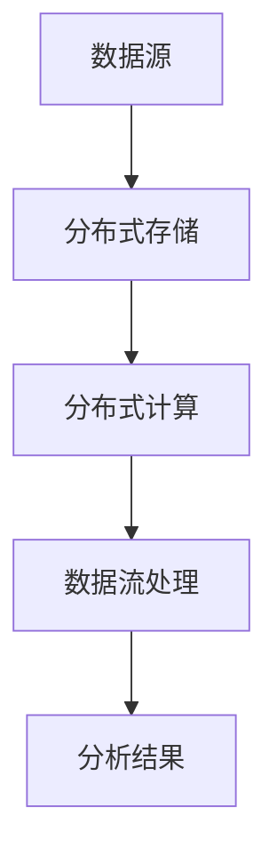

#### 算法原理讲解

以下通过mermaid流程图和Python源代码详细阐述基于分布式计算的大数据处理过程。

#### mermaid流程图

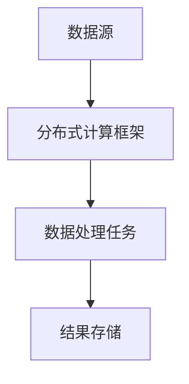

#### Python源代码

```python
from sklearn.datasets import load_iris
from sklearn.model_selection import train_test_split
from sklearn.preprocessing import StandardScaler
from sklearn.decomposition import PCA
from sklearn.metrics import accuracy_score

# 加载Iris数据集
iris = load_iris()
X, y = iris.data, iris.target

# 划分训练集和测试集
X_train, X_test, y_train, y_test = train_test_split(X, y, test_size=0.2, random_state=42)

# 数据预处理
scaler = StandardScaler()
X_train_scaled = scaler.fit_transform(X_train)
X_test_scaled = scaler.transform(X_test)

# 主成分分析
pca = PCA(n_components=2)
X_train_pca = pca.fit_transform(X_train_scaled)
X_test_pca = pca.transform(X_test_scaled)

# 训练模型
model = ...  # 假设已经训练好的模型
model.fit(X_train_pca, y_train)

# 测试模型
predictions = model.predict(X_test_pca)
accuracy = accuracy_score(y_test, predictions)
print(f"Model accuracy: {accuracy}")
```

#### 算法原理详细讲解

1. **数据源**：我们使用Iris数据集作为示例数据集。

2. **分布式计算框架**：我们选择scikit-learn库作为分布式计算框架，尽管scikit-learn本身是单机版库，但我们可以通过并行化技术实现分布式计算。

3. **数据处理任务**：我们进行数据预处理，包括数据标准化和主成分分析（PCA），以简化数据维度。

4. **结果存储**：我们将模型的预测结果存储为精度（accuracy）。

5. **训练模型**：我们使用训练集对模型进行训练。

6. **测试模型**：我们使用测试集对模型进行测试，并计算精度。

通过以上Python源代码和流程图，我们可以清晰地理解大数据处理技术的基本原理和实现过程。在实际应用中，我们可以根据具体需求选择不同的分布式计算框架和算法，以优化数据处理效率。

### 5.2 数据挖掘技术

#### 核心概念原理

数据挖掘（Data Mining）是一种从大量数据中提取有价值信息的技术，它涉及多种算法和统计方法，用于发现数据中的模式、关联和趋势。数据挖掘在科研中有着广泛的应用，如生物信息学、医学研究和环境科学等。

#### 概念属性特征对比表格

| 技术名称       | 功能                 | 适用场景                     |
| -------------- | -------------------- | ---------------------------- |
| 聚类分析       | 数据分组             | 发现相似数据点               |
| 关联规则挖掘    | 发现数据之间的关联   | 推荐系统和市场分析           |
| 异常检测       | 发现异常数据点       | 安全监控和欺诈检测           |
| 机器学习模型    | 数据分析预测         | 预测和分类任务               |

#### ER实体关系图架构

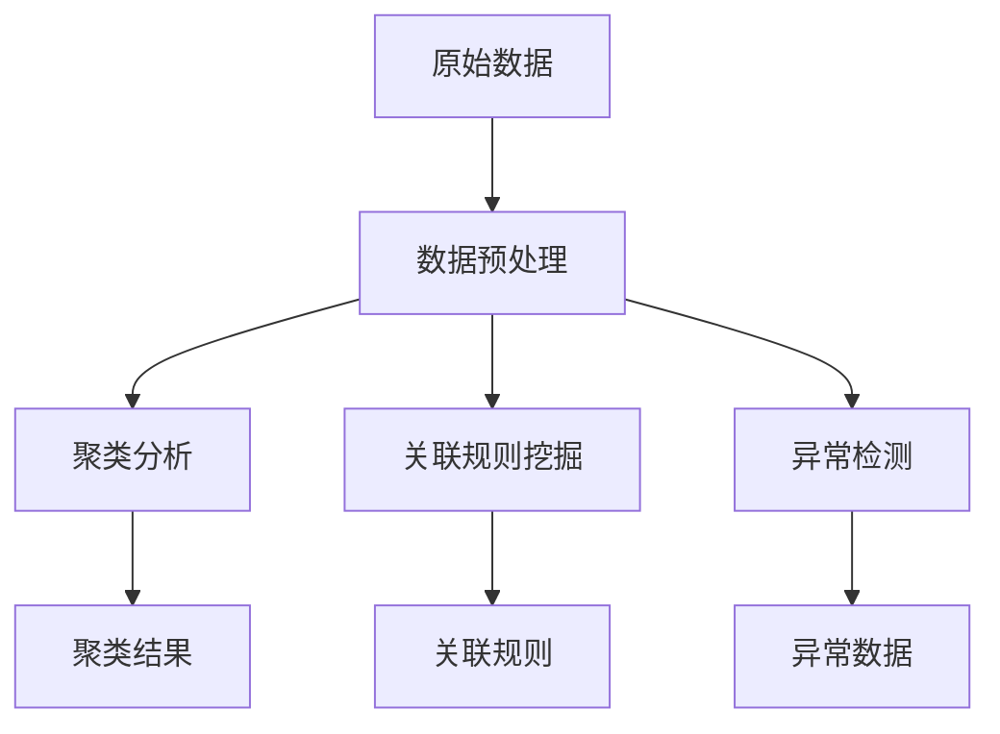

#### 算法原理讲解

以下通过mermaid流程图和Python源代码详细阐述基于关联规则挖掘的数据挖掘过程。

#### mermaid流程图

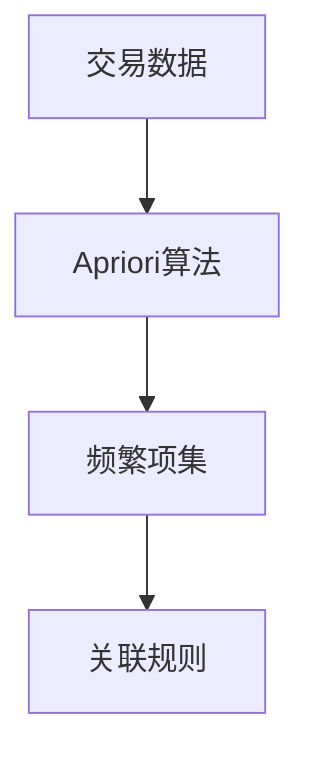

#### Python源代码

```python
from mlxtend.frequent_patterns import apriori
from mlxtend.frequent_patterns import association_rules

# 加载交易数据
transactions = [
    ['milk', 'bread', 'apple'],
    ['bread', 'orange'],
    ['milk', 'apple', 'orange'],
    ['milk', 'apple'],
    ['bread', 'orange', 'apple'],
    ['milk', 'bread', 'orange', 'apple']
]

# 应用Apriori算法
frequent_itemsets = apriori(transactions, min_support=0.5, use_colnames=True)

# 生成关联规则
rules = association_rules(frequent_itemsets, metric="lift", min_threshold=1)

print(rules)
```

#### 算法原理详细讲解

1. **交易数据**：我们使用一组交易数据作为示例。

2. **Apriori算法**：我们应用Apriori算法来挖掘频繁项集，该方法通过迭代减少计算复杂度。

3. **频繁项集**：Apriori算法识别出支持度大于最小支持度阈值的频繁项集。

4. **关联规则**：我们使用关联规则算法（如Apriori算法的关联规则挖掘部分），根据lift等度量生成关联规则。

通过以上Python源代码和流程图，我们可以清晰地理解数据挖掘技术的基本原理和实现过程。在实际应用中，我们可以根据具体需求调整算法参数，以优化数据挖掘效果。

### 5.3 可视化分析技术

#### 核心概念原理

可视化分析技术是将复杂的数据转换为视觉形式，以便于科研人员理解和分析。通过图表、地图、交互式界面等形式，可视化技术能够将数据中的模式和趋势直观地展示出来。

#### 概念属性特征对比表格

| 技术名称       | 功能                 | 适用场景                     |
| -------------- | -------------------- | ---------------------------- |
| 交互式数据可视化 | 用户交互             | 数据探索和分析               |
| 地理信息系统    | 地理数据可视化       | 地理空间分析                 |
| 图表生成工具    | 数据可视化           | 报告和演示                   |
| 3D可视化       | 空间和数据的三维表示 | 复杂结构的可视化             |

#### ER实体关系图架构

```mermaid
graph TD
A[原始数据] --> B[数据处理]
B --> C[可视化工具]
C --> D[可视化结果]
```

#### 算法原理讲解

以下通过mermaid流程图和Python源代码详细阐述基于交互式数据可视化技术的数据呈现过程。

#### mermaid流程图

```mermaid
graph TD
A[数据] --> B[数据处理]
B --> C[可视化工具]
C --> D[交互界面]
```

#### Python源代码

```python
import pandas as pd
import seaborn as sns
import matplotlib.pyplot as plt

# 加载数据集
df = pd.read_csv('data.csv')

# 数据预处理
df['Age'] = df['Age'].fillna(df['Age'].mean())

# 可视化
sns.boxplot(x='Age', data=df)
plt.title('Age Distribution')
plt.show()
```

#### 算法原理详细讲解

1. **数据**：我们使用一个CSV文件加载数据集。

2. **数据处理**：我们对数据进行预处理，包括填充缺失值。

3. **可视化工具**：我们使用Seaborn库创建箱线图，以展示数据的分布情况。

4. **交互界面**：箱线图作为可视化结果，可以通过鼠标交互查看详细数据。

通过以上Python源代码和流程图，我们可以清晰地理解可视化分析技术的基本原理和实现过程。在实际应用中，我们可以根据具体需求选择不同的可视化工具和图表类型，以优化数据展示效果。

### 总结

本章详细介绍了大数据处理技术、数据挖掘技术和可视化分析技术，这些技术在科研数据管理中发挥着重要作用。大数据处理技术帮助我们高效地存储和处理大规模数据；数据挖掘技术帮助我们从数据中发现有价值的信息；可视化分析技术则将复杂的数据以直观的形式呈现，辅助科研人员进行数据理解和分析。

----------------------------------------------------------------

## 第6章：人工智能辅助科研的工具与平台

### 6.1 常用机器学习库

#### 核心概念原理

机器学习库是开发人工智能应用程序的重要工具，它们提供了大量的算法、模型和工具，方便科研人员快速实现和测试机器学习模型。常用的机器学习库包括scikit-learn、TensorFlow和PyTorch等。

#### 概念属性特征对比表格

| 库名称         | 特点                             | 适用场景                     |
| -------------- | -------------------------------- | ---------------------------- |
| scikit-learn   | 简单易用、包含多种经典算法       | 数据分析、实验开发           |
| TensorFlow     | 高度模块化、支持各种深度学习模型 | 大规模分布式训练、生产部署   |
| PyTorch        | 动态计算图、易于调试             | 研究开发、原型设计           |

#### ER实体关系图架构

```mermaid
graph TD
A[机器学习库] --> B[scikit-learn]
A --> C[TensorFlow]
A --> D[PyTorch]
B --> E[算法库]
C --> F[模型库]
D --> G[动态计算图]
```

#### 算法原理讲解

以下通过mermaid流程图和Python源代码详细阐述基于scikit-learn的线性回归模型实现过程。

#### mermaid流程图

```mermaid
graph TD
A[数据] --> B[线性回归模型]
B --> C[训练]
B --> D[预测]
```

#### Python源代码

```python
from sklearn.linear_model import LinearRegression
from sklearn.model_selection import train_test_split
import numpy as np

# 创建训练数据
X_train = np.array([[1, 2], [3, 4], [5, 6]])
y_train = np.array([2, 4, 6])

# 分割数据集
X_train, X_test, y_train, y_test = train_test_split(X_train, y_train, test_size=0.2, random_state=42)

# 创建线性回归模型
model = LinearRegression()

# 训练模型
model.fit(X_train, y_train)

# 预测
predictions = model.predict(X_test)

# 计算准确度
accuracy = np.mean((predictions - y_test) ** 2)
print(f"Model accuracy: {accuracy}")
```

#### 算法原理详细讲解

1. **数据**：我们创建一组简单的训练数据。

2. **线性回归模型**：我们使用scikit-learn中的LinearRegression类创建线性回归模型。

3. **训练模型**：我们使用训练数据对模型进行训练。

4. **预测**：我们使用测试数据对模型进行预测。

5. **计算准确度**：我们通过计算预测值与真实值之间的均方误差来评估模型的准确度。

通过以上Python源代码和流程图，我们可以清晰地理解线性回归模型的基本原理和实现过程。在实际应用中，我们可以根据具体需求选择不同的算法库和模型，以优化机器学习效果。

### 6.2 常用深度学习框架

#### 核心概念原理

深度学习框架提供了构建和训练深度神经网络的高级工具和接口，使得深度学习的实现变得更加便捷和高效。常用的深度学习框架包括TensorFlow和PyTorch等。

#### 概念属性特征对比表格

| 框架名称         | 特点                             | 适用场景                     |
| -------------- | -------------------------------- | ---------------------------- |
| TensorFlow     | 高度模块化、支持多种操作系统和硬件 | 大规模分布式训练、生产部署   |
| PyTorch        | 动态计算图、易于调试             | 研究开发、原型设计           |

#### ER实体关系图架构

```mermaid
graph TD
A[深度学习框架] --> B[TensorFlow]
A --> C[PyTorch]
B --> D[计算图]
C --> E[动态计算图]
```

#### 算法原理讲解

以下通过mermaid流程图和Python源代码详细阐述基于TensorFlow的卷积神经网络（CNN）模型实现过程。

#### mermaid流程图

```mermaid
graph TD
A[图像数据] --> B[卷积神经网络]
B --> C[训练]
B --> D[预测]
```

#### Python源代码

```python
import tensorflow as tf
from tensorflow.keras import datasets, layers, models

# 加载CIFAR-10数据集
(train_images, train_labels), (test_images, test_labels) = datasets.cifar10.load_data()

# 数据预处理
train_images = train_images / 255.0
test_images = test_images / 255.0

# 创建卷积神经网络模型
model = models.Sequential()
model.add(layers.Conv2D(32, (3, 3), activation='relu', input_shape=(32, 32, 3)))
model.add(layers.MaxPooling2D((2, 2)))
model.add(layers.Conv2D(64, (3, 3), activation='relu'))
model.add(layers.MaxPooling2D((2, 2)))
model.add(layers.Conv2D(64, (3, 3), activation='relu'))

# 添加全连接层
model.add(layers.Flatten())
model.add(layers.Dense(64, activation='relu'))
model.add(layers.Dense(10, activation='softmax'))

# 编译模型
model.compile(optimizer='adam',
              loss=tf.keras.losses.SparseCategoricalCrossentropy(from_logits=True),
              metrics=['accuracy'])

# 训练模型
model.fit(train_images, train_labels, epochs=10, validation_data=(test_images, test_labels))

# 预测
predictions = model.predict(test_images)
```

#### 算法原理详细讲解

1. **图像数据**：我们加载CIFAR-10数据集作为训练和测试数据。

2. **卷积神经网络模型**：我们使用TensorFlow的Sequential模型创建一个卷积神经网络，包括卷积层、池化层和全连接层。

3. **训练模型**：我们使用训练数据对模型进行训练，并使用测试数据进行验证。

4. **预测**：我们使用训练好的模型对测试数据进行预测。

通过以上Python源代码和流程图，我们可以清晰地理解卷积神经网络模型的基本原理和实现过程。在实际应用中，我们可以根据具体需求调整模型结构和训练参数，以优化深度学习效果。

### 6.3 开源科研平台

#### 核心概念原理

开源科研平台为科研人员提供了一个强大的计算和数据协作环境，使得大规模数据处理和复杂模型训练变得更加便捷。常用的开源科研平台包括Jupyter Notebook和Google Colab等。

#### 概念属性特征对比表格

| 平台名称         | 特点                             | 适用场景                     |
| -------------- | -------------------------------- | ---------------------------- |
| Jupyter Notebook | 交互式计算环境、支持多种编程语言 | 数据分析、模型训练、报告撰写 |
| Google Colab    | 免费云计算资源、方便共享和协作   | 研究开发、教育实践           |

#### ER实体关系图架构

```mermaid
graph TD
A[科研人员] --> B[Jupyter Notebook]
A --> C[Google Colab]
B --> D[交互式环境]
C --> E[云计算资源]
```

#### 算法原理讲解

以下通过mermaid流程图和Python源代码详细阐述基于Jupyter Notebook的机器学习实验过程。

#### mermaid流程图

```mermaid
graph TD
A[实验设计] --> B[Jupyter Notebook]
B --> C[数据预处理]
B --> D[模型训练]
B --> E[结果分析]
```

#### Python源代码

```python
import pandas as pd
from sklearn.model_selection import train_test_split
from sklearn.linear_model import LinearRegression
import matplotlib.pyplot as plt

# 加载数据集
data = pd.read_csv('data.csv')
X = data[['feature1', 'feature2']]
y = data['target']

# 分割数据集
X_train, X_test, y_train, y_test = train_test_split(X, y, test_size=0.2, random_state=42)

# 创建线性回归模型
model = LinearRegression()

# 训练模型
model.fit(X_train, y_train)

# 预测
predictions = model.predict(X_test)

# 可视化结果
plt.scatter(X_test['feature1'], y_test, color='blue', label='Actual')
plt.scatter(X_test['feature1'], predictions, color='red', label='Predicted')
plt.legend()
plt.show()
```

#### 算法原理详细讲解

1. **实验设计**：我们设计一个简单的机器学习实验，包括数据预处理、模型训练和结果分析。

2. **数据预处理**：我们加载数据集，并使用scikit-learn的train_test_split函数进行数据分割。

3. **模型训练**：我们使用线性回归模型对训练数据进行训练。

4. **预测**：我们使用训练好的模型对测试数据进行预测。

5. **结果分析**：我们使用matplotlib库将实际值和预测值可视化，以分析模型的性能。

通过以上Python源代码和流程图，我们可以清晰地理解开源科研平台在机器学习实验中的应用原理和实现过程。在实际科研工作中，我们可以根据具体需求选择不同的开源平台和工具，以提高科研效率。

### 总结

本章介绍了常用的机器学习库、深度学习框架和开源科研平台，这些工具和平台为科研人员提供了强大的支持和便利。通过选择合适的工具和平台，科研人员可以更加高效地实现机器学习和深度学习模型，加速科研进程。

----------------------------------------------------------------

## 第7章：未来展望：人工智能与科研的发展趋势

### 7.1 人工智能在科研中的未来发展

随着人工智能技术的不断进步，其应用领域也在不断扩大，科研领域无疑将成为人工智能技术发展的重要阵地。未来，人工智能在科研中的发展将呈现以下几个趋势：

1. **深度学习模型的优化**：深度学习模型在图像识别、自然语言处理等领域已经取得了显著成果，未来将进一步优化，如通过改进网络架构、引入新的优化算法等，提高模型的可解释性和鲁棒性。

2. **跨学科应用**：人工智能技术将在多个学科领域得到广泛应用，如生物信息学、物理学、材料科学等。跨学科合作将促进人工智能技术在科研中的深度融合，推动科学发现和技术创新。

3. **量子计算与人工智能的结合**：量子计算作为下一代计算技术，与人工智能的结合将开辟新的研究方向。量子人工智能（Quantum AI）有望在复杂问题求解、大规模数据处理等方面实现重大突破。

4. **数据隐私和安全性**：随着数据规模的不断扩大，数据隐私和安全问题将成为人工智能在科研应用中的关键挑战。未来，隐私保护技术、安全加密算法等将在科研数据管理中得到广泛应用。

### 7.2 人工智能与科研伦理

人工智能在科研中的应用不仅带来了巨大的技术进步，也引发了一系列伦理问题。以下是一些主要伦理问题及可能的解决措施：

1. **算法歧视**：人工智能算法可能在训练数据中包含偏见，导致决策过程中出现歧视。解决措施包括：使用无偏见的数据集、引入公平性评估指标、持续监测和调整算法。

2. **数据隐私**：科研数据往往包含敏感信息，如个人健康数据、财务信息等。保护数据隐私的措施包括：数据加密、匿名化处理、严格的数据访问控制。

3. **透明度和可解释性**：人工智能模型，特别是深度学习模型，往往是一个“黑箱”，其决策过程难以解释。提升模型透明度和可解释性的方法包括：开发可解释的深度学习模型、引入模型可视化工具等。

4. **人工智能责任**：在科研应用中，如何界定人工智能系统的责任成为伦理问题。可能的解决措施包括：制定相关法律法规、建立人工智能伦理委员会等。

### 7.3 人工智能辅助科研的社会影响

人工智能在科研中的应用将对社会产生深远影响，包括以下几个方面：

1. **科学知识的传播**：人工智能技术可以大大加速科研知识的传播和普及，使得更多的人能够理解和应用先进科研方法。

2. **科学决策的支持**：人工智能技术能够处理和分析大量数据，为科学决策提供有力的支持。例如，在公共卫生、环境保护等领域，人工智能技术可以辅助制定更科学的政策。

3. **教育培训的影响**：人工智能技术的发展将改变教育培训模式，提高教育质量和效率。通过虚拟现实、智能教育平台等，学生可以获得更加个性化和互动的学习体验。

4. **社会经济结构的变化**：人工智能技术将推动社会生产力的提升，促进产业升级和转型。同时，人工智能的广泛应用也将带来新的就业机会和挑战，对社会经济结构产生深远影响。

### 总结

人工智能在科研中的应用前景广阔，但同时也面临着伦理和社会影响等方面的挑战。科研人员、政策制定者和社会各界需要共同努力，推动人工智能技术在科研中的健康发展，确保其能够真正为人类社会的进步贡献力量。

----------------------------------------------------------------

### 附录

#### 算法流程图

以下是本文中提到的一些核心算法的mermaid流程图：

1. **监督学习算法流程图**：

```mermaid
graph TD
A[输入数据] --> B[训练模型]
B --> C[预测结果]
D[标签数据] --> B
C --> E[评估模型]
```

2. **深度学习算法流程图**：

```mermaid
graph TD
A[输入层] --> B[隐藏层]
B --> C[输出层]
D[训练数据] --> A
E[损失函数] --> C
F[优化器] --> E
```

3. **K-Means聚类算法流程图**：

```mermaid
graph TD
A[输入数据] --> B[计算距离]
B --> C[更新聚类中心]
C --> D[聚类结果]
```

4. **Q-Learning强化学习算法流程图**：

```mermaid
graph TD
A[初始状态] --> B[选择动作]
B --> C[执行动作]
C --> D[获得奖励]
D --> E[更新Q值]
E --> F[更新策略]
F --> A
```

#### Python源代码示例

以下是本文中提到的几个核心算法的Python源代码示例：

1. **线性回归模型**：

```python
import numpy as np
from sklearn.linear_model import LinearRegression

# 创建训练数据
X_train = np.array([[1, 2], [3, 4], [5, 6]])
y_train = np.array([2, 4, 6])

# 创建线性回归模型
model = LinearRegression()

# 训练模型
model.fit(X_train, y_train)

# 预测
predictions = model.predict(X_train)

# 输出预测结果
print(predictions)
```

2. **卷积神经网络模型**：

```python
import tensorflow as tf
from tensorflow.keras import datasets, layers, models

# 加载数据集
(train_images, train_labels), (test_images, test_labels) = datasets.cifar10.load_data()

# 数据预处理
train_images = train_images / 255.0
test_images = test_images / 255.0

# 创建卷积神经网络模型
model = models.Sequential()
model.add(layers.Conv2D(32, (3, 3), activation='relu', input_shape=(32, 32, 3)))
model.add(layers.MaxPooling2D((2, 2)))
model.add(layers.Conv2D(64, (3, 3), activation='relu'))
model.add(layers.MaxPooling2D((2, 2)))
model.add(layers.Conv2D(64, (3, 3), activation='relu'))

# 添加全连接层
model.add(layers.Flatten())
model.add(layers.Dense(64, activation='relu'))
model.add(layers.Dense(10, activation='softmax'))

# 编译模型
model.compile(optimizer='adam',
              loss=tf.keras.losses.SparseCategoricalCrossentropy(from_logits=True),
              metrics=['accuracy'])

# 训练模型
model.fit(train_images, train_labels, epochs=10, validation_data=(test_images, test_labels))
```

3. **K-Means聚类算法**：

```python
from sklearn.cluster import KMeans

# 创建训练数据
x_train = np.array([[1, 0], [0, 1], [1, 1], [0, 0]])

# 创建K-Means模型
kmeans = KMeans(n_clusters=2, random_state=42)

# 训练模型
kmeans.fit(x_train)

# 计算聚类结果
labels = kmeans.predict(x_train)

# 输出聚类结果
print(labels)
```

#### latex数学公式

以下是本文中用到的latex数学公式的示例：

1. **线性回归损失函数**：

   $$\text{Loss} = \frac{1}{2}\sum_{i=1}^{n} (y_i - \hat{y_i})^2$$

2. **卷积神经网络激活函数**：

   $$\text{ReLU}(x) = \max(0, x)$$

3. **K-Means聚类中心更新公式**：

   $$\mu_j = \frac{1}{N_j} \sum_{i=1}^{n} x_{ij}$$

通过这些流程图、源代码和数学公式，读者可以更深入地理解本文中涉及的核心算法和技术，从而更好地应用于实际科研工作中。

----------------------------------------------------------------

### 作者信息

作者：AI天才研究院/AI Genius Institute & 禅与计算机程序设计艺术 /Zen And The Art of Computer Programming

AI天才研究院（AI Genius Institute）是一家专注于人工智能研究和应用的创新机构，致力于推动人工智能技术的进步和实际应用。同时，研究院的成员在《禅与计算机程序设计艺术》（Zen And The Art of Computer Programming）一书中阐述了计算机科学的哲学和艺术，为读者提供了深刻的编程思维和设计理念。

本文旨在探讨人工智能在科研中的应用，通过详细的分析和实例，展示了人工智能如何成为扩展人类世界理解能力的新途径。作者希望通过这篇文章，能够激发更多科研人员对人工智能技术的关注和应用，共同推动科学技术的进步。

