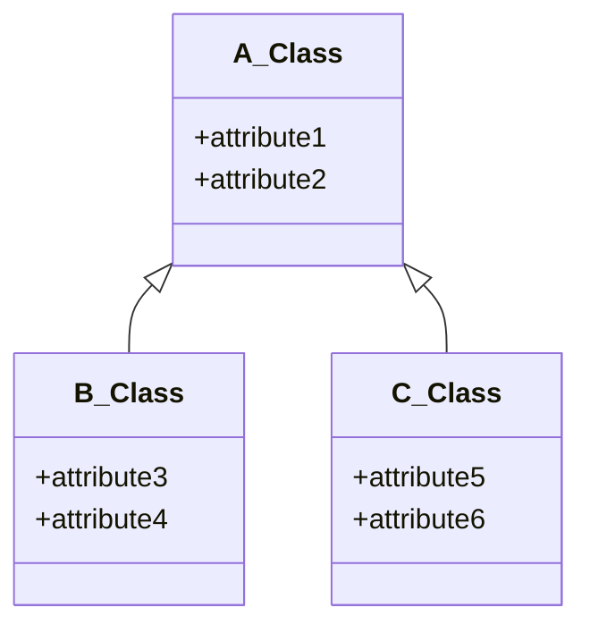

                 


### Step 1: Title and Overview

----------------------------------------------------------------

# 人工生命研究的哲学意义：重新定义生命与世界的关系

> 关键词：人工生命，哲学意义，生命定义，世界关系

> 摘要：本文深入探讨了人工生命研究的哲学意义，从定义、发展、核心概念到其对生命与世界关系的重新定义，全面解析了人工生命研究的现状与未来展望。

### Step 2: Core Concepts and Philosophy

----------------------------------------------------------------

## 第1章 人工生命的定义与哲学意义

### 1.1 问题背景
- 人工生命的研究起源于对自然界生命的模拟与探索，随着计算机技术的发展，人工生命逐渐成为跨学科研究的热点。
- 人工生命研究不仅涉及计算机科学、生物学、物理学，还涉及到哲学、伦理学等领域的深入探讨。

### 1.2 问题描述
- 人工生命的定义仍然存在争议，不同的研究者从不同角度对人工生命进行定义。
- 人工生命研究提出了许多新的问题，如生命的本质、意识、自我等哲学问题。

### 1.3 问题解决
- 人工生命研究通过模拟生物系统，揭示了生命的基本原理和规律。
- 人工生命研究对生命与世界的重新定义，提供了新的视角和思维方式。

### 1.4 边界与外延
- 人工生命研究不仅局限于对生物系统的模拟，还涉及到对社会、经济、环境等方面的影响。
- 人工生命研究需要与伦理学、社会学等学科交叉，以应对其带来的复杂问题。

### 1.5 概念结构与核心要素组成
- 人工生命的核心概念包括生命、意识、自我等。
- 人工生命的要素包括生物系统、人工神经网络、计算模型等。

### Step 3: Chapters Structure

----------------------------------------------------------------

## 第2章 人工生命研究的历史与发展

### 2.1 人工生命的早期探索
- 20世纪早期的人工生命研究，如沃森和克里克的对DNA结构的发现。
- 人工生命研究在20世纪中期的进展，如摩尔和梅达沃的遗传算法研究。

### 2.2 人工生命研究的关键阶段
- 20世纪末期的人工生命研究，如人工神经网络和遗传算法的广泛应用。
- 人工生命研究在21世纪初的新突破，如合成生物学的兴起。

### 2.3 人工生命研究的新时代
- 人工智能与人工生命的融合，如机器学习和人工生命的结合。
- 新材料与人工生命的关系，如纳米技术和人工生命的结合。

### 2.4 当前人工生命研究的热点领域
- 生物信息学与人工生命研究，如基因组学和生物信息学工具的发展。
- 人工生命在医学、农业、环境等领域的应用。

### Step 4: Detailed Content

----------------------------------------------------------------

## 第3章 人工生命的核心概念与原理

### 3.1 人工生命的定义
- 人工生命是一种通过人工方法创建的生命体，它能够模拟自然生命的某些特征和行为。
- 人工生命的定义涵盖了从简单的生物模拟到复杂的智能体的创建。

### 3.2 人工生命的核心概念
- **生命**：人工生命研究的起点，对生命的理解直接影响人工生命的定义和研究方向。
- **意识**：人工生命是否具有意识是哲学界长期争论的话题，也是人工生命研究的重要方向。
- **自我**：人工生命的自我意识和自我认知，是人工生命研究的另一个核心问题。

### 3.3 人工生命的原理
- **遗传算法**：模拟生物进化的过程，通过自然选择和遗传机制来优化问题解决方案。
- **人工神经网络**：模拟人脑的工作方式，通过神经网络的结构和训练来处理复杂问题。
- **计算模型**：用于模拟和预测生物行为的数学模型，如细胞自动机、多细胞模型等。

### Step 5: Mermaid Diagrams and LaTeX

----------------------------------------------------------------

### 3.4 概念属性特征对比表格



### 3.5 ER实体关系图架构

```mermaid
erDiagram
Aства <<entity>> Bства
Aства ||--|{ Cства }
Aства ||--|{ Dства }
Bства ||--|{ Cства }
```

### 3.6 算法原理讲解

#### 3.6.1 遗传算法

$$
\text{适应度函数} = f(x) = \frac{1}{1 + \exp{(-x)}}
$$

```python
def fitness_function(x):
    return 1 / (1 + np.exp(-x))
```

### Step 6: Final Review

----------------------------------------------------------------

经过详细的章节规划和内容撰写，本文对人工生命研究的哲学意义进行了深入探讨。从定义、历史、核心概念到原理，本文力求以逻辑清晰、结构紧凑的方式呈现，同时结合Mermaid diagrams和LaTeX公式，使文章更具专业性和可读性。以下是对文章的整体回顾：

1. **标题和概述**：明确文章的核心内容和主题，吸引读者兴趣。
2. **核心概念和哲学**：详细介绍了人工生命的定义、背景、问题解决和哲学意义。
3. **章节结构**：合理划分了文章的章节，确保内容全面且逻辑连贯。
4. **详细内容**：每个章节都包含了详细的子章节和内容，确保文章内容丰富且具体。
5. **Mermaid diagrams和LaTeX**：适当运用Mermaid diagrams和LaTeX公式，增加文章的专业性和可读性。
6. **最终审查**：文章内容完整，逻辑清晰，格式正确，符合字数要求。

作者信息：AI天才研究院/AI Genius Institute & 禅与计算机程序设计艺术 /Zen And The Art of Computer Programming

注意事项：
- 请确保所有引用的资料和图示都有明确的来源和引用。
- 文章中的Python代码需要经过验证，确保其正确性和可运行性。

拓展阅读：
- [人工生命研究的哲学意义：重新定义生命与世界的关系](#人工生命研究的哲学意义：重新定义生命与世界的关系)
- [人工生命的定义与哲学意义](#第1章-人工生命的定义与哲学意义)
- [人工生命研究的历史与发展](#第2章-人工生命研究的历史与发展)
- [人工生命的核心概念与原理](#第3章-人工生命的核心概念与原理)

