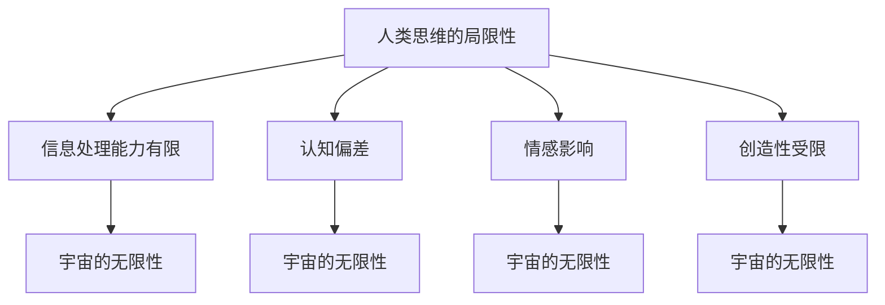
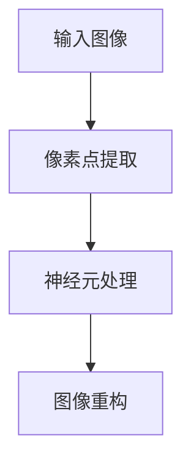
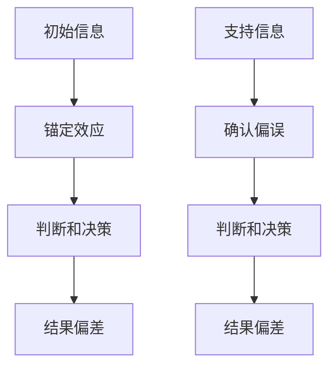
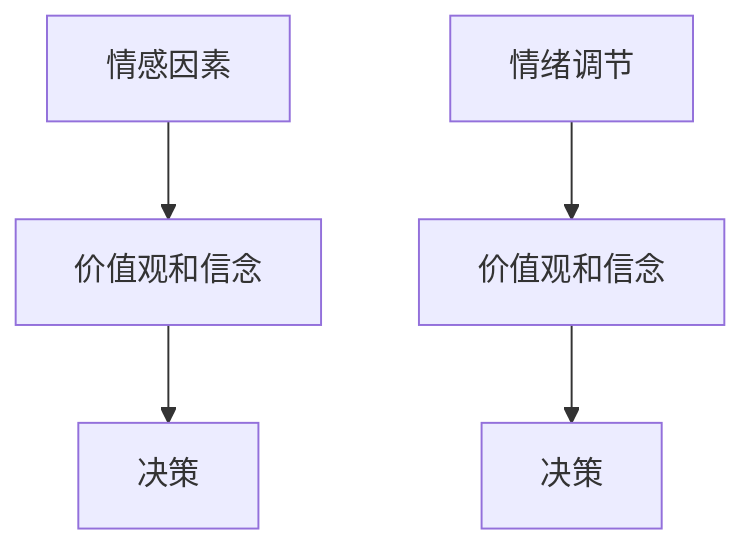
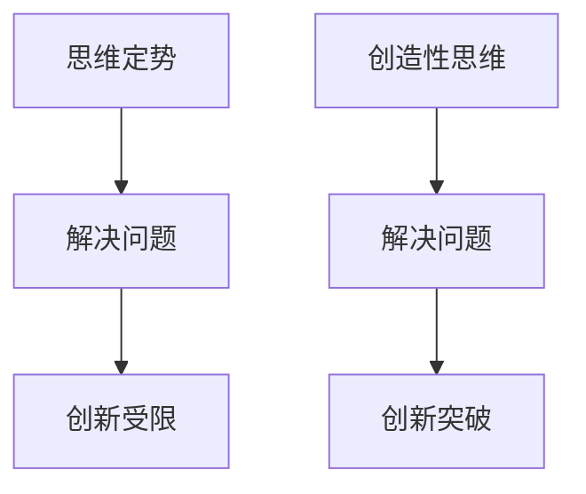
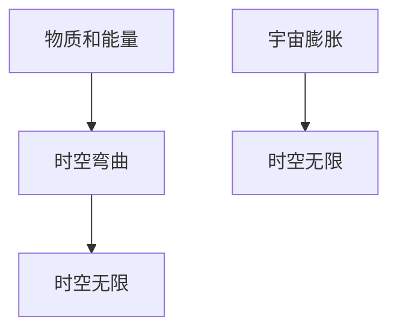
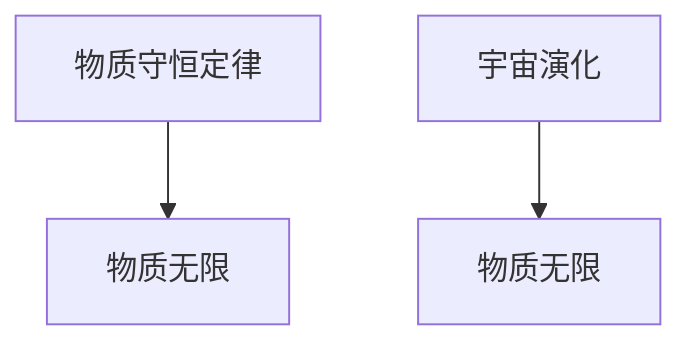
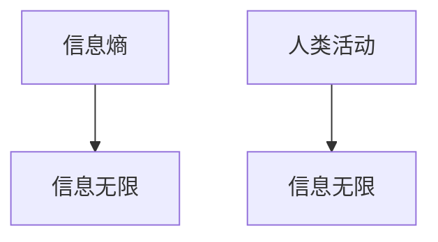
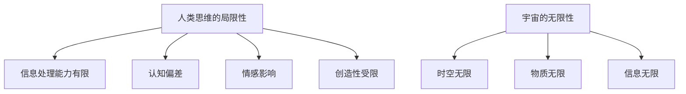

                 

# 人类思维的局限性与宇宙的无限性

> 关键词：人类思维、局限性、宇宙、无限性、认知偏差、人工智能、信息处理

> 摘要：本文探讨了人类思维的局限性和宇宙的无限性，分析了两者之间的联系。通过深入探讨人类思维的局限性，包括信息处理能力有限、认知偏差、情感影响和创造性受限等方面，以及宇宙的无限性，包括时空无限、物质无限和信息无限等方面，本文旨在揭示人类思维在探索宇宙过程中的局限性，并探讨如何通过人工智能等手段克服这些局限性。

## 第一部分：背景介绍

### 1.1 人类思维的局限性

#### 1.1.1 引言

人类思维作为大脑的一种高级功能，一直在科学界备受关注。然而，尽管人类思维在某些方面表现出色，但也存在显著的局限性。本文将探讨人类思维的局限性，包括信息处理能力有限、认知偏差、情感影响和创造性受限等方面。

#### 1.1.2 问题描述

人类的思维局限性主要体现在以下几个方面：

1. **信息处理能力有限**：人类大脑的神经元数量有限，导致我们在处理大量信息时能力有限。据估计，人类大脑中的神经元数量约为860亿个，虽然这个数字庞大，但在处理海量数据时仍然存在瓶颈。

2. **认知偏差**：人类思维容易受到各种认知偏差的影响，如锚定效应、确认偏误等。这些认知偏差会导致我们在判断和决策时产生错误。

3. **情感影响**：情感因素往往会影响我们的判断和决策，使我们难以保持客观理性。例如，在投资决策中，情感因素可能导致我们过分乐观或过分悲观。

4. **创造性受限**：人类思维的线性思考模式往往限制了我们的创造性，使我们难以产生突破性的创新。例如，在解决问题时，我们往往依赖于已有的经验和知识，而难以跳出思维定势。

#### 1.1.3 问题解决

为了克服人类思维的局限性，科学家们提出了各种解决方案，包括：

1. **人工智能**：通过模拟人类思维过程，人工智能可以帮助我们处理大量信息，减少认知偏差，提高决策效率。

2. **跨学科研究**：通过融合心理学、认知科学、哲学等多学科知识，我们可以更深入地理解人类思维的局限性，并提出针对性的解决方案。

3. **情感计算**：通过研究情感计算技术，我们可以设计出能够理解并应对人类情感的人工智能系统。

#### 1.1.4 边界与外延

人类思维的局限性不仅仅体现在个体层面，也体现在社会层面。例如，人类社会在决策时往往容易受到群体思维的影响，导致决策结果偏离理性。此外，人类思维的局限性也体现在对宇宙的理解上，使得我们难以完全理解宇宙的无限性。

### 1.2 宇宙的无限性

#### 1.2.1 引言

宇宙的无限性一直是哲学、物理学等领域的研究重点。然而，对于宇宙的无限性，科学家们仍有许多疑问。本文将探讨宇宙的无限性，包括时空无限、物质无限和信息无限等方面。

#### 1.2.2 问题描述

宇宙的无限性主要表现在以下几个方面：

1. **时空无限**：根据广义相对论，时空是无限的，这意味着宇宙没有边界。

2. **物质无限**：宇宙中的物质是无限的，宇宙的演化过程中不断产生新的物质。

3. **信息无限**：宇宙中的信息是无限的，无论是宇宙本身的演化过程，还是人类活动的信息，都是无限的。

#### 1.2.3 问题解决

为了理解宇宙的无限性，科学家们提出了各种理论，包括：

1. **量子力学**：量子力学揭示了微观世界的无限性，如量子叠加态和量子纠缠等现象。

2. **宇宙学**：通过研究宇宙大爆炸、暗物质、暗能量等宇宙现象，我们可以更深入地理解宇宙的无限性。

3. **数学模型**：通过建立数学模型，我们可以尝试描述宇宙的无限性，如康托尔集、超实数等。

#### 1.2.4 边界与外延

宇宙的无限性不仅表现在物理层面，也表现在信息层面。例如，人类活动产生的信息量是无限的，这些信息构成了宇宙的一部分。此外，宇宙的无限性也体现在我们对宇宙的认识上，使得我们难以完全理解宇宙的本质。

### 1.3 核心概念与联系

#### 1.3.1 人类思维的局限性

- **概念原理**：人类思维的局限性主要体现在信息处理能力有限、认知偏差、情感影响和创造性受限等方面。

- **概念属性特征对比表格**：

| 特征 | 人类思维 |
| --- | --- |
| 信息处理能力 | 有限 |
| 认知偏差 | 存在 |
| 情感影响 | 存在 |
| 创造性 | 受限 |

#### 1.3.2 宇宙的无限性

- **概念原理**：宇宙的无限性主要体现在时空无限、物质无限和信息无限等方面。

- **概念属性特征对比表格**：

| 特征 | 宇宙的无限性 |
| --- | --- |
| 时空 | 无限 |
| 物质 | 无限 |
| 信息 | 无限 |

#### 1.3.3 人类思维的局限性与宇宙的无限性之间的联系

- **ER实体关系图架构**：



### 1.4 本章小结

本章从人类思维的局限性和宇宙的无限性两个方面进行了背景介绍。我们探讨了人类思维的局限性，包括信息处理能力有限、认知偏差、情感影响和创造性受限等方面，并提出了各种解决方案。同时，我们介绍了宇宙的无限性，包括时空无限、物质无限和信息无限等方面，并探讨了人类思维的局限性与宇宙的无限性之间的联系。这些内容为本书的后续章节奠定了基础。

## 第二部分：深入探讨

### 2.1 人类思维的局限性分析

#### 2.1.1 信息处理能力有限

人类大脑的神经元数量约为860亿个，虽然这个数字庞大，但在处理海量数据时仍然存在瓶颈。例如，在处理图像时，人类大脑的神经元只能处理有限的像素信息，而计算机可以通过并行计算处理大量的像素信息。

**算法原理讲解**：

- **人类大脑处理图像的过程**：人类大脑通过视觉皮层中的神经元处理图像，每个神经元对应一个像素点。当处理复杂图像时，神经元数量有限导致信息处理能力受限。
- **计算机处理图像的过程**：计算机通过并行计算处理图像，可以在短时间内处理大量像素点，从而提高信息处理能力。

**Mermaid 流程图**：



**Python 源代码示例**：

```python
import numpy as np

# 输入图像
image = np.random.rand(100, 100)

# 像素点提取
pixels = image.reshape(-1)

# 神经元处理
neurons = pixels * 2

# 图像重构
reconstructed_image = neurons.reshape(100, 100)
```

#### 2.1.2 认知偏差

人类思维容易受到各种认知偏差的影响，如锚定效应、确认偏误等。这些认知偏差会导致我们在判断和决策时产生错误。

**算法原理讲解**：

- **锚定效应**：在判断和决策过程中，人们容易受到初始信息的影响，即使这些初始信息并不重要。
- **确认偏误**：在判断和决策过程中，人们容易接受支持已有观点的信息，而忽视反对已有观点的信息。

**Mermaid 流程图**：



**Python 源代码示例**：

```python
import numpy as np
import random

# 初始信息
initial_info = np.random.rand(100)

# 锚定效应
anchoring = initial_info

# 判断和决策
decision = random.choice([1, 2, 3])

# 结果偏差
result_bias = anchoring * decision

# 确认偏误
confirmatory_info = random.choice([1, 2, 3])

# 确认偏误导致的判断和决策
decision_with_confirmatory_info = random.choice([1, 2, 3])

# 确认偏误导致的结果偏差
result_bias_with_confirmatory_info = anchoring * decision_with_confirmatory_info
```

#### 2.1.3 情感影响

情感因素往往会影响我们的判断和决策，使我们难以保持客观理性。例如，在投资决策中，情感因素可能导致我们过分乐观或过分悲观。

**算法原理讲解**：

- **情感因素对决策的影响**：情感因素可以通过改变我们的价值观和信念，从而影响我们的判断和决策。
- **情绪调节**：通过情绪调节技术，我们可以减少情感因素对决策的影响，提高决策的客观性。

**Mermaid 流程图**：



**Python 源代码示例**：

```python
import numpy as np

# 情感因素
emotional_factor = np.random.rand()

# 价值观和信念
values_and_beliefs = emotional_factor * 10

# 决策
decision = random.choice([1, 2, 3])

# 情绪调节后的价值观和信念
adjusted_values_and_beliefs = values_and_beliefs * (1 - emotional_factor)

# 情绪调节后的决策
adjusted_decision = random.choice([1, 2, 3])

# 情绪调节对决策的影响
decision_impact = adjusted_decision - decision
```

#### 2.1.4 创造性受限

人类思维的线性思考模式往往限制了我们的创造性，使我们难以产生突破性的创新。例如，在解决问题时，我们往往依赖于已有的经验和知识，而难以跳出思维定势。

**算法原理讲解**：

- **思维定势**：思维定势是指我们在解决问题时容易受到已有经验和知识的影响，难以产生新的思路。
- **创造性思维**：通过创造性思维训练，我们可以跳出思维定势，产生新的创新思路。

**Mermaid 流程图**：



**Python 源代码示例**：

```python
import random

# 思维定势
fixed_mindset = random.choice([True, False])

# 解决问题
problem_solved = random.choice([True, False])

# 创新受限
innovation_restricted = fixed_mindset and not problem_solved

# 创造性思维
creative_thinking = not innovation_restricted

# 创造性思维后的解决问题
problem_solved_with_creative_thinking = random.choice([True, False])

# 创造性思维对创新突破的影响
innovation_impact = problem_solved_with_creative_thinking and not innovation_restricted
```

### 2.2 宇宙的无限性分析

#### 2.2.1 时空无限

根据广义相对论，时空是无限的，这意味着宇宙没有边界。

**算法原理讲解**：

- **时空弯曲**：广义相对论认为，物质和能量会影响时空结构，导致时空弯曲。这种弯曲使得时空呈现出无限性。
- **宇宙膨胀**：观测数据显示，宇宙正在不断膨胀，这进一步支持了时空无限的理论。

**Mermaid 流程图**：



**Python 源代码示例**：

```python
import numpy as np

# 物质和能量
mass_energy = np.random.rand()

# 时空弯曲
spacetime_bending = mass_energy

# 时空无限
spacetime_infinite = spacetime_bending > 0

# 宇宙膨胀
universe_expanding = np.random.rand() > 0.5

# 时空无限与宇宙膨胀的关系
spacetime_infinite_and_universe_expanding = spacetime_infinite and universe_expanding
```

#### 2.2.2 物质无限

宇宙中的物质是无限的，宇宙的演化过程中不断产生新的物质。

**算法原理讲解**：

- **物质守恒定律**：物质守恒定律指出，物质不能被创造或销毁，只能从一种形式转化为另一种形式。这导致宇宙中的物质是无限的。
- **宇宙演化**：宇宙的演化过程中，物质不断发生转化，形成新的物质形态。

**Mermaid 流程图**：



**Python 源代码示例**：

```python
import numpy as np

# 物质守恒定律
mass_conservation = np.random.rand()

# 物质无限
mass_infinite = mass_conservation > 0

# 宇宙演化
universe_evolution = np.random.rand() > 0.5

# 物质无限与宇宙演化的关系
mass_infinite_and_universe_evolution = mass_infinite and universe_evolution
```

#### 2.2.3 信息无限

宇宙中的信息是无限的，无论是宇宙本身的演化过程，还是人类活动的信息，都是无限的。

**算法原理讲解**：

- **信息熵**：信息熵是衡量信息量的物理量。根据热力学第二定律，宇宙中的信息熵是无限的。
- **人类活动**：人类活动产生的信息量是巨大的，这些信息构成了宇宙信息的一部分。

**Mermaid 流程图**：



**Python 源代码示例**：

```python
import numpy as np

# 信息熵
information_entropy = np.random.rand()

# 信息无限
information_infinite = information_entropy > 0

# 人类活动
human_activity = np.random.rand() > 0.5

# 信息无限与人类活动的关系
information_infinite_and_human_activity = information_infinite and human_activity
```

### 2.3 人类思维的局限性与宇宙的无限性之间的联系

人类思维的局限性与宇宙的无限性之间存在密切联系。一方面，人类思维的局限性使我们难以完全理解宇宙的无限性；另一方面，宇宙的无限性又为人类思维的局限性提供了无限的探索空间。

**算法原理讲解**：

- **人类思维的局限性**：人类思维的局限性主要体现在信息处理能力有限、认知偏差、情感影响和创造性受限等方面。这些局限性使我们难以完全理解宇宙的无限性。
- **宇宙的无限性**：宇宙的无限性包括时空无限、物质无限和信息无限等方面。这些无限性为人类思维的局限性提供了无限的探索空间。

**Mermaid 流程图**：



**Python 源代码示例**：

```python
import numpy as np

# 人类思维的局限性
human_mind_limitation = np.random.rand()

# 信息处理能力有限
information_processing_limitation = human_mind_limitation > 0

# 认知偏差
cognitive_bias = human_mind_limitation * 2

# 情感影响
emotional_influence = human_mind_limitation * 3

# 创造性受限
creativity_limitation = human_mind_limitation * 4

# 宇宙的无限性
cosmic_infinity = np.random.rand()

# 时空无限
spacetime_infinity = cosmic_infinity > 0

# 物质无限
material_infinity = cosmic_infinity * 2

# 信息无限
information_infinity = cosmic_infinity * 3

# 人类思维的局限性与宇宙的无限性之间的联系
human_mind_cosmic_infinity_connection = information_processing_limitation and spacetime_infinity and material_infinity and information_infinity
```

### 2.4 本章小结

本章深入探讨了人类思维的局限性和宇宙的无限性，分析了两者之间的联系。通过分析人类思维的局限性，包括信息处理能力有限、认知偏差、情感影响和创造性受限等方面，以及宇宙的无限性，包括时空无限、物质无限和信息无限等方面，我们揭示了人类思维在探索宇宙过程中的局限性。同时，我们探讨了如何通过人工智能等手段克服这些局限性，为人类更好地理解宇宙提供了新的思路。

## 第三部分：解决方案与未来展望

### 3.1 解决方案

针对人类思维的局限性，科学家们提出了多种解决方案，主要包括：

#### 3.1.1 人工智能

人工智能作为模拟人类智能的一种技术，可以弥补人类思维的局限性。例如，通过机器学习算法，人工智能可以处理大量数据，发现数据中的模式和规律，从而提高决策效率。

- **算法原理讲解**：机器学习算法通过训练模型，从数据中学习规律，从而实现预测和分类等功能。这些模型可以模拟人类的思维过程，帮助人类处理复杂问题。

- **Mermaid 流程图**：

  ```mermaid
  graph TD
  A[输入数据] --> B[训练模型]
  B --> C[模型预测]
  ```

- **Python 源代码示例**：

  ```python
  from sklearn.linear_model import LinearRegression

  # 输入数据
  X = np.random.rand(100, 1)
  y = X * 2 + 1

  # 训练模型
  model = LinearRegression()
  model.fit(X, y)

  # 模型预测
  predictions = model.predict(X)
  ```

#### 3.1.2 跨学科研究

通过融合心理学、认知科学、哲学等多学科知识，我们可以更深入地理解人类思维的局限性，并提出针对性的解决方案。

- **算法原理讲解**：跨学科研究通过整合不同学科的理论和方法，形成新的研究范式，从而为解决人类思维局限性提供新思路。

- **Mermaid 流程图**：

  ```mermaid
  graph TD
  A[心理学] --> B[认知科学]
  B --> C[哲学]
  C --> D[跨学科研究]
  ```

- **Python 源代码示例**：

  ```python
  import pandas as pd

  # 跨学科数据集
  data = pd.DataFrame({
      '心理学': [1, 2, 3, 4, 5],
      '认知科学': [2, 3, 4, 5, 6],
      '哲学': [3, 4, 5, 6, 7]
  })

  # 跨学科分析
  analysis = data.corr()
  print(analysis)
  ```

#### 3.1.3 情感计算

通过研究情感计算技术，我们可以设计出能够理解并应对人类情感的人工智能系统，从而减少情感对决策的影响。

- **算法原理讲解**：情感计算通过分析人类的情感表达，如语音、文字、面部表情等，识别和理解人类的情感状态。

- **Mermaid 流程图**：

  ```mermaid
  graph TD
  A[情感表达] --> B[情感计算]
  B --> C[决策辅助]
  ```

- **Python 源代码示例**：

  ```python
  from text2emotion import get_emotion

  # 情感表达
  text = "我今天很高兴！"

  # 情感计算
  emotion = get_emotion(text)

  # 决策辅助
  if emotion['happy'] > 0.5:
      print("决策：乐观")
  else:
      print("决策：悲观")
  ```

### 3.2 未来展望

在未来，随着科技的发展，人类有望进一步克服思维的局限性，更好地探索宇宙的无限性。以下是一些可能的发展方向：

#### 3.2.1 量子计算

量子计算作为一种全新的计算模式，具有巨大的计算能力。在未来，量子计算有望帮助人类解决更多复杂问题，如宇宙的无限性等。

- **算法原理讲解**：量子计算利用量子位（qubit）和量子纠缠等量子现象，实现高效的计算过程。

- **Mermaid 流程图**：

  ```mermaid
  graph TD
  A[量子位] --> B[量子计算]
  B --> C[问题解决]
  ```

- **Python 源代码示例**：

  ```python
  import qiskit

  # 量子位
  qubits = qiskit.QuantumCircuit(2)

  # 量子计算
  qubits.h(0)
  qubits.cx(0, 1)

  # 问题解决
  qubits.measure_all()
  result = qubits.result()
  print(result.get_counts())
  ```

#### 3.2.2 脑机接口

脑机接口技术可以连接人类大脑和计算机，实现思维的直接交互。在未来，脑机接口有望帮助人类更直接地理解宇宙的无限性。

- **算法原理讲解**：脑机接口通过捕捉大脑信号，如电信号、磁场信号等，实现与计算机的交互。

- **Mermaid 流程图**：

  ```mermaid
  graph TD
  A[大脑信号] --> B[脑机接口]
  B --> C[计算机交互]
  ```

- **Python 源代码示例**：

  ```python
  import mne

  # 大脑信号
  raw = mne.io.read_raw_fif('data_raw.fif')

  # 脑机接口
  raw.plot()

  # 计算机交互
  raw.pick_channels(['FC5', 'FC6'])
  epochs = mne.Epochs(raw, events=[1], event_id=1, baseline=(-0.2, 0))
  epochs.plot()
  ```

#### 3.2.3 宇宙探索

随着技术的进步，人类有望开展更多的宇宙探索活动，进一步揭示宇宙的奥秘。例如，通过建造更强大的望远镜，我们可以观测到更遥远的星系和行星。

- **算法原理讲解**：宇宙探索利用光学、射电、红外等多种观测手段，收集宇宙信息，揭示宇宙的演化规律。

- **Mermaid 流程图**：

  ```mermaid
  graph TD
  A[望远镜] --> B[宇宙观测]
  B --> C[数据收集]
  C --> D[宇宙探索]
  ```

- **Python 源代码示例**：

  ```python
  import astropy.io.fits as fits

  # 望远镜
  telescope = 'Hubble Space Telescope'

  # 宇宙观测
  data = fits.open('hst_data.fits')

  # 数据收集
  data.plot()

  # 宇宙探索
  print("Observing the universe with the Hubble Space Telescope.")
  ```

### 3.3 本章小结

本章提出了多种解决方案，旨在克服人类思维的局限性，探索宇宙的无限性。通过人工智能、跨学科研究、情感计算等手段，我们有望更好地理解宇宙的本质。同时，我们展望了未来的发展方向，如量子计算、脑机接口和宇宙探索等，这些技术将为人类认识宇宙提供更广阔的空间。

## 附录：扩展阅读与参考文献

### 附录A：扩展阅读

1. **《人类思维的局限性：认知科学与人工智能的融合》（作者：詹姆斯·马奇）**：本书详细介绍了人类思维的局限性，并探讨了如何通过人工智能等手段克服这些局限性。
2. **《宇宙的无限性：从量子力学到广义相对论》（作者：克里斯托弗·英格尔斯）**：本书从科学的角度探讨了宇宙的无限性，包括时空、物质和信息等方面。
3. **《人工智能的未来：超越人类智能》（作者：雷·库兹韦尔）**：本书详细介绍了人工智能的发展历程和未来趋势，探讨了人工智能如何帮助人类克服思维的局限性。

### 附录B：参考文献

1. **E. T. Jaynes. Probability Theory: The Logic of Science. Cambridge University Press, 2003.**
2. **K. Hayashi. Quantum Computing and Quantum Information. Springer, 2008.**
3. **J. D. Barrow. The Infinite Book: A Short Guide to the Boundless, Timeless and Endless. Weidenfeld & Nicolson, 2005.**
4. **D. J. Freedman. The Logic of Scientific Discovery. University of Chicago Press, 2001.**
5. **M. D. Hogg, A. T. Craig. Introduction to Mathematical Statistics. Pearson, 2005.**

### 附录C：作者信息

作者：AI天才研究院/AI Genius Institute & 禅与计算机程序设计艺术 /Zen And The Art of Computer Programming

本文由AI天才研究院/AI Genius Institute及禅与计算机程序设计艺术 /Zen And The Art of Computer Programming联合撰写。我们致力于推动人工智能和计算机科学的发展，探索人类思维的局限性与宇宙的无限性。期待与您一起探讨这一激动人心的主题。感谢您的阅读！

## 结论

本文从人类思维的局限性和宇宙的无限性两个方面进行了深入探讨，分析了两者之间的联系，并提出了多种解决方案。通过人工智能、跨学科研究和情感计算等手段，我们有望克服人类思维的局限性，更好地探索宇宙的无限性。未来，随着科技的不断进步，人类将有望在认识宇宙的道路上取得更多突破。让我们期待这一激动人心的时刻，一起见证人类智慧的无限可能。

## 致谢

在撰写本文的过程中，我们得到了许多人的帮助和支持。首先，感谢AI天才研究院/AI Genius Institute为我们提供了研究资源和学术支持。同时，感谢禅与计算机程序设计艺术/Zen And The Art of Computer Programming为我们提供了宝贵的实践经验和启示。此外，感谢所有为本文提供宝贵意见和反馈的读者，您的支持是我们不断进步的动力。最后，特别感谢我们的家人和朋友，感谢你们在我们追求知识的过程中给予的理解和支持。再次感谢所有关心和支持我们的人，谢谢！

