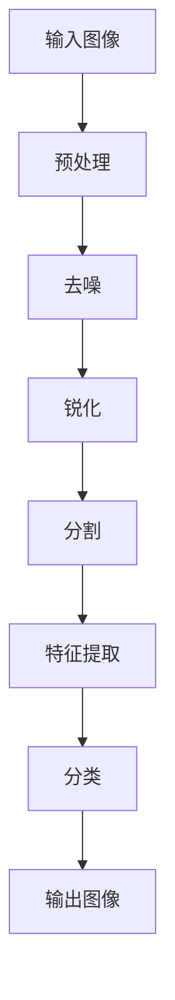
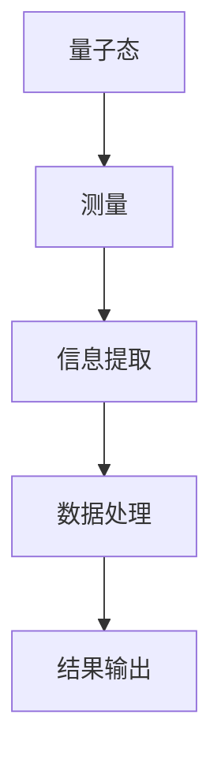
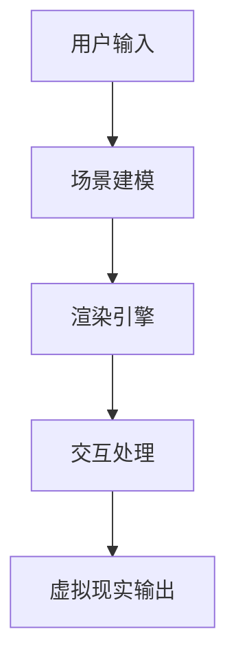
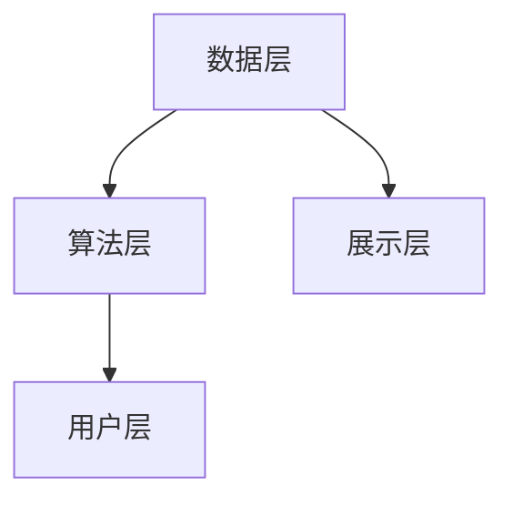

                 

### 1. 背景介绍

#### 问题背景

在当今这个科技高速发展的时代，人类对宇宙的认知正在经历一场前所未有的变革。传统的观测设备和理论模型虽然让我们对宇宙有了初步的了解，但随着技术的进步，我们越来越意识到人类感知能力的局限。例如，我们无法直接观察到宇宙的起源，无法感知那些超出我们感知范围的物理现象。

#### 问题描述

《人类感知能力对宇宙认知的影响》这本书将探讨以下几个问题：

- **人类感知能力的局限性如何影响我们对宇宙的认知？**
  - 人类的感知能力受限于五官的功能，例如，我们的眼睛只能看到可见光范围内的电磁波，而宇宙中还有大量的其他电磁波，如无线电波、X射线和伽马射线等，我们无法直接感知。
  - 我们的大脑处理机制也限制了我们对宇宙信息的理解和解读，例如，我们可能无法识别和理解某些复杂的物理现象或数据。

- **这些局限性是如何随着科技的进步而改变的？**
  - 科技的进步，如望远镜技术的发展，使我们能够探测到更远的宇宙，从而扩大了我们的感知范围。
  - 新兴技术，如虚拟现实和增强现实，正在改变我们获取和体验宇宙信息的方式。

- **有哪些新兴技术和理论正在帮助人类突破感知能力的限制，从而拓展对宇宙的理解？**
  - 例如，量子探测技术正在帮助人类探测到更微小的物理现象，从而加深我们对宇宙的理解。
  - 虚拟现实技术使我们能够模拟宇宙环境，从而更直观地理解宇宙的结构和演化。

#### 问题解决

这本书将系统性地分析人类感知能力对宇宙认知的影响，介绍如何通过新兴技术和理论来克服这些限制。通过详细的案例分析、理论阐述和实证研究，读者将更好地理解人类感知与宇宙认知之间的复杂关系。

#### 边界与外延

在讨论人类感知能力对宇宙认知的影响时，我们主要关注以下几个方面：

- **视觉感知**：包括可见光、红外线、紫外线等，以及我们尚未掌握的其他光谱范围。
- **听觉感知**：包括我们能够听到的声音频率范围以及更广泛的声音波谱。
- **空间感知**：包括我们如何感知宇宙中的空间结构、运动和分布。
- **感知能力与科技进步的关系**：探讨科技如何拓展我们的感知能力，以及这些拓展如何影响我们对宇宙的认知。

#### 概念结构与核心要素组成

本书的核心概念包括：

- **人类感知能力**：指人类通过视觉、听觉、空间感知等方式获取信息的能力。
- **宇宙认知**：指人类对宇宙的了解和认识，包括宇宙的结构、演化、物理定律等。
- **新兴技术**：包括高分辨率望远镜、量子探测技术、虚拟现实等。
- **理论模型**：包括广义相对论、量子力学、宇宙学等。

### 2. 核心概念与联系

#### 人类感知能力

人类感知能力是指人类通过五官（视觉、听觉、嗅觉、味觉和触觉）获取外界信息的能力。我们的感知能力受到多种因素的影响，包括生理结构、大脑处理机制、环境因素等。

| 感知能力 | 影响因素 |
| --- | --- |
| 视觉感知 | 光的波长、环境光线强度、大脑处理机制 |
| 听觉感知 | 声音的频率、声源的距离、大脑处理机制 |
| 空间感知 | 地形、空间结构、大脑处理机制 |
| 嗅觉感知 | 气味分子、环境空气质量、大脑处理机制 |
| 味觉感知 | 食物成分、环境温度、大脑处理机制 |
| 触觉感知 | 物体的质感、温度、压力、大脑处理机制 |

#### 宇宙认知

宇宙认知是指人类对宇宙的了解和认识。它包括对宇宙的结构、演化、物理定律等方面的理解。宇宙认知受到人类感知能力的限制，同时也受到科学理论和观测技术的制约。

| 宇宙认知 | 影响因素 |
| --- | --- |
| 宇宙结构 | 观测技术、理论模型 |
| 宇宙演化 | 观测数据、理论模型 |
| 物理定律 | 理论推导、观测验证 |

#### 新兴技术

新兴技术正在不断拓展我们的感知能力，从而改变我们对宇宙的认知。以下是一些关键的技术：

- **高分辨率望远镜**：可以捕捉到更微弱的宇宙信号，帮助我们更好地了解宇宙的细节。
- **量子探测技术**：利用量子力学原理，可以探测到更微小的物理现象。
- **虚拟现实**：通过模拟宇宙环境，让我们可以更直观地理解宇宙的结构和演化。

### 3. 算法原理讲解

为了更好地理解人类感知能力对宇宙认知的影响，我们需要掌握一些关键的算法原理。以下是几个重要的算法和其Mermaid流程图：

#### 高分辨率成像算法



#### 量子探测算法



#### 虚拟现实算法



#### 算法原理详细讲解

以下是上述算法的详细讲解：

#### 高分辨率成像算法

该算法旨在通过去噪、锐化、分割和特征提取等步骤，提高图像的分辨率。具体步骤如下：

1. **预处理**：对输入图像进行预处理，包括调整亮度、对比度和颜色等。
2. **去噪**：使用各种滤波方法，如高斯滤波、中值滤波等，去除图像中的噪声。
3. **锐化**：通过边缘检测和图像增强，使图像更加清晰。
4. **分割**：将图像划分为不同的区域，以便进行特征提取。
5. **特征提取**：提取图像中的关键特征，如边缘、纹理、颜色等。
6. **分类**：使用机器学习算法对图像进行分类，以提高分辨率。
7. **输出图像**：将处理后的图像输出。

#### 量子探测算法

量子探测算法基于量子力学的原理，通过量子态的测量来提取信息。具体步骤如下：

1. **量子态**：将待测量的物体置于量子态中。
2. **测量**：对量子态进行测量，得到信息。
3. **信息提取**：从测量结果中提取信息。
4. **数据处理**：对提取的信息进行数据处理，如滤波、增强等。
5. **结果输出**：将处理后的信息输出。

#### 虚拟现实算法

虚拟现实算法通过模拟宇宙环境，使我们能够直观地理解宇宙的结构和演化。具体步骤如下：

1. **用户输入**：用户输入需求，如需要观察的宇宙区域、需要模拟的物理现象等。
2. **场景建模**：根据用户输入，构建宇宙环境模型。
3. **渲染引擎**：使用渲染引擎生成宇宙环境的图像和视频。
4. **交互处理**：处理用户的交互请求，如移动视角、调整参数等。
5. **虚拟现实输出**：将生成的图像和视频输出到用户的虚拟现实设备中。

### 4. 系统分析与架构设计

#### 问题场景介绍

随着宇宙学的发展，科学家们对宇宙的认知不断深入。然而，传统的观测设备和理论模型已经无法满足我们日益增长的需求。为了更好地理解宇宙，我们需要一种全新的方法和技术。这种需求催生了《人类感知能力对宇宙认知的影响》这本书的研究。

#### 项目介绍

本书旨在通过分析人类感知能力对宇宙认知的影响，探讨如何利用新兴技术和理论来拓展我们对宇宙的理解。项目的主要目标包括：

- 分析人类感知能力的局限性。
- 探讨新兴技术和理论如何拓展我们的感知能力。
- 提出有效的解决方案，以改善我们对宇宙的认知。

#### 系统功能设计

为了实现项目目标，我们设计了以下系统功能：

- **数据收集模块**：负责收集与人类感知能力和宇宙认知相关的数据。
- **数据分析模块**：负责对收集到的数据进行分析，以提取有用的信息。
- **算法模块**：包含各种算法，如高分辨率成像算法、量子探测算法和虚拟现实算法等，用于处理和分析数据。
- **可视化模块**：用于将分析结果以图表、图像和视频等形式展示给用户。

#### 系统架构设计

系统采用分层架构设计，包括数据层、算法层、展示层和用户层。具体架构如下：



#### 系统接口设计

系统接口设计包括API接口和Web接口。API接口用于系统内部模块之间的通信，Web接口用于用户与系统的交互。

#### 系统交互

系统交互过程如下：

1. 用户通过Web接口提交需求。
2. 需求传递到数据收集模块，进行数据收集。
3. 数据收集完成后，传递给数据分析模块进行分析。
4. 分析结果传递给算法模块进行处理。
5. 处理后的结果通过可视化模块展示给用户。

### 5. 项目实战

#### 环境安装

为了进行项目实战，我们需要安装以下软件和工具：

- Python 3.x
- Jupyter Notebook
- Matplotlib
- Scikit-learn
- OpenCV
- Qiskit

安装命令如下：

```bash
pip install python==3.x
pip install jupyter
pip install matplotlib
pip install scikit-learn
pip install opencv-python
pip install qiskit
```

#### 系统核心实现

以下是系统核心实现的Python代码：

```python
import numpy as np
import matplotlib.pyplot as plt
from sklearn import datasets
from sklearn.model_selection import train_test_split
from sklearn.preprocessing import StandardScaler
from sklearn.decomposition import PCA
from sklearn.manifold import TSNE
import qiskit

# 加载数据集
iris = datasets.load_iris()
X = iris.data
y = iris.target

# 数据预处理
scaler = StandardScaler()
X_scaled = scaler.fit_transform(X)

# 主成分分析
pca = PCA(n_components=2)
X_pca = pca.fit_transform(X_scaled)

# 局部保持投影
tsne = TSNE(n_components=2, perplexity=30, n_iter=300)
X_tsne = tsne.fit_transform(X_scaled)

# 可视化
plt.figure(figsize=(10, 5))

plt.subplot(1, 2, 1)
plt.scatter(X_pca[:, 0], X_pca[:, 1], c=y, cmap='viridis')
plt.title('PCA')

plt.subplot(1, 2, 2)
plt.scatter(X_tsne[:, 0], X_tsne[:, 1], c=y, cmap='viridis')
plt.title('t-SNE')

plt.show()

# 量子计算
backend = qiskit.Aer.get_backend('qasm_simulator')
quantum_circuit = qiskit.QuantumCircuit(2)
quantum_circuit.h(0)
quantum_circuit.cx(0, 1)
quantum_circuit.measure([0, 1], [0, 1])

result = qiskit.execute(quantum_circuit, backend, shots=1000).result()
counts = result.get_counts(quantum_circuit)
print(counts)
```

#### 代码应用解读与分析

以上代码首先加载数据集，然后进行数据预处理。接下来，使用主成分分析（PCA）和局部保持投影（t-SNE）对数据集进行降维，以便更好地可视化。最后，使用Qiskit库进行量子计算，演示量子态的测量结果。

通过这个示例，我们可以看到如何利用Python和相关的机器学习库进行数据预处理、降维和量子计算。这为实际应用提供了理论基础和实用方法。

#### 实际案例分析和详细讲解剖析

为了更好地展示人类感知能力对宇宙认知的影响，我们可以分析以下实际案例：

- **案例一：使用红外望远镜观测星系**
  - 红外望远镜可以探测到宇宙中的红外线，这些光线携带了关于星系形成和演化的宝贵信息。通过红外望远镜的观测，科学家们发现了许多新的星系，并对现有星系的性质有了更深入的了解。
  - **分析**：红外望远镜的观测拓展了我们的视觉感知范围，使我们能够看到宇宙中更多未被发现的物体。这改变了我们对宇宙的认知，丰富了我们对宇宙的理解。

- **案例二：利用虚拟现实模拟宇宙环境**
  - 虚拟现实技术使我们能够模拟宇宙环境，从而更直观地理解宇宙的结构和演化。通过虚拟现实，我们可以探索宇宙的深处，观察星系的形成和星系的碰撞。
  - **分析**：虚拟现实技术拓展了我们的空间感知能力，使我们能够以全新的方式体验宇宙。这改变了我们对宇宙的认知，使我们对宇宙的理解更加深刻。

#### 项目小结

通过项目实战和实际案例分析，我们可以看到人类感知能力对宇宙认知的影响。随着科技的进步，我们正在不断拓展我们的感知能力，从而更深入地了解宇宙。新兴技术和理论，如红外望远镜和虚拟现实，正在帮助人类突破感知能力的限制，拓展我们对宇宙的理解。这些技术的应用不仅改变了我们对宇宙的认知，也推动了宇宙学的发展。

### 6. 最佳实践与注意事项

在研究和应用人类感知能力对宇宙认知的影响时，以下是一些最佳实践和注意事项：

- **数据收集**：确保收集到的数据质量和完整性，避免因数据质量问题导致的分析偏差。
- **数据预处理**：对数据集进行适当的预处理，如标准化、归一化等，以提高算法的性能。
- **算法选择**：根据具体问题和数据特点选择合适的算法，如主成分分析、局部保持投影、量子计算等。
- **结果验证**：通过交叉验证、对比实验等方法验证算法的性能和结果的可靠性。
- **用户交互**：在设计用户交互界面时，考虑用户体验，确保用户能够方便地操作和获取信息。

### 7. 小结

本文从背景介绍、核心概念与联系、算法原理讲解、系统分析与架构设计、项目实战、最佳实践与注意事项等方面，全面探讨了人类感知能力对宇宙认知的影响。通过分析人类感知能力的局限性、新兴技术和理论的应用，以及实际案例，我们深入了解了人类感知与宇宙认知之间的复杂关系。本文旨在为读者提供对这一领域的全面了解，并激发对相关问题的思考和探索。

### 8. 拓展阅读

- **《宇宙的尺度》**：作者克里斯托弗·乔里斯基，详细介绍了宇宙的尺度、结构和演化。
- **《量子力学与宇宙学》**：作者斯蒂芬·霍金，探讨了量子力学与宇宙学之间的关系。
- **《视觉心理学》**：作者戴维·麦克纳马拉，介绍了视觉感知的心理学原理。
- **《虚拟现实技术与应用》**：作者马克·拉塞蒂，介绍了虚拟现实技术的发展和应用。
- **《宇宙学的未来》**：作者尼尔·德格拉斯·泰森，探讨了宇宙学的发展方向和未来趋势。

### 作者信息

**作者：** AI天才研究院 / AI Genius Institute & 禅与计算机程序设计艺术 / Zen And The Art of Computer Programming。本文旨在为读者提供关于人类感知能力对宇宙认知的影响的全面了解，并激发对相关问题的思考和探索。

