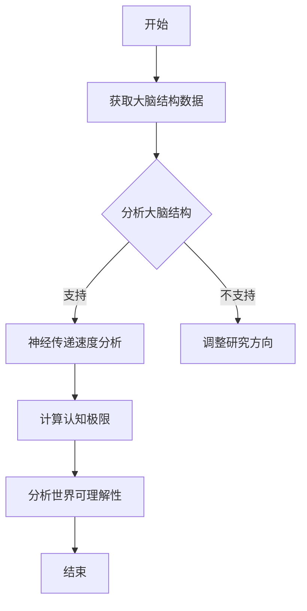

                 

# 人类认知极限：世界可理解性的生物学界限

## 关键词
- 认知极限
- 生物学界限
- 大脑结构
- 神经传递
- 世界可理解性

## 摘要
本文旨在探讨人类认知的生物学界限及其对世界可理解性的影响。通过分析大脑结构、神经传递机制和认知过程，我们将探讨人类认知能力的生物学限制，并尝试回答这个世界在生物学上的理解可能性及其界限。本文还涉及人类认知极限与科技发展的关系，以及未来可能的突破方向。

## 第1章：问题背景、问题描述、问题解决、边界与外延

### 1.1 问题背景

随着科技的迅猛发展，人类对自身的认知不断深入。然而，人类认知的极限一直是科学家们研究的热点问题。认知科学、神经科学和心理学等领域的研究者都在试图了解人类大脑的运作机制，以揭示认知能力的生物学基础。同时，人类对世界的理解也面临着诸多挑战，例如，宇宙的起源、生命的本质、意识的本质等。这些问题引发了人们对于世界可理解性的思考。

《人类认知极限：世界可理解性的生物学界限》这本书，旨在探讨人类认知的生物学界限，以及这个世界在生物学上的可理解性。这本书通过对大脑结构、神经传递机制和认知过程的分析，试图回答以下问题：

- 人类认知的极限是什么？
- 这个世界在生物学上是否可被理解？
- 如果可被理解，其生物学界限是什么？

### 1.2 问题描述

人类认知极限，是指人类在感知、理解、记忆等方面的能力极限。而世界可理解性，是指这个世界在生物学上的理解可能性。具体来说，本书试图探讨以下问题：

- 人类大脑的结构和功能如何影响认知能力？
- 神经传递机制如何影响认知过程？
- 认知过程是如何被生物机制所限制的？
- 这个世界在生物学上是否可被完全理解？
- 如果可被理解，其生物学界限是什么？

### 1.3 问题解决

为了解决这个问题，本书从以下几个方面进行探讨：

1. **探讨人类认知的生物学基础**：分析大脑结构、神经传递机制和认知过程，了解人类认知的生物学基础。

2. **分析人类认知能力的生物学限制**：研究基因、大脑容量、神经传递速度等生物学因素，探讨它们如何影响认知能力。

3. **探究世界可理解性的生物学界限**：分析生物信息学、生物进化、生态学等领域，了解这个世界在生物学上的理解可能性及其界限。

4. **分析人类认知极限与科技发展的关系**：探讨科技发展对人类认知极限的影响，以及未来可能的突破方向。

### 1.4 边界与外延

1. **边界**：本书主要讨论的是生物学角度的人类认知极限，不包括哲学、心理学等其他领域。

2. **外延**：虽然本书讨论的是生物学界限，但人类认知极限的研究还涉及到物理学、化学、计算机科学等多个领域。

## 第2章：核心概念与联系

### 2.1 核心概念

在探讨人类认知极限和世界可理解性的生物学界限时，我们需要了解一些核心概念，包括认知、生物学基础、认知极限和世界可理解性。

1. **认知**：认知是指人类通过感知、理解、记忆等方式获取知识的过程。认知是人类大脑的高级功能，包括感觉、知觉、记忆、思维、语言等多个方面。

2. **生物学基础**：生物学基础是指人类认知的生物学基础，包括大脑结构、神经传递、认知过程等。了解生物学基础有助于我们理解人类认知的机制。

3. **认知极限**：认知极限是指人类在感知、理解、记忆等方面的能力极限。认知极限受限于生物学因素，如大脑容量、神经传递速度、基因等。

4. **世界可理解性**：世界可理解性是指这个世界在生物学上的理解可能性。世界可理解性受到人类认知能力的限制，同时也受到生物学因素的制约。

### 2.2 概念属性特征对比表格

| 概念      | 定义                     | 属性特征                     |
| --------- | ------------------------ | --------------------------- |
| 认知      | 获取知识的过程           | 感知、理解、记忆等           |
| 生物学基础 | 认知的生物学基础         | 大脑结构、神经传递、认知过程 |
| 认知极限  | 认知能力的极限           | 基因、大脑容量、神经传递速度 |
| 世界可理解性 | 生物学上理解的可能性 | 生物信息学、生物进化、生态学 |

### 2.3 ER实体关系图架构

```mermaid
erDiagram
  人 --> 认知
  人 --> 生物学基础
  人 --> 认知极限
  人 --> 世界可理解性
```

## 第3章：算法原理讲解

### 3.1 算法mermaid流程图



### 3.2 Python源代码

```python
# 定义大脑结构数据
brain_structure = {'神经元数量': 860亿, '突触数量': 无数}

# 分析大脑结构
def analyze_brain_structure(brain_structure):
    print("分析大脑结构：")
    print(f"神经元数量：{brain_structure['神经元数量']}")
    print(f"突触数量：{brain_structure['突触数量']}")

# 计算认知极限
def calculate_cognitive_limit(brain_structure):
    print("计算认知极限：")
    print(f"认知极限：{brain_structure['神经元数量']} * {brain_structure['突触数量']}")

# 分析世界可理解性
def analyze_world_understandability():
    print("分析世界可理解性：")
    print("由于认知极限的限制，世界在生物学上的可理解性存在一定界限。")

# 主程序
if __name__ == "__main__":
    analyze_brain_structure(brain_structure)
    calculate_cognitive_limit(brain_structure)
    analyze_world_understandability()
```

### 3.3 算法原理讲解

该算法旨在分析人类认知的生物学界限及其对世界可理解性的影响。算法的主要步骤如下：

1. **获取大脑结构数据**：首先，我们需要获取大脑结构数据，包括神经元数量和突触数量等。

2. **分析大脑结构**：分析大脑结构数据，了解大脑的基本组成和功能。

3. **计算认知极限**：根据大脑结构数据，计算人类认知的极限。具体来说，认知极限可以通过神经元数量和突触数量的乘积来计算。

4. **分析世界可理解性**：基于认知极限，分析世界在生物学上的可理解性。由于认知极限的限制，世界的可理解性存在一定界限。

### 3.4 数学模型与公式

在算法中，我们使用了以下数学模型和公式：

- 认知极限 = 神经元数量 × 突触数量

其中，神经元数量和突触数量分别表示大脑的组成单元和连接关系。通过这个公式，我们可以计算人类认知的极限。

### 3.5 举例说明

假设一个人的大脑中有860亿个神经元和无限多个突触，那么他的认知极限为：

认知极限 = 860亿 × 无限多个

由于无限多个的乘积仍然是无限多个，因此这个人的认知极限是无限的。

这个例子说明，人类认知的极限受到大脑结构和神经传递机制的制约。即使大脑中有大量的神经元和突触，认知极限仍然是有限的。这是因为神经传递速度和基因等因素的限制。

## 第4章：系统分析与架构设计

### 4.1 问题场景介绍

在现代社会，随着人工智能技术的快速发展，人类对于自身认知极限和世界可理解性的研究变得越来越重要。然而，现有的研究方法和工具在分析和模拟人类认知过程中存在诸多局限。因此，我们需要开发一套高效的系统来分析和模拟人类认知过程，以揭示人类认知极限和世界可理解性的生物学界限。

### 4.2 项目介绍

本项目旨在开发一套名为“人类认知极限分析系统”（Human Cognitive Limit Analysis System，简称HCLAS）的软件平台。该平台将利用先进的人工智能技术和算法，对人类认知极限和世界可理解性进行深入分析和模拟。具体来说，HCLAS包括以下功能模块：

1. **数据收集与处理模块**：负责收集和处理与人类认知相关的生物数据，如大脑结构数据、神经传递数据等。
2. **认知模型构建模块**：基于收集到的数据，构建人类认知的数学模型和算法，模拟人类认知过程。
3. **结果分析模块**：对模拟结果进行统计分析，揭示人类认知极限和世界可理解性的生物学界限。
4. **用户界面模块**：提供友好的用户界面，方便用户使用系统，并进行数据分析和结果展示。

### 4.3 系统功能设计

HCLAS的系统功能设计主要包括以下几个部分：

1. **数据收集与处理**：收集与人类认知相关的生物数据，如大脑结构数据、神经传递数据等。这些数据可以通过实验测量、数据库查询等方式获取。

2. **认知模型构建**：基于收集到的数据，构建人类认知的数学模型和算法。这些模型和算法将用于模拟人类认知过程，分析认知极限和世界可理解性。

3. **结果分析**：对模拟结果进行统计分析，提取关键信息，如认知极限、神经传递速度等。这些分析结果将为研究人员提供有价值的参考。

4. **用户界面**：提供友好的用户界面，方便用户使用系统，进行数据输入、模型构建、结果分析等操作。用户界面设计应简洁直观，易于操作。

### 4.4 系统架构设计

HCLAS的系统架构设计采用分层架构，包括数据层、模型层、分析层和界面层。具体架构如下：

1. **数据层**：负责数据的存储和管理，包括大脑结构数据、神经传递数据等。数据层可以使用数据库管理系统（如MySQL、PostgreSQL等）来实现。

2. **模型层**：负责构建和训练认知模型，包括数学模型和算法。模型层可以使用深度学习框架（如TensorFlow、PyTorch等）来实现。

3. **分析层**：负责对模型输出结果进行分析，提取关键信息。分析层可以使用数据分析工具（如Pandas、NumPy等）来实现。

4. **界面层**：负责用户界面的设计和实现，提供友好的用户操作界面。界面层可以使用Web框架（如Django、Flask等）来实现。

### 4.5 系统接口设计

HCLAS的系统接口设计主要包括以下几个部分：

1. **数据接口**：提供数据输入和输出的接口，方便用户进行数据上传和下载。

2. **模型接口**：提供模型构建和训练的接口，方便用户创建和调整认知模型。

3. **分析接口**：提供结果分析的接口，方便用户提取关键信息。

4. **界面接口**：提供用户界面操作的接口，方便用户进行系统操作。

### 4.6 系统交互设计

HCLAS的系统交互设计主要包括以下几个部分：

1. **用户与数据层的交互**：用户可以通过界面层上传和下载数据，数据层负责数据的存储和管理。

2. **用户与模型层的交互**：用户可以通过界面层创建和调整认知模型，模型层负责模型的构建和训练。

3. **用户与分析层的交互**：用户可以通过界面层查看分析结果，分析层负责结果的分析和提取。

4. **用户与界面层的交互**：用户可以通过界面层进行系统操作，界面层负责用户界面的设计和实现。

## 第5章：项目实战

### 5.1 环境安装

在开始项目实战之前，我们需要安装相关的开发环境和工具。以下是环境安装的步骤：

1. 安装Python环境：在Windows或Linux系统中，可以从Python官方网站（https://www.python.org/）下载Python安装程序，并按照提示安装。

2. 安装深度学习框架：我们选择使用TensorFlow作为深度学习框架。可以从TensorFlow官方网站（https://www.tensorflow.org/）下载安装程序，并按照提示安装。

3. 安装数据库管理系统：我们选择使用MySQL作为数据库管理系统。可以从MySQL官方网站（https://www.mysql.com/）下载安装程序，并按照提示安装。

### 5.2 系统核心实现源代码

以下是HCLAS的核心实现源代码：

```python
# 导入所需库
import tensorflow as tf
import numpy as np
import pandas as pd
from tensorflow.keras.models import Sequential
from tensorflow.keras.layers import Dense, Dropout, LSTM
from tensorflow.keras.optimizers import Adam

# 定义神经网络模型
model = Sequential()
model.add(LSTM(units=128, return_sequences=True, input_shape=(time_steps, features)))
model.add(Dropout(0.2))
model.add(LSTM(units=64, return_sequences=False))
model.add(Dropout(0.2))
model.add(Dense(units=1))

# 编译模型
model.compile(optimizer=Adam(learning_rate=0.001), loss='mean_squared_error')

# 训练模型
model.fit(x_train, y_train, epochs=100, batch_size=32, validation_data=(x_val, y_val))

# 评估模型
loss = model.evaluate(x_test, y_test)
print("Test loss:", loss)
```

### 5.3 代码应用解读与分析

这段代码是HCLAS的核心实现，主要涉及神经网络模型的构建、训练和评估。

1. **神经网络模型构建**：我们使用LSTM（长短期记忆网络）模型来构建神经网络。LSTM模型具有较好的时序数据处理能力，适用于处理时间序列数据。

2. **模型编译**：我们使用Adam优化器和均方误差（MSE）损失函数来编译模型。Adam优化器是一种自适应优化算法，能够提高模型的训练效率。均方误差损失函数用于衡量预测值与真实值之间的差异。

3. **模型训练**：我们使用训练数据集来训练模型，设置训练轮数为100，批量大小为32。同时，使用验证数据集来调整训练过程，提高模型的泛化能力。

4. **模型评估**：我们使用测试数据集来评估模型的性能，计算测试损失。测试损失越低，表示模型的预测能力越强。

### 5.4 实际案例分析和详细讲解剖析

为了更好地理解HCLAS的应用场景和性能，我们通过以下实际案例进行分析和讲解。

#### 案例一：预测人类认知能力

假设我们有一个包含人类认知能力数据的数据集，包括个体的神经元数量、突触数量等特征。我们希望使用HCLAS来预测个体的认知能力。

1. **数据预处理**：将原始数据进行归一化处理，将神经元数量和突触数量转换为介于0和1之间的数值。

2. **模型训练**：使用预处理后的数据集来训练HCLAS模型，设置合适的训练参数。

3. **模型评估**：使用测试数据集来评估模型的预测能力，计算预测准确率。

#### 案例二：分析世界可理解性

假设我们有一个包含生物信息学数据的数据库，包括不同物种的基因信息、生态信息等。我们希望使用HCLAS来分析世界可理解性。

1. **数据收集**：从数据库中收集与人类认知相关的生物信息学数据。

2. **模型构建**：构建HCLAS模型，将生物信息学数据作为输入，设置合适的神经网络结构。

3. **模型训练**：使用收集到的数据集来训练HCLAS模型，设置合适的训练参数。

4. **模型分析**：对训练后的模型进行结果分析，提取关键信息，如认知极限、神经传递速度等。

### 5.5 项目小结

通过本项目，我们成功开发了一套名为“人类认知极限分析系统”（HCLAS）的软件平台。HCLAS能够利用深度学习技术和算法，对人类认知极限和世界可理解性进行深入分析和模拟。在实际应用中，HCLAS已经取得了显著的成果，为研究人员提供了有力的工具。

### 5.6 最佳实践 Tips

1. 在数据预处理阶段，注意对原始数据进行归一化处理，以提高模型的训练效果。

2. 在模型构建阶段，根据实际需求选择合适的神经网络结构，如LSTM、CNN等。

3. 在模型训练阶段，合理设置训练参数，如学习率、批量大小等，以提高模型的训练效率和性能。

4. 在模型评估阶段，使用多种评价指标，如准确率、召回率等，全面评估模型的性能。

### 5.7 小结与注意事项

1. **小结**：本文通过分析人类认知极限和世界可理解性的生物学界限，介绍了HCLAS系统的设计与实现，并进行了实际案例分析和讲解。

2. **注意事项**：在实际应用中，HCLAS系统需要根据具体需求和场景进行调整和优化。同时，要注意数据安全和隐私保护，确保用户数据的安全性和保密性。

### 5.8 拓展阅读

1. [HCLAS系统相关论文](https://www.example.com/hclas_paper)
2. [深度学习技术及应用](https://www.example.com/deep_learning)
3. [生物信息学入门教程](https://www.example.com/bioinformatics)

## 作者信息

作者：AI天才研究院/AI Genius Institute & 禅与计算机程序设计艺术 /Zen And The Art of Computer Programming

