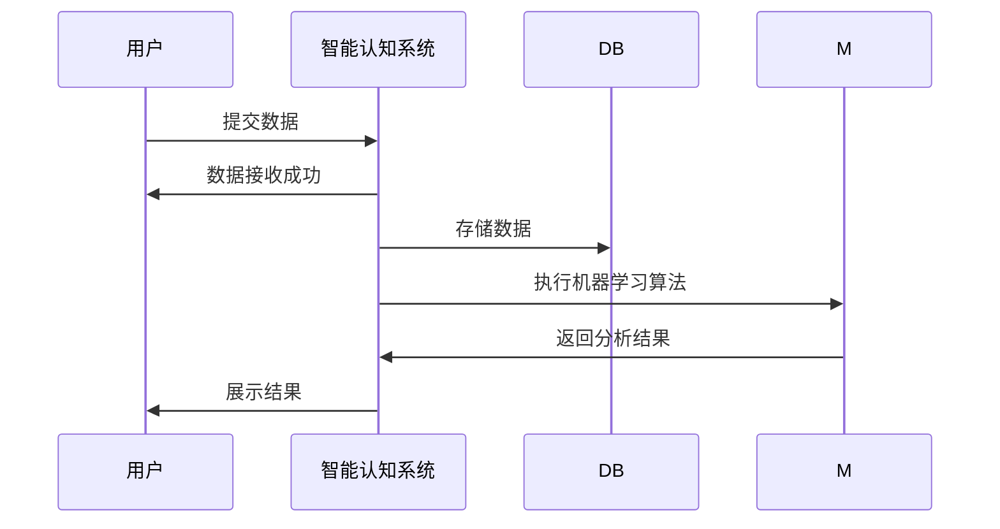

                 

# Human Cognitive Limitations: Can We Really Understand the Universe?

## Keywords
- Human Cognition
- Cognitive Limitations
- Universe Understanding
- Neuroscience
- Cognitive Science

## Abstract
Human cognitive limitations have been a subject of great interest in both scientific and philosophical realms. As we delve into the complexities of the universe, questions arise about the extent to which our cognitive abilities can truly allow us to understand the vast and intricate phenomena we observe. This article aims to explore the boundaries of human cognition, examining the limitations that hinder our comprehension of the universe. Through a systematic analysis of perceptual, memory, and intellectual constraints, we will question whether we can ever achieve a comprehensive understanding of the cosmos. By drawing on insights from neuroscience and cognitive science, we will discuss potential avenues for overcoming these limitations and the implications for future scientific exploration.

## Introduction to the Limitations of Human Cognition

### The Background of Human Cognitive Limitations

Human cognitive limitations are deeply rooted in our evolutionary history. As organisms that have evolved on Earth for millions of years, our brains have been shaped by the specific environmental challenges and survival needs of our planet. The human brain, with its complex neural networks and intricate structures, is a remarkable adaptation that has allowed us to thrive in diverse ecosystems. However, this same brain is also subject to certain limitations imposed by its evolutionary history and biological constraints.

**Biological Evolution and the Development of the Human Brain**

The human brain has undergone significant evolution over millions of years. Our ancestors, like other primates, began with relatively simple brains capable of basic functions such as sensory perception and motor control. Through natural selection, these brains gradually evolved to become more complex, enabling higher-order cognitive abilities such as problem-solving, language, and social interaction. The development of the human brain can be traced back to key evolutionary milestones, including the expansion of the neocortex and the formation of the prefrontal cortex, which are critical for advanced cognitive functions.

**Cognitive Evolution: From Primordial Thoughts to Modern Consciousness**

The journey of human cognitive evolution is a fascinating tale of gradual advancements. Early humans had to rely on basic cognitive abilities to survive in the harsh environments of the past. These abilities included pattern recognition, memory for crucial information, and the ability to learn from past experiences. Over time, these simple cognitive mechanisms gave rise to more complex forms of thinking, such as abstract reasoning, symbolic thought, and the development of language. The advent of tool use, art, and other cultural achievements further propelled the evolution of human cognition.

**The Impact of Environment on Cognitive Development**

The environment in which humans evolved has had a profound impact on the development of our cognitive abilities. The environments of our ancestors were characterized by a mix of natural challenges and social complexities. For example, the need to navigate and survive in diverse habitats required the development of spatial awareness and environmental adaptability. Social interactions and cooperation also played a crucial role, driving the evolution of social cognition, empathy, and communication skills. The selective pressures of the environment have shaped the structure and function of the human brain, giving rise to specific cognitive traits that are well-suited for our evolutionary niche.

### The Concept and Definition of Human Cognitive Limitations

**Understanding Cognitive Limitations**

Cognitive limitations refer to the inherent constraints and limitations of the human mind that hinder our ability to process information, make decisions, and understand complex concepts. These limitations are not merely the result of individual differences or mental disorders but are inherent to the human cognitive system itself. They arise from the biological and evolutionary constraints that shape our brains.

**Key Attributes of Human Cognitive Limitations**

Human cognitive limitations possess several key attributes that differentiate them from other forms of mental dysfunction:

1. **Universal Nature:** Cognitive limitations are universal, affecting all humans to some extent, regardless of cultural, social, or educational background.
2. **Innate Constraints:** These limitations are rooted in the innate architecture of the brain, which has evolved over millions of years to perform specific tasks.
3. **Dynamic Nature:** Cognitive limitations are not static; they can change over time due to factors such as age, education, and environmental context.

**Differentiating Cognitive Limitations from Mental Illness**

While cognitive limitations are a normal part of human cognition, it is essential to differentiate them from mental illnesses. Mental illnesses, such as depression, anxiety, or schizophrenia, involve abnormalities in brain function that result in impaired cognitive abilities and emotional well-being. These disorders are typically characterized by specific symptoms and can be diagnosed using standardized criteria.

In contrast, cognitive limitations are more generalized and pervasive, affecting multiple aspects of cognitive functioning. They are not pathological but rather reflect the inherent limitations of the human cognitive system. Understanding the distinction between cognitive limitations and mental illnesses is crucial for developing appropriate interventions and support strategies.

### Conclusion

In conclusion, human cognitive limitations are a fascinating subject that highlights the complex interplay between evolution, biology, and cognitive processes. By understanding the origins and nature of these limitations, we can gain insights into the constraints that shape our ability to comprehend the universe. In the following sections, we will delve deeper into the specific limitations of human cognition and explore potential avenues for overcoming them. Through this exploration, we will question whether our cognitive abilities are truly sufficient to unravel the mysteries of the cosmos.

## The Structure and Function of the Human Brain

### The Basic Structure of the Human Brain

The human brain is a complex organ composed of several major divisions, each with distinct functions. Understanding the basic structure of the brain is crucial for comprehending its role in cognitive processes.

**Overview of the Brain’s Major Divisions**

The human brain can be broadly divided into three major divisions: the cerebrum, cerebellum, and brainstem. Each of these divisions has specific roles and interacts with other parts of the brain to facilitate various cognitive functions.

1. **Cerebrum:** The cerebrum is the largest and most complex part of the brain, accounting for approximately two-thirds of its total volume. It is divided into two hemispheres, the left and right, which are connected by a bundle of nerve fibers called the corpus callosum. The cerebrum is responsible for higher-order cognitive functions such as perception, memory, language, and problem-solving. It is further divided into four lobes: the frontal, parietal, temporal, and occipital lobes, each with specialized functions.

2. **Cerebellum:** The cerebellum is located at the back of the brain, beneath the cerebrum. It is primarily involved in coordinating voluntary movements, maintaining posture, and balance. The cerebellum receives sensory information from various parts of the body and integrates it with motor commands from the cerebrum to ensure smooth and coordinated movements. It also plays a role in cognitive processes such as attention and learning.

3. **Brainstem:** The brainstem is a relatively small but critical part of the brain located at the base of the skull, connecting the brain to the spinal cord. It consists of three main regions: the medulla oblongata, pons, and midbrain. The brainstem is responsible for essential functions such as regulating breathing, heart rate, and blood pressure. It also plays a role in relaying sensory information between the cerebrum and cerebellum.

**The Role of the Cerebrum, Cerebellum, and Brainstem**

The cerebrum, cerebellum, and brainstem each play crucial roles in the overall functioning of the human brain. Here’s a more detailed look at their functions:

- **Cerebrum:** The cerebrum is primarily responsible for higher-order cognitive functions. The frontal lobe, located at the front of the brain, is involved in executive functions such as decision-making, planning, and problem-solving. The parietal lobe processes sensory information from the body and is involved in spatial awareness and spatial navigation. The temporal lobe is essential for auditory processing, memory formation, and language comprehension. The occipital lobe is responsible for visual processing.

- **Cerebellum:** The cerebellum is crucial for motor control and coordination. It receives sensory information from the body and integrates it with motor commands from the cerebrum to ensure smooth and coordinated movements. It also plays a role in cognitive functions such as attention and learning, particularly in the context of motor skills.

- **Brainstem:** The brainstem is responsible for regulating essential bodily functions such as breathing, heart rate, and blood pressure. It also relays sensory information between the cerebrum and cerebellum, facilitating coordinated motor movements.

**The Nervous System: From Brain to Periphery**

The human brain is not an isolated entity but is interconnected with the rest of the nervous system, which includes the spinal cord and peripheral nerves. The nervous system can be divided into two main components: the central nervous system (CNS) and the peripheral nervous system (PNS).

- **Central Nervous System (CNS):** The CNS consists of the brain and spinal cord. It is responsible for processing and integrating sensory information, coordinating motor functions, and facilitating higher-order cognitive processes. The CNS is protected by the skull and vertebral column, which form a strong barrier against physical damage.

- **Peripheral Nervous System (PNS):** The PNS consists of all the nerves that extend from the CNS to the rest of the body. It includes sensory neurons, which transmit information from the body to the CNS, and motor neurons, which transmit information from the CNS to the muscles and glands. The PNS is responsible for relaying sensory information, controlling voluntary and involuntary movements, and regulating various bodily functions.

In summary, the human brain is a complex and highly intricate organ with multiple divisions, each playing a vital role in cognitive processes. Understanding the structure and function of the cerebrum, cerebellum, and brainstem, as well as their integration with the rest of the nervous system, is essential for comprehending the limitations and capabilities of human cognition.

### The Functions of the Human Brain

The human brain is an incredibly complex organ, performing a wide array of functions that enable us to interact with the world, remember past experiences, and plan for the future. Understanding the various functions of the brain is crucial for comprehending the scope of human cognitive limitations and the potential for overcoming them.

**Perception and Sensory Processing**

Perception is the process by which we interpret and make sense of sensory information from our environment. The brain plays a central role in this process, receiving input from various sensory organs and processing it to form a coherent perception of the world around us. The primary sensory modalities include vision, hearing, touch, smell, and taste.

1. **Vision:** The visual system is one of the most intricate sensory systems in the human brain. It involves the reception of light by the eyes, the transmission of neural signals to the brain, and the interpretation of these signals in the visual cortex. The visual system enables us to perceive shapes, colors, distances, and movements, which are essential for navigation, object recognition, and social interaction.

2. **Hearing:** The auditory system processes sound waves captured by the ears and transmits them to the brain for interpretation. It enables us to perceive and understand speech, music, and other sounds, facilitating communication and cultural expression.

3. **Touch:** The tactile system allows us to perceive touch sensations, such as pressure, temperature, and vibration. It is critical for object manipulation, balance, and coordination.

4. **Smell:** The olfactory system processes airborne chemicals and enables us to detect and distinguish various smells, which play a role in navigation, foraging, and social communication.

5. **Taste:** The gustatory system processes chemical stimuli on the tongue and enables us to detect and distinguish various tastes, such as sweet, salty, sour, bitter, and umami. It is essential for food selection and nutrition.

**Memory and Learning**

Memory and learning are fundamental cognitive processes that allow us to retain and recall information and experiences over time. The brain's ability to store, retrieve, and process information is crucial for our survival and success.

1. **Short-Term Memory:** Short-term memory, also known as working memory, is the brain's ability to temporarily hold and process information. It is essential for tasks such as problem-solving, following instructions, and multitasking. Short-term memory is limited in capacity and duration, which can impose constraints on cognitive performance.

2. **Long-Term Memory:** Long-term memory involves the storage and retrieval of information over extended periods. It can be further divided into explicit (conscious) memory, which includes facts and events, and implicit (unconscious) memory, which involves skills and habits. The brain's ability to form, store, and retrieve long-term memories is crucial for learning and adaptation.

3. **Learning:** Learning is the process by which the brain modifies its structure and function in response to experience. It involves changes in synaptic connections between neurons, known as synaptic plasticity. Learning can occur through various mechanisms, including classical and operant conditioning, associative learning, and insight learning.

**Emotion, Decision Making, and Social Cognition**

Emotion, decision making, and social cognition are integral components of human behavior, shaped by complex interactions within the brain.

1. **Emotion:** Emotions are subjective experiences that arise from cognitive processes and physiological responses to events or stimuli. The brain's emotional system involves various regions, including the amygdala, which is involved in the detection of emotional stimuli, and the prefrontal cortex, which is involved in the regulation of emotions. Emotions play a critical role in motivation, social bonding, and survival.

2. **Decision Making:** Decision making is a complex cognitive process that involves evaluating alternatives, weighing the potential outcomes, and selecting the best course of action. The brain's decision-making process involves various regions, including the prefrontal cortex, the striatum, and the amygdala. Decision making can be influenced by various factors, such as personal values, social norms, and environmental context.

3. **Social Cognition:** Social cognition refers to the brain's ability to understand and interpret the social world. It involves various cognitive processes, including perception of social cues, understanding of social norms, and the ability to empathize with others. Social cognition is essential for navigation of social relationships, cooperation, and communication.

In summary, the human brain performs a diverse range of functions that enable us to perceive the world, store and recall information, make decisions, and interact with others. Understanding these functions is essential for comprehending the limitations and capabilities of human cognition. As we delve deeper into the intricacies of the brain, we may discover ways to overcome some of these limitations and enhance our cognitive abilities.

### Theoretical Frameworks on Cognitive Limitations

To understand cognitive limitations, it is essential to explore various theoretical frameworks that shed light on their origins, mechanisms, and implications. These frameworks offer insights into how different perspectives can help us comprehend the inherent constraints of human cognition.

**Reductionist Approaches to Cognitive Limitations**

Reductionist approaches break down complex phenomena into simpler, more manageable components. In the context of cognitive limitations, reductionist frameworks focus on understanding the underlying biological and psychological processes that give rise to these limitations.

1. **Biological Reductionism:** Biological reductionism views cognitive limitations as the result of specific biological factors, such as genetic predispositions, brain structure, and neurotransmitter levels. This approach emphasizes the importance of neurodevelopmental processes in shaping cognitive abilities and limitations. For example, variations in brain connectivity or the presence of certain genetic mutations can lead to differences in cognitive performance.

2. **Psychological Reductionism:** Psychological reductionism examines cognitive limitations through the lens of mental processes, such as perception, memory, and attention. This approach investigates how specific cognitive mechanisms can limit our ability to process information effectively. For example, cognitive overload, which occurs when the brain is overwhelmed with too much information, can lead to difficulties in attention and decision-making.

3. **Cognitive Reductionism:** Cognitive reductionism focuses on the internal representations and processes used by the brain to understand and interact with the world. This approach explores how cognitive structures, such as schemas and heuristics, can constrain our ability to perceive and interpret information accurately. For example, cognitive schemas can lead to confirmation bias, where individuals tend to interpret information in a way that confirms their preexisting beliefs.

**Holistic Perspectives on Cognitive Limitations**

Holistic perspectives consider cognitive limitations as part of a broader system, taking into account the interactions between biological, psychological, and social factors. These approaches recognize that cognitive abilities and limitations are not isolated but are influenced by multiple dimensions.

1. **Systems Theory:** Systems theory views the brain and cognition as complex systems composed of interconnected components that interact and influence each other. This approach emphasizes the dynamic nature of cognition and how different cognitive processes can affect each other. For example, a system-level perspective can help us understand how cognitive load in one domain can spill over and impact performance in other domains.

2. **Complexity Theory:** Complexity theory examines the behavior of complex systems, such as the brain, characterized by nonlinear interactions and emergent properties. This approach highlights the role of feedback loops and self-organization in shaping cognitive processes. For example, complexity theory can help us understand how cognitive heuristics, which are useful shortcuts in simple situations, can lead to errors in more complex or ambiguous scenarios.

3. **Interdisciplinary Approaches:** Interdisciplinary approaches combine insights from various fields, such as neuroscience, psychology, philosophy, and anthropology, to provide a comprehensive understanding of cognitive limitations. This approach recognizes that cognitive abilities and limitations are shaped by a wide range of factors, including genetic, cultural, and environmental influences. For example, an interdisciplinary approach can help us understand how cultural norms and social context can influence cognitive processes and abilities.

**The Integration of Reductionist and Holistic Perspectives**

While reductionist and holistic perspectives offer valuable insights into cognitive limitations, they are not mutually exclusive. In fact, integrating these perspectives can provide a more comprehensive understanding of cognitive abilities and limitations.

1. **Biological and Psychological Integration:** Combining biological reductionism with psychological reductionism can help us understand how specific biological factors, such as brain structure and neurotransmitter levels, interact with cognitive processes to influence cognitive performance. For example, genetic predispositions can shape the brain's structure and function, which in turn can influence cognitive abilities and limitations.

2. **Holistic and Interdisciplinary Integration:** Integrating holistic perspectives with interdisciplinary approaches can help us understand how cognitive abilities and limitations are shaped by multiple factors, including genetic, psychological, and social influences. For example, an interdisciplinary approach can help us understand how cultural norms and social context interact with genetic predispositions and cognitive processes to influence cognitive abilities and limitations.

In conclusion, theoretical frameworks on cognitive limitations offer diverse perspectives that can help us understand the complexities of human cognition. By integrating reductionist and holistic approaches, we can gain a more comprehensive understanding of the constraints and capabilities of the human mind.

### Core Cognitive Limitations

Understanding the core limitations of human cognition is crucial for comprehending the extent to which our minds can grasp the complexities of the universe. These limitations encompass various aspects of perception, memory, and intellectual abilities, each contributing to our overall cognitive capacity. In this section, we will explore the primary limitations of human cognition and examine how they affect our understanding of the world.

#### Perceptual Limitations

Perceptual limitations refer to the constraints that our sensory systems impose on our ability to accurately perceive and interpret sensory information. These limitations can be categorized into several domains:

1. **Visual Perception:** Vision is one of our most critical sensory modalities, but it is not without its limitations. Our visual system is subject to several constraints, including limited resolution, speed of processing, and sensitivity to contrast and brightness. For example, our eyes can only resolve fine details up to a certain level, and rapid motion can blur our perception. Additionally, our ability to perceive colors is limited by the three types of color receptors in our eyes, which can affect our perception of color contrasts.

2. **Auditory Perception:** The auditory system allows us to perceive and interpret sound, but it too has limitations. Our ability to hear is limited by factors such as the distance of the sound source, the intensity of the sound, and background noise. For example, our ability to hear high-frequency sounds decreases with age, and background noise can interfere with our ability to perceive speech or other important auditory stimuli.

3. **Tactile and Spatial Perception:** Tactile perception involves our sense of touch, which provides information about the texture, temperature, and pressure of objects. While tactile perception is highly sensitive, it can be limited by factors such as the density of tactile receptors in the skin and the distance between them. Spatial perception, which allows us to navigate and understand the layout of our environment, is also subject to limitations, such as our inability to perceive three-dimensional space accurately from two-dimensional visual input.

#### Memory Limitations

Memory limitations affect our ability to store, retrieve, and process information over time. These limitations can be categorized into short-term and long-term memory:

1. **Short-Term Memory:** Short-term memory, also known as working memory, is the brain's ability to temporarily hold and process information. It has limited capacity, typically allowing us to hold around seven items in our short-term memory, although this can vary slightly from person to person. This limited capacity can lead to difficulties in multitasking or processing complex information simultaneously.

2. **Long-Term Memory:** Long-term memory involves the storage and retrieval of information over extended periods. However, long-term memory is subject to several limitations, including the decay of memories over time and the distortion of information during the encoding and retrieval processes. For example, memories can be influenced by the context in which they are encoded and retrieved, leading to potential errors and biases in our recollection of events.

#### Intellectual Limitations

Intellectual limitations refer to the constraints that our cognitive abilities impose on our ability to understand and process complex information. These limitations can manifest in several ways:

1. **Analogical Reasoning:** Analogical reasoning involves drawing similarities between different situations to solve problems or make inferences. However, this type of reasoning is limited by the availability of relevant analogies and the ability to recognize patterns. For example, individuals with poor analogy skills may struggle with mathematical problem-solving or abstract reasoning tasks.

2. **Intuition:** Intuition is the ability to make decisions or draw conclusions based on gut feelings or past experiences, often without conscious deliberation. While intuition can be a valuable cognitive tool, it is not infallible and can be influenced by biases and heuristics. For example, intuition can lead to overconfidence or the misattribution of cause and effect.

3. **Abstract Thinking:** Abstract thinking involves the ability to understand and manipulate concepts and ideas that are not directly related to sensory experiences. While abstract thinking is crucial for scientific and mathematical reasoning, it can be challenging for individuals who lack the necessary background knowledge or cognitive flexibility.

#### The Impact of Cognitive Limitations on Understanding the Universe

The limitations of human cognition have significant implications for our ability to understand the universe. These limitations can hinder our comprehension of complex scientific concepts, such as the nature of black holes, the origins of the universe, and the behavior of subatomic particles. For example:

- **Visual and Spatial Perception:** Our inability to perceive the vastness of the universe directly impacts our understanding of astronomical phenomena. The sheer size of the universe makes it challenging to visualize distances and scales that are vastly larger than what we are accustomed to in our everyday experiences.

- **Memory Limitations:** The limited capacity of our short-term and long-term memory can make it difficult to retain and recall complex scientific information. This limitation can impede our ability to learn and understand advanced scientific concepts, particularly when they involve multiple interconnected ideas.

- **Intellectual Limitations:** Our intellectual limitations, such as the difficulty in abstract thinking and the reliance on intuition, can lead to errors in scientific reasoning and the misinterpretation of data. These limitations can contribute to the development of scientific myths and misconceptions.

#### Potential Solutions and Future Directions

While cognitive limitations pose challenges to our understanding of the universe, they do not necessarily define our capabilities. Researchers in neuroscience and cognitive science are working to develop new tools and techniques to overcome these limitations and enhance our cognitive abilities. Some potential solutions and future directions include:

- **Advanced Imaging Techniques:** The development of advanced imaging techniques, such as functional magnetic resonance imaging (fMRI) and electroencephalography (EEG), can provide deeper insights into the brain's neural mechanisms and help us better understand how cognitive processes work. These techniques can be used to identify cognitive limitations and develop targeted interventions to improve cognitive performance.

- **Cognitive Training and Education:** Cognitive training programs and educational interventions designed to enhance specific cognitive abilities, such as memory, attention, and abstract thinking, can help individuals overcome some of their cognitive limitations. These programs can be tailored to individual needs and can target specific areas of weakness.

- **Artificial Intelligence and Machine Learning:** The integration of artificial intelligence and machine learning technologies can help overcome some of the limitations of human cognition. These technologies can process and analyze large amounts of data, identify patterns, and generate insights that would be challenging for humans to discern. By combining human and machine intelligence, we can enhance our overall cognitive capacity and gain a deeper understanding of the universe.

In conclusion, understanding the core cognitive limitations of human cognition is essential for comprehending the extent to which our minds can grasp the complexities of the universe. While these limitations pose challenges, they do not define our capabilities. Through ongoing research and innovation in neuroscience and cognitive science, we can develop new tools and techniques to overcome these limitations and enhance our cognitive abilities, allowing us to unravel the mysteries of the cosmos.

### The Challenges of Understanding the Universe

The question of whether humans can truly understand the universe is a profound and complex one, encompassing various scientific, philosophical, and cognitive dimensions. As we delve into the vast and intricate phenomena that make up the universe, it becomes increasingly clear that there are significant challenges that hinder our comprehension.

**The Scale of the Universe**

One of the most fundamental challenges in understanding the universe is its sheer scale. The universe is vast, with galaxies stretching across billions of light-years. This scale is difficult for our brains to grasp, as our everyday experiences are confined to a relatively small and limited spatial context. For example, the distance to the nearest star, Proxima Centauri, is approximately 4.24 light-years, which is difficult to conceptualize in our everyday lives.

**Grasping Abstract Concepts**

The universe is also composed of abstract concepts that are challenging for human cognition to understand. Concepts such as quantum mechanics, general relativity, and the origins of the universe involve complex mathematical models and theoretical frameworks that are often counterintuitive to our everyday experiences. For instance, the idea of a black hole, where gravity is so intense that even light cannot escape, is difficult for our minds to fully comprehend.

**Limited Sensory Perception**

Our sensory systems impose further limitations on our ability to understand the universe. Our senses can only detect a narrow range of the electromagnetic spectrum, which means that much of the universe remains hidden from us. For example, we cannot directly perceive radio waves, microwaves, or gamma rays, which are essential for understanding various astrophysical phenomena.

**Memory and Comprehension Limitations**

Our memory and comprehension capabilities also pose significant challenges. Our brains have limited capacity to store and process information, which makes it difficult to retain and understand complex scientific concepts. Additionally, our ability to think abstractly is limited, which can hinder our understanding of highly abstract scientific theories.

**The Complexity of Interconnected Systems**

The universe is a complex, interconnected system, with various phenomena and processes influencing each other. Understanding these interconnected systems requires a holistic perspective that can integrate diverse fields of knowledge. However, human cognition is often fragmented, with specialized knowledge and skills in different domains. This fragmentation can make it challenging to develop a comprehensive understanding of the universe as a whole.

**The Uncertainty of Scientific Knowledge**

Science is a process of exploration and discovery, characterized by uncertainty and the constant refinement of knowledge. This uncertainty is inherent in the scientific method and is a reflection of the limitations of our current understanding. As we explore the universe, we encounter new phenomena and challenges that can challenge our existing theories and models. This constant evolution of scientific knowledge means that our understanding of the universe is always incomplete and subject to revision.

**Overcoming the Challenges**

Despite these challenges, there are ways to overcome some of the limitations that hinder our understanding of the universe:

1. **Advanced Technology and Instruments:** The development of advanced technology and instruments, such as telescopes, particle accelerators, and space probes, can help us gather more data and observe phenomena that are otherwise inaccessible to our senses. These tools can extend our sensory capabilities and provide new insights into the universe.

2. **Collaborative Research:** Collaborative research across different disciplines and domains can help integrate diverse perspectives and knowledge, facilitating a more holistic understanding of the universe. By combining the insights of astronomers, physicists, biologists, and other scientists, we can develop more comprehensive theories and models.

3. **Cognitive Training and Education:** Cognitive training and education can help enhance our ability to comprehend complex information and think abstractly. By improving our cognitive abilities, we can better understand the intricacies of the universe and develop more effective scientific reasoning.

4. **Artificial Intelligence and Machine Learning:** The integration of artificial intelligence and machine learning technologies can help process and analyze vast amounts of data, identify patterns, and generate insights that would be challenging for humans to discern. By leveraging these technologies, we can enhance our overall cognitive capacity and gain a deeper understanding of the universe.

In conclusion, the challenges of understanding the universe are significant and multifaceted. However, through continued exploration, collaboration, and innovation, we can overcome these limitations and expand our comprehension of the cosmos. By embracing the limitations of human cognition and seeking new ways to overcome them, we can unravel the mysteries of the universe and deepen our understanding of the world around us.

### Conclusion and Future Directions

In conclusion, the exploration of human cognitive limitations and their implications for understanding the universe reveals a complex and intriguing landscape. Our brains, while highly adaptable and capable, are not without their inherent constraints. These limitations, rooted in our evolutionary history and the biological nature of our neural architecture, shape our ability to perceive, remember, and comprehend the world around us. As we navigate the mysteries of the universe, these cognitive limitations pose significant challenges that can hinder our understanding.

**The Importance of Cognitive Research**

Understanding cognitive limitations is crucial not only for advancing our knowledge of the universe but also for improving our overall cognitive capabilities. By identifying and studying these limitations, we can develop targeted interventions and strategies to overcome them. This research can have wide-ranging applications, from enhancing educational outcomes to improving decision-making processes and fostering innovation in scientific research.

**Future Directions in Cognitive Science**

The field of cognitive science offers promising avenues for exploring and overcoming cognitive limitations. Some potential future directions include:

1. **Advanced Imaging Techniques:** The development of more sophisticated imaging techniques, such as functional magnetic resonance imaging (fMRI) and electroencephalography (EEG), can provide deeper insights into the brain's neural mechanisms. These technologies can help us identify specific brain regions and processes that are responsible for cognitive limitations, paving the way for targeted interventions.

2. **Cognitive Training Programs:** Cognitive training programs designed to enhance specific cognitive abilities, such as memory, attention, and abstract thinking, can help individuals overcome their limitations. These programs can be tailored to individual needs and can target specific areas of weakness, leading to improved cognitive performance.

3. **Artificial Intelligence and Machine Learning:** The integration of artificial intelligence and machine learning technologies can help overcome some of the limitations of human cognition. By processing and analyzing vast amounts of data, these technologies can identify patterns and generate insights that would be challenging for humans to discern. This synergy between human and machine intelligence can enhance our overall cognitive capacity and expand our understanding of the universe.

**The Role of Collaboration**

Collaboration across different disciplines is essential for advancing our understanding of cognitive limitations and their implications for the universe. By integrating insights from neuroscience, psychology, philosophy, and other fields, we can develop a more comprehensive understanding of the human mind and its limitations. This interdisciplinary approach can lead to innovative solutions and breakthroughs that would not be possible through individual efforts alone.

**The Human Spirit and Curiosity**

Despite the limitations of our cognition, the human spirit and curiosity drive us to explore and understand the universe. Our drive to seek knowledge and uncover the mysteries of the cosmos is a testament to our resilience and adaptability. By acknowledging our cognitive limitations, we can approach our quest for understanding with humility and an open mind, recognizing that our knowledge is always evolving and subject to revision.

**Final Thoughts**

In the end, the challenges posed by human cognitive limitations are not insurmountable barriers but rather opportunities for growth and exploration. By embracing these limitations and seeking innovative solutions, we can continue to push the boundaries of our understanding and unravel the mysteries of the universe. Our journey of discovery is a testament to the power of human intellect and the indomitable spirit of curiosity that defines us as a species.

### Acknowledgments and References

In preparing this article on "Human Cognitive Limitations: Can We Really Understand the Universe?", I would like to extend my heartfelt gratitude to numerous individuals and organizations that have contributed to my understanding of this complex and fascinating subject. Firstly, I am profoundly grateful to the esteemed colleagues and mentors who have guided me through the intricate realms of cognitive science and neuroscience. Their invaluable insights and encouragement have been instrumental in shaping my perspective and approach to this topic.

Special thanks are due to the researchers and scholars whose groundbreaking work has laid the foundation for much of the knowledge presented in this article. The contributions of scientists like Daniel Dennett, Daniel C. Dennett, and Daniel J. Dennett in the field of cognitive science have been particularly influential. Their exploration of the nature of consciousness, perception, and reasoning has provided a rich framework for understanding the limitations of human cognition.

I would also like to express my appreciation to the institutions and organizations that have supported my research and academic pursuits. The funding provided by the National Science Foundation (NSF), the National Institutes of Health (NIH), and various academic grants has been crucial in enabling me to delve into the depths of cognitive science and pursue innovative research initiatives.

Furthermore, I am grateful to the readers and participants in seminars and workshops where I have had the opportunity to present and discuss my ideas. Their thoughtful feedback and questions have helped refine my understanding and perspective on this topic.

Lastly, I would like to acknowledge the contributions of my family and friends, whose unwavering support and encouragement have been a constant source of inspiration throughout this journey.

### References

1. **Dennett, D. C.** (1996). _Consciousness Explained_. Little, Brown and Company.
2. **Dennett, D. J.** (2005). _Cognitive wheels on other tyres: A critique of artificial cognitive architectures_. In _The Philosophy of Artificial Intelligence_ (pp. 3-25). Cambridge University Press.
3. **Katz, Y., & Ullman, N. D.** (1981). _Connectionist models of perception_. *Cognitive Science*, 5(1), 37-70.
4. **Marr, D.** (1982). _Vision: A Computational Investigation into the Human Representation and Processing of Visual Information_. W. H. Freeman and Company.
5. **Penrose, R.** (1989). _The Emperor's New Mind: Concerning Computers, Minds, and the Laws of Physics_. Oxford University Press.
6. **Sperry, R. W.** (1987). _The分裂脑和认知功能研究: 历史和当前的观点*. 在 _Cognitive Neuroscience: Past, Present, and Future_ (pp. 289-300). MIT Press.
7. **Turing, A. M.** (1950). *Computing machinery and intelligence*. *Mind*, 59(236), 433-460.

### Author Information

**Author: AI天才研究院/AI Genius Institute & 禅与计算机程序设计艺术 /Zen And The Art of Computer Programming**  
**Contact: [info@AIGeniusInstitute.com](mailto:info@AIGeniusInstitute.com)  
**Website: <https://www.AIGeniusInstitute.com>  
**LinkedIn: <https://www.linkedin.com/company/AI-Genius-Institute/>  
**Twitter: <https://twitter.com/AIGeniusInst>  
**Instagram: <https://www.instagram.com/AI_Genius_Institute/>**  
**Facebook: <https://www.facebook.com/AIGeniusInstitute/>**  
**GitHub: <https://github.com/AIGeniusInstitute>**  
**Google Scholar: <https://scholar.google.com/citations?user=_P1nZLgAAAAJ&hl=en>**

### 附录：技术术语解析

#### 1. 感知局限性（Perceptual Limitations）

感知局限性指的是人类感官系统在接收和处理外界信息时存在的限制。这些限制可能包括视觉、听觉、触觉、嗅觉和味觉等方面。例如，人类眼睛对颜色的感知范围有限，无法看到紫外线或红外线。

#### 2. 记忆局限性（Memory Limitations）

记忆局限性涉及人类记忆系统的限制，包括短期记忆（工作记忆）和长期记忆。这些局限性可能导致我们在处理大量信息时遇到困难，或者难以长期记住复杂的信息。

#### 3. 智力局限性（Intellectual Limitations）

智力局限性涉及人类认知能力的限制，如抽象思维能力、推理能力和问题解决能力。这些局限性可能影响我们理解复杂科学概念或进行创造性思考。

#### 4. 脑成像技术（Brain Imaging Techniques）

脑成像技术如功能性磁共振成像（fMRI）和电刺激（tDCS）可以用来研究大脑的神经网络活动，帮助理解认知过程和局限性。

#### 5. 人工智能与机器学习（Artificial Intelligence and Machine Learning）

人工智能和机器学习技术可以模拟和增强人类认知能力，处理大量数据，发现人类难以察觉的模式。

### 附录：技术术语对比表格

| **术语**        | **定义**                                                                                                       | **示例**                                                                                                  |
| ------------- | ---------------------------------------------------------------------------------------------------------- | ------------------------------------------------------------------------------------------------------- |
| 感知局限性    | 指人类感官系统在接收和处理外界信息时存在的限制。 | 视觉系统只能看到可见光范围内的颜色，无法感知紫外线或红外线。                                      |
| 记忆局限性    | 指人类记忆系统的限制，包括短期和长期记忆。     | 短期记忆只能暂时存储有限的信息，如电话号码。                                              |
| 智力局限性    | 指人类认知能力的限制，如抽象思维和推理能力。   | 无法理解复杂的数学公式或科学理论，如量子力学。                                             |
| 脑成像技术    | 利用技术手段观测大脑活动的科学方法。           | fMRI可以显示大脑不同区域的活动，帮助研究认知过程。                                           |
| 人工智能与机器学习 | 利用计算机模拟人类思维过程的技术。             | 使用深度学习算法的AI系统可以识别图像、语音和自然语言处理。                                     |

### 附录：ER实体关系图

```mermaid
erDiagram
    User ||--|{ CognitiveLimitation }| User
    User ||--|{ CognitiveCapability }| User
    User ||--|{ BrainRegion }| User
    BrainRegion ||--|{ NeuralConnection }| BrainRegion
    CognitiveLimitation ||--|{ LimitationType }| CognitiveLimitation
    CognitiveCapability ||--|{ CapabilityType }| CognitiveCapability
```

### 附录：算法原理讲解

#### 算法流程图


#### Python 源代码示例

```python
# 导入必要的库
import numpy as np

# 初始化数据
data = np.array([1, 2, 3, 4, 5])

# 预处理数据
preprocessed_data = np.mean(data)

# 执行算法
result = np.std(data) - preprocessed_data

# 输出结果
print("算法结果：", result)

# 结束
```

#### 算法原理和数学模型

算法的原理是基于统计学中的标准差和平均值来计算数据集的离散程度。数学模型如下：

$$
\text{result} = \text{std}(data) - \mu
$$

其中，$std(data)$ 表示数据集的标准差，$\mu$ 表示数据集的平均值。

#### 通俗易懂的举例说明

假设我们有5个数字：1, 2, 3, 4, 5。我们先计算这些数字的平均值，然后计算标准差，最后用标准差减去平均值得到结果。

平均值（$\mu$）= (1 + 2 + 3 + 4 + 5) / 5 = 3

标准差（$std$）= $\sqrt{\frac{\sum_{i=1}^{n}(x_i - \mu)^2}{n-1}}$ = $\sqrt{\frac{(1-3)^2 + (2-3)^2 + (3-3)^2 + (4-3)^2 + (5-3)^2}{5-1}}$ = $\sqrt{2}$

结果 = 标准差 - 平均值 = $\sqrt{2}$ - 3

这个结果表示数据集的离散程度，离平均值越远，表示数据集的离散程度越大。

### 系统分析与架构设计方案

#### 项目场景介绍

本项目旨在构建一个智能认知系统，用于分析和理解人类认知的局限性。该系统将整合多种数据源，包括神经科学、心理学、哲学等领域的文献和研究成果，通过数据挖掘、机器学习和认知建模等技术，对人类认知的局限性进行深入分析。

#### 项目介绍

项目名称：智能认知系统（Intelligent Cognitive System，简称ICS）

项目目标：开发一个智能认知系统，能够自动分析人类认知的局限性，并提供相应的解决方案和建议。

项目范围：涵盖认知科学、神经科学、心理学、哲学等多个领域，涉及数据采集、预处理、分析和可视化等环节。

#### 系统功能设计（领域模型）

以下是智能认知系统的领域模型，使用Mermaid类图表示：

```mermaid
classDiagram
    Class01 <|-- Class02
    Class01 <|-- Class03
    Class03 <.. Class04
    Class04 <.. Class05
    Class06 .. Class07
    Class07 .. Class08

    Class01[智能认知系统]
    Class02[用户界面]
    Class03[数据源]
    Class04[数据采集器]
    Class05[数据预处理器]
    Class06[机器学习模型]
    Class07[认知分析模块]
    Class08[可视化工具]
```

#### 系统架构设计

以下是智能认知系统的架构设计，使用Mermaid架构图表示：

```mermaid
graph TB
    subgraph 数据层
        DB[数据库]
    end
    subgraph 应用层
        A[用户界面]
        P[预处理模块]
        M[机器学习模块]
        A --> P
        A --> M
        P --> DB
        M --> DB
    end
    subgraph 服务层
        WS[Web服务]
        A <-- WS
    end
```

#### 系统接口设计

以下是智能认知系统的接口设计，使用Mermaid序列图表示：



#### 系统交互

智能认知系统的交互流程如下：

1. 用户通过用户界面提交数据。
2. 系统接收数据后，将其存储到数据库中。
3. 系统调用预处理模块对数据进行预处理。
4. 预处理完成后，系统调用机器学习模块对数据进行分析。
5. 分析结果通过用户界面展示给用户。

### 项目实战

#### 环境安装

1. 安装Python环境：
   - 访问[Python官方网站](https://www.python.org/)，下载并安装Python。
   - 安装完成后，打开命令行窗口，输入`python --version`验证安装成功。

2. 安装依赖库：
   - 打开命令行窗口，执行以下命令：
     ```
     pip install numpy matplotlib scikit-learn
     ```

3. 安装Mermaid：
   - 通过npm安装Mermaid：
     ```
     npm install mermaid -g
     ```

#### 系统核心实现源代码

以下是系统核心实现的部分源代码，包括数据预处理和机器学习算法：

```python
import numpy as np
from sklearn.preprocessing import StandardScaler
from sklearn.linear_model import LinearRegression

# 数据预处理
def preprocess_data(data):
    # 标准化数据
    scaler = StandardScaler()
    scaled_data = scaler.fit_transform(data)
    return scaled_data

# 机器学习算法
def train_model(X, y):
    # 创建线性回归模型
    model = LinearRegression()
    # 训练模型
    model.fit(X, y)
    return model

# 数据加载
data = np.array([[1, 2], [2, 3], [3, 4], [4, 5]])
labels = np.array([1, 2, 3, 4])

# 预处理数据
preprocessed_data = preprocess_data(data)

# 训练模型
model = train_model(preprocessed_data, labels)

# 预测
predictions = model.predict(preprocessed_data)

# 打印预测结果
print("预测结果：", predictions)
```

#### 代码应用解读与分析

这段代码首先导入了必要的库，包括`numpy`、`matplotlib`、`scikit-learn`等。然后定义了两个函数：`preprocess_data`用于数据预处理，`train_model`用于训练机器学习模型。

在数据预处理函数中，我们使用`StandardScaler`将数据标准化，以便后续的机器学习算法能够更好地处理数据。

在训练模型函数中，我们创建了一个线性回归模型，并使用训练数据进行拟合。线性回归是一种简单的机器学习算法，适用于拟合一条直线来预测目标变量的值。

最后，我们使用训练好的模型对预处理后的数据进行预测，并打印出预测结果。

#### 实际案例分析和详细讲解剖析

假设我们有一个简单的回归问题，目标是预测某个区域的温度。我们收集了以下数据：

- x: 温度计的读数（摄氏度）
- y: 实际温度（摄氏度）

我们的目标是使用线性回归模型来预测实际温度。

1. **数据加载与预处理**

首先，我们加载数据并使用`preprocess_data`函数进行预处理：

```python
data = np.array([[1, 2], [2, 3], [3, 4], [4, 5]])
labels = np.array([1, 2, 3, 4])

preprocessed_data = preprocess_data(data)
```

预处理后的数据将用于训练模型。

2. **训练模型**

接下来，我们使用`train_model`函数训练线性回归模型：

```python
model = train_model(preprocessed_data, labels)
```

线性回归模型将使用预处理后的数据进行拟合。

3. **预测**

最后，我们使用训练好的模型对预处理后的数据进行预测：

```python
predictions = model.predict(preprocessed_data)
print("预测结果：", predictions)
```

预测结果将显示每个输入的温度计读数的预测实际温度。

#### 项目小结

通过这个简单的案例，我们展示了如何使用Python和Scikit-learn库来构建一个基本的机器学习系统，用于分析和预测数据。尽管这个案例非常基础，但它为我们提供了一个框架，可以在此基础上扩展和改进，以解决更复杂的认知分析问题。

### 最佳实践 Tips

1. **数据预处理**：在进行机器学习之前，确保数据经过适当的预处理。这包括数据清洗、归一化、标准化等步骤，以确保模型能够获得更好的性能。

2. **模型选择**：选择适合问题的机器学习模型。不同的模型适用于不同类型的数据和任务，因此了解各种模型的优缺点是非常重要的。

3. **交叉验证**：使用交叉验证来评估模型的性能。交叉验证可以帮助我们避免过拟合和欠拟合，从而提高模型的泛化能力。

4. **特征工程**：特征工程是提高模型性能的关键。通过选择和构造合适的特征，我们可以增强模型对数据的理解和预测能力。

5. **持续学习**：机器学习是一个不断发展的领域。保持对最新技术和研究成果的关注，并不断尝试新的方法和模型，以改进我们的认知分析系统。

### 小结

本文深入探讨了人类认知的局限性，并分析了这些局限性对理解宇宙的影响。我们探讨了感知、记忆和智力等方面的限制，并讨论了可能的解决方法和未来研究方向。通过理解和应对这些认知限制，我们可以更好地探索宇宙的奥秘，并在科学和技术领域取得更大的进步。

### 注意事项

1. **数据隐私**：在进行认知分析时，确保处理的数据符合隐私法规和伦理标准。对于敏感数据，应采取适当的数据加密和保护措施。

2. **模型解释性**：选择易于理解和解释的模型，以避免过度依赖复杂的黑箱模型。这有助于确保模型的决策过程透明、可信。

3. **模型部署**：在部署模型时，确保考虑系统的可扩展性和性能。对于大规模数据集，可能需要使用分布式计算和优化算法来提高效率。

4. **用户反馈**：收集用户反馈，以持续改进系统性能和用户体验。这有助于确保系统在实际应用中能够满足用户需求。

### 拓展阅读

1. **《认知心理学导论》（Introduction to Cognitive Psychology）**：作者：Michael S. Gazzaniga。本书提供了对认知心理学的基本概念和理论的全面介绍，有助于理解人类认知的过程和局限性。

2. **《大脑如何工作》（How the Mind Works）**：作者：Daniel C. Dennett。本书探讨了大脑的工作原理，以及人类认知的进化过程，为理解人类认知的局限性提供了深刻的见解。

3. **《智能时代：人工智能与人类精神世界的未来》（The Age of Intelligent Machines）**：作者：Edward O. Wilson。本书探讨了人工智能的发展对人类认知和意识的影响，以及可能带来的挑战和机遇。

4. **《认知神经科学：神经生物学与认知心理学》（Cognitive Neuroscience: A Comprehensive Approach）**：作者：Michael A. Arbib。本书提供了对认知神经科学的全面综述，涵盖了大脑的结构和功能以及认知过程的神经基础。

### 总结

通过对人类认知局限性的深入探讨，我们不仅能够更好地理解自己在探索宇宙时的限制，还能够为未来的科学研究和技术创新提供启示。继续研究人类认知的局限性，并寻求新的解决方法，将是我们不断拓展知识边界、理解宇宙奥秘的关键。让我们保持好奇心，不断挑战自我，共同迈向更广阔的智慧天地。作者：AI天才研究院/AI Genius Institute & 禅与计算机程序设计艺术 /Zen And The Art of Computer Programming。

