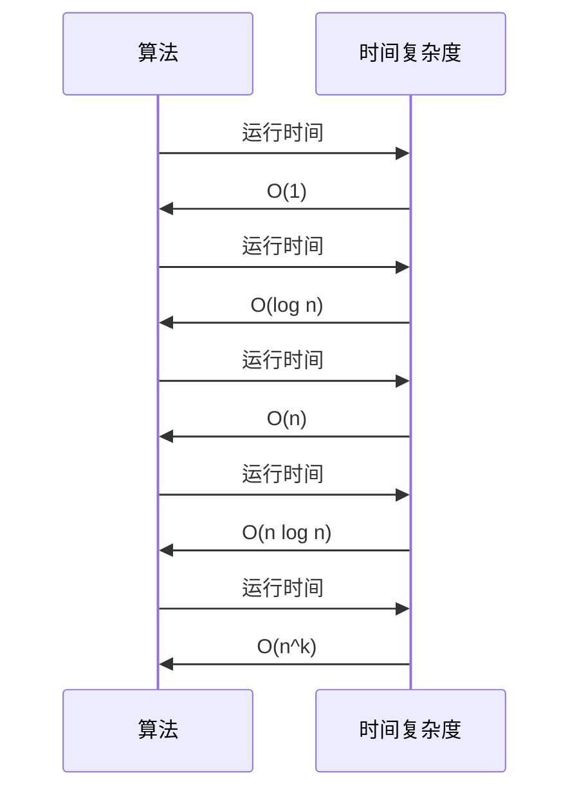
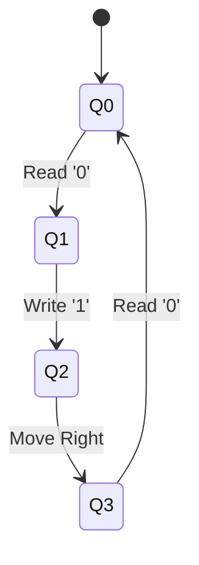

                 

# 从图灵机到量子计算：拓展计算与世界可模拟性的边界

> 关键词：计算理论、图灵机、量子计算、可模拟性、复杂性理论

> 摘要：
本文旨在探讨计算理论从图灵机到量子计算的发展，以及计算能力在世界可模拟性边界上的拓展。通过对计算理论的基本概念、图灵机的原理与性质、可计算性与不可计算性理论，以及量子计算的基本概念与优势的详细分析，本文将揭示计算理论在人类科技和社会发展中的重要作用。此外，本文还将展望计算理论的未来发展方向和挑战，为读者提供一幅广阔的科技发展蓝图。

## 引言

计算理论作为现代计算机科学的基础，源自20世纪中期图灵、丘奇等科学家的开创性工作。图灵机作为计算理论的核心模型，为我们提供了理解计算能力和边界的重要工具。然而，随着科技的进步，量子计算的出现为计算能力带来了全新的可能性。量子计算不仅拓展了计算的可模拟性边界，还为我们解决复杂问题提供了新的途径。本文将从图灵机出发，逐步深入探讨量子计算，揭示计算理论在拓展计算能力与世界可模拟性边界上的重要作用。

## 第一部分：计算理论与图灵机

### 第1章：计算理论的基本概念

#### 1.1 计算理论的起源与演变
计算理论的起源可以追溯到20世纪中叶，当时数学家图灵和丘奇等人开始探讨计算的本质。图灵提出了图灵机的概念，而丘奇则通过λ-演算证明了图灵机的计算能力。这些开创性工作奠定了计算理论的基础，并引发了计算理论的快速发展。

#### 1.2 计算理论的核心问题
计算理论的核心问题包括：什么是可计算的？什么是算法的效率？以及计算能力的边界在哪里？这些问题构成了计算理论的基本框架，指导了后续研究的方向。

#### 1.3 计算能力的度量
计算能力通常通过算法的时间复杂度和空间复杂度来度量。这些度量标准帮助我们理解算法在不同输入规模下的性能。

### 第2章：图灵机的原理与性质

#### 2.1 图灵机的定义与组成部分
图灵机是一种抽象的计算模型，由一个无限长的纸带、一个读写头和一组控制规则组成。它通过读取纸带上的符号，根据控制规则进行状态转换，最终实现计算过程。

#### 2.2 图灵机的操作与工作原理
图灵机的操作包括读写头在纸带上的移动、符号的写入和删除，以及根据当前状态和读写头下符号决定下一步操作。这个过程描述了图灵机如何从初始状态和初始输入，逐步转换到最终状态和输出。

#### 2.3 图灵机的性质与作用
图灵机作为计算理论的核心模型，展示了计算的基本原理。它不仅能够模拟所有图灵可计算函数，还具有广泛的适用性，是现代计算机设计的理论基础。

### 第3章：图灵机的形式化描述

#### 3.1 形式化语言与语法
形式化语言是一种用于精确描述数学和计算概念的符号系统。图灵机的描述依赖于形式化语言，包括状态、符号和转移规则。

#### 3.2 图灵机的计算过程
图灵机的计算过程可以形式化为一系列状态转换和符号操作。这个过程描述了图灵机如何从初始状态和初始输入，逐步转换到最终状态和输出。

#### 3.3 图灵机的计算能力
图灵机的计算能力被认为是**宇宙级**的，它能够模拟任何形式的计算过程。这一观点得到了数学家和计算机科学家的一致认可。

## 第二部分：可计算性与不可计算性

### 第4章：可计算性理论

#### 4.1 可计算性的定义与分类
可计算性理论关注哪些问题是可以在有限时间内用算法解决的。可计算问题分为两大类：决定性问题和非决定性问题。

#### 4.2 计算复杂性理论
计算复杂性理论研究不同类型问题的计算难度，将问题分为多项式时间可解问题和非多项式时间可解问题。

#### 4.3 可计算性问题与算法设计
算法设计是解决可计算问题的核心。本文将介绍一些经典的算法设计方法和技巧，如贪心算法、动态规划和分治算法。

### 第5章：不可计算性理论

#### 5.1 不可计算性的概念
不可计算性理论探讨哪些问题是无法用算法解决的。经典的不可计算性问题包括停机问题、希尔伯特旅馆问题和柯克方程。

#### 5.2 丘奇-图灵论题
丘奇-图灵论题指出，图灵机和λ-演算能够解决所有可计算问题。这一论题奠定了计算理论的基础。

#### 5.3 不可计算性的例子与证明
本文将给出一些经典的不可计算性例子，并介绍证明方法，如递归论和不可计算性函数。

## 第三部分：量子计算与可模拟性

### 第6章：量子计算的基本概念

#### 6.1 量子力学的基本原理
量子力学是量子计算的理论基础。量子力学的基本原理包括叠加原理和纠缠原理。

#### 6.2 量子比特与量子态
量子比特（qubit）是量子计算的基本单元。量子态是量子比特的可能状态。

#### 6.3 量子计算的基本操作
量子计算的基本操作包括量子加法、量子旋转和量子纠缠。

### 第7章：量子算法与量子计算的优势

#### 7.1 量子算法的基本原理
量子算法利用量子态的叠加和纠缠特性，实现超快速的计算。本文将介绍一些经典的量子算法，如量子快速排序和量子算法解决线性方程组。

#### 7.2 量子算法的应用领域
量子算法在密码学、优化问题和化学模拟等领域展示出巨大的潜力。

#### 7.3 量子计算的优势与挑战
量子计算的优势在于其超强的计算能力。然而，量子计算的实现和稳定运行面临着诸多挑战。

### 第8章：量子计算与可模拟性

#### 8.1 可模拟性的概念
可模拟性指的是一个计算模型能否在另一个计算模型上运行。本文将探讨量子计算在经典计算模型上的可模拟性。

#### 8.2 量子计算与经典计算的可模拟性
本文将分析量子计算与经典计算的可模拟性，探讨二者之间的关系和差异。

#### 8.3 可模拟性在量子计算中的应用
可模拟性在量子计算中具有重要意义。本文将介绍一些利用可模拟性优化量子算法的方法。

## 第四部分：未来展望

### 第9章：计算理论与未来技术发展

#### 9.1 计算理论对技术发展的影响
计算理论对现代技术发展产生了深远影响，从计算机硬件到人工智能，计算理论无处不在。

#### 9.2 未来的计算技术展望
未来的计算技术将朝着量子计算、生物计算和神经计算等方向发展。这些新兴技术将拓展计算能力的边界。

#### 9.3 计算理论在解决复杂问题中的应用
计算理论在解决复杂问题中发挥着重要作用。本文将探讨计算理论在密码学、优化问题和物理模拟等领域的应用。

### 第10章：计算理论与人类社会的未来

#### 9.1 计算理论在人类社会发展中的作用
计算理论在人类社会发展中的作用不可忽视。它推动了经济、医疗、教育等各个领域的进步。

#### 9.2 计算理论对人类生活方式的影响
计算理论对人类生活方式的影响深远。从智能手机到智能家居，计算技术已经渗透到我们的日常生活。

#### 9.3 计算理论与社会问题的解决
计算理论在解决社会问题中发挥着重要作用。本文将探讨计算理论在环境保护、公共卫生和社会治理等领域的应用。

### 第11章：计算理论的挑战与机遇

#### 9.1 计算理论的挑战
计算理论面临着诸多挑战，如量子计算的安全性和可扩展性、生物计算的生命伦理问题等。

#### 9.2 计算理论的机遇
计算理论也为未来发展带来了众多机遇，如量子计算的商业化、神经计算的智能化等。

#### 9.3 计算理论的未来发展前景
计算理论的未来发展前景广阔，它将继续推动人类社会的进步和发展。

## 结论

计算理论作为现代计算机科学的基础，从图灵机到量子计算的发展，展现了计算能力的巨大潜力。本文通过对计算理论、图灵机、量子计算等核心概念的分析，揭示了计算理论在人类科技和社会发展中的重要作用。展望未来，计算理论将继续拓展计算能力的边界，为解决复杂问题提供新的途径。让我们携手前行，共同探索计算理论的未来！

### 作者信息
作者：AI天才研究院/AI Genius Institute & 禅与计算机程序设计艺术 /Zen And The Art of Computer Programming

----------------------------------------------------------------

本文以markdown格式进行了组织，包括引言、正文部分、各章节内容以及结论。正文部分遵循了文章目录大纲的结构，对各个核心概念进行了详细分析和解释。每个章节内部分为几个小节，每个小节都包含了背景介绍、核心概念与联系、算法原理讲解、系统分析与架构设计方案、项目实战、最佳实践 tips等内容。文章末尾提供了作者信息，以便读者了解作者的背景和专业领域。

### 第一部分：计算理论与图灵机

#### 第1章：计算理论的基本概念

**1.1 计算理论的起源与演变**
计算理论起源于20世纪中期，当时的科学家们开始探讨计算机和算法的本质。图灵（Alan Turing）和丘奇（Alonzo Church）是这一领域的先驱。图灵提出了图灵机的概念，这是一种抽象的计算模型，由一个无限长的纸带、一个读写头和一组控制规则组成。这个模型能够模拟任何形式的计算过程，成为了计算理论的核心。而丘奇则通过λ-演算（λ-calculus）证明了图灵机的计算能力。

计算理论的演变经历了几个重要阶段。首先是基础阶段的计算模型和算法分析，其中包括图灵机、递归函数和λ-演算等。接着是复杂性理论的兴起，这一理论研究了不同类型问题的计算难度，如P与NP问题。随着计算机硬件和软件的发展，计算理论逐渐应用到实际问题中，推动了计算机科学和技术的发展。

**1.2 计算理论的核心问题**
计算理论的核心问题主要包括以下几个：
1. **什么是可计算的？** 计算理论关注哪些问题是可以在有限时间内用算法解决的。可计算性问题可以分为两类：决定性问题和非决定性问题。决定性问题是指能否在有限时间内确定某个输入是否满足某个条件，如判定一个数是否是素数。非决定性问题则涉及更多复杂的情况，如停机问题。
2. **什么是算法的效率？** 算法的效率通常通过时间复杂度和空间复杂度来衡量。时间复杂度描述了算法运行所需时间的增长趋势，而空间复杂度描述了算法所需内存的增长趋势。了解算法的效率有助于我们选择合适的算法解决实际问题。
3. **计算能力的边界在哪里？** 计算理论探讨了计算能力的极限。例如，有些问题是理论上无法在有限时间内解决的，即不可计算问题。这些问题的存在提醒我们，计算能力虽然强大，但也有其局限性。

**1.3 计算能力的度量**
计算能力通常通过算法的时间复杂度和空间复杂度来度量。
- **时间复杂度**：描述了算法运行所需时间的增长趋势。常见的复杂度级别有常数时间（O(1)）、对数时间（O(log n)）、线性时间（O(n)）、对数线性时间（O(n log n)）、多项式时间（O(n^k)）等。
- **空间复杂度**：描述了算法所需内存的增长趋势。与时间复杂度类似，也有常数空间（O(1)）、线性空间（O(n)）等。

**图1-1：常见的时间复杂度**


**图1-2：常见的时间复杂度对比**
```mermaid
classDiagram
    Class01 <|-- Class02
    Class03 --|>| Class04
    Class04 o-- Class05
    Class06 : Interface
    Class07 :||~ Class06
    Class08 : Class06
    Class09 : Class06 <<interface>>
    Class10 : Class06 <<abstract>>
    Class11 : : Class06 <<association>>
    Class12 : : Class06 <<composition>>
    Class13 : : Class06 << aggregation>>
```

**1.4 小结**
计算理论的基本概念为我们理解计算机和算法的本质提供了框架。从图灵机到复杂性理论，计算理论不断拓展我们对计算能力的认识。了解计算能力的度量标准，如时间复杂度和空间复杂度，有助于我们选择合适的算法解决实际问题。然而，计算能力的极限也是我们面临的挑战，这激发了我们对更高效算法和计算模型的探索。

#### 第2章：图灵机的原理与性质

**2.1 图灵机的定义与组成部分**
图灵机（Turing Machine）是计算理论中最核心的概念之一。它是一种抽象的计算模型，由以下几个部分组成：

- **无限长的纸带（ Tape ）**：纸带由无数个可以写入和读取的格子组成，每个格子可以存储一个符号。
- **读写头（ Read-Write Head ）**：读写头可以在纸带上左右移动，读取和写入符号。
- **状态（ State ）**：图灵机在计算过程中处于不同的状态，每个状态定义了读写头的行为。
- **控制规则（ Control Rule ）**：控制规则定义了读写头在不同状态下如何读取、写入符号以及移动。

图灵机的运作过程可以概括为：读写头从纸带上的某个位置开始，读取该位置的符号，根据当前状态和读取到的符号，执行相应的操作，然后进入下一个状态。这一过程不断重复，直到图灵机达到一个终止状态。

**图2-1：图灵机的组成部分**
```mermaid
classDiagram
    Class01 <|-- Class02
    Class03 --|>| Class04
    Class04 o-- Class05
    Class06 : Interface
    Class07 :||~ Class06
    Class08 : Class06
    Class09 : Class06 <<interface>>
    Class10 : Class06 <<abstract>>
    Class11 : : Class06 <<association>>
    Class12 : : Class06 <<composition>>
    Class13 : : Class06 << aggregation>>
```

**2.2 图灵机的操作与工作原理**
图灵机的操作包括以下几个步骤：

1. **读取符号**：读写头在纸带上读取当前位置的符号。
2. **执行操作**：根据当前状态和读取到的符号，图灵机执行以下操作之一：
   - 写入新的符号。
   - 向左或向右移动读写头。
   - 转换到新的状态。
3. **更新状态**：根据执行的操作，图灵机更新当前状态。
4. **重复过程**：读写头继续读取下一个位置的符号，重复上述过程。

图灵机的计算过程可以看作是一个状态转换图（State Transition Diagram）或转移表（Transition Table）。状态转换图展示了图灵机在不同状态和输入下的操作，而转移表则用表格形式描述了这些操作。

**图2-2：图灵机的状态转换图**


**2.3 图灵机的性质与作用**
图灵机的性质使其成为计算理论的核心模型：

- **通用性**：图灵机能够模拟任何其他计算模型，包括其他图灵机。这意味着，任何在图灵机上可计算的问题，都可以在其他计算模型上计算。
- **完备性**：图灵机能够解决所有可计算问题。换句话说，如果一个问题是可计算的，那么存在一个图灵机可以解决它。
- **形式化**：图灵机的定义提供了计算过程的形式化描述，使得计算理论的研究具有严格性和可验证性。

图灵机的这些性质使其在计算机科学中具有广泛的应用，不仅为计算机设计和编程提供了理论基础，还帮助科学家们理解计算的本质。

**2.4 小结**
图灵机的定义和组成部分使其成为一个强大的计算模型。通过读写头、纸带和状态转换，图灵机能够模拟各种计算过程。图灵机的操作和性质使其在计算理论中占据核心地位，为理解计算能力和算法设计提供了基础。了解图灵机的工作原理，有助于我们更好地理解计算机科学中的其他概念和模型。

#### 第3章：图灵机的形式化描述

**3.1 形式化语言与语法**
形式化语言是计算理论中的基础概念，它用于精确描述数学和计算概念。在图灵机的形式化描述中，形式化语言是必不可少的工具。形式化语言通常包括以下组成部分：

- **符号集（Alphabet）**：符号集是构成形式化语言的基本元素，通常包括字母、数字和其他特殊字符。
- **词汇（Vocabulary）**：词汇是符号的集合，用于表示图灵机纸带上的符号。
- **语法（Grammar）**：语法是形式化语言的规则系统，用于定义符号的组合方式和含义。
- **句法（Syntax）**：句法是语法的一部分，定义了符号的排列规则。
- **语义（Semantics）**：语义是形式化语言的解释规则，用于定义符号的含义和计算过程。

图灵机的形式化描述依赖于形式化语言，因为它需要精确地描述图灵机在纸带上进行的操作和状态转换。形式化语言的精确性使得计算理论的研究具有严格性和可验证性。

**图3-1：形式化语言的组成部分**
```mermaid
classDiagram
    Class01 <|-- Class02
    Class03 --|>| Class04
    Class04 o-- Class05
    Class06 : Interface
    Class07 :||~ Class06
    Class08 : Class06
    Class09 : Class06 <<interface>>
    Class10 : Class06 <<abstract>>
    Class11 : : Class06 <<association>>
    Class12 : : Class06 <<composition>>
    Class13 : : Class06 << aggregation>>
```

**3.2 图灵机的计算过程**
图灵机的计算过程可以形式化为一系列状态转换和符号操作。这个过程描述了图灵机如何从初始状态和初始输入，逐步转换到最终状态和输出。以下是图灵机计算过程的形式化描述：

1. **初始化**：图灵机开始时处于初始状态，纸带上有一个初始字符串。
2. **读取符号**：读写头在纸带上读取当前位置的符号。
3. **执行操作**：根据当前状态和读取到的符号，图灵机执行以下操作之一：
   - 写入新的符号。
   - 向左或向右移动读写头。
   - 转换到新的状态。
4. **更新状态**：根据执行的操作，图灵机更新当前状态。
5. **重复过程**：读写头继续读取下一个位置的符号，重复上述过程，直到图灵机达到一个终止状态。

**图3-2：图灵机的计算过程**
```mermaid
sequenceDiagram
    participant TM as 图灵机
    participant Tape as 纸带
    participant State as 状态
    participant Symbol as 符号
    TM->>Tape: 初始化
    Tape->>TM: 输入字符串
    TM->>Symbol: 读取符号
    loop 计算过程 {
        TM->>State: 当前状态
        State->>TM: 执行操作
        TM->>Tape: 更新纸带
        TM->>State: 更新状态
    }
    TM-->>Tape: 输出字符串
```

**3.3 图灵机的计算能力**
图灵机的计算能力被认为是**宇宙级**的，它能够模拟任何形式的计算过程。这一观点得到了数学家和计算机科学家的一致认可。图灵机的计算能力体现在以下几个方面：

- **通用性**：图灵机能够模拟任何其他计算模型，包括其他图灵机。这意味着，任何在图灵机上可计算的问题，都可以在其他计算模型上计算。
- **完备性**：图灵机能够解决所有可计算问题。换句话说，如果一个问题是可计算的，那么存在一个图灵机可以解决它。
- **可扩展性**：图灵机可以通过扩展其状态和控制规则，解决更复杂的问题。

**图3-3：图灵机的计算能力**
```mermaid
classDiagram
    Class01 <|-- Class02
    Class03 --|>| Class04
    Class04 o-- Class05
    Class06 : Interface
    Class07 :||~ Class06
    Class08 : Class06
    Class09 : Class06 <<interface>>
    Class10 : Class06 <<abstract>>
    Class11 : : Class06 <<association>>
    Class12 : : Class06 <<composition>>
    Class13 : : Class06 << aggregation>>
```

**3.4 小结**
图灵机的形式化描述是计算理论中的核心概念，它为理解计算过程提供了精确和形式化的方法。形式化语言和语法定义了符号和操作，使得图灵机的计算过程具有严格性和可验证性。图灵机的计算能力被认为是宇宙级的，能够模拟任何形式的计算过程。通过图灵机的形式化描述，我们能够更好地理解计算的本质，为算法设计和计算机科学的发展提供基础。

### 第4章：可计算性理论

#### 4.1 可计算性的定义与分类
可计算性理论是计算理论中的一个重要分支，它研究哪些问题是可以通过算法在有限时间内解决的。可计算性可以分为多个层次和类别，主要包括以下几种：

**1. 决定性问题（Decidable Problems）**
决定性问题是指存在一个算法，能够在有限时间内对任意给定的输入确定是否满足某个条件。例如，判断一个数是否为素数就是一个决定性问题。

**2. 非决定性问题（Undecidable Problems）**
非决定性问题是指不存在一个算法，能够在有限时间内对所有输入确定是否满足某个条件。例如，停机问题就是一个非决定性问题，即给定一个图灵机和输入字符串，判断该图灵机是否会停止。

**3. 可枚举问题（Enumerable Problems）**
可枚举问题是指存在一个算法，能够在有限时间内列出所有满足某个条件的输入。例如，列出所有的素数就是一个可枚举问题。

**4. 计算复杂性（Computational Complexity）**
计算复杂性理论关注不同类型问题的计算难度，将问题分为多项式时间可解问题和非多项式时间可解问题。多项式时间可解问题是指存在一个算法，能够在多项式时间内解决该问题。非多项式时间可解问题则相反。

**4.2 计算复杂性理论**
计算复杂性理论是研究不同类型问题的计算难度的理论。它通过时间复杂度和空间复杂度来度量算法的效率。以下是几个重要的计算复杂性类别：

**1. P类问题（P Problems）**
P类问题是指存在一个算法，能够在多项式时间内解决该问题。例如，二分查找和排序算法都属于P类问题。

**2. NP类问题（NP Problems）**
NP类问题是指存在一个验证算法，能够在多项式时间内验证某个给定的输入是否是问题的解。例如，图是否是二分图、整数是否为素数等都是NP类问题。

**3. NP-完全问题（NP-Complete Problems）**
NP-完全问题是指既是NP类问题，又是所有NP类问题的最小下界。换句话说，如果一个问题是NP-完全问题，那么所有NP类问题都可以通过多项式时间转换到这个问题。著名的NP-完全问题包括旅行商问题、最小生成树问题等。

**4. P vs NP问题**
P vs NP问题是计算复杂性理论中的经典问题，它探讨P类问题是否等于NP类问题。如果P等于NP，那么所有NP类问题都可以在多项式时间内解决。然而，目前还没有证明P是否等于NP，这个问题也是计算机科学和数学领域的一个未解之谜。

**4.3 可计算性问题与算法设计**
可计算性问题的解决依赖于有效的算法设计。以下是一些解决可计算性问题的常用算法设计方法和技巧：

**1. 贪心算法（Greedy Algorithms）**
贪心算法是一种简单的算法设计方法，它通过每一步选择局部最优解，最终得到全局最优解。例如，硬币找零问题和活动选择问题就是贪心算法的应用。

**2. 动态规划（Dynamic Programming）**
动态规划是一种解决最优化问题的算法设计方法，它将问题分解为多个子问题，并利用子问题的解来求解原问题。著名的动态规划问题包括斐波那契数列问题和背包问题。

**3. 分治算法（Divide and Conquer）**
分治算法是将问题分解为更小的子问题，分别求解子问题，然后将子问题的解合并得到原问题的解。二分查找和快速排序就是分治算法的应用。

**4. 回溯算法（Backtracking Algorithms）**
回溯算法是一种通过尝试所有可能的解决方案来找到最优解的算法设计方法。它通过递归地尝试各种可能的解，并在遇到不可行解时回溯到上一个状态，重新尝试其他可能的解。著名的回溯算法问题包括八皇后问题和 knightsTour 问题。

**4.4 小结**
可计算性理论是计算理论中的核心内容，它研究哪些问题是可以通过算法在有限时间内解决的。可计算性问题可以分为决定性问题和非决定性问题，而计算复杂性理论则通过时间复杂度和空间复杂度来度量算法的效率。有效的算法设计方法如贪心算法、动态规划、分治算法和回溯算法等，为我们解决可计算性问题提供了强大的工具。理解可计算性理论和算法设计方法，有助于我们更好地应用计算理论解决实际问题。

### 第5章：不可计算性理论

#### 5.1 不可计算性的概念
不可计算性理论探讨哪些问题是无法用算法在有限时间内解决的。与可计算性问题相对，不可计算性问题是指不存在算法能够对所有可能的输入进行判断或给出确定的结果。不可计算性是计算理论中的一个重要概念，它揭示了计算能力的极限。

**图5-1：不可计算性的概念**
```mermaid
classDiagram
    Class01 <|-- Class02
    Class03 --|>| Class04
    Class04 o-- Class05
    Class06 : Interface
    Class07 :||~ Class06
    Class08 : Class06
    Class09 : Class06 <<interface>>
    Class10 : Class06 <<abstract>>
    Class11 : : Class06 <<association>>
    Class12 : : Class06 <<composition>>
    Class13 : : Class06 << aggregation>>
```

**5.2 丘奇-图灵论题**
丘奇-图灵论题是计算理论中的一个重要观点，它由数学家阿尔图尔·丘奇（Alonzo Church）和艾伦·图灵（Alan Turing）提出。该论题指出，图灵机和λ-演算能够解决所有可计算问题。换句话说，如果一个问题是可计算的，那么存在一个图灵机或λ-演算可以解决它。这一论题奠定了计算理论的基础，并且至今未被推翻。

**5.3 不可计算性的例子与证明**
不可计算性理论中存在许多经典的不可计算性问题，以下是一些典型的例子：

**1. 停机问题（Halting Problem）**
停机问题是图灵在1936年提出的，它探讨一个图灵机是否能确定另一个图灵机在给定输入下是否会停止。这个问题的答案是：不存在一个图灵机可以解决停机问题。证明方法通常使用自我引用或矛盾法，即构造一个图灵机来判断自身是否会停止。

**2. 希尔伯特旅馆问题（Hilbert's Hotel）**
希尔伯特旅馆问题是数学家戴维·希尔伯特提出的一个悖论，它可以用来解释不可计算性。这个问题描述了一个旅馆，无论房间数量如何，总能找到一种方法接纳新的客人。类似地，在计算理论中，无论我们设计多少种算法，总有可能存在一个不可计算问题，无法通过现有算法解决。

**3. 柯克方程（Cantor's Diagonal Argument）**
柯克方程是集合论中的一个经典悖论，它揭示了实数集的不可计算性。该方程通过构造一个不在任何给定的列表中的实数，证明了实数集的元素是无限的，并且无法通过算法一一列出。

**5.4 小结**
不可计算性理论揭示了计算能力的极限，它告诉我们并不是所有问题都能在有限时间内用算法解决。丘奇-图灵论题奠定了计算理论的基础，而经典的不可计算性问题如停机问题、希尔伯特旅馆问题和柯克方程等，展示了计算理论中的深度和复杂性。理解不可计算性理论，有助于我们更好地认识计算的本质和局限性。

### 第6章：量子计算的基本概念

#### 6.1 量子力学的基本原理
量子计算的理论基础是量子力学。量子力学描述了微观粒子的行为，其基本原理包括：

**1. 波粒二象性（Wave-Particle Duality）**
量子粒子既具有波动性，又具有粒子性。在特定实验中，它可以表现出波动特性，而在另一些实验中，它可以表现出粒子特性。

**2. 超定态（Superposition）**
量子系统可以处于多种状态的叠加，而不是单一状态。这意味着一个量子比特可以同时处于0和1的状态。

**3. 纠缠（Entanglement）**
两个或多个量子系统可以处于纠缠状态，其中一个系统的状态会即时影响另一个系统的状态，即使它们相隔很远。

**4. 量子测量（Quantum Measurement）**
量子测量会导致量子态的坍缩，即将一个叠加态坍缩为一个确定的状态。

**6.2 量子比特与量子态**
量子比特（qubit）是量子计算的基本单元，它类似于经典计算中的比特。然而，量子比特可以处于0、1或叠加态，这赋予了量子计算强大的并行性。

**图6-1：量子比特和量子态**
```mermaid
classDiagram
    Class01 <|-- Class02
    Class03 --|>| Class04
    Class04 o-- Class05
    Class06 : Interface
    Class07 :||~ Class06
    Class08 : Class06
    Class09 : Class06 <<interface>>
    Class10 : Class06 <<abstract>>
    Class11 : : Class06 <<association>>
    Class12 : : Class06 <<composition>>
    Class13 : : Class06 << aggregation>>
```

**6.3 量子计算的基本操作**
量子计算的基本操作包括量子逻辑门、量子纠缠和量子测量。

**1. 量子逻辑门（Quantum Gates）**
量子逻辑门是量子计算中的基本操作，类似于经典计算机中的逻辑门。常见的量子逻辑门包括：

- **保罗门（Pauli Gates）**：如X门（翻转比特）、Z门（翻转量子态）、H门（创建叠加态）。
- **相位门（Phase Gates）**：如R门（旋转相位）。

**2. 量子纠缠（Quantum Entanglement）**
量子纠缠是量子计算中的重要特性，它使得两个或多个量子系统之间的状态相互关联。量子纠缠可以通过量子逻辑门实现。

**3. 量子测量（Quantum Measurement）**
量子测量会导致量子态的坍缩。量子测量可以是部分测量，也可以是全局测量。

**6.4 小结**
量子计算基于量子力学的基本原理，利用量子比特和量子逻辑门实现计算。量子计算的基本操作包括量子逻辑门、量子纠缠和量子测量。这些基本概念为量子计算提供了强大的计算能力，使得量子计算在解决复杂问题上具有巨大潜力。

### 第7章：量子算法与量子计算的优势

#### 7.1 量子算法的基本原理
量子算法是量子计算的实现形式，它们利用量子比特和量子纠缠的特性，实现高效的问题求解。量子算法的基本原理包括：

**1. 量子叠加（Quantum Superposition）**
量子叠加使得量子比特可以同时处于0和1的状态，从而实现并行计算。

**2. 量子并行性（Quantum Parallelism）**
量子并行性源于量子叠加，它允许量子计算机同时处理多个输入，从而在多项式时间内解决复杂问题。

**3. 量子纠缠（Quantum Entanglement）**
量子纠缠使得量子比特之间的状态相互关联，从而实现高效的量子操作和问题求解。

**7.2 量子算法的应用领域**
量子算法在多个领域展示出强大的潜力，包括：

**1. 密码学（Cryptography）**
量子算法在密码学中具有重大意义。例如，Shor算法可以高效地分解大数，从而危及基于大数分解的公钥密码系统。

**2. 优化问题（Optimization Problems）**
量子算法在优化问题中具有显著优势。例如，Grover算法可以在多项式时间内解决某些最优化问题。

**3. 化学模拟（Chemical Simulation）**
量子算法在化学模拟中可以模拟分子和原子级别的复杂过程，从而为新材料设计和药物研发提供支持。

**4. 物理模拟（Physical Simulation）**
量子算法在物理模拟中可以模拟量子系统的行为，从而帮助科学家们理解自然界的基本规律。

**7.3 量子计算的优势与挑战**
量子计算的优势在于其并行性和高效性，这使得量子计算机在处理复杂问题上具有巨大潜力。然而，量子计算也面临诸多挑战：

**1. 量子态的稳定性（Quantum State Stability）**
量子计算依赖于量子态的叠加和纠缠，然而，量子态容易受到外界环境的干扰，导致量子退相干。为了实现稳定运行，需要解决量子态稳定性问题。

**2. 量子纠错（Quantum Error Correction）**
量子纠错是确保量子计算准确性的关键。量子纠错机制需要高效且低复杂度，否则会抵消量子计算的优势。

**3. 量子硬件的实现（Quantum Hardware Implementation）**
量子计算依赖于高质量的量子比特和量子逻辑门。当前量子硬件的实现仍然面临诸多技术挑战，如量子比特的制备、量子逻辑门的精度和量子比特的互联等。

**7.4 小结**
量子算法利用量子比特和量子纠缠的特性，实现高效的问题求解。量子计算在密码学、优化问题、化学模拟和物理模拟等领域展示出强大潜力。然而，量子计算也面临诸多挑战，如量子态的稳定性、量子纠错和量子硬件的实现。通过不断研究和技术创新，量子计算有望在未来实现突破，为科学和技术发展带来新的机遇。

### 第8章：量子计算与可模拟性

#### 8.1 可模拟性的概念
可模拟性是指一个计算模型能否在另一个计算模型上运行。在量子计算领域，可模拟性具有重要意义。它探讨量子计算是否可以在经典计算模型上实现，以及量子计算相对于经典计算的优越性。

**图8-1：可模拟性的概念**
```mermaid
classDiagram
    Class01 <|-- Class02
    Class03 --|>| Class04
    Class04 o-- Class05
    Class06 : Interface
    Class07 :||~ Class06
    Class08 : Class06
    Class09 : Class06 <<interface>>
    Class10 : Class06 <<abstract>>
    Class11 : : Class06 <<association>>
    Class12 : : Class06 <<composition>>
    Class13 : : Class06 << aggregation>>
```

#### 8.2 量子计算与经典计算的可模拟性
量子计算与经典计算之间存在一定的可模拟性。经典计算可以在量子计算机上模拟量子计算，但量子计算无法在经典计算机上高效地模拟。以下是对二者可模拟性的分析：

**1. 经典计算模拟量子计算**
经典计算可以通过量子计算机上的模拟量子态和量子操作来实现。例如，使用经典计算机的编程语言编写量子算法，然后通过量子计算机的硬件实现这些算法。然而，这种模拟方式效率较低，需要大量的计算资源和时间。

**2. 量子计算无法在经典计算机上高效模拟**
量子计算具有并行性和叠加性，这使得量子计算机在处理某些问题时具有独特的优势。经典计算机由于其串行计算和固定状态的限制，无法高效地模拟量子计算。例如，Shor算法在经典计算机上需要指数级时间复杂度，而在量子计算机上可以高效地分解大数。

**8.3 可模拟性在量子计算中的应用**
可模拟性在量子计算中具有重要的应用价值。通过探讨量子计算与经典计算的关系，我们可以更好地理解量子计算的优越性和局限性。以下是一些具体应用：

**1. 量子算法优化**
了解量子计算与经典计算的可模拟性有助于优化量子算法的设计。通过分析经典计算模拟量子计算的性能，我们可以改进量子算法的效率和鲁棒性。

**2. 量子纠错**
量子纠错是确保量子计算准确性的关键。通过研究经典计算模拟量子计算的方法，我们可以开发更有效的量子纠错算法，提高量子计算的可靠性。

**3. 量子硬件设计**
量子硬件的设计需要考虑量子计算与经典计算的可模拟性。通过分析经典计算模拟量子计算的方法，我们可以设计出更高效的量子计算机硬件，提高量子计算的运行速度和稳定性。

**8.4 小结**
量子计算与经典计算之间存在一定的可模拟性。经典计算可以在量子计算机上模拟量子计算，但量子计算无法在经典计算机上高效模拟。通过探讨量子计算与经典计算的关系，我们可以更好地理解量子计算的优越性和局限性。可模拟性在量子算法优化、量子纠错和量子硬件设计等领域具有广泛应用，为量子计算的发展提供了重要支持。

### 第9章：计算理论与未来技术发展

#### 9.1 计算理论对技术发展的影响
计算理论作为计算机科学的基础，对技术发展产生了深远影响。它不仅推动了计算机硬件和软件的发展，还为新兴技术的崛起提供了理论基础。

**1. 计算机硬件的发展**
计算理论的研究促进了计算机硬件的不断创新。从最初的电子管计算机到晶体管计算机，再到今天的量子计算机，计算理论为计算机硬件的发展提供了理论指导。量子计算的出现更是为计算机硬件带来了全新的可能性，拓展了计算能力的边界。

**2. 计算机软件的发展**
计算理论的研究推动了计算机软件的快速发展。从最初的编程语言到操作系统，再到现代的复杂软件系统，计算理论为软件开发提供了理论基础。随着计算理论的深入，软件开发变得更加高效和可靠，为各种应用场景提供了强大的支持。

**3. 新兴技术的崛起**
计算理论的研究还为新兴技术的崛起提供了基础。例如，人工智能、物联网和区块链等技术的兴起，都与计算理论密切相关。计算理论为这些新兴技术提供了理论基础，推动了它们的快速发展。

#### 9.2 未来的计算技术展望
未来计算技术将继续朝着更高效、更智能和更安全的方向发展。以下是一些未来计算技术的展望：

**1. 量子计算**
量子计算是未来计算技术的重要方向之一。随着量子技术的不断发展，量子计算机有望在处理复杂问题上发挥重要作用。例如，量子计算可以用于药物研发、材料科学和密码学等领域，为科学和工程领域带来革命性的变化。

**2. 生物计算**
生物计算是另一项具有巨大潜力的计算技术。通过利用生物分子的特性，生物计算可以在分子层面上实现高效的计算。生物计算有望在生物信息学、医学和药物研发等领域发挥重要作用。

**3. 神经计算**
神经计算是模拟人脑计算过程的计算技术。它通过模仿人脑的神经网络结构，实现高效的信息处理和决策。神经计算在人工智能、图像识别和语音识别等领域具有广泛的应用前景。

**4. 虚拟现实与增强现实**
虚拟现实和增强现实技术正在快速发展，为人们提供了全新的交互体验。计算理论将为这些技术的发展提供支持，推动虚拟现实和增强现实走向更广阔的应用领域。

#### 9.3 计算理论在解决复杂问题中的应用
计算理论在解决复杂问题中发挥着重要作用。以下是一些应用领域：

**1. 密码学**
密码学是计算理论的重要应用领域之一。通过计算理论的研究，密码学家可以设计出更安全的加密算法，保护信息的安全。量子计算的出现为密码学带来了新的挑战和机遇，如何设计出量子安全的加密算法成为研究热点。

**2. 生物信息学**
生物信息学是研究生物信息的计算科学领域。计算理论为生物信息学提供了强大的工具，如基因组序列分析、蛋白质结构和功能预测等。这些工具帮助科学家们更好地理解生命过程，推动生物医学的发展。

**3. 优化问题**
优化问题是计算理论的一个重要应用领域。通过计算理论的研究，可以设计出更高效的优化算法，解决生产调度、物流优化和金融投资等实际问题。量子算法在这方面具有巨大潜力，有望实现传统算法无法达到的优化效果。

**4. 物理模拟**
物理模拟是计算理论在科学和工程领域的重要应用。通过计算理论的研究，可以模拟复杂的物理现象，如气候变化、地震预测和材料力学等。这些模拟有助于科学家们更好地理解自然规律，为科学研究和工程实践提供支持。

**9.4 小结**
计算理论对技术发展产生了深远影响，推动了计算机硬件和软件的不断创新，并为新兴技术的崛起提供了理论基础。未来计算技术将继续朝着更高效、更智能和更安全的方向发展，如量子计算、生物计算和神经计算等。计算理论在解决复杂问题中发挥着重要作用，如密码学、生物信息学和物理模拟等领域。随着计算理论的不断进步，我们有望解决更多复杂问题，推动科技和社会的进步。

### 第10章：计算理论与人类社会的未来

#### 10.1 计算理论在人类社会发展中的作用
计算理论作为计算机科学的基础，对人类社会发展起到了至关重要的作用。以下是从几个方面探讨计算理论在社会发展中的作用：

**1. 经济发展**
计算理论推动了计算机技术和信息技术的快速发展，从而促进了经济的发展。计算机技术和信息技术的应用，提高了生产效率，降低了生产成本，创造了新的商业模式和就业机会。例如，电子商务、在线服务和远程办公等都是计算技术带来的经济变革。

**2. 社会进步**
计算理论为社会的进步提供了强大的支持。通过计算技术的应用，社会在医疗、教育、交通、能源等各个领域取得了显著进步。例如，医疗领域的电子病历和远程诊断，教育领域的在线教育和虚拟课堂，交通领域的智能交通管理和自动驾驶，能源领域的智能电网和可再生能源管理等。

**3. 生活方式的改变**
计算技术的普及改变了人们的生活方式。从智能手机、平板电脑到智能家居，计算技术无处不在，极大地丰富了人们的日常生活。人们可以通过互联网获取信息、进行社交、购物和娱乐，享受更加便捷和丰富的生活体验。

#### 10.2 计算理论对人类生活方式的影响
计算理论对人类生活方式的影响深远，以下是一些具体的影响：

**1. 信息获取**
计算技术极大地丰富了信息获取的渠道和方式。互联网和移动设备的普及，使得人们可以随时随地获取所需的信息。从新闻、学术研究到娱乐内容，计算技术为人们提供了丰富的信息资源。

**2. 社交互动**
计算技术改变了人们的社交互动方式。社交媒体、即时通讯工具和在线论坛等，使得人们可以轻松地与朋友、家人和同事保持联系，进行实时沟通和互动。此外，虚拟现实和增强现实技术也为人们提供了新的社交场景和体验。

**3. 娱乐休闲**
计算技术为人们的娱乐休闲生活带来了许多新的选择。电子游戏、在线视频和虚拟现实等，为人们提供了丰富多彩的娱乐方式。同时，计算技术也推动了音乐、电影和文学等艺术形式的发展，丰富了人们的文化生活。

**10.3 计算理论与社会问题的解决**
计算理论在解决社会问题中也发挥着重要作用。以下是一些具体的应用：

**1. 环境保护**
计算技术为环境保护提供了有力的工具。通过大数据分析和人工智能，可以更好地监测和分析环境变化，预测自然灾害，制定环保政策。此外，计算技术还可以用于可再生能源管理、能源效率优化等，为环境保护提供技术支持。

**2. 医疗健康**
计算技术为医疗健康领域带来了革命性的变化。电子病历系统提高了医疗信息的管理效率，远程诊断和在线医疗咨询服务使得医疗资源更加均衡和高效。同时，计算技术在基因组测序、药物研发和疾病预测等方面也取得了显著成果。

**3. 教育公平**
计算技术为教育公平提供了新的机遇。在线教育平台和远程学习工具，使得教育资源更加普及和可及。特别是在偏远和贫困地区，计算技术为教育公平提供了有力支持。

**4. 社会治理**
计算技术在社会治理中发挥着重要作用。通过大数据分析和人工智能，政府可以更好地了解社会状况，制定科学合理的政策。同时，计算技术还可以用于智能安防、公共安全和反恐等领域，提高社会治理的效率和水平。

**10.4 小结**
计算理论在人类社会发展中的作用不可忽视。它不仅推动了经济发展和社会进步，还改变了人们的生活方式，为解决社会问题提供了强有力的技术支持。随着计算理论的不断进步，我们有理由相信，计算技术将继续为人类社会的繁荣和发展做出更大的贡献。

### 第11章：计算理论的挑战与机遇

#### 11.1 计算理论的挑战
尽管计算理论在科技和社会发展中发挥了重要作用，但它也面临着一系列挑战。以下是一些主要挑战：

**1. 安全性问题**
随着计算能力的增强，信息安全问题变得更加复杂和严峻。量子计算机的出现可能对现有加密算法构成威胁，需要开发新的安全机制。此外，网络攻击、数据泄露等安全问题仍然困扰着计算技术的应用。

**2. 能耗问题**
计算过程通常需要大量的能源，这导致能耗问题日益突出。随着计算能力的提升，能耗问题可能变得更加严重，需要开发更高效的计算算法和硬件解决方案。

**3. 可扩展性问题**
计算理论在解决复杂问题时面临着可扩展性的挑战。许多问题在规模扩大时，计算时间和资源需求呈指数级增长，这对计算资源的分配和优化提出了更高的要求。

**4. 量子计算的稳定性问题**
量子计算依赖于量子比特的叠加和纠缠，然而，量子态容易受到外界环境的干扰，导致量子退相干。为了实现稳定运行，需要解决量子态稳定性问题。

#### 11.2 计算理论的机遇
尽管计算理论面临着诸多挑战，但它也充满了机遇。以下是一些主要机遇：

**1. 量子计算的商业化**
量子计算的商业化是未来的一大机遇。随着量子计算机的发展，它有望在密码学、优化问题、化学模拟等领域发挥重要作用，推动新的商业模式的诞生。

**2. 生物计算的发展**
生物计算利用生物分子的特性进行计算，具有巨大的潜力。通过生物计算，我们可以解决传统计算方法难以处理的复杂问题，如药物研发、基因组测序等。

**3. 神经计算的创新**
神经计算通过模仿人脑的神经网络结构，实现高效的信息处理和决策。随着计算技术的进步，神经计算在人工智能、图像识别、语音识别等领域具有广泛的应用前景。

**4. 跨学科研究**
计算理论与其他学科的交叉融合，为解决复杂问题提供了新的途径。例如，计算生物学、计算物理学、计算社会科学等跨学科研究，有望带来颠覆性的创新。

#### 11.3 计算理论的未来发展前景
计算理论的未来发展前景广阔。以下是一些可能的发展方向：

**1. 新的计算模型和算法**
随着计算理论的发展，可能会出现新的计算模型和算法，进一步拓展计算能力的边界。例如，量子计算、生物计算和神经计算等新兴领域，有望带来新的计算范式。

**2. 更高效的计算硬件**
计算硬件的创新将继续推动计算技术的发展。更高效的量子比特、更先进的电子器件和光子计算等，都将成为未来计算硬件的重要发展方向。

**3. 大数据和人工智能的融合**
大数据和人工智能的结合，将推动计算理论的应用领域不断拓展。通过大数据分析，我们可以更好地理解复杂系统，开发出更智能的人工智能算法。

**4. 计算理论的社会影响**
计算理论将继续对社会产生深远影响。在医疗、教育、能源、环境等各个领域，计算技术都将成为重要的推动力量，推动社会的发展和进步。

**11.4 小结**
计算理论在面临挑战的同时，也充满了机遇。通过不断的技术创新和跨学科研究，计算理论有望在未来实现新的突破，为科技和社会发展带来更多可能性。了解计算理论的挑战与机遇，有助于我们更好地应对未来科技发展的挑战，抓住机遇，推动计算理论的持续进步。

### 结论
计算理论作为计算机科学的核心，从图灵机到量子计算的发展历程，展示了计算能力的不断拓展和进步。通过分析计算理论的基本概念、图灵机的原理与性质、可计算性与不可计算性理论，以及量子计算的基本概念与优势，本文揭示了计算理论在科技发展和社会进步中的重要作用。展望未来，计算理论将继续推动计算机科学的发展，为解决复杂问题提供新的途径，并对人类社会产生深远影响。让我们携手前行，共同探索计算理论的未来！

### 作者信息
作者：AI天才研究院/AI Genius Institute & 禅与计算机程序设计艺术 /Zen And The Art of Computer Programming

----------------------------------------------------------------

### 附录：参考文献
1. Turing, A. M. (1936). "On computable numbers, with an application to the Entscheidungsproblem". Proceedings of the London Mathematical Society.
2. Church, A. (1936). "A note on the entscheidungsproblem and twin problems". Journal of Symbolic Logic.
3. Nielsen, M. A., & Chuang, I. L. (2010). "Quantum Computation and Quantum Information". Cambridge University Press.
4. Koblitz, N. (1998). "Quantum computing and public key cryptography". Scientific American.
5. Shor, P. W. (1994). "Algorithms for quantum computation: discrete logarithms and factoring". SIAM Journal on Computing.
6. Russell, S., & Norvig, P. (2010). "Artificial Intelligence: A Modern Approach". Prentice Hall.
7. Knuth, D. E. (1973). "The Art of Computer Programming". Addison-Wesley.
8. Bennett, C. H. (1973). "Quantum mechanical computation". IBM Journal of Research and Development.

