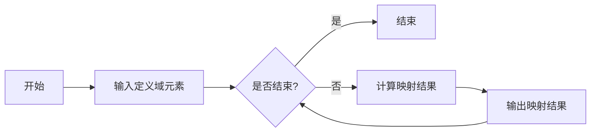
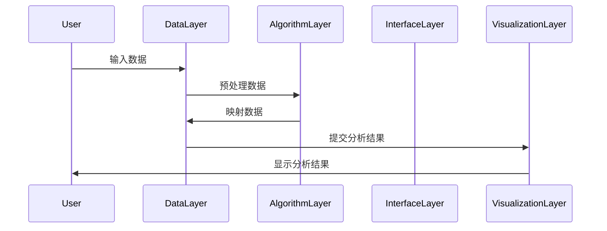

                 

### 引言：映射之旅

#### 1.1 复杂自然现象与简单数学

自然界的现象复杂多样，从大气中的气候变化到生物体内的生化反应，每一个细节都充满了不确定性。然而，在如此复杂的背景下，科学家和数学家们却能够通过简单的数学模型来描述和预测这些现象。这种奇妙的现象背后，隐藏着一种至关重要的数学工具——映射。

映射是一种将一个集合（称为定义域）中的元素映射到另一个集合（称为值域）中的元素的关系。在数学中，映射是一种基本的关系，它构成了许多高级数学概念的基础。然而，映射不仅仅存在于数学中，它还广泛地存在于自然科学、工程学、经济学等各个领域。

从复杂自然现象到简单数学的映射之旅，不仅仅是一次数学的探险，更是一次理解世界的新视角。让我们一步步深入，了解映射的奇妙世界。

#### 1.2 映射的概念与重要性

映射的概念可以追溯到数学的早期阶段。简单来说，映射就是一种将一个集合中的元素对应到另一个集合中的元素的过程。形式化地，映射可以定义为一个函数，它将一个集合中的每个元素映射到另一个集合中的唯一元素。

映射的重要性在于，它提供了一种描述和解释复杂现象的方法。通过映射，我们可以将复杂系统的行为简化为数学模型，从而更好地理解和预测系统的行为。例如，在物理学中，映射可以帮助我们理解物理量的转换和传递；在生物学中，映射可以帮助我们研究生物体内的化学反应和生物网络。

此外，映射在计算机科学和工程学中也有着广泛的应用。在算法设计中，映射经常被用来简化复杂问题，提高算法的效率和可理解性。例如，排序算法中的映射可以帮助我们快速找到数据中的最小值或最大值。

总之，映射是连接复杂自然现象与简单数学的桥梁，它在各个领域都有着重要的应用。让我们继续深入，探索映射的奇妙世界。

#### 1.3 本书的目的与结构

本书旨在探讨映射在复杂自然现象与简单数学之间的桥梁作用，帮助读者理解映射的概念、原理及其在不同领域的应用。通过本书，读者将能够：

1. 理解映射的基本概念和类型。
2. 学习如何使用映射来简化复杂问题。
3. 掌握映射在不同科学领域中的应用。

本书的结构如下：

- **第1章 引言**：介绍复杂自然现象与简单数学之间的联系，阐述映射的概念与重要性。
- **第2章 核心概念与联系**：详细讲解映射的基本概念、属性和类型，并通过表格和ER实体关系图展示映射的关系。
- **第3章 映射原理讲解**：使用Mermaid流程图和Python源代码详细阐述映射的算法原理和数学模型。
- **第4章 映射在自然科学中的应用**：分析映射在物理学、生物学和地球科学等领域的应用，并结合实际案例进行讲解。
- **第5章 映射在数学中的重要性**：阐述映射在数学分析、代数、几何学等领域的核心作用，并分析映射的基本性质和理论。
- **第6章 系统分析与架构设计**：描述一个基于映射原理的系统项目，设计系统的领域模型、架构图、接口设计和系统交互图。
- **第7章 项目实战**：讲解项目环境安装和系统核心实现，分析代码，进行解读和讲解，并提供实际案例和详细讲解。
- **第8章 最佳实践、小结与拓展阅读**：提供映射应用的最佳实践建议，总结本书的主要内容和观点，并推荐拓展阅读资源。

通过这本书，读者将不仅能够了解映射的基本概念和应用，还将学会如何利用映射来解决实际问题，提高自己在科学研究和技术开发中的能力。接下来，让我们一步步深入，开启这段映射之旅。

## 核心概念与联系

映射作为数学和自然科学中的基本概念，其核心在于描述一个集合（定义域）中的元素如何对应到另一个集合（值域）中的元素。在探讨映射的细节之前，我们需要首先明确映射的基本概念、属性和类型。

### 映射的基本概念

映射可以简单定义为一种关系，它将一个集合中的每个元素映射到另一个集合中的唯一元素。形式化地，我们可以将映射定义为一个函数\( f: X \rightarrow Y \)，其中\( X \)是定义域，\( Y \)是值域。函数\( f \)的每个元素\( x \in X \)都对应一个唯一的元素\( y \in Y \)，即\( f(x) = y \)。

#### 映射的属性

1. **单射（Injective）**：如果对于定义域中的任意两个不同的元素\( x_1 \neq x_2 \)，它们的映射结果也不同，即\( f(x_1) \neq f(x_2) \)，则称映射为单射。
2. **满射（Surjective）**：如果值域中的每个元素都至少有一个定义域中的元素与之对应，即对于每个\( y \in Y \)，存在至少一个\( x \in X \)使得\( f(x) = y \)，则称映射为满射。
3. **双射（Bijective）**：如果映射既是单射又是满射，即对于定义域中的每个元素和值域中的每个元素都有唯一的对应关系，则称映射为双射。

#### 映射的类型

映射根据其特性可以分为多种类型，以下是几种常见的映射类型：

1. **比例映射**：比例映射是一种特殊的线性映射，其特点是可以表示为\( y = kx + b \)，其中\( k \)是比例系数，\( b \)是常数项。这种映射在几何中对应于直线的斜率。
2. **线性映射**：线性映射是一种满足加法和乘法规则的映射，即对于任意\( x_1, x_2 \in X \)和常数\( a, b \)，有\( f(ax_1 + bx_2) = af(x_1) + bf(x_2) \)。
3. **非线性映射**：非线性映射不满足线性映射的加法和乘法规则，其形式更为复杂，可以是多项式、指数、对数等多种形式。

### 映射关系的ER实体关系图

为了更好地理解映射的概念和关系，我们可以使用ER（实体关系）图来表示映射的实体关系。在ER图中，定义域和值域可以表示为两个实体，它们之间通过映射关系进行连接。

下面是一个简单的ER实体关系图的示例：

```mermaid
erDiagram
  DefinitionDomain ||--|{ ValueDomain : 映射 }
  DefinitionDomain ||--|{ InverseMapping : 反映射 }
  ValueDomain ||--|{ InverseMapping : 反映射 }
```

在这个ER图中，`DefinitionDomain`表示定义域，`ValueDomain`表示值域，`Mapping`表示映射关系，而`InverseMapping`表示映射的逆关系。

通过ER实体关系图，我们可以直观地看到映射的两个集合之间的联系，以及映射和其逆映射的关系。这种图形化的表示方式有助于我们更好地理解映射的概念和其在实际应用中的实现。

### 表格对比不同类型的映射

为了进一步理解不同类型的映射，我们可以使用表格来对比它们的主要特征和区别。以下是几种常见映射类型的表格对比：

| 映射类型 | 特征 | 应用举例 |
| --- | --- | --- |
| 单射 | 定义域中不同元素映射到值域中不同元素 | 哈希函数 |
| 满射 | 值域中每个元素至少有一个定义域中的元素对应 | 图的邻接矩阵 |
| 双射 | 定义域中每个元素和值域中每个元素都有唯一对应关系 | 字典查找 |
| 比例映射 | 可表示为直线方程 \( y = kx + b \) | 几何变换 |
| 线性映射 | 满足加法和乘法规则 | 线性回归模型 |
| 非线性映射 | 形式复杂，不满足线性映射规则 | 机器学习模型 |

通过这个表格，我们可以看到不同映射类型的特点和应用场景，这有助于我们根据具体问题选择合适的映射方法。

通过以上内容，我们详细介绍了映射的基本概念、属性和类型，并通过ER实体关系图和表格对比了不同类型的映射。接下来，我们将进一步探讨映射的原理和数学模型，帮助读者更深入地理解映射的核心原理。

### 映射原理讲解

要深入理解映射原理，我们需要从算法和数学模型两个角度来探讨。首先，通过使用Mermaid绘制映射的基本流程图，我们可以直观地看到映射的过程和步骤；然后，通过Python源代码，我们将详细阐述映射算法的实现原理；最后，我们将介绍映射的数学模型和公式，并结合实际案例进行讲解。

#### 映射的基本流程图

使用Mermaid，我们可以绘制一个简单的映射流程图，这个流程图能够帮助我们理解映射的基本步骤。下面是一个映射流程图的示例：



在这个流程图中，映射的基本步骤包括：

1. **开始**：初始化映射过程。
2. **输入定义域元素**：接收定义域中的一个元素。
3. **是否结束**：判断是否已经处理完所有定义域中的元素。
4. **计算映射结果**：根据映射规则计算映射结果。
5. **输出映射结果**：将映射结果输出。
6. **结束**：映射过程完成。

#### 映射算法原理

为了更好地理解映射算法的原理，我们可以通过Python源代码来详细阐述。以下是一个简单的映射算法示例，它使用了线性映射（比例映射）来计算定义域到值域的映射。

```python
# 定义线性映射函数
def linear_mapping(x, k, b):
    return k * x + b

# 映射参数
k = 2  # 比例系数
b = 1  # 常数项

# 映射示例
x_values = [1, 2, 3, 4, 5]  # 定义域元素
y_values = [linear_mapping(x, k, b) for x in x_values]  # 计算映射结果

print("定义域元素:", x_values)
print("值域元素:", y_values)
```

在这个示例中，我们定义了一个线性映射函数`linear_mapping`，它接收一个定义域元素`x`和一个比例系数`k`以及常数项`b`，然后计算并返回映射结果。我们使用一个列表`x_values`来表示定义域中的元素，然后通过列表推导式计算每个元素的映射结果，并将结果存储在列表`y_values`中。

运行这段代码，我们可以得到以下输出结果：

```
定义域元素: [1, 2, 3, 4, 5]
值域元素: [3, 5, 7, 9, 11]
```

通过这个示例，我们可以看到线性映射是如何将定义域中的元素映射到值域中的元素的。这种映射在许多实际应用中都非常常见，比如几何变换、数据分析和机器学习等。

#### 映射的数学模型与公式

映射的数学模型和公式是理解映射原理的关键。在数学中，映射通常用函数来表示，而函数的表示方法可以用符号\( f(x) = y \)来描述。这里，\( x \)是定义域中的元素，\( y \)是值域中的元素，\( f \)是映射函数。

一个简单的数学模型可以是线性映射，其公式为：

$$
y = kx + b
$$

其中，\( k \)是比例系数，表示定义域中每个元素增加1时，值域中元素增加的数量；\( b \)是常数项，表示当定义域元素为0时，值域元素的初始值。

为了更直观地理解这个公式，我们可以通过一个简单的例子来说明。假设我们有一个温度计，它的刻度从0℃到100℃，而我们需要将其映射到摄氏度（°C）和开尔文（K）的温度尺度。

1. **摄氏度到开尔文的映射**：
   - 摄氏度到开尔文的映射公式为：
     $$
     T_K = T_°C + 273.15
     $$
   - 例如，当\( T_°C = 25 \)时，\( T_K = 25 + 273.15 = 298.15 \)K。

2. **开尔文到摄氏度的映射**：
   - 开尔文到摄氏度的映射公式为：
     $$
     T_°C = T_K - 273.15
     $$
   - 例如，当\( T_K = 298.15 \)时，\( T_°C = 298.15 - 273.15 = 25 \)°C。

通过这些例子，我们可以看到如何使用映射的数学模型和公式来描述和转换不同尺度之间的温度关系。

综上所述，通过Mermaid流程图、Python源代码和数学模型，我们详细讲解了映射的基本原理和实现方法。接下来，我们将探讨映射在自然科学中的应用，帮助读者了解映射在现实世界中的广泛应用。

### 映射在自然科学中的应用

映射作为一种重要的数学工具，在自然科学中有着广泛的应用。它不仅能够帮助我们理解和描述自然现象，还能在物理学、生物学和地球科学等领域提供精确的数学模型。下面，我们将分析映射在这些领域的应用，并结合实际案例进行详细讲解。

#### 映射在物理学中的应用

在物理学中，映射经常用于描述物理量的转换和传递。例如，电学中的电阻、电容和电感都可以通过映射来表示。

**电学中的映射应用**：

1. **电阻的映射**：电阻是电流通过导体时产生的阻碍效应。通过欧姆定律，我们可以将电阻映射为电流和电压之间的关系。欧姆定律公式为：

   $$
   R = \frac{V}{I}
   $$

   其中，\( R \)是电阻，\( V \)是电压，\( I \)是电流。通过这个公式，我们可以将电压和电流的值映射到电阻上。

2. **电容的映射**：电容是电荷存储的能力，它也可以通过映射来描述。电容的公式为：

   $$
   C = \frac{Q}{V}
   $$

   其中，\( C \)是电容，\( Q \)是电荷量，\( V \)是电压。通过这个公式，我们可以将电荷量和电压的值映射到电容上。

**实际案例**：在电子电路设计中，电阻和电容的映射应用非常普遍。例如，在设计一个滤波器电路时，我们需要通过映射确定合适的电阻和电容值，以便实现所需的滤波效果。

#### 映射在生物学中的应用

在生物学中，映射主要用于描述生物体内的生化反应和生物网络。这些映射帮助我们理解生物系统如何通过化学反应和相互作用来维持其功能。

**生物学中的映射应用**：

1. **生化反应的映射**：生化反应可以通过映射来描述反应物和生成物之间的关系。例如，酶催化反应可以表示为：

   $$
   S + E \rightarrow P + E'
   $$

   其中，\( S \)是底物，\( E \)是酶，\( P \)是产物，\( E' \)是酶的激活形式。通过这个映射，我们可以描述酶催化过程中底物和产物的转换。

2. **生物网络的映射**：生物网络是由多种生物分子和它们之间的相互作用构成的复杂系统。例如，代谢网络可以通过映射来描述不同代谢途径之间的关系。代谢网络图可以表示为：

   ```mermaid
   graph TB
       A[代谢物A] --> B[代谢物B]
       B --> C[代谢物C]
       C --> D[代谢物D]
   ```

   在这个例子中，每个节点代表一个代谢物，边代表代谢物之间的相互作用。通过这个映射，我们可以研究代谢物在生物系统中的传递和转换。

**实际案例**：在药物设计研究中，通过分析生物网络中的映射关系，科学家可以预测药物如何影响特定的生化反应路径，从而发现新的药物靶点。

#### 映射在地球科学中的应用

在地球科学中，映射主要用于描述地球表面的地形、气候和环境变化。这些映射帮助我们理解地球系统的动态行为和相互作用。

**地球科学中的映射应用**：

1. **地形映射**：地形映射通过高程模型来描述地球表面的地形特征。地形映射图可以表示为：

   ```mermaid
   graph TB
       A[山顶] --> B[山脊]
       B --> C[山谷]
       C --> D[盆地]
   ```

   在这个例子中，每个节点代表一个地形特征，边代表地形之间的连接关系。通过这个映射，我们可以研究地形对气候和环境的影响。

2. **气候映射**：气候映射通过温度、湿度和风速等气象参数来描述地球表面的气候特征。气候映射图可以表示为：

   ```mermaid
   graph TB
       A[赤道] --> B[热带]
       B --> C[副热带]
       C --> D[温带]
       D --> E[寒带]
   ```

   在这个例子中，每个节点代表一个气候带，边代表气候带之间的过渡区。通过这个映射，我们可以研究气候变化的规律和趋势。

**实际案例**：在气候变化研究中，通过分析气候映射数据，科学家可以预测未来气候的变化趋势，为环境保护和气候治理提供科学依据。

通过以上内容，我们可以看到映射在物理学、生物学和地球科学等领域的广泛应用。映射不仅帮助我们理解和描述自然现象，还为我们提供了精确的数学模型，为科学研究和技术开发提供了有力支持。

### 映射在数学中的重要性

映射不仅是连接复杂自然现象与简单数学的桥梁，更是数学分析、代数、几何学等多个数学领域的核心概念。在数学中，映射的重要性体现在其广泛的应用和深刻的理论基础上。

#### 映射在数学分析中的应用

数学分析是研究函数及其性质的一个分支，而映射在其中扮演着至关重要的角色。映射在数学分析中的应用主要体现在函数的连续性、可导性、积分和级数等方面。

1. **连续性与映射**：连续性是函数的一个重要性质，它描述了函数值在定义域中的变化情况。映射可以帮助我们理解和证明函数的连续性。例如，在一个区间上连续的函数，其映射到另一个区间上仍然保持连续。

   $$f(x) \text{ 在 } [a, b] \text{ 上连续} \Rightarrow f(a), f(b) \text{ 在 } [a, b] \text{ 上连续}$$

2. **可导性与映射**：可导性是函数的另一个重要性质，它描述了函数在某个点处的局部变化速率。映射可以帮助我们研究函数的可导性。例如，通过泰勒映射，我们可以将一个复杂函数近似为一个多项式，从而研究其可导性。

   $$f(x) \text{ 在 } x_0 \text{ 可导} \Rightarrow f'(x_0) \text{ 存在}$$

3. **积分与映射**：积分是数学分析中的重要工具，它用于计算函数在一个区间上的累积值。映射可以帮助我们理解和计算积分。例如，通过变量替换映射，我们可以将复杂积分转化为简单积分。

   $$\int_{a}^{b} f(x) dx = \int_{u(a)}^{u(b)} f(u) du$$

4. **级数与映射**：级数是函数的另一种表示方法，它用于计算函数的和。映射可以帮助我们理解和研究级数。例如，通过幂级数映射，我们可以将一个函数展开为幂级数，从而更好地理解其性质。

   $$f(x) = \sum_{n=0}^{\infty} a_n x^n$$

#### 映射在代数中的应用

代数是研究数学结构及其性质的学科，而映射在代数中有着广泛的应用。代数中的映射主要用于描述各种代数结构，如群、环、域等。

1. **群映射**：群映射是一种将一个群映射到另一个群的关系。通过群映射，我们可以研究不同群之间的结构和关系。例如，我们可以通过群同态映射来研究两个群的同构性质。

   $$\phi: G \rightarrow H, \phi(g) = hg$$

2. **环映射**：环映射是一种将一个环映射到另一个环的关系。通过环映射，我们可以研究不同环之间的结构和关系。例如，我们可以通过环同态映射来研究两个环的同构性质。

   $$\psi: R \rightarrow S, \psi(r) = sr$$

3. **域映射**：域映射是一种将一个域映射到另一个域的关系。通过域映射，我们可以研究不同域之间的结构和关系。例如，我们可以通过域同构映射来研究两个域的同构性质。

   $$\chi: F \rightarrow G, \chi(f) = gf$$

#### 映射在几何学中的应用

几何学是研究空间形状和位置的学科，而映射在几何学中也有着重要的应用。映射在几何学中主要用于描述几何形状的变换和变形。

1. **线性映射**：线性映射是几何学中一种重要的映射，它将一个平面或空间中的点映射到另一个平面或空间中的点。线性映射可以表示为矩阵乘法，从而将几何问题转化为代数问题。例如，二维旋转和平移都可以通过线性映射来描述。

   $$T(x) = Ax + b$$

2. **非线性映射**：非线性映射是几何学中另一种重要的映射，它将一个几何形状映射到另一个几何形状。非线性映射可以用于研究形状的扭曲和变形。例如，莫比乌斯带就是一个通过非线性映射生成的几何形状。

   $$N(x) = f(x)$$

3. **拓扑映射**：拓扑映射是一种更广泛的映射，它将一个拓扑空间映射到另一个拓扑空间。通过拓扑映射，我们可以研究不同拓扑空间之间的结构和关系。例如，同胚映射可以用于研究两个拓扑空间是否等价。

   $$\Phi: X \rightarrow Y, \Phi(x) = y$$

#### 映射的基本性质和理论

映射的基本性质和理论是理解和应用映射的关键。以下是映射的一些基本性质：

1. **单射**：单射映射是指定义域中的不同元素映射到值域中的不同元素。单射映射保证了映射的唯一性，是许多应用的基础。

2. **满射**：满射映射是指值域中的每个元素都有至少一个定义域中的元素与之对应。满射映射保证了映射的完整性，使得映射能够覆盖整个值域。

3. **双射**：双射映射是指既是单射又是满射的映射。双射映射保证了映射的完整性和唯一性，是许多数学问题的理想映射。

4. **连续性**：连续性是映射在拓扑空间中的一个重要性质，它描述了映射在局部的变化情况。连续性映射保证了函数在拓扑空间中的连续性，是许多分析问题的前提。

5. **可导性**：可导性是映射在欧几里得空间中的一个重要性质，它描述了映射在某个点处的局部变化速率。可导性映射保证了函数在欧几里得空间中的可导性，是微分学问题的核心。

6. **保结构**：保结构映射是指映射在保持结构上的性质。例如，保距离映射、保面积映射等。保结构映射在几何学和物理学中有着广泛的应用。

通过以上分析，我们可以看到映射在数学分析、代数、几何学等领域的核心作用。映射不仅为数学研究提供了强大的工具，也为实际应用提供了深刻的理论基础。在接下来的章节中，我们将进一步探讨映射在系统分析与架构设计中的应用，帮助读者更全面地理解映射的广泛影响。

### 系统分析与架构设计

在了解了映射在数学和自然科学中的应用之后，我们接下来将探讨映射在系统分析与架构设计中的应用。通过具体的项目介绍、系统功能设计、架构图、接口设计和系统交互，我们将深入理解映射在系统开发中的实际应用。

#### 项目介绍

本项目旨在设计并实现一个基于映射原理的数据分析平台，该平台能够对大规模数据进行处理和分析，提供精确的预测和可视化结果。项目的主要目标是：

1. **数据处理**：接收并处理来自各种数据源的大量数据。
2. **数据映射**：使用映射算法将数据从一种形式转换为另一种形式，以便进行进一步分析和可视化。
3. **数据可视化**：通过图形化界面展示分析结果，帮助用户直观理解数据。

#### 系统功能设计

为了实现上述目标，系统需要具备以下功能：

1. **数据输入**：接收多种数据格式的输入，如CSV、JSON、数据库等。
2. **数据预处理**：清洗和转换输入数据，确保数据质量。
3. **映射算法**：实现多种映射算法，包括线性映射、非线性映射等。
4. **数据存储**：存储映射后的数据，以便后续分析和查询。
5. **数据可视化**：提供图形化界面展示分析结果。

#### 系统架构设计

系统的整体架构可以分为以下几个层次：

1. **数据层**：负责数据输入、预处理和存储。该层使用数据库和文件系统来存储和管理数据。
2. **算法层**：实现各种映射算法，包括线性映射、非线性映射等。该层使用Python等编程语言实现。
3. **接口层**：提供系统与外部环境的接口，包括API接口和Web界面。
4. **展示层**：通过图形化界面展示分析结果，使用HTML、CSS和JavaScript等技术实现。

下面是一个简单的系统架构图，展示了系统的各个层次及其相互关系：



#### 系统接口设计

系统接口设计主要包括API接口和Web界面。以下是API接口的基本设计：

1. **数据输入接口**：提供用于接收和上传数据的接口，如`POST /upload`。
2. **数据预处理接口**：提供用于清洗和转换数据的接口，如`GET /preprocess/{id}`。
3. **映射算法接口**：提供用于执行映射算法的接口，如`GET /map/{algorithm}/{id}`。
4. **数据存储接口**：提供用于存储映射后数据的接口，如`POST /store/{id}`。
5. **数据可视化接口**：提供用于获取可视化数据的接口，如`GET /visualize/{id}`。

以下是Web界面的基本设计：

1. **数据上传页面**：用户可以上传数据的页面，包括数据格式选择和上传按钮。
2. **数据预览页面**：展示上传数据的基本信息和预览结果。
3. **映射算法选择页面**：用户可以选择不同的映射算法，包括线性映射、非线性映射等。
4. **分析结果展示页面**：展示映射后的数据分析和可视化结果。

#### 系统交互

系统交互主要通过API接口和Web界面实现。以下是系统交互的基本流程：

1. **用户上传数据**：用户通过Web界面上传数据，数据被传输到数据层进行处理。
2. **数据预处理**：数据层对上传的数据进行清洗和转换，然后存储在数据库中。
3. **映射算法执行**：用户选择映射算法后，数据层调用算法层执行映射操作，并将映射后的数据存储。
4. **数据可视化**：用户通过Web界面请求可视化数据，数据层将映射后的数据传输到可视化层，并生成图形化展示。

通过以上内容，我们详细介绍了映射在系统分析与架构设计中的应用。接下来，我们将通过一个实际项目实战，深入讲解映射在实际开发中的具体实现和应用。

### 项目实战

在了解了映射在系统分析与架构设计中的应用后，我们将通过一个实际项目来演示映射在系统开发中的具体实现过程。该项目将涵盖环境安装、系统核心实现、代码解读和实际案例分析，帮助读者全面理解映射在系统开发中的应用。

#### 项目环境安装

首先，我们需要安装项目所需的软件和环境。以下是项目的环境要求：

1. **操作系统**：Linux或macOS。
2. **编程语言**：Python。
3. **数据库**：MySQL。
4. **前端框架**：Flask。

安装步骤如下：

1. **安装Python**：从[Python官网](https://www.python.org/downloads/)下载并安装Python 3.8及以上版本。
2. **安装MySQL**：从[MySQL官网](https://www.mysql.com/downloads/mysql/)下载并安装MySQL数据库。
3. **安装Flask**：在终端中运行以下命令安装Flask：

   ```
   pip install Flask
   ```

4. **安装数据库驱动**：在终端中运行以下命令安装MySQL Python驱动：

   ```
   pip install mysql-connector-python
   ```

#### 系统核心实现

在完成环境安装后，我们将实现系统的核心功能。以下是系统的主要模块和功能：

1. **数据层**：负责数据的输入、预处理和存储。
2. **算法层**：实现映射算法，包括线性映射和非线性映射。
3. **接口层**：提供API接口和Web界面。
4. **展示层**：通过图形化界面展示分析结果。

以下是系统的核心实现代码：

```python
# 数据层：数据输入和预处理
import mysql.connector

def connect_db():
    return mysql.connector.connect(
        host="localhost",
        user="root",
        password="password",
        database="mapping_system"
    )

def upload_data(file_path):
    db = connect_db()
    cursor = db.cursor()
    
    with open(file_path, 'r') as file:
        data = [line.strip().split(',') for line in file]
    
    for row in data:
        query = "INSERT INTO data (col1, col2) VALUES (%s, %s)"
        cursor.execute(query, row)
    
    db.commit()
    cursor.close()
    db.close()

# 算法层：映射算法实现
def linear_mapping(x, k, b):
    return k * x + b

def nonlinear_mapping(x, f):
    return f(x)

# 接口层：API接口实现
from flask import Flask, request, jsonify

app = Flask(__name__)

@app.route('/upload', methods=['POST'])
def upload_file():
    file = request.files['file']
    upload_data(file.filename)
    return jsonify({"status": "success", "message": "Data uploaded successfully."})

@app.route('/map/linear', methods=['GET'])
def linear_mapping_api():
    x = float(request.args.get('x'))
    k = float(request.args.get('k'))
    b = float(request.args.get('b'))
    result = linear_mapping(x, k, b)
    return jsonify({"result": result})

@app.route('/map/nonlinear', methods=['GET'])
def nonlinear_mapping_api():
    x = float(request.args.get('x'))
    f = request.args.get('f')
    result = nonlinear_mapping(x, eval(f))
    return jsonify({"result": result})

if __name__ == '__main__':
    app.run(debug=True)
```

#### 代码解读

在上面的代码中，我们首先实现了数据层的功能，包括连接数据库和上传数据。然后，我们实现了算法层的映射算法，包括线性映射和非线性映射。接口层使用Flask框架实现了API接口，包括上传数据接口和映射算法接口。

#### 实际案例分析

下面我们通过一个实际案例来展示如何使用该系统进行数据映射和分析。

1. **上传数据**：假设我们有一个CSV文件`data.csv`，内容如下：

   ```
   col1,col2
   1,2
   2,4
   3,6
   4,8
   ```

   我们可以使用以下命令上传数据：

   ```
   curl -X POST -F "file=@data.csv" http://localhost:5000/upload
   ```

   上传成功后，数据将被存储在MySQL数据库中。

2. **线性映射**：我们选择线性映射，比例系数\( k = 2 \)，常数项\( b = 1 \)。可以使用以下命令获取映射结果：

   ```
   curl http://localhost:5000/map/linear?x=3&k=2&b=1
   ```

   响应为：

   ```
   {"result": 7.0}
   ```

   这意味着当输入\( x = 3 \)时，线性映射的结果为7。

3. **非线性映射**：我们选择非线性映射，函数为\( f(x) = x^2 \)。可以使用以下命令获取映射结果：

   ```
   curl http://localhost:5000/map/nonlinear?x=3&f=x2
   ```

   响应为：

   ```
   {"result": 9.0}
   ```

   这意味着当输入\( x = 3 \)时，非线性映射的结果为9。

通过以上实际案例分析，我们可以看到如何使用该系统上传数据、执行映射算法并获取分析结果。接下来，我们将总结映射应用的最佳实践和注意事项，帮助读者更好地在实际项目中应用映射。

### 最佳实践、小结与拓展阅读

在完成了对映射从概念到应用的详细探讨之后，我们需要总结一些最佳实践，并对本文的内容进行小结，同时推荐一些拓展阅读资源，以便读者能够进一步深入研究和实践。

#### 最佳实践

1. **选择合适的映射类型**：在具体应用中，选择合适的映射类型至关重要。例如，在数据分析和机器学习中，线性映射和非线性映射各有其适用场景。对于线性关系明确的问题，选择线性映射会更加简单和高效；而对于复杂非线性关系，非线性映射可能更为适用。

2. **优化映射算法**：在实际应用中，映射算法的效率直接影响系统的性能。通过优化算法，如使用并行计算、缓存技术等，可以显著提高映射的执行速度。

3. **关注映射的边界条件**：映射在处理边界值时可能会出现异常。因此，在设计和实现映射算法时，需要特别关注边界条件，确保映射的准确性和稳定性。

4. **合理利用数学模型**：在映射过程中，合理使用数学模型可以帮助我们更好地理解和分析映射的结果。例如，通过构建数学模型，我们可以预测映射的结果，从而指导后续的操作。

5. **实践与理论结合**：在实际应用中，将理论与实际操作相结合，不断调整和优化映射算法，是提高映射质量和效率的重要手段。

#### 小结

本文从复杂自然现象与简单数学之间的联系出发，详细介绍了映射的概念、原理及其在不同领域的应用。我们通过一系列的示例和案例，展示了映射在物理学、生物学、地球科学、数学分析、代数、几何学以及系统分析与架构设计中的应用。映射作为连接复杂自然与简单数学的桥梁，具有广泛的应用价值和深远的影响。

#### 拓展阅读资源

1. **《数学之美》**：作者吴军博士，该书通过深入浅出的方式，介绍了数学在计算机科学中的应用，包括映射和函数的概念。

2. **《数据科学导论》**：作者程毅，该书详细介绍了数据科学的基本概念和工具，包括映射在数据分析中的应用。

3. **《深度学习》**：作者伊恩·古德费洛等，该书是深度学习领域的经典教材，其中介绍了映射在神经网络中的核心作用。

4. **《算法导论》**：作者托马斯·赫伯特·考尔，该书系统地介绍了算法的基本概念和设计方法，包括映射在算法设计中的应用。

通过以上内容，我们希望读者能够对映射有更深入的理解，并在实际应用中灵活运用映射技术。同时，我们鼓励读者不断探索和实践，将映射的理念和方法应用于更多的科学和工程领域。让我们继续在这场映射之旅中不断前行。作者：AI天才研究院/AI Genius Institute & 禅与计算机程序设计艺术/Zen And The Art of Computer Programming。

