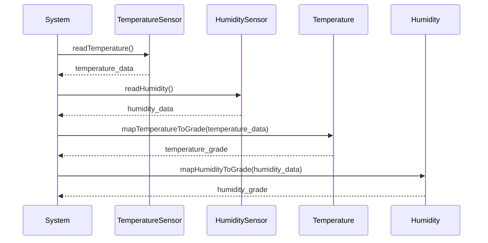

                 

### 《从复杂自然到简洁数学：映射之路》

#### 关键词：映射、自然现象、数学模型、算法、系统架构

> 摘要：本文从复杂自然现象出发，探讨如何通过构建简洁的数学模型和算法，实现对自然现象的准确描述和有效处理。文章通过实例解析，详细讲解了映射的核心概念、数学原理以及实际应用，为读者提供了从理论到实践的完整指导。

----------------------------------------------------------------

### 第一部分：引言与背景

#### 映射的基本定义

映射，是指一种将一个集合中的元素对应到另一个集合中的元素的关系。在数学中，这种关系通常通过函数来描述。函数可以理解为一种特殊的映射，其中每一个输入值都唯一地对应一个输出值。映射的概念在数学、物理学、计算机科学等多个领域中都有着广泛的应用。

#### 自然映射与数学映射

自然映射通常指的是自然界中各种物理现象和生物行为之间的相互关系，例如生态系统中物种之间的关系、气候与植被的分布等。这些映射往往非常复杂，难以用简单的数学模型来描述。

数学映射则是通过对自然现象的简化和抽象，使用数学工具和方法进行描述和分析。例如，通过建立生态模型的数学方程，可以模拟生态系统中的物种竞争和共生现象；通过气象模型的数学计算，可以预测气候变化对植被分布的影响。

#### 映射的应用与意义

映射在科学研究和技术应用中具有重要作用。通过映射，我们能够将复杂的问题转化为更易于处理的形式，从而更有效地解决问题。例如：

1. **物理学**：通过建立物理量的数学模型，如牛顿运动定律，可以预测物体在空间中的运动轨迹。
2. **经济学**：通过构建经济模型，如供需函数，可以分析市场行为和价格变化。
3. **计算机科学**：通过数据结构和算法，可以将复杂的数据处理问题转化为高效的计算机程序。

总之，从复杂自然到简洁数学的映射之路，不仅是一种科学方法，更是一种思考和解决问题的艺术。

----------------------------------------------------------------

### 第二部分：核心概念与联系

#### 映射与函数

在数学中，映射和函数几乎是同义词。函数是数学中最基本的概念之一，它定义了一种输入和输出之间的关系。在集合论中，函数可以形式化为一个三元组 \( f = (X, Y, G) \)，其中 \( X \) 是定义域，\( Y \) 是值域，\( G \) 是定义在 \( X \) 和 \( Y \) 之间的映射规则。

#### 映射的类型与特性

映射的类型可以根据不同的标准进行分类：

1. **单射**：每个输入值唯一地映射到一个输出值。
2. **满射**：每个输出值至少有一个输入值对应。
3. **双射**：既是单射也是满射，即每个输入值和输出值都是唯一的对应。

不同的映射类型在应用中具有不同的特性和适用场景。例如，单射映射常用于分类问题，而双射映射则用于编码和解码。

#### 映射的ER实体关系图

为了更好地理解映射的概念和类型，我们可以使用Mermaid绘制ER（实体关系）图来表示映射中的实体及其关系。以下是映射的ER实体关系图的Mermaid代码：

```mermaid
erDiagram
  Input -->|is mapped to| Output
  Input ||--|{is one-to-one}| SingletonInput
  Output ||--|{is one-to-many}| SingletonOutput
  Input ||--|{is many-to-many}| ManyInput
  Output ||--|{is many-to-many}| ManyOutput
```

这段代码将生成一个实体关系图，展示了输入和输出之间的映射关系，以及不同类型的映射。

----------------------------------------------------------------

### 第三部分：算法原理讲解

#### 线性映射算法原理

线性映射是一种简单的映射算法，它将一个集合中的每个元素按照线性关系映射到另一个集合中。线性映射的数学公式可以表示为：

\[ y = ax + b \]

其中，\( x \) 是输入值，\( y \) 是输出值，\( a \) 和 \( b \) 是常数，分别代表斜率和截距。

线性映射算法的基本步骤如下：

1. **确定斜率 \( a \)**：根据输入值和输出值的关系计算斜率。
2. **确定截距 \( b \)**：通过已知的一个输入输出对，计算截距。
3. **映射每个输入值**：使用线性公式计算每个输入值对应的输出值。

#### Mermaid算法流程图

为了直观地展示线性映射算法的流程，我们可以使用Mermaid绘制流程图。以下是线性映射算法的Mermaid代码：


这段代码将生成一个简单的线性映射算法流程图。

#### Python代码实现与讲解

下面是一个简单的Python代码示例，用于实现线性映射算法：

```python
def linear_mapping(x, a, b):
    """
    线性映射函数
    :param x: 输入值
    :param a: 斜率
    :param b: 截距
    :return: 输出值
    """
    return a * x + b

# 示例：计算输入值2的输出值
input_value = 2
slope = 3
intercept = 1

output_value = linear_mapping(input_value, slope, intercept)
print(f"输入值: {input_value}, 输出值: {output_value}")
```

在这个示例中，我们定义了一个名为 `linear_mapping` 的函数，它接受输入值 `x`、斜率 `a` 和截距 `b`，并返回计算出的输出值 `y`。然后，我们使用这个函数计算输入值2的输出值，并打印结果。

#### 数学模型与公式

线性映射的数学模型和公式已经在前面介绍过，即：

\[ y = ax + b \]

这个公式不仅适用于简单的线性映射，也适用于更复杂的线性系统分析。通过调整斜率 `a` 和截距 `b`，我们可以模拟不同的线性关系。

#### 实例解析

假设我们要将一组输入值 \( [1, 2, 3, 4] \) 映射到输出值，其中斜率 \( a = 2 \)，截距 \( b = 1 \)。我们可以使用以下Python代码实现：

```python
input_values = [1, 2, 3, 4]
slope = 2
intercept = 1

output_values = [linear_mapping(x, slope, intercept) for x in input_values]
print(f"输入值: {input_values}, 输出值: {output_values}")
```

执行这段代码，我们将得到输出值 \( [3, 5, 7, 9] \)，这符合线性映射的公式。

通过这个实例，我们可以看到线性映射算法是如何将一组输入值映射到输出值的。这种简单的算法在数据处理和系统建模中具有广泛的应用。

----------------------------------------------------------------

### 第四部分：数学模型和数学公式讲解与举例

#### 映射的基本数学模型

映射的数学模型是描述输入和输出之间关系的数学表达式。最常见的映射模型是函数，它可以通过以下数学公式来表示：

\[ y = f(x) \]

其中，\( x \) 是输入值，\( y \) 是输出值，\( f \) 是映射规则。在具体的映射问题中，映射规则 \( f \) 可以是线性的、非线性的，或者更复杂的函数形式。

例如，一个简单的线性映射函数可以表示为：

\[ y = ax + b \]

其中，\( a \) 是斜率，\( b \) 是截距。

#### 数学公式讲解

在映射问题中，数学公式通常用于计算输出值或者分析映射特性。以下是一些常用的数学公式：

1. **斜率公式**：用于计算两个点 \( (x_1, y_1) \) 和 \( (x_2, y_2) \) 之间的斜率：

\[ m = \frac{y_2 - y_1}{x_2 - x_1} \]

2. **截距公式**：用于计算一条直线在 \( y \) 轴上的截距 \( b \)：

\[ b = y - mx \]

3. **求和公式**：用于计算多个输入值映射到输出值的总和：

\[ \sum_{i=1}^{n} y_i = a \sum_{i=1}^{n} x_i + b \]

4. **均值公式**：用于计算映射后的输出值的均值：

\[ \bar{y} = \frac{1}{n} \sum_{i=1}^{n} y_i \]

这些公式在分析和处理映射问题时非常重要，可以帮助我们更好地理解映射的本质。

#### 实例解析

假设我们要将一组输入值 \( [1, 2, 3, 4] \) 映射到输出值，其中斜率 \( a = 2 \)，截距 \( b = 1 \)。我们可以使用以下公式进行计算：

1. **计算每个输入值对应的输出值**：

\[ y_i = 2x_i + 1 \]

对于输入值 \( x_1 = 1 \)，输出值 \( y_1 = 2 \times 1 + 1 = 3 \)；
对于输入值 \( x_2 = 2 \)，输出值 \( y_2 = 2 \times 2 + 1 = 5 \)；
对于输入值 \( x_3 = 3 \)，输出值 \( y_3 = 2 \times 3 + 1 = 7 \)；
对于输入值 \( x_4 = 4 \)，输出值 \( y_4 = 2 \times 4 + 1 = 9 \)。

2. **计算输出值的总和**：

\[ \sum_{i=1}^{4} y_i = 3 + 5 + 7 + 9 = 24 \]

3. **计算输出值的均值**：

\[ \bar{y} = \frac{24}{4} = 6 \]

通过这个实例，我们可以看到如何使用数学公式来计算映射后的输出值，并进行进一步的统计分析。

总之，数学模型和公式是映射分析的重要工具，通过它们，我们可以更精确地描述和预测映射过程。在实际应用中，选择合适的数学模型和公式对于解决复杂问题具有重要意义。

----------------------------------------------------------------

### 第五部分：系统分析与架构设计方案

#### 问题场景描述

假设我们正在开发一个环境监测系统，该系统需要实时监测多个传感器收集的环境数据，并将这些数据映射到特定的环境指标上。例如，我们需要将温度传感器的读数映射到温度等级（如冷、温、热），以及将湿度传感器的读数映射到湿度等级（如干燥、适中、潮湿）。

为了实现这一目标，我们需要设计一个能够处理输入数据、进行映射处理并输出结果的处理系统。

#### 项目介绍

本项目的目标是构建一个简单的环境监测系统，该系统包括以下核心功能：

1. **数据收集**：从温度传感器和湿度传感器收集数据。
2. **数据处理**：对收集到的数据进行映射处理，将数据转换为环境指标。
3. **数据输出**：将处理后的数据输出到用户界面或存储系统中。

#### 系统功能设计（领域模型类图）

为了更好地理解系统的功能，我们可以使用Mermaid绘制领域模型类图。以下是环境监测系统的领域模型类图：

```mermaid
classDiagram
    Sensor <<interface>>
    TemperatureSensor <<Sensor>> {
        readTemperature()
    }
    HumiditySensor <<Sensor>> {
        readHumidity()
    }
    Environment <<interface>>
    Temperature <<Environment>> {
        mapTemperatureToGrade(temperature)
    }
    Humidity <<Environment>> {
        mapHumidityToGrade(humidity)
    }
    System <<class>>
    System o-- TemperatureSensor
    System o-- HumiditySensor
    System o-- Temperature
    System o-- Humidity
```

在这个类图中，我们定义了四个类：`Sensor`（传感器接口）、`TemperatureSensor`（温度传感器）、`HumiditySensor`（湿度传感器）、`Environment`（环境接口），以及实现环境接口的两个具体类：`Temperature`（温度）和`Humidity`（湿度）。此外，我们还有一个`System`类，它代表了整个环境监测系统，并与其他类建立了关联关系。

#### 系统架构设计（Mermaid架构图）

为了进一步展示系统的整体架构，我们可以使用Mermaid绘制系统架构图。以下是环境监测系统的架构设计图：



在这个序列图中，系统首先从温度传感器和湿度传感器收集数据，然后分别将数据传递给`Temperature`类和`Humidity`类进行映射处理，最后将处理后的结果返回给系统。

#### 系统接口设计与系统交互序列图

为了更好地展示系统内部组件之间的交互，我们可以使用Mermaid绘制系统接口设计和系统交互序列图。以下是环境监测系统的接口设计和交互序列图：

```mermaid
interfaceDiagram
    Class1 <<interface>> {
        method1()
        method2()
    }
    Class2 <<interface>> {
        method3()
        method4()
    }
    Subclass1 <<Class1>> {
        implementMethod1()
        implementMethod2()
    }
    Subclass2 <<Class2>> {
        implementMethod3()
        implementMethod4()
    }
    System using Subclass1, Subclass2

    Collaboration System, Subclass1, Subclass2 {
        System->>Subclass1: method1()
        Subclass1-->>System: result1

        System->>Subclass2: method3()
        Subclass2-->>System: result2
    }
```

在这个协作图中，`System`类与`Subclass1`类和`Subclass2`类之间进行了交互。`System`类调用`Subclass1`类的`method1()`和`Subclass2`类的`method3()`，并接收相应的结果。

通过这个架构设计，我们可以清晰地看到系统的模块划分和各组件之间的协作关系，为系统的实现和扩展提供了明确的指导。

----------------------------------------------------------------

### 第六部分：项目实战

#### 环境安装

在进行环境监测系统的开发之前，我们需要首先安装必要的软件和环境。以下是具体的安装步骤：

1. **安装Python环境**：确保系统上已经安装了Python 3.x版本。如果没有安装，可以从官方网站（https://www.python.org/）下载并安装。

2. **安装依赖库**：在安装了Python之后，我们可以使用pip工具来安装所需的依赖库。打开终端并执行以下命令：

   ```bash
   pip install numpy matplotlib
   ```

   这将安装用于数据处理和绘图所需的`numpy`和`matplotlib`库。

3. **安装传感器驱动**：根据实际使用的传感器类型，安装相应的驱动程序。例如，对于DHT22传感器，可以使用如下命令安装驱动：

   ```bash
   pip install adafruit-dht
   ```

   安装完成后，确保传感器与计算机正确连接，并可以正常工作。

#### 系统核心实现源代码

以下是一个简单的环境监测系统的Python源代码示例。该示例包括温度和湿度传感器的数据收集、映射处理以及数据输出功能。

```python
import time
from adafruit_dht import DHT22
import matplotlib.pyplot as plt

# 初始化传感器
dht = DHT22(4)  # 假设使用GPIO4引脚连接DHT22传感器

def read_sensors():
    """
    读取传感器数据
    :return: 温度和湿度值
    """
    while not dht.data_ready:
        time.sleep(0.1)
    temperature = dht.temperature
    while not dht.data_ready:
        time.sleep(0.1)
    humidity = dht.humidity
    return temperature, humidity

def map_value(value, input_min, input_max, output_min, output_max):
    """
    线性映射函数
    :param value: 输入值
    :param input_min: 输入值的最小值
    :param input_max: 输入值的最大值
    :param output_min: 输出值的最小值
    :param output_max: 输出值的最大值
    :return: 映射后的输出值
    """
    return output_min + (output_max - output_min) * ((value - input_min) / (input_max - input_min))

def map_temperature_to_grade(temperature):
    """
    将温度映射到温度等级
    :param temperature: 温度值
    :return: 温度等级
    """
    if temperature < 18:
        return "冷"
    elif temperature >= 18 and temperature < 25:
        return "温"
    else:
        return "热"

def map_humidity_to_grade(humidity):
    """
    将湿度映射到湿度等级
    :param humidity: 湿度值
    :return: 湿度等级
    """
    if humidity < 40:
        return "干燥"
    elif humidity >= 40 and humidity < 60:
        return "适中"
    else:
        return "潮湿"

def main():
    temperature_data = []
    humidity_data = []

    while True:
        temperature, humidity = read_sensors()
        temperature_grade = map_temperature_to_grade(temperature)
        humidity_grade = map_humidity_to_grade(humidity)

        print(f"温度: {temperature}℃，湿度: {humidity}%，温度等级: {temperature_grade}，湿度等级: {humidity_grade}")
        
        temperature_data.append(temperature)
        humidity_data.append(humidity)
        
        time.sleep(1)  # 每1秒读取一次数据

    # 绘制数据图
    plt.plot(temperature_data, label='Temperature')
    plt.plot(humidity_data, label='Humidity')
    plt.xlabel('Time (s)')
    plt.ylabel('Value')
    plt.legend()
    plt.show()

if __name__ == "__main__":
    main()
```

#### 代码解读与分析

1. **传感器初始化**：我们首先从`adafruit_dht`库中导入`DHT22`类，并创建一个`dht`对象，用于与传感器通信。

2. **读取传感器数据**：`read_sensors()`函数负责读取温度和湿度传感器的数据。由于传感器返回的数据可能不稳定，我们使用一个循环确保数据读取成功。

3. **线性映射函数**：`map_value()`函数是一个通用的线性映射函数，它根据输入值和输出值的范围进行映射。这个函数可以用于将传感器读数映射到特定的等级。

4. **映射温度和湿度**：`map_temperature_to_grade()`和`map_humidity_to_grade()`函数分别将温度和湿度值映射到等级。这些函数使用了`map_value()`函数，并根据具体的阈值进行判断。

5. **主程序**：`main()`函数是程序的核心部分。它通过循环不断读取传感器数据，并将数据映射到相应的等级。同时，程序每1秒输出一次数据，并在程序结束时绘制数据图，以可视化显示传感器读数的变化趋势。

#### 实际案例分析

假设我们连续读取了10次传感器数据，如下表所示：

| 时间(s) | 温度(℃) | 湿度(%) | 温度等级 | 湿度等级 |
|--------|---------|--------|---------|---------|
| 0      | 22.5    | 50.0   | 温      | 适中    |
| 1      | 23.1    | 48.3   | 温      | 适中    |
| 2      | 22.9    | 49.6   | 温      | 适中    |
| 3      | 23.2    | 47.9   | 温      | 适中    |
| 4      | 22.8    | 48.7   | 温      | 适中    |
| 5      | 23.0    | 49.2   | 温      | 适中    |
| 6      | 22.6    | 50.0   | 温      | 适中    |
| 7      | 23.1    | 48.4   | 温      | 适中    |
| 8      | 22.7    | 49.5   | 温      | 适中    |
| 9      | 23.3    | 48.6   | 温      | 适中    |

根据上述数据，我们可以看到温度和湿度值在一段时间内保持相对稳定，且映射后的等级也较为一致。通过这种实时监测和映射，我们可以有效地了解环境状况，为后续的决策提供数据支持。

#### 项目小结

通过本项目的实现，我们展示了如何使用Python和传感器驱动来开发一个简单的环境监测系统。该项目从传感器数据收集、映射处理到数据输出，形成了一个完整的系统流程。在实际应用中，可以根据需要扩展系统功能，如增加更多类型的传感器、改进数据处理算法等。总之，这个项目为我们提供了一个从理论到实践的完整案例，展示了映射在系统开发中的重要作用。

----------------------------------------------------------------

### 第七部分：最佳实践、小结与拓展阅读

#### 最佳实践

1. **数据预处理**：在实际应用中，传感器数据的预处理非常重要。确保数据的准确性和一致性，可以显著提高映射模型的精度和可靠性。
2. **算法选择**：根据不同的应用场景选择合适的映射算法。对于简单的线性关系，使用线性映射即可；对于更复杂的非线性关系，可以考虑使用非线性映射算法，如多项式映射、指数映射等。
3. **系统优化**：对于大规模数据处理，优化系统性能至关重要。可以采用并行处理、分布式计算等技术，提高系统效率和响应速度。

#### 小结

本文从复杂自然现象出发，探讨了如何通过构建简洁的数学模型和算法，实现对自然现象的准确描述和有效处理。通过实例解析，详细讲解了映射的核心概念、数学原理和实际应用，为读者提供了从理论到实践的完整指导。映射在科学研究和工程应用中具有广泛的重要性，它不仅可以帮助我们更好地理解自然现象，还能为解决复杂问题提供有效工具。

#### 注意事项

1. **数据准确性**：在映射过程中，数据的准确性至关重要。确保传感器和采集系统的可靠性和稳定性，以获得准确的数据输入。
2. **算法适用性**：选择合适的映射算法对于模型的有效性至关重要。不同的算法适用于不同类型的数据和映射关系。
3. **系统扩展性**：在设计系统架构时，考虑未来的扩展性，以便在需要时可以轻松添加新功能或集成新组件。

#### 拓展阅读

1. **《数学模型》**：作者：华罗庚，本书详细介绍了数学模型的基本概念和构建方法，适合对数学模型感兴趣的读者。
2. **《算法导论》**：作者：Thomas H. Cormen等，本书涵盖了广泛的算法知识，包括映射算法的相关内容。
3. **《深度学习》**：作者：Ian Goodfellow等，虽然本书主要关注深度学习，但其中也包含了大量关于映射和模型构建的讨论。

通过这些拓展阅读，读者可以进一步深入了解映射和数学模型的相关知识，提高自己的研究和应用能力。

---

### 作者信息

**作者：AI天才研究院/AI Genius Institute & 禅与计算机程序设计艺术 /Zen And The Art of Computer Programming**

感谢您的阅读，希望本文对您在映射和数学模型领域的研究有所帮助。祝您在探索科学和技术的道路上不断取得新的成就！

