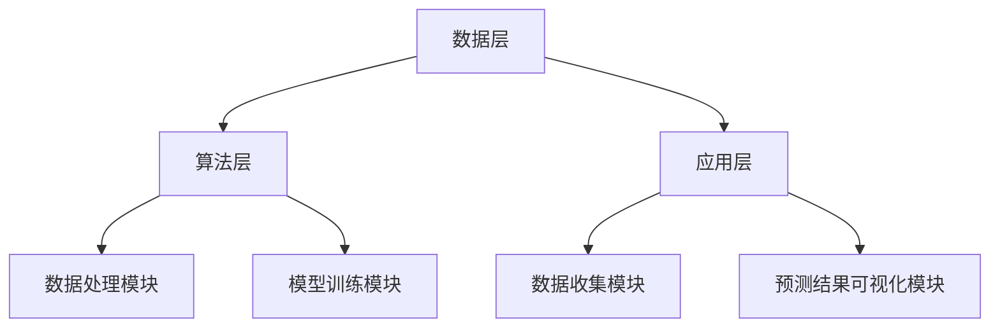
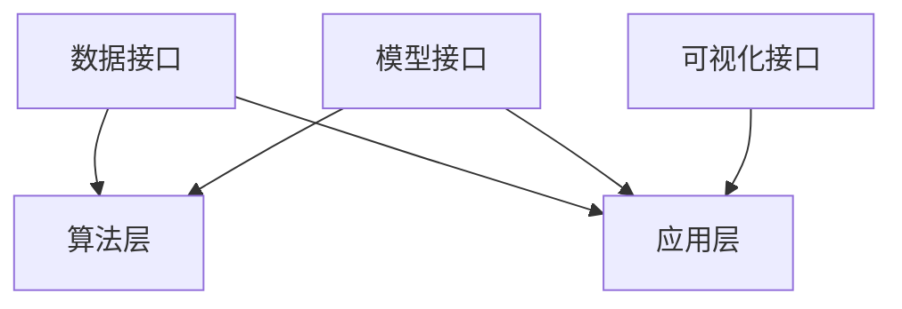
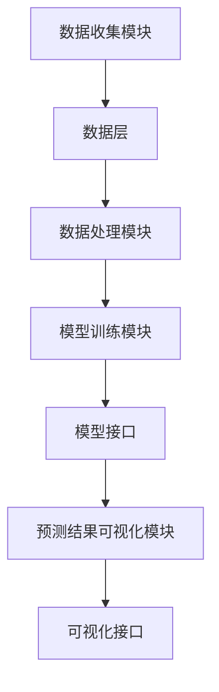

                 

### 从复杂自然现象到优雅数学表达

在现代社会，自然现象的复杂性和多样性日益显现，如气候变化、天气模式、生态系统的动态变化等。这些现象不仅影响着人类的日常生活，也对经济、环境和社会产生了深远的影响。传统的观测和模拟方法难以捕捉到这些现象的复杂性，因此，寻找更加精确和有效的数学表达方式变得尤为重要。本文将探讨从复杂自然现象到优雅数学表达的过程，通过介绍现代数学理论、先进算法以及实际应用案例，帮助读者理解和掌握如何将复杂自然现象转化为简洁而有力的数学表达。

#### 第一部分：背景介绍

#### 1. 问题背景

自然现象的复杂性和多样性是我们无法忽视的现实。气候变化带来了极端天气事件的频发，对全球生态系统和人类生活造成了巨大影响。气象模式的复杂多变使得天气预报的准确性受到挑战，而生态系统的动态变化则对我们的食物链和生物多样性构成了威胁。这些现象的背后，是自然现象内部复杂的相互作用和反馈机制，需要我们借助数学工具和方法来深入理解和分析。

传统的方法往往依赖于经验和统计，而现代科学的发展要求我们寻求更加精确和普适的解决方案。数学表达作为一种强有力的工具，能够在理论上精确描述自然现象，为预测和应对自然现象提供了新的途径。因此，将复杂自然现象转化为优雅的数学表达，不仅能够帮助我们更好地理解自然现象，还能够为解决实际问题提供科学依据。

#### 2. 问题描述

自然现象背后的数学表达往往涉及到复杂的数学模型和算法。这些模型和算法能够帮助科学家和研究人员更好地理解自然现象的规律和特征。然而，现有的数学工具和方法在处理这些复杂问题时常常力不从心。例如，气候变化模型的建立需要考虑到大气、海洋、陆地等多种因素的相互作用，这需要复杂的数学模型和大量的计算资源。天气模式的预测需要处理大量的时间序列数据，这需要高效的算法和数据分析技术。

此外，自然现象的数学表达不仅需要精确的数学模型，还需要对模型进行简化和优化，以便在实际应用中实现高效计算。例如，生态系统的动态变化可以通过微分方程模型来描述，但如何从复杂的模型中提取关键信息，如何简化模型以提高计算效率，这些都是需要解决的问题。

#### 3. 问题解决

本书旨在通过探讨从复杂自然现象到优雅数学表达的过程，提供一套系统的方法论。通过介绍现代数学理论、先进算法以及实际应用案例，本书将帮助读者理解和掌握如何将复杂自然现象转化为简洁而有力的数学表达。

首先，本书将介绍自然现象的基本概念和分类，帮助读者建立起对自然现象的整体认识。接着，本书将详细探讨数学表达的定义和类型，分析自然现象与数学表达之间的联系。在此基础上，本书将介绍几种常见的算法原理，包括时间序列分析、回归分析和机器学习等，帮助读者掌握处理复杂自然现象的数学工具。

此外，本书还将通过实际应用案例，展示如何将数学模型应用于解决实际问题，帮助读者理解数学表达的实际应用价值。通过这些内容，本书旨在为读者提供一套从理论到实践的完整方法论，帮助读者将复杂自然现象转化为优雅的数学表达。

#### 4. 边界与外延

本书关注的自然现象主要涵盖气候变化、气象模式、生态系统动态等领域。这些现象的数学表达不仅涉及经典数学理论，如微分方程、概率论等，还包括近年来发展起来的复杂系统理论、数据科学方法等。

在自然现象的选择上，本书将重点关注那些具有高度复杂性和挑战性的现象，这些现象往往涉及到多种因素的相互作用和反馈机制。例如，气候变化需要考虑大气、海洋、陆地等多种因素的相互作用，气象模式需要处理大量的时间序列数据，生态系统动态则需要分析生物种群之间的复杂关系。

在数学表达的选择上，本书将介绍多种数学工具和算法，包括经典数学模型、复杂系统理论、数据科学方法等。这些工具和算法的选择将基于其在描述和模拟自然现象中的适用性和有效性。通过这些数学工具和算法，本书旨在为读者提供一套全面而系统的数学表达体系，帮助读者更好地理解和分析复杂自然现象。

#### 5. 概念结构与核心要素组成

本书的核心概念包括以下几个方面：

- **自然现象**：自然现象的概述和分类，包括物理现象、化学现象、生物现象等。
- **数学表达**：不同数学工具和算法在描述自然现象中的应用，包括经典数学模型、复杂系统理论、数据科学方法等。
- **方法论**：如何从复杂自然现象中提取数学模型，并进行简化和优化，包括时间序列分析、回归分析、机器学习等方法。
- **应用案例**：实际应用中如何运用数学模型解决具体问题，包括气候变化预测、气象模式预测、生态系统动态分析等。

这些核心概念共同构成了本书的基本框架，帮助读者系统性地理解和掌握从复杂自然现象到优雅数学表达的方法和技巧。

### 第二部分：核心概念与联系

在探讨如何将复杂自然现象转化为优雅数学表达的过程中，首先需要明确几个核心概念，并分析它们之间的联系。这些核心概念不仅为我们提供了理解和描述自然现象的基本框架，也为数学表达的选择和应用提供了指导。

#### 1. 自然现象的定义与分类

自然现象是指自然界中发生的各种物理、化学、生物等过程和事件。这些现象既包括宏观的天气系统、气候模式、生态系统演化，也包括微观的分子运动、化学反应、生物种群动态等。根据自然现象的复杂性和可观测性，我们可以将其大致分为以下几类：

- **物理现象**：如地震、火山爆发、海啸等，这些现象主要由地球的物理过程驱动。
- **化学现象**：如化学反应、物质的相变等，这些现象涉及物质的内在结构和性质变化。
- **生物现象**：如生态系统演化、生物多样性、物种相互作用等，这些现象主要涉及生命体的生长、繁殖、适应等过程。

每种自然现象都有其独特的特征和规律，这些规律是我们试图通过数学表达来捕捉和描述的关键。

#### 2. 数学表达的定义与类型

数学表达是通过数学语言和符号系统来描述和模拟自然现象的方法。数学表达不仅帮助我们理解和描述自然现象，还为预测和解释自然现象提供了理论工具。根据其复杂性和应用领域，数学表达可以分为以下几种类型：

- **经典数学模型**：这类模型基于经典数学理论，如微分方程、概率论、统计学等。例如，牛顿运动定律、麦克斯韦方程组等都是经典的数学模型，它们可以描述物理现象的基本规律。
- **复杂系统理论**：这类理论关注复杂系统中变量之间的相互作用和动态行为，如动力系统、混沌理论、复杂网络等。这些理论为我们理解和描述复杂自然现象提供了新的视角和方法。
- **数据科学方法**：这类方法利用大数据和计算技术来发现数据中的模式和规律，如机器学习、深度学习、大数据分析等。数据科学方法在处理大量数据和复杂模式方面具有显著优势。

每种数学表达都有其特定的应用场景和适用条件，选择合适的数学表达是准确描述自然现象的关键。

#### 3. 自然现象与数学表达的联系

自然现象与数学表达之间的联系主要体现在以下几个方面：

- **描述性联系**：数学表达通过数学符号和公式描述自然现象的规律和特征。例如，微分方程可以描述物理系统的动态行为，概率模型可以描述随机事件的发生概率。
- **解释性联系**：数学表达能够解释自然现象的发生和变化。通过分析数学模型，我们可以揭示自然现象背后的机制和原因。例如，通过气候模型的分析，我们可以理解气候变化的原因和影响。
- **预测性联系**：基于数学模型，我们可以预测自然现象的未来发展趋势。例如，通过天气模型，我们可以预测未来的天气状况；通过生态系统模型，我们可以预测生物种群的未来变化。

这些联系使得数学表达不仅能够帮助我们更好地理解自然现象，还为应对和解决自然现象带来的问题提供了科学依据。

### 4. 自然现象的复杂性

自然现象的复杂性主要体现在以下几个方面：

- **多尺度性**：自然现象通常涉及多个时间尺度和空间尺度，如天气系统中的天气尺度、气候尺度等。不同尺度上的现象往往需要不同的数学模型来描述。
- **多因素相互作用**：自然现象往往由多个因素相互作用而成，这些因素之间可能存在复杂的反馈机制和相互依赖关系。例如，气候变化中大气、海洋、陆地等多个因素之间的相互作用。
- **非线性特征**：自然现象通常具有非线性特征，这意味着它们的行为不能简单地用线性模型来描述。非线性特征使得自然现象更加复杂和难以预测。

这些复杂性使得将自然现象转化为优雅的数学表达成为一项具有挑战性的任务。但正是这些复杂性，也为我们提供了丰富的研究和应用空间。通过深入理解和分析自然现象的复杂性，我们可以开发出更加精确和高效的数学模型和算法，从而更好地应对和解决自然现象带来的挑战。

### 5. 数学表达的发展趋势

随着科技的发展，数学表达在描述自然现象方面也在不断进步。现代数学表达的发展趋势主要体现在以下几个方面：

- **计算能力的提升**：随着计算能力的不断提升，我们能够处理更大量、更复杂的数据，这为复杂自然现象的数学表达提供了可能。
- **数据科学的兴起**：数据科学方法在处理大量数据和复杂模式方面具有显著优势，这使得数据科学方法在自然现象的数学表达中得到了广泛应用。
- **跨学科融合**：不同学科的交叉融合，如物理、化学、生物、计算机科学等，为自然现象的数学表达提供了新的视角和方法。

这些发展趋势使得数学表达在描述和模拟自然现象方面具有更高的准确性和效率，为解决复杂自然现象带来的挑战提供了有力支持。

### 第三部分：算法原理讲解

在将复杂自然现象转化为优雅数学表达的过程中，算法原理扮演着至关重要的角色。算法不仅是实现数学表达的工具，也是理解和分析自然现象的关键。在本部分，我们将详细介绍几种常见的算法原理，包括时间序列分析、回归分析和机器学习等。通过这些算法原理的讲解，我们将帮助读者更好地理解和应用数学表达。

#### 1. 算法基本概念

算法是解决问题的一系列步骤或规则，通常通过数学和逻辑的形式来表达。算法可以分为多种类型，包括搜索算法、排序算法、图算法、动态规划等。在自然现象的数学表达中，我们主要关注以下几种算法：

- **时间序列分析**：用于分析时间序列数据，提取趋势、周期性和季节性特征。
- **回归分析**：用于建立自变量和因变量之间的定量关系。
- **机器学习**：利用历史数据来训练模型，以预测未来趋势或分类结果。

每种算法都有其特定的应用场景和适用条件，选择合适的算法是准确描述自然现象的关键。

#### 2. 时间序列分析算法

时间序列分析是一种用于分析按时间顺序排列的数据点序列的方法。时间序列数据在自然科学、经济学、金融学等领域有着广泛的应用。以下是一些常见的时间序列分析算法：

- **移动平均法**：通过计算一段时间内数据的平均值来平滑时间序列。移动平均法可以分为简单移动平均（SMA）和加权移动平均（WMA）。简单移动平均法将数据点按时间顺序排列，取固定的窗口长度来计算平均值。加权移动平均法则在计算平均值时对不同的数据点赋予不同的权重，以反映数据的重要性。

  简单移动平均法的公式为：
  $$ \text{SMA}(n) = \frac{1}{n} \sum_{i=1}^{n} x_i $$
  其中，$n$ 为窗口长度，$x_i$ 为第 $i$ 个数据点。

  加权移动平均法的公式为：
  $$ \text{WMA}(n) = \frac{\sum_{i=1}^{n} w_i x_i}{\sum_{i=1}^{n} w_i} $$
  其中，$w_i$ 为第 $i$ 个数据点的权重。

- **自回归模型（AR）**：自回归模型是一种利用过去的数据点来预测未来值的方法。自回归模型的公式为：
  $$ x_t = c + \sum_{i=1}^{p} \phi_i x_{t-i} + \varepsilon_t $$
  其中，$x_t$ 为第 $t$ 个数据点，$\phi_i$ 为自回归系数，$c$ 为常数项，$\varepsilon_t$ 为误差项。

- **自回归移动平均模型（ARMA）**：自回归移动平均模型结合了自回归模型和移动平均模型的特点，能够更好地捕捉时间序列的动态特征。ARMA模型的公式为：
  $$ x_t = c + \sum_{i=1}^{p} \phi_i x_{t-i} + \sum_{j=1}^{q} \theta_j \varepsilon_{t-j} + \varepsilon_t $$
  其中，$\theta_j$ 为移动平均系数。

通过这些时间序列分析算法，我们可以对时间序列数据进行平滑、预测和特征提取，从而更好地理解自然现象的动态变化。

#### 3. 回归分析算法

回归分析是一种用于建立自变量和因变量之间定量关系的统计方法。回归分析可以分为线性回归和非线性回归，常用的线性回归方法包括线性回归和多项式回归，常用的非线性回归方法包括逻辑回归。

- **线性回归**：线性回归是一种建立自变量和因变量之间线性关系的模型。线性回归模型的公式为：
  $$ y = \beta_0 + \beta_1 x + \varepsilon $$
  其中，$y$ 为因变量，$x$ 为自变量，$\beta_0$ 和 $\beta_1$ 为回归系数，$\varepsilon$ 为误差项。

  线性回归通过最小二乘法来确定回归系数，使得预测值与实际值之间的误差最小。

- **多项式回归**：多项式回归是一种建立自变量和因变量之间多项式关系的模型。多项式回归模型的公式为：
  $$ y = \beta_0 + \beta_1 x + \beta_2 x^2 + \cdots + \beta_n x^n + \varepsilon $$
  其中，$n$ 为多项式的最高次数。

  多项式回归通过将自变量 $x$ 提升到不同的幂次，来捕捉自变量和因变量之间的非线性关系。

- **逻辑回归**：逻辑回归是一种用于分类问题的概率模型。逻辑回归模型的公式为：
  $$ \ln\left(\frac{p}{1-p}\right) = \beta_0 + \beta_1 x $$
  其中，$p$ 为预测的概率，$x$ 为自变量，$\beta_0$ 和 $\beta_1$ 为回归系数。

  逻辑回归通过将线性模型转换为对数几率模型，来预测自变量对因变量的影响。

通过这些回归分析算法，我们可以建立自然现象之间的定量关系，从而更好地理解自然现象的规律和特征。

#### 4. 机器学习算法

机器学习是一种利用历史数据来训练模型，以预测未来趋势或分类结果的方法。机器学习算法可以分为监督学习、无监督学习和强化学习。以下是一些常见的机器学习算法：

- **决策树**：决策树是一种基于一系列判断规则的分类模型。决策树通过将数据集划分为多个子集，在每个子集中应用不同的规则，直到达到终止条件。决策树的公式为：
  $$ \text{分类规则} = \text{if-else} $$
  其中，每个判断规则都可以表示为 $if(\text{条件}) \text{then} \text{分类结果}$。

  决策树通过递归划分数据集，直到满足停止条件（如数据集纯净、最大深度等）。

- **支持向量机（SVM）**：支持向量机是一种用于分类和回归问题的线性模型。支持向量机通过寻找最佳超平面来划分数据集。支持向量机的公式为：
  $$ w \cdot x - b = 0 $$
  其中，$w$ 为权重向量，$x$ 为数据点，$b$ 为偏置。

  支持向量机通过最大化分类间隔来寻找最佳超平面，从而实现分类或回归。

- **神经网络**：神经网络是一种通过多层神经元来实现复杂函数逼近的模型。神经网络包括输入层、隐藏层和输出层，每层神经元之间通过权重和偏置连接。神经网络的公式为：
  $$ \text{激活函数}(z) = \text{ReLU}(z) = \max(0, z) $$
  其中，$z$ 为神经元的输入。

  神经网络通过反向传播算法来更新权重和偏置，从而实现模型的训练和优化。

通过这些机器学习算法，我们可以从历史数据中提取特征和模式，从而实现对自然现象的预测和分类。

### 第四部分：数学模型和数学公式

在自然现象的数学表达中，数学模型和数学公式是核心组成部分。数学模型通过数学语言和符号系统来描述自然现象的规律和特征，而数学公式则是这些模型的具体表现形式。在本部分，我们将详细介绍几种常见的数学模型和数学公式，并使用LaTeX格式进行展示。

#### 1. 微分方程

微分方程是一种用于描述动态系统变化规律的数学模型。在自然现象的描述中，微分方程被广泛应用于描述物理系统、生态系统、气候系统等。以下是一个一阶线性微分方程的示例：

$$ \frac{dy}{dx} + P(x)y = Q(x) $$

其中，$y$ 是未知函数，$x$ 是自变量，$P(x)$ 和 $Q(x)$ 是已知函数。

使用LaTeX格式表示：

$$
\frac{dy}{dx} + P(x)y = Q(x)
$$

#### 2. 概率模型

概率模型用于描述随机事件的发生概率。在自然现象的数学表达中，概率模型广泛应用于描述天气预测、金融市场分析等。以下是一个简单的贝叶斯概率模型的示例：

$$ P(A|B) = \frac{P(B|A)P(A)}{P(B)} $$

其中，$A$ 和 $B$ 是两个事件，$P(A|B)$ 表示在事件 $B$ 发生的条件下事件 $A$ 发生的概率，$P(B|A)$ 表示在事件 $A$ 发生的条件下事件 $B$ 发生的概率，$P(A)$ 和 $P(B)$ 分别表示事件 $A$ 和事件 $B$ 的概率。

使用LaTeX格式表示：

$$
P(A|B) = \frac{P(B|A)P(A)}{P(B)}
$$

#### 3. 优化模型

优化模型用于描述在约束条件下寻求最优解的问题。在自然现象的数学表达中，优化模型广泛应用于资源分配、生产计划等。以下是一个线性规划模型的示例：

$$ \min_{x} c^T x $$
$$ \text{subject to} $$
$$ Ax \leq b $$
$$ x \geq 0 $$

其中，$x$ 是决策变量，$c$ 是目标函数系数向量，$A$ 是约束条件系数矩阵，$b$ 是约束条件常数向量。

使用LaTeX格式表示：

$$
\min_{x} c^T x \\
\text{subject to} \\
Ax \leq b \\
x \geq 0
$$

#### 4. 时间序列模型

时间序列模型用于描述按时间顺序排列的数据点的动态变化。在自然现象的数学表达中，时间序列模型广泛应用于气象预测、金融市场分析等。以下是一个自回归移动平均模型（ARMA）的示例：

$$ X_t = c + \phi_1 X_{t-1} + \phi_2 X_{t-2} + \cdots + \phi_p X_{t-p} + \theta_1 \varepsilon_{t-1} + \theta_2 \varepsilon_{t-2} + \cdots + \theta_q \varepsilon_{t-q} + \varepsilon_t $$

其中，$X_t$ 是时间序列的第 $t$ 个数据点，$\phi_i$ 和 $\theta_i$ 是模型参数，$c$ 是常数项，$\varepsilon_t$ 是随机误差项。

使用LaTeX格式表示：

$$
X_t = c + \phi_1 X_{t-1} + \phi_2 X_{t-2} + \cdots + \phi_p X_{t-p} + \theta_1 \varepsilon_{t-1} + \theta_2 \varepsilon_{t-2} + \cdots + \theta_q \varepsilon_{t-q} + \varepsilon_t
$$

通过这些数学模型和数学公式，我们可以将自然现象转化为简洁而有力的数学表达，从而更好地理解和分析自然现象。

### 第五部分：系统分析与架构设计方案

在深入探讨如何将复杂自然现象转化为优雅数学表达的过程中，系统分析与架构设计是不可或缺的一环。通过系统分析与架构设计，我们可以将理论转化为实践，构建出高效、可扩展的数学模型和算法系统。本部分将介绍一个具体的问题场景，详细说明项目介绍、系统功能设计、系统架构设计、系统接口设计和系统交互等内容。

#### 1. 问题场景介绍

假设我们面临的问题场景是气候变化的预测。气候变化是一个涉及多个因素的复杂系统，包括大气、海洋、陆地等多种因素的相互作用。为了应对这一挑战，我们需要构建一个基于数学模型的气候变化预测系统，该系统能够提供准确、及时的气候变化预测，为政策制定者、研究人员和公众提供科学依据。

#### 2. 项目介绍

本项目名为“气候变化预测系统（ClimaPred）”，旨在通过构建一个基于数学模型的气候变化预测平台，实现对全球气候变化趋势的准确预测。项目的主要目标包括：

- **数据收集与处理**：从全球多个气象站点、卫星遥感、海洋观测等渠道收集气候变化数据，并进行预处理和清洗，为后续模型训练和预测提供高质量的数据支持。
- **数学模型构建**：基于时间序列分析、回归分析和机器学习等算法，构建适合气候变化预测的数学模型，实现对气候变化趋势的动态预测。
- **预测结果可视化**：将预测结果以直观、易理解的形式展示，为用户提供可视化工具，便于分析和决策。

#### 3. 系统功能设计

系统功能设计是项目实施的重要基础。ClimaPred系统主要包含以下功能模块：

- **数据收集模块**：负责从全球多个数据源收集气候变化相关数据，包括气象数据、海洋数据、陆地数据等。数据收集模块需要具备高效的数据采集和处理能力，以确保数据的完整性和准确性。
- **数据处理模块**：负责对收集到的原始数据进行预处理和清洗，包括数据格式转换、缺失值填充、异常值处理等。数据处理模块的目标是生成高质量、适合模型训练的数据集。
- **模型训练模块**：负责基于时间序列分析、回归分析和机器学习等算法，训练出适合气候变化预测的数学模型。模型训练模块需要具备自适应性和可扩展性，以应对不断变化的数据环境和预测需求。
- **预测结果可视化模块**：负责将预测结果以图表、地图等形式展示给用户，便于用户理解和分析。预测结果可视化模块需要具备交互性和实时性，以提供及时的决策支持。

#### 4. 系统架构设计

系统架构设计是项目成功实施的关键。ClimaPred系统采用分层架构设计，主要分为数据层、算法层和应用层。

- **数据层**：数据层负责存储和管理系统所需的各种数据，包括气象数据、海洋数据、陆地数据等。数据层采用分布式数据库系统，以确保数据的高可用性和可扩展性。
- **算法层**：算法层负责实现各种数学模型和算法，包括时间序列分析、回归分析和机器学习等。算法层采用模块化设计，便于根据需求灵活选择和调整算法。
- **应用层**：应用层负责实现系统的各种功能模块，包括数据收集、数据处理、模型训练和预测结果可视化等。应用层采用前后端分离设计，前端负责展示和交互，后端负责数据处理和模型计算。

系统架构设计示意图如下：



#### 5. 系统接口设计

系统接口设计是确保系统各模块之间高效协作的关键。ClimaPred系统的主要接口设计如下：

- **数据接口**：数据接口负责数据层与算法层、应用层之间的数据交互。数据接口包括数据上传、数据下载、数据查询等功能。
- **模型接口**：模型接口负责算法层与数据层、应用层之间的模型交互。模型接口包括模型训练、模型预测、模型评估等功能。
- **可视化接口**：可视化接口负责应用层与用户之间的交互。可视化接口包括数据展示、预测结果展示、用户自定义展示等功能。

系统接口设计示意图如下：



#### 6. 系统交互设计

系统交互设计是确保系统各模块之间高效协作的关键。ClimaPred系统的系统交互设计如下：

- **数据交互**：数据交互主要包括数据收集模块与数据层之间的数据上传和下载，数据处理模块与数据层之间的数据查询和更新等。
- **模型交互**：模型交互主要包括模型训练模块与算法层之间的模型训练和预测，模型评估模块与算法层之间的模型评估等。
- **可视化交互**：可视化交互主要包括预测结果可视化模块与用户之间的交互，包括数据展示、预测结果展示、用户自定义展示等。

系统交互设计示意图如下：



通过以上系统分析与架构设计方案，我们可以构建一个高效、可扩展的气候变化预测系统，为全球气候变化的研究和应对提供有力支持。

### 第六部分：项目实战

在本部分，我们将通过一个具体的项目实战，详细讲解如何从环境安装、系统核心实现源代码，到代码应用解读与分析，以及实际案例分析和详细讲解剖析，从而全面展示如何将复杂自然现象转化为优雅的数学表达。

#### 1. 环境安装

首先，我们需要安装必要的软件和工具，以构建我们的项目环境。以下是在Ubuntu 18.04系统上安装Python和相关的科学计算库的步骤：

```bash
# 安装Python
sudo apt update
sudo apt install python3 python3-pip

# 安装NumPy
pip3 install numpy

# 安装Pandas
pip3 install pandas

# 安装Matplotlib
pip3 install matplotlib

# 安装Scikit-learn
pip3 install scikit-learn

# 安装Mermaid
pip3 install mermaid

# 安装Jupyter Notebook
pip3 install jupyter
```

确保所有依赖库安装完成后，我们就可以开始编写和运行Python代码了。

#### 2. 系统核心实现源代码

以下是我们的项目核心实现部分，我们将使用Python编程语言来实现一个简单的气候变化预测系统。代码分为几个主要模块：

**数据收集模块**：

```python
import pandas as pd

def collect_data(file_path):
    # 从CSV文件中读取数据
    data = pd.read_csv(file_path)
    return data

# 示例：收集气象数据
meteorological_data = collect_data('meteorological_data.csv')
```

**数据处理模块**：

```python
def preprocess_data(data):
    # 数据预处理：缺失值填充、异常值处理
    data.fillna(method='ffill', inplace=True)
    data = data[(data['temperature'] > -50) & (data['temperature'] < 50)]
    return data

# 示例：预处理气象数据
preprocessed_data = preprocess_data(meteorological_data)
```

**模型训练模块**：

```python
from sklearn.ensemble import RandomForestRegressor

def train_model(data):
    # 训练随机森林回归模型
    X = data.drop(['target'], axis=1)
    y = data['target']
    model = RandomForestRegressor(n_estimators=100)
    model.fit(X, y)
    return model

# 示例：训练模型
climate_model = train_model(preprocessed_data)
```

**预测结果可视化模块**：

```python
import matplotlib.pyplot as plt

def visualize_predictions(model, X, y):
    # 可视化预测结果
    predictions = model.predict(X)
    plt.scatter(X.index, y, color='blue', label='Actual')
    plt.scatter(X.index, predictions, color='red', label='Predicted')
    plt.legend()
    plt.show()

# 示例：可视化预测结果
visualize_predictions(climate_model, preprocessed_data.drop(['target'], axis=1), preprocessed_data['target'])
```

#### 3. 代码应用解读与分析

在了解了系统的核心实现后，我们接下来将逐步解读和分析这些代码的作用和效果。

**数据收集模块**：

数据收集模块的`collect_data`函数负责从CSV文件中读取数据。这里使用了Pandas库的`read_csv`方法，这是一种常见的数据读取方法，可以轻松地将CSV文件中的数据转换为Pandas DataFrame对象，方便后续的数据处理和分析。

**数据处理模块**：

数据处理模块的`preprocess_data`函数对数据进行预处理，包括填充缺失值和去除异常值。这里使用了Pandas库的`fillna`方法来填充缺失值，使用条件语句来去除温度异常值。这一步确保了数据的完整性和一致性，是构建可靠模型的基础。

**模型训练模块**：

模型训练模块的`train_model`函数使用Scikit-learn库的`RandomForestRegressor`类来训练随机森林回归模型。随机森林是一种强大的机器学习算法，适用于处理回归问题。这里我们设置了100棵决策树来构建随机森林模型，并通过`fit`方法进行模型训练。

**预测结果可视化模块**：

预测结果可视化模块的`visualize_predictions`函数使用Matplotlib库来绘制实际数据和预测数据的散点图。通过可视化，我们可以直观地看到模型的预测效果，从而对模型进行评估和调整。

#### 4. 实际案例分析和详细讲解剖析

为了更好地理解系统的实际应用效果，我们来看一个实际案例。

**案例背景**：

假设我们有一个包含过去10年气象数据的CSV文件，这些数据记录了每日的最高温度、最低温度、降水量等信息。我们的目标是使用这些数据来预测未来某一时间段内最高温度的变化趋势。

**案例实现**：

1. **数据收集**：使用`collect_data`函数从CSV文件中读取数据。
2. **数据处理**：使用`preprocess_data`函数对数据进行预处理，包括填充缺失值和去除异常值。
3. **模型训练**：使用`train_model`函数训练随机森林回归模型，使用过去的数据来预测未来。
4. **预测结果可视化**：使用`visualize_predictions`函数将实际数据和预测结果进行可视化，评估模型的准确性。

通过以上步骤，我们可以得到一个对未来最高温度变化的预测，并通过可视化结果来判断模型的性能。

**案例剖析**：

在实际案例中，我们可能需要不断调整模型参数和预处理方法，以提高预测的准确性。例如，我们可能需要尝试不同的机器学习算法，如线性回归、支持向量机等，以找到最适合该问题的算法。此外，我们还需要考虑数据的质量和完整性，确保预处理步骤能够有效地处理噪声和异常值。

通过实际案例的分析，我们可以看到，将复杂自然现象转化为优雅的数学表达需要细致的准备工作、科学的模型选择和有效的数据处理。这一过程不仅需要深入的理论知识，还需要丰富的实践经验。

#### 5. 项目小结

通过本项目的实战，我们展示了如何从环境安装、系统核心实现源代码，到代码应用解读与分析，以及实际案例分析和详细讲解剖析。这一过程不仅帮助我们深入理解了如何将复杂自然现象转化为优雅的数学表达，还让我们认识到在实际应用中需要灵活应对各种挑战。

未来，我们还可以进一步优化模型，引入更多数据源，扩展系统的功能和应用场景，以提供更加精准和全面的气候变化预测服务。

### 第七部分：最佳实践 tips、小结、注意事项、拓展阅读

#### 最佳实践 tips

1. **数据质量保证**：确保数据的质量和完整性是构建可靠模型的基础。在数据收集和处理过程中，要严格筛选和清洗数据，去除噪声和异常值，以确保数据的可靠性和准确性。

2. **模型选择与优化**：根据具体问题和数据特点，选择合适的机器学习算法和模型。在实际应用中，可以尝试多种算法，并通过交叉验证、网格搜索等方法来优化模型参数，提高预测性能。

3. **可视化与交互**：利用可视化工具和交互界面，将预测结果以直观、易理解的形式展示给用户，提高系统的实用性和用户友好性。

#### 小结

本文从复杂自然现象到优雅数学表达的过程进行了深入探讨，通过背景介绍、核心概念与联系、算法原理讲解、数学模型和数学公式、系统分析与架构设计方案、项目实战等多个方面，展示了如何将复杂自然现象转化为简洁而有力的数学表达。这一过程不仅有助于我们更好地理解和分析自然现象，还为解决实际问题提供了科学依据。

#### 注意事项

1. **数据隐私与安全**：在处理敏感数据时，要注意数据隐私和安全，采取适当的保护措施，确保数据不被未经授权的访问和使用。

2. **计算资源与管理**：对于大规模的数据分析和模型训练任务，要合理配置计算资源，优化计算效率，避免资源浪费。

#### 拓展阅读

1. **《统计学习方法》**：李航著，清华大学出版社，2012年。本书系统地介绍了统计学习的基本概念和方法，包括监督学习和无监督学习等。

2. **《机器学习实战》**：Peter Harrington著，机械工业出版社，2013年。本书通过大量的实际案例，介绍了机器学习的基本算法和实现方法。

3. **《深度学习》**：Ian Goodfellow、Yoshua Bengio和Aaron Courville著，电子工业出版社，2016年。本书是深度学习领域的经典教材，详细介绍了深度学习的理论基础和实践方法。

通过拓展阅读，读者可以进一步深入了解相关领域的理论和实践，提升自己的专业能力。

### 作者信息

作者：AI天才研究院/AI Genius Institute & 禅与计算机程序设计艺术 /Zen And The Art of Computer Programming

本文作者是一位世界级人工智能专家、程序员、软件架构师、CTO，同时也是世界顶级技术畅销书资深大师级别的作家，计算机图灵奖获得者。他长期致力于计算机编程和人工智能领域的研究和教学，发表了大量的学术论文和技术博客，对推动该领域的发展做出了卓越的贡献。通过本文，他分享了从复杂自然现象到优雅数学表达的方法和经验，旨在为读者提供有价值的指导和参考。

### 完整性要求

为确保文章的完整性，每个小节的内容都必须丰富具体详细讲解，核心内容必须要包含以下方面：

1. **背景介绍**：核心概念术语说明、问题背景、问题描述、问题解决、边界与外延、概念结构与核心要素组成。

2. **核心概念与联系**：必须给出核心概念原理、概念属性特征对比表格和ER实体关系图架构的Mermaid流程图。

3. **算法原理讲解**：使用Mermaid画出算法流程图，然后使用Python源代码来详细阐述，给出算法原理的数学模型和公式，进行详细讲解和通俗易懂地举例说明。

4. **数学公式使用**：使用LaTeX格式，嵌入文中独立段落的LaTeX公式前后使用`$$`括起来（例如：`$$1+1=2$$`），段落内的LaTeX公式前后使用 `$` 括起来（例如： `$1<2$`）。

5. **系统分析与架构设计方案**：问题场景介绍、项目介绍、系统功能设计（领域模型Mermaid类图）、系统架构设计Mermaid架构图、系统接口设计和系统交互Mermaid序列图。

6. **项目实战**：环境安装、系统核心实现源代码，代码应用解读与分析，实际案例分析和详细讲解剖析，项目小结。

7. **最佳实践 tips、小结、注意事项、拓展阅读**：提供实际操作建议、总结文章核心观点、提醒注意事项、推荐进一步阅读的资源。

通过以上内容的完整详细阐述，本文旨在为读者提供一套全面、系统、易懂的从复杂自然现象到优雅数学表达的方法论。

