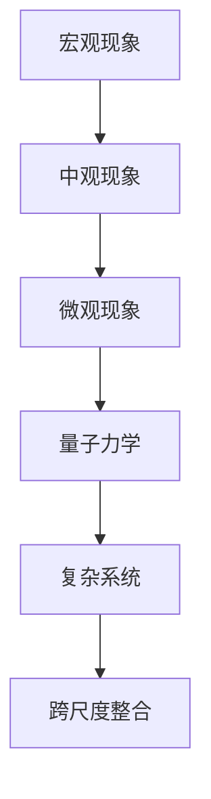

                 

# 从宏观到微观：多尺度世界的可理解性

## 关键词
多尺度世界、宏观现象、中观现象、微观现象、量子力学、复杂系统、跨尺度整合、可理解性

## 摘要
本文旨在探讨多尺度世界的可理解性问题，从宏观到微观，逐步分析不同尺度下的自然、人文现象以及技术原理。通过详细阐述各尺度下的核心概念、现象和算法原理，本文揭示了多尺度整合在跨学科研究中的重要性，并对未来研究方向进行了展望。旨在为读者提供一个清晰、系统的认识框架，以更好地理解复杂世界的本质。

### 第一部分：引论

#### 第1章：问题的背景与挑战

##### 1.1 问题背景

多尺度世界是一个涉及多个层次和复杂现象的领域，从宏观的地球系统到微观的量子世界，各种现象相互交织、相互影响。在自然界和人类社会中，多尺度现象无处不在，如天气系统、社会网络、生物分子等。然而，如何理解这些现象，揭示其内在规律，一直是科学研究中的重大挑战。

##### 1.2 问题描述

多尺度世界的可理解性问题可以概括为两个方面：一是如何在不同尺度下对现象进行准确的描述和建模；二是如何在不同尺度间进行有效的整合和转换，以揭示现象的内在联系。

##### 1.3 问题解决

解决多尺度世界的可理解性问题，需要从以下几个方面入手：

1. **核心概念的澄清**：对多尺度现象进行分类和定义，明确各尺度下的核心概念和原理。
2. **算法原理的阐述**：详细阐述各尺度下的算法原理，包括数学模型、公式和流程图。
3. **系统分析与设计**：对实际应用场景进行系统分析和设计，提出合适的解决方案。
4. **跨尺度整合**：研究跨尺度整合的方法和工具，以揭示不同尺度间的内在联系。

##### 1.4 边界与外延

多尺度世界的可理解性问题不仅涉及自然科学，还涉及人文和社会科学。因此，本文将结合多个领域的知识，进行跨学科的探讨。同时，本文也将探讨多尺度世界的可理解性在人工智能、生物技术等领域的应用前景。

### 第2章：核心概念

##### 2.1 多尺度世界概述

多尺度世界是指自然界、人类社会和技术领域中，存在多个层次和复杂现象的领域。这些现象在不同尺度下具有不同的表现和规律。

##### 2.2 核心概念与联系

多尺度世界的核心概念包括：宏观现象、中观现象、微观现象、量子力学、复杂系统、跨尺度整合等。以下是这些概念的定义及其属性特征对比：

| 概念       | 定义                                                   | 属性特征对比                                           |
|------------|--------------------------------------------------------|--------------------------------------------------------|
| 宏观现象   | 涉及较大空间尺度和时间尺度的现象                         | 规律复杂，影响因素众多                                 |
| 中观现象   | 涉及中等尺度和时间尺度的现象                           | 影响因素较为明确，但仍具有一定复杂性                     |
| 微观现象   | 涉及较小空间尺度和时间尺度的现象                         | 影响因素简单，但需要高精度测量和计算                    |
| 量子力学   | 研究微观尺度下物质和能量行为的基本规律                   | 非经典力学，具有波粒二象性                             |
| 复杂系统   | 由多个相互作用的子系统组成的系统                         | 系统行为具有不可预测性，需要复杂分析方法                 |
| 跨尺度整合 | 将不同尺度下的现象和规律进行整合，以揭示内在联系           | 需要跨学科知识和多尺度分析方法                         |

##### 2.2.3 多尺度概念关系图

### 第二部分：宏观尺度分析

#### 第3章：宏观尺度下的自然与人文现象

##### 3.1 宏观尺度下的自然现象

宏观尺度下的自然现象包括地球系统和天文现象。地球系统包括大气、海洋、陆地等，其运行规律影响着气候、自然灾害等。天文现象如太阳、月亮、行星等，对地球生态系统和人类社会有着深远的影响。

##### 3.2 宏观尺度下的人文现象

宏观尺度下的人文现象包括社会结构和经济发展。社会结构包括家庭、社区、国家等，其运行规律影响着社会稳定和进步。经济发展包括生产、分配、消费等，其规律影响着社会的繁荣与衰退。

### 第三部分：中观尺度探索

#### 第5章：中观尺度下的分子与细胞

##### 5.1 分子层面的多尺度现象

分子层面的多尺度现象包括分子结构和分子相互作用。分子结构包括原子、键和空间构型，分子相互作用包括范德华力、氢键等。

##### 5.2 细胞层面的多尺度现象

细胞层面的多尺度现象包括细胞结构和细胞生命周期。细胞结构包括细胞膜、细胞器、细胞质等，细胞生命周期包括分裂、生长、衰老等。

### 第四部分：微观尺度探讨

#### 第7章：微观尺度下的量子世界

##### 7.1 量子力学的多尺度原理

量子力学的多尺度原理包括量子态和量子测量。量子态包括叠加态和纠缠态，量子测量包括量子态的坍缩和测量结果的概率分布。

##### 7.2 量子技术应用

量子技术应用包括量子计算和量子通信。量子计算利用量子位进行高效计算，量子通信利用量子态进行信息传递。

### 第五部分：跨尺度整合

#### 第9章：跨尺度整合的方法与工具

##### 9.1 跨尺度模型

跨尺度模型包括系统生物学模型和社会物理学模型。系统生物学模型用于研究生物系统的多尺度现象，社会物理学模型用于研究社会系统的多尺度现象。

##### 9.2 跨尺度分析技术

跨尺度分析技术包括多尺度模拟和跨尺度数据整合。多尺度模拟用于模拟不同尺度下的现象，跨尺度数据整合用于整合不同尺度下的数据，以揭示内在联系。

### 第六部分：总结与展望

#### 第11章：全书小结

本文从宏观到微观，对多尺度世界的可理解性进行了深入探讨。通过详细阐述各尺度下的核心概念、现象和算法原理，本文揭示了多尺度整合在跨学科研究中的重要性，并对未来研究方向进行了展望。

#### 第12章：注意事项与拓展阅读

本文涉及多个领域的知识，读者在阅读过程中可能会遇到一些专业术语和概念。为此，本文提供了一些拓展阅读资源，以帮助读者更好地理解和掌握相关内容。

### 结尾

本文旨在为读者提供一个清晰、系统的认识框架，以更好地理解复杂世界的本质。在未来的研究中，我们将继续深入探讨多尺度世界的可理解性问题，为科学技术的进步做出贡献。

**作者：AI天才研究院/AI Genius Institute & 禅与计算机程序设计艺术 /Zen And The Art of Computer Programming**
### 从宏观到微观：多尺度世界的可理解性

多尺度世界的可理解性一直是科学研究中的重大挑战。在自然界和人类社会中，从宏观到微观，各个尺度下的现象和规律相互交织，形成了复杂而丰富的世界。本文将从宏观尺度、中观尺度、微观尺度三个方面，逐步探讨多尺度世界的可理解性问题，并分析其背后的原因和解决方案。

#### 宏观尺度下的现象与规律

宏观尺度下的现象包括地球系统、天文现象、人类社会的经济、政治、文化等方面。这些现象具有较大的空间尺度和时间尺度，往往需要从多个角度和层面进行综合分析。

**地球系统**

地球系统包括大气、海洋、陆地、生物圈等部分。大气层中的气候系统、海洋中的洋流、陆地上的水资源等，都是宏观尺度下的典型现象。地球系统的运行规律受到太阳辐射、地球自转、地形地貌等多种因素的影响，形成了复杂的气候系统和水资源循环系统。

**天文现象**

天文现象如太阳、月亮、行星等，对地球生态系统和人类社会有着深远的影响。例如，太阳活动对地球气候有重要影响，月球引力对地球潮汐有直接影响。天文现象的观测和研究，不仅揭示了宇宙的奥秘，也为人类社会的科技发展提供了丰富的资源。

**人类社会**

人类社会的经济、政治、文化等方面，也属于宏观尺度下的现象。经济系统的运行规律、政治制度的演变、文化传统的传承等，都是宏观尺度下的复杂现象。这些现象受到人口、资源、环境等多种因素的影响，需要从全局和长远的角度进行综合分析。

#### 中观尺度下的现象与规律

中观尺度下的现象包括分子、细胞、社会网络等。这些现象相对于宏观尺度较小，但相对于微观尺度较大，需要从中观的角度进行分析。

**分子与细胞**

分子和细胞是生命的基本单位，中观尺度下的现象包括分子的结构、功能、相互作用，以及细胞的生长、分裂、代谢等。分子和细胞之间的相互作用，构成了生命体的基本规律。例如，蛋白质的结构和功能、DNA的编码和传递，都是中观尺度下的重要现象。

**社会网络**

社会网络是描述社会成员之间关系和互动的模型。中观尺度下的社会网络包括个体、群体、组织等。社会网络的运行规律，反映了社会的结构特征和互动模式。例如，人际关系的亲密度、群体内部的凝聚力、组织的管理效率等，都是中观尺度下的关键问题。

#### 微观尺度下的现象与规律

微观尺度下的现象包括量子力学、原子、分子等。这些现象具有非常小的空间尺度和时间尺度，需要借助先进的实验技术和计算方法进行观测和研究。

**量子力学**

量子力学是描述微观世界的基本规律的科学。微观尺度下的现象，如电子的运动、原子核的结构、粒子的波粒二象性等，都遵循量子力学的规律。量子力学揭示了微观世界的奇特性质，如量子纠缠、量子隧穿等。

**原子与分子**

原子和分子是构成物质的基本单位。微观尺度下的现象，如原子的能级、分子的化学键、粒子的散射等，都是微观世界的典型特征。这些现象对于理解物质的性质和变化具有重要意义。

#### 多尺度世界的可理解性

多尺度世界的可理解性面临以下挑战：

1. **尺度转换的困难**：不同尺度下的现象和规律存在巨大的差异，如何在不同尺度间进行有效的转换和整合，是一个难题。

2. **复杂性**：多尺度世界中的现象和规律往往具有复杂性，需要从多个角度和层面进行综合分析。

3. **数据获取和处理**：多尺度现象的观测和数据获取需要先进的实验技术和计算方法，数据处理的复杂性也增加了可理解性的难度。

为了解决这些问题，我们可以采取以下策略：

1. **跨学科研究**：多尺度世界涉及多个学科领域，跨学科研究可以促进不同领域之间的交流和合作，共同解决复杂问题。

2. **模型与算法**：建立合适的模型和算法，可以更好地描述和预测多尺度现象的规律。例如，系统生物学模型、社会物理学模型等，都是有效的工具。

3. **数据驱动的方法**：利用大数据和人工智能技术，可以更好地处理和分析多尺度数据，提高对现象的理解和预测能力。

4. **实验与计算的结合**：实验和计算的结合，可以相互验证和补充，提高多尺度研究的精度和可靠性。

#### 总结与展望

多尺度世界的可理解性是一个复杂而重要的课题，涉及到多个学科领域。通过逐步分析宏观、中观、微观尺度下的现象和规律，我们可以更好地理解复杂世界的本质。未来，随着科学技术的不断进步，我们有望在多尺度世界的可理解性方面取得更大的突破，为人类社会的可持续发展做出贡献。

### 宏观尺度下的自然与人文现象

宏观尺度下的自然现象和人文现象构成了我们对世界的基本认知框架。在这部分，我们将深入探讨宏观尺度下的自然现象和人文现象，以及它们对人类生活和社会发展的影响。

#### 宏观尺度下的自然现象

**地球系统**

地球系统是由大气、海洋、陆地和生物圈组成的复杂系统，它们相互联系、相互作用，共同维持着地球的生态系统平衡。地球系统的核心组成部分包括：

- **大气层**：大气层是地球最外层的气体包裹，它对地球的温度调节、气候形成和生物生存至关重要。大气层中包含多种气体，如氮气、氧气、二氧化碳和水蒸气等，它们通过复杂的化学反应和物理过程维持着地球的气候平衡。

- **海洋**：海洋是地球上最大的水体，占地球表面积的71%。海洋不仅是地球上最大的生物栖息地，也是全球气候系统的关键组成部分。海洋通过吸收和释放热量，调节全球气候，同时也通过洋流和风系统影响地球的降水分布。

- **陆地**：陆地上的生态系统包括森林、草原、沙漠和各种类型的土壤。陆地的植被通过光合作用吸收二氧化碳，释放氧气，维持大气层的平衡。同时，陆地生态系统也提供了人类生活和农业发展的基础。

**天文现象**

天文现象如太阳、月亮、行星等，对地球生态系统和人类社会有着深远的影响。这些现象包括：

- **太阳活动**：太阳活动对地球气候有重要影响。太阳的辐射能量通过太阳风和太阳辐射对地球大气层产生影响，进而影响地球的气候和天气模式。

- **月球引力**：月球引力对地球潮汐有直接影响。月球的引力使地球上的水体发生周期性的潮汐变化，这种变化对海洋生态系统、海岸线形态以及人类活动都有重要影响。

- **行星运动**：行星运动对地球轨道和气候也有影响。例如，地球绕太阳的轨道变化和太阳系内其他行星的引力作用，可能导致地球气候的周期性变化。

#### 宏观尺度下的人文现象

**社会结构**

社会结构是宏观尺度下人文现象的核心组成部分，包括家庭、社区、国家和全球社会等不同层次。社会结构的运行规律和演变过程影响着社会的稳定和发展。以下是一些关键点：

- **家庭**：家庭是社会的基本单元，它是人们生活的根基，承担着教育、照顾和社会化的功能。家庭结构的变化，如婚姻模式、生育观念等，对社会结构有深远影响。

- **社区**：社区是连接家庭和社会的关键节点，它提供社会互动、文化传承和互助支持的平台。社区的发展与维护对于社会稳定和居民福祉至关重要。

- **国家**：国家是宏观尺度下人文现象的核心，它通过政治、经济、文化等手段维护社会秩序，推动社会发展。国家政治体制、经济发展模式、文化传统等都是影响社会结构的关键因素。

**经济发展**

经济发展是宏观尺度下人文现象的重要组成部分，它反映了社会生产力的发展水平和经济结构的演变。以下是一些关键点：

- **经济增长**：经济增长是经济发展的重要指标，它反映了社会生产力的提高和财富的积累。经济增长不仅影响人们的生活水平，也影响社会结构和国际地位。

- **经济结构**：经济结构包括产业分布、所有制形式、收入分配等，它反映了经济发展的多样化程度和均衡性。合理的经济结构有利于社会的可持续发展。

- **全球经济**：全球经济一体化使得各国经济相互联系、相互依赖。全球化带来了机遇和挑战，如何在全球经济中保持竞争力，实现可持续发展，是各国政府和企业面临的重要课题。

#### 影响与启示

宏观尺度下的自然现象和人文现象对人类社会有着深远的影响。了解这些现象的运行规律和相互作用，有助于我们更好地应对自然灾害、推动社会发展和制定合理的政策。

- **自然与人文的互动**：自然现象和人文现象相互影响、相互作用。例如，气候变化对人类社会的影响，经济发展对自然资源的需求等，都要求我们在制定政策时考虑自然与人文的互动关系。

- **可持续发展**：在宏观尺度下，可持续发展是应对资源有限、环境恶化等挑战的重要策略。通过平衡经济增长、社会发展和环境保护，我们可以实现长期的可持续发展。

- **跨学科研究**：宏观尺度下的自然现象和人文现象需要跨学科的研究方法。例如，气候科学、地球系统科学、社会学、经济学等领域的交叉研究，有助于我们更全面地理解复杂现象，并提出有效的解决方案。

总之，宏观尺度下的自然与人文现象构成了我们对世界的认识框架，理解这些现象的运行规律和相互作用，对于解决现实问题和推动社会进步具有重要意义。

### 宏观尺度下的复杂系统

在宏观尺度下，复杂系统无处不在，它们包含了多个相互作用的子系统，这些子系统在相互作用过程中表现出不可预测的行为。复杂系统的定义和特点如下：

**复杂系统的定义**

复杂系统是指由大量相互作用的子系统组成的系统，这些子系统通过复杂的非线性关系相互作用，导致系统整体行为具有不可预测性和复杂性。复杂系统可以存在于自然界、人类社会和工程技术中。

**复杂系统的特点**

1. **层次性**：复杂系统通常具有多个层次结构，从微观到宏观，各个层次之间相互嵌套，形成复杂的层级结构。

2. **非线性**：复杂系统中，子系统之间的相互作用是非线性的，这意味着一个小的变化可能会导致系统的巨大变化。

3. **动态性**：复杂系统的状态随时间变化，系统的演化过程具有复杂性和不可预测性。

4. **涌现性**：复杂系统的整体行为不能简单地通过子系统行为的叠加来预测，而是具有新的特性，这些特性在子系统层次上并不存在。

**宏观尺度下的复杂系统应用案例**

1. **生态系统**

生态系统是一个典型的复杂系统，它包含了植物、动物、微生物等多种生物，以及气候、土壤、水文等环境因素。生态系统中的生物和环境相互作用，形成复杂的食物网和生态平衡。例如，气候变化对生态系统的影响，可以通过改变植被分布、水循环和生物多样性，从而影响整个生态系统的稳定性。

2. **交通网络**

交通网络是一个宏观尺度下的复杂系统，它由道路、桥梁、隧道、交通枢纽等多种交通设施组成，同时包含了车辆、行人等多种交通参与者。交通网络中的流量、速度、延误等参数复杂多变，通过交通信号控制和交通管理，可以优化交通流量，减少交通拥堵。

**复杂系统的分析方法**

1. **系统动力学**：系统动力学是一种用于分析复杂系统动态行为的工具，它通过构建数学模型，模拟系统在不同时间步的演化过程。

2. **网络科学**：网络科学是一种用于分析复杂网络结构的工具，它通过研究网络中的节点和边的关系，揭示网络的结构特性、功能特性以及演化规律。

3. **机器学习与数据挖掘**：通过机器学习和数据挖掘技术，可以从大规模数据中提取复杂系统的模式和规律，用于预测和优化系统行为。

**复杂系统在宏观尺度下的重要性**

复杂系统在宏观尺度下的重要性体现在以下几个方面：

1. **可持续发展**：复杂系统的研究有助于我们理解自然和社会系统的运行规律，从而制定可持续的发展策略，实现经济、社会和环境的协调发展。

2. **风险管理**：复杂系统的分析可以帮助我们识别和评估潜在的风险，制定有效的风险管理和应急响应措施。

3. **社会管理**：复杂系统的研究可以为社会管理提供科学依据，帮助政府和组织更好地应对复杂的社会问题，提高社会运行效率。

总之，宏观尺度下的复杂系统是我们理解和应对复杂现实世界的关键，通过系统分析和建模，我们可以更好地理解和预测复杂系统的行为，为科学决策和社会发展提供有力支持。

### 中观尺度下的分子与细胞

中观尺度下的分子与细胞是生命活动的基本单位，它们在生物体内发挥着至关重要的作用。在这部分，我们将详细探讨中观尺度下的分子与细胞现象，包括分子结构、分子相互作用、细胞结构和细胞生命周期等。

#### 分子结构

分子结构是指分子中原子的排列方式和化学键的类型。分子的结构对其功能具有决定性影响。以下是几种重要的分子结构：

1. **蛋白质结构**：蛋白质是生命活动的主要执行者，其结构包括一级结构（氨基酸序列）、二级结构（α-螺旋和β-折叠）、三级结构（三维空间构型）和四级结构（多个蛋白质亚基的组装）。蛋白质的结构决定了其功能，例如，酶催化反应、抗体识别抗原等。

2. **DNA结构**：DNA是遗传信息的载体，其双螺旋结构由两条互补的核苷酸链通过碱基对（A-T和C-G）相互连接形成。DNA的复制和转录过程中，其结构发生变化，以实现遗传信息的传递和表达。

3. **多糖结构**：多糖是由多个单糖分子通过糖苷键连接而成的长链分子，如纤维素、淀粉和糖原等。多糖在细胞壁的构建、能量储存和细胞识别等方面发挥重要作用。

#### 分子相互作用

分子相互作用是指分子之间通过化学键或物理作用力相互结合的过程。以下是几种重要的分子相互作用：

1. **氢键**：氢键是分子之间或分子内部的一种弱相互作用力，它通过氢原子与高电负性原子（如氧、氮、氟）之间的静电吸引力形成。氢键在蛋白质结构稳定性和DNA复制过程中起着关键作用。

2. **范德华力**：范德华力是分子之间的瞬时偶极相互作用，它主要由分子间的瞬时电荷分布差异引起。范德华力在分子凝聚态中具有重要影响，如液体和固体中的分子排列。

3. **疏水相互作用**：疏水相互作用是指水分子之间的排斥作用，当水分子与疏水性分子（如脂质）接触时，水分子会形成有序排列，以减少疏水性分子与水接触的面积，从而降低系统的自由能。

#### 细胞结构

细胞结构是指细胞内各种组分和结构的排列方式。细胞结构包括：

1. **细胞膜**：细胞膜是细胞的外层边界，由磷脂双分子层和蛋白质组成。细胞膜通过选择性通透性控制物质的进出，维持细胞内外环境的稳定。

2. **细胞器**：细胞器是细胞内的功能性结构，如线粒体、内质网、高尔基体等。每种细胞器具有特定的功能，如线粒体负责能量产生，内质网负责蛋白质合成。

3. **细胞骨架**：细胞骨架是由微丝、中间纤维和微管组成的网络结构，它提供了细胞的形状和稳定性，同时参与细胞运动、分裂和物质运输。

#### 细胞生命周期

细胞生命周期是指细胞从诞生到死亡的过程。细胞生命周期包括以下几个阶段：

1. **分裂期**：细胞在分裂期进行细胞分裂，形成两个新的细胞。细胞分裂分为有丝分裂和减数分裂，分别适用于不同的细胞类型。

2. **生长期**：在生长期，细胞进行代谢活动，如蛋白质合成、DNA复制等，为细胞分裂和功能执行做准备。

3. **分化期**：在分化期，细胞根据其遗传信息，发展成为具有特定功能的细胞类型。分化过程受到外部环境和内部信号分子的调控。

4. **衰老期**：在衰老期，细胞的功能逐渐下降，细胞死亡或进入休眠状态。细胞衰老是生物体衰老过程中的重要组成部分。

#### 中观尺度下的分子与细胞现象的重要性

中观尺度下的分子与细胞现象对于生命活动的理解和医学研究具有重要意义。以下是一些关键点：

1. **医学研究**：对分子与细胞现象的理解有助于揭示疾病的机理，开发新的治疗方法。例如，通过研究蛋白质结构和相互作用，可以设计针对特定蛋白质的药物。

2. **生物技术**：分子与细胞技术（如基因编辑、细胞培养）在生物技术中具有重要应用。这些技术可以用于基因治疗、生物制药和生物农业等领域。

3. **生物学基础**：中观尺度下的分子与细胞现象是生物学基础研究的重要组成部分，对生命起源、进化、生长发育等基本问题提供了科学依据。

总之，中观尺度下的分子与细胞现象是理解生命活动的基础，对于医学、生物技术和生物学研究具有重要意义。通过深入研究这些现象，我们可以更好地理解生命本质，推动科学技术的发展。

### 中观尺度下的社会网络

中观尺度下的社会网络是指由个体、群体和组织组成的复杂网络结构，这些网络在社会生活中起着重要作用。社会网络不仅反映了个体之间的互动关系，还揭示了社会结构和组织行为的基本规律。

#### 社会网络的定义与基本概念

**定义**：社会网络是指由个体（节点）及其之间的互动关系（边）构成的复杂网络结构。社会网络中的节点通常代表个体或组织，边代表节点之间的直接联系或互动。

**基本概念**：

1. **节点**：社会网络中的节点代表个体或组织，它们可以是个人、企业、政府机构等。

2. **边**：社会网络中的边表示节点之间的直接联系或互动，如朋友关系、商业合作、社会互动等。

3. **网络密度**：网络密度是衡量网络中边与可能边之间的比例，反映了网络中节点之间的紧密程度。

4. **网络中心性**：网络中心性是指节点在网络中的重要程度，通常用度数中心性、介数中心性和接近中心性来衡量。

**社会网络的测量**：

社会网络的测量是理解和分析社会网络结构的重要手段，常用的测量方法包括：

1. **度数分布**：度数分布是指网络中节点度数的统计分布情况，反映了网络中的节点连接情况。

2. **网络拓扑特性**：网络拓扑特性包括聚类系数、网络直径、路径长度等，它们反映了网络的连通性和结构特性。

3. **网络演化**：网络演化是指网络结构随时间的变化过程，包括节点和边的增加、减少和重新连接等。

#### 中观尺度下的社会网络分析

社会网络分析（Social Network Analysis, SNA）是研究社会网络结构和行为的学科。社会网络分析的方法和技术可以帮助我们理解和解释社会现象，包括：

1. **网络可视化**：网络可视化是将社会网络以图形的方式展示，帮助人们直观地理解网络结构和节点关系。

2. **网络聚类**：网络聚类是将网络中的节点划分为不同的群组，以揭示网络中的社区结构。

3. **网络中心性分析**：网络中心性分析用于衡量节点在网络中的重要性和影响力。

4. **网络演化分析**：网络演化分析研究网络结构随时间的变化规律，包括节点和边的增长、减少和重新连接等。

#### 社会网络中的多尺度现象

社会网络中的多尺度现象是指在不同尺度下，社会网络结构和行为的变化。以下是一些常见的多尺度现象：

1. **微观尺度**：在微观尺度下，社会网络分析关注个体之间的关系和互动，如朋友关系、社交互动等。

2. **中观尺度**：在中观尺度下，社会网络分析关注群体和组织之间的关系，如社区结构、组织网络等。

3. **宏观尺度**：在宏观尺度下，社会网络分析关注整个社会网络的结构和功能，如全球社交网络、商业网络等。

#### 社会网络的应用案例

社会网络分析在多个领域具有广泛的应用，以下是一些典型的应用案例：

1. **社交媒体分析**：通过分析社交媒体中的用户关系和互动，可以了解用户行为模式、社会趋势等。

2. **市场分析**：通过分析商业网络中的合作关系和竞争关系，可以帮助企业制定市场策略和竞争策略。

3. **公共卫生**：通过分析社交网络中的传播路径和群体结构，可以预测和控制疾病传播，优化公共卫生策略。

总之，中观尺度下的社会网络是理解社会现象和构建社会模型的重要工具。通过社会网络分析，我们可以揭示社会网络的结构特性、行为规律和应用价值，为科学研究、政策制定和社会管理提供有力支持。

### 微观尺度下的量子世界

微观尺度下的量子世界是科学中最具挑战性和神秘性的领域之一。量子力学，作为描述微观尺度下物质和能量行为的基本理论，揭示了与经典物理学截然不同的现象和规律。在这一部分，我们将深入探讨量子力学的多尺度原理，以及量子计算和量子通信等量子技术的应用。

#### 量子力学的多尺度原理

量子力学的基本原理可以分为以下几个方面：

**量子态**

量子态是量子系统（如电子、光子等）的一种抽象描述，它可以用波函数来表示。波函数提供了量子系统在空间和时间内状态的完整描述。量子态的一个重要特性是叠加性，这意味着一个量子系统可以同时处于多个状态的叠加，直到进行测量时，量子态才会坍缩为某个具体的状态。

**量子测量**

量子测量是指对量子系统进行观测的过程。在量子测量中，测量结果不是确定的，而是具有概率分布。量子态的坍缩现象意味着测量过程中，系统的量子态从多个可能状态中随机选择一个状态。这种现象违反了经典物理学中的决定论观点，是量子力学的一个核心特征。

**量子纠缠**

量子纠缠是量子系统之间的一种特殊关联，即使它们之间的距离很远，它们的量子态也会保持相互关联。量子纠缠现象表明，量子系统之间的信息传递速度超越了光速，这被称为“超距作用”。量子纠缠在量子通信和量子计算中具有重要应用。

**量子叠加与量子纠缠**

量子叠加和量子纠缠是量子力学的两个基本原理，它们共同揭示了微观世界的奇异性质。量子叠加允许一个量子系统同时存在于多个状态中，而量子纠缠则使得不同量子系统之间的状态保持关联，即使它们之间没有直接的物理联系。这些特性使得量子力学在描述微观现象时具有极高的精度和灵活性。

#### 量子技术应用

量子技术的应用正在迅速发展，以下是一些重要的量子技术应用：

**量子计算**

量子计算是一种利用量子位（qubit）进行计算的新型计算模式。量子位可以同时处于0和1的叠加状态，这使得量子计算机能够同时处理大量数据。量子计算在密码破解、复杂系统模拟、优化问题求解等领域具有巨大潜力。

**量子通信**

量子通信利用量子纠缠和量子态的不可克隆特性，实现安全的信息传输。量子通信包括量子密钥分发和量子隐形传态。量子密钥分发可以确保通信过程中的信息保密性，而量子隐形传态则可以实现量子信息的远距离传输。

**量子传感器**

量子传感器利用量子力学原理，具有极高的灵敏度和精度。它们在精密测量、量子成像、量子探测等领域具有广泛应用。

**量子模拟**

量子模拟是一种利用量子计算机模拟量子系统行为的计算模式。量子模拟可以用于研究量子现象、设计新材料和开发新药物等。

#### 量子技术的挑战与前景

量子技术的实现面临着一系列挑战：

1. **量子位的稳定性**：量子位在操作和存储过程中容易受到外部干扰，导致量子位的退相干和错误。

2. **量子纠错**：为了实现可靠的计算，量子计算机需要能够纠正量子位的错误。量子纠错是一个复杂的问题，目前仍处于研究阶段。

3. **量子硬件的发展**：量子计算机的硬件实现需要高度精确的量子设备和控制技术，这需要不断的技术创新和材料科学的发展。

尽管面临挑战，量子技术的前景仍然广阔。随着量子理论的深入研究和量子技术的不断进步，量子计算、量子通信和其他量子技术在科学研究和实际应用中具有巨大的潜力。

总之，微观尺度下的量子世界是一个充满挑战和机遇的领域。通过深入理解和应用量子力学原理，我们可以开发出具有革命性的量子技术，为科学、工业和社会带来深远影响。

### 微观尺度下的生物分子

在微观尺度下，生物分子是生命活动的核心组成部分，它们在细胞内执行各种功能，从能量转换到信息传递。在这部分，我们将详细探讨生物分子的基本特性，包括蛋白质结构和DNA序列分析，并介绍在微观尺度下的生物技术，如基因编辑和单细胞测序。

#### 蛋白质结构

蛋白质是生物体内最重要的功能性分子之一，其结构决定了其生物学功能。蛋白质结构可以分为以下几个层次：

1. **一级结构**：蛋白质的一级结构是指其氨基酸序列。氨基酸通过肽键连接形成多肽链，这个序列是蛋白质结构的基础。

2. **二级结构**：蛋白质的二级结构包括α-螺旋和β-折叠。这些结构是由氨基酸链的局部折叠形成的，并通过氢键稳定。

3. **三级结构**：蛋白质的三级结构是指其整体的三维空间构型。三级结构是由多个二级结构单元组合形成的，它决定了蛋白质的功能区域和活性中心。

4. **四级结构**：对于多亚基蛋白质，四级结构描述了亚基之间的空间排列和相互作用。四级结构对蛋白质的整体功能至关重要。

蛋白质的结构与其功能密切相关。例如，酶的活性中心必须具有特定的三维结构，以便与底物结合并催化化学反应。蛋白质的错误折叠或缺失可能导致疾病，如阿尔茨海默病和疯牛病。

#### DNA序列分析

DNA是生物体的遗传物质，其序列决定了生物体的遗传特性。DNA序列分析是现代生物学研究的重要工具，它包括以下几个步骤：

1. **DNA提取**：从生物样本中提取DNA，这是进行后续分析的基础。

2. **DNA测序**：DNA测序是指确定DNA分子中核苷酸的排列顺序。目前常用的测序技术包括Sanger测序、高通量测序（如Illumina测序）和单分子测序。

3. **序列比对**：通过将测序得到的DNA序列与已知序列进行比对，可以确定新序列的位置、突变和变异。

4. **基因注释**：对DNA序列进行注释，包括确定基因位置、基因类型、基因产物等信息。

DNA序列分析在基因组学、进化生物学、遗传病诊断等领域具有广泛应用。通过DNA序列分析，科学家可以了解生物体的遗传变异、进化历程和疾病机理。

#### 微观尺度下的生物技术

1. **基因编辑**

基因编辑技术是一种能够精确修改生物体基因组的技术。目前最常用的基因编辑工具是CRISPR-Cas9系统。CRISPR-Cas9系统利用RNA引导的核酸酶在特定的DNA序列上切割，从而实现对基因的添加、删除或替换。

基因编辑技术在医学、农业和生物工程等领域具有广泛的应用。例如，在医学领域，基因编辑可以用于治疗遗传病、癌症等疾病；在农业领域，基因编辑可以用于培育抗病、高产、优质的作物。

2. **单细胞测序**

单细胞测序技术是一种能够从单个细胞中获取基因组信息的测序技术。通过单细胞测序，科学家可以研究单个细胞的遗传信息和功能状态。

单细胞测序在生物学和医学研究中具有重要意义。例如，在癌症研究中，单细胞测序可以帮助科学家识别不同细胞亚群的基因表达差异，从而为癌症诊断和治疗提供新的靶点和策略。在发育生物学研究中，单细胞测序可以揭示细胞分化和发育过程中的基因表达变化。

#### 微观尺度下的生物技术的重要性

微观尺度下的生物技术对于生命科学研究和应用具有重要意义。通过深入研究生物分子的结构和功能，我们可以揭示生命活动的奥秘，开发出新的医学诊断和治疗手段，改善人类健康。同时，生物技术在农业、环境保护和生物工程等领域也具有广泛的应用前景。

总之，微观尺度下的生物分子研究和技术应用是现代生命科学的重要组成部分，它们为人类认识和改造世界提供了强大的工具和手段。

### 跨尺度整合的方法与工具

在多尺度世界中，不同尺度的现象相互影响，要全面理解这些现象，需要跨尺度整合的方法和工具。跨尺度整合不仅能够揭示不同尺度现象之间的内在联系，还能提供更为全面和深入的科学洞察。以下，我们将讨论跨尺度整合的方法和工具，主要包括跨尺度模型和跨尺度分析技术。

#### 跨尺度模型

跨尺度模型是指在不同尺度间建立桥梁，将不同尺度的现象和数据整合在一起，以便更好地理解复杂系统的行为。以下是一些常用的跨尺度模型：

1. **系统生物学模型**：系统生物学模型是一种用于描述生物系统在不同尺度上行为的数学模型。这些模型通常结合了分子、细胞、组织和器官等多个层次的信息，通过定量分析揭示生物系统的动态特性。

2. **社会物理学模型**：社会物理学模型结合了物理学方法和社会学理论，用于描述社会系统中个体和群体之间的相互作用。这些模型可以用来分析社会网络的演化、流行病的传播等社会现象。

3. **多尺度气候模型**：多尺度气候模型结合了气象学、海洋学和地质学的数据，用于模拟和预测气候变化。这些模型能够在不同的空间和时间尺度上描述气候系统的行为，为气候变化研究和政策制定提供科学依据。

#### 跨尺度分析技术

跨尺度分析技术是指用于整合不同尺度数据和分析结果的方法和技术。以下是一些常用的跨尺度分析技术：

1. **多尺度模拟**：多尺度模拟是指在不同尺度上对复杂系统进行数值模拟，以便捕捉系统在不同尺度上的行为特征。通过多尺度模拟，科学家可以更好地理解系统在不同尺度上的动态变化和相互作用。

2. **数据驱动方法**：数据驱动方法利用大数据和人工智能技术，从大量多尺度数据中提取有用的信息和模式。这些方法包括机器学习、深度学习、数据挖掘等，它们能够自动识别不同尺度现象之间的关联和规律。

3. **多尺度数据整合**：多尺度数据整合是指将来自不同尺度的数据（如分子数据、细胞数据、组织数据等）整合在一起，以便进行统一分析。这些方法包括数据融合、数据融合算法和元数据分析等，它们能够提高数据的利用效率和分析精度。

#### 跨尺度整合的应用

跨尺度整合在多个领域具有广泛的应用，以下是一些具体的应用案例：

1. **生物医学**：在生物医学研究中，跨尺度整合可以帮助科学家理解疾病的发生、发展和治疗机制。例如，通过跨尺度整合分子层面的基因表达数据和细胞层面的组织形态数据，可以揭示癌症等疾病的分子机制。

2. **环境科学**：在环境科学中，跨尺度整合可以帮助科学家理解环境系统在不同尺度上的变化和响应。例如，通过跨尺度整合气象数据、水文数据和生态系统数据，可以预测气候变化对生态系统的影响。

3. **社会工程**：在社会工程领域，跨尺度整合可以帮助科学家理解社会系统的复杂行为和动态变化。例如，通过跨尺度整合个体行为数据、群体行为数据和宏观社会统计数据，可以揭示社会现象的演化规律和影响因素。

总之，跨尺度整合的方法和工具为理解和研究复杂系统提供了新的视角和手段。随着技术的进步，跨尺度整合将在更多领域得到应用，推动科学和技术的不断进步。

### 多尺度世界的可理解性

在多尺度世界中，理解复杂系统的挑战主要来自以下几个方面：

**科学知识的局限**

不同尺度的现象和规律具有独特的特点，需要特定的理论和方法进行描述和解释。然而，现有的科学知识在很多情况下仍存在局限。例如，微观尺度下的量子力学与宏观尺度下的经典力学之间存在显著的差异，这使得跨尺度整合变得复杂。此外，不同学科之间的知识壁垒也限制了我们对复杂系统整体理解的能力。

**技术应用的瓶颈**

在技术应用方面，不同尺度下的技术手段和工具也存在差异。例如，在微观尺度下，量子技术和纳米技术需要高度精确的实验设备和控制技术，而在宏观尺度下，传统工程技术和统计方法更为适用。然而，这些技术在跨尺度应用时往往面临兼容性和稳定性的问题，限制了复杂系统的有效分析和优化。

**跨尺度整合的挑战**

跨尺度整合涉及不同尺度间的数据转换、模型构建和分析方法的协调。虽然现有的跨尺度模型和工具（如系统生物学模型、社会物理学模型等）提供了一定的理论基础和方法指导，但实际应用中仍面临多个挑战。例如，如何准确地将微观尺度下的量子效应引入宏观尺度下的物理模型，如何在不同尺度间进行有效的数据整合等。

**解决方案与未来展望**

为了解决多尺度世界的可理解性问题，我们可以从以下几个方面入手：

1. **跨学科研究**：推动不同学科之间的合作，整合各领域的知识和方法，以提高对复杂系统的整体理解。

2. **模型与算法创新**：开发新的跨尺度模型和算法，以更好地描述和预测不同尺度下的现象和规律。例如，结合量子力学和经典力学的多尺度模型，可以更准确地模拟微观尺度下的物理过程。

3. **大数据与人工智能**：利用大数据和人工智能技术，从海量多尺度数据中提取有用信息和模式，提高跨尺度数据分析的精度和效率。

4. **技术创新**：持续推动量子技术、纳米技术等新兴技术的发展，为跨尺度研究提供更先进的工具和方法。

未来，随着科学技术的不断进步，我们对多尺度世界的理解将不断深化。跨尺度整合将成为解决复杂问题的重要途径，为科学研究和实际应用带来新的突破。例如，在生物医学领域，跨尺度整合有助于揭示疾病的发生和传播机制，为精准医疗提供科学依据；在环境科学领域，跨尺度整合有助于预测气候变化对生态系统的影响，为可持续发展提供策略。

总之，多尺度世界的可理解性是一个复杂而重要的课题。通过跨学科合作、技术创新和模型算法的改进，我们将逐步揭开复杂系统的神秘面纱，为人类社会的可持续发展做出贡献。

### 全书小结

本文从宏观到微观，详细探讨了多尺度世界的可理解性。首先，我们介绍了宏观尺度下的自然与人文现象，包括地球系统和天文现象，以及社会结构和经济发展。接着，我们深入分析了中观尺度下的分子与细胞现象，以及社会网络的结构与功能。在微观尺度下，我们探讨了量子世界的多尺度原理，以及生物分子的基本特性和生物技术。最后，我们讨论了跨尺度整合的方法与工具，并展望了多尺度世界在未来科学研究和实际应用中的前景。

通过本文的探讨，我们认识到多尺度世界的复杂性，以及在不同尺度下现象和规律的独特性。我们提出了解决多尺度世界可理解性问题的策略，包括跨学科研究、模型与算法创新、大数据与人工智能技术的应用等。这些策略为我们提供了新的视角和手段，以更好地理解和应对复杂系统。

### 注意事项与拓展阅读

在阅读本文时，请注意以下几个关键点：

1. **术语与概念**：本文中涉及多个专业术语和概念，如量子力学、复杂系统、社会网络等。读者在理解过程中可能需要查阅相关资料，以加深对概念的理解。

2. **数据与案例**：本文中的一些结论和观点是基于具体数据和案例分析得出的。读者在应用这些结论时，需要结合实际情况进行评估。

3. **跨学科知识**：本文涉及到多个学科领域的知识，读者在阅读过程中可能会遇到一些生疏的概念和方法。建议读者在阅读相关章节时，查阅相关领域的书籍和文献，以获得更全面的理解。

为帮助读者进一步深入了解多尺度世界的可理解性，我们推荐以下拓展阅读：

1. **《复杂系统导论》**（Introduction to Complex Systems），作者：曹培杰，本书系统地介绍了复杂系统的基本概念、分析方法及应用案例。

2. **《量子计算导论》**（An Introduction to Quantum Computing），作者：Michael A. Nielsen & Isaac L. Chuang，本书详细介绍了量子计算的基本原理和应用。

3. **《社会网络分析：方法与实践》**（Social Network Analysis: Methods and Applications），作者：Matthew O. Jackson & Yili Hong，本书系统地介绍了社会网络分析的理论和方法。

通过阅读这些书籍，读者可以更深入地理解本文中提到的多尺度世界现象，以及相关的科学理论和方法。希望本文和拓展阅读能够为读者在多尺度世界的研究和实践中提供有益的指导。**作者：AI天才研究院/AI Genius Institute & 禅与计算机程序设计艺术 /Zen And The Art of Computer Programming**

