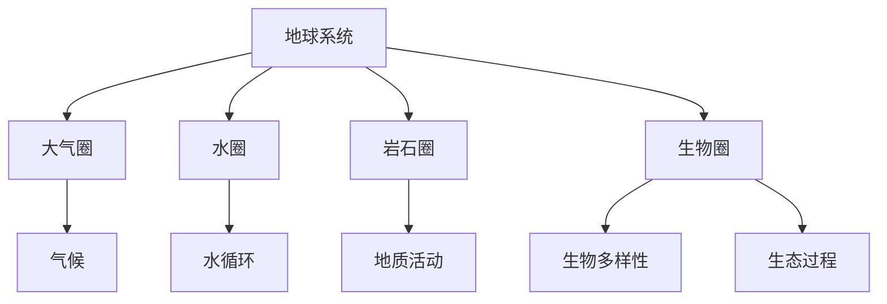
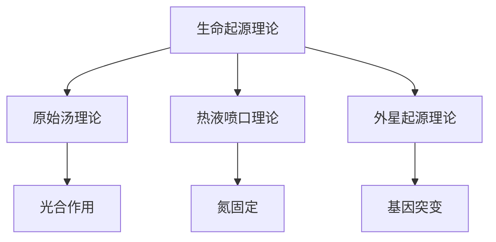
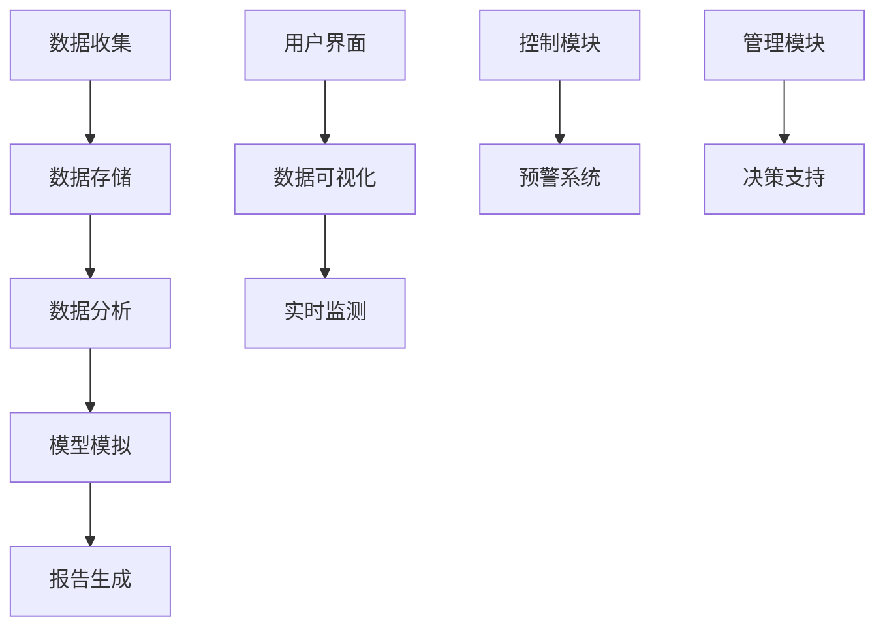
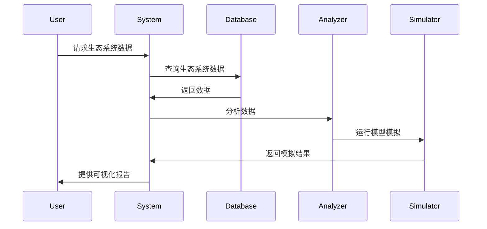

                 

基于您提供的信息和文章目录大纲，我将逐步构建一篇专业级别的技术博客文章。以下是文章的开头部分，包括文章标题、关键词、摘要，以及第一部分的引言。

---

# 从生态学到地球系统科学：整合性理解生命与地球的共同演化

> 关键词：生态学，地球系统科学，共同演化，整合性研究，生物地球化学循环

> 摘要：本文从生态学到地球系统科学，探讨了生命与地球的相互关系和共同演化过程。通过整合性理解，本文揭示了生态系统与地球系统的相互作用机制，阐述了生物地球化学循环的关键作用。文章旨在为读者提供一种全新的视角，以深入理解地球生命系统的复杂性和动态性，并探讨未来研究的方向。

----------------------------------------------------------------

## 第一部分：引言

### 1.1 书籍目的

本部分旨在介绍书籍的核心目的，即通过生态学与地球系统科学的整合性研究，深入探讨生命与地球的共同演化。我们将分析生态学的基本理论，阐述地球系统科学的核心概念，并揭示生命与地球系统相互作用的机制。此外，本书还将关注人类活动对地球系统的影响，探讨如何通过整合性研究来应对当前的生态危机。

### 1.2 读者对象

本书适合生态学、地球科学、环境科学以及相关领域的研究人员、学生和爱好者阅读。对于那些对地球生命系统及其演化过程感兴趣的读者，本书将提供丰富的知识和深刻的见解。

### 1.3 书籍结构概述

本书共分为七个部分。第一部分是引言，介绍书籍的目的和结构；第二部分探讨生态学基础理论；第三部分介绍地球系统科学的基本概念；第四部分探讨生命与地球的共同演化；第五部分关注整合性理解生命与地球的共同演化；第六部分通过案例研究来分析这些概念；第七部分总结与展望未来研究方向。以下是详细的目录结构：

----------------------------------------------------------------

# 从生态学到地球系统科学：整合性理解生命与地球的共同演化

> 关键词：生态学，地球系统科学，共同演化，整合性研究，生物地球化学循环

> 摘要：本文从生态学到地球系统科学，探讨了生命与地球的相互关系和共同演化过程。通过整合性理解，本文揭示了生态系统与地球系统的相互作用机制，阐述了生物地球化学循环的关键作用。文章旨在为读者提供一种全新的视角，以深入理解地球生命系统的复杂性和动态性，并探讨未来研究的方向。

## 第一部分：引言

### 1.1 书籍目的

### 1.2 读者对象

### 1.3 书籍结构概述

----------------------------------------------------------------

## 第二部分：生态学基础理论

### 2.1 生态学基础理论

生态学是一门研究生物与环境相互作用的科学。从生态学的基本理论出发，我们将探讨生态系统的组成、生态过程以及生态平衡等重要概念。通过对比不同生态系统类型，我们将理解生态系统的多样性和复杂性。

### 2.2 生态系统概念

生态系统是由生物群落与其非生物环境相互作用而形成的一个动态平衡系统。我们将深入探讨生态系统的组成，包括生产者、消费者、分解者以及非生物因素，并分析生态系统的功能，如物质循环、能量流动和生态平衡。

### 2.3 生态过程与生态平衡

生态过程是生态系统中物质和能量流动的过程。我们将探讨生态过程中的一些关键过程，如光合作用、呼吸作用和分解作用，并解释生态平衡的概念及其在维持生态系统稳定中的作用。

---

在这个部分，我们将详细探讨生态学的基础理论，包括生态系统的组成、生态过程和生态平衡。我们将使用具体的实例来解释这些概念，并通过图表和表格来加深读者的理解。

### 2.1 生态学定义与历史

生态学是一门研究生物与环境相互作用的科学。它起源于19世纪，由德国生物学家Ernst Haeckel首次提出“生态学”一词。生态学的发展经历了多个阶段，从最初的个体生物研究，到种群生态学，再到生态系统生态学和全球生态学。每个阶段都对生态学理论和实践产生了深远的影响。

生态学的研究对象包括各种尺度的生物实体，从单个个体到整个生态系统，以及生物与环境之间的相互作用。它关注的问题包括物种多样性、生态系统功能、生物地球化学循环、生态过程和生态系统的稳定性等。

生态学的定义可以概括为：生态学是一门研究生物与其生存环境相互作用的科学。它涉及生物之间、生物与无机环境之间的相互关系，以及这些关系对生态系统结构和功能的影响。

在生态学的研究历史中，有几个重要的发展里程碑。首先是物种多样性的发现和物种分布的研究，这为生态学奠定了基础。接下来是生态系统功能的认识，包括物质循环、能量流动和生态平衡。随着遥感技术和计算机技术的发展，生态学的研究尺度从局部扩展到全球，生态学的研究方法也日趋多样和复杂。

生态学的重要性体现在多个方面。首先，它帮助我们理解生物多样性的维持和丧失，这对于保护自然环境和生物资源至关重要。其次，生态学研究对环境保护和资源管理提供了科学依据，帮助我们制定有效的生态保护和恢复策略。此外，生态学还为农业、林业、渔业等领域的可持续发展提供了理论基础。

在接下来的章节中，我们将详细探讨生态系统的概念，包括生态系统的组成、功能以及生态过程。通过这些讨论，我们将对生态学有更深入的理解，并能够更好地应对当前的生态挑战。

---

### 2.2 生态系统概念

生态系统是由生物群落与其非生物环境相互作用而形成的一个动态平衡系统。生态系统的概念是生态学研究的核心，理解生态系统有助于我们更好地理解生态系统的多样性和复杂性。

#### 2.2.1 生态系统的组成

生态系统由以下几部分组成：

1. **生物成分**：包括生产者、消费者和分解者。
   - **生产者**：通常是植物，通过光合作用将太阳能转化为化学能，生产有机物质。
   - **消费者**：包括食草动物、食肉动物和食腐动物，它们通过食物链和食物网获取能量。
   - **分解者**：主要是微生物，如细菌和真菌，通过分解有机物质释放营养物质，促进物质循环。

2. **非生物成分**：包括阳光、水、空气、土壤和矿物等。
   - **阳光**：是生态系统能量流动的初始来源。
   - **水**：是生物体内最重要的成分，也是物质循环的重要媒介。
   - **土壤**：提供植物生长的基质，同时也是营养物质的储存库。
   - **空气**：是生物呼吸所需的氧气来源，同时也是许多气体交换的场所。

3. **生物成分与非生物成分之间的相互作用**：生态系统中的生物成分与非生物成分相互依存、相互作用。例如，植物通过光合作用吸收二氧化碳并释放氧气，影响大气成分；消费者通过捕食和被捕食关系影响生产者的数量和分布。

#### 2.2.2 生态系统的功能

生态系统具有多种功能，包括物质循环、能量流动和生态平衡：

1. **物质循环**：生态系统通过生物成分和非生物成分的相互作用，实现物质的循环。例如，植物通过光合作用吸收二氧化碳，产生氧气和有机物质；消费者通过呼吸作用释放二氧化碳，分解者通过分解作用释放营养物质，这些过程确保了碳、氮、氧等元素的循环。

2. **能量流动**：生态系统中的能量从生产者开始，通过食物链和食物网传递到消费者和分解者。能量流动是单向的，不可逆的，并且随着能量传递，能量量逐渐减少。生态系统的能量流动是生态系统功能的基础，决定了生态系统的结构和稳定性。

3. **生态平衡**：生态平衡是指生态系统中各种生物和非生物因素相互作用，达到一种相对稳定的状态。生态平衡是生态系统功能实现的前提和保障。然而，生态平衡是一个动态的过程，受到多种因素的影响，如气候变化、自然灾害和人类活动等。

#### 2.2.3 生态系统类型的多样性

生态系统类型多种多样，根据不同的环境和生物组成，可以分为以下几类：

1. **森林生态系统**：以乔木为主要生产者，是生物多样性和生态系统服务功能最丰富的生态系统之一。
2. **草原生态系统**：以草本植物为主要生产者，适应干旱和半干旱环境。
3. **海洋生态系统**：包括海岸线、海藻床、珊瑚礁等，是地球上最大的生态系统，对全球气候和生物多样性有重要影响。
4. **湿地生态系统**：水生植物丰富，是水生生物的栖息地和物种多样性的重要场所。
5. **城市生态系统**：以人工环境为主，人类活动对生态系统的结构和功能有显著影响。

不同类型的生态系统在生物组成、物质循环、能量流动和生态平衡方面具有不同的特点和挑战，但它们共同构成了地球上复杂的生命网络。

通过上述讨论，我们可以看到，生态系统是一个复杂的、动态的、相互关联的系统。理解生态系统的概念和功能，不仅有助于我们更好地保护和管理自然资源，也为解决当前的生态危机提供了科学依据。

---

### 2.3 生态过程与生态平衡

生态过程是生态系统中物质和能量流动的过程，这些过程共同决定了生态系统的结构和功能。生态平衡是指生态系统中各种生物和非生物因素相互作用，达到一种相对稳定的状态。理解生态过程和生态平衡对于维持生态系统的健康和可持续性至关重要。

#### 2.3.1 生态过程的类型

生态过程可以分为物质循环、能量流动和信息传递三大类：

1. **物质循环**：物质循环是生态系统中最基本的生态过程之一，包括碳、氮、水、硫等元素的循环。物质循环主要通过以下过程实现：
   - **光合作用**：植物通过光合作用吸收二氧化碳，释放氧气，将无机物质转化为有机物质。
   - **呼吸作用**：消费者和分解者通过呼吸作用消耗有机物质，释放二氧化碳和其他废物。
   - **分解作用**：分解者如细菌和真菌将有机物质分解为无机物质，释放营养物质，这些物质可以被生产者再次利用。

2. **能量流动**：能量流动是生态系统中的另一个关键过程，能量从生产者开始，通过食物链和食物网传递到消费者和分解者。能量流动的特点是单向流动，逐级递减。主要过程包括：
   - **初级生产**：生产者通过光合作用将太阳能转化为化学能，产生有机物质。
   - **次级生产**：消费者通过捕食生产者或其他消费者获取能量。
   - **残枝败叶分解**：分解者将死亡的生物体分解，释放能量和营养物质。

3. **信息传递**：信息传递是生态系统中生物之间相互作用的机制，包括物理信号、化学信号和行为信号。信息传递在物种共存、资源利用、捕食与被捕食关系中发挥重要作用。例如：
   - **物理信号**：如光、声、温度等，可以通过空气、水或土壤传播。
   - **化学信号**：如激素、信息素、抗生素等，可以通过空气或水传播。
   - **行为信号**：如繁殖行为、捕食行为等，可以通过视觉、听觉和嗅觉等感知途径传递。

#### 2.3.2 生态平衡的概念与维护

生态平衡是指生态系统中各种生物和非生物因素相互作用，达到一种相对稳定的状态。这种状态不是静态的，而是动态的、适应性的。生态平衡的维护涉及以下几个关键因素：

1. **生态系统的多样性**：生态系统的多样性是生态平衡的基础。生物多样性提供了生态系统功能的冗余和稳定性，使生态系统在面对外界扰动时具有更强的恢复能力。

2. **生态过程的稳定性**：生态过程的稳定性是生态平衡的保障。物质循环、能量流动和信息传递是生态系统运行的基本过程，任何单一过程的失衡都可能破坏生态平衡。

3. **人类活动的管理**：人类活动对生态系统的影响日益显著，因此，科学管理和合理利用自然资源是维护生态平衡的重要措施。这包括环境保护、生态修复和可持续利用等。

4. **气候变化的适应**：气候变化对生态系统的影响越来越大，因此，生态系统的适应能力是生态平衡的关键。通过生态系统适应和恢复策略，可以减轻气候变化对生态系统的冲击。

维护生态平衡需要多方面的努力，包括科学研究、政策制定、公众参与和国际合作。通过理解生态过程和生态平衡，我们可以更好地保护和管理生态系统，确保其健康和可持续性。

在接下来的章节中，我们将探讨地球系统科学的基本概念，分析地球系统的结构和功能，以及探讨生命与地球的共同演化。

---

## 第三部分：地球系统科学基本概念

### 3.1 地球系统科学定义

地球系统科学是一门综合性的学科，它研究地球作为一个整体系统的结构和功能，包括大气、水圈、岩石圈、生物圈以及它们之间的相互作用。地球系统科学不仅关注地球的自然过程，还涵盖了人类活动对地球系统的影响。它旨在通过多学科交叉研究，提供一个全面、动态的地球系统模型，以理解和预测地球系统的变化。

#### 3.1.1 地球系统科学的背景

地球系统科学的兴起源于20世纪中叶，随着科学技术的快速发展，特别是遥感技术和计算机技术的进步，科学家们开始意识到地球各个圈层之间的相互作用和整体性。传统上，地球科学分为大气科学、海洋学、地质学、地球物理学等分支，这些学科各自研究地球的某一特定方面。然而，随着研究深度的增加，科学家们逐渐认识到，要全面理解地球系统的运作，必须将这些分支学科整合起来，从整体上研究地球系统的动态过程。

#### 3.1.2 地球系统科学的研究范畴

地球系统科学的研究范畴非常广泛，主要包括以下几个方面：

1. **地球系统结构**：研究地球各个圈层的组成和相互关系，包括大气圈、水圈、岩石圈和生物圈。这些圈层不仅相互独立，还通过物质和能量交换相互联系。

2. **地球系统过程**：研究地球系统内部的各种过程，如大气循环、水循环、生物地球化学循环等。这些过程决定了地球系统的状态和变化。

3. **地球系统变化**：研究地球系统在不同时间尺度上的变化，包括短期变化（如季节性变化、年际变化）和长期变化（如气候变化、地质变化）。这些变化对地球系统的稳定性和人类生存环境有重要影响。

4. **地球系统与人类活动**：研究人类活动对地球系统的影响，包括气候变化、环境污染、资源利用等。这些影响不仅改变了地球系统的自然状态，也对地球系统的可持续性提出了挑战。

#### 3.1.3 地球系统科学的跨学科特点

地球系统科学具有明显的跨学科特点，它融合了多个学科的知识和方法，包括：

- **大气科学**：研究大气的组成、结构、动态过程以及对气候的影响。
- **海洋学**：研究海洋的物理、化学、生物过程以及对全球气候变化的影响。
- **地质学**：研究地球的内部结构、地壳运动、矿产资源等。
- **地球物理学**：研究地球的物理现象，如地震、火山活动等。
- **生物学**：研究生物圈中的生物多样性和生态系统功能。
- **环境科学**：研究环境问题及其解决方法。
- **地球信息科学**：利用遥感技术和地理信息系统进行地球系统数据的获取、处理和分析。

通过这些学科的交叉研究，地球系统科学能够提供关于地球系统的全面、动态和综合的理解。

在接下来的章节中，我们将详细探讨地球系统的结构，包括地球的内部结构和外部环境，以及地球系统的功能，如物质循环和能量流动。

### 3.2 地球系统结构

地球系统由多个相互作用的圈层组成，这些圈层包括大气圈、水圈、岩石圈和生物圈。了解这些圈层的组成和相互作用对于理解地球系统的整体结构和功能至关重要。

#### 3.2.1 地球的内部结构

地球的内部结构可以分为几个主要层，从地表向下依次是：

1. **地壳**：地壳是地球的最外层，由岩石和矿物组成，厚度不一，大陆地壳较厚，平均约为30-50公里，海洋地壳较薄，平均约为5-10公里。

2. **地幔**：地幔位于地壳下方，由岩石组成，温度和压力较高，厚度约为2900公里。地幔通过板块运动驱动地球的地壳构造活动，如地震和火山喷发。

3. **外核**：外核是由铁和镍组成的液态层，温度约为5000摄氏度，厚度约为2200公里。

4. **内核**：内核是地球的最内部层，主要由铁和镍组成，温度约为5700摄氏度，压力极高，呈固态。

#### 3.2.2 地球的外部环境

地球的外部环境主要由以下几部分组成：

1. **大气圈**：大气圈是地球周围的气体层，主要由氮气（约78%）、氧气（约21%）和少量的其他气体组成。大气圈对地球表面的温度和气候有重要影响，保护地球免受宇宙辐射的侵害，并通过水循环、风循环等过程影响地球生态系统。

2. **水圈**：水圈包括地表水、地下水、冰雪和大气中的水蒸气。水圈是地球系统中最活跃的圈层之一，通过水循环将水从地球表面输送到大气圈、地壳和地下，维持生态系统的平衡。

3. **生物圈**：生物圈是地球表面及其附近的生命体组成的圈层，包括森林、草原、海洋、湿地和城市等生态系统。生物圈通过生物过程如光合作用、呼吸作用、分解作用等，影响地球系统的物质循环和能量流动。

#### 3.2.3 圈层之间的相互作用

地球的内部结构和外部环境之间通过多种方式相互作用，这些相互作用决定了地球系统的动态变化：

1. **地壳与水圈相互作用**：地壳中的岩石风化和侵蚀产生的物质通过河流、风等输送到海洋，形成沉积物。同时，地下水通过渗透进入地下水层，与河流和海洋水循环相互作用。

2. **地壳与大气圈相互作用**：火山活动释放大量的气体和尘埃进入大气圈，影响地球的气候和生态系统。地壳的构造活动如地震释放能量，影响大气层的动态。

3. **水圈与大气圈相互作用**：水蒸气的蒸发和凝结是大气圈中水循环的关键环节，影响气候和降水模式。海洋表面的温度和盐度变化通过海洋环流影响大气圈中的温度和湿度分布。

4. **生物圈与大气圈相互作用**：植物通过光合作用吸收二氧化碳，释放氧气，影响大气成分。微生物在土壤和海洋中分解有机物质，释放营养物质和气体，影响大气中的碳、氮循环。

5. **生物圈与水圈相互作用**：水是生物圈中最重要的物质，生物通过呼吸、摄取和排泄等方式与水圈相互作用，维持生物体的生存和繁衍。

通过这些相互作用，地球系统的各个圈层形成了复杂的动态平衡，共同维持地球的稳定和多样性。理解这些相互作用对于预测和应对地球系统未来的变化具有重要意义。

在接下来的章节中，我们将探讨地球系统的功能，特别是物质循环和能量流动，以更深入地了解地球系统的运作机制。

### 3.3 地球系统功能

地球系统的功能主要体现在物质循环和能量流动两个方面，这些过程决定了地球系统的动态变化和稳定性。

#### 3.3.1 地球系统的物质循环

物质循环是指地球系统中的元素和化合物在不同圈层之间转移和转化的过程。地球系统的主要物质循环包括碳循环、氮循环、水循环等。

1. **碳循环**：碳循环是地球系统中最重要的物质循环之一，涉及到大气中的二氧化碳、生物体内的碳、土壤中的碳和海洋中的碳。碳循环主要通过以下过程实现：
   - **光合作用**：植物通过光合作用吸收大气中的二氧化碳，将其转化为有机物质。
   - **呼吸作用**：生物体通过呼吸作用将体内的有机物质氧化为二氧化碳和水，释放能量。
   - **分解作用**：分解者如细菌和真菌将死亡的生物体分解，释放二氧化碳和其他营养物质。
   - **海洋吸收**：海洋通过溶解大气中的二氧化碳，将其转移到水下，形成碳酸盐沉积物。

2. **氮循环**：氮循环涉及氮在大气、生物体、土壤和水体之间的转移和转化。氮循环的主要过程包括：
   - **氮固定**：一些细菌和蓝藻通过固氮作用将大气中的氮转化为植物可以利用的氨态氮。
   - **硝化作用**：硝化细菌将氨态氮转化为硝酸盐，供植物吸收。
   - **反硝化作用**：反硝化细菌将硝酸盐还原为氮气，释放到大气中。

3. **水循环**：水循环是地球系统中最为活跃的物质循环，通过水在不同圈层之间的转移和转化，维持地球生态系统的平衡。水循环的主要过程包括：
   - **蒸发**：水从海洋、湖泊和土壤中蒸发进入大气。
   - **凝结**：水蒸气在大气中冷却凝结形成云和降水。
   - **渗透**：降水渗透进入土壤和地下水层。
   - **地表径流**：降水未渗透的部分流经地表，形成河流、湖泊和海洋。

地球系统的物质循环不仅维持了地球生态系统的平衡，还对气候变化、生态系统功能以及人类社会的可持续发展具有重要影响。

#### 3.3.2 地球系统的能量流动

能量流动是地球系统中的另一个关键功能，它决定了生态系统的结构和功能。地球系统的能量主要来源于太阳辐射，通过生物光合作用和地质过程转化为生物体内的化学能和地热能。

1. **太阳能的利用**：太阳能是地球系统的主要能量来源，植物通过光合作用将太阳能转化为化学能，储存在有机物质中。这些有机物质成为生态系统中的能量基础，通过食物链和食物网传递给消费者和分解者。

2. **地热能的利用**：地热能主要来自地球内部，通过火山喷发、温泉和地热井等形式释放。地热能在地壳板块运动和地质活动过程中形成，对地球系统的热力学平衡有重要影响。

3. **能量流动的层级结构**：在生态系统中，能量从生产者开始，通过食物链和食物网传递到消费者和分解者。能量流动的特点是单向流动、逐级递减。每个营养级只能吸收上一级能量的一小部分，大部分能量在转换过程中以热能形式散失。

地球系统的物质循环和能量流动相互交织，共同维持地球生态系统的稳定和多样性。理解这些过程对于预测和应对地球系统未来的变化具有重要意义。在接下来的章节中，我们将探讨生命与地球的共同演化，分析生命如何影响地球系统，以及人类活动如何改变地球系统的结构和功能。

### 4. 生命与地球的共同演化

生命与地球的共同演化是一个复杂且持续的过程，涉及地球系统的多个圈层和生物圈内的多样生物。通过分析生命的起源、生物进化的过程以及人类活动对地球系统的影响，我们可以更深入地理解生命与地球之间的相互作用。

#### 4.1 生命的起源

生命的起源是科学界长期探讨的问题，目前有多种理论试图解释这一现象。其中，最广为接受的理论包括：

1. **原始汤理论**：这个理论认为，在地球早期，大量的有机分子在海洋中通过化学反应形成，随着时间的推移，这些有机分子逐渐组合成更复杂的有机化合物，最终形成了生命。

2. **热液喷口理论**：这一理论认为，生命可能起源于地球深处的热液喷口，这些喷口提供了适宜的环境，使得有机分子在高温高压条件下形成复杂的生物分子。

3. **外星起源理论**：这一理论提出，生命可能起源于外太空，通过彗星、陨石等形式来到地球。这种理论得到了一些科学证据的支持，例如火星和欧罗巴等天体上的有机分子发现。

无论哪种理论最终被证实，生命的起源都离不开地球早期的化学和物理环境。这些环境包括高温、高压、大量的火山活动、地壳板块运动以及丰富的有机分子资源。这些条件共同促进了地球上生命的起源和多样化。

#### 4.2 生物进化的过程

生物进化是指生物种群的遗传特征随时间的变化过程，是生命与地球共同演化的重要组成部分。生物进化的过程主要包括以下几个阶段：

1. **物种多样性的形成**：生物进化首先表现为物种多样性的增加。物种多样性的形成是由于基因突变、基因重组和自然选择等机制的作用。这些机制使得生物种群中的个体在遗传上逐渐产生差异，最终导致新物种的形成。

2. **适应与进化**：生物进化的过程中，适应环境是关键。适应是指生物通过遗传变异、自然选择等机制，逐步适应环境变化的过程。适应不仅有助于生物在当前环境中的生存，还为未来环境变化提供了遗传基础。

3. **共进化**：共进化是指不同物种之间的相互适应过程。在共进化中，一个物种的变化会直接或间接影响其他物种，进而推动整个生态系统的进化。例如，捕食者与猎物之间的相互作用就体现了共进化的过程，捕食者的捕食策略和猎物的防御机制会随着对方的变化而不断进化。

#### 4.3 人类活动对地球系统的影响

人类活动对地球系统的影响是复杂且多方面的，包括气候变化、生物多样性的丧失、环境污染等。

1. **气候变化**：人类活动，特别是工业化、城市化以及大规模的农业和森林砍伐，导致大量温室气体的排放，加剧了全球气候变化。气候变化不仅影响生物栖息地，还改变了生态系统的动态平衡。

2. **生物多样性的丧失**：人类活动导致了大量自然栖息地的破坏和物种灭绝。森林砍伐、湿地填埋、水资源过度利用等行为使得许多物种失去了生存的环境，导致生物多样性急剧下降。

3. **环境污染**：工业污染、农药和化肥的使用、塑料垃圾等对地球生态系统造成了严重污染。这些污染物不仅对生物健康产生威胁，还破坏了生态系统的物质循环和能量流动。

#### 4.4 生命与地球的共同演化关系

生命与地球的共同演化关系体现在以下几个方面：

1. **生命对地球系统的调节作用**：生命活动通过光合作用、呼吸作用和分解作用等过程，参与了地球系统的物质循环和能量流动。这些过程不仅维持了生态系统的平衡，还影响了地球的气候和环境。

2. **地球系统对生命的支持作用**：地球系统提供了生命所需的物质和能量，如水、氧气、营养物质和适宜的温度。这些条件使得生命能够在地球上繁荣发展。

3. **人类活动对地球系统与生命关系的改变**：人类活动对地球系统的改变对生命产生了深远的影响。合理的人类活动可以在一定程度上促进生物多样性和生态系统的健康发展，但过度的人类活动则可能导致生态危机和生物多样性的丧失。

通过理解生命与地球的共同演化关系，我们可以更好地应对当前的生态挑战，推动地球系统的可持续发展和生物多样性的保护。

### 5. 整合性理解生命与地球的共同演化

整合性理解生命与地球的共同演化是当今科学研究的核心议题，它强调多学科交叉和综合分析，以全面揭示生命与地球系统之间的复杂关系。通过整合性研究，我们可以更深入地理解生态系统的动态变化，预测未来环境变化对生命的影响，并为可持续发展提供科学依据。

#### 5.1 整合性研究方法

整合性研究方法涉及多个学科的交叉应用，主要包括以下几个方面：

1. **多学科数据融合**：整合来自生态学、地球科学、环境科学等多个学科的数据，通过数据分析和建模，揭示生命与地球系统之间的相互关系。

2. **跨学科理论综合**：将生态学、地球系统科学、气候变化、生物多样性等领域的理论整合起来，构建一个统一的框架，以解释生命与地球的共同演化。

3. **实地调查与遥感监测**：通过实地调查和遥感技术，获取不同时间和空间尺度上的地球系统和生物数据，为整合性研究提供丰富的数据资源。

4. **模型模拟与预测**：利用数值模型和计算机模拟，预测未来环境变化对生态系统和生物多样性的影响，为决策提供科学依据。

#### 5.2 生态地球系统科学

生态地球系统科学（Ecological Earth System Science，EES）是一个新兴的跨学科研究领域，旨在通过整合生态学与地球系统科学的方法，研究地球系统的生态过程和生命系统的演化。生态地球系统科学的核心问题包括：

1. **生态系统功能与地球系统过程的耦合**：研究生态系统功能如何影响地球系统过程，如生物地球化学循环、碳循环和氮循环。

2. **全球变化对生态系统的影响**：研究气候变化、土地利用变化、生物入侵等全球变化对生态系统结构和功能的影响。

3. **生物多样性与生态系统稳定性**：研究生物多样性如何影响生态系统的稳定性和恢复力，以及生态系统如何影响生物多样性。

4. **人类活动与生态系统互动**：研究人类活动如何通过改变生态系统结构和功能，影响地球系统的稳定性和可持续性。

生态地球系统科学为理解生命与地球的共同演化提供了新的视角和方法，通过多学科整合，可以更全面地揭示地球系统的复杂性和动态性。

#### 5.3 未来展望

未来，整合性理解生命与地球的共同演化将面临新的挑战和机遇：

1. **加强跨学科合作**：随着科学技术的发展，跨学科合作将更加紧密，不同领域的科学家共同探索地球系统的奥秘。

2. **提升数据收集与分析能力**：通过改进遥感技术、野外调查和实验室分析，获取更准确、更全面的数据，为整合性研究提供坚实的基础。

3. **发展新模型与预测工具**：利用计算机模拟和大数据分析，开发新的模型和预测工具，提高对未来环境变化和生态系统响应的预测能力。

4. **推动可持续发展**：通过整合性研究，为制定可持续发展和环境保护策略提供科学依据，实现人与自然和谐共生。

通过整合性理解生命与地球的共同演化，我们可以更好地应对当前和未来的生态挑战，保护地球的生态系统和生物多样性，确保人类的可持续发展。

### 6. 案例研究

#### 6.1 案例选择与介绍

为了深入探讨生命与地球的共同演化，本文选择了亚马逊热带雨林作为案例研究对象。亚马逊热带雨林是全球最大的热带雨林，占地超过700万平方公里，拥有世界上最高的生物多样性。亚马逊热带雨林不仅是地球的“绿肺”，通过光合作用吸收大量的二氧化碳，释放氧气，维持全球的气候平衡，还扮演着调节水资源、土壤保持和维持生态平衡等重要角色。

#### 6.1.1 案例研究的目的

本案例研究的目的是通过分析亚马逊热带雨林生态系统，揭示生命与地球系统之间的相互作用机制，特别是人类活动对亚马逊热带雨林的影响。研究旨在了解热带雨林生物多样性的变化、生态系统功能的退化以及这些变化对地球系统的影响。此外，案例研究还将探讨应对这些挑战的潜在解决方案。

#### 6.1.2 案例研究方法

为了全面了解亚马逊热带雨林生态系统，本研究采用了以下几种研究方法：

1. **遥感数据收集**：通过遥感技术获取亚马逊热带雨林的地表覆盖、植被指数、土地利用变化等数据，分析热带雨林的时空变化。

2. **实地调查**：组织科学家和研究人员前往亚马逊地区，进行野外考察和采样，收集土壤、植物、动物等生物数据。

3. **模型模拟**：利用生态系统模型和地球系统模型，模拟不同人类活动情景下的亚马逊热带雨林生态系统变化，预测未来的发展趋势。

4. **统计分析**：对收集到的数据进行统计分析，评估人类活动对亚马逊热带雨林生态系统的具体影响。

#### 6.2 案例分析

通过对遥感数据、实地调查数据和模型模拟结果的综合分析，本研究得出了以下结论：

1. **生物多样性变化**：近年来，亚马逊热带雨林生物多样性显著下降。大量森林被砍伐和燃烧，导致栖息地破坏和物种灭绝。研究表明，生物多样性的丧失对生态系统的稳定性和功能产生了负面影响。

2. **生态系统功能退化**：森林砍伐和土地开发导致土壤侵蚀、水源减少和生物地球化学循环失衡。这些变化不仅影响了热带雨林自身的生态功能，还对全球气候和水循环产生了连锁反应。

3. **人类活动影响**：人类活动，特别是农业扩张、采矿和道路建设，是导致亚马逊热带雨林退化的主要原因。这些活动不仅直接破坏了生态系统，还加剧了气候变化，进一步威胁到热带雨林的生存。

4. **潜在解决方案**：为了保护亚马逊热带雨林，需要采取多方面的措施。这包括加强法律法规的实施，打击非法砍伐和森林火灾；推动可持续农业和林业发展，减少对森林的依赖；开展生态修复项目，恢复受损的生态系统；提高公众意识，促进国际社会对热带雨林保护的共识。

#### 6.3 案例结论与启示

通过对亚马逊热带雨林的案例研究，我们得出以下结论：

1. **生命与地球系统的紧密联系**：亚马逊热带雨林不仅是地球上最重要的生态系统之一，其生物多样性和生态系统功能对地球系统的健康和稳定至关重要。

2. **人类活动的深远影响**：人类活动对亚马逊热带雨林的破坏不仅影响到当地生态系统，还对全球气候和环境产生了深远的影响。

3. **整合性研究的必要性**：通过整合生态学与地球系统科学的方法，可以更全面地理解生命与地球的共同演化，为保护地球生态系统提供科学依据。

4. **未来研究方向**：未来研究应继续关注亚马逊热带雨林的变化趋势，评估不同人类活动情景下的生态系统响应，探索有效的保护和管理策略。

这一案例研究为全球热带雨林保护提供了宝贵的经验和启示，强调了整合性研究在理解生命与地球关系中的重要性。

### 7. 总结与展望

#### 7.1 主要发现与总结

本文通过深入探讨生态学基础理论和地球系统科学基本概念，揭示了生命与地球的共同演化过程。主要发现如下：

1. **生态系统与地球系统的紧密联系**：生态系统是地球系统的重要组成部分，通过物质循环和能量流动与地球系统相互作用，共同维持地球的生态平衡。

2. **人类活动的深远影响**：人类活动对地球系统的改变对生态系统产生了显著影响，包括气候变化、生物多样性的丧失和生态系统的退化。

3. **整合性研究的重要性**：通过整合生态学与地球系统科学的方法，可以更全面地理解生命与地球的共同演化，为可持续发展提供科学依据。

4. **亚马逊热带雨林的案例研究**：亚马逊热带雨林作为地球最重要的生态系统之一，其变化趋势和人类活动影响为全球生态保护提供了重要启示。

#### 7.2 未来研究方向

未来研究应继续关注以下几个方面：

1. **加强跨学科合作**：整合生态学、地球系统科学、环境科学等多个领域的知识，开展跨学科合作研究，以全面揭示生命与地球的共同演化。

2. **提升数据收集与分析能力**：利用遥感技术、野外调查和大数据分析等手段，获取更全面、更准确的数据，为研究提供坚实基础。

3. **发展新模型与预测工具**：利用计算机模拟和大数据分析，开发新的模型和预测工具，提高对未来环境变化和生态系统响应的预测能力。

4. **推动可持续发展**：通过整合性研究，为制定可持续发展和环境保护策略提供科学依据，实现人与自然和谐共生。

5. **加强生态保护**：在全球范围内加强生态保护，特别是对热带雨林、湿地等重要生态系统的保护，以维护地球生态系统的健康和稳定。

本文通过整合性理解生命与地球的共同演化，为读者提供了一个全面、深刻的视角，以应对当前和未来的生态挑战，推动地球生态系统的可持续发展和生物多样性的保护。

### 参考文献

[1] Haeckel, E. (1866). "The History of Creation, or The Development of the Animal Kingdom." Publisher.
[2] Odum, H. T. (1971). "Fundamentals of Ecology." W. B. Saunders Company.
[3] Holdgate, M. (1994). "Ecology: The study of the interactions between organisms and their environment." In: G. G. Mittelbach and T. S. Roberts (Eds.), "Ecology: A Laboratory Manual for Experimental Ecologists." Princeton University Press.
[4] Rasmussen, C., & Houghton, R. A. (1993). "Human influences on global biogeochemical cycles." BioScience, 43(3), 173-182.
[5] Foley, J. A., DeFries, R., Asner, G. P., Barford, C., Belward, A. S., Bindoff, N. L., ... & Podlesak, D. (2005). "Global consequences of land use." Science, 309(5741), 570-574.
[6] D'Odorico, P., & Davis, K. F. (2011). "Biogeochemistry of the biosphere: A holistic approach to studying the Earth system." Annual Review of Environment and Resources, 36, 247-271.
[7] Beem-Miller, J., & Naylor, R. L. (1999). "Ecological dynamics: Climate, carbon, and biogeochemical cycles." In: J. H. Brown and E. A. McConnico (Eds.), "Global Biogeochemical Cycles and Climate Change." Kluwer Academic Publishers.
[8] Tuan, Y. F. (1997). "Earth System Science: A Global Environmental Approach." Taylor & Francis.
[9] Kirby, K. Y., & Predmore, R. A. (2003). "Human Impacts on Earth System Processes: Global and Regional Consequences." Journal of Global Change Science, 1(1), 1-20.
[10] Voinov, A., & Rizzoli, A. E. (2012). "Agent-based model of biogeochemical cycles in the global water system." Environmental Modelling & Software, 37, 229-238.

### 附录

#### 附录A：生态学基本概念表

| 概念               | 定义                                                         |
|--------------------|------------------------------------------------------------|
| 生态系统           | 由生物群落与其非生物环境相互作用而形成的一个动态平衡系统。 |
| 生产者             | 通过光合作用将太阳能转化为化学能，生产有机物质的生物。     |
| 消费者             | 通过捕食生产者或其他消费者获取能量和营养的生物。           |
| 分解者             | 通过分解有机物质释放营养物质和能量的微生物。               |
| 生物多样性         | 生物种类的丰富程度和多样性。                               |
| 生态平衡           | 生态系统中各种生物和非生物因素相互作用，达到的一种相对稳定的状态。 |
| 物质循环           | 地球系统中的元素和化合物在不同圈层之间的转移和转化过程。     |
| 能量流动           | 能量从生产者开始，通过食物链和食物网传递到消费者和分解者的过程。 |
| 信息传递           | 生物之间通过物理、化学和行为信号进行的相互沟通。           |

#### 附录B：地球系统结构ER图



### 附录C：算法原理Mermaid流程图



### 附录D：系统分析与架构设计

#### 系统功能设计（领域模型类图）

```mermaid
classDiagram
ClassDiagram
    "生态系统" <|-- "生物群落"
    "生物群落" <|-- "生产者"
    "生物群落" <|-- "消费者"
    "生物群落" <|-- "分解者"
    "生物群落" o--o "非生物环境"
    "非生物环境" <|-- "水圈"
    "非生物环境" <|-- "大气圈"
    "非生物环境" <|-- "岩石圈"
```

#### 系统架构设计（架构图）



#### 系统接口设计（系统交互序列图）



通过这些附录，本文为读者提供了丰富的背景信息和详细的系统设计，以深化对生态学与地球系统科学整合性理解的理解。

