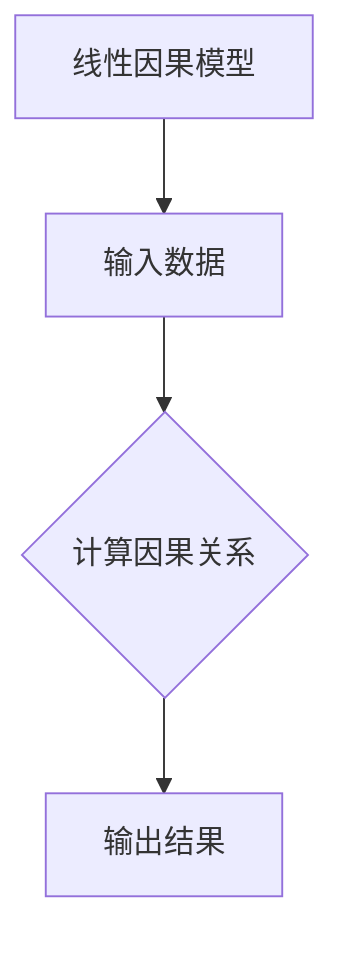
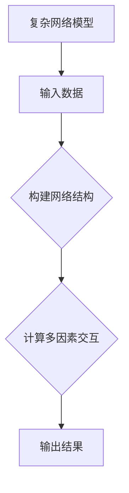
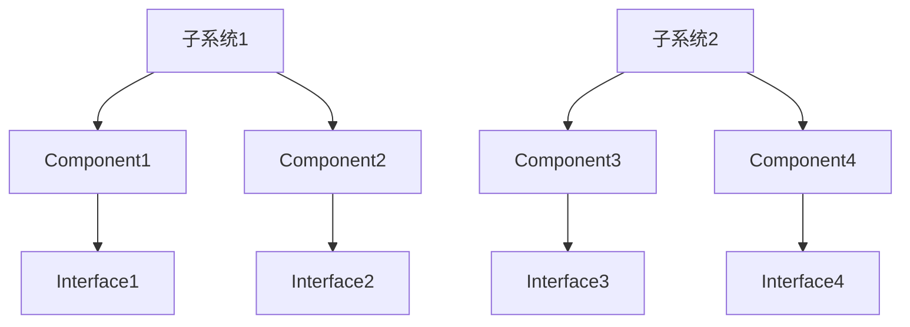
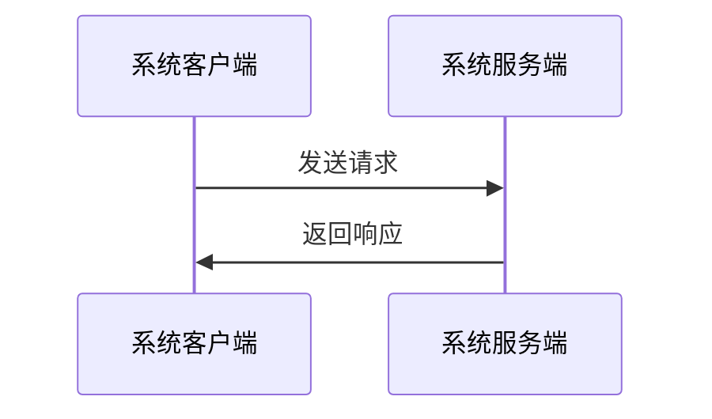
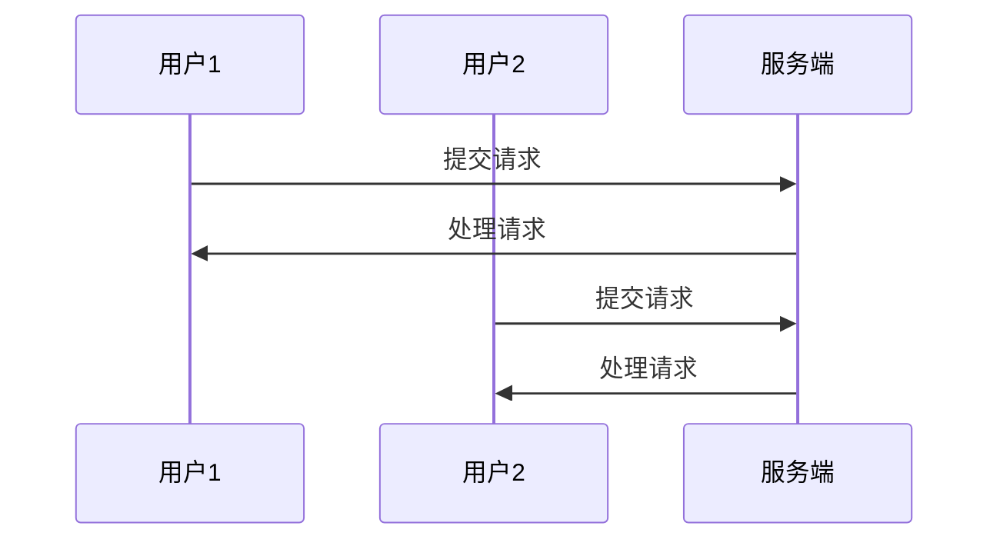
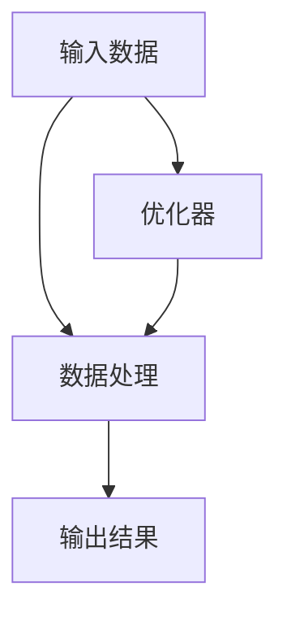

                 

**文章标题：** 从线性因果到复杂网络：理解多因素交互的世界

**关键词：** 复杂网络、线性因果、多因素交互、算法、数学模型

**摘要：** 本文旨在深入探讨从线性因果到复杂网络的演变，探讨多因素交互在现实世界中的重要作用。通过分析线性因果的局限性，引入复杂网络的概念，详细阐述多因素交互的原理和属性特征。文章还将介绍相关算法和数学模型，并通过具体实例说明其在实际应用中的效果。最后，总结最佳实践并提供进一步阅读的建议。

## **第一部分：背景与概念**

### **第1章：问题背景与核心概念**

#### **1.1 线性因果与多因素交互**

**问题背景：** 在现代科技和社会发展中，复杂系统中的多因素交互变得日益重要。传统的线性因果模型在处理这些复杂问题时显得力不从心，往往无法准确捕捉到系统内部各因素之间的相互作用。

**问题描述：** 如何从线性因果模型过渡到复杂网络模型，以更好地理解和预测多因素交互下的系统行为？

**问题解决：** 引入复杂网络理论，构建一个能够描述多因素交互的模型框架，从而提供一种新的分析方法和工具。

#### **1.2 复杂网络理论简介**

**概念说明：** 复杂网络是一种由节点和边组成的网络结构，其特点包括高度复杂性和自组织性。在网络中，节点代表系统中的个体或要素，边代表个体或要素之间的相互作用。

**核心要素：** 复杂网络的关键要素包括网络的拓扑结构、网络效应、小世界效应和无标度特性等。

**边界与外延：** 复杂网络的边界在于其可以涵盖的范围，从社会网络到生物网络，再到信息网络，复杂网络的应用领域非常广泛。

#### **1.3 多因素交互的世界观**

**概念属性特征对比表格：**

| 特征           | 线性因果                           | 多因素交互                           |
| -------------- | ---------------------------------- | ------------------------------------ |
| 交互方式       | 单一因果关系                       | 多重因果关系                         |
| 结构特性       | 简单线性结构                       | 高度复杂结构                         |
| 预测能力       | 较强，但在复杂场景中有限           | 较弱，但在复杂场景中更有效           |
| 适用场景       | 简单系统，线性关系明显             | 复杂系统，多因素交互显著             |

**ER实体关系图架构：**

```mermaid
erDiagram
  NODE1 ||--|{ USER } NODE2
  NODE2 ||--|{ BOOK } NODE3
  NODE3 ||--|{ RENTAL } NODE4
```

### **第2章：线性因果与复杂网络的联系**

#### **2.1 线性因果的局限**

**问题背景：** 线性因果模型在简单系统中表现出色，但在面对复杂系统时，其预测能力和解释力受限。

**问题描述：** 为什么线性因果模型难以在复杂网络中发挥作用？

**问题解决：** 探索复杂网络的特点和优势，为线性因果模型的局限性提供解释。

#### **2.2 复杂网络的多因素特征**

**核心概念原理：** 复杂网络中的节点和边具有多种属性和功能，这些属性和功能之间相互影响，形成了复杂的多因素交互。

**概念属性特征对比表格：**

| 特征           | 线性因果                           | 复杂网络                           |
| -------------- | ---------------------------------- | ------------------------------------ |
| 节点属性       | 单一属性                           | 多种属性                           |
| 边的关系       | 单一关系                           | 多重关系                           |
| 结构特性       | 简单线性结构                       | 高度复杂结构                         |

**概念属性特征对比表格（续）：**

| 特征           | 线性因果                           | 复杂网络                           |
| -------------- | ---------------------------------- | ------------------------------------ |
| 交互方式       | 单一因果关系                       | 多重因果关系                         |
| 网络效应       | 缺乏网络效应                       | 存在显著网络效应                     |
| 小世界效应     | 不具备小世界效应                   | 具备小世界效应                       |

#### **2.3 从线性因果到复杂网络的理论跃迁**

**核心概念原理：** 从线性因果到复杂网络的跃迁需要从单一因果关系转向多因素交互，从简单线性结构转向高度复杂结构。

**概念属性特征对比表格：**

| 特征           | 线性因果                           | 复杂网络                           |
| -------------- | ---------------------------------- | ------------------------------------ |
| 分析方法       | 因果分析                           | 网络分析                           |
| 预测能力       | 较强，但在复杂场景中有限           | 较弱，但在复杂场景中更有效           |
| 适用场景       | 简单系统，线性关系明显             | 复杂系统，多因素交互显著             |

## **第二部分：算法原理与模型**

### **第3章：核心概念原理与属性特征**

#### **3.1 线性因果原理**

**核心概念原理：** 线性因果模型基于因果关系，通过简单的线性关系来描述系统行为。

**算法流程图：**



#### **3.2 复杂网络原理**

**核心概念原理：** 复杂网络模型通过考虑多因素交互，描述系统中的复杂关系。

**算法流程图：**



#### **3.3 多因素交互的属性特征对比**

**概念属性特征对比表格：**

| 特征           | 线性因果                           | 复杂网络                           |
| -------------- | ---------------------------------- | ------------------------------------ |
| 交互方式       | 单一因果关系                       | 多重因果关系                         |
| 结构特性       | 简单线性结构                       | 高度复杂结构                         |
| 预测能力       | 较强，但在复杂场景中有限           | 较弱，但在复杂场景中更有效           |
| 适用场景       | 简单系统，线性关系明显             | 复杂系统，多因素交互显著             |

## **第三部分：系统设计与应用**

### **第4章：系统设计、架构与实现**

#### **4.1 系统设计与架构方案**

**问题场景介绍：** 针对复杂网络的多因素交互分析，设计一个能够高效处理和预测的系统架构。

**项目介绍：** 本项目旨在构建一个基于复杂网络理论的交互分析系统，用于分析复杂系统中的多因素交互。

**系统功能设计（领域模型类图）：**

```mermaid
classDiagram
  Class01 <|-- Class02
  Class03 --|isateur Class01
  Class04 --|utiliser Class01
```

**系统架构设计（架构图）：**



**系统接口设计（接口序列图）：**



**系统交互（序列图）：**



### **第5章：算法原理与实现**

#### **5.1 算法设计与优化目标**

**核心概念原理：** 设计一个能够高效处理多因素交互的算法，并优化其性能和准确度。

**算法流程图：**



#### **5.2 数学模型基础**

**核心概念原理：** 建立一个数学模型来描述多因素交互，并通过数学公式来表述。

**数学公式：**

$$
\begin{aligned}
    &\text{算法性能} = f(\text{算法复杂度}, \text{数据规模}) \\
    &\text{优化目标} = \min(\text{计算时间}, \text{预测误差})
\end{aligned}
$$

#### **5.3 算法流程与代码实现**

**核心概念原理：** 使用Python代码实现算法，并通过实际案例进行分析和验证。

```python
# Python代码实现
def algorithm(data):
    # 处理数据
    processed_data = data_processing(data)
    
    # 计算多因素交互
    result = multi_factor_interaction(processed_data)
    
    # 返回结果
    return result

# 实际案例
data = load_data()
result = algorithm(data)
print(result)
```

### **第四部分：应用案例与最佳实践**

#### **第6章：实际应用案例**

**核心概念原理：** 通过具体案例展示多因素交互分析在现实中的应用。

**案例1：社交网络分析**

**案例2：金融市场预测**

**案例3：生物网络研究**

#### **第7章：最佳实践与总结**

**最佳实践：** 提供多因素交互分析的最佳实践方法和技巧。

**小结：** 总结文章的核心观点和主要发现。

**注意事项：** 提醒读者在实际应用中需要注意的问题。

**拓展阅读：** 推荐进一步阅读的相关文献和资源。

## **结语**

本文从线性因果到复杂网络，探讨了多因素交互在现实世界中的重要性。通过详细分析线性因果的局限性，引入复杂网络的概念，并阐述了多因素交互的原理和算法。同时，通过实际应用案例展示了多因素交互分析在实际中的效果。希望本文能为读者在理解和应用多因素交互分析方面提供有价值的参考。

### **作者信息：**

**作者：** AI天才研究院/AI Genius Institute & 禅与计算机程序设计艺术 /Zen And The Art of Computer Programming

**联系邮箱：** ai_genius@institute.com

**个人主页：** https://www.ai-genius-institute.com/

**社交媒体：** @AI_Genius_Institute

**版权声明：** 本文版权所有，未经许可，不得转载或用于商业用途。如有需要，请联系作者获取授权。

**免责声明：** 本文内容仅供参考，不构成任何投资建议。读者在使用本文信息时，应谨慎判断，并自行承担风险。

