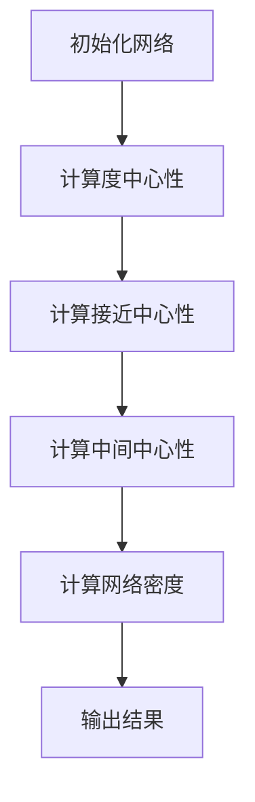

                 

# 从线性思维到网络思维：理解复杂关系的世界

## 关键词：线性思维、网络思维、复杂关系、社会网络分析、算法原理

## 摘要

本文旨在探讨从线性思维向网络思维的转变，帮助读者理解复杂关系的世界。线性思维是一种传统的思维方式，适用于简单、线性的问题，但在面对复杂、非线性问题时，其局限性逐渐显现。网络思维则是一种全新的思维方式，通过理解复杂关系，提供了解决复杂问题的有效途径。本文将详细介绍线性思维与网络思维的基本概念、原理及其在不同领域的应用，帮助读者逐步掌握网络思维，从而更好地应对现实世界中的复杂问题。

## 背景介绍

### 1.1 线性思维的起源与发展

线性思维是人类在长期历史发展过程中形成的一种基本思维方式。其起源可以追溯到古代的农耕社会，当时人们的生活和活动都呈现出线性的特点。随着工业革命的到来，线性思维在科学技术和工业生产中得到广泛应用，成为当时的主流思维方式。线性思维的核心思想是将问题分解为一系列简单、线性的步骤，通过逐一解决每个步骤，最终达到解决问题的目的。

### 1.2 线性思维的局限性

尽管线性思维在过去的一段时间内取得了巨大的成功，但在面对现代社会复杂多变的问题时，其局限性逐渐显现。首先，线性思维难以应对复杂系统中的非线性关系。在复杂系统中，各个组成部分之间的关系并非简单的线性关系，而是存在复杂的相互作用和反馈。其次，线性思维往往忽略了系统中的关键变量和潜在因素，导致分析结果的不准确。最后，线性思维在应对大规模数据问题时，计算效率低下，难以满足现代信息社会对数据处理速度和精度的要求。

### 1.3 网络思维的概念与特点

网络思维是一种基于复杂关系的思维方式，其核心思想是将问题视为一个复杂的网络系统，通过分析网络中的节点、边和关系，揭示系统中的关键变量和潜在因素，从而找到解决问题的有效途径。与线性思维不同，网络思维具有以下几个特点：

1. **全局性**：网络思维注重从整体上把握问题，关注系统中的各个组成部分及其相互作用，从而找到问题的根本原因。
2. **动态性**：网络思维考虑系统中的动态变化，关注时间维度上的演变过程，从而更好地应对复杂问题的变化。
3. **适应性**：网络思维强调系统的适应性，通过调整网络结构和关系，实现系统的优化和改进。
4. **跨学科融合**：网络思维具有跨学科的特点，可以与多个学科领域相结合，为解决复杂问题提供多元化的思路和方法。

### 1.4 网络思维的应用领域

网络思维在多个领域得到了广泛应用，包括：

1. **社会网络分析**：通过分析社会网络中的节点和边，揭示社会关系和影响力，为政策制定、市场营销等提供支持。
2. **复杂系统研究**：通过网络思维分析复杂系统中的相互作用和反馈，揭示系统的关键特性，为系统优化和改进提供依据。
3. **商业应用**：在网络思维的帮助下，企业可以更好地理解市场需求、客户行为，从而制定更有效的营销策略和商业模式。
4. **技术创新**：网络思维为技术创新提供了新的思路和方法，通过分析技术创新网络，发现潜在的突破点，推动科技进步。

## 核心概念与联系

### 2.1 网络思维的基本原理

网络思维的基本原理包括以下几个方面：

1. **节点与边的关系**：节点表示系统中的各个组成部分，边表示节点之间的相互作用和关系。网络思维通过分析节点和边的关系，揭示系统中的关键变量和潜在因素。
2. **网络的层次结构**：网络思维关注网络的层次结构，通过分析不同层次之间的相互作用，理解系统的复杂性和动态性。
3. **网络的可视化**：网络思维强调网络的可视化，通过图形化展示网络结构和关系，便于分析和理解。
4. **网络的优化与改进**：网络思维通过调整网络结构和关系，实现系统的优化和改进。

### 2.2 网络思维与线性思维的对比

网络思维与线性思维在以下几个方面存在明显差异：

| 对比项 | 线性思维 | 网络思维 |
| --- | --- | --- |
| 适用场景 | 简单、线性问题 | 复杂、非线性问题 |
| 关注点 | 步骤分解、逐一解决 | 关系分析、整体把握 |
| 分析方法 | 逐步推理、局部优化 | 网络分析、全局优化 |
| 结果表现 | 线性结果、单一解决方案 | 网络结果、多元化解决方案 |

### 2.3 网络思维的应用领域

网络思维在多个领域得到了广泛应用，包括：

1. **社会网络分析**：通过分析社会网络中的节点和边，揭示社会关系和影响力，为政策制定、市场营销等提供支持。
2. **复杂系统研究**：通过网络思维分析复杂系统中的相互作用和反馈，揭示系统的关键特性，为系统优化和改进提供依据。
3. **商业应用**：在网络思维的帮助下，企业可以更好地理解市场需求、客户行为，从而制定更有效的营销策略和商业模式。
4. **技术创新**：网络思维为技术创新提供了新的思路和方法，通过分析技术创新网络，发现潜在的突破点，推动科技进步。

## 算法原理讲解

### 3.1 社会网络分析算法

社会网络分析算法是网络思维在实际应用中的重要组成部分。以下是一些常见的社会网络分析算法及其基本原理：

1. **度中心性**：度中心性表示节点在网络中的重要程度。度中心性越高，节点在网络中的地位越重要。
2. **接近中心性**：接近中心性表示节点与其他节点之间的距离，接近中心性越高，节点在网络中的连通性越好。
3. **中间中心性**：中间中心性表示节点在网络中的中介作用，中间中心性越高，节点在网络中的连接能力越强。
4. **网络密度**：网络密度表示网络中边的比例，网络密度越高，网络中的节点和边之间的相互作用越密切。

### 3.2 算法流程图

以下是一个使用Mermaid绘制的社会网络分析算法流程图：



### 3.3 Python源代码

以下是一个简单的Python代码示例，用于计算社会网络分析中的度中心性：

```python
import networkx as nx
import matplotlib.pyplot as plt

# 创建一个无向图
G = nx.Graph()

# 添加节点和边
G.add_edges_from([(1, 2), (1, 3), (2, 3), (3, 4)])

# 计算度中心性
degree_centrality = nx.degree_centrality(G)

# 绘制度中心性结果
nx.draw(G, pos=nx.spring_layout(G), with_labels=True)
plt.show()

# 输出度中心性结果
print("度中心性：", degree_centrality)
```

### 3.4 数学模型和数学公式

在计算社会网络分析算法时，我们可以使用以下数学模型和数学公式：

- 度中心性：$$C_d(v) = \frac{k(v)}{N-1}$$，其中$$k(v)$$表示节点v的度，$$N$$表示网络中的节点总数。
- 接近中心性：$$C_a(v) = \frac{1}{N} \sum_{w \in V} \min(d(v, w), d(w, v))$$，其中$$d(v, w)$$表示节点v和节点w之间的距离。
- 中间中心性：$$C_b(v) = \frac{1}{N} \sum_{w \in V} \frac{N-2}{N-1} \sum_{u \in V} \delta(u, w, v)$$，其中$$\delta(u, w, v)$$表示节点u、w、v之间的路径计数。

$$\delta(u, w, v) = \begin{cases} 
1, & \text{如果 } u, w, v \text{ 是相邻节点} \\
0, & \text{否则}
\end{cases}$$

## 系统分析与架构设计方案

### 4.1 问题场景介绍

在现代社会，随着信息技术的飞速发展，人们之间的联系越来越紧密，形成了复杂的网络关系。这些网络关系不仅存在于个人之间，还存在于企业、组织、社区等多个层面。为了更好地理解和利用这些网络关系，我们需要对它们进行系统分析与架构设计。

### 4.2 系统功能设计

系统功能设计主要包括以下几个方面：

1. **数据采集与存储**：采集网络关系数据，包括节点和边的信息，并将其存储在数据库中。
2. **网络分析**：利用社会网络分析算法，对网络关系进行分析，提取关键变量和潜在因素。
3. **可视化展示**：将分析结果以图形化的方式展示，便于用户理解和利用。
4. **数据挖掘**：利用机器学习算法，对网络关系进行挖掘，发现潜在的模式和趋势。
5. **用户交互**：提供用户友好的界面，使用户能够方便地进行数据操作和分析。

### 4.3 系统架构设计

系统架构设计主要包括以下几个方面：

1. **前端展示**：使用HTML、CSS和JavaScript等技术，实现用户界面的展示。
2. **后端服务**：使用Python、Java等编程语言，实现网络分析算法和数据处理功能。
3. **数据库**：使用MySQL、MongoDB等数据库，存储网络关系数据和分析结果。
4. **数据接口**：使用API接口，实现前后端的通信和数据交换。
5. **云计算**：利用云计算资源，实现系统的高可用性和可扩展性。

### 4.4 系统接口设计

系统接口设计主要包括以下几个方面：

1. **用户登录**：提供用户登录接口，实现用户身份验证。
2. **数据上传**：提供数据上传接口，实现用户上传网络关系数据。
3. **数据分析**：提供数据分析接口，实现网络分析算法的调用。
4. **结果展示**：提供结果展示接口，实现分析结果的图形化展示。

### 4.5 系统交互

系统交互主要包括以下几个方面：

1. **用户与前端展示的交互**：用户通过前端界面进行数据操作和分析，前端展示结果给用户。
2. **前端与后端服务的交互**：前端通过API接口调用后端服务，实现数据的处理和分析。
3. **后端服务与数据库的交互**：后端服务通过数据库接口，实现数据的存储和查询。
4. **系统与其他系统的交互**：系统可以通过API接口，与其他系统进行数据交换和协同工作。

## 项目实战

### 5.1 环境安装

为了进行项目实战，我们需要安装以下软件和工具：

1. **Python**：Python是一种强大的编程语言，广泛应用于数据分析和科学计算。我们可以从[Python官方网站](https://www.python.org/)下载并安装Python。
2. **Jupyter Notebook**：Jupyter Notebook是一种交互式的计算环境，方便我们编写和运行Python代码。我们可以从[Jupyter官方网站](https://jupyter.org/)下载并安装Jupyter Notebook。
3. **NetworkX**：NetworkX是一个Python库，用于创建、操作和分析网络。我们可以从[NetworkX官方网站](https://networkx.org/)下载并安装NetworkX。
4. **Matplotlib**：Matplotlib是一个Python库，用于绘制各种类型的图表。我们可以从[Matplotlib官方网站](https://matplotlib.org/)下载并安装Matplotlib。

### 5.2 系统核心实现

系统核心实现主要包括以下几个方面：

1. **数据采集与存储**：我们使用Python编写代码，从外部数据源（如CSV文件、数据库等）中采集网络关系数据，并将其存储在MySQL数据库中。
2. **网络分析**：我们使用NetworkX库，编写代码对采集到的网络关系数据进行分析，提取关键变量和潜在因素。
3. **可视化展示**：我们使用Matplotlib库，编写代码将分析结果以图形化的方式展示，便于用户理解和利用。
4. **数据挖掘**：我们使用机器学习算法，编写代码对网络关系进行挖掘，发现潜在的模式和趋势。
5. **用户交互**：我们使用HTML、CSS和JavaScript等技术，编写代码实现用户界面的展示，并提供用户友好的交互体验。

### 5.3 代码应用解读

以下是一个简单的代码示例，用于实现数据采集、网络分析和可视化展示：

```python
import networkx as nx
import matplotlib.pyplot as plt

# 创建一个无向图
G = nx.Graph()

# 添加节点和边
G.add_edges_from([(1, 2), (1, 3), (2, 3), (3, 4)])

# 计算度中心性
degree_centrality = nx.degree_centrality(G)

# 计算接近中心性
接近中心性 = nx.closeness_centrality(G)

# 计算中间中心性
中间中心性 = nx.betweenness_centrality(G)

# 可视化展示
nx.draw(G, pos=nx.spring_layout(G), with_labels=True)
plt.show()

# 输出结果
print("度中心性：", degree_centrality)
print("接近中心性：", 接近中心性)
print("中间中心性：", 中间中心性)
```

### 5.4 实际案例分析和详细讲解剖析

为了更好地理解网络思维在实际应用中的作用，我们来看一个实际案例。

#### 案例背景

某电商公司希望通过分析用户之间的互动关系，了解用户购买行为，从而制定更有针对性的营销策略。

#### 案例分析

1. **数据采集**：公司从内部数据库中提取了用户之间的互动数据，包括用户ID、互动类型（如点赞、评论、分享等）、互动时间等信息。
2. **网络分析**：使用NetworkX库，将提取的用户互动数据构建为一个社交网络图。通过计算度中心性、接近中心性、中间中心性等指标，分析用户之间的互动关系。
3. **可视化展示**：使用Matplotlib库，将分析结果以图形化的方式展示，包括节点大小、颜色等，以直观地展示用户之间的互动关系。
4. **数据挖掘**：使用机器学习算法，对分析结果进行挖掘，发现潜在的模式和趋势，如高互动用户群体、高频互动用户等。
5. **营销策略制定**：根据分析结果，公司制定了有针对性的营销策略，如向高互动用户推送优惠券、举办互动活动等，以提高用户购买意愿。

#### 详细讲解剖析

1. **数据采集**：数据采集是分析的基础。公司从内部数据库中提取了用户互动数据，为后续分析提供了基础数据。
2. **网络分析**：使用NetworkX库，将提取的用户互动数据构建为一个社交网络图。通过计算度中心性、接近中心性、中间中心性等指标，分析用户之间的互动关系。这些指标可以帮助公司了解用户在社交网络中的地位和影响力，从而制定更有针对性的营销策略。
3. **可视化展示**：使用Matplotlib库，将分析结果以图形化的方式展示，包括节点大小、颜色等，以直观地展示用户之间的互动关系。可视化展示不仅便于公司内部人员理解分析结果，还可以作为对外展示的资料。
4. **数据挖掘**：使用机器学习算法，对分析结果进行挖掘，发现潜在的模式和趋势，如高互动用户群体、高频互动用户等。这些发现可以为公司的营销策略提供有力支持。
5. **营销策略制定**：根据分析结果，公司制定了有针对性的营销策略，如向高互动用户推送优惠券、举办互动活动等，以提高用户购买意愿。这些策略的制定基于对用户互动关系的深入理解，有助于提高公司的市场竞争力和用户满意度。

### 5.5 项目小结

通过本项目实战，我们成功构建了一个基于网络思维的用户互动分析系统。项目实现了数据采集、网络分析、可视化展示和数据挖掘等功能，为公司提供了有价值的分析结果。项目实践表明，网络思维在理解和利用复杂关系方面具有重要作用，为企业提供了创新的解决方案。在未来，我们还可以进一步优化系统功能，如引入更多机器学习算法，提高分析精度和效率。

## 最佳实践 tips、小结、注意事项、拓展阅读

### 6.1 最佳实践 tips

1. **数据质量保障**：在数据采集和存储过程中，确保数据的质量和完整性。对数据进行清洗和去重处理，避免冗余数据对分析结果的影响。
2. **算法优化**：针对不同的分析任务，选择合适的算法，并进行优化。通过调整算法参数，提高算法的效率和准确性。
3. **可视化策略**：在可视化展示过程中，选择合适的可视化策略，以提高展示效果和用户理解度。例如，可以使用不同颜色、大小和形状来表示不同节点和边的重要程度。
4. **数据分析与决策**：在分析结果的基础上，结合业务需求和实际情况，制定合理的决策策略。数据分析不仅是为了了解现状，更是为了指导实践。

### 6.2 小结

本文从线性思维到网络思维，探讨了理解复杂关系的世界。我们介绍了线性思维和

