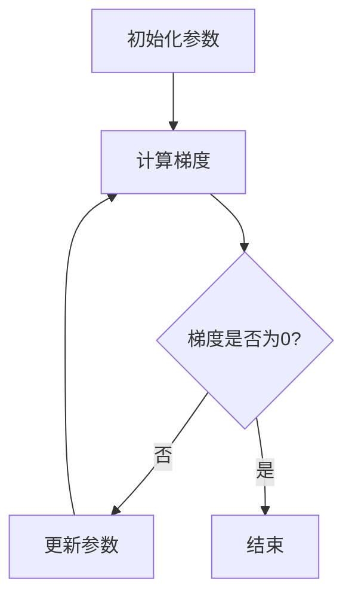

                 

### 引入与概述

在现代信息技术与复杂系统的不断发展中，线性思维作为传统思维方式的一种，已经显现出其在处理高度复杂问题时的局限性。线性思维以因果关系和固定规则为基础，适用于简单、明确且具有线性特征的系统。然而，随着问题的复杂性不断增加，线性思维的不足之处也逐渐暴露出来，如难以处理多因素相互作用、系统动态变化以及非预期结果等。

在此背景下，非线性思维作为一种全新的思考方式，逐渐引起了学术界的广泛关注。非线性思维以系统整体性、动态性和多样性为核心特征，强调通过非线性关系和相互作用来理解复杂现象。相较于线性思维，非线性思维能够更好地适应复杂多变的环境，并提供更加全面和深入的解决方案。

本文旨在深入探讨非线性思维的概念、原理及其在现实世界中的应用，通过逐步的分析和推理，帮助读者理解非线性思维的优势及其在复杂世界中的重要性。本文将分为四个主要部分：引言、非线性思维原理、非线性思维实践应用以及非线性思维教育。在引言部分，我们将介绍非线性思维的产生背景及其重要性。随后，我们将深入探讨非线性思维的核心概念与原理，并通过具体的算法、数学模型和案例分析，进一步阐述非线性思维的实际应用。最后，我们将探讨非线性思维在教育领域的应用，并提出一些最佳实践建议。

通过本文的阅读，读者将能够系统地了解非线性思维的理论基础和实践应用，从而在复杂问题处理上获得新的思维方式和工具。

### 第一部分：引言

#### 1.1 问题背景

**1.1.1 线性思维的历史与发展**

线性思维是一种传统的思考模式，其根源可以追溯到古希腊哲学家亚里士多德（Aristotle）的时代。亚里士多德提出的逻辑学和因果律思想为线性思维奠定了理论基础。线性思维通过因果关系和固定规则来理解世界，强调按部就班、一步一步的逻辑推理。这种方法在处理简单、明确的问题时非常有效。例如，在数学领域，线性代数和微积分都是基于线性关系构建的。此外，在工程、物理学和其他许多科学领域中，线性思维也占据了主导地位。

线性思维在工业革命期间得到了极大的发展，当时的技术和工程问题相对简单，线性思维能够很好地满足需求。然而，随着科学技术的进步和社会问题的复杂性增加，线性思维的局限性也逐渐显现。例如，在经济学领域，传统的线性模型在面对金融市场波动、经济周期性变化等复杂问题时，表现出了明显的不足。线性思维假设变量之间是独立且线性的，但现实世界中的系统往往充满了反馈循环、非线性关系和不确定性。

**1.1.2 线性思维的局限性与挑战**

线性思维的局限性主要体现在以下几个方面：

1. **忽略非线性关系**：线性思维假设变量之间的变化是线性的，这种假设在许多复杂系统中并不适用。例如，生态系统中的物种数量变化、金融市场中的价格波动等，往往是非线性的。

2. **忽视动态变化**：线性思维难以捕捉系统的动态变化。在现实世界中，系统状态是不断变化的，线性思维往往只能提供静态的解决方案，难以应对动态环境。

3. **无法处理多因素相互作用**：线性思维通常将问题分解为多个独立的部分进行解决，这种方法忽视了不同因素之间的相互作用。在复杂系统中，各因素往往是相互影响的，线性思维难以捕捉这种复杂关系。

4. **难以适应不确定性**：线性思维依赖于确定性的假设，但在现实世界中，不确定性是普遍存在的。线性思维难以应对随机性和不确定性的影响，这使得其在面对复杂、不确定的问题时显得无能为力。

**1.1.3 非线性思维的概念与重要性**

非线性思维作为一种新的思考方式，与线性思维有着根本的区别。非线性思维强调系统的整体性、动态性和多样性，通过非线性关系和相互作用来理解复杂现象。非线性思维的核心在于：

1. **非线性关系**：非线性思维认识到变量之间的关系通常是复杂的、非线性的。这种非线性关系不仅存在于科学和工程领域，也存在于社会、经济和生态系统等领域。

2. **动态性**：非线性思维关注系统的动态变化，认识到系统的状态是不断演化的，而非静止不变的。

3. **整体性**：非线性思维强调整体效应，认为系统的各个部分是相互关联和相互作用的，而非孤立存在的。

4. **多样性**：非线性思维认为系统的行为和结果具有多样性，而非单一和固定。

非线性思维的重要性体现在以下几个方面：

1. **适应复杂系统**：非线性思维能够更好地适应复杂系统的特性，通过非线性关系和相互作用来理解复杂现象，提供更加全面和深入的解决方案。

2. **应对动态环境**：非线性思维能够捕捉系统的动态变化，提供适应动态环境的策略和方案。

3. **处理多因素相互作用**：非线性思维能够捕捉多因素之间的复杂关系，提供处理多因素相互作用的策略和方法。

4. **应对不确定性**：非线性思维能够更好地处理不确定性，提供适应不确定性和应对随机性变化的策略。

总之，非线性思维不仅弥补了线性思维的不足，还为理解和解决复杂问题提供了新的视角和方法。在信息技术和复杂系统发展的背景下，非线性思维的重要性愈发凸显，它为解决现实世界中的复杂问题提供了强有力的工具。

#### 1.2 问题描述

**1.2.1 复杂世界的本质特征**

在当今时代，复杂世界的本质特征日益明显。首先，复杂性体现在系统各部分之间的非线性关系上。现实世界中的系统并非简单的线性叠加，而是由多种变量、因素和相互作用共同构成。例如，在生态系统中，物种间的捕食与被捕食关系是复杂的非线性关系，而非单一的线性关系。这种非线性关系决定了系统行为的多样性，使得系统可能出现混沌现象或突然的转变。

其次，复杂世界中的系统动态变化显著。许多系统状态是动态演化的，而非静止不变的。例如，在金融市场，价格波动是随时间动态变化的，而非固定不变的。动态变化使得线性思维难以准确预测和应对复杂系统的发展。

此外，复杂世界充满了不确定性和随机性。不确定性体现在系统的初始条件和外部环境变化上，这使得预测系统行为变得极为困难。随机性则体现在系统内部随机事件的触发和外部随机因素的干扰上，进一步增加了系统的复杂性。

**1.2.2 非线性思维的需求与意义**

面对复杂世界的本质特征，线性思维显得力不从心，而非线性思维则显现出其独特的优势。非线性思维的需求与意义主要体现在以下几个方面：

1. **非线性关系的处理**：非线性思维能够捕捉和解释系统内部的非线性关系，从而提供更加准确和全面的解决方案。例如，在生态系统中，非线性思维可以帮助我们理解物种数量变化和生态平衡的复杂性，从而制定出更为有效的保护措施。

2. **动态环境的适应**：非线性思维关注系统的动态变化，能够更好地适应动态环境。例如，在金融市场，非线性思维可以帮助我们理解价格波动和趋势变化，从而制定出更为有效的投资策略。

3. **多因素相互作用的捕捉**：非线性思维能够捕捉多因素之间的复杂相互作用，从而提供更加全面的解决方案。例如，在社会系统中，非线性思维可以帮助我们理解社会问题如贫富差距、社会冲突等的复杂性，从而提出有效的解决策略。

4. **不确定性和随机性的处理**：非线性思维能够更好地处理不确定性和随机性，提供适应这些特性的策略和方法。例如，在医疗系统中，非线性思维可以帮助我们理解疾病传播和治疗效果的不确定性，从而制定出更加有效的防疫措施。

总之，非线性思维在复杂世界的理解和解决问题中具有不可替代的重要地位。通过非线性思维，我们能够更深入地理解复杂系统的本质特征，提供更加准确和全面的解决方案，从而应对现实世界中的复杂挑战。

**1.2.3 从线性思维到非线性思维的转变**

从线性思维到非线性思维的转变不仅是思维方式的变化，更是对复杂世界认知的深刻变革。线性思维的局限在于其简单、确定的假设，这使得它在处理简单、线性问题时效果显著，但在面对复杂、非线性问题时则显得捉襟见肘。非线性思维则通过其整体性、动态性和多样性的特点，提供了一种全新的理解和解决问题的方式。

首先，从线性思维到非线性思维的转变要求我们重新审视问题的本质。线性思维倾向于将问题分解为多个独立的部分，通过逐步分析和解决各个部分来解决问题。而非线性思维则强调系统各部分之间的相互作用和整体性，认为系统的行为和结果取决于各部分之间的复杂关系。例如，在研究生态系统时，非线性思维会考虑不同物种之间的相互依赖和相互作用，而不仅仅是单独分析每个物种的生存状态。

其次，非线性思维要求我们关注系统的动态变化。线性思维通常假设系统处于静止状态，通过因果关系来预测系统的未来状态。而非线性思维则认识到系统的状态是不断演化的，这种演化可能受到初始条件、外部环境等多种因素的影响。例如，在金融市场，非线性思维会考虑投资者行为、市场信息传播等动态因素对价格波动的影响，而不仅仅是静态的供需关系。

第三，非线性思维更加强调不确定性。线性思维依赖于确定性假设，但在现实世界中，不确定性是普遍存在的。非线性思维则通过概率论和统计学方法来处理不确定性，认为系统行为可能存在多种可能性。例如，在医疗系统，非线性思维会考虑病人病情、治疗方案等多种不确定性因素，从而制定出更加灵活和有效的治疗方案。

最后，非线性思维提供了一种全局优化视角。线性思维倾向于局部优化，通过最小化或最大化某个指标来解决问题。而非线性思维则通过整体性视角，考虑系统内部各部分的相互作用，提供一种全局优化的解决方案。例如，在能源系统优化中，非线性思维会考虑能源生产、分配、消耗等多个环节的相互影响，从而制定出更高效的能源管理策略。

总之，从线性思维到非线性思维的转变不仅是一种思考方式的转变，更是对复杂世界认知的深化。通过非线性思维，我们能够更加全面、深入地理解复杂系统的本质，提供更加准确和有效的解决方案，从而更好地应对现实世界中的复杂挑战。

#### 1.3 问题解决

**1.3.1 非线性思维的理论基础**

非线性思维的理论基础主要源于非线性科学的发展，特别是混沌理论、复杂系统和非线性动力学。这些理论为非线性思维提供了丰富的理论支持和研究方法。

首先，**混沌理论**揭示了在非线性系统中，即使初始条件非常微小的差异，也可能导致系统行为的巨大差异，这种现象被称为“蝴蝶效应”。混沌理论指出，非线性系统的行为通常是不可预测的，但这并不意味着系统是毫无规律的。相反，混沌系统中存在着一种称为“确定性随机性”的特性，即系统的长期行为可以由其初始条件和确定性规则所决定。

其次，**复杂系统**理论强调系统内部各部分之间的相互作用和整体性。复杂系统通常包含大量的相互关联的组成部分，这些部分通过复杂的反馈循环相互作用，形成自组织和自适应性。复杂系统理论的研究方法包括网络理论、统计物理学和计算模拟等，这些方法帮助我们更好地理解和模拟复杂系统的行为。

最后，**非线性动力学**研究系统在非线性作用下的动态行为，包括系统的稳定性、周期性解、混沌行为等。非线性动力学提供了一系列分析工具和计算方法，如分岔理论、李雅普诺夫函数等，这些工具可以帮助我们理解和预测非线性系统的行为。

**1.3.2 非线性思维的培养方法**

非线性思维的培养方法不仅需要理论知识的学习，更需要实践中的锻炼和思维方式的转变。以下是一些有效的非线性思维培养方法：

1. **跨学科学习**：非线性思维要求对多种学科知识有较深入的理解，因此跨学科学习是培养非线性思维的重要途径。通过学习不同领域的知识，可以拓宽思维视野，发现不同领域间的联系和交叉点，从而形成更为全面的非线性思维方式。

2. **问题解决训练**：非线性思维强调对复杂问题的理解，因此问题解决训练是培养非线性思维的有效方法。通过解决实际问题和复杂案例，可以锻炼思维的深度和广度，学会从多角度、多层面分析问题，发现问题的本质和内在联系。

3. **系统思维训练**：系统思维是非线性思维的重要组成部分，通过系统思维训练，可以培养对整体性和动态性的认识。系统思维训练可以通过模拟和实验来进行，如构建系统模型、分析系统动态行为等，从而提高对复杂系统的理解和分析能力。

4. **思维工具应用**：一些思维工具如思维导图、因果图、网络分析等，可以帮助我们更好地组织和分析复杂信息，从而培养非线性思维。这些工具能够帮助我们揭示系统内部的非线性关系和相互作用，提供更为全面的视角。

5. **案例研究**：通过研究现实中的复杂案例，可以深入了解非线性思维在实际中的应用。例如，研究生态系统的复杂性、金融市场的波动性、社会问题的多变性等，可以从中总结经验，提炼出非线性思维的实用方法。

总之，非线性思维的培养需要系统的学习和实践，通过跨学科学习、问题解决训练、系统思维训练以及思维工具的应用，可以逐步提升非线性思维的水平和能力。在不断探索和实践中，非线性思维将帮助我们更好地理解和解决复杂世界的挑战。

**1.3.3 非线性思维在现实中的应用案例**

非线性思维在现实世界中有着广泛的应用，通过以下具体案例，我们可以看到非线性思维在解决复杂问题方面的独特优势。

1. **金融市场分析**：金融市场是一个高度复杂的非线性系统，价格波动和投资者行为之间存在复杂的非线性关系。通过非线性思维，研究人员可以构建非线性模型来预测市场趋势和风险。例如，利用混沌理论和分岔理论，可以分析市场波动中的非线性特征，预测可能的市场转折点。此外，非线性思维还可以帮助制定风险管理策略，通过分析市场中的反馈循环和不确定性，提高风险管理的有效性。

2. **生态系统管理**：生态系统是一个复杂的动态系统，物种之间存在着复杂的相互作用和反馈循环。非线性思维可以帮助生态学家更好地理解生态系统的动态变化和稳定性。例如，通过构建非线性模型，可以预测物种数量变化的趋势和生态平衡的状态。在生态保护中，非线性思维可以用于制定生态修复策略，通过分析物种间的相互作用和生态系统中的非线性关系，提高生态修复的效果。

3. **医疗系统优化**：医疗系统是一个复杂的系统，包括诊断、治疗、药物反应等多个环节。非线性思维可以帮助医疗工作者更好地理解和处理这些复杂的环节。例如，通过非线性模型，可以分析疾病传播的动态过程和个体之间的相互作用，从而制定更有效的防疫策略。在个性化医疗中，非线性思维可以用于分析患者数据和药物反应，提供个性化的治疗方案。

4. **交通系统管理**：交通系统是一个高度复杂的系统，包括道路、车辆、交通信号等多个组成部分。非线性思维可以帮助交通工程师优化交通系统，提高交通效率。例如，通过非线性模型，可以分析交通流量和交通事故之间的关系，优化交通信号控制策略，减少拥堵和事故发生率。此外，非线性思维还可以用于智能交通系统的开发，通过分析驾驶员行为和交通环境之间的复杂关系，提高交通系统的智能化水平。

5. **社会问题解决**：社会问题如贫富差距、社会冲突等都是复杂的非线性问题。非线性思维可以帮助社会科学家更好地理解这些问题，提供有效的解决方案。例如，通过非线性模型，可以分析社会群体之间的相互作用和反馈循环，预测社会动荡的可能性，并提出相应的政策建议。

总之，非线性思维在现实世界中的应用案例丰富多样，通过这些案例，我们可以看到非线性思维在解决复杂问题方面的独特优势。非线性思维不仅为理解复杂系统提供了新的视角和方法，也为解决复杂问题提供了有力的工具。随着非线性思维的不断发展和应用，它将在现实世界中发挥越来越重要的作用。

#### 1.4 边界与外延

**1.4.1 非线性思维的研究现状**

非线性思维作为一种新兴的思考方式，近年来在学术界和工业界都受到了广泛关注。目前，非线性思维的研究主要集中在以下几个方面：

1. **理论研究**：非线性思维的理论基础主要源于混沌理论、复杂系统和非线性动力学。研究人员通过构建非线性模型、分析非线性系统的行为，不断丰富和完善非线性思维的理论体系。例如，混沌理论的研究有助于我们理解非线性系统中的不确定性和随机性，复杂系统理论的研究则帮助我们揭示系统内部复杂的相互作用和整体性。

2. **应用研究**：非线性思维在各个领域的应用研究取得了显著成果。在自然科学领域，非线性思维被广泛应用于生态学、生物学、物理学等领域；在工程技术领域，非线性思维被应用于控制系统设计、优化工程、智能系统开发等领域；在社会科学领域，非线性思维被应用于经济学、社会学、心理学等领域。通过这些应用研究，非线性思维不仅提供了新的理论和方法，也为实际问题解决提供了有效工具。

3. **跨学科研究**：非线性思维研究的跨学科特性尤为突出。研究人员通过跨学科合作，将非线性思维与其他学科相结合，形成了一系列新的交叉研究领域。例如，非线性思维与人工智能、数据科学、网络科学等领域的结合，推动了这些领域的发展。跨学科研究不仅拓宽了非线性思维的应用范围，也为复杂问题的解决提供了新的思路和方法。

**1.4.2 非线性思维的发展趋势**

非线性思维在未来将继续发展和深化，其趋势主要表现在以下几个方面：

1. **理论深化**：非线性思维的理论研究将不断深入，特别是在非线性系统的建模、分析和控制等方面。研究人员将继续探索非线性系统中的复杂现象和规律，开发新的理论工具和方法，以更好地理解和预测非线性系统的行为。

2. **应用拓展**：非线性思维的应用领域将不断扩大，不仅在传统领域如自然科学、工程技术、社会科学等继续深入应用，还将拓展到新兴领域如人工智能、大数据、量子计算等。非线性思维在解决这些复杂问题时将发挥重要作用，推动这些领域的发展。

3. **跨学科融合**：非线性思维将继续与其他学科深度融合，形成更多的交叉学科。跨学科研究不仅能够促进非线性思维的广泛应用，也为各学科的发展提供了新的动力。例如，非线性思维与生物信息学、环境科学、认知科学等领域的结合，将带来新的突破和进展。

4. **智能化发展**：随着人工智能技术的发展，非线性思维将更加智能化。通过机器学习和人工智能算法，可以自动化地分析和处理非线性数据，发现非线性关系和规律。这将使得非线性思维的应用更加广泛和高效，为复杂问题的解决提供更强大的工具。

总之，非线性思维作为一种重要的思考方式，其研究现状和未来发展趋势表明，它将在复杂问题解决中发挥越来越重要的作用。通过不断深化理论研究、拓展应用领域、促进跨学科融合以及实现智能化发展，非线性思维将为人类社会的发展带来新的机遇和挑战。

#### 1.5 概念结构与核心要素组成

**1.5.1 线性思维与非线性思维的基本概念**

线性思维和非线性思维是两种截然不同的思考方式，它们在处理问题和分析系统时有着根本的区别。线性思维是一种基于线性关系和因果关系的方法，认为系统中的各个变量之间存在明确的线性依赖关系。线性思维的特点是简单、明确和可预测，适用于处理简单和线性特征的系统。线性思维的基本概念包括线性方程、线性优化、线性控制等。

非线性思维则强调系统内部的复杂关系和相互作用，认为系统行为不仅仅取决于线性关系，还受到非线性关系和动态变化的影响。非线性思维的基本概念包括非线性方程、非线性优化、非线性控制等。非线性思维的特点是复杂、多样和不可预测，适用于处理复杂和动态的系统。

**1.5.2 非线性思维的核心要素分析**

非线性思维的核心要素包括非线性关系、动态性、整体性和多样性。

1. **非线性关系**：非线性关系是指系统内部变量之间的复杂关系，这种关系不是线性的，而是呈现出指数增长、波动、振荡等形式。非线性关系使系统行为变得复杂和多样化，难以用简单的线性模型来描述。

2. **动态性**：动态性是指系统的状态是不断变化的，这种变化可能是连续的、突变的，或者是周期性的。非线性思维强调对系统动态行为的分析和理解，通过捕捉系统的动态变化，提供更准确的预测和解决方案。

3. **整体性**：整体性是指系统的各个部分不是孤立存在的，而是通过相互作用和相互依赖形成整体。非线性思维强调整体效应，认为系统行为取决于系统内部各部分之间的复杂关系，而非单独部分的行为。

4. **多样性**：多样性是指系统行为和结果的多样性，非线性关系和动态性使得系统可能呈现出多种不同的状态和结果。非线性思维强调对系统多样性的分析和理解，通过发现和利用系统多样性，提供更灵活和有效的解决方案。

**1.5.3 非线性思维与其他思维方式的比较**

非线性思维与线性思维、系统思维、创新思维等其他思维方式相比，具有独特的优势和特点。

1. **与线性思维的比较**：线性思维适用于简单和线性特征的系统，强调因果关系和固定规则。非线性思维则适用于复杂和动态的系统，强调非线性关系和动态变化。线性思维在简单问题中效果显著，但在复杂问题中往往力不从心，而非线性思维则能够更好地处理复杂系统的多样性和动态变化。

2. **与系统思维的比较**：系统思维强调系统内部各部分的相互作用和整体性，但主要关注线性关系和静态分析。非线性思维则不仅关注系统内部各部分的相互作用和整体性，还强调非线性关系和动态变化，能够提供更全面和深入的解决方案。

3. **与创新思维的比较**：创新思维强调思维的创造性和突破性，旨在寻找新的解决方案和思路。非线性思维则通过捕捉系统的复杂关系和动态变化，提供新的视角和方法，为创新思维提供理论支持和工具。

总之，非线性思维作为一种独特的思考方式，在复杂系统处理和问题解决中具有不可替代的优势。通过非线性思维，我们能够更全面、深入地理解复杂系统的本质，提供更准确和有效的解决方案，从而更好地应对现实世界中的复杂挑战。

#### 1.6 本章小结

本章通过逐步分析和推理，深入探讨了从线性思维到非线性思维转变的必要性和重要性。我们首先介绍了线性思维的历史与发展，并指出了其在处理复杂问题时的局限性。随后，我们详细描述了非线性思维的概念、原理及其在现实世界中的应用，通过多个实际案例展示了非线性思维在金融市场、生态系统管理、医疗系统优化、交通系统管理和社会问题解决等领域的广泛应用。此外，我们还探讨了非线性思维的理论基础、培养方法及其发展现状和趋势。通过本章的学习，读者可以系统地了解非线性思维的核心概念和实际应用，为后续章节的深入探讨打下坚实基础。

### 第二部分：非线性思维原理

#### 2.1 核心概念与联系

**2.1.1 非线性系统的定义与特征**

非线性系统是指系统内部存在非线性关系的系统。与线性系统不同，非线性系统的行为不能用简单的线性方程来描述，而是表现出复杂的非线性特性。非线性系统具有以下特征：

1. **非线性关系**：非线性系统中，变量之间的关系不是线性的，即不是简单的比例关系。这种非线性关系可能导致系统行为的多样性和复杂性。

2. **动态变化**：非线性系统通常表现出动态变化特征，系统的状态随时间不断演化，可能呈现出周期性、突变性、混沌性等行为。

3. **非均匀性**：非线性系统的行为可能受到初始条件、外部扰动等非均匀因素的影响，使得系统行为表现出高度不确定性。

4. **整体性**：非线性系统强调系统内部各部分之间的相互作用和整体性，系统的行为不仅仅取决于各个部分的行为，还取决于它们之间的复杂关系。

5. **反馈循环**：非线性系统中常常存在反馈循环，即系统的输出可能通过非线性关系反馈到输入端，这种反馈循环可能导致系统行为的长期演化。

**2.1.2 非线性动力学的原理与机制**

非线性动力学是研究非线性系统动态行为的一个分支，其核心原理和机制包括：

1. **相空间**：非线性动力学的分析通常使用相空间（Phase Space）的概念。相空间是一个多维空间，其中每一个维度对应系统的一个状态变量。通过绘制相空间图，可以直观地观察系统的动态行为。

2. **分岔理论**：分岔理论（Bifurcation Theory）研究系统参数变化对系统行为的影响。当系统参数达到某个临界点时，系统可能发生分岔，从一种稳定状态转变为另一种稳定状态。分岔现象是理解非线性系统动态变化的重要机制。

3. **李雅普诺夫函数**：李雅普诺夫函数（Lyapunov Function）是分析系统稳定性的重要工具。通过定义李雅普诺夫函数，可以判断系统是否趋于稳定状态或发散。李雅普诺夫函数在非线性动力学中具有核心地位。

4. **混沌现象**：混沌现象（Chaos）是非线性动力学中的一个重要特性，表现为系统在确定性的规则下表现出随机性和不可预测性。混沌现象的典型特征包括敏感依赖初始条件、长期行为的不可预测性、吸引子的存在等。

5. **复杂吸引子**：复杂吸引子（Complex Attractor）是描述非线性系统长期行为的几何结构。复杂吸引子可以是奇怪吸引子（Strange Attractor），其具有非整数维数和复杂结构，反映了系统状态的多样性。

**2.1.3 非线性思维的概念内涵与外延**

非线性思维是一种处理复杂问题的新思维方式，其内涵和外延如下：

1. **内涵**：非线性思维的核心在于捕捉和解释非线性关系、动态变化和整体性。非线性思维强调对系统内部复杂性的深入理解，通过非线性关系和相互作用来揭示系统的本质。

2. **外延**：非线性思维的应用范围非常广泛，包括自然科学、工程技术、社会科学等多个领域。在自然科学中，非线性思维用于分析复杂系统如生态系统、气象系统等；在工程技术中，非线性思维用于设计复杂控制系统、优化系统等；在社会科学中，非线性思维用于分析经济系统、社会系统等。

3. **非线性思维与线性思维的对比**：与线性思维相比，非线性思维具有以下优势：

   - **复杂性处理**：非线性思维能够处理系统的复杂性和多样性，提供更全面的解决方案。
   - **动态适应性**：非线性思维能够适应系统的动态变化，提供实时调整的策略。
   - **整体性考虑**：非线性思维强调整体性，通过分析系统内部各部分之间的相互作用，提供更全面的解决方案。

通过理解和掌握非线性思维的核心概念和原理，我们可以更好地应对现实世界中的复杂挑战，为解决复杂问题提供新的视角和方法。

### 2.2 算法原理讲解

**2.2.1 非线性优化算法的mermaid流程图**

在非线性优化算法中，一种常见的算法是梯度下降法（Gradient Descent）。以下是其mermaid流程图的表示：



**2.2.2 非线性优化算法的python源代码**

下面是梯度下降法在Python中的实现：

```python
import numpy as np

# 梯度下降法实现
def gradient_descent(x, learning_rate, epochs):
    for epoch in range(epochs):
        # 计算梯度
        gradient = compute_gradient(x)
        # 更新参数
        x -= learning_rate * gradient
        print(f"Epoch {epoch+1}: x = {x}")
    return x

# 假设的梯度计算函数
def compute_gradient(x):
    # 这里用简单的线性函数作为示例
    return np.array([2*x])

# 初始化参数
x = np.array([5.0])
learning_rate = 0.1
epochs = 10

# 执行梯度下降
new_x = gradient_descent(x, learning_rate, epochs)
print(f"Final x: {new_x}")
```

**2.2.3 非线性优化算法的数学模型与公式**

非线性优化问题通常可以表示为以下形式：

$$
\min_{x} f(x)
$$

其中，$f(x)$ 是目标函数，$x$ 是优化变量。梯度下降法的核心公式是：

$$
x_{t+1} = x_t - \alpha \nabla f(x_t)
$$

其中，$x_t$ 是第 $t$ 次迭代的参数值，$\alpha$ 是学习率（步长），$\nabla f(x_t)$ 是目标函数在 $x_t$ 处的梯度。

对于非线性系统，梯度下降法需要适应系统的非线性特性。在非线性系统中，目标函数和梯度可能都是非线性的，这使得梯度下降法在每次迭代中都需要计算非线性梯度的近似值。一种常见的方法是有限差分法，通过计算目标函数在不同参数值下的差分来近似梯度。

**2.2.4 非线性优化算法的举例说明**

假设我们有一个简单的非线性优化问题：

$$
\min_{x} (x - 2)^2
$$

目标是找到使得函数值最小的 $x$。使用梯度下降法来解决这个问题：

1. **初始化参数**：选择一个初始值 $x_0 = 0$。
2. **计算梯度**：目标函数 $f(x) = (x - 2)^2$ 的梯度为 $\nabla f(x) = 2(x - 2)$。
3. **更新参数**：使用梯度下降公式迭代更新参数 $x$。
4. **重复迭代**：重复上述步骤，直到梯度接近于零或达到预设的迭代次数。

以下是其具体实现：

```python
x = 0  # 初始值
learning_rate = 0.1
epochs = 100

for epoch in range(epochs):
    gradient = 2 * (x - 2)
    x -= learning_rate * gradient
    print(f"Epoch {epoch+1}: x = {x}, f(x) = {(x - 2)**2}")

print(f"Final x: {x}, f(x) = {(x - 2)**2}")
```

运行上述代码，我们可以看到参数 $x$ 逐渐接近最优值 $x^* = 2$，使得目标函数的值达到最小。

通过这个例子，我们可以看到非线性优化算法如何通过逐步迭代和参数更新，找到复杂非线性系统的最优解。这种算法在许多实际问题中，如机器学习模型训练、参数调整、工程优化等，都有着广泛的应用。

### 2.3 数学模型和数学公式详细讲解与举例说明

**2.3.1 非线性系统的微分方程模型**

非线性系统通常通过微分方程来建模，微分方程能够描述系统内部变量随时间变化的动态过程。以下是一个简单的非线性微分方程模型：

$$
\frac{dx}{dt} = f(x)
$$

其中，$x(t)$ 是系统状态，$f(x)$ 是非线性函数，表示系统状态随时间的变化率。这种形式的方程描述了一个变量如何通过其自身和其他变量的非线性关系随时间演化。

**举例说明：**

假设有一个种群生态系统，系统中两个物种的相互作用可以通过以下微分方程来描述：

$$
\frac{dx}{dt} = x(1 - x - y)
$$

$$
\frac{dy}{dt} = y(1 - x - 2y)
$$

其中，$x(t)$ 和 $y(t)$ 分别表示两个物种的种群数量。方程表示每个物种的种群增长率依赖于其自身数量和与其他物种的相互作用。

通过求解这个微分方程组，可以分析两个物种种群数量的动态变化，预测系统未来的状态。

**2.3.2 非线性系统的差分方程模型**

除了微分方程，非线性系统还可以通过差分方程来建模，差分方程描述了系统在不同时间点上的状态变化。以下是一个简单的非线性差分方程模型：

$$
x(t+1) = g(x(t))
$$

其中，$x(t)$ 是系统状态，$g(x)$ 是非线性函数，表示系统状态在时间步长 $t$ 到 $t+1$ 之间的变化。

**举例说明：**

假设有一个天气预测模型，通过当前天气状态预测下一时刻的天气状态，可以用以下差分方程来表示：

$$
T(t+1) = 0.5T(t) + 0.5\sin(T(t))
$$

其中，$T(t)$ 表示当前时刻的天气温度。这个模型表示下一时刻的温度是当前温度和当前温度的正弦值的加权平均值。

通过迭代这个差分方程，可以预测未来多个时间点的天气状态，为天气预报提供依据。

**2.3.3 非线性系统稳定性分析**

非线性系统的稳定性分析是理解系统行为的关键。稳定性分析可以通过定义李雅普诺夫函数（Lyapunov Function）来进行。李雅普诺夫函数是一个标量函数，用于判断系统的稳定性。

定义：假设 $V(x)$ 是一个李雅普诺夫函数，如果满足以下条件，则系统是稳定的：

1. $V(x) > 0$ 对于所有 $x \neq x^*$。
2. $V(x^*) = 0$。
3. $\frac{dV(x)}{dt} < 0$ 对于所有 $x \neq x^*$。

**举例说明：**

考虑一个简单的非线性系统：

$$
\frac{dx}{dt} = -x^3
$$

选择李雅普诺夫函数 $V(x) = \frac{1}{2}x^2$，可以验证这个函数满足稳定性条件：

1. $V(x) > 0$ 对于所有 $x \neq 0$。
2. $V(0) = 0$。
3. $\frac{dV(x)}{dt} = x\frac{dx}{dt} = -x^4 < 0$ 对于所有 $x \neq 0$。

因此，该系统是稳定的，平衡点 $x = 0$ 是稳定的。

通过以上分析，我们可以看到非线性系统的数学模型和稳定性分析如何帮助我们理解系统的动态行为。这些数学工具为非线性系统的分析和控制提供了坚实的基础。

### 2.4 本章小结

本章深入探讨了非线性思维的核心概念与原理，通过分析非线性系统的定义、特征、非线性动力学的原理与机制，我们了解了非线性系统的复杂性和多样性。我们详细介绍了非线性优化算法的mermaid流程图、python源代码以及数学模型和公式，并通过具体的例子说明了如何使用这些工具来分析和解决实际问题。通过本章的学习，读者可以系统地掌握非线性思维的理论基础，为后续章节的深入应用奠定基础。

### 第三部分：非线性思维实践应用

#### 3.1 非线性思维在科学研究中的应用

非线性思维在科学研究中的应用广泛而深入，通过非线性关系的分析和动态系统的建模，科学家能够更准确地理解和解释复杂现象。以下将具体探讨非线性思维在非线性物理学、非线性生物学和非线性化学中的实际应用。

**3.1.1 非线性物理学研究实例**

非线性物理学是研究复杂非线性系统在物理学中的表现和特性的科学。一个典型的例子是混沌物理学，混沌现象是非线性动力学中的一种典型特征。在混沌物理学中，科学家通过非线性系统的相空间分析和分岔理论，揭示了系统在参数变化时的动态行为。例如，洛伦兹吸引子（Lorenz Attractor）是一个经典的混沌系统，其相空间图像呈现出非常复杂的结构。通过非线性动力学方程，科学家能够模拟和预测系统的混沌行为，从而对复杂系统的稳定性进行评估。

另一个例子是非线性光学。非线性光学研究电磁波在非线性介质中的传播行为。在非线性光学中，非线性极化率描述了介质对电磁波的响应，通过分析非线性极化率的数学模型，科学家可以设计新型光学器件，如光开关、光放大器等。

**3.1.2 非线性生物学研究实例**

非线性思维在生物学中的应用也非常广泛，尤其在生态学和进化生物学中。在生态学中，生物种群之间的相互作用往往是非线性的，这种非线性关系可以通过微分方程和差分方程来建模。例如，在捕食者-被捕食者模型中，捕食者和被捕食者之间的相互作用是非线性的，通过构建非线性微分方程，科学家可以研究种群动态、生态平衡以及物种灭绝等问题。

在进化生物学中，非线性思维同样具有重要意义。进化过程是一个复杂且动态的系统，基因变异、自然选择和遗传漂变等过程都是非线性的。通过非线性动力学模型，科学家可以研究进化过程中的适应性变化和物种多样性。例如，在遗传算法中，非线性关系和动态变化被用来模拟和优化复杂问题，如基因组合优化、蛋白质结构预测等。

**3.1.3 非线性化学研究实例**

非线性思维在化学中的应用主要体现在化学反应动力学和分子模拟方面。在化学反应动力学中，化学反应速率和反应机理通常是非线性的。通过非线性动力学方程，科学家可以研究反应速率常数、反应路径以及反应稳定性等问题。例如，酶催化反应中的中间体形成和降解过程是非线性的，通过非线性动力学模型，科学家可以解释酶催化效率的变化。

在分子模拟中，非线性思维被广泛应用于分子结构和动态行为的分析。通过分子动力学模拟，科学家可以研究分子在不同环境下的行为，如分子聚集、溶解性、反应性等。例如，在药物设计过程中，非线性思维可以帮助科学家预测药物分子与生物大分子如蛋白质的结合动力学，从而优化药物分子结构，提高药物疗效。

总之，非线性思维在科学研究中的应用通过非线性系统的建模和动力学分析，为理解复杂现象提供了新的视角和方法。这些应用不仅推动了相关领域的发展，也为解决现实世界中的复杂问题提供了强有力的工具。

#### 3.2 非线性思维在工程领域的应用

非线性思维在工程领域中的应用广泛而深入，特别是在非线性控制系统设计、非线性结构分析和非线性优化工程应用方面。以下将详细探讨非线性思维在这些方面的具体应用。

**3.2.1 非线性控制系统设计**

非线性控制系统设计是工程领域中的一项重要任务，旨在通过非线性分析方法设计出能够有效应对复杂环境和动态变化的控制系统。在传统的线性控制系统设计中，系统的稳定性和性能主要通过线性模型来评估和优化。然而，当系统面临非线性因素时，线性模型往往无法准确预测和控制系统的行为。

例如，在航空领域，飞行器控制系统需要应对高度复杂和非线性的环境，如空气动力学非线性效应、飞行器姿态的变化等。通过非线性控制系统设计，工程师可以构建非线性模型，利用反馈控制和自适应控制策略，实现对飞行器的精确控制。一个典型的例子是，利用李雅普诺夫函数分析飞行器的稳定性，并通过非线性反馈控制器设计，使飞行器能够稳定飞行和精确执行复杂机动。

**3.2.2 非线性结构分析**

非线性结构分析在工程结构设计和安全评估中扮演着关键角色。工程结构如桥梁、建筑物和机械部件，在实际使用过程中往往会受到多种非线性因素的影响，如材料的非线性变形、结构的非线性振动等。非线性结构分析通过非线性力学模型，可以更准确地描述和预测结构的行为，从而提高设计的可靠性和安全性。

例如，在桥梁工程中，非线性分析可以帮助工程师评估桥梁在恶劣天气条件下的稳定性和承载能力。通过非线性振动模型，工程师可以模拟桥梁在风载荷、地震载荷作用下的动态响应，并设计出能够有效抵抗这些非线性效应的结构方案。

**3.2.3 非线性优化工程应用**

非线性优化在工程领域中有着广泛的应用，特别是在优化复杂工程问题和设计过程中。非线性优化问题通常涉及多个变量和约束条件，其目标函数和约束条件通常是高度非线性的。通过非线性优化算法，工程师可以找到最优解，从而提高工程设计的效率和性能。

例如，在汽车设计过程中，工程师需要优化汽车的结构、重量、动力性能等多个方面。通过非线性优化方法，可以同时考虑多种约束条件，如材料强度、成本、燃料效率等，找到最优的设计方案。一个具体的例子是，利用非线性优化算法优化汽车的空气动力学性能，通过调整车身形状和设计参数，找到最优的气动外形，从而提高汽车的燃油效率和稳定性。

**3.2.4 实际案例：非线性控制系统在航空航天领域的应用**

非线性控制系统在航空航天领域的应用尤为突出。一个典型的案例是航天飞机的飞行控制。航天飞机在飞行过程中，需要应对复杂的空气动力学非线性效应、发动机推力变化、大气环境变化等多种非线性因素。通过非线性控制系统设计，工程师可以实现对航天飞机的精确控制，确保其在各种飞行状态下的稳定性和安全性。

例如，在航天飞机再入大气层阶段，由于空气密度和飞行速度的变化，空气动力学效应变得极其复杂。通过非线性动力学模型和自适应控制策略，非线性控制系统可以实时调整飞行器的姿态和速度，确保航天飞机顺利进入预定轨道。

此外，非线性控制系统在卫星轨道控制中也发挥着重要作用。卫星在轨道上的运行受到多种非线性因素影响，如地球自转、太阳辐射压力、引力扰动等。通过非线性控制系统，工程师可以精确调整卫星的轨道参数，确保卫星在预定轨道上稳定运行，从而实现通信、导航等任务的顺利执行。

总之，非线性思维在工程领域中的应用，通过非线性控制系统设计、非线性结构分析和非线性优化工程应用，为复杂工程问题的解决提供了新的方法和思路。这些应用不仅提高了工程设计的效率和性能，也为保障工程系统的可靠性和安全性做出了重要贡献。

#### 3.3 非线性思维在社会科学与人文领域的应用

非线性思维在社会科学与人文领域的应用同样具有重要意义，尤其是在非线性经济学分析、非线性社会学研究和非线性心理学研究方面。以下将详细探讨这些领域的具体应用。

**3.3.1 非线性经济学分析**

在经济学中，非线性思维为理解市场波动、经济周期和宏观经济行为提供了新的视角。传统的经济学模型通常基于线性假设，但在现实市场中，价格和需求之间的关系往往是非线性的。通过非线性思维，经济学家可以构建更为复杂的模型，以更准确地描述市场行为。

例如，在股市分析中，非线性动力学方法被用来研究股票价格的波动规律。通过分析股票价格的历史数据，经济学家可以识别出市场中的混沌现象，并利用分岔理论预测市场的转折点。此外，非线性经济学还应用于宏观经济政策制定，通过非线性模型分析财政政策、货币政策对经济的影响，提供更加科学和有效的政策建议。

**3.3.2 非线性社会学研究**

社会系统本质上是一个复杂的非线性系统，其中的个体行为、社会结构和组织形式都是高度相互依赖和动态演化的。非线性思维在社会学研究中的应用，有助于揭示社会问题的复杂性和多样性。

例如，在社会冲突研究中，非线性思维通过模拟社会群体的相互作用，可以预测社会动荡的发生和扩散。通过构建非线性模型，社会学家可以分析社会结构的变化和社会心理的动态演化，从而提出有效的社会稳定策略。此外，非线性思维还在网络社会学中得到了广泛应用，通过分析社交网络的非线性关系，社会学家可以理解群体行为的传播机制，为网络管理和公共政策提供科学依据。

**3.3.3 非线性心理学研究**

非线性思维在心理学中的应用，有助于揭示人类行为和心理过程的复杂性。传统心理学研究通常基于线性假设，但人的心理状态和行为往往是高度动态和非线性的。通过非线性心理学，研究者可以更深入地理解人类认知、情绪和行为之间的复杂关系。

例如，在情绪心理学中，非线性思维被用来研究情绪的动态变化和情绪调节机制。通过非线性动力学模型，心理学家可以分析情绪状态的演化过程，探讨情绪调节的策略和方法。此外，非线性心理学还在认知心理学中得到了应用，通过分析认知过程的非线性特征，研究者可以揭示人类思维和决策的复杂机制，为认知行为干预提供理论支持。

总之，非线性思维在社会科学与人文领域的应用，通过非线性经济学分析、非线性社会学研究和非线性心理学研究，为理解复杂社会现象和人类行为提供了新的视角和方法。这些应用不仅丰富了相关领域的研究内容，也为解决现实社会问题提供了科学依据和有效工具。

### 3.4 本章小结

本章详细探讨了非线性思维在科学研究、工程领域以及社会科学和人文领域的实际应用。通过非线性物理学、非线性生物学和非线性化学的研究实例，我们看到了非线性思维在揭示复杂自然现象中的重要性。在工程领域，非线性控制系统设计、非线性结构分析和非线性优化工程应用展示了非线性思维在提高工程效率和安全性方面的显著作用。在社会科学和人文领域，非线性经济学分析、非线性社会学研究和非线性心理学研究揭示了非线性思维在理解复杂社会现象和人类行为中的独特优势。通过这些具体案例，我们可以看到非线性思维在解决复杂问题中的巨大潜力，为进一步研究和应用非线性思维提供了坚实基础。

### 第四部分：非线性思维教育

#### 4.1 非线性思维在基础教育中的应用

非线性思维在基础教育中的应用具有重要意义，通过培养学生的非线性思维能力，可以帮助他们更好地适应复杂多变的现实世界。以下将探讨非线性思维在基础教育中的应用、教学方法以及具体案例。

**4.1.1 非线性思维课程设计**

在基础教育阶段，非线性思维的培养可以通过设计一系列课程来实现。以下是一个非线性思维课程设计的示例：

1. **课程目标**：培养学生对非线性关系、动态变化和整体性的理解，提高他们解决复杂问题的能力。
2. **课程内容**：
   - **非线性关系**：介绍非线性思维的基本概念，通过实例说明非线性关系在自然界和社会生活中的应用。
   - **动态系统**：分析动态系统的基本原理，通过模拟实验和案例分析，让学生了解系统的动态变化和稳定性。
   - **整体性思维**：强调系统内部各部分的相互作用和整体性，通过团队项目和合作学习，培养学生从全局视角思考问题的能力。
3. **教学方法**：
   - **项目式学习**：通过实际项目，让学生在实践中应用非线性思维，解决具体问题。
   - **案例学习**：分析真实世界中的复杂案例，引导学生从多角度分析和解决问题。
   - **互动讨论**：鼓励学生进行讨论和辩论，激发他们的思维活跃度，培养批判性思维能力。

**4.1.2 非线性思维教学方法**

非线性思维的教学方法需要打破传统的线性教学模式，注重培养学生的创新思维和问题解决能力。以下是一些有效的教学方法：

1. **问题导向学习（PBL）**：通过设置复杂问题，引导学生自主学习，鼓励他们运用非线性思维来分析和解决问题。
2. **案例教学**：通过分析真实世界的复杂案例，引导学生了解非线性关系和动态变化，培养他们的系统性思维。
3. **合作学习**：通过小组合作项目，让学生在互动中学习，体验非线性思维的整体性特征。
4. **模拟实验**：通过模拟实验，让学生亲身体验非线性系统的动态行为，从而深入理解非线性思维的概念和原理。

**4.1.3 非线性思维教育案例**

以下是一个非线性思维教育的具体案例：

**案例：生态系统模拟实验**

1. **背景介绍**：介绍生态系统的基本概念，如物种、食物链、生态平衡等。
2. **问题描述**：让学生模拟一个简单的生态系统，包括植物、食草动物和肉食动物，观察它们之间的相互作用。
3. **教学过程**：
   - **模型构建**：引导学生通过系统思维，构建生态系统的动态模型。
   - **模拟实验**：通过计算机模拟，让学生观察生态系统在不同条件下的动态变化。
   - **数据分析**：引导学生分析模拟结果，探讨生态系统的稳定性、物种数量变化等。
   - **讨论与反思**：鼓励学生讨论生态系统中非线性关系和动态变化的影响，提出解决方案。
4. **教学效果**：通过这个案例，学生不仅了解了生态系统的复杂性，还培养了非线性思维和问题解决能力。

总之，非线性思维在基础教育中的应用，通过系统的课程设计和多样化的教学方法，可以有效地培养学生的创新思维和问题解决能力，为他们未来的学习和职业发展打下坚实基础。

#### 4.2 非线性思维在高等教育中的应用

非线性思维在高等教育中的应用，对于培养具有创新能力和解决复杂问题能力的高素质人才具有重要意义。以下将探讨非线性思维在高等教育中的应用、研究课题以及跨学科教育。

**4.2.1 非线性思维专业教育**

在高等教育阶段，非线性思维的专业教育可以通过设置相关课程和开展研究项目来实现。以下是一个非线性思维专业教育方案示例：

1. **课程设置**：
   - **非线性科学导论**：介绍非线性科学的基本概念、方法和应用，包括混沌理论、复杂系统、非线性动力学等。
   - **非线性优化与应用**：研究非线性优化算法及其在工程和科学中的应用，如梯度下降法、牛顿法等。
   - **非线性模型与仿真**：学习构建和仿真非线性模型的方法，包括微分方程和差分方程模型等。
   - **非线性控制系统设计**：研究非线性控制系统设计原理和方法，包括稳定性分析、自适应控制和反馈控制等。
2. **实践教学**：
   - **实验课程**：通过实验室模拟和实际操作，让学生亲身体验非线性系统的行为和特点。
   - **项目研究**：开展跨学科项目研究，如生态系统建模、金融市场分析等，鼓励学生运用非线性思维解决实际问题。
   - **研讨会和讲座**：邀请领域专家进行讲座，分享非线性思维在科学研究、工程和商业等领域的最新进展和应用案例。

**4.2.2 非线性思维研究课题**

非线性思维的研究课题广泛而深入，以下是一些典型的研究课题：

1. **非线性系统稳定性分析**：研究非线性系统的稳定性和分岔现象，开发新的稳定性分析方法。
2. **复杂网络与非线性动力学**：分析复杂网络的非线性特征，研究网络在动态环境中的行为和演化机制。
3. **非线性优化算法**：研究新的非线性优化算法，提高算法的效率和鲁棒性，应用于工程和科学问题。
4. **非线性经济学与金融学**：探索非线性关系在金融市场和宏观经济行为中的应用，提出新的预测和分析方法。
5. **非线性心理学与认知科学**：研究人类认知过程中非线性特征，揭示认知过程的动态机制。

**4.2.3 非线性思维跨学科教育**

非线性思维在高等教育中的跨学科教育，旨在打破学科界限，培养具有综合能力和创新思维的学生。以下是一些跨学科教育的策略：

1. **跨学科课程设计**：通过整合不同学科的知识和理论，设计跨学科课程，如非线性科学与工程、非线性经济学与社会科学等。
2. **跨学科项目研究**：鼓励学生参与跨学科项目研究，如生态系统建模与环境保护、金融市场分析与风险管理等，培养他们的系统思维和问题解决能力。
3. **学术交流与合作**：组织跨学科研讨会和学术交流活动，促进不同学科之间的交流和合作，激发创新思维。
4. **导师指导**：配备跨学科的导师团队，为学生的跨学科研究提供指导和支持，帮助他们运用非线性思维解决复杂问题。

总之，非线性思维在高等教育中的应用，通过专业的课程设置、研究课题的深入探索和跨学科教育的实践，可以有效提升学生的创新能力和解决复杂问题的能力，为培养未来科技和商业领域的领导者奠定坚实基础。

#### 4.3 非线性思维在职业培训中的应用

非线性思维在职业培训中的应用，有助于提高职场人士的创新能力和问题解决能力，从而在快速变化的工作环境中保持竞争力。以下将详细探讨非线性思维在职业培训中的应用、培训课程以及培训方法。

**4.3.1 非线性思维培训课程**

在职业培训中，非线性思维课程的设计应注重实用性，旨在帮助职场人士掌握非线性思维的基本原理和应用方法。以下是一个非线性思维培训课程的设计示例：

1. **课程目标**：通过培训，使学员能够理解非线性思维的概念，掌握非线性优化算法、非线性模型构建和动态系统分析方法，提高他们在复杂问题解决中的能力。
2. **课程内容**：
   - **非线性思维基础**：介绍非线性思维的基本概念、特点和应用领域，包括非线性关系、动态变化和整体性思维。
   - **非线性优化算法**：讲解常见的非线性优化算法，如梯度下降法、牛顿法、遗传算法等，并通过实际案例进行操作练习。
   - **非线性模型构建**：教授如何构建和应用非线性模型，包括微分方程和差分方程模型，并通过案例分析展示模型的应用。
   - **动态系统分析**：探讨动态系统的基本原理和方法，如分岔理论、李雅普诺夫函数等，通过模拟实验帮助学员理解动态系统的行为。
3. **课程形式**：
   - **理论讲解**：通过讲座和授课，系统讲解非线性思维的基本原理和算法。
   - **案例讨论**：分析实际案例，引导学员运用非线性思维解决具体问题。
   - **动手实践**：通过编程练习、模拟实验和项目实践，让学员亲自操作和应用非线性思维工具。

**4.3.2 非线性思维培训方法**

非线性思维的培训方法应注重互动和实践，以激发学员的积极性和创造力。以下是一些有效的培训方法：

1. **案例分析**：通过分析真实世界中的复杂案例，引导学员运用非线性思维分析和解决实际问题。例如，分析金融市场波动、生态系统破坏等案例，帮助学员理解非线性关系的动态性和复杂性。
2. **模拟实验**：设计模拟实验，让学员在虚拟环境中体验非线性系统的行为和特点。通过模拟实验，学员可以直观地观察非线性关系和动态变化的效应，从而加深对非线性思维的理解。
3. **小组讨论**：组织小组讨论，鼓励学员分享自己的观点和经验，通过交流和讨论激发思维的碰撞和创新。小组讨论还可以培养团队合作和沟通能力，为实际工作中的跨部门协作打下基础。
4. **项目实践**：布置实际项目，让学员在真实的工作环境中应用非线性思维解决具体问题。通过项目实践，学员可以巩固所学知识，提升解决复杂问题的能力，并为未来的职业发展积累实践经验。
5. **在线学习**：利用在线学习平台，提供丰富的教学资源和互动工具，方便学员随时随地进行学习和练习。在线学习还可以通过虚拟实验室、在线讨论等方式，增强学员的学习体验和互动性。

**4.3.3 非线性思维培训案例分析**

以下是一个非线性思维培训的实际案例：

**案例：金融分析师的非线性思维培训**

1. **背景介绍**：金融市场的波动性是非线性的，传统线性分析工具在应对市场变化时存在局限性。为了提升金融分析师的非线性分析能力，一家金融机构决定开展非线性思维培训。
2. **培训过程**：
   - **理论授课**：邀请非线性经济学和金融学的专家，讲解非线性关系、动态系统分析和非线性优化算法等基本概念。
   - **案例分析**：分析历史市场数据，探讨非线性关系的应用，如市场波动中的分岔现象和混沌行为。
   - **模拟实验**：使用模拟软件，让学员进行金融市场波动模拟实验，观察不同非线性因素对市场行为的影响。
   - **项目实践**：布置实际金融分析项目，如预测市场趋势、优化投资组合等，要求学员运用非线性思维解决实际问题。
3. **培训效果**：通过培训，金融分析师们掌握了非线性思维的基本原理和应用方法，提高了他们在复杂市场环境中的分析和预测能力。实际案例分析和项目实践也提升了他们的实际操作能力和创新思维。

总之，非线性思维在职业培训中的应用，通过系统的课程设计、多样化的培训方法和实际案例的练习，可以帮助职场人士提升非线性思维能力，增强他们在复杂工作中的竞争力。

### 4.4 本章小结

本章详细探讨了非线性思维在基础教育、高等教育和职业培训中的应用。在基础教育中，通过课程设计和教学方法，培养学生的非线性思维能力，帮助他们更好地适应复杂多变的现实世界。在高等教育中，通过专业课程和研究课题的设置，深入探索非线性思维的原理和应用，培养具有创新能力和解决复杂问题能力的高素质人才。在职业培训中，通过系统的培训课程和多样化的培训方法，提升职场人士的非线性思维能力，增强他们在复杂工作中的竞争力。通过这些不同层次和应用领域的探索，非线性思维教育在各个阶段都发挥着重要作用，为培养未来的创新型人才提供了坚实的基础。

### 总结与展望

通过本文的详细探讨，我们可以看到非线性思维在复杂问题解决中具有不可替代的重要地位。非线性思维不仅弥补了传统线性思维的不足，还为我们理解和应对复杂世界提供了全新的视角和方法。从科学研究到工程应用，从社会科学到人文领域，非线性思维都在发挥着关键作用，推动了各个领域的发展与创新。

**总结**：

1. **非线性思维的历史与发展**：线性思维在处理简单问题时具有优势，但随着问题复杂性的增加，线性思维的局限性逐渐显现。非线性思维作为一种新的思考方式，强调系统整体性、动态性和多样性，能够更好地适应复杂系统的特性。

2. **非线性思维的核心概念与原理**：非线性系统、非线性动力学、分岔理论、李雅普诺夫函数等概念为非线性思维提供了理论基础。通过理解和掌握这些核心概念，我们可以更好地分析和解决复杂问题。

3. **非线性思维在现实中的应用**：非线性思维在金融市场、生态系统、医疗系统、交通系统、社会科学等领域都有广泛应用，展示了其在复杂问题解决中的独特优势。

4. **非线性思维的教育**：在基础教育、高等教育和职业培训中，非线性思维的培养不仅有助于学生的创新能力培养，也为职场人士提升问题解决能力提供了有效途径。

**展望**：

1. **理论深化**：未来非线性思维的研究将不断深入，特别是在非线性系统建模、优化算法和动态系统分析等方面，进一步丰富和完善非线性思维的理论体系。

2. **应用拓展**：非线性思维的应用领域将继续扩大，不仅会在传统领域如自然科学和工程技术中发挥更大作用，还将在新兴领域如人工智能、大数据和量子计算中展示其潜力。

3. **跨学科融合**：非线性思维将继续与其他学科深度融合，推动跨学科研究和创新。跨学科合作将有助于解决复杂问题，促进科学技术的进步。

4. **智能化发展**：随着人工智能技术的发展，非线性思维将更加智能化。通过机器学习和数据科学的方法，非线性思维的应用将更加广泛和高效，为复杂问题的自动化解决提供新的工具。

总之，非线性思维作为一种重要的思考方式，在复杂世界理解和问题解决中具有不可替代的价值。通过不断深化理论研究、拓展应用领域、促进跨学科融合和智能化发展，非线性思维将为人类社会的发展带来新的机遇和挑战。

### 附录：最佳实践 tips、注意事项、拓展阅读

**最佳实践 tips：**

1. **强化跨学科学习**：非线性思维要求对多种学科知识有深入理解，因此建议学习者广泛阅读跨学科书籍和资料，参加跨学科讲座和研讨会，增强知识储备。

2. **实践与理论相结合**：通过实际项目和案例研究，将非线性思维的理论应用到实际问题中，从而深化对非线性思维的理解和掌握。

3. **培养批判性思维**：非线性思维强调对复杂问题进行多角度分析和评估，培养批判性思维能力，有助于更好地理解和解决复杂问题。

4. **持续学习和反思**：非线性思维是一个不断发展的领域，建议学习者持续关注最新的研究成果和应用案例，通过不断学习和反思，提升自己的非线性思维能力。

**注意事项：**

1. **避免过度简化**：在应用非线性思维时，避免过度简化复杂系统，确保模型和分析的准确性。

2. **考虑不确定性**：非线性系统中存在大量不确定性因素，分析时需要充分考虑这些因素，避免因不确定性导致的错误预测。

3. **理论与实践平衡**：在学习非线性思维时，既要重视理论学习，也要注重实践操作，理论与实践相结合，提高实际应用能力。

**拓展阅读：**

1. **《非线性动力学与混沌》**：由李天岩和詹姆斯·阿诺德合著，详细介绍了非线性动力学和混沌理论的基本原理和应用。

2. **《复杂系统的复杂行为》**：由斯蒂芬·亨特撰写，深入探讨了复杂系统的本质和复杂性，提供了丰富的案例和实例。

3. **《非线性优化与应用》**：由李海英主编，系统介绍了非线性优化算法的基本理论、方法和应用。

通过以上最佳实践 tips、注意事项和拓展阅读，读者可以进一步提升非线性思维的应用能力和理论水平，为解决复杂问题提供更加有效的工具和方法。

