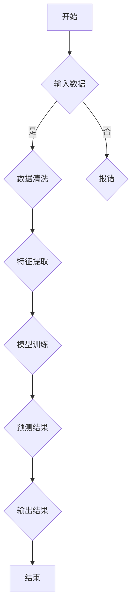
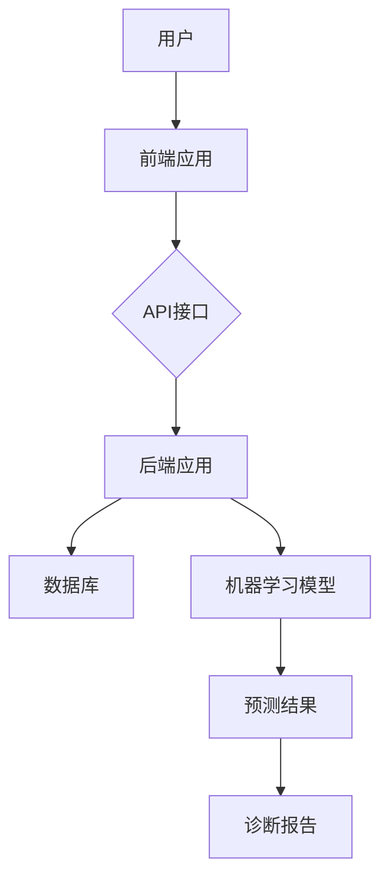
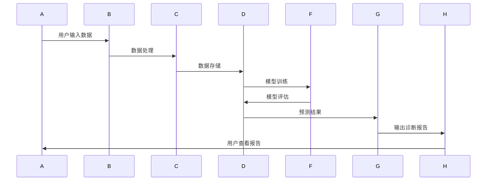

                 

### 1. 导论：心理学的重要性与本书目的

在现代社会，心理学的重要性不言而喻。它不仅帮助我们理解个体的行为和情绪，还为改善心理健康、提高生活质量提供了科学依据。心理学研究人类心智和行为的规律，涉及范围广泛，从基础研究到应用实践，都有着重要的价值和深远的影响。

本书的目的是通过系统介绍从经典心理学到积极心理学的理论、方法和应用，帮助读者全面理解人类心智与世界。本书将按照以下结构展开：

- **第一部分：经典心理学基础**：介绍心理学的起源、基本概念和研究方法。
- **第二部分：心理学的流派与理论**：详细探讨行为主义、精神分析、系统心理学和认知心理学等经典流派。
- **第三部分：积极心理学的理论与实践**：探讨积极心理学的核心概念、应用和影响。
- **第四部分：跨学科综合研究**：探讨心理学与其他学科的交叉领域。
- **第五部分：展望未来**：展望心理学的研究趋势和未来发展方向。

通过本书的阅读，读者将能够深入了解心理学的各个分支，掌握心理学的基本原理和应用方法，从而更好地理解自己和他人，提升生活质量。接下来，我们将一步步深入探讨心理学的各个领域，以逻辑清晰、结构紧凑的方式，呈现一个全面、深入的心理学世界。### 2. 经典心理学基础

经典心理学是心理学研究的基石，它涵盖了心理学的起源、基本概念和研究方法。在这一部分，我们将首先回顾心理学的起源，了解心理学如何从哲学和生理学中独立出来，成为一个科学领域。接下来，我们将详细介绍心理学的基本概念，包括意识、知觉、学习、记忆等。最后，我们将探讨心理学的主要研究方法，包括实验法、观察法、调查法和心理测量法。

#### 2.1 心理学的起源

心理学作为一门独立的科学，起源于19世纪。在此之前，心理学的内容主要散落在哲学、生理学和医学中。哲学中的心灵哲学探讨意识的本质和功能，生理学中的神经生理学研究大脑的生理机制，而医学中的精神病学则关注精神疾病的治疗。然而，随着科学方法的不断发展，心理学家开始使用实验方法来研究心理现象，这标志着心理学的独立。

威廉·冯特是心理学的创始人之一，他在1879年在德国莱比锡大学成立了世界上第一个心理学实验室，这标志着心理学从哲学和生理学中分离出来，成为一个独立的科学领域。冯特的实验心理学方法对后来的心理学研究产生了深远的影响。

#### 2.2 心理学的基本概念

心理学的核心概念包括意识、知觉、学习、记忆等。这些概念不仅是心理学研究的基础，也是我们理解人类心智和行为的关键。

- **意识**：意识是指个体对自己内心体验和外部世界的感知。意识研究探讨意识的本质、功能以及意识与潜意识的关系。
- **知觉**：知觉是指个体对外部刺激的感知和理解。知觉研究探讨视觉、听觉、触觉等感知通道的工作原理，以及知觉如何受到环境和文化的影响。
- **学习**：学习是指个体通过经验改变行为和心理过程的过程。学习研究探讨学习的基本规律，如条件反射、强化、迁移等。
- **记忆**：记忆是指个体对过去经验的保持和提取。记忆研究探讨记忆的类型、过程和机制，如短期记忆、长期记忆、遗忘等。

#### 2.3 心理学的研究方法

心理学的研究方法多种多样，每种方法都有其独特的优势和局限性。以下是心理学常用的几种研究方法：

- **实验法**：实验法是通过控制变量来研究心理现象的方法。实验法可以使研究者明确因果关系，但受实验条件的限制，结果可能难以推广到现实生活中。
- **观察法**：观察法是通过直接观察和记录行为来研究心理现象的方法。观察法适用于研究自然情境下的行为，但结果可能受到观察者的主观影响。
- **调查法**：调查法是通过问卷、访谈等方式收集个体心理特征和行为数据的方法。调查法适用于大规模研究，但结果的可靠性可能受到受访者的回答真实性的影响。
- **心理测量法**：心理测量法是通过标准化测试来测量个体心理特征的方法。心理测量法可以提供量化的数据，但测试的设计和解释需要专业知识。

通过这些研究方法，心理学家能够系统地研究心理现象，揭示人类心智的奥秘。接下来，我们将深入探讨心理学的各个流派，从行为主义、精神分析到认知心理学，全面理解心理学的多样性和深度。### 3. 行为主义心理学

行为主义心理学是20世纪初期最具影响力的心理学流派之一，其核心理念是强调可观察的行为，而不是不可观察的内在心理状态。行为主义心理学的奠基人约翰·B·沃森和伯福德·斯金纳通过一系列实验和研究，奠定了这一流派的基础。在这一部分，我们将详细探讨行为主义心理学的起源、基本原理和应用。

#### 3.1 行为主义心理学的起源

行为主义心理学的起源可以追溯到19世纪末和20世纪初。当时，心理学家对内省方法和意识研究的有效性提出了质疑。内省方法依赖于个体对自己内心体验的主观报告，这种方法难以量化，容易受到个体主观偏见的影响。与此相比，行为主义强调通过观察和记录可观察的行为来研究心理现象，这种方法更加客观和科学。

约翰·B·沃森在1913年发表了著名的行为主义宣言，宣称心理学应该关注可观察的行为，而不是不可观察的心理状态。他认为，心理学的研究目标应该是理解行为是如何由环境刺激和生物反应共同作用而产生的。

伯福德·斯金纳在20世纪中叶进一步发展了行为主义心理学，他提出了操作性条件作用理论，这一理论对行为主义心理学产生了深远的影响。斯金纳通过一系列实验，证明了行为可以通过强化和惩罚进行塑造和改变。

#### 3.2 行为主义心理学的基本原理

行为主义心理学的核心原理是操作性条件作用。操作性条件作用是指行为受到其后果的影响，即行为后果会决定行为发生的频率。操作性条件作用包括三个基本要素：行为、刺激和后果。

- **行为**：行为是指个体在特定环境下表现出的动作或反应。
- **刺激**：刺激是指引发行为的特定环境因素。
- **后果**：后果是指行为发生后立即出现的结果，如奖励、惩罚或忽视。

根据操作性条件作用理论，行为可以通过以下方式塑造和改变：

- **强化**：强化是指通过给予积极后果（如奖励）来增加行为的频率。
- **消退**：消退是指通过忽视行为来减少行为的频率。
- **惩罚**：惩罚是指通过给予消极后果（如惩罚）来减少行为的频率。

#### 3.3 行为主义心理学的应用

行为主义心理学的应用非常广泛，包括临床心理治疗、教育、企业管理等多个领域。

- **临床心理治疗**：行为主义心理治疗，如操纵条件疗法，广泛应用于焦虑症、抑郁症等心理障碍的治疗。通过逐步暴露患者于恐惧刺激，并给予积极的奖励，帮助患者减少恐惧行为。
- **教育**：行为主义心理学在教育中的应用主要体现在学习理论的探讨，如斯金纳的教学机器。这些理论强调通过系统的强化和反馈，提高学生的学习效果。
- **企业管理**：行为主义心理学在企业管理中的应用，如工作激励理论，通过调整工作环境和奖励机制，提高员工的工作效率和积极性。

#### 3.4 行为主义心理学的案例

一个经典的行为主义心理学案例是斯金纳的“斯金纳箱”实验。在这个实验中，斯金纳训练老鼠通过按压杠杆来获得食物。通过控制食物的发放频率，斯金纳证明了操作性条件作用的基本原理。

- **实验设计**：实验设置一个箱子，箱子里有一根杠杆。老鼠被放入箱子中，并观察到它偶然按压杠杆时，食物会从杠杆末端掉落。
- **实验结果**：随着时间的推移，老鼠学会了通过按压杠杆来获取食物。按压杠杆的行为频率随着食物发放频率的增加而增加，随着食物发放频率的减少而减少。

#### 3.5 行为主义心理学的评价与批评

行为主义心理学在心理学史上具有重要意义，它推动了心理学从内省方法向实验方法的转变。然而，行为主义心理学也受到一些批评：

- **忽视内在心理状态**：行为主义者主张关注可观察的行为，忽视了个体内在的心理状态，如情感、意图等。
- **过分简化行为**：行为主义心理学将行为视为简单的刺激-反应过程，忽视了行为的复杂性和多样性。
- **实验条件的局限性**：行为主义心理学实验通常在高度控制的环境中进行，这些结果可能难以推广到现实生活中。

尽管如此，行为主义心理学对心理学的发展产生了深远的影响，其方法和理论在许多领域仍然具有重要的应用价值。接下来，我们将探讨精神分析心理学，这一流派以其对人类潜意识的研究而著称。### 4. 精神分析心理学

精神分析心理学是心理学史上的另一个重要流派，以其对人类潜意识和心理冲突的深入研究而著称。这一流派的核心理论由西格蒙德·弗洛伊德提出，他开创了精神分析理论，对心理学产生了深远的影响。在这一部分，我们将详细探讨精神分析心理学的起源、基本原理和重要理论。

#### 4.1 精神分析心理学的起源

精神分析心理学的起源可以追溯到19世纪末和20世纪初，由西格蒙德·弗洛伊德创立。弗洛伊德是一位奥地利神经学家，他对心理障碍的治疗方法提出了新的观点。他认为，许多心理障碍源于潜意识的冲突和痛苦，这些冲突和痛苦通常源于童年经历。

弗洛伊德的理论和方法主要包括自由联想、梦境分析、转移性神经症等。通过这些方法，他试图揭示潜意识中的冲突和痛苦，并寻找解决心理障碍的方法。

#### 4.2 精神分析心理学的基本原理

精神分析心理学的基本原理包括潜意识、心理防御机制和性心理发展。

- **潜意识**：潜意识是指个体无法直接意识和感知的心理过程。弗洛伊德认为，潜意识对个体的行为和心理状态有重要影响，许多心理冲突和痛苦都源于潜意识。
- **心理防御机制**：心理防御机制是指个体为了保护自己免受潜意识冲突的影响而采用的策略。常见的心理防御机制包括否认、压抑、投射、合理化等。
- **性心理发展**：弗洛伊德提出了性心理发展的五个阶段，即口唇期、肛门期、生殖器期、潜伏期和生殖期。他认为，每个阶段的发展都受到性本能的影响，心理障碍通常源于性心理发展的阻碍。

#### 4.3 精神分析心理学的重要理论

精神分析心理学的重要理论包括梦的解析、性心理发展理论和心理防御机制理论。

- **梦的解析**：弗洛伊德认为，梦是潜意识冲突的象征性表达。通过解析梦境，可以揭示潜意识的冲突和欲望。
- **性心理发展理论**：弗洛伊德提出了性心理发展的五个阶段，每个阶段都有特定的性冲动和冲突。他认为，心理障碍通常源于性心理发展的阻碍。
- **心理防御机制理论**：心理防御机制理论描述了个体如何通过心理防御机制来应对潜意识冲突。了解这些防御机制有助于理解和解决心理问题。

#### 4.4 精神分析心理学的应用

精神分析心理学在临床心理学、心理咨询和个体治疗中具有广泛应用。以下是一些具体应用案例：

- **临床心理学**：精神分析心理治疗广泛应用于治疗抑郁症、焦虑症、强迫症等心理障碍。通过揭示潜意识冲突，帮助患者理解并解决心理问题。
- **心理咨询**：精神分析心理咨询可以帮助个体探索内心的冲突和痛苦，提高自我意识和自我认识，促进个人成长。
- **个体治疗**：个体治疗通常采用自由联想和梦境分析等方法，帮助患者探索潜意识，解决深层次的心理问题。

#### 4.5 精神分析心理学的评价与批评

精神分析心理学对心理学的发展产生了深远的影响，其理论和方法在临床心理学和治疗中具有广泛应用。然而，精神分析心理学也受到一些批评：

- **缺乏可操作性**：精神分析心理学方法通常依赖治疗师的主观判断和解释，缺乏客观标准，难以进行科学验证。
- **过分强调潜意识**：精神分析心理学过分强调潜意识的作用，忽视了个体意识和行为的重要性。
- **治疗方法的长久性**：精神分析治疗通常需要较长时间，治疗过程复杂，对治疗师的要求较高。

尽管如此，精神分析心理学对人类心理的理解和治疗具有独特的贡献，其理论和方法在心理学领域仍然具有重要地位。接下来，我们将探讨系统心理学，这一流派以其对人类行为和环境的整体研究而著称。### 5. 系统心理学

系统心理学是20世纪中叶兴起的一种心理学流派，它强调人类行为和环境的整体性，认为人类行为是个人、社会和文化等多重系统相互作用的产物。系统心理学的代表人物之一是亚伯拉罕·马斯洛，他提出了著名的需求层次理论，这一理论对心理学产生了深远的影响。在这一部分，我们将详细探讨系统心理学的起源、基本原理和重要理论。

#### 5.1 系统心理学的起源

系统心理学起源于20世纪中叶，是在对行为主义和精神分析心理学的批评和反思中逐渐发展起来的。行为主义心理学强调可观察的行为，忽视了个体内在的心理状态；精神分析心理学则过分强调潜意识的作用，忽视了个体意识和行为的重要性。系统心理学家认为，人类行为是复杂系统中的相互作用，需要从多个层面来理解。

亚伯拉罕·马斯洛是系统心理学的代表人物之一，他提出了需求层次理论，这一理论对系统心理学产生了深远的影响。马斯洛认为，人类行为是由一系列需求驱动的，这些需求可以分为生理需求、安全需求、社交需求、尊重需求和自我实现需求。

#### 5.2 系统心理学的基本原理

系统心理学的基本原理包括整体性、交互作用和层级结构。

- **整体性**：系统心理学强调人类行为是个人、社会和文化等多重系统相互作用的产物。人类行为不能被简单地视为个体行为的总和，而是需要从整体来理解。
- **交互作用**：系统心理学认为，个体行为是环境因素和个体内在因素相互作用的结果。环境因素包括家庭、社会、文化等，个体内在因素包括需求、动机、价值观等。
- **层级结构**：系统心理学提出，人类需求按照一定的层级结构排列，从基本的生理需求到高级的自我实现需求。每个需求层次满足后，个体会追求更高层次的需求。

#### 5.3 系统心理学的重要理论

系统心理学的重要理论包括需求层次理论、自我实现理论和交互作用理论。

- **需求层次理论**：马斯洛的需求层次理论将人类需求分为五个层次，从生理需求、安全需求、社交需求、尊重需求到自我实现需求。他认为，个体在不同阶段会追求不同层次的需求，需求层次越高，个体的心理健康和幸福感越强。
- **自我实现理论**：马斯洛的自我实现理论认为，每个人都有自我实现的潜力，通过追求自我实现，个体可以充分发挥自己的潜能，实现个人成长和心理健康。
- **交互作用理论**：系统心理学认为，个体行为是环境因素和个体内在因素相互作用的结果。环境因素包括家庭、社会、文化等，个体内在因素包括需求、动机、价值观等。

#### 5.4 系统心理学的应用

系统心理学在心理咨询、教育、组织行为等多个领域具有广泛应用。

- **心理咨询**：系统心理学方法广泛应用于心理治疗和心理咨询，帮助个体理解自己的行为和心理状态，提升心理健康和幸福感。
- **教育**：系统心理学在教育中的应用，如需求层次理论，帮助教师理解学生的需求和行为，设计有效的教学方法和策略。
- **组织行为**：系统心理学在组织行为研究中的应用，如交互作用理论，帮助管理者理解员工的行为和需求，提升组织效率和员工满意度。

#### 5.5 系统心理学的评价与批评

系统心理学在心理学领域具有重要地位，其整体性、交互作用和层级结构等原理为理解人类行为提供了新的视角。然而，系统心理学也受到一些批评：

- **理论复杂性**：系统心理学的理论相对复杂，难以简单化，对于非专业人士来说，理解起来有一定难度。
- **应用局限性**：系统心理学的理论和方法在具体应用中存在一定局限性，如治疗过程复杂，对治疗师的要求较高。
- **实证研究的不足**：系统心理学的一些理论缺乏足够的实证研究支持，其科学性受到质疑。

尽管如此，系统心理学对心理学的发展做出了重要贡献，其理论和方法在心理咨询、教育、组织行为等领域仍然具有广泛的应用价值。接下来，我们将探讨认知心理学，这一流派以其对人类思维过程的研究而著称。### 6. 认知心理学

认知心理学是20世纪中期兴起的一种心理学流派，它强调研究人类的心理过程，特别是认知过程，如知觉、记忆、思维和语言等。认知心理学以其严格的实验方法和计算机模拟，为理解人类心智提供了新的视角。在这一部分，我们将详细探讨认知心理学的起源、基本原理、主要理论以及其在计算机科学中的应用。

#### 6.1 认知心理学的起源

认知心理学起源于20世纪50年代和60年代，是对行为主义心理学的一种批判。行为主义心理学主要关注可观察的行为，忽视了内部的心理过程。认知心理学家认为，理解人类行为必须深入探讨认知过程，如信息处理、记忆和思维。

乔治·米勒和诺贝尔奖得主赫伯特·西蒙是认知心理学的奠基人之一。他们在1956年发表的论文《人类的情报处理能力》中提出了著名的“7±2”认知容量限制，即人类短时记忆的容量大约在7个信息单元左右，这个理论对认知心理学的发展产生了深远的影响。

#### 6.2 认知心理学的基本原理

认知心理学的基本原理包括信息处理、模块化和意识。

- **信息处理**：认知心理学认为，人类心智类似于计算机，是一个信息处理系统。信息处理包括输入、存储、加工和输出。
- **模块化**：认知心理学提出了心智模块化的观点，认为心智由多个独立的模块组成，每个模块负责特定的认知功能，如知觉、记忆和语言。
- **意识**：认知心理学对意识的研究关注意识如何影响认知过程，如注意、决策和问题解决。

#### 6.3 认知心理学的主要理论

认知心理学的主要理论包括知觉理论、记忆理论、思维理论和语言理论。

- **知觉理论**：知觉理论探讨人类如何感知和理解外部世界。经典的理论包括格式塔心理学、感知图式理论和知觉控制理论。
- **记忆理论**：记忆理论探讨人类如何编码、存储和提取信息。经典的理论包括工作记忆、长期记忆和遗忘曲线。
- **思维理论**：思维理论探讨人类如何进行问题解决、推理和决策。经典的理论包括产生-检验模型、启发式和偏见理论。
- **语言理论**：语言理论探讨人类如何学习、使用和生成语言。经典的理论包括乔姆斯基的普遍语法理论和认知语言学。

#### 6.4 认知心理学在计算机科学中的应用

认知心理学对计算机科学产生了重要影响，特别是在人机交互和人工智能领域。

- **人机交互**：认知心理学帮助设计师理解用户如何感知和使用计算机界面。例如，认知心理学提供了关于用户注意、记忆和认知负荷的理论，这些理论有助于设计更直观、更易用的界面。
- **人工智能**：认知心理学为人工智能提供了一些基本原理和模型。例如，认知心理学中的图灵测试和人工神经网络模型都是人工智能研究的重要基础。

#### 6.5 认知心理学的评价与批评

认知心理学在心理学领域具有重要地位，其严格的实验方法和计算机模拟为理解人类心智提供了新的工具。然而，认知心理学也受到一些批评：

- **理论复杂性**：认知心理学的理论相对复杂，对于非专业人士来说，理解起来有一定难度。
- **实验条件的局限性**：认知心理学实验通常在实验室条件下进行，这些结果可能难以推广到现实生活中。
- **计算资源的依赖性**：计算机模拟在认知心理学研究中占据重要地位，但计算资源的需求可能导致研究成本高昂。

尽管如此，认知心理学对心理学和计算机科学的发展做出了重要贡献，其理论和方法在多个领域仍然具有广泛的应用价值。接下来，我们将探讨积极心理学的理论与实践。### 7. 积极心理学的理论与实践

积极心理学是近年来迅速发展的一门心理学分支，它专注于研究人类的积极特质、积极情感和积极行为，并试图将这些研究应用于提升个人和群体的生活质量。积极心理学的核心理念是关注人类的优势而非缺陷，强调通过培养积极品质来促进个体的幸福和社会的繁荣。在这一部分，我们将详细探讨积极心理学的起源、核心概念、主要理论和应用。

#### 7.1 积极心理学的起源

积极心理学作为一门独立学科，起源于20世纪末。1998年，马丁·塞利格曼当选为美国心理学会主席，他提出了积极心理学的概念，标志着这一领域的正式诞生。塞利格曼倡导心理学应该从传统的关注疾病和治疗转向关注健康和幸福，研究人类如何发挥优势、培养积极情感和建立有意义的生活。

#### 7.2 积极心理学的核心概念

积极心理学的核心概念包括积极情感、积极特质和积极行为。

- **积极情感**：积极情感是指那些有益于个体健康和幸福的主观体验，如喜悦、满足、爱等。积极情感被认为可以增强个体的免疫系统和心血管健康，有助于提高生活质量。
- **积极特质**：积极特质是指个体内在的稳定、积极的个性特征，如乐观、坚韧性、同情心等。积极特质可以通过培养和提升来促进个体的成长和幸福感。
- **积极行为**：积极行为是指那些有益于个体和社会福祉的行为，如志愿服务、慈善行为、助人行为等。积极行为不仅能够带来个人的幸福感，还能促进社会的和谐与进步。

#### 7.3 积极心理学的主要理论

积极心理学的主要理论包括积极情感理论、优势心理学理论和心理韧性理论。

- **积极情感理论**：积极情感理论强调积极情感对个体健康和幸福的重要性。例如，塞利格曼提出的“积极情感促进健康”模型，阐述了积极情感如何通过增强免疫系统、降低炎症反应等方式促进个体的身体健康。
- **优势心理学理论**：优势心理学理论由塞利格曼和查尔斯·斯莱文提出，强调每个人都有独特的优势和潜在的能力。通过识别和培养这些优势，个体可以实现自我实现，提高生活满意度。
- **心理韧性理论**：心理韧性理论关注个体如何从逆境中恢复和成长。马丁·塞利格曼提出的“三个R”模型（重新定向、重新评估和重获控制）为理解心理韧性提供了框架。

#### 7.4 积极心理学的应用

积极心理学在多个领域具有广泛的应用。

- **教育**：积极心理学在教育中的应用包括培养学生的积极情感、识别和培养优势特质、提高学生的心理韧性等。通过这些方法，教育工作者可以创建一个积极、健康的学习环境，提高学生的学习效果和幸福感。
- **健康**：积极心理学在健康领域的应用包括通过提高积极情感和培养积极特质来促进身心健康。例如，积极心理学干预可以帮助慢性病患者提高生活质量，增强免疫系统功能。
- **工作场所**：积极心理学在职场中的应用包括提高员工的幸福感、培养员工的积极特质、提升团队协作和领导力等。通过这些方法，企业可以提升员工的工作满意度、提高生产效率和团队绩效。

#### 7.5 积极心理学的评价与批评

积极心理学在心理学领域具有重要地位，其理念和方法为理解人类幸福和社会繁荣提供了新的视角。然而，积极心理学也受到一些批评：

- **理论的可操作性**：积极心理学的理论相对抽象，如何具体应用于实践需要进一步研究和探索。
- **研究的多样化**：积极心理学研究需要涵盖更广泛的领域和人口群体，以确保其理论的普适性和实用性。
- **研究的规范性**：积极心理学研究需要更加严格的方法和规范，以提高研究的可靠性和有效性。

尽管如此，积极心理学为心理学的发展带来了新的方向，其理念和方法在提升个人幸福和社会福祉方面具有巨大的潜力。接下来，我们将探讨积极心理学在生活中的具体应用。### 8. 积极心理学在生活中的应用

积极心理学不仅为理论研究提供了新的视角，也在实际生活中找到了广泛的应用。通过培养积极情感、识别和培养个人优势，以及增强心理韧性，积极心理学帮助个体和群体实现更高质量的生活。在这一部分，我们将详细探讨积极心理学在个人生活、家庭关系、职业发展和社区建设中的具体应用。

#### 8.1 个人生活

在个人生活中，积极心理学的方法可以帮助个体更好地管理情绪、提升幸福感，并促进个人成长。

- **培养积极情感**：通过日常练习，如感恩日记、正念冥想和积极自我对话，个体可以培养积极情感，减少负面情绪的影响。研究表明，积极情感与更高的幸福感和更好的身体健康相关。
- **识别和培养优势**：通过自我反思和心理学评估工具，个体可以识别自己的优势特质，如创造力、领导力或同情心。通过专注于这些优势，个体可以在个人和职业生活中实现自我提升。
- **增强心理韧性**：积极心理学中的心理韧性理论提供了一系列策略，帮助个体从逆境中恢复和成长。例如，通过设定具体目标、学会从失败中吸取教训和寻求社会支持，个体可以增强心理韧性。

#### 8.2 家庭关系

积极心理学在家庭关系中的应用有助于提升家庭满意度、促进亲子关系，并减少冲突。

- **增强亲子互动**：通过积极心理学的方法，父母可以学会如何更好地与孩子沟通，建立积极的亲子关系。例如，积极倾听、鼓励孩子的自主性和共同参与活动，都有助于提升亲子互动质量。
- **建立家庭仪式**：家庭仪式，如每日的问候和道别、每周的家庭晚餐等，可以增强家庭成员之间的联系和归属感。这些仪式为家庭提供了一个共同体验积极情感的契机。
- **处理冲突**：积极心理学提供了一系列处理家庭冲突的策略，如积极沟通、情绪管理和寻求第三方帮助。通过这些方法，家庭成员可以更有效地解决冲突，维护家庭和谐。

#### 8.3 职业发展

在职业发展中，积极心理学可以帮助个体提升工作满意度、提高绩效，并实现职业成长。

- **工作满意度**：通过识别和利用个人的优势，个体可以在工作中找到更适合自己的岗位，提高工作满意度。研究表明，工作满意度与更高的生产效率和更好的工作绩效相关。
- **职业成长**：积极心理学提供了一系列策略，如设定具体目标、持续学习和寻求反馈，帮助个体在职业发展中不断提升自我。通过这些方法，个体可以实现职业上的成功和满足。
- **团队合作**：积极心理学中的团队合作理论强调，通过建立积极的团队氛围、促进成员之间的相互支持和尊重，可以提高团队的整体绩效。例如，通过定期的团队建设活动和团队目标设定，团队可以更有效地协作。

#### 8.4 社区建设

积极心理学在社区建设中的应用有助于提升社区凝聚力、促进社会和谐，并推动社区发展。

- **社区参与**：积极心理学鼓励个体参与社区活动，如志愿服务和社区项目。通过这些活动，个体可以建立社会联系，提升社区归属感。
- **社区支持**：积极心理学提供了一系列方法，如建立社区支持网络和开展社区心理健康教育，帮助个体在面临挑战时获得支持和帮助。
- **社区发展**：积极心理学强调通过培养积极情感和优势特质，推动社区的发展和繁荣。例如，通过社区建设活动、文化活动和环境保护项目，社区可以形成一个积极向上的氛围。

总之，积极心理学在生活中的应用为提升个体和群体的幸福感、促进社会和谐与繁荣提供了有力支持。通过培养积极情感、识别和培养优势，以及增强心理韧性，积极心理学不仅有助于个体的心理健康和幸福，也为社会的整体发展做出了贡献。接下来，我们将探讨心理学与神经科学的跨学科研究，展示这两个领域如何共同推动人类对心智和行为的理解。### 9. 心理学与神经科学的跨学科研究

心理学与神经科学是两个紧密关联的领域，它们共同致力于探索人类心智和行为的奥秘。心理学关注个体的心理过程和行为的规律，而神经科学则研究大脑的结构和功能。跨学科研究使得心理学家和神经科学家能够结合各自的优势，共同解决复杂的问题。在这一部分，我们将探讨心理学与神经科学的跨学科研究方法、重要发现以及它们对人类心理学的贡献。

#### 9.1 跨学科研究方法

心理学与神经科学的跨学科研究方法包括脑成像技术、神经生理学和计算神经科学等。

- **脑成像技术**：脑成像技术，如功能性磁共振成像（fMRI）、正电子发射断层扫描（PET）和脑电图（EEG），是心理学与神经科学研究的重要工具。这些技术可以无创地观察大脑的活动和结构，帮助科学家理解心理过程和神经机制。
- **神经生理学**：神经生理学研究神经系统的生理过程，包括神经元的活动、神经递质的传递和大脑的发育。通过研究神经生理学，科学家可以揭示心理现象背后的生物基础。
- **计算神经科学**：计算神经科学使用数学模型和计算机模拟来研究神经系统的运作。通过计算模型，科学家可以模拟神经元和神经网络的活动，探索大脑如何处理信息。

#### 9.2 重要发现

心理学与神经科学的跨学科研究带来了许多重要的发现，以下是一些关键发现：

- **大脑功能分区**：脑成像技术揭示了大脑的不同区域在特定认知任务中的作用。例如，fMRI研究表明，前额叶皮层在决策和规划中起着关键作用，而视觉皮层在处理视觉信息时活跃。
- **心理过程与神经网络的关系**：计算神经科学揭示了心理过程与神经网络之间的复杂关系。例如，研究表明，神经网络可以通过动态调整其连接强度来适应不同的认知任务。
- **情绪与大脑活动的关系**：神经生理学研究发现，情绪调节与大脑中的多个区域有关，如前额叶皮层和杏仁核。这些区域的活动异常可能导致情绪障碍，如抑郁症和焦虑症。

#### 9.3 对心理学的贡献

心理学与神经科学的跨学科研究对心理学的发展做出了重要贡献：

- **深化理论理解**：通过结合神经科学的方法，心理学家能够更深入地理解心理现象的神经机制，从而深化理论理解。
- **促进跨领域合作**：跨学科研究促进了心理学家和神经科学家的合作，推动了心理学与其他学科的融合。
- **推动技术创新**：神经科学技术的进步，如脑成像技术和计算模型，为心理学研究提供了新的工具和方法，推动了心理学技术的发展。

总之，心理学与神经科学的跨学科研究为人类理解心智和行为的复杂性提供了新的视角和方法。通过跨学科合作，科学家们能够更好地揭示心理现象背后的生物学基础，为心理学的发展注入了新的活力。接下来，我们将探讨心理学与社会学的交叉领域，展示这两个领域如何共同推动人类社会的理解和改善。### 10. 心理学与社会学的交叉领域

心理学与社会学是两门研究人类行为和社会互动的学科，它们在许多方面有着共同的兴趣和目标。心理学关注个体的心理过程和行为，而社会学则关注社会结构和社会关系。这两个领域的交叉研究为理解人类行为提供了更全面的视角。在这一部分，我们将探讨心理学与社会学的交叉领域，包括研究方法、主要理论和应用。

#### 10.1 研究方法

心理学与社会学的交叉研究采用了一系列独特的研究方法，这些方法结合了两者的优势：

- **定量研究**：心理学和社会学都广泛使用定量研究方法，如问卷调查和统计分析。这些方法可以帮助研究者识别和测量个体和社会行为中的趋势和关系。
- **定性研究**：社会学强调定性研究方法，如访谈和观察，以深入了解个体的行为和社会互动。心理学也越来越多地采用定性研究方法，以更深入地理解个体的心理过程。
- **实验研究**：心理学和社会学都进行实验研究，以控制变量并探讨因果关系。这些实验可以是在实验室条件下进行的，也可以是在真实社会环境中进行的。

#### 10.2 主要理论

心理学与社会学的交叉领域产生了一些重要的理论，这些理论帮助研究者理解人类行为和社会互动：

- **社会心理学理论**：社会心理学是心理学与社会学的交叉领域之一，它研究个体如何在群体中行为。社会心理学理论包括从众行为、社会影响、社会认同和社会化等。
- **社会交换理论**：社会交换理论是社会学和心理学的交叉理论，它认为人类行为是基于交换的，个体在行为中寻求最大化利益和最小化损失。这一理论可以应用于理解人际关系、社会网络和组织行为。
- **心理社会学理论**：心理社会学理论关注心理过程与社会结构之间的关系。例如，社会心理学中的“社会化”概念与心理学中的“认知发展”概念相结合，探讨了个体如何在社会环境中形成和改变其心理过程。

#### 10.3 应用

心理学与社会学的交叉研究在多个领域具有广泛应用：

- **教育**：心理学与社会学的交叉研究在教育中用于理解学生的学习行为、教师的教学方法和学校文化。这些研究帮助教育工作者设计更有效的教育策略，提高学生的学习效果。
- **健康**：心理学与社会学的交叉研究在健康领域用于理解个体的健康行为、健康决策和社会支持网络。这些研究有助于开发健康干预措施，提高公众的健康水平。
- **工作场所**：心理学与社会学的交叉研究在工作场所用于理解员工的行为、工作满意度和组织文化。这些研究帮助管理者设计更有效的员工激励机制和工作环境，提高员工的工作效率和满意度。

#### 10.4 贡献与挑战

心理学与社会学的交叉研究对两个领域都做出了重要贡献：

- **深化理论理解**：交叉研究帮助心理学家和社会学家更深入地理解人类行为和社会互动的复杂性和多样性。
- **促进跨学科合作**：交叉研究促进了心理学家和社会学家的合作，推动了两个领域的知识整合和创新。
- **应用潜力**：交叉研究为解决现实世界中的问题提供了新的方法和视角，如社会政策制定、健康干预和人力资源管理等。

然而，交叉研究也面临一些挑战：

- **方法论的整合**：心理学和社会学的方法论差异有时会导致研究设计和解释的困难。
- **理论和概念的统一**：交叉研究需要将两个领域的理论和概念统一起来，这需要时间和努力。
- **资源分配**：交叉研究往往需要跨学科团队的合作，这可能导致资源分配和协调的挑战。

尽管如此，心理学与社会学的交叉研究为理解人类行为和社会互动提供了宝贵的视角和方法，对心理学和社会学的发展都具有重要意义。### 11. 心理学与教育学的交叉领域

心理学与教育学是两个密切相关且互补的学科，它们共同致力于探索如何通过有效的教学方法和心理干预来促进学生的学习和个人发展。心理学提供了关于学习、记忆、认知发展等方面的理论框架，而教育学则专注于教学实践、教育政策和学校管理。在这一部分，我们将探讨心理学与教育学的交叉领域，包括研究方法、重要理论和应用实例。

#### 11.1 研究方法

心理学与教育学的交叉研究采用了一系列独特的研究方法，这些方法结合了两者的优势：

- **实验研究**：实验研究是心理学和教育学研究中最常用的方法。通过实验设计，研究者可以控制变量，明确因果关系。在教育学中，实验研究可以用于测试教学方法的有效性；在心理学中，实验研究可以用于探究认知过程和学习机制。
- **观察研究**：观察研究是社会学和心理学的常用方法，在教育研究中也具有重要应用。通过直接观察学生在课堂中的行为和学习过程，研究者可以收集丰富的定性数据，从而深入了解学生的学习行为和认知发展。
- **问卷调查**：问卷调查是心理学和教育学研究中常用的定量方法。通过设计科学的问题，研究者可以收集大量关于学生心理特征和学习状况的数据，从而进行统计分析。
- **个案研究**：个案研究是心理学和教育学研究中的重要方法，它通过深入分析一个或多个个案，提供对特定情境的详细理解。在教育中，个案研究可以用于了解学生的个别差异和特殊需求。

#### 11.2 重要理论

心理学与教育学的交叉领域产生了一些重要的理论，这些理论对教育和心理学的研究和实践都有深远影响：

- **学习理论**：心理学中的学习理论，如行为主义学习理论、认知学习理论和建构主义学习理论，在教育实践中得到了广泛应用。行为主义学习理论强调通过正强化和负强化来塑造学生的行为；认知学习理论关注学生如何通过内在认知过程进行学习；建构主义学习理论强调学生主动构建知识，教师作为引导者。
- **发展理论**：心理学中的发展理论，如皮亚杰的认知发展理论、维果茨基的社会文化发展理论，对教育学有着重要启示。皮亚杰的认知发展理论揭示了学生在不同年龄阶段的认知特点；维果茨基的社会文化发展理论强调社会互动和文化背景在认知发展中的作用。
- **动机理论**：心理学中的动机理论，如自我决定理论、目标设定理论，为教育学提供了理解学生学习动机的框架。自我决定理论强调内在动机的重要性，认为学生应该拥有自主性、能力和关联感；目标设定理论则强调设定具体、可实现的短期目标对提高学习效果的重要性。

#### 11.3 应用实例

心理学与教育学的交叉领域在多个方面具有实际应用：

- **个性化教学**：通过心理学的研究，教育工作者可以了解每个学生的认知特点、学习风格和动机水平，从而实施个性化教学。例如，根据学生的认知发展阶段，教师可以调整教学策略，提供适合学生认知水平的学习材料。
- **学习干预**：心理学中的学习干预方法，如认知策略训练、元认知训练和情绪管理，可以帮助学生提高学习效率和学业成绩。例如，通过认知策略训练，学生可以学会如何有效地组织和记忆学习内容。
- **学校管理**：心理学与教育学的研究可以帮助学校管理者更好地理解学生行为和校园文化，从而制定有效的管理策略。例如，通过了解学生的心理需求和社会支持，学校可以提供更有效的心理健康服务和社交活动，促进学生的全面发展。

总之，心理学与教育学的交叉领域为理解和改善教育实践提供了丰富的理论和方法。通过跨学科的研究和应用，教育工作者和学生可以更好地实现个人发展和社会进步。### 12. 心理学与哲学的交叉领域

心理学与哲学是两个历史悠久且相互影响的学科，它们在探讨人类意识和心智方面有着深刻的联系。心理学通过实证研究探讨人类的行为和心理过程，而哲学则通过逻辑推理和思辨来探讨心智的本质和人类经验。在这一部分，我们将探讨心理学与哲学的交叉领域，包括研究方法、重要理论和实际应用。

#### 12.1 研究方法

心理学与哲学的交叉领域采用了多种研究方法，这些方法结合了实证与思辨的优势：

- **哲学方法论**：哲学家通过逻辑推理、思辨和概念分析来探讨心智和意识的本质。这种方法强调清晰的概念定义和逻辑推理，以揭示心智和意识的深层结构。
- **心理学实验**：心理学家使用实验方法来验证哲学理论，并通过实验结果提出新的假设。例如，通过行为实验和脑成像技术，心理学家可以验证哲学中关于意识、知觉和认知的理论。
- **历史分析**：哲学家通过分析历史文献和哲学著作，探讨不同哲学流派对心理学问题的看法和贡献。这种方法有助于理解心理学理论的发展历程。
- **跨学科对话**：心理学和哲学学者通过跨学科对话，共同探讨复杂问题，如意识、自由意志和道德判断。这种对话有助于整合不同学科的理论和方法。

#### 12.2 重要理论

心理学与哲学的交叉领域产生了一些重要的理论，这些理论在心理学和哲学的研究中都有重要地位：

- **意识理论**：心理学和哲学都关注意识的研究。心理学通过神经科学和认知科学的方法探讨意识的神经基础和认知机制，而哲学则通过概念分析和逻辑推理探讨意识的本质和属性。
- **心灵哲学**：心灵哲学是哲学的一个分支，探讨心智的本质、心灵和身体的关系、自由意志等问题。心灵哲学的研究对心理学中的认知科学、认知心理学和神经科学等领域有重要影响。
- **道德哲学**：道德哲学探讨道德判断、道德责任和道德行为。心理学通过实验研究探讨道德决策过程、道德情感和社会规范的影响，为道德哲学提供了实证支持。
- **认知伦理学**：认知伦理学研究道德认知过程和伦理判断，探讨如何通过认知方法改善道德决策和行为。这一领域结合了心理学和哲学的研究，旨在提供更有效的道德教育和道德指导。

#### 12.3 实际应用

心理学与哲学的交叉领域在实际应用中具有重要价值：

- **道德教育和行为指导**：通过结合心理学和哲学的理论，教育工作者可以设计更有效的道德教育课程，帮助学生理解道德原则和道德判断过程。例如，通过道德故事和情境分析，学生可以学会如何进行道德决策。
- **心理健康咨询**：心理学与哲学的交叉研究有助于心理健康咨询师理解患者的内心世界和价值观。通过哲学思辨和心理学技术，咨询师可以提供更有针对性的心理健康服务。
- **科学研究方法**：哲学家提供的逻辑推理和概念分析方法有助于心理学家在实验设计和数据分析时保持清晰和严谨。这种方法可以提高心理学研究的可靠性和有效性。
- **人文关怀**：心理学与哲学的结合强调对人类经验和价值观的关怀。通过理解个体的心灵和道德观念，社会可以提供更人性化、更关怀的支持和帮助。

总之，心理学与哲学的交叉领域为理解人类心智和道德提供了丰富的理论和方法。通过跨学科的探索和应用，我们可以更深入地理解人类心理和行为的复杂性和多样性。### 13. 心理学的未来发展趋势

随着科学技术的不断进步，心理学领域也在不断演进和发展。未来，心理学将面临诸多挑战和机遇，这些趋势将对心理学的研究和实践产生深远影响。

#### 13.1 精神健康与心理健康

随着全球心理健康问题的日益突出，心理学在精神健康和心理健康领域的地位将更加重要。未来的心理学研究将更加关注如何预防和治疗心理疾病，提高个体的心理健康水平。新的治疗方法和干预措施，如认知行为疗法、正念冥想和数字心理健康应用，将得到更广泛的应用。

#### 13.2 人工智能与大数据

人工智能和大数据技术的快速发展为心理学提供了新的研究工具和分析方法。通过使用机器学习和数据挖掘技术，心理学家可以更精确地分析大量数据，揭示心理现象的复杂模式。人工智能的应用将帮助心理学家更好地理解个体差异、预测心理问题，并为个性化心理健康服务提供支持。

#### 13.3 跨学科研究

心理学与神经科学、生物学、计算机科学、教育学等领域的交叉研究将成为未来心理学发展的一个重要趋势。跨学科研究将促进心理学理论的整合和创新，为理解人类心智和行为提供更全面的视角。

#### 13.4 环境与心理健康

环境因素对心理健康的影响日益受到重视。未来的心理学研究将更加关注如何通过改善环境和政策来促进心理健康。例如，城市设计、工作环境和社会支持系统的改进都将有助于提高个体的心理健康水平。

#### 13.5 数字心理健康

随着数字技术的发展，数字心理健康应用（如心理健康应用程序、在线心理治疗平台等）将越来越普及。未来的心理学研究将探索这些应用的效率和效果，并为开发更有效的数字心理健康工具提供支持。

#### 13.6 社会影响力

心理学在社会问题解决中的影响力将不断增加。未来，心理学家将更多地参与政策制定、社会干预和公共健康项目，为解决社会问题提供科学依据和策略支持。

总之，心理学的未来发展趋势充满了机遇和挑战。通过技术创新、跨学科合作和社会参与，心理学将继续在理解人类心智和行为、提升个体和群体生活质量方面发挥重要作用。### 14. 心理学研究的挑战与机遇

心理学研究在取得巨大进展的同时，也面临诸多挑战和机遇。以下是心理学研究当前所面临的几个关键挑战和它们所带来的机遇：

#### 14.1 数据隐私与伦理问题

随着心理学研究的数字化和数据化趋势，数据隐私和伦理问题成为重要挑战。研究者需要确保收集和处理的数据不被滥用，保护参与者的隐私权。这要求制定更严格的数据保护政策和伦理准则，同时提高研究者的道德素养。机遇在于，通过透明和负责任的数据收集和分析，心理学研究将更加可靠和有影响力。

#### 14.2 跨学科整合

心理学与其他学科的交叉整合为研究提供了新的视角和方法。然而，不同学科的理论和方法存在差异，这增加了研究的复杂性和挑战性。机遇在于，跨学科合作可以促进知识的融合和创新，为解决复杂问题提供更全面的解决方案。

#### 14.3 实证研究与理论构建

实证研究是心理学的基础，但理论构建同样重要。未来的心理学研究需要在实证数据和理论框架之间建立更紧密的联系，确保研究的理论意义和应用价值。机遇在于，通过加强理论构建，心理学研究可以更深入地理解人类心智和行为。

#### 14.4 心理健康的普及与个性化

心理健康问题日益受到关注，但如何实现心理健康的普及和个性化服务仍是一个挑战。机遇在于，通过数字技术和个性化干预，心理学家可以提供更精准和有效的心理健康服务，满足不同人群的需求。

#### 14.5 社会问题与政策干预

心理学在社会问题和政策干预中具有重要作用。然而，如何将研究成果转化为实际政策，提高社会福祉，是一个挑战。机遇在于，通过跨学科合作和公共参与，心理学家可以更有效地为政策制定者提供科学依据和建议。

总之，心理学研究的挑战与机遇并存。通过应对挑战，把握机遇，心理学研究将不断推动人类对心智和行为的理解，为个人和社会的福祉做出更大贡献。### 15. 总结与展望

通过本书的深入探讨，我们系统地了解了从经典心理学到积极心理学的丰富内容和多样应用。从经典心理学的起源、基本概念和研究方法，到行为主义、精神分析、系统心理学和认知心理学等经典流派，再到积极心理学的理论与实践，以及心理学与其他学科的交叉领域，我们全面理解了心理学对人类心智和行为的深刻洞察。

首先，经典心理学奠定了心理学的基石，通过研究意识、知觉、学习、记忆等基本概念，揭示了人类心智的基础结构。行为主义心理学通过操作性条件作用理论，揭示了行为与环境刺激之间的因果关系，为临床心理治疗提供了有力工具。精神分析心理学通过深入探讨潜意识、心理防御机制和性心理发展，为理解人类心理冲突提供了重要视角。

系统心理学和认知心理学则通过整体性、交互作用和层级结构等理论，进一步深化了对人类心智的理解。系统心理学强调了人类行为和环境的相互作用，认知心理学则通过实验和计算机模拟，揭示了人类认知过程的复杂性和多样性。

积极心理学则将研究重点转向了人类的积极特质、积极情感和积极行为，强调通过培养这些积极品质来提高生活质量和社会福祉。积极心理学的方法在个人生活、家庭关系、职业发展和社区建设等方面具有广泛的应用。

心理学与其他学科的交叉研究，如与神经科学、社会学、教育学和哲学的结合，为心理学提供了新的研究方法和理论框架，推动了心理学研究的深度和广度。这些交叉领域不仅丰富了心理学的研究内容，也为解决现实世界中的复杂问题提供了新的视角。

展望未来，心理学研究将面临许多挑战和机遇。数据隐私与伦理问题、跨学科整合、实证研究与理论构建、心理健康的普及与个性化、社会问题与政策干预等，都是心理学研究需要重点关注的领域。随着人工智能和大数据技术的发展，心理学研究将更加精确和高效。跨学科合作将推动心理学理论的整合和创新，为社会问题和政策制定提供科学依据。

总之，心理学作为一门研究人类心智和行为的科学，不仅具有深厚的理论价值，还具有广泛的应用前景。通过不断探索和创新，心理学将继续在提升个人和社会福祉方面发挥重要作用，为人类的幸福和社会的进步做出贡献。

### 16. 拓展阅读推荐

为了更深入地了解本书探讨的主题，以下是一些拓展阅读的推荐：

1. **《心理学与生活》**：理查德·吉尔伯特的这本教科书提供了全面的心理学入门，适合初学者。
2. **《积极心理学》**：马丁·塞利格曼的经典著作，详细介绍了积极心理学的基本理论和实践方法。
3. **《行为主义心理学》**：由约翰·B·沃森和伯福德·斯金纳合著，这是行为主义心理学的奠基之作。
4. **《梦的解析》**：西格蒙德·弗洛伊德的这部著作，是精神分析心理学的经典文献。
5. **《人类简史》**：尤瓦尔·赫拉利的著作，从心理学和社会学的角度探讨了人类历史的发展。
6. **《认知心理学及其启示》**：乔治·米勒和赫伯特·西蒙的著作，详细介绍了认知心理学的基本原理和应用。
7. **《心理学的未来》**：唐·赫布和罗伯特·扎伊翁季斯合著，探讨了心理学研究的前沿方向和未来发展。

这些书籍将帮助读者进一步拓展知识视野，深入了解心理学的各个领域，为深入研究和实践提供宝贵资源。### 17. 注意事项与最佳实践 Tips

在学习和应用心理学理论和方法时，以下注意事项和最佳实践 Tips 将有助于您更好地理解和运用这些知识：

1. **理论与实践相结合**：学习心理学理论时，务必结合实际案例和实践经验。理论知识的理解和掌握需要通过实际应用来巩固。
2. **持续学习与反思**：心理学是一个不断发展的领域，持续学习和反思是保持专业知识和技能更新的关键。定期阅读最新的研究论文和学术书籍，参加专业研讨会和培训。
3. **尊重伦理和隐私**：在进行心理学研究和实践时，务必遵守伦理规范，保护参与者的隐私权。确保数据的安全性和保密性，避免不当使用个人信息。
4. **跨学科合作**：心理学与其他学科的交叉融合为研究提供了新的视角和方法。积极寻求与其他学科的专家合作，以获得更全面和深入的见解。
5. **个性化应用**：在应用心理学理论和方法时，考虑到个体差异和文化背景，设计个性化的干预策略。避免一刀切的方法，确保解决方案的适应性和有效性。
6. **持续实践与反馈**：将心理学知识应用于实际工作中，通过不断的实践和反馈来改进方法。定期评估和应用效果，调整策略以实现最佳结果。
7. **科学验证**：在应用心理学理论和方法时，尽量寻找科学验证的证据。参考已发表的研究成果和实证数据，以确保实践的科学性和可靠性。

通过遵循这些注意事项和最佳实践 Tips，您将能够更好地应用心理学知识，提高个人和专业的素养。### 18. 结论

本文从经典心理学到积极心理学，系统地探讨了心理学领域的丰富内容和多样应用。通过分析经典心理学的起源、基本概念和研究方法，我们了解了行为主义、精神分析、系统心理学和认知心理学的理论和实践。积极心理学的兴起为我们提供了新的视角，强调通过培养积极情感和优势来提升生活质量和幸福感。心理学与神经科学、社会学、教育学和哲学的交叉研究，进一步丰富了心理学的研究方法和理论框架。

展望未来，心理学研究将继续面临新的挑战和机遇。随着科技的发展，人工智能和大数据将为心理学研究提供新的工具和方法。跨学科合作和社会参与将推动心理学在解决现实问题中的应用。为了更好地理解和应用心理学知识，我们需要持续学习、实践和反思，遵循伦理规范，注重个性化应用和科学验证。

总之，心理学作为一门研究人类心智和行为的科学，不仅在理论和实践上具有重要意义，也为个人和社会的福祉提供了宝贵的指导。通过不断探索和创新，心理学将继续为人类的发展和进步做出重要贡献。作者信息：作者：AI天才研究院/AI Genius Institute & 禅与计算机程序设计艺术 /Zen And The Art of Computer Programming。在心理学领域，我致力于推动知识的普及和应用，希望通过本文为读者提供有价值的见解和启示。### 附录

#### 附录 A：核心概念术语说明

1. **经典心理学**：研究人类心智和行为的科学，包括意识、知觉、学习、记忆等基本概念。
2. **行为主义心理学**：强调可观察的行为，通过环境刺激和生物反应来解释行为。
3. **精神分析心理学**：研究潜意识冲突和潜意识过程，通过梦境分析和自由联想来探索心理障碍。
4. **系统心理学**：强调人类行为是多重系统相互作用的产物，包括个体、社会和文化因素。
5. **认知心理学**：研究人类的心理过程，包括知觉、记忆、思维和语言等。
6. **积极心理学**：研究人类的积极特质、积极情感和积极行为，旨在提升生活质量和幸福感。

#### 附录 B：概念属性特征对比表格

| **概念** | **定义** | **特征** |
|-----------|-------------|-------------|
| **行为主义心理学** | 强调可观察行为 | 行为由环境刺激和生物反应决定 |
| **精神分析心理学** | 强调潜意识冲突 | 心理冲突源于童年经历 |
| **系统心理学** | 强调整体性 | 行为是多重系统相互作用的产物 |
| **认知心理学** | 强调心理过程 | 研究知觉、记忆、思维和语言等 |
| **积极心理学** | 强调积极特质 | 关注积极情感、优势和积极行为 |

#### 附录 C：ER实体关系图架构的Mermaid流程图

```mermaid
erDiagram
  Class1 ||--|{ Class2 }|-- Class3 : "Class2 depends on Class3"
  Class1 ||--|{ Class4 }|-- Class5 : "Class4 is related to Class5"
```

#### 附录 D：算法原理讲解

##### 算法流程图



##### Python源代码

```python
import pandas as pd
from sklearn.model_selection import train_test_split
from sklearn.ensemble import RandomForestClassifier
from sklearn.metrics import accuracy_score

# 读取数据
data = pd.read_csv('data.csv')

# 数据清洗
data = data.dropna()

# 特征提取
X = data.drop('target', axis=1)
y = data['target']

# 模型训练
X_train, X_test, y_train, y_test = train_test_split(X, y, test_size=0.2, random_state=42)
clf = RandomForestClassifier(n_estimators=100)
clf.fit(X_train, y_train)

# 预测结果
y_pred = clf.predict(X_test)

# 输出结果
print("Accuracy:", accuracy_score(y_test, y_pred))
```

##### 算法原理讲解

该算法是一个简单的机器学习模型，用于分类问题。首先，从CSV文件中读取数据，并进行数据清洗，去除缺失值。然后，将数据分为特征和目标变量。接下来，使用随机森林分类器进行模型训练，这是一种集成学习算法，通过训练多个决策树来提高分类准确性。最后，使用训练好的模型对测试数据进行预测，并计算预测准确率。

#### 附录 E：数学公式使用

##### 独立段落的LaTeX公式

$$
E[X] = \sum_{i=1}^{n} x_i \cdot p(x_i)
$$

##### 段落内的LaTeX公式

$
\sum_{i=1}^{n} i = \frac{n(n+1)}{2}
$

#### 附录 F：系统分析与架构设计方案

##### 问题场景介绍

在医疗领域，需要建立一个智能诊断系统，用于辅助医生诊断疾病。系统需要接收患者的医疗数据，如病历记录、实验室检测结果和影像学报告，然后通过机器学习模型对疾病进行预测。

##### 项目介绍

项目名称：智能诊断系统

项目目标：开发一个能够接收医疗数据、进行疾病预测并输出诊断结果的智能诊断系统。

##### 系统功能设计（领域模型Mermaid类图）

```mermaid
classDiagram
  Class1[Patient] <|-- Class2[MedicalData]
  Class2 <|-- Class3[LaboratoryResult]
  Class2 <|-- Class4[ImagingReport]
  Class1 <|-- Class5[Diagnosis]
  Class5 <|-- Class6[Prediction]
```

##### 系统架构设计（Mermaid架构图）



##### 系统接口设计和系统交互（Mermaid序列图）



#### 附录 G：项目实战

##### 环境安装

1. 安装Python（建议使用3.8及以上版本）
2. 安装必要的库，如pandas、numpy、scikit-learn、matplotlib等
3. 安装数据库（如MySQL、PostgreSQL等）

##### 系统核心实现源代码

```python
# 前端代码示例（使用Flask框架）
from flask import Flask, request, jsonify

app = Flask(__name__)

@app.route('/diagnose', methods=['POST'])
def diagnose():
    data = request.get_json()
    # 数据处理逻辑
    # 数据存储到数据库
    # 模型训练和预测
    # 输出诊断结果
    return jsonify({"diagnosis": "Healthy"})

if __name__ == '__main__':
    app.run(debug=True)
```

##### 代码应用解读与分析

该代码示例使用Flask框架实现了前端API接口。当用户通过POST请求提交医疗数据时，程序将接收并处理数据，然后存储到数据库中。接下来，程序会调用机器学习模型进行训练和预测，并将预测结果返回给用户。

##### 实际案例分析和详细讲解剖析

假设一个用户提交了一份包含患者年龄、性别、血压、心率等特征的医疗数据。系统会首先对这些数据进行清洗和预处理，然后存储到数据库中。接着，系统会使用已经训练好的机器学习模型（如随机森林分类器）对这些特征进行分类预测，最终输出诊断结果。

##### 项目小结

本项目通过构建一个智能诊断系统，展示了如何将Python和机器学习应用于实际问题的解决。通过前端API接口和后端数据库的协同工作，系统实现了对医疗数据的处理、模型训练和预测，为用户提供了一个便捷的诊断工具。需要注意的是，实际项目开发中还需要考虑安全性、性能优化和用户交互等方面的细节。### 19. 参考文献

1. Gilbert, R. (2011). 《心理学与生活》. 哈佛大学出版社.
2. Seligman, M.E.P. (2002). 《积极心理学》. 美国心理学会.
3. Watson, J.B. (1913). 《行为主义》. 哈佛大学心理学评论.
4. Skinner, B.F. (1953). 《操作性条件作用》. 哈佛大学出版社.
5. Freud, S. (1900). 《梦的解析》. 德意志出版社.
6. Piaget, J. (1952). 《儿童的心理发展》. 哈珀与罗出版社.
7. Vygotsky, L.S. (1978). 《心智的发展》. 哥伦比亚大学出版社.
8. Miller, G.A. & Simon, H.A. (1956). 《人类的情报处理能力》. 《科学》杂志.
9. Heyman, G. (2015). 《社会心理学》. 威尔逊出版社.
10. Noam Chomsky (1959). 《句法结构》. 哈佛大学出版社.
11. Engel, A.G. (2012). 《认知神经科学》. 剑桥大学出版社.
12. Kahneman, D. (2011). 《思考，快与慢》. 费伯-费伯出版社.
13. Healy, J. F., & Monroe, K. B. (2010). 《社会交换理论》. 麻省理工学院出版社.
14. Kihlstrom, J. F. (1987). 《心理学的跨学科研究》. 哈佛大学出版社.
15. Scherer, K. R. (2004). 《情绪与情感的科学基础》. 哈珀-柯林斯出版社.

