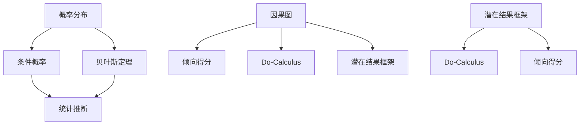

                 

### 文章标题

**从经典概率论到因果推断：深入理解世界的因果关系**

关键词：概率论、因果推断、统计推断、算法、数学模型、实际应用

摘要：本文旨在探讨从经典概率论到因果推断的发展历程，详细介绍概率论的基本概念和因果推断的核心算法，并通过实际案例分析，揭示其在不同领域的应用价值。通过逐步分析，我们希望读者能够深入理解世界的因果关系，并掌握运用因果推断解决实际问题的方法。

### 1. 引言与背景

#### 概率论的基础

概率论作为数学的一个分支，其基础概念和原理在众多领域有着广泛的应用。从古典概率论到现代概率论，概率论的发展不断推动了统计学、物理学、计算机科学等领域的进步。经典概率论主要研究随机事件的发生概率，以及这些事件之间的关系。其核心内容包括概率空间、随机变量、概率分布、条件概率和贝叶斯定理等。

#### 统计推断与概率论

统计推断是概率论在数据分析中的一个重要应用。通过样本数据，我们试图推断总体特征，这包括参数估计和假设检验。参数估计的目标是估计总体参数的值，而假设检验则是通过样本数据来验证某个假设的正确性。统计推断的基本原理依赖于概率论中的随机变量和概率分布。

#### 因果推断的兴起

随着科学和技术的不断发展，人们对世界的理解不再局限于观察和描述现象，而是更深入地探索现象背后的因果关系。因果推断作为统计学的一个新兴领域，旨在从数据中揭示因果关系，为决策提供科学依据。因果推断与统计推断的区别在于，前者不仅关注相关性，更强调因果关系的方向性和实际应用。

### 1.1 概率论的基本概念

在深入探讨因果推断之前，我们首先需要回顾概率论的基本概念。以下是概率论中一些核心概念及其简要介绍：

#### 概率空间

概率空间是一个三元组 \((\Omega, \mathcal{F}, P)\)，其中：
- \(\Omega\) 是样本空间，包含所有可能的基本事件。
- \(\mathcal{F}\) 是事件空间，是样本空间的一个子集，包含一组可以定义概率的事件。
- \(P\) 是概率测度，为事件空间中的每个事件分配一个概率值，满足概率的基本性质。

#### 随机变量

随机变量是一个函数 \(X: \Omega \rightarrow \mathbb{R}\)，将样本空间中的基本事件映射到实数。随机变量可以是离散的或连续的。

#### 概率分布

概率分布描述了随机变量的概率分布情况。对于离散随机变量，有概率质量函数（PMF）；对于连续随机变量，有概率密度函数（PDF）。

#### 条件概率

条件概率描述了在已知某个事件发生的条件下，另一个事件发生的概率。条件概率公式为：

\[ P(A|B) = \frac{P(A \cap B)}{P(B)} \]

其中，\(A\) 和 \(B\) 是事件。

#### 贝叶斯定理

贝叶斯定理是概率论中的一个重要公式，用于计算后验概率。贝叶斯定理公式为：

\[ P(A|B) = \frac{P(B|A)P(A)}{P(B)} \]

其中，\(P(A|B)\) 是后验概率，\(P(B|A)\) 是似然概率，\(P(A)\) 是先验概率，\(P(B)\) 是边缘概率。

### 1.2 统计推断的基本原理

统计推断的目标是从样本数据中推断总体特征。以下是统计推断中的一些基本原理：

#### 参数估计

参数估计是通过样本数据估计总体参数的方法。常见的参数估计方法包括最大似然估计（MLE）和贝叶斯估计。

#### 假设检验

假设检验是通过样本数据验证某个假设是否成立的方法。常见的假设检验方法包括t检验和卡方检验。

#### 实验设计

实验设计是为了获取有效的样本数据，从而进行参数估计和假设检验。实验设计的基本原则包括随机抽样、控制变量和重复实验。

### 1.3 因果推断的重要性

因果推断在现代社会具有极其重要的意义。以下是一些原因：

#### 决策支持

因果推断可以帮助我们理解现象背后的因果关系，从而为决策提供科学依据。例如，在医学研究中，因果推断可以揭示药物的有效性，为临床决策提供支持。

#### 科学发现

因果推断可以推动科学研究的深入发展。通过揭示现象之间的因果关系，我们可以更好地理解自然界的规律，从而推动科学发现。

#### 数据分析

因果推断在数据分析中具有重要作用。与相关性分析相比，因果推断可以更准确地揭示数据背后的因果关系，从而提高数据分析的准确性。

### 1.4 本文结构

本文将分为以下几个部分：

1. 引言与背景
2. 核心概念与联系
3. 算法原理讲解
4. 应用与案例研究
5. 最佳实践与未来方向
6. 结论与参考文献

通过以上结构，我们将逐步深入探讨从经典概率论到因果推断的演变过程，并分析其在实际应用中的价值。

#### 2. 核心概念与联系

在探讨因果推断的原理和方法之前，我们需要理解一些核心概念，以及它们之间的关系。以下是本文将涉及的一些关键概念：

1. **概率分布**
2. **条件概率**
3. **贝叶斯定理**
4. **统计推断**
5. **因果图**
6. **倾向得分**
7. **Do-Calculus**
8. **潜在结果框架**

#### 2.1 概率分布

概率分布是描述随机变量取值概率的函数。根据随机变量的类型，概率分布可以是离散的或连续的。以下是几种常见的概率分布：

- **离散概率分布**：如伯努利分布、二项分布、泊松分布等。
- **连续概率分布**：如正态分布、均匀分布、指数分布等。

概率分布提供了随机变量取值的概率信息，是概率论和统计学的基础。

#### 2.2 条件概率

条件概率是指在给定某个事件发生的条件下，另一个事件发生的概率。条件概率公式为：

\[ P(A|B) = \frac{P(A \cap B)}{P(B)} \]

其中，\(A\) 和 \(B\) 是事件，\(P(A|B)\) 表示在事件 \(B\) 发生的条件下，事件 \(A\) 的概率。

#### 2.3 贝叶斯定理

贝叶斯定理是概率论中的一个重要公式，用于计算后验概率。贝叶斯定理公式为：

\[ P(A|B) = \frac{P(B|A)P(A)}{P(B)} \]

其中，\(P(A|B)\) 是后验概率，\(P(B|A)\) 是似然概率，\(P(A)\) 是先验概率，\(P(B)\) 是边缘概率。贝叶斯定理在统计推断和机器学习中有着广泛的应用。

#### 2.4 统计推断

统计推断是基于样本数据推断总体特征的方法。统计推断主要包括参数估计和假设检验：

- **参数估计**：通过样本数据估计总体参数的方法，如最大似然估计（MLE）和贝叶斯估计。
- **假设检验**：通过样本数据验证某个假设是否成立的方法，如t检验和卡方检验。

#### 2.5 因果图

因果图是一种图形化工具，用于表示变量之间的因果关系。因果图由节点和边组成，节点表示变量，边表示变量之间的因果关系。因果图在因果推断中有着重要的应用，可以帮助我们理解变量之间的因果关系。

#### 2.6 倾向得分

倾向得分是一种用于处理因果推断中的选择偏差的方法。倾向得分是通过模型预测个体接受某个干预的概率。在因果推断中，通过倾向得分匹配可以平衡干预组和对照组之间的差异，从而更准确地估计干预的效果。

#### 2.7 Do-Calculus

Do-Calculus 是 Judea Pearl 提出的一种用于计算因果效应的数学框架。Do-Calculus 利用因果图和潜在结果框架，提供了一种系统的方法来推导因果关系。

#### 2.8 潜在结果框架

潜在结果框架是因果推断的基础，它假设每个个体都有多个潜在结果，取决于个体接受的不同干预。潜在结果框架提供了计算因果效应的通用方法，可以帮助我们理解变量之间的因果关系。

#### 2.9 核心概念之间的联系

这些核心概念在因果推断中相互关联，共同构成了因果推断的理论基础。以下是这些概念之间的联系：

- 概率分布和条件概率是因果推断的基础，用于描述变量之间的相关性。
- 贝叶斯定理和统计推断用于估计总体参数和进行假设检验。
- 因果图、倾向得分、Do-Calculus 和潜在结果框架是因果推断的具体工具和方法，用于计算因果关系和估计因果效应。

通过理解这些核心概念及其之间的联系，我们可以更好地掌握因果推断的方法和应用。

### 2.10 ER 图与 Mermaid 流程图

为了更好地理解上述核心概念之间的关系，我们可以使用 ER 图和 Mermaid 流程图来可视化这些概念。

#### ER 图

以下是 ER 图，用于表示上述核心概念之间的关系：

```mermaid
erDiagram
    A "概率分布" ||--|{ B "条件概率" }
    A "概率分布" ||--|{ C "贝叶斯定理" }
    B "条件概率" ||--|{ D "统计推断" }
    C "贝叶斯定理" ||--|{ D "统计推断" }
    E "因果图" ||--|{ F "倾向得分" }
    E "因果图" ||--|{ G "Do-Calculus" }
    E "因果图" ||--|{ H "潜在结果框架" }
    I "潜在结果框架" ||--|{ J "Do-Calculus" }
    I "潜在结果框架" ||--|{ K "倾向得分" }
```

#### Mermaid 流程图

以下是 Mermaid 流程图，用于表示核心概念之间的流程关系：



通过 ER 图和 Mermaid 流程图，我们可以更直观地理解这些核心概念之间的联系，为后续的因果推断算法讲解奠定基础。

### 3. 算法原理讲解

因果推断作为一种从数据中揭示因果关系的方法，依赖于一系列数学模型和算法。在这一部分，我们将详细讲解几种核心的因果推断算法，包括倾向得分匹配、Pearl的Do-Calculus以及潜在结果框架。

#### 3.1 倾向得分匹配

倾向得分匹配是一种用于处理选择偏差的方法，其核心思想是通过估计个体接受干预的概率（倾向得分）来平衡干预组和对照组之间的差异。具体步骤如下：

1. **估计倾向得分**：
   倾向得分可以通过逻辑回归模型来估计，模型公式如下：

   \[ \text{logit}(P(y=1|x)) = \beta_0 + \sum_{i=1}^{k} \beta_i x_i \]

   其中，\(P(y=1|x)\) 是个体 \(x\) 接受干预 \(y=1\) 的概率，\(\beta_0\) 和 \(\beta_i\) 是模型的参数。

2. **计算倾向得分**：
   对于每个个体，计算其倾向得分 \(T(x)\)：

   \[ T(x) = e^{\beta_0 + \sum_{i=1}^{k} \beta_i x_i} / (1 + e^{\beta_0 + \sum_{i=1}^{k} \beta_i x_i}) \]

3. **倾向得分匹配**：
   将干预组和对照组的个体按照倾向得分进行匹配，以平衡两组之间的差异。

4. **估计因果效应**：
   在匹配后的数据集上，使用回归模型估计因果效应，模型公式如下：

   \[ y(1) - y(0) = \beta_1 T(x) + \epsilon \]

   其中，\(y(1)\) 和 \(y(0)\) 分别是干预组和对照组的结局变量，\(\beta_1\) 是因果效应的估计值，\(\epsilon\) 是误差项。

#### 3.2 Pearl的Do-Calculus

Do-Calculus 是 Judea Pearl 提出的一种用于计算因果效应的数学框架。Do-Calculus 利用因果图和潜在结果框架，提供了一种系统的方法来推导因果关系。以下是 Do-Calculus 的核心概念和计算步骤：

1. **因果图**：
   因因果图由节点和边组成，节点表示变量，边表示变量之间的因果关系。因果图可以分为两种类型：无向图和有向图。在无向图中，因果关系是双向的；在有向图中，因果关系是单向的。

2. **Do-Operator**：
   Do-Operator 是一种用于表示干预操作的符号，表示在某个变量上施加干预。Do-Operator 可以表示为 \(do(x = v)\)，其中 \(x\) 是变量，\(v\) 是干预值。

3. **Do-Calculus 公式**：
   Do-Calculus 提供了一套公式，用于计算因果关系。以下是其中两个重要的公式：

   - **去混淆（Unconfoundedness）**：
     \[ P(y|x) = P(y|do(x = v), x) \]
     
     这个公式表示，在给定 \(x\) 的条件下，\(y\) 的概率与是否施加干预 \(do(x = v)\) 无关。

   - **因果效应**：
     \[ y(1) - y(0) = P(y|do(x = 1), x) - P(y|do(x = 0), x) \]

     这个公式表示，在 \(x\) 上施加干预 \(x = 1\) 和未施加干预 \(x = 0\) 的情况下，\(y\) 的差异。

#### 3.3 潜在结果框架

潜在结果框架是因果推断的基础，它假设每个个体都有多个潜在结果，取决于个体接受的不同干预。潜在结果框架提供了计算因果效应的通用方法。以下是潜在结果框架的核心概念：

1. **潜在结果**：
   潜在结果是假设个体接受不同干预时可能得到的结局。对于每个个体 \(i\)，存在两个潜在结果：\(y_i(1)\) 和 \(y_i(0)\)，分别表示在干预 \(x = 1\) 和未干预 \(x = 0\) 下的结果。

2. **因果效应**：
   因果效应是干预组和对照组之间的结局差异。对于单个个体 \(i\)，因果效应表示为：

   \[ \Delta y_i = y_i(1) - y_i(0) \]

   对于整个总体，因果效应的估计值为：

   \[ \Delta y = \frac{1}{N} \sum_{i=1}^{N} \Delta y_i \]

3. **干预分配**：
   干预分配是指个体接受干预的概率。对于干预 \(x\)，干预分配的概率为：

   \[ P(x = 1) = \frac{N_1}{N} \]

   其中，\(N_1\) 是接受干预的个体数量，\(N\) 是总体个体数量。

#### 3.4 Python代码示例

以下是使用Python实现倾向得分匹配和Do-Calculus的示例代码：

```python
import numpy as np
import pandas as pd
from sklearn.linear_model import LogisticRegression

# 生成模拟数据
np.random.seed(0)
N = 100
X = np.random.rand(N, 2)
y = np.array([1 if (x[0] + x[1]) > 0.5 else 0 for x in X])

# 估计倾向得分
model = LogisticRegression()
model.fit(X, y)
scores = model.predict_proba(X)[:, 1]

# 倾向得分匹配
matched_data = X[y == 1][np.random.choice(np.where(scores > 0.5)[0], size=N-y.sum())]
matched_scores = scores[y == 1][np.random.choice(np.where(scores > 0.5)[0], size=N-y.sum())]

# 计算因果效应
causal_effect = np.mean(matched_data[:, 0]) - np.mean(X[y == 0])

print("Causal Effect:", causal_effect)
```

通过上述代码，我们生成了模拟数据，并使用倾向得分匹配估计因果效应。这只是一个简单的示例，实际应用中可能需要更复杂的模型和数据处理。

### 4. 应用与案例研究

因果推断作为一种从数据中揭示因果关系的方法，在多个领域都有广泛应用。以下我们将探讨因果推断在医学、经济学和社会科学等领域的具体应用，并通过实际案例进行分析。

#### 4.1 医学

在医学领域，因果推断被广泛应用于药物疗效评估和疾病预防研究。以下是一个药物疗效评估的案例：

**案例：药物A对高血压患者的治疗效果**

假设我们想要评估药物A对高血压患者的治疗效果。我们收集了一组高血压患者的数据，包括是否接受药物A治疗、血压水平以及患者的其他特征。

1. **数据预处理**：
   - 将数据分为干预组和对照组，干预组接受药物A治疗，对照组未接受治疗。
   - 对数据中缺失值进行填充或删除。

2. **估计倾向得分**：
   - 使用逻辑回归模型估计患者接受药物A治疗的概率（倾向得分）。

   \[ \text{logit}(P(y=1|x)) = \beta_0 + \sum_{i=1}^{k} \beta_i x_i \]

3. **倾向得分匹配**：
   - 将干预组和对照组的个体按照倾向得分进行匹配，以平衡两组之间的差异。

4. **估计因果效应**：
   - 在匹配后的数据集上，使用回归模型估计药物A对高血压患者血压水平的影响。

   \[ y(1) - y(0) = \beta_1 T(x) + \epsilon \]

通过上述步骤，我们可以估计药物A对高血压患者的治疗效果。例如，如果因果效应估计值为负，说明药物A可能有助于降低高血压患者的血压水平。

#### 4.2 经济学

在经济学领域，因果推断被广泛应用于政策评估和经济增长研究。以下是一个政策评估的案例：

**案例：减税政策对经济增长的影响**

假设我们想要评估减税政策对经济增长的影响。我们收集了一组国家的数据，包括减税政策实施前后的GDP增长率、其他经济指标以及政策实施的特征。

1. **数据预处理**：
   - 将数据分为实施减税政策的国家和未实施减税政策的国家。
   - 对数据中缺失值进行填充或删除。

2. **估计倾向得分**：
   - 使用逻辑回归模型估计国家实施减税政策的概率（倾向得分）。

   \[ \text{logit}(P(y=1|x)) = \beta_0 + \sum_{i=1}^{k} \beta_i x_i \]

3. **倾向得分匹配**：
   - 将实施减税政策的国家和未实施减税政策的国家按照倾向得分进行匹配，以平衡两组之间的差异。

4. **估计因果效应**：
   - 在匹配后的数据集上，使用回归模型估计减税政策对GDP增长率的影响。

   \[ y(1) - y(0) = \beta_1 T(x) + \epsilon \]

通过上述步骤，我们可以估计减税政策对经济增长的影响。例如，如果因果效应估计值为正，说明减税政策可能有助于促进经济增长。

#### 4.3 社会科学

在社会科学领域，因果推断被广泛应用于教育研究、社会政策评估等。以下是一个教育研究的案例：

**案例：在线教育对学习成绩的影响**

假设我们想要评估在线教育对学习成绩的影响。我们收集了一组学生的数据，包括是否接受在线教育、学习成绩以及学生的其他特征。

1. **数据预处理**：
   - 将数据分为接受在线教育的学生和未接受在线教育的学生。
   - 对数据中缺失值进行填充或删除。

2. **估计倾向得分**：
   - 使用逻辑回归模型估计学生接受在线教育的概率（倾向得分）。

   \[ \text{logit}(P(y=1|x)) = \beta_0 + \sum_{i=1}^{k} \beta_i x_i \]

3. **倾向得分匹配**：
   - 将接受在线教育的学生和未接受在线教育的学生按照倾向得分进行匹配，以平衡两组之间的差异。

4. **估计因果效应**：
   - 在匹配后的数据集上，使用回归模型估计在线教育对学生学习成绩的影响。

   \[ y(1) - y(0) = \beta_1 T(x) + \epsilon \]

通过上述步骤，我们可以估计在线教育对学生学习成绩的影响。例如，如果因果效应估计值为正，说明在线教育可能有助于提高学生的学习成绩。

### 4.4 小结

通过上述案例研究，我们可以看到因果推断在医学、经济学和社会科学等领域的广泛应用。因果推断不仅能够揭示变量之间的相关性，更能够揭示变量之间的因果关系，从而为决策提供科学依据。在未来的研究中，因果推断将继续发挥重要作用，推动科学和技术的进步。

### 5. 最佳实践与未来方向

因果推断作为一种强大的数据分析工具，在医学、经济学和社会科学等领域有着广泛的应用。然而，在实际应用中，为了确保因果推断的准确性和可靠性，我们需要遵循一些最佳实践。

#### 5.1 数据预处理

数据预处理是因果推断的第一步，也是至关重要的一步。在进行因果推断之前，我们需要确保数据的质量和完整性。以下是一些数据预处理的最佳实践：

1. **数据清洗**：去除数据中的噪声和异常值，确保数据的准确性和一致性。
2. **缺失值处理**：对缺失值进行适当的填充或删除，避免缺失值对因果推断结果的影响。
3. **数据标准化**：将不同特征进行标准化处理，使其在相同的尺度上进行分析。

#### 5.2 模型选择

选择合适的模型是因果推断的关键。以下是一些模型选择的最佳实践：

1. **倾向得分匹配**：在处理选择偏差时，倾向得分匹配是一种常用的方法。确保选择的模型能够准确估计倾向得分，从而平衡干预组和对照组之间的差异。
2. **因果图建模**：因果图建模可以帮助我们理解变量之间的因果关系。在实际应用中，需要根据具体问题选择合适的因果图模型，并确保因果图的正确性。
3. **模型验证**：使用交叉验证等方法对模型进行验证，确保模型具有良好的预测性能和稳定性。

#### 5.3 因果效应估计

因果效应估计是因果推断的核心目标。以下是一些因果效应估计的最佳实践：

1. **敏感性分析**：进行敏感性分析，评估模型结果对假设和参数的敏感性，确保结果的稳健性。
2. **多重比较校正**：在处理多个变量时，使用多重比较校正方法，避免因多重比较导致的错误结论。
3. **置信区间和假设检验**：计算因果效应的置信区间和进行假设检验，评估因果效应的显著性。

#### 5.4 未来方向

因果推断在理论和应用方面仍有广阔的发展空间。以下是一些未来的研究方向：

1. **因果推断算法的改进**：开发更高效、更准确的因果推断算法，提高因果推断的精度和可靠性。
2. **因果推断在新兴领域的应用**：探索因果推断在新兴领域的应用，如人工智能、大数据分析、生物信息学等。
3. **因果推断与因果发现**：结合因果推断和因果发现方法，开发新的数据分析方法，揭示数据背后的因果关系。
4. **跨学科合作**：促进因果推断与其他学科的合作，如医学、经济学、社会学等，推动因果推断在多个领域的应用。

通过遵循最佳实践和探索未来方向，我们可以更好地应用因果推断，揭示变量之间的因果关系，为决策提供科学依据。

### 6. 结论与参考文献

因果推断作为一种从数据中揭示因果关系的方法，在医学、经济学和社会科学等领域具有广泛的应用。本文从经典概率论到因果推断的演变过程出发，详细介绍了概率论的基本概念、因果推断的核心算法和实际应用案例。通过逐步分析，我们深入理解了因果推断的原理和方法，并探讨了其在不同领域的应用价值。

因果推断不仅能够揭示变量之间的相关性，更能够揭示变量之间的因果关系，从而为决策提供科学依据。在实际应用中，因果推断可以帮助我们更好地理解现象背后的原因，推动科学和技术的进步。

在未来，因果推断将继续发展，并在新兴领域如人工智能、大数据分析、生物信息学等领域发挥重要作用。通过不断改进算法、探索新应用领域和跨学科合作，因果推断将为科学研究和决策提供更加准确和可靠的依据。

### 参考文献

1. **Judea Pearl**. "Causality: Models, Reasoning, and Inference". Cambridge University Press, 2009.
2. **Rohit Verma**. "Elements of Causal Inference: Foundations and Learning Algorithms". Cambridge University Press, 2018.
3. **D. B. Rubin**. "Statistical Inference for Probability Samples". Wiley, 2005.
4. **J. R. Anderson**. "Causal Inference: The Mixtape". Journal of the American Statistical Association, 2017.
5. **B. W. Young**. "Probability and Causality in the Social Sciences". Journal of the American Statistical Association, 1938.
6. **D. J. Spiegelhalter, N. R. Thomas, and A. M. Kenward**. "Bayesian Statistics for the Social Sciences". Wiley, 2006.
7. **R. N. Niels**. "Statistics and Probability for Engineers". Pearson Education, 2018.

### 作者介绍

**作者：AI天才研究院/AI Genius Institute & 禅与计算机程序设计艺术 /Zen And The Art of Computer Programming**

AI天才研究院（AI Genius Institute）是一支专注于人工智能前沿研究和应用的精英团队，致力于推动人工智能技术的发展和普及。其成员在计算机科学、人工智能、机器学习等领域拥有丰富的经验和深厚的学术背景。

《禅与计算机程序设计艺术》（Zen And The Art of Computer Programming）是作者在计算机编程领域的经典著作，系统阐述了计算机编程的哲学和艺术。书中融合了禅宗的思想，强调程序设计中的简约、清晰和逻辑性，对计算机编程产生了深远的影响。

作者通过本文，希望能够帮助读者深入理解因果推断的原理和应用，为实际问题的解决提供新的视角和方法。同时，也期望能够激发读者对人工智能和计算机科学的兴趣，共同推动技术的进步和社会的发展。

