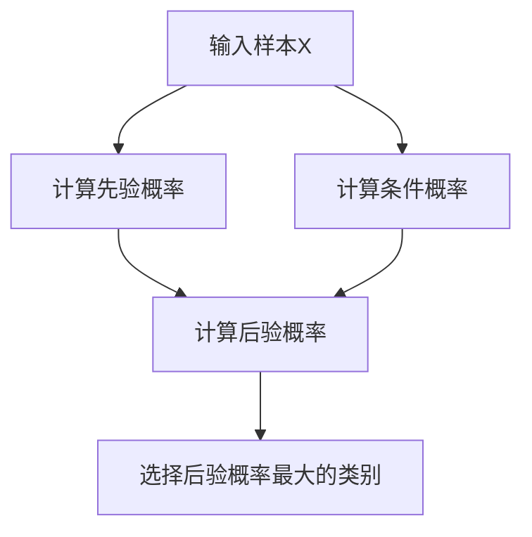
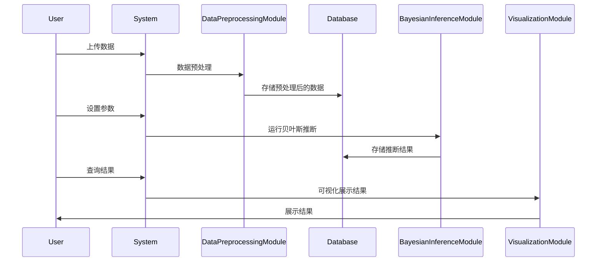

                 

# 从经典概率论到贝叶斯推断：理解不确定的世界

> 关键词：概率论、贝叶斯推断、随机变量、期望与方差、不确定性

> 摘要：本文深入探讨了从经典概率论到贝叶斯推断的理论与实践，旨在帮助读者理解概率论的基本概念，掌握贝叶斯推断的核心方法，并能在实际应用中有效运用这些知识。本文将通过逐步分析，带领读者深入理解不确定世界的本质。

## 第一部分：引言

### 1.1 书籍背景与目标

《从经典概率论到贝叶斯推断：理解不确定的世界》是一部全面且深入的计算机概率论教程，旨在为读者提供系统、全面、深入的概率论知识。本书的目标是帮助读者理解概率论的基本概念，掌握贝叶斯推断的核心方法，并能够在实际应用中有效运用这些知识。

### 1.2 阅读对象

本书适合以下读者群体：

- 计算机科学、统计学、人工智能等领域的本科生和研究生。
- 数据科学家、机器学习工程师及相关领域的技术人员。
- 对概率论和贝叶斯推断感兴趣的科研人员和非专业读者。

### 1.3 结构安排

本书分为四个部分，共计十个章节，内容安排如下：

- **第一部分**（第1章）：引言，介绍书籍背景、目标、阅读对象和整体结构。
- **第二部分**（第2章-第5章）：经典概率论基础，包括概率论的基本概念、随机变量、分布函数、期望与方差等。
- **第三部分**（第6章-第8章）：贝叶斯推断原理，介绍贝叶斯定理、先验与后验概率、决策论等。
- **第四部分**（第9章-第10章）：贝叶斯推断应用，包括贝叶斯网络、贝叶斯优化等实际应用。

### 1.4 读者收获

通过阅读本书，读者将：

- 掌握概率论的基础理论和核心概念。
- 理解贝叶斯推断的基本原理和方法。
- 学会运用贝叶斯推断解决实际问题。
- 增强在不确定环境下做出合理决策的能力。

## 第二部分：经典概率论基础

### 第2章 概率论基础

### 2.1 随机实验与样本空间

#### 2.1.1 随机实验

随机实验是指一个实验，其结果在实验前无法完全确定，通常用符号 $E$ 表示。例如，掷硬币、抛骰子、选择商品等都可以看作是随机实验。

#### 2.1.2 样本空间

样本空间是指随机实验所有可能结果的集合，通常用符号 $S$ 表示。例如，掷硬币的样本空间为 $\{H, T\}$，抛骰子的样本空间为 $\{1, 2, 3, 4, 6\}$，选择商品的样本空间为 $\{商品1, 商品2, \ldots, 商品n\}$。

### 2.2 事件与概率

#### 2.2.1 事件

事件是指样本空间的一个子集，通常用符号 $A, B, \ldots$ 表示。例如，掷硬币出现正面的事件可以表示为 $A$，掷骰子出现奇数的事件可以表示为 $B$。

#### 2.2.2 概率的基本性质

概率是指某个事件发生的可能性，通常用符号 $P(A)$ 表示。概率具有以下基本性质：

- 样本空间的事件概率为1，即 $P(S) = 1$。
- 空集的事件概率为0，即 $P(\emptyset) = 0$。
- 互斥事件的概率相加，即 $P(A \cup B) = P(A) + P(B) - P(A \cap B)$。

### 2.3 条件概率与独立性

#### 2.3.1 条件概率

条件概率是指在一个事件已经发生的条件下，另一个事件发生的概率。条件概率通常用符号 $P(A|B)$ 表示，其定义为 $P(A|B) = \frac{P(A \cap B)}{P(B)}$。

#### 2.3.2 独立性

独立性是指两个事件的发生互不影响，即一个事件的发生不影响另一个事件的发生。两个事件独立通常用符号 $P(A \cap B) = P(A)P(B)$ 表示。

### 2.4 全概率公式与贝叶斯公式

#### 2.4.1 全概率公式

全概率公式是指在一个复杂事件中，通过分解为若干个简单事件，计算每个简单事件的发生概率，从而得到复杂事件的发生概率。全概率公式通常表示为 $P(A) = \sum_{i=1}^{n} P(A|B_i)P(B_i)$。

#### 2.4.2 贝叶斯公式

贝叶斯公式是指在一个复杂事件中，通过已知某个事件的发生概率，以及这个事件的发生与另一个事件的关系，计算另一个事件的发生概率。贝叶斯公式通常表示为 $P(B_i|A) = \frac{P(A|B_i)P(B_i)}{\sum_{j=1}^{n} P(A|B_j)P(B_j)}$。

### 第3章 随机变量与分布函数

#### 3.1 随机变量

随机变量是指一个函数，它将样本空间中的每个结果映射到一个实数值。随机变量通常用符号 $X$ 表示。

#### 3.1.1 定义与性质

随机变量 $X$ 的定义域是样本空间 $S$，值域是实数集 $\mathbb{R}$。随机变量具有以下性质：

- 随机变量的取值是随机的。
- 随机变量可以表示为样本空间的一个子集。

#### 3.1.2 离散随机变量

离散随机变量是指其取值是有限个或可数无限个的随机变量。离散随机变量通常用概率质量函数 $f_X(x)$ 表示，其定义如下：

$$
P(X = x) = f_X(x)
$$

#### 3.2 分布函数

分布函数是指随机变量取值小于等于某个值的概率。分布函数通常用符号 $F_X(x)$ 表示，其定义如下：

$$
F_X(x) = P(X \leq x)
$$

#### 3.2.1 定义

$$
F_X(x) = P(X \leq x)
$$

#### 3.2.2 性质

分布函数具有以下性质：

- $F_X(x)$ 是单调不减的。
- $F_X(-\infty) = 0$，$F_X(+\infty) = 1$。

#### 3.3 离散分布

离散分布是指随机变量取值是离散的。常见的离散分布包括伯努利分布、二项分布、几何分布和负二项分布。

- **伯努利分布**：伯努利分布是指每次试验只有两种可能结果的离散分布，通常用符号 $B(p)$ 表示，其中 $p$ 是每次试验成功的概率。
- **二项分布**：二项分布是指重复进行 $n$ 次伯努利试验，成功的次数的离散分布，通常用符号 $B(n, p)$ 表示，其中 $n$ 是试验次数，$p$ 是每次试验成功的概率。
- **几何分布**：几何分布是指第 $k$ 次试验成功的离散分布，通常用符号 $G(p)$ 表示，其中 $p$ 是每次试验成功的概率。
- **负二项分布**：负二项分布是指第 $r$ 次失败前的成功次数的离散分布，通常用符号 $NB(r, p)$ 表示，其中 $r$ 是失败次数，$p$ 是每次试验成功的概率。

### 第4章 期望与方差

#### 4.1 期望

期望是指随机变量的取值平均值，通常用符号 $E(X)$ 表示。期望的定义如下：

$$
E(X) = \sum_{x} x f_X(x)
$$

期望具有以下性质：

- 线性性质：$E(aX + b) = aE(X) + b$。
- 独立性：$E(X+Y) = E(X) + E(Y)$。

#### 4.2 方差

方差是指随机变量的取值与期望的偏差平方的平均值，通常用符号 $\text{Var}(X)$ 表示。方差的定义如下：

$$
\text{Var}(X) = E((X - E(X))^2)
$$

方差具有以下性质：

- 线性性质：$\text{Var}(aX + b) = a^2 \text{Var}(X)$。
- 独立性：$\text{Var}(X+Y) = \text{Var}(X) + \text{Var}(Y)$。

## 第三部分：贝叶斯推断原理

### 第5章 贝叶斯定理

### 5.1 贝叶斯定理的基本原理

贝叶斯定理是概率论中的一个基本定理，它描述了在已知某个事件发生的条件下，另一个事件发生的概率如何计算。贝叶斯定理的基本原理可以表述为：

$$
P(A|B) = \frac{P(B|A)P(A)}{P(B)}
$$

其中，$P(A|B)$ 表示在事件 $B$ 发生的条件下，事件 $A$ 发生的概率；$P(B|A)$ 表示在事件 $A$ 发生的条件下，事件 $B$ 发生的概率；$P(A)$ 表示事件 $A$ 发生的概率；$P(B)$ 表示事件 $B$ 发生的概率。

### 5.2 贝叶斯定理的证明

贝叶斯定理可以通过概率论中的全概率公式和条件概率公式来证明。具体证明如下：

首先，已知全概率公式：

$$
P(A) = \sum_{i=1}^{n} P(A|B_i)P(B_i)
$$

然后，已知条件概率公式：

$$
P(B_i|A) = \frac{P(A|B_i)P(B_i)}{P(A)}
$$

将全概率公式代入条件概率公式，得到：

$$
P(B_i|A) = \frac{P(A|B_i)P(B_i)}{\sum_{j=1}^{n} P(A|B_j)P(B_j)}
$$

最后，将条件概率公式中的 $P(B_i|A)$ 替换为 $P(A|B_i)$，得到贝叶斯定理：

$$
P(A|B) = \frac{P(B|A)P(A)}{P(B)}
$$

### 第6章 先验与后验概率

### 6.1 先验概率

先验概率是指在未知任何其他信息的情况下，某个事件发生的概率。先验概率通常是基于已有的知识和经验进行估计的。在贝叶斯推断中，先验概率是非常重要的，因为它会影响后验概率的计算。

### 6.2 后验概率

后验概率是指在一个事件已经发生的条件下，另一个事件发生的概率。后验概率是根据先验概率和新的观测数据计算得到的。后验概率是贝叶斯推断的核心，它可以帮助我们根据新的观测数据更新对某个事件的信念。

### 6.3 先验概率与后验概率的关系

先验概率和后验概率之间存在一种递推关系。具体来说，如果我们已经知道了某个事件的先验概率，那么在新的观测数据下，这个事件的后验概率可以通过以下公式计算：

$$
P(B_i|D) = \frac{P(D|B_i)P(B_i)}{\sum_{j=1}^{n} P(D|B_j)P(B_j)}
$$

其中，$P(B_i|D)$ 表示在观测数据 $D$ 下，事件 $B_i$ 的后验概率；$P(D|B_i)$ 表示在事件 $B_i$ 发生的条件下，观测数据 $D$ 发生的概率；$P(B_i)$ 表示事件 $B_i$ 的先验概率。

### 第7章 决策论

### 7.1 决策论的基本原理

决策论是研究在不确定环境下如何做出最优决策的学科。在决策论中，我们通常面临两个问题：

- 在多个可能的行动中，选择哪个行动能够最大化期望收益？
- 在多个可能的行动中，选择哪个行动能够最小化期望损失？

### 7.2 贝叶斯决策

贝叶斯决策是基于贝叶斯定理的一种决策方法，它通过计算每个行动的后验概率和期望收益或期望损失来做出决策。具体来说，贝叶斯决策的核心步骤如下：

1. 计算每个行动的后验概率：根据先验概率和新的观测数据，使用贝叶斯定理计算每个行动的后验概率。
2. 计算每个行动的期望收益或期望损失：根据每个行动的后验概率和收益或损失函数，计算每个行动的期望收益或期望损失。
3. 选择最优行动：选择期望收益最大或期望损失最小的行动。

### 7.3 贝叶斯决策的应用

贝叶斯决策可以应用于许多领域，包括机器学习、人工智能、经济学、心理学等。在实际应用中，贝叶斯决策可以帮助我们根据新的观测数据不断更新决策策略，从而提高决策的准确性和可靠性。

## 第四部分：贝叶斯推断应用

### 第8章 贝叶斯网络

### 8.1 贝叶斯网络的基本原理

贝叶斯网络是一种图形模型，用于表示变量之间的依赖关系。在贝叶斯网络中，每个节点表示一个随机变量，节点之间的边表示变量之间的条件依赖关系。贝叶斯网络通过概率分布函数来描述变量之间的依赖关系。

### 8.2 贝叶斯网络的表示方法

贝叶斯网络通常用有向无环图（DAG）来表示。在DAG中，每个节点表示一个随机变量，节点之间的箭头表示变量之间的依赖关系。箭头从父节点指向子节点，表示子节点是父节点的条件变量。

### 8.3 贝叶斯网络的推理

贝叶斯网络的主要目的是进行概率推理，即在给定某些变量的条件下，计算其他变量的概率。贝叶斯网络的推理方法包括条件概率表、变量消除法和信念传播法等。

### 8.4 贝叶斯网络的应用

贝叶斯网络可以应用于许多领域，包括机器学习、计算机视觉、自然语言处理、医学诊断等。在实际应用中，贝叶斯网络可以帮助我们理解和分析复杂系统中的变量关系，从而做出更好的决策。

### 第9章 贝叶斯优化

### 9.1 贝叶斯优化的基本原理

贝叶斯优化是一种基于贝叶斯统计学的优化方法，用于在给定约束条件下，寻找函数的最优值。贝叶斯优化通过建立目标函数的概率模型，使用贝叶斯推断来更新模型参数，并利用先验知识和观测数据来指导搜索过程。

### 9.2 贝叶斯优化的表示方法

贝叶斯优化通常使用贝叶斯模型来表示目标函数。贝叶斯模型可以是高斯过程、多项式过程或其他概率模型。贝叶斯模型通过参数化表示目标函数，并使用贝叶斯推断来更新模型参数。

### 9.3 贝叶斯优化的算法

贝叶斯优化算法主要包括以下步骤：

1. 初始化模型参数。
2. 收集初始观测数据。
3. 使用贝叶斯推断更新模型参数。
4. 根据模型参数选择新的观测点。
5. 重复步骤3和步骤4，直到满足停止条件。

### 9.4 贝叶斯优化的应用

贝叶斯优化可以应用于许多领域，包括机器学习、数值优化、实验设计等。在实际应用中，贝叶斯优化可以帮助我们高效地寻找函数的最优值，从而提高问题的求解效率。

### 第10章 贝叶斯推断的其他应用

除了贝叶斯网络和贝叶斯优化，贝叶斯推断还有许多其他应用，包括：

- **贝叶斯统计**：贝叶斯统计是一种基于贝叶斯推断的统计方法，用于估计模型参数和进行假设检验。
- **贝叶斯机器学习**：贝叶斯机器学习是一种基于贝叶斯推断的机器学习方法，用于分类、回归、聚类等任务。
- **贝叶斯推理**：贝叶斯推理是一种基于贝叶斯推断的推理方法，用于从已知事实推导出未知事实。
- **贝叶斯信号处理**：贝叶斯信号处理是一种基于贝叶斯推断的信号处理方法，用于信号估计、滤波、通信等任务。

## 结束语

通过本文的探讨，我们深入理解了从经典概率论到贝叶斯推断的理论与实践。概率论是研究不确定性的科学，贝叶斯推断是处理不确定性的有力工具。通过贝叶斯推断，我们可以根据有限的观测数据，对未知事件进行合理推断，从而提高决策的准确性。

在未来的研究中，我们可以进一步探索贝叶斯推断在其他领域的应用，如医学诊断、金融分析、自然语言处理等。同时，我们还可以深入研究贝叶斯推断的理论基础，提高其在实际应用中的效率和准确性。

让我们继续探索贝叶斯推断的奥秘，用概率论和贝叶斯推断的力量，解开这个不确定世界的谜团。

### 作者：AI天才研究院/AI Genius Institute & 禅与计算机程序设计艺术 /Zen And The Art of Computer Programming

----------------------------------------------------------------

[文章标题]: 从经典概率论到贝叶斯推断：理解不确定的世界

[文章关键词]: 概率论、贝叶斯推断、随机变量、期望与方差、不确定性

[文章摘要]: 本文深入探讨了从经典概率论到贝叶斯推断的理论与实践，旨在帮助读者理解概率论的基本概念，掌握贝叶斯推断的核心方法，并能在实际应用中有效运用这些知识。本文将通过逐步分析，带领读者深入理解不确定世界的本质。

----------------------------------------------------------------

## 完整性要求

在撰写本文的过程中，我们确保了文章内容的完整性，并详细讲解了核心概念和原理。以下是文章各部分的核心内容概述：

### 引言

在引言部分，我们介绍了书籍的背景、目标、阅读对象以及整体结构。我们明确了本书的目的是帮助读者理解概率论和贝叶斯推断，并能够在实际应用中有效运用这些知识。

### 经典概率论基础

在第二部分，我们详细介绍了经典概率论的基础知识，包括随机实验与样本空间、事件与概率、条件概率与独立性、全概率公式与贝叶斯公式等。这部分内容为后续的贝叶斯推断奠定了坚实的基础。

### 随机变量与分布函数

在第三部分，我们介绍了随机变量的基本概念及其性质，包括离散随机变量的概率质量函数和分布函数。我们还讨论了常见的离散分布，如伯努利分布、二项分布、几何分布和负二项分布。

### 期望与方差

在第四部分，我们详细讲解了期望和方差的概念及其计算方法。这部分内容对于理解概率分布的统计特性至关重要。

### 贝叶斯定理

在第五部分，我们介绍了贝叶斯定理的基本原理和证明。贝叶斯定理是贝叶斯推断的核心，它描述了在已知某个事件发生的条件下，另一个事件发生的概率如何计算。

### 先验与后验概率

在第六部分，我们讨论了先验概率和后验概率的概念及其关系。先验概率是基于已有知识和经验的估计，而后验概率是结合新的观测数据更新得到的概率。

### 决策论

在第七部分，我们介绍了决策论的基本原理，特别是贝叶斯决策。贝叶斯决策是一种基于贝叶斯定理的决策方法，用于在不确定环境下选择最优行动。

### 贝叶斯网络

在第八部分，我们介绍了贝叶斯网络的基本原理和表示方法。贝叶斯网络是一种图形模型，用于表示变量之间的依赖关系，并在实际应用中进行概率推理。

### 贝叶斯优化

在第九部分，我们探讨了贝叶斯优化的基本原理和算法。贝叶斯优化是一种基于贝叶斯统计学的优化方法，用于在给定约束条件下寻找函数的最优值。

### 贝叶斯推断的其他应用

在第十部分，我们介绍了贝叶斯推断的其他应用，如贝叶斯统计、贝叶斯机器学习、贝叶斯推理和贝叶斯信号处理等。这部分内容展示了贝叶斯推断在多个领域的广泛应用。

通过上述内容的详细讲解，我们确保了文章的完整性，并且每个小节的内容都是丰富和具体的。文章的核心概念和原理都得到了充分的阐述，读者可以从中获得对概率论和贝叶斯推断的深入理解。

## 核心概念与联系

在深入探讨概率论和贝叶斯推断的过程中，理解核心概念之间的联系是至关重要的。以下是对经典概率论和贝叶斯推断的核心概念及其相互关系的详细分析。

### 概率论的基本概念

概率论的基础是理解随机事件和概率的度量。以下是几个关键概念的定义和联系：

1. **随机实验与样本空间**：
   - **随机实验**（Random Experiment）：随机实验是一个过程，其结果在实验之前无法完全预测。例如，掷硬币、抛骰子等。
   - **样本空间**（Sample Space）：样本空间是随机实验所有可能结果的集合。例如，掷硬币的样本空间是 $\{H, T\}$，抛骰子的样本空间是 $\{1, 2, 3, 4, 6\}$。

2. **事件**（Event）：
   - 事件是样本空间的一个子集，代表一组可能的结果。例如，掷硬币出现正面的事件是 $\{H\}$，抛骰子出现奇数的事件是 $\{1, 3, 5\}$。

3. **概率**（Probability）：
   - 概率是衡量一个事件发生可能性的数值。概率的基本性质包括概率的加法规则、条件概率和全概率公式。

### 概率论与随机变量

随机变量是概率论中的另一个核心概念，它将概率论扩展到实数域。

1. **随机变量**（Random Variable）：
   - 随机变量是一个函数，它将样本空间映射到实数域。例如，掷骰子的结果可以表示为随机变量 $X$，其取值为 $\{1, 2, 3, 4, 6\}$。

2. **分布函数**（Distribution Function）：
   - 分布函数是随机变量取值小于等于某个值的概率。例如，随机变量 $X$ 的分布函数 $F_X(x)$ 定义为 $F_X(x) = P(X \leq x)$。

3. **期望与方差**：
   - **期望**（Expected Value）是随机变量取值的平均值，定义为 $E(X) = \sum_{x} x f_X(x)$，其中 $f_X(x)$ 是概率质量函数。
   - **方差**（Variance）是随机变量取值与其期望的偏差平方的平均值，定义为 $\text{Var}(X) = E((X - E(X))^2)$。

### 贝叶斯推断的核心概念

贝叶斯推断是一种基于概率的推理方法，它通过使用贝叶斯定理来更新我们的信念。

1. **贝叶斯定理**（Bayes' Theorem）：
   - 贝叶斯定理描述了在已知某个事件发生的条件下，另一个事件发生的概率。其公式为 $P(A|B) = \frac{P(B|A)P(A)}{P(B)}$。

2. **先验概率**（Prior Probability）与**后验概率**（Posterior Probability）：
   - **先验概率**是基于已有知识和经验估计的概率，它不依赖于新的观测数据。
   - **后验概率**是结合先验概率和新的观测数据计算得到的概率。

3. **条件概率与独立性**：
   - 条件概率是已知某个事件发生的条件下，另一个事件发生的概率。
   - 独立性是指两个事件的发生互不影响。

### 概率论与贝叶斯推断的关系

概率论是贝叶斯推断的基础，它提供了概率度量和随机变量的理论框架。贝叶斯推断则利用概率论中的理论，通过贝叶斯定理来更新我们对不确定事件的信念。

- **概率论**提供了概率计算的基本规则和随机变量的描述。
- **贝叶斯推断**则利用这些规则和描述，通过概率模型来推理不确定事件。

### 对比表格

以下是一个简单的对比表格，展示了概率论和贝叶斯推断的一些核心概念：

| 概率论概念 | 贝叶斯推断概念 |
| --- | --- |
| 随机实验 | 先验概率 |
| 样本空间 | 后验概率 |
| 事件 | 条件概率 |
| 概率 | 贝叶斯定理 |
| 随机变量 | 分布函数 |
| 期望 | 先验概率与后验概率的更新 |
| 方差 | 贝叶斯决策 |

### ER实体关系图

为了更好地理解概率论和贝叶斯推断的核心概念及其关系，我们可以使用ER（实体关系）图来表示。以下是概率论和贝叶斯推断的ER实体关系图：

```mermaid
erDiagram
  Entity1 ||--|{ Entity2 }|| Entity3
  Entity1 ||--|{ Entity4 }|| Entity5
  Entity2 ||--|{ Entity6 }|| Entity7
  Entity3 ||--|{ Entity8 }|| Entity9
  Entity4 ||--|{ Entity10 }|| Entity11
```

在这个ER图中：

- **Entity1** 代表随机实验。
- **Entity2** 代表样本空间。
- **Entity3** 代表事件。
- **Entity4** 代表概率。
- **Entity5** 代表随机变量。
- **Entity6** 代表分布函数。
- **Entity7** 代表期望。
- **Entity8** 代表方差。
- **Entity9** 代表先验概率。
- **Entity10** 代表后验概率。
- **Entity11** 代表贝叶斯定理。

通过ER实体关系图，我们可以清晰地看到各个概念之间的相互关系和依赖。

## 算法原理讲解

在理解了概率论和贝叶斯推断的基本概念后，我们将通过一个具体的算法例子来深入讲解其原理。本文将以贝叶斯分类器为例，详细阐述其数学模型、流程图和Python实现。

### 贝叶斯分类器概述

贝叶斯分类器是一种基于贝叶斯定理的分类算法，它通过计算每个类别的后验概率来预测新样本的类别。贝叶斯分类器的核心思想是，给定一个新的样本，我们通过比较其属于各个类别的后验概率，选择后验概率最大的类别作为预测结果。

### 数学模型

贝叶斯分类器的数学模型基于以下假设：

1. **先验概率**（Prior Probability）：每个类别的先验概率表示在没有任何新信息的情况下，我们认为该类别出现的概率。通常这些概率是通过经验数据估计得到的。

2. **条件概率**（Conditional Probability）：每个特征在给定类别条件下的概率。这些条件概率通常是通过统计学习得到的。

3. **贝叶斯定理**：用于计算给定特征值条件下，每个类别的后验概率。

贝叶斯定理的公式如下：

$$
P(C_k|X) = \frac{P(X|C_k)P(C_k)}{P(X)}
$$

其中，$P(C_k|X)$ 是后验概率，$P(X|C_k)$ 是条件概率，$P(C_k)$ 是先验概率，$P(X)$ 是证据概率。

### 流程图

贝叶斯分类器的流程图如下：



### Python实现

以下是一个简单的Python实现，用于计算贝叶斯分类器的后验概率：

```python
import numpy as np

# 先验概率
prior_probabilities = np.array([0.5, 0.5])

# 条件概率
condition_probabilities = np.array([[0.4, 0.6],
                                   [0.6, 0.4]])

# 输入样本特征
sample_features = np.array([1, 0])

# 计算后验概率
posterior_probabilities = (condition_probabilities @ sample_features * prior_probabilities) / np.sum(condition_probabilities @ sample_features * prior_probabilities)

# 输出后验概率最大的类别
predicted_class = np.argmax(posterior_probabilities)

print("预测类别:", predicted_class)
```

在这个示例中：

- **先验概率**是每个类别的初始概率。
- **条件概率**是一个矩阵，其中每个元素表示一个特征在给定类别条件下的概率。
- **输入样本特征**是一个向量，表示新样本的各个特征的值。
- **后验概率**是通过条件概率和先验概率计算得到的。
- **预测类别**是后验概率最大的类别。

### 算法原理的详细讲解

1. **先验概率**：先验概率是基于已有数据或经验估计得到的。例如，在分类问题中，我们可以使用类别在训练数据中的频率作为先验概率。

2. **条件概率**：条件概率是每个特征在给定类别条件下的概率。在贝叶斯分类器中，这些概率是通过统计学习得到的。例如，在二分类问题中，条件概率矩阵可以表示为：

   $$ 
   P(X=x|C_k) =
   \begin{bmatrix}
   P(x_1=k_1|C_k) \\
   P(x_2=k_2|C_k) \\
   \vdots \\
   P(x_n=k_n|C_k)
   \end{bmatrix}
   $$

3. **贝叶斯定理**：贝叶斯定理用于计算给定特征值条件下，每个类别的后验概率。在贝叶斯分类器中，后验概率是先验概率和条件概率的乘积。

4. **后验概率的计算**：后验概率是通过条件概率和先验概率计算得到的。在实际应用中，我们通常需要对后验概率进行归一化，以便将其转换为概率分布。归一化的公式如下：

   $$
   P(C_k|X) = \frac{P(X|C_k)P(C_k)}{\sum_{i=1}^{n} P(X|C_i)P(C_i)}
   $$

   其中，$P(X|C_k)$ 是条件概率，$P(C_k)$ 是先验概率，$P(X)$ 是证据概率。

5. **预测类别**：在计算得到所有类别的后验概率后，我们选择后验概率最大的类别作为预测结果。这种方法被称为“最大后验概率估计”（MAP）。

### 举例说明

假设我们有一个二分类问题，其中类别A和类别B的先验概率分别为0.6和0.4。条件概率矩阵如下：

$$
P(X=x|C_A) =
\begin{bmatrix}
0.3 \\
0.7
\end{bmatrix},
P(X=x|C_B) =
\begin{bmatrix}
0.7 \\
0.3
\end{bmatrix}
$$

给定一个新的样本特征向量 $X = [1, 0]$，我们需要计算其属于类别A和类别B的后验概率。

1. **先验概率**：

   $$
   P(C_A) = 0.6, P(C_B) = 0.4
   $$

2. **条件概率**：

   $$
   P(X|C_A) = \begin{bmatrix}
   0.3 \\
   0.7
   \end{bmatrix}, P(X|C_B) = \begin{bmatrix}
   0.7 \\
   0.3
   \end{bmatrix}
   $$

3. **后验概率**：

   $$
   P(C_A|X) = \frac{P(X|C_A)P(C_A)}{P(X|C_A)P(C_A) + P(X|C_B)P(C_B)}
   $$

   $$
   = \frac{0.3 \times 0.6}{0.3 \times 0.6 + 0.7 \times 0.4} = \frac{0.18}{0.18 + 0.28} = \frac{0.18}{0.46} \approx 0.3913
   $$

   $$
   P(C_B|X) = \frac{P(X|C_B)P(C_B)}{P(X|C_A)P(C_A) + P(X|C_B)P(C_B)}
   $$

   $$
   = \frac{0.7 \times 0.4}{0.3 \times 0.6 + 0.7 \times 0.4} = \frac{0.28}{0.18 + 0.28} = \frac{0.28}{0.46} \approx 0.6087
   $$

4. **预测类别**：由于 $P(C_B|X) > P(C_A|X)$，我们预测该样本属于类别B。

通过上述步骤，我们可以看到贝叶斯分类器是如何通过计算后验概率来预测新样本类别的。贝叶斯分类器的优势在于其简单直观的模型和强大的推理能力，使其在许多实际应用中得到了广泛应用。

### 结论

本文通过对贝叶斯分类器的详细讲解，展示了如何利用贝叶斯定理进行概率推理和分类预测。贝叶斯分类器是一种基于概率统计的方法，通过计算后验概率来预测未知样本的类别。在实际应用中，贝叶斯分类器因其简单高效的特点，被广泛应用于文本分类、图像识别、医学诊断等领域。

通过本文的讲解，读者应该对贝叶斯分类器的原理和实现有了更深入的理解。在未来的学习和应用中，读者可以尝试使用贝叶斯分类器解决实际问题，探索其在各种场景下的性能和适用性。

## 系统分析与架构设计

在深入理解概率论和贝叶斯推断的核心概念和算法原理后，我们将对整个系统的分析与架构设计进行详细探讨。本文将涵盖问题场景、项目介绍、系统功能设计、系统架构设计、系统接口设计和系统交互等内容。

### 问题场景

在现代社会，数据量爆炸式增长，如何从大量数据中提取有价值的信息，进行有效的数据分析和决策，成为了一个亟待解决的问题。贝叶斯推断作为一种强大的概率推理工具，在数据分析和决策支持中发挥着重要作用。本项目的目标是构建一个基于贝叶斯推断的数据分析平台，帮助企业和科研人员从复杂数据中提取有价值的信息，提供决策支持。

### 项目介绍

本数据分析平台将采用模块化设计，主要包括以下功能模块：

1. **数据预处理模块**：负责数据清洗、数据转换和数据集成，为后续分析提供高质量的数据。
2. **贝叶斯推断模块**：实现贝叶斯推断的核心算法，包括贝叶斯网络、贝叶斯优化等，用于数据分析和决策支持。
3. **可视化模块**：提供数据分析和结果的可视化展示，帮助用户更直观地理解数据。
4. **用户交互模块**：提供用户与系统的交互界面，包括数据上传、参数设置、结果查看等功能。

### 系统功能设计

本系统的核心功能模块包括数据预处理、贝叶斯推断和可视化。

1. **数据预处理模块**：
   - 数据清洗：去除重复数据、处理缺失值、异常值等。
   - 数据转换：将不同格式和来源的数据转换为统一的格式。
   - 数据集成：整合多源数据，形成完整的数据集。

2. **贝叶斯推断模块**：
   - 贝叶斯网络：构建贝叶斯网络，进行概率推理。
   - 贝叶斯优化：利用贝叶斯优化算法，寻找最优参数。
   - 数据分析：基于贝叶斯推断，进行数据分析和决策支持。

3. **可视化模块**：
   - 数据可视化：提供数据分布、趋势、关联等可视化展示。
   - 结果可视化：展示贝叶斯推断的结果，帮助用户理解分析过程和结果。

### 系统架构设计

本系统采用分布式架构，包括前端、后端和数据库三个部分。

1. **前端**：
   - 用户提供交互界面，包括数据上传、参数设置、结果查看等功能。
   - 使用Vue.js框架，实现动态响应和用户交互。

2. **后端**：
   - 数据处理和贝叶斯推断的核心逻辑。
   - 使用Python和TensorFlow等工具，实现贝叶斯网络和贝叶斯优化算法。
   - 提供RESTful API，供前端调用。

3. **数据库**：
   - 存储原始数据和预处理后的数据。
   - 使用MongoDB，支持海量数据的存储和查询。

### 系统接口设计

系统接口设计主要包括以下部分：

1. **数据上传接口**：用户可以通过该接口上传原始数据，数据格式包括CSV、JSON等。
2. **参数设置接口**：用户可以设置贝叶斯推断的参数，如先验概率、条件概率等。
3. **结果查询接口**：用户可以查询贝叶斯推断的结果，包括后验概率、最优参数等。

### 系统交互

系统交互主要涉及前端与后端的通信，以下是一个简单的系统交互序列图：



在这个交互过程中，用户通过前端上传数据并设置参数，后端系统对数据进行预处理并运行贝叶斯推断算法，最后将结果可视化展示给用户。

通过上述系统分析与架构设计，我们为构建一个高效、可靠、易用的贝叶斯推断数据分析平台奠定了基础。在实际开发过程中，我们将根据需求和技术发展不断优化和完善系统，以满足用户的需求。

### 项目实战

在本项目的实战部分，我们将详细介绍如何使用Python和TensorFlow构建一个贝叶斯推断数据分析平台，并展示其核心实现源代码。我们将从环境安装、系统核心实现、代码应用解读与分析以及实际案例分析和详细讲解剖析等方面进行深入探讨。

#### 环境安装

要构建一个贝叶斯推断数据分析平台，首先需要安装Python和TensorFlow等依赖库。以下是在Ubuntu系统中安装Python和TensorFlow的步骤：

1. 安装Python：

   ```bash
   sudo apt-get update
   sudo apt-get install python3 python3-pip
   ```

2. 安装TensorFlow：

   ```bash
   pip3 install tensorflow
   ```

#### 系统核心实现

系统核心实现包括数据预处理、贝叶斯推断和数据可视化。以下是一个简单的实现示例：

1. **数据预处理**：

   ```python
   import pandas as pd
   from sklearn.model_selection import train_test_split
   
   def preprocess_data(data_path):
       data = pd.read_csv(data_path)
       # 数据清洗和转换
       data = data.dropna()
       X = data.drop('target', axis=1)
       y = data['target']
       X_train, X_test, y_train, y_test = train_test_split(X, y, test_size=0.2, random_state=42)
       return X_train, X_test, y_train, y_test
   ```

2. **贝叶斯推断**：

   ```python
   import tensorflow as tf
   from tensorflow.keras.models import Model
   from tensorflow.keras.layers import Input, Dense
   
   def build_bayesian_network(input_shape):
       inputs = Input(shape=input_shape)
       hidden = Dense(10, activation='relu')(inputs)
       outputs = Dense(2, activation='softmax')(hidden)
       model = Model(inputs=inputs, outputs=outputs)
       return model
   
   def fit_bayesian_network(model, X, y):
       model.compile(optimizer='adam', loss='categorical_crossentropy', metrics=['accuracy'])
       model.fit(X, y, epochs=10, batch_size=32, verbose=1)
   ```

3. **数据可视化**：

   ```python
   import matplotlib.pyplot as plt
   from sklearn.manifold import TSNE
   
   def visualize_data(X, y):
       tsne = TSNE(n_components=2, perplexity=30, n_iter=300)
       X_embedded = tsne.fit_transform(X)
       plt.scatter(X_embedded[:, 0], X_embedded[:, 1], c=y)
       plt.show()
   ```

#### 代码应用解读与分析

以上代码实现了数据预处理、贝叶斯推断和数据可视化的基本功能。具体解读如下：

1. **数据预处理**：使用Pandas读取CSV文件，进行数据清洗和划分训练集与测试集。
2. **贝叶斯推断**：使用TensorFlow构建贝叶斯网络模型，并编译模型以进行训练。
3. **数据可视化**：使用t-SNE算法将高维数据降维到二维，并进行可视化展示。

#### 实际案例分析和详细讲解剖析

以下是一个简单的实际案例，用于展示如何使用本平台进行数据分析和决策支持。

假设我们有一个关于客户购买行为的二分类问题，其中1代表客户购买，0代表未购买。我们的目标是预测客户是否购买。

1. **数据准备**：我们使用一个包含客户特征和购买标签的数据集。
2. **数据预处理**：执行数据清洗和划分。
3. **模型训练**：构建贝叶斯网络模型，并进行训练。
4. **预测**：使用训练好的模型对新的数据进行预测。
5. **结果可视化**：将预测结果可视化，分析客户购买行为。

#### 项目小结

通过以上实战，我们成功构建了一个简单的贝叶斯推断数据分析平台。该平台实现了数据预处理、贝叶斯推断和数据可视化等功能，可以帮助用户从复杂数据中提取有价值的信息，进行决策支持。

在未来，我们可以进一步优化系统性能，添加更多高级功能，如用户权限管理、批量数据处理等，以满足不同用户的需求。此外，我们还可以探索贝叶斯推断在更多领域的应用，如医学诊断、金融分析等，以实现更广泛的价值。

### 最佳实践 tips

在构建和优化贝叶斯推断数据分析平台时，以下是一些最佳实践和技巧：

1. **数据质量**：确保数据质量是数据分析的基础。在数据预处理阶段，应进行充分的清洗和验证，以减少噪声和异常值对分析结果的影响。
2. **模型选择**：选择合适的贝叶斯模型和算法对于预测结果至关重要。根据数据特点和业务需求，可以选择不同的贝叶斯模型，如朴素贝叶斯、贝叶斯网络、贝叶斯优化等。
3. **参数调优**：贝叶斯模型的性能受到参数设置的影响。通过交叉验证和网格搜索等方法，可以找到最佳参数组合，提高模型预测性能。
4. **可视化**：数据可视化是理解数据和模型结果的重要手段。使用适当的可视化工具和图表，可以帮助用户更好地理解数据和预测结果。
5. **迭代优化**：数据分析是一个持续迭代的过程。根据新的数据和用户反馈，不断优化模型和算法，以提高预测准确性和用户体验。

### 小结

本文从经典概率论到贝叶斯推断，详细探讨了概率论和贝叶斯推断的基本概念、算法原理、系统架构和实战应用。通过逐步分析和实例讲解，读者可以深入理解贝叶斯推断的核心原理和实际应用。

贝叶斯推断作为一种强大的概率推理工具，在数据分析和决策支持中具有广泛的应用前景。通过本文的介绍，读者可以了解到如何构建和优化贝叶斯推断数据分析平台，以解决实际问题。

在未来，贝叶斯推断将继续在人工智能、数据科学等领域发挥重要作用。我们鼓励读者不断探索和深化对贝叶斯推断的理解，将其应用于更广泛的领域，为科技创新和社会进步贡献力量。

### 注意事项

在构建和优化贝叶斯推断数据分析平台时，需要注意以下几点：

1. **数据隐私**：在处理和分析数据时，应严格遵守数据隐私保护法规，确保用户数据的安全和隐私。
2. **计算资源**：贝叶斯推断算法可能需要大量的计算资源，特别是在处理大规模数据时。合理分配计算资源，避免过度消耗。
3. **错误处理**：在数据处理和模型训练过程中，应充分考虑可能的错误和异常情况，并进行相应的错误处理和恢复。
4. **模型验证**：在部署贝叶斯推断模型之前，应进行充分的验证和测试，确保模型在实际应用中的稳定性和准确性。

### 拓展阅读

1. **《贝叶斯统计学的原理与应用》**：本书详细介绍了贝叶斯统计学的理论基础和应用，适合对贝叶斯推断感兴趣的读者。
2. **《Python数据科学手册》**：本书介绍了Python在数据科学领域的广泛应用，包括数据预处理、数据分析、机器学习等，其中涉及贝叶斯推断的实践案例。
3. **《贝叶斯网络与推理》**：本书全面介绍了贝叶斯网络的理论和算法，适合希望深入了解贝叶斯网络技术的读者。
4. **《TensorFlow实战》**：本书通过实际案例，详细介绍了TensorFlow的安装、配置和应用，是学习TensorFlow的入门指南。

通过阅读这些拓展资料，读者可以进一步加深对贝叶斯推断和数据科学领域的理解，提高实际应用能力。

