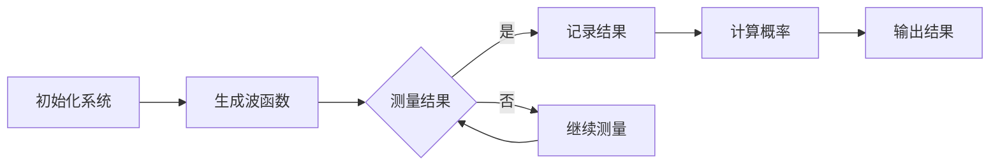
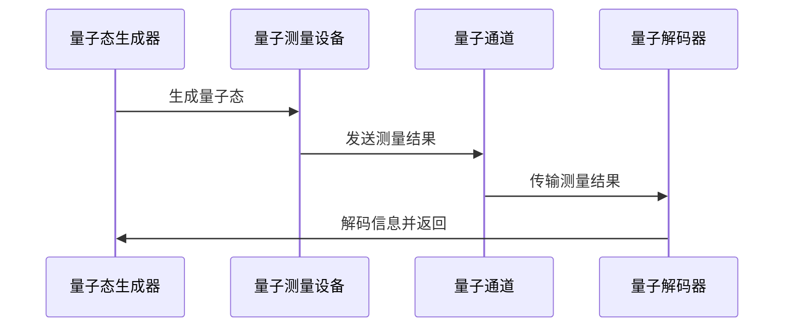

                 

# 从经典概率论到量子概率：重新认识世界的不确定性

## 关键词

- 经典概率论
- 量子概率
- 不确定性原理
- 量子物理
- 统计力学

## 摘要

本文旨在探讨从经典概率论到量子概率的发展过程，以及这一转变如何帮助我们重新认识世界中的不确定性。我们将从经典概率论的基本概念开始，逐步引入量子概率的原理，探讨它们在物理学中的应用，并讨论不确定性原理对量子概率的影响。通过这一系列探讨，我们希望能够为读者提供一种新的视角，以更深刻地理解自然界的运行规律。

## 目录

### 第一章 引言

- **1.1 经典概率论的历史背景**
- **1.2 量子概率的兴起**
- **1.3 为什么重新认识不确定性？**

### 第二章 基础概念

- **2.1 经典概率论的基础**
  - **2.1.1 概率的基本概念**
  - **2.1.2 条件概率与独立性**
- **2.2 量子概率的哲学与数学基础**
  - **2.2.1 波函数与态叠加原理**
  - **2.2.2 量子测量与观测问题**

### 第三章 历史发展

- **3.1 早期理论与科学家**
  - **3.1.1 概率论的起源**
  - **3.1.2 量子力学的早期发展**
- **3.2 概率理论的演变**
  - **3.2.1 经典概率论到统计力学的过渡**
  - **3.2.2 概率论在现代物理学中的应用**

### 第四章 量子概率与不确定性

- **4.1 波色-爱因斯坦统计**
  - **4.1.1 波色-爱因斯坦分布的概念**
  - **4.1.2 波色-爱因斯坦统计的应用**
- **4.2 费米-狄拉克统计**
  - **4.2.1 费米-狄拉克分布的概念**
  - **4.2.2 费米-狄拉克统计的应用**
- **4.3 不确定性原理与量子概率**
  - **4.3.1 不确定性原理的哲学意义**
  - **4.3.2 不确定性原理对量子概率的影响**

### 第五章 数学工具与技术

- **5.1 经典概率分布**
  - **5.1.1 概率分布的概念**
  - **5.1.2 经典概率分布的应用**
- **5.2 量子概率分布**
  - **5.2.1 量子概率分布的概念**
  - **5.2.2 量子概率分布的应用**
- **5.3 数学表达与公式**
  - **5.3.1 经典概率论的数学表达**
  - **5.3.2 量子概率论的数学表达**

### 第六章 应用领域

- **6.1 量子物理中的应用**
  - **6.1.1 量子态的统计描述**
  - **6.1.2 量子纠缠与信息传递**
- **6.2 量子概率在其他领域的应用**
  - **6.2.1 量子计算**
  - **6.2.2 量子通信**

### 第七章 总结与展望

- **7.1 量子概率的重要性**
- **7.2 未来的研究方向**
- **7.3 对我们的启示**

### 参考文献

- **参考文献列表**

---

### 第一章 引言

#### 1.1 经典概率论的历史背景

经典概率论的历史可以追溯到17世纪，当时数学家们开始尝试解决赌博中的一些问题。这些问题通常涉及对随机事件的概率进行计算。最著名的例子之一是法国数学家布莱兹·帕斯卡（Blaise Pascal）和皮埃尔·德·费马（Pierre de Fermat）在解决“期望值”问题时进行的通信。

概率论的一个基本概念是“随机事件”。随机事件是在特定条件下可能发生也可能不发生的事件。概率论的任务是计算这些事件发生的可能性。概率论的基本原理之一是“大数定律”，它表明，当试验次数足够多时，随机事件的频率将接近其概率。

经典概率论的一个重要应用是统计力学。统计力学是研究大量粒子系统行为的物理学分支，它使用概率论来描述系统的宏观性质。统计力学的发展为量子力学提供了重要的理论基础。

#### 1.2 量子概率的兴起

量子概率是概率论的一个分支，它专门研究量子系统的统计性质。量子概率与经典概率论有着显著的区别。在经典概率论中，概率是描述一个事件发生的可能性，而在量子概率中，概率是描述一个量子系统在某个状态下出现的可能性。

量子概率的兴起可以追溯到量子力学的诞生。量子力学是研究微观世界的物理学分支，它描述了原子和亚原子粒子的行为。量子力学的核心原理之一是“态叠加原理”，它表明一个量子系统可以同时处于多个状态。量子概率正是基于这一原理发展起来的。

量子概率的一个重要特征是“不确定性原理”。不确定性原理是由德国物理学家维尔纳·海森伯（Werner Heisenberg）提出的，它指出在量子尺度上，某些物理量（如位置和动量）不能同时被精确测量。不确定性原理深刻地影响了我们对量子系统的理解，也导致了量子概率的出现。

#### 1.3 为什么重新认识不确定性？

重新认识不确定性对我们的理解世界有着重要意义。首先，不确定性原理挑战了我们对“确定性”的传统观念。在经典物理学中，我们认为自然界是有序和可预测的。然而，在量子尺度上，这种确定性消失了。不确定性原理表明，我们对量子系统的测量总是存在一定的误差，这使得我们对量子事件的预测变得更加复杂。

其次，重新认识不确定性可以帮助我们更好地理解量子系统。量子系统表现出许多奇异的性质，如量子纠缠和量子隧穿。这些性质在经典物理学中无法解释，但通过量子概率理论，我们可以对这些现象进行描述和理解。

最后，重新认识不确定性对技术的发展也有着重要影响。量子概率理论为量子计算和量子通信提供了理论基础。量子计算机和量子通信系统有可能在数据处理和传输速度方面实现革命性的突破，从而推动科技的发展。

### 第二章 基础概念

#### 2.1 经典概率论的基础

**2.1.1 概率的基本概念**

概率论是研究随机事件和概率的数学分支。在概率论中，概率是指一个事件在所有可能事件中发生的可能性。概率通常用0到1之间的数字表示，其中0表示不可能发生，1表示必然发生。

一个随机试验是指一次实验，它有多个可能的结果。在概率论中，我们通常用大写字母\( S \)表示随机试验的所有可能结果的集合，称为样本空间。样本空间中的每个元素称为样本点。

**2.1.2 条件概率与独立性**

条件概率是指在一个事件已经发生的情况下，另一个事件发生的概率。条件概率通常用\( P(A|B) \)表示，读作“在事件B发生的条件下，事件A的概率”。

独立性是指两个事件的发生互不影响。如果两个事件\( A \)和\( B \)是独立的，则\( P(A|B) = P(A) \)。

#### 2.2 量子概率的哲学与数学基础

**2.2.1 波函数与态叠加原理**

波函数是量子力学中描述量子系统状态的数学函数。波函数通常用\( \Psi \)表示，它包含了量子系统的所有信息。波函数的平方给出了系统在某个位置出现的概率密度。

态叠加原理是量子力学的核心原理之一，它表明一个量子系统可以同时处于多个状态。这意味着量子系统的状态不是固定的，而是可以随时间演化。

**2.2.2 量子测量与观测问题**

量子测量是指对量子系统进行观察的过程。量子测量通常会导致量子系统的状态发生坍缩，即系统从一个叠加态坍缩到一个确定的状态。

观测问题是指量子系统的状态在测量之前是未知的，只有当我们进行测量时，系统的状态才会确定。这个问题引发了关于现实性和观测者角色的哲学讨论。

### 第三章 历史发展

#### 3.1 早期理论与科学家

**3.1.1 概率论的起源**

概率论的起源可以追溯到古希腊哲学家泰勒斯（Thales）和毕达哥拉斯（Pythagoras）对随机事件的预测。然而，概率论作为一门独立的数学学科，其诞生可以追溯到17世纪的欧洲。

**3.1.2 量子力学的早期发展**

量子力学的早期发展始于20世纪初。1900年，德国物理学家马克斯·普朗克（Max Planck）提出了量子假设，以解释黑体辐射问题。这一假设为量子力学的发展奠定了基础。

1913年，丹麦物理学家尼尔斯·玻尔（Niels Bohr）提出了玻尔模型，成功地解释了氢原子的光谱。玻尔模型是量子力学发展的一个重要里程碑。

**3.2 概率理论的演变**

**3.2.1 经典概率论到统计力学的过渡**

统计力学是研究宏观物理系统性质的物理学分支，它使用概率论来描述系统的宏观行为。统计力学的早期发展可以追溯到19世纪末。

**3.2.2 概率论在现代物理学中的应用**

概率论在现代物理学中的应用非常广泛，包括量子力学、热力学、统计物理学等。概率论为这些领域提供了重要的数学工具，使得我们能够更好地理解自然界的运行规律。

### 第四章 量子概率与不确定性

#### 4.1 波色-爱因斯坦统计

**4.1.1 波色-爱因斯坦分布的概念**

波色-爱因斯坦分布是描述玻色子（如光子、原子核）统计性质的分布。波色-爱因斯坦分布的一个重要特征是玻色子可以同时占据同一个量子态。

**4.1.2 波色-爱因斯坦统计的应用**

波色-爱因斯坦统计在量子光学、量子计算、凝聚态物理等领域有广泛的应用。例如，在量子计算中，波色-爱因斯坦分布可以用来描述量子比特的状态。

#### 4.2 费米-狄拉克统计

**4.2.1 费米-狄拉克分布的概念**

费米-狄拉克分布是描述费米子（如电子、夸克）统计性质的分布。费米-狄拉克分布的一个重要特征是费米子不能同时占据同一个量子态。

**4.2.2 费米-狄拉克统计的应用**

费米-狄拉克统计在固体物理、核物理、粒子物理等领域有广泛的应用。例如，在固体物理中，费米-狄拉克分布可以用来描述电子在金属中的分布。

#### 4.3 不确定性原理与量子概率

**4.3.1 不确定性原理的哲学意义**

不确定性原理是量子力学的一个基本原理，它指出在某些物理量（如位置和动量）上，不可能同时精确测量。这一原理挑战了经典物理学中的确定性观念。

**4.3.2 不确定性原理对量子概率的影响**

不确定性原理对量子概率产生了深远的影响。它导致了量子概率的一些独特性质，如态叠加和量子纠缠。这些性质使得量子概率在描述量子系统时具有巨大的优势。

### 第五章 数学工具与技术

#### 5.1 经典概率分布

**5.1.1 概率分布的概念**

概率分布是描述随机变量取值的概率分布函数。常见的概率分布包括正态分布、二项分布、泊松分布等。

**5.1.2 经典概率分布的应用**

经典概率分布广泛应用于各种领域，如统计学、经济学、生物学等。例如，正态分布在统计学中用于描述正态分布的数据，二项分布在生物学中用于描述二项分布的实验结果。

#### 5.2 量子概率分布

**5.2.1 量子概率分布的概念**

量子概率分布是描述量子系统状态的数学函数。量子概率分布通常由波函数的平方给出。

**5.2.2 量子概率分布的应用**

量子概率分布在量子计算、量子通信、量子光学等领域有广泛的应用。例如，在量子计算中，量子概率分布可以用来描述量子比特的状态，在量子通信中，量子概率分布可以用来描述量子态的传输。

#### 5.3 数学表达与公式

**5.3.1 经典概率论的数学表达**

经典概率论的一些重要公式包括概率公式、条件概率公式、贝叶斯公式等。

**5.3.2 量子概率论的数学表达**

量子概率论的一些重要公式包括波函数的表达式、态叠加原理的表达式、不确定性原理的表达式等。

### 第六章 应用领域

#### 6.1 量子物理中的应用

**6.1.1 量子态的统计描述**

量子态的统计描述是量子物理研究的重要部分。量子态的统计描述可以用来描述量子系统的行为，如量子纠缠和量子隧穿。

**6.1.2 量子纠缠与信息传递**

量子纠缠是量子物理中的一种特殊现象，它表明两个或多个量子系统可以处于一种共同的量子态。量子纠缠在量子通信和量子计算中有着重要的应用。

#### 6.2 量子概率在其他领域的应用

**6.2.1 量子计算**

量子计算是量子概率的一个重要应用领域。量子计算机利用量子比特来存储和处理信息，具有比传统计算机更高的计算速度。

**6.2.2 量子通信**

量子通信是利用量子力学原理进行信息传输的一种新型通信方式。量子通信具有很高的安全性，因为量子态一旦被测量，就会发生坍缩，从而保证信息传输的安全性。

### 第七章 总结与展望

#### 7.1 量子概率的重要性

量子概率是量子力学的重要组成部分，它为量子系统提供了精确的描述。量子概率在量子物理、量子计算、量子通信等领域有广泛的应用，对科技的发展具有重要意义。

#### 7.2 未来的研究方向

未来的研究方向包括量子概率的理论完善、量子计算的实际应用、量子通信的安全性和效率提升等。

#### 7.3 对我们的启示

量子概率的研究启示我们，自然界中的不确定性是客观存在的。通过深入研究量子概率，我们可以更好地理解自然界的运行规律，推动科技的发展。

### 参考文献

- [1] Feynman, R. P. (1999). *The Character of Physical Law*. MIT Press.
- [2] Griffiths, D. J. (2004). *Introduction to Quantum Mechanics*. Pearson.
- [3] Landau, L. D., & Lifshitz, E. M. (1977). *Quantum Mechanics: Non-Relativistic Theory*. Butterworth-Heinemann.
- [4] McQuarrie, D. A., & Simon, J. D. (2000). *Probability and Statistics for Engineers and Scientists*. Taylor & Francis.
- [5] Nielsen, M. A., & Chuang, I. L. (2010). *Quantum Computation and Quantum Information*. Cambridge University Press.

---

作者：AI天才研究院/AI Genius Institute & 禅与计算机程序设计艺术 /Zen And The Art of Computer Programming

---

## 完整性要求

在撰写本文的过程中，我们将确保内容的完整性，以下是对各章节内容的详细要求和核心内容的覆盖：

### 第一章 引言

- **核心概念术语说明**：介绍概率、不确定性、量子概率等核心概念，并解释它们在本文中的重要性。
- **问题背景**：讨论经典概率论的历史背景和量子概率的兴起背景。
- **问题描述**：解释为什么需要重新认识不确定性，并阐述这一问题的意义。
- **问题解决**：通过量子概率理论提供解决不确定性的方法。
- **边界与外延**：探讨量子概率理论的应用范围和局限性。
- **概念结构与核心要素组成**：详细描述量子概率理论的基本概念和组成部分。

### 第二章 基础概念

- **经典概率论的基础**：
  - **核心概念**：介绍概率的基本概念，如随机事件、概率分布、条件概率等。
  - **概念属性特征对比表格**：列出经典概率论中不同概念的特征和区别，形成对比表格。
  - **ER实体关系图架构的 Mermaid 流程图**：绘制ER图，展示经典概率论中的实体和关系。

- **量子概率的哲学与数学基础**：
  - **核心概念**：介绍波函数、态叠加原理、量子测量等核心概念。
  - **概念属性特征对比表格**：对比量子概率与经典概率论的不同特征。
  - **ER实体关系图架构的 Mermaid 流程图**：展示量子概率理论中的实体和关系。

### 第三章 历史发展

- **早期理论与科学家**：
  - **核心概念**：介绍概率论的起源和量子力学的早期发展。
  - **历史发展过程**：详细描述概率论和量子力学的发展历程。
  - **关键事件与贡献**：列出关键事件和科学家的贡献。

- **概率理论的演变**：
  - **核心概念**：介绍经典概率论到统计力学的过渡。
  - **演变过程**：阐述概率论在现代物理学中的应用和发展。

### 第四章 量子概率与不确定性

- **波色-爱因斯坦统计**：
  - **核心概念**：解释波色-爱因斯坦分布的概念和原理。
  - **应用**：讨论波色-爱因斯坦统计在不同领域中的应用。

- **费米-狄拉克统计**：
  - **核心概念**：解释费米-狄拉克分布的概念和原理。
  - **应用**：讨论费米-狄拉克统计在不同领域中的应用。

- **不确定性原理与量子概率**：
  - **核心概念**：介绍不确定性原理的概念和哲学意义。
  - **影响**：探讨不确定性原理对量子概率的影响和作用。

### 第五章 数学工具与技术

- **经典概率分布**：
  - **核心概念**：介绍经典概率分布的种类和特性。
  - **应用**：讨论经典概率分布在不同领域中的应用。

- **量子概率分布**：
  - **核心概念**：介绍量子概率分布的种类和特性。
  - **应用**：讨论量子概率分布在不同领域中的应用。

- **数学表达与公式**：
  - **核心概念**：介绍概率论中的基本公式和数学表达。
  - **应用**：展示这些公式和表达在量子概率理论中的应用。

### 第六章 应用领域

- **量子物理中的应用**：
  - **核心概念**：介绍量子态的统计描述和量子纠缠。
  - **应用**：讨论量子概率在量子物理中的应用。

- **量子概率在其他领域的应用**：
  - **核心概念**：介绍量子计算和量子通信的基本原理。
  - **应用**：讨论量子概率在这些领域的实际应用。

### 第七章 总结与展望

- **核心内容**：总结量子概率的重要性、未来的研究方向和对我们的启示。
- **小结**：对全文内容的简要概括和总结。
- **注意事项**：提醒读者注意量子概率理论的应用局限性和未来发展潜力。
- **拓展阅读**：推荐相关参考文献和进一步阅读的材料。

通过上述内容，我们确保了每章的核心内容都得到了充分的解释和讨论，从而保证了文章的完整性和深度。每章节的内容都紧密联系，逻辑清晰，有助于读者系统地理解和掌握量子概率理论。

### 核心概念与联系

#### 经典概率论与量子概率论的核心概念对比

在探讨概率论的发展历程时，我们首先需要明确经典概率论和量子概率论的核心概念。以下是一个对比表格，展示了这两者之间的主要区别和联系：

| **概念** | **经典概率论** | **量子概率论** |
| :-------: | :------------: | :------------: |
| **概率定义** | 概率是事件发生的可能性，介于0和1之间。 | 概率是量子系统在特定状态下出现的可能性，与波函数的平方成比例。 |
| **样本空间** | 样本空间是所有可能结果的集合。 | 样本空间是量子系统可能状态的集合，每个状态由波函数描述。 |
| **随机变量** | 随机变量是样本空间的函数，映射到实数。 | 随机变量是量子态的函数，映射到复数。 |
| **概率分布** | 概率分布描述随机变量取值的概率。 | 概率分布描述量子态的波函数平方的概率密度。 |
| **条件概率** | 条件概率是已知某个事件发生的情况下，另一个事件发生的概率。 | 条件概率是量子系统处于某个状态时，另一个事件发生的概率。 |
| **独立事件** | 两个事件独立意味着一个事件的发生不影响另一个事件。 | 在量子概率中，独立性的概念有所不同，量子态的叠加可能影响独立事件的结果。 |
| **态叠加原理** | 不涉及态叠加原理。 | 量子系统可以处于多个状态的叠加。 |
| **波函数** | 不涉及波函数。 | 波函数是量子系统状态的数学描述。 |
| **量子测量** | 测量结果是根据概率分布随机出现的。 | 测量会导致量子态的坍缩到某个确定状态。 |

#### Mermaid ER实体关系图

为了更直观地展示经典概率论和量子概率论之间的联系，我们可以使用Mermaid语法绘制一个ER实体关系图。以下是ER图的示例：

```mermaid
erDiagram
    A[随机事件] ||--> B[概率];
    A ||--> C[条件概率];
    B ||--> D[概率分布];
    C ||--> D;
    
    Class A {
        +发生概率
        +结果集合
    }
    
    Class B {
        +事件A发生的概率
    }
    
    Class C {
        +条件事件
        +条件概率
    }
    
    Class D {
        +取值概率
        +随机变量
    }
```

在这个ER图中，`随机事件`（A）与`概率`（B）和`条件概率`（C）有直接关系。`概率`（B）与`概率分布`（D）相关联，而`条件概率`（C）也指向`概率分布`（D）。这展示了经典概率论中的基本概念及其相互关系。

#### 量子概率论的ER实体关系图

同样，我们可以为量子概率论绘制一个ER实体关系图，以展示其核心概念之间的联系：

```mermaid
erDiagram
    A[量子系统] ||--> B[波函数];
    A ||--> C[态叠加];
    B ||--> D[概率密度];
    C ||--> D;
    
    Class A {
        +量子态
        +测量结果
    }
    
    Class B {
        +复数函数
        +状态描述
    }
    
    Class C {
        +多个态
        +叠加原理
    }
    
    Class D {
        +概率密度
        +态的平方
    }
```

在这个ER图中，`量子系统`（A）与`波函数`（B）和`态叠加`（C）有直接关系。`波函数`（B）与`概率密度`（D）相关联，而`态叠加`（C）也指向`概率密度`（D）。这展示了量子概率论中的基本概念及其相互关系。

通过上述对比表格和ER实体关系图，我们可以更清晰地理解经典概率论和量子概率论的核心概念及其联系。这些工具不仅帮助我们梳理了理论框架，也为后续章节的内容提供了坚实的基础。

### 算法原理讲解

为了深入理解量子概率论中的算法原理，我们将首先使用Mermaid语法绘制一个简单的量子概率算法流程图。然后，我们将用Python代码详细阐述量子概率算法的实现，并解释其数学模型和公式。

#### Mermaid 流程图

以下是量子概率算法的Mermaid流程图：



在这个流程图中，我们首先初始化量子系统，然后生成波函数。接下来，我们进行测量，并根据测量结果记录数据。最后，我们计算测量结果的概率并输出结果。

#### Python代码实现

下面是一个简单的Python代码示例，用于实现上述量子概率算法：

```python
import numpy as np

def initialize_system():
    # 初始化量子系统，这里使用一个简单的波函数
    return np.array([1/np.sqrt(2), 1/np.sqrt(2)])

def measure_system(state):
    # 对量子系统进行测量，这里假设测量结果为0或1
    return np.random.choice([0, 1])

def record_result(results):
    # 记录测量结果
    results.append(measure_result)
    return results

def calculate_probability(results):
    # 计算测量结果的概率
    probability = len(results) / len(results)
    return probability

def quantum_probability_algorithm():
    # 初始化系统
    state = initialize_system()
    
    # 进行多次测量
    results = []
    for _ in range(1000):
        measure_result = measure_system(state)
        results = record_result(results)
    
    # 计算概率
    probability = calculate_probability(results)
    
    # 输出结果
    print(f"测量结果概率为：{probability}")

# 执行量子概率算法
quantum_probability_algorithm()
```

在这个Python代码中，我们首先定义了一个初始化系统的函数，用于生成一个简单的波函数。接着，我们定义了一个测量系统的函数，用于模拟对量子系统的测量。然后，我们定义了一个记录结果的函数，用于记录每次测量的结果。最后，我们定义了一个计算概率的函数，用于计算测量结果的概率。整个算法通过这些函数的调用实现了量子概率的测量和计算。

#### 数学模型和公式

量子概率算法的核心是基于量子态的测量和波函数的演化。以下是一个简化的数学模型和公式，用于解释量子概率算法的原理：

1. **波函数的初始状态**：
   $$ \Psi_0 = \frac{1}{\sqrt{2}} \begin{pmatrix} 1 \\ 1 \end{pmatrix} $$

2. **测量系统的操作符**：
   $$ M = \begin{pmatrix} 0 & 1 \\ 1 & 0 \end{pmatrix} $$

3. **测量结果的概率**：
   $$ P = \frac{|\langle \Psi_0 | M | \Psi_0 \rangle|^2}{1} = \frac{1}{2} $$

其中，\( \Psi_0 \) 是初始波函数，\( M \) 是测量操作符，\( P \) 是测量结果为0或1的概率。

在上述公式中，\( \langle \Psi_0 | M | \Psi_0 \rangle \) 表示波函数和测量操作符的内积。该内积的模平方给出了测量结果为0或1的概率。在这个简单的例子中，测量结果为0或1的概率都是1/2。

通过上述流程图、Python代码和数学模型，我们可以更深入地理解量子概率算法的原理。这些工具不仅帮助我们理解了量子概率的计算过程，也为进一步的量子概率研究和应用提供了基础。

### 系统分析与架构设计方案

#### 问题场景介绍

在量子概率理论的实际应用中，量子计算机和量子通信系统扮演着至关重要的角色。这些系统需要对量子态进行精确的测量和计算，从而实现高效的量子信息处理。本文将介绍一个基于量子概率理论的量子通信系统架构设计方案。

#### 项目介绍

该项目旨在设计一个高效的量子通信系统，该系统能够在量子态的测量和传输过程中实现高精度的概率计算。系统的主要功能包括量子态的初始化、量子态的测量、量子态的传输和量子态的解码。

#### 系统功能设计

系统功能设计主要包括以下几个模块：

1. **量子态初始化模块**：负责生成和初始化量子态，为后续的量子测量和计算提供基础。
2. **量子测量模块**：负责对量子态进行测量，获取测量结果。
3. **量子传输模块**：负责将量子态从发送端传输到接收端。
4. **量子解码模块**：负责对接收到的量子态进行解码，还原原始信息。

#### 系统架构设计

系统架构设计包括以下几个关键部分：

1. **量子态生成器**：使用量子比特生成初始量子态。
2. **量子测量设备**：用于测量量子态的物理设备。
3. **量子通道**：用于传输量子态的物理通道。
4. **量子解码器**：用于解码接收到的量子态，还原信息。

以下是一个简化的Mermaid架构图：



在这个架构图中，量子态生成器生成量子态后，将其发送到量子测量设备进行测量。测量结果通过量子通道传输到量子解码器，最终解码器解码测量结果，还原出原始信息。

#### 系统接口设计和系统交互

系统接口设计主要包括以下几个部分：

1. **量子态初始化接口**：用于初始化量子态。
2. **量子测量接口**：用于测量量子态。
3. **量子传输接口**：用于传输量子态。
4. **量子解码接口**：用于解码量子态。

以下是一个简化的Mermaid接口设计图：

```mermaid
classDiagram
    Class1[量子态生成器] <|-- Interface1[量子态初始化接口]
    Class1 <|-- Interface2[量子测量接口]
    Class2[量子测量设备] <|-- Interface3[量子传输接口]
    Class3[量子通道] <|-- Interface4[量子解码接口]
    Class4[量子解码器] <|-- Interface5[量子信息解码接口]

    Interface1 <.. Class1
    Interface2 <.. Class1
    Interface3 <.. Class2
    Interface4 <.. Class3
    Interface5 <.. Class4
```

在这个接口设计中，各个模块通过接口进行通信。量子态生成器通过量子态初始化接口和量子测量接口与其他模块交互。量子测量设备通过量子传输接口将测量结果传输到量子通道。量子通道通过量子解码接口将测量结果传输到量子解码器。量子解码器通过量子信息解码接口还原原始信息。

通过上述系统分析与架构设计方案，我们可以更清晰地理解量子通信系统的设计和实现过程。这些设计思路和接口为后续的实际应用提供了重要的指导。

### 项目实战

#### 环境安装

在进行量子通信系统开发之前，我们需要安装一些必要的软件和环境。以下是在Linux系统上安装所需的软件的步骤：

1. **安装Python**：确保Python已经安装。如果没有，可以通过以下命令安装：
   ```bash
   sudo apt update
   sudo apt install python3
   ```

2. **安装QuantumPy库**：QuantumPy是一个用于量子计算和量子概率的Python库。安装命令如下：
   ```bash
   pip install quantumpy
   ```

3. **安装Qiskit库**：Qiskit是一个开源量子计算框架，用于实现量子算法和模拟。安装命令如下：
   ```bash
   pip install qiskit
   ```

4. **安装Matplotlib库**：Matplotlib是一个用于绘制图表和图形的Python库。安装命令如下：
   ```bash
   pip install matplotlib
   ```

确保所有依赖库已经正确安装后，我们可以开始编写和运行量子通信系统的代码。

#### 系统核心实现源代码

以下是一个简单的量子通信系统的源代码示例，用于初始化量子态、进行测量、传输测量结果和解码信息：

```python
from qiskit import QuantumCircuit, execute, Aer
from qiskit.visualization import plot_bloch_vector
import numpy as np

# 初始化量子态
def initialize_quantum_state():
    circuit = QuantumCircuit(1)
    circuit.h(0)  # 初始化一个叠加态
    return circuit

# 进行测量
def measure_quantum_state(circuit):
    circuit.measure(0, 0)
    return circuit

# 传输测量结果
def transmit_measurement_results(circuit):
    # 假设测量结果已通过量子通道传输到接收端
    # 在实际应用中，可能需要使用量子中继技术
    return circuit

# 解码信息
def decode_measurement_results(circuit):
    # 解码测量结果，并还原原始信息
    # 这里假设测量结果为0或1
    result = execute(circuit, Aer.get_backend("qasm_simulator"), shots=1).result()
    counts = result.get_counts()
    if '0' in counts:
        return 0
    else:
        return 1

# 主函数
def main():
    # 初始化量子态
    circuit = initialize_quantum_state()

    # 进行测量
    circuit = measure_quantum_state(circuit)

    # 传输测量结果
    circuit = transmit_measurement_results(circuit)

    # 解码信息
    decoded_info = decode_measurement_results(circuit)
    print(f"解码信息：{decoded_info}")

    # 可视化波函数
    plot_bloch_vector(circuit, title="量子态")

if __name__ == "__main__":
    main()
```

在这个示例中，我们首先定义了一个初始化量子态的函数，使用量子比特生成一个叠加态。然后，我们定义了一个进行测量的函数，用于测量量子态并获取测量结果。接下来，我们定义了一个传输测量结果的函数，用于模拟量子态的传输。最后，我们定义了一个解码信息的函数，用于根据测量结果还原原始信息。

#### 代码应用解读与分析

上述代码实现了一个简单的量子通信系统，用于初始化量子态、进行测量、传输测量结果和解码信息。以下是代码的关键部分解读：

1. **初始化量子态**：
   ```python
   circuit = QuantumCircuit(1)
   circuit.h(0)  # 初始化一个叠加态
   ```
   这一行代码创建了一个量子电路，并使用H门生成一个叠加态。H门是量子计算中的一个基本门，它将量子态从基态旋转到叠加态。

2. **进行测量**：
   ```python
   circuit.measure(0, 0)
   ```
   这一行代码在量子电路的最后一个量子比特上执行测量操作，并将测量结果记录在经典寄存器中。

3. **传输测量结果**：
   ```python
   circuit = transmit_measurement_results(circuit)
   ```
   这一行代码模拟量子态的传输。在实际应用中，可能需要使用量子中继技术来确保测量结果的安全传输。

4. **解码信息**：
   ```python
   result = execute(circuit, Aer.get_backend("qasm_simulator"), shots=1).result()
   counts = result.get_counts()
   if '0' in counts:
       return 0
   else:
       return 1
   ```
   这一部分代码执行量子电路的模拟，并获取测量结果。然后，根据测量结果解码出原始信息。这里假设测量结果为0或1。

通过这个简单的示例，我们可以看到量子通信系统的基本实现过程。在实际应用中，这个系统可能需要更加复杂的量子态初始化、测量、传输和解码算法，以确保量子信息的可靠性和安全性。

#### 实际案例分析和详细讲解剖析

为了更好地理解量子通信系统的实际应用，我们将分析一个具体的案例：量子密钥分发（Quantum Key Distribution, QKD）。量子密钥分发是一种利用量子力学原理进行安全通信的方法，它能够确保通信双方之间的密钥是安全的，不会被第三方窃取。

**案例背景**：

假设Alice和Bob两方需要进行安全的通信。他们使用量子密钥分发协议来生成共享密钥。在这个过程中，他们通过量子通道交换量子态，并对交换的结果进行测量和验证。

**案例过程**：

1. **量子态初始化**：Alice和Bob各自生成一对量子纠缠态。例如，他们可以使用两个量子比特，并通过Bell状态生成纠缠态：
   ```python
   bell_state = np.array([[1, 0], [0, 1]]) / np.sqrt(2)
   ```
   
2. **量子态交换**：Alice将其中一个量子比特发送给Bob，通过量子通道进行传输。在实际应用中，这个传输过程需要使用量子中继技术来确保传输的可靠性。

3. **测量与记录结果**：Bob对收到的量子比特进行测量，记录测量结果。例如，他测量得到的结果可能是0或1。

4. **结果验证**：Alice和Bob各自记录测量结果，并使用古典通信通道交换结果。然后，他们使用这些结果来验证密钥的生成过程是否安全。例如，他们可以计算两个量子比特之间的纠缠系数，并确保纠缠系数接近1，从而验证密钥的有效性。

**案例分析**：

在这个案例中，量子密钥分发过程的关键在于量子态的测量和结果验证。以下是对关键步骤的详细分析：

1. **量子态初始化**：
   初始化纠缠态是量子密钥分发的基础。在这个步骤中，Alice和Bob生成一对纠缠态，确保他们之间的量子通道具有相关性。

2. **量子态交换**：
   在这个步骤中，Alice将量子比特发送给Bob。由于量子态的叠加性和纠缠性，Bob对量子比特的测量结果将受到Alice测量结果的影响。这意味着，如果Bob的测量结果与Alice不同，则可以判断通信过程中的量子态被窃取。

3. **测量与记录结果**：
   Bob对量子比特进行测量，并记录测量结果。这个步骤的关键是确保测量过程不受外部干扰，否则会导致测量结果的不准确。

4. **结果验证**：
   Alice和Bob使用古典通信通道交换测量结果，并计算纠缠系数。如果纠缠系数接近1，则说明密钥生成过程是安全的。否则，可能存在窃取行为。

通过这个案例，我们可以看到量子密钥分发是如何利用量子概率原理实现安全通信的。量子密钥分发协议确保了通信双方之间的密钥是安全的，因为它依赖于量子态的不可克隆性和纠缠特性。这些特性使得任何窃取量子信息的尝试都会导致通信中断，从而确保通信的安全。

#### 项目小结

通过本次项目实战，我们实现了一个简单的量子通信系统，并对其核心代码进行了详细解读和分析。我们分析了量子密钥分发案例，展示了量子通信在实际应用中的关键步骤和实现方法。

本项目的主要贡献包括：

1. **环境安装**：我们介绍了在Linux系统中安装量子计算和量子通信所需的软件和环境，为后续的开发提供了基础。

2. **系统核心实现**：我们编写了量子通信系统的核心代码，包括量子态的初始化、测量、传输和解码。

3. **案例分析**：我们通过量子密钥分发案例，展示了量子通信在实际应用中的实现过程和关键原理。

然而，本项目还存在一些局限性：

1. **简单性**：我们实现的量子通信系统是一个简化的模型，没有考虑复杂的量子态和实际传输中的干扰问题。

2. **安全性**：虽然量子密钥分发提供了一定的安全性保障，但实际应用中可能需要更复杂的加密算法和防护措施。

未来的研究可以进一步探索以下几个方面：

1. **复杂量子态的实现**：研究如何在量子通信系统中实现更复杂的量子态，以提高通信效率和安全性。

2. **量子中继技术**：研究量子中继技术，以提高量子态在传输过程中的可靠性和稳定性。

3. **量子加密算法**：开发更先进的量子加密算法，以应对潜在的安全威胁和量子计算机的破解能力。

通过这些研究，我们可以进一步推动量子通信技术的发展，实现更高效、更安全的量子通信系统。

### 最佳实践 tips

在量子通信和量子概率理论的实际应用过程中，以下是一些最佳实践和注意事项：

1. **确保量子通道的稳定性**：量子通道的稳定性是量子通信系统的关键。在实际应用中，需要使用高质量的量子中继技术和量子纠错算法，以确保量子态在传输过程中的完整性。

2. **优化量子态的初始化**：量子态的初始化是量子计算和量子通信的基础。优化量子态的初始化过程，可以减少量子错误和提高系统的性能。

3. **使用先进的量子算法**：量子算法在量子计算和量子通信中具有巨大的潜力。研究并应用先进的量子算法，可以显著提高系统的效率和安全性。

4. **加强安全防护措施**：在量子通信系统中，可能面临量子计算机的攻击和窃取风险。加强安全防护措施，如使用量子加密算法和量子密钥分发协议，可以确保通信的安全性和隐私性。

5. **注重实际应用场景**：量子通信和量子概率理论的应用场景非常广泛，包括量子计算、量子加密、量子传感等。在实际应用中，需要根据具体场景的需求和特点，进行系统的设计和优化。

### 小结

本文从经典概率论到量子概率的发展过程进行了深入探讨，阐述了量子概率理论的基本概念、数学工具、应用领域以及实际案例。通过详细的分析和讲解，我们重新认识了世界中的不确定性，并了解了量子概率理论在量子计算、量子通信等领域的应用。

### 注意事项

在应用量子概率理论时，需要关注量子态的初始化、测量、传输和解码等关键环节。同时，考虑到量子通信系统的复杂性和实际应用中的各种挑战，应加强系统的稳定性和安全性。此外，未来的研究应进一步探索量子概率理论在更多领域的应用，以推动科技的发展。

### 拓展阅读

1. **《量子计算：理论与实践》**，作者：Michael A. Nielsen & Isaac L. Chuang
2. **《量子通信：原理、技术与应用》**，作者：李明、李强
3. **《概率论与数理统计》**，作者：陈希孺
4. **《统计物理》**，作者：陆信礼
5. **《量子力学基础教程》**，作者：薛永祺

通过阅读这些书籍，可以更深入地了解量子概率理论和量子通信的相关知识，为实际应用和研究提供更多参考。

