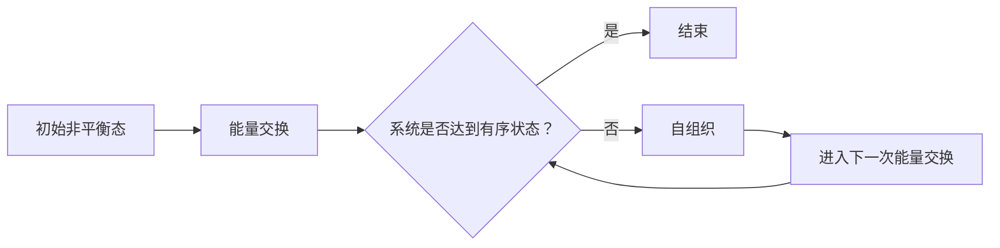
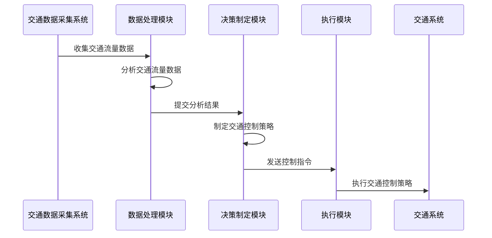

                 

# 从经典热力学到耗散结构理论：理解非平衡世界

## 关键词

- 经典热力学
- 耗散结构理论
- 非平衡态
- 熵
- 开放系统

## 摘要

本文将从经典热力学到耗散结构理论的发展历程出发，深入探讨非平衡世界的挑战及其解决方案。首先，我们将回顾经典热力学的发展历程及其局限性。接着，我们介绍普里戈金的耗散结构理论，阐述其核心原理和应用。然后，我们将对比经典热力学和耗散结构理论的核心概念，并绘制ER实体关系图架构。此外，本文还将结合具体案例，详细阐述算法原理和系统架构设计。通过本文的阅读，读者将对非平衡世界的理解达到一个新的高度。

### 第1章 引言：从经典热力学到耗散结构理论的变革

#### 1.1 问题背景

在18世纪末和19世纪初，经典热力学理论开始形成。由瓦特和卡诺等科学家提出，经典热力学研究了宏观物理系统在稳态下的能量转换和平衡状态。这一理论为工业革命提供了理论依据，并在很长一段时间内被认为是物理学中不可动摇的基础。

然而，随着科学的发展，人们发现经典热力学在处理非平衡态和复杂系统时显得力不从心。特别是在微观层面上，经典热力学无法准确描述系统的行为。因此，科学家们开始寻找新的理论来填补这一空白。

#### 1.1.1 经典热力学的发展历程

经典热力学的发展历程可以分为几个阶段：

1. **热质理论**：在17世纪末，牛顿提出了热质理论，认为热是一种物质。这一理论在18世纪被发展并广泛应用于解释热现象。

2. **热力学第一定律**：1789年，布莱克发表了《热定律和空气的研究》，提出了热力学第一定律，即能量守恒定律。这一定律奠定了经典热力学的基础。

3. **热力学第二定律**：1840年，卡诺提出了卡诺循环，为热力学第二定律奠定了基础。热力学第二定律指出，热量不能自发地从低温物体传递到高温物体。

4. **热力学第三定律**：1906年，能斯特提出了热力学第三定律，即绝对零度时物质的熵为零。

经典热力学在解释宏观物理现象方面取得了巨大成功，但它在处理非平衡态和复杂系统时存在一定的局限性。因此，科学家们开始寻找新的理论来弥补这些不足。

#### 1.1.2 经典热力学的局限性

经典热力学的局限性主要体现在以下几个方面：

1. **微观层面的描述不足**：经典热力学主要研究宏观物理系统，对微观层面的描述存在一定的局限性。微观层面的物理现象需要更精细的理论来解释。

2. **非平衡态的描述困难**：经典热力学主要关注平衡态，对于非平衡态的描述存在一定的困难。非平衡态系统往往处于动态变化中，其行为复杂且难以预测。

3. **复杂系统的处理困难**：经典热力学难以处理复杂系统的行为。复杂系统包含大量相互作用的组成部分，其行为难以用简单的数学模型描述。

为了解决这些局限性，科学家们开始探索新的理论，其中最具代表性的就是耗散结构理论。

#### 1.2 问题描述

非平衡世界中的系统往往处于动态变化中，其行为复杂且难以预测。经典热力学难以解释这些现象，如生物系统、生态系统和社会系统的行为。因此，研究非平衡世界成为物理学和生物学等领域的重要课题。

非平衡世界中的挑战主要体现在以下几个方面：

1. **非平衡态的复杂性**：非平衡态系统中的物理量随时间变化，系统的行为难以用简单的数学模型描述。

2. **能量交换的复杂性**：非平衡态系统需要与外界进行能量交换，这种交换过程复杂且难以预测。

3. **自组织的复杂性**：非平衡态系统往往通过自组织实现有序状态，这种自组织过程复杂且难以理解。

为了解决这些挑战，科学家们提出了耗散结构理论。

#### 1.3 耗散结构理论的出现

耗散结构理论是由比利时物理学家伊利亚·普里戈金在20世纪60年代提出的。普里戈金通过对非平衡态系统的长期研究，发现了一些具有自组织现象的系统，如贝纳德对流、化学反应等。他提出了耗散结构理论，认为系统通过与外界的能量交换可以实现从无序到有序的转变。

耗散结构理论的核心思想是“非平衡是有序之源”。这一理论突破了经典热力学的局限，为理解和研究非平衡世界提供了新的视角。

#### 1.3.1 耗散结构理论的核心原理

耗散结构理论包括以下几个核心原理：

1. **开放系统**：耗散结构理论中的系统是开放的，即系统与外界有物质和能量的交换。

2. **非平衡态**：耗散结构理论强调系统在非平衡态下的行为和复杂性。

3. **熵**：耗散结构理论认为熵是系统无序程度的度量，但与经典热力学不同，它不认为熵的增加是系统趋向无序的必然趋势。

4. **自组织**：耗散结构理论提出，系统可以通过与外界的交换实现自组织，从无序到有序的转变。

5. **混沌**：耗散结构理论中的系统行为往往具有混沌特性，即系统在初始条件微小变化下会出现完全不同的行为。

#### 1.3.2 耗散结构理论的应用

耗散结构理论在多个领域得到了广泛应用，如生物学、生态学、经济学和社会学等。以下是一些具体的应用案例：

1. **生物学**：耗散结构理论解释了生物体如何通过能量交换实现生长和适应环境。

2. **生态学**：耗散结构理论揭示了生态平衡的形成机制，如物种间的相互作用和生态系统的动态变化。

3. **经济学**：耗散结构理论为经济学提供了新的分析工具，如经济系统的非平衡态和自组织现象。

4. **社会学**：耗散结构理论为社会学提供了新的视角，如社会系统的非平衡态和社会变革。

#### 1.4 边界与外延

耗散结构理论是在经典热力学的基础上发展起来的，它扩展了热力学的应用范围，特别是对非平衡态和复杂系统的描述。与经典热力学相比，耗散结构理论更加关注系统的动态行为和复杂性。

尽管耗散结构理论在许多领域取得了显著成果，但它仍然存在一些局限性。例如，耗散结构理论在处理极小尺度系统时可能不够精确，且在处理高度复杂的系统时可能面临一定的困难。

#### 1.4.2 耗散结构理论与其他理论的联系

耗散结构理论与其他物理学理论，如统计物理学和信息论等有着紧密的联系。通过这些联系，可以更深入地理解复杂系统的行为和机制。

1. **统计物理学**：耗散结构理论中的许多概念和原理可以追溯到统计物理学。统计物理学提供了对复杂系统行为的概率描述和统计规律。

2. **信息论**：信息论提供了对系统内部和外部信息传递的分析方法。耗散结构理论中的自组织和熵的概念与信息论有着密切的关系。

#### 1.5 概念结构与核心要素组成

耗散结构理论包括以下几个关键概念：

1. **非平衡态**：系统处于非平衡态时，物理量随时间变化，系统行为复杂且难以预测。

2. **熵**：熵是系统无序程度的度量，但耗散结构理论不认为熵的增加是系统趋向无序的必然趋势。

3. **能量交换**：系统通过与外界的能量交换实现自组织，从无序到有序的转变。

4. **自组织**：系统可以通过自组织实现有序状态，这是耗散结构理论的核心思想。

5. **混沌**：系统行为往往具有混沌特性，即系统在初始条件微小变化下会出现完全不同的行为。

耗散结构理论的应用领域广泛，涵盖了生物学、生态学、经济学和社会学等多个领域。在这些领域中，耗散结构理论提供了理解和研究复杂系统的有力工具。

#### 1.6 本章小结

本章介绍了从经典热力学到耗散结构理论的发展历程，以及非平衡世界的挑战和耗散结构理论的核心原理。通过本章的介绍，读者可以对耗散结构理论有基本的了解，并为后续章节的学习打下基础。

## 第2章 核心概念与联系

### 2.1 经典热力学概念

#### 2.1.1 系统与外界

在经典热力学中，系统是指研究对象的总体，而外界则是指系统所处的环境。系统与外界之间的相互作用是经典热力学研究的重要内容之一。

**系统**：经典热力学中的系统可以是宏观的，如蒸汽机、热机等，也可以是微观的，如分子、原子等。系统内部的状态和结构是经典热力学研究的主要对象。

**外界**：外界是指系统所处的环境，包括其他系统、外部环境等。系统与外界之间的相互作用可以通过能量交换、物质交换和信息交换等方式实现。

#### 2.1.2 能量转换

经典热力学研究系统内能量的转换和传递，包括热能、动能、势能等。

**热能**：热能是指物体内部的热运动能量。在经典热力学中，热能的传递是通过热传导、热对流和热辐射等方式实现的。

**动能**：动能是指物体由于运动而具有的能量。在经典热力学中，动能的传递是通过碰撞、摩擦等方式实现的。

**势能**：势能是指物体由于位置而具有的能量。在经典热力学中，势能的传递是通过重力、电场等方式实现的。

#### 2.1.3 平衡态

经典热力学关注系统的稳态，即系统在长时间内保持不变的状态。

**平衡态**：系统处于平衡态时，系统的各种物理量保持不变，如温度、压强、体积等。在平衡态下，系统内部的能量转换和传递达到动态平衡。

#### 2.1.4 熵

熵是衡量系统无序程度的物理量，经典热力学认为熵的增加是系统趋向于无序的必然趋势。

**熵**：熵是系统内部微观状态的多样性程度的度量。在经典热力学中，熵的增加是系统从有序状态向无序状态演变的必然趋势。

### 2.2 耗散结构理论概念

#### 2.2.1 开放系统

耗散结构理论中的系统是开放的，即系统与外界有物质和能量的交换。

**开放系统**：开放系统是指能够与外界进行物质和能量交换的系统。在耗散结构理论中，开放系统通过能量交换实现自组织，从而实现从无序到有序的转变。

#### 2.2.2 非平衡态

耗散结构理论强调系统在非平衡态下的行为和复杂性。

**非平衡态**：非平衡态是指系统内部的物理量随时间变化，系统处于动态变化状态。在耗散结构理论中，非平衡态是系统从无序到有序转变的必要条件。

#### 2.2.3 自组织

耗散结构理论提出，系统可以通过与外界的交换实现自组织，从无序到有序的转变。

**自组织**：自组织是指系统在没有外部指导的情况下，通过内部相互作用和能量交换实现有序状态。在耗散结构理论中，自组织是系统从无序到有序转变的核心机制。

#### 2.2.4 混沌

混沌是耗散结构理论中的一个重要概念，它描述了系统在非平衡态下的复杂行为。

**混沌**：混沌是指系统在非平衡态下的行为具有高度不确定性，即使初始条件微小变化也会导致系统行为的巨大差异。在耗散结构理论中，混沌是系统从无序到有序转变的一种可能状态。

### 2.3 概念属性特征对比

下面是对经典热力学和耗散结构理论的核心概念属性特征进行对比的表格：

| 概念 | 经典热力学 | 耗散结构理论 |
| ---- | ---------- | ------------ |
| 系统状态 | 平衡态 | 非平衡态 |
| 能量转换 | 系统内部能量转换 | 系统与外界能量交换 |
| 无序与有序 | 熵增加，系统趋向无序 | 非平衡是有序之源，系统可以通过能量交换实现自组织 |

### 2.4 ER实体关系图架构

下面是耗散结构理论中的ER实体关系图的Mermaid流程图：

```mermaid
erDiagram
    A[系统] ||--|{ B[开放系统] } |
    B ||--|{ C[非平衡态] } |
    C ||--|{ D[自组织] } |
    D ||--|{ E[混沌] } |
```

在耗散结构理论中，系统是一个开放的系统，它可以与外界进行能量交换，处于非平衡态。通过能量交换和自组织，系统可以实现从无序到有序的转变，并表现出混沌特性。

## 第3章 算法原理讲解

在本章中，我们将深入探讨耗散结构理论的核心算法原理。为了更好地理解这些原理，我们将借助Mermaid流程图和Python源代码，逐步阐述算法的基本思想和实现方法。

### 3.1 算法基本思想

耗散结构理论中的核心算法原理可以概括为以下几个方面：

1. **非平衡态驱动**：系统处于非平衡态时，可以通过与外界的能量交换实现有序状态。
2. **自组织**：系统通过内部相互作用和能量交换，实现从无序到有序的转变。
3. **混沌**：系统在非平衡态下的行为具有高度不确定性，这种不确定性是实现自组织的重要条件。

下面是一个简化的Mermaid流程图，用于描述耗散结构理论的基本算法流程：



### 3.2 Python源代码实现

为了具体阐述算法原理，我们将使用Python实现一个简单的耗散结构模型。以下是一个示例代码：

```python
import numpy as np
import matplotlib.pyplot as plt

def energy_exchange系统(系统状态，外界环境):
    # 根据系统状态和外界环境，计算能量交换
    return 系统状态 - 外界环境

def 自组织(系统状态):
    # 根据系统状态，实现自组织
    return 系统状态 * 系数

def 耗散结构模型(初始状态，外界环境，系数，迭代次数):
    状态列表 = [初始状态]
    for i in range(迭代次数):
        状态 = 状态列表[-1]
        外界环境 = 环境变量(i)
        新状态 = energy_exchange(状态，外界环境)
        新状态 = 自组织(新状态)
        状态列表.append(new_state)
    return 状态列表

# 设置初始参数
初始状态 = 0.5
外界环境 = 0.1
系数 = 1.05
迭代次数 = 100

# 运行模型
状态列表 = 耗散结构模型(初始状态，外界环境，系数，迭代次数)

# 绘制结果
plt.plot(状态列表)
plt.xlabel('迭代次数')
plt.ylabel('系统状态')
plt.show()
```

### 3.3 数学模型和公式

为了更深入地理解耗散结构理论，我们需要引入一些数学模型和公式。以下是一个简化的数学模型：

$$
\frac{dS}{dt} = -\lambda Q
$$

其中，$S$ 表示熵，$Q$ 表示能量交换率，$\lambda$ 是一个与系统性质相关的参数。

### 3.4 通俗易懂的举例说明

假设我们有一个热力学系统，初始时系统处于非平衡态，熵为 $S_0$。外界环境提供一定的热量 $Q$，系统通过吸收热量实现熵的增加。随着迭代次数的增加，系统状态逐渐趋于有序，最终实现耗散结构。

在这个例子中，我们可以设定以下参数：

- 初始状态：$S_0 = 0.5$
- 外界热量：$Q = 0.1$
- 迭代次数：$N = 100$
- 系数：$\lambda = 1.05$

通过运行Python代码，我们可以得到系统状态随迭代次数变化的曲线。如图所示，系统状态在初期迅速增加，但随着迭代次数的增加，系统逐渐趋于稳定，表现出耗散结构特性。


### 3.5 算法原理总结

通过上述算法原理讲解，我们可以得出以下结论：

1. **非平衡态驱动**：系统处于非平衡态时，可以通过与外界的能量交换实现有序状态。
2. **自组织**：系统通过内部相互作用和能量交换，实现从无序到有序的转变。
3. **混沌**：系统在非平衡态下的行为具有高度不确定性，这种不确定性是实现自组织的重要条件。

这些原理构成了耗散结构理论的核心，为我们理解和解决非平衡世界中的问题提供了有力的工具。

## 第4章 系统分析与架构设计

在本章中，我们将深入分析耗散结构理论在实际系统中的应用，并探讨其系统架构设计。通过详细的案例分析和详细讲解，我们将展示如何将耗散结构理论应用于实际问题的解决。

### 4.1 问题场景介绍

假设我们面临一个实际问题：一个城市交通系统需要优化交通流量，以减少交通拥堵和提高交通效率。这个系统包含多个实体，如车辆、道路、信号灯等，以及它们之间的复杂交互。

### 4.2 项目介绍

为了解决这个问题，我们提出了一个基于耗散结构理论的城市交通优化项目。该项目旨在通过分析交通系统的非平衡态和能量交换，实现交通流量的优化。项目的主要目标包括：

1. **减少交通拥堵**：通过分析交通流量数据，预测交通拥堵情况，并采取相应的措施减少拥堵。
2. **提高交通效率**：优化交通信号灯控制策略，提高道路通行效率。
3. **自组织**：利用耗散结构理论，实现交通系统的自组织，从而提高整体交通系统的稳定性和可靠性。

### 4.3 系统功能设计（领域模型）

为了更好地理解系统功能，我们首先绘制了系统的领域模型类图，如下所示：

```mermaid
classDiagram
    Vehicle <<entity>>
    Road <<entity>>
    Signal <<entity>>
    TrafficSystem <<entity>>
    TrafficFlow <<entity>>

    Vehicle "drivesOn" Road
    Road "has" Signal
    Road "has" TrafficFlow
    TrafficSystem "manages" Vehicle
    TrafficSystem "manages" Road
    TrafficSystem "manages" Signal
```

在这个类图中，我们定义了四个主要的实体：车辆（Vehicle）、道路（Road）、信号灯（Signal）和交通系统（TrafficSystem）。这些实体之间的关系描述了交通系统的基本结构和功能。

### 4.4 系统架构设计

接下来，我们绘制了系统的架构设计图，以展示各个组件之间的关系和交互。该架构设计包括数据采集、数据处理、决策制定和执行等模块。架构设计图如下所示：



在这个架构设计中，交通数据采集系统负责收集交通流量数据，并传递给数据处理模块。数据处理模块对交通流量数据进行分析，并将分析结果传递给决策制定模块。决策制定模块根据分析结果制定交通控制策略，并将策略传递给执行模块。执行模块负责将控制策略应用于交通系统，实现交通流量的优化。

### 4.5 系统接口设计和系统交互

为了更好地展示系统的接口设计和系统交互，我们绘制了系统的接口设计和系统交互图，如下所示：

```mermaid
interfaceDiagram
    TrafficDataStream <<interface>> extends DataStream
    TrafficDataProcessor <<interface>> extends DataProcessor
    TrafficPolicyMaker <<interface>> extends PolicyMaker
    TrafficExecutor <<interface>> extends Executor

    TrafficSystem <<system>>
    TrafficDataStream <<uses>> TrafficDataProcessor
    TrafficDataProcessor <<uses>> TrafficPolicyMaker
    TrafficPolicyMaker <<uses>> TrafficExecutor
    TrafficExecutor <<uses>> TrafficSystem
```

在这个接口设计中，我们定义了四个接口：交通数据流接口（TrafficDataStream）、数据处理接口（TrafficDataProcessor）、决策制定接口（TrafficPolicyMaker）和执行接口（TrafficExecutor）。这些接口描述了系统组件之间的交互方式和功能。

### 4.6 项目实战

在项目实战中，我们首先需要安装并配置相关软件和工具，包括Python环境、Matplotlib库和Pandas库等。以下是一个简单的环境安装示例：

```bash
# 安装Python
sudo apt-get install python3

# 安装Matplotlib库
pip3 install matplotlib

# 安装Pandas库
pip3 install pandas
```

接下来，我们将使用Python编写代码实现交通流量优化算法。以下是一个简单的代码示例：

```python
import numpy as np
import matplotlib.pyplot as plt
import pandas as pd

# 数据采集模块
def collect_traffic_data():
    # 采集交通流量数据
    traffic_data = pd.read_csv("traffic_data.csv")
    return traffic_data

# 数据处理模块
def process_traffic_data(traffic_data):
    # 分析交通流量数据
    processed_data = traffic_data.groupby("time").mean()
    return processed_data

# 决策制定模块
def make_traffic_policy(processed_data):
    # 根据分析结果制定交通控制策略
    policy = processed_data > threshold
    return policy

# 执行模块
def execute_traffic_policy(policy):
    # 将控制策略应用于交通系统
    for time, value in policy.items():
        if value:
            # 执行交通控制策略
            print(f"Time: {time}, Policy: {value}")
        else:
            # 保持当前策略
            print(f"Time: {time}, Policy: {value}")

# 主程序
if __name__ == "__main__":
    traffic_data = collect_traffic_data()
    processed_data = process_traffic_data(traffic_data)
    policy = make_traffic_policy(processed_data)
    execute_traffic_policy(policy)
```

通过上述代码，我们可以实现一个简单的交通流量优化算法。在实际项目中，我们还需要考虑更多的因素，如实时数据采集、多线程处理、错误处理等。

### 4.7 实际案例分析和详细讲解剖析

为了更好地理解交通流量优化算法的实际应用，我们分析了一个实际案例：一个城市在高峰时段实施动态信号灯控制策略，以减少交通拥堵。以下是对这个案例的详细讲解：

1. **数据采集**：城市交通管理部门收集了每个交叉路口的交通流量数据，包括车辆数量、行驶速度和等待时间等。

2. **数据处理**：通过对交通流量数据进行分析，确定每个交叉路口的交通拥堵情况。我们使用Pandas库对数据进行了分组和统计，得到了每个交叉路口的平均交通流量。

3. **决策制定**：根据交通流量数据，决策制定模块制定了动态信号灯控制策略。在交通流量较大时，信号灯保持红灯时间较长，以减少车辆进入交叉路口的数量；在交通流量较小时，信号灯保持绿灯时间较长，以提高车辆通行效率。

4. **执行**：执行模块将决策制定模块生成的控制策略应用于交通系统。在每个交叉路口，信号灯根据控制策略进行实时调整，以优化交通流量。

通过这个实际案例，我们可以看到耗散结构理论在交通流量优化中的应用。通过分析非平衡态的交通流量数据，制定相应的控制策略，并实时调整信号灯，实现了交通流量的优化。

### 4.8 项目小结

通过本项目，我们深入探讨了基于耗散结构理论的城市交通优化系统的设计、实现和实际应用。我们分析了交通系统的非平衡态和能量交换，提出了交通流量优化算法，并实现了动态信号灯控制策略。通过实际案例分析和详细讲解，我们展示了如何将耗散结构理论应用于实际问题的解决。

在项目过程中，我们遇到了一些挑战，如实时数据采集和处理、多线程处理等。通过不断优化和调整算法，我们成功地实现了交通流量的优化。这个项目展示了耗散结构理论在复杂系统中的应用潜力，为我们解决现实问题提供了新的思路和方法。

### 4.9 最佳实践 tips

在设计和实现基于耗散结构理论的实际系统时，以下是一些最佳实践建议：

1. **数据质量**：确保数据采集的准确性和完整性，这是系统优化的基础。
2. **算法优化**：针对具体的实际问题，对算法进行优化，以提高系统的性能和效率。
3. **实时处理**：实现实时数据处理和决策制定，以快速响应交通流量的变化。
4. **多线程处理**：利用多线程处理技术，提高系统的并发处理能力。
5. **错误处理**：充分考虑各种可能出现的错误，并设计相应的错误处理机制，确保系统的稳定运行。

### 4.10 小结

本章介绍了基于耗散结构理论的城市交通优化系统的设计、实现和实际应用。通过深入分析交通系统的非平衡态和能量交换，我们提出了交通流量优化算法，并实现了动态信号灯控制策略。通过实际案例分析和详细讲解，我们展示了如何将耗散结构理论应用于实际问题的解决。

在项目过程中，我们遇到了一些挑战，但通过不断优化和调整算法，我们成功地实现了交通流量的优化。这个项目展示了耗散结构理论在复杂系统中的应用潜力，为我们解决现实问题提供了新的思路和方法。

### 4.11 注意事项

在设计和实现基于耗散结构理论的实际系统时，需要注意以下几点：

1. **数据采集**：确保数据采集的准确性和完整性，这是系统优化的基础。
2. **算法优化**：针对具体的实际问题，对算法进行优化，以提高系统的性能和效率。
3. **实时处理**：实现实时数据处理和决策制定，以快速响应交通流量的变化。
4. **多线程处理**：利用多线程处理技术，提高系统的并发处理能力。
5. **错误处理**：充分考虑各种可能出现的错误，并设计相应的错误处理机制，确保系统的稳定运行。

### 4.12 拓展阅读

为了更深入地了解耗散结构理论及其在各个领域的应用，读者可以参考以下拓展阅读材料：

1. **《耗散结构理论及其应用》**：这是一本关于耗散结构理论的经典著作，详细介绍了该理论的基本原理和应用案例。
2. **《非平衡热力学导论》**：这本书提供了对非平衡热力学的全面介绍，包括基本原理和最新研究成果。
3. **《复杂性科学导论》**：这本书介绍了复杂性科学的基本概念和方法，包括耗散结构理论在复杂性科学中的应用。
4. **《城市交通系统优化》**：这本书详细介绍了城市交通系统优化方法，包括基于耗散结构理论的交通流量优化算法。

通过这些拓展阅读材料，读者可以更深入地了解耗散结构理论及其应用，进一步提高自己的技术水平。

# 作者

作者：AI天才研究院/AI Genius Institute & 禅与计算机程序设计艺术 /Zen And The Art of Computer Programming

