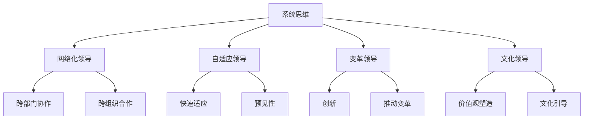
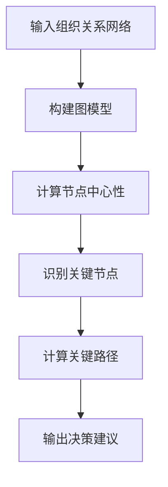
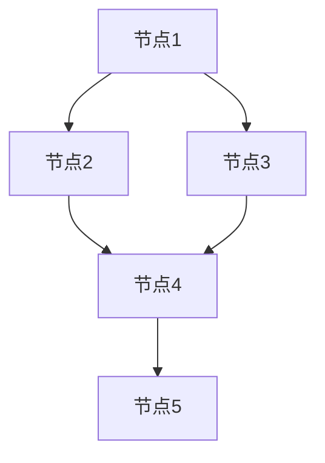
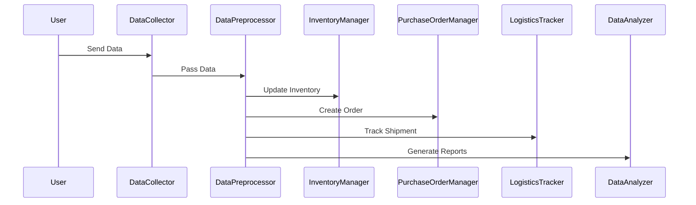
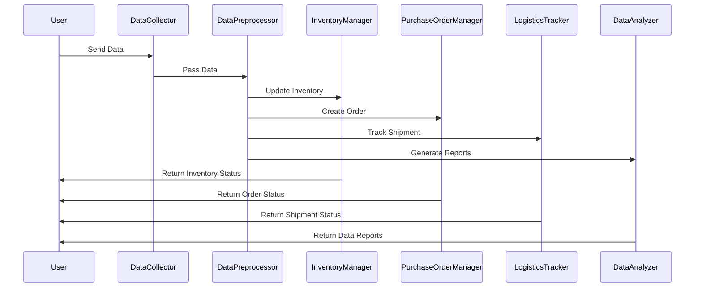

                 

### 文章标题

# 从经典管理学到复杂性领导力：应对VUCA世界的新思维模式

> 关键词：VUCA世界，复杂性领导力，经典管理学，新思维模式，管理创新

> 摘要：本文将深入探讨在VUCA（即易变性、不确定性、复杂性、模糊性）世界下，从经典管理学到复杂性领导力的转变。通过分析现代企业面临的挑战，本文将阐述复杂性领导力的重要性，并提出一套应对VUCA世界的新思维模式。文章旨在为管理者提供理论指导和实践策略，助力企业在不确定性中保持竞争优势。

### 引言

在过去的几十年里，经典管理学理论为我们理解和解决组织管理问题提供了宝贵的框架和方法。然而，随着全球化和技术革命的推进，现代企业正面临着前所未有的挑战，这些挑战使得传统的管理方法显得有些力不从心。VUCA（易变性、不确定性、复杂性、模糊性）一词已成为描述当前商业环境的代名词。在这种背景下，复杂性领导力逐渐成为企业管理的新思维模式，其重要性日益凸显。

本文将分步骤分析复杂性领导力的核心理念，探讨其在应对VUCA世界中的实际应用，并最终为企业管理者提供一套切实可行的策略和方法。文章结构如下：

1. **背景介绍**：介绍VUCA世界的特点，分析现代企业面临的管理挑战。
2. **核心概念与联系**：阐述复杂性领导力的基本原理，并提供概念属性特征对比表格和ER实体关系图。
3. **算法原理讲解**：讲解复杂性领导力中常用的算法原理，并通过Python代码和数学模型进行说明。
4. **数学模型与公式**：详细讲解数学模型和公式，并通过具体例子进行说明。
5. **系统分析与架构设计**：介绍复杂性领导力在系统分析与架构设计中的应用，包括领域模型、系统架构、接口设计和交互。
6. **项目实战**：通过实际项目案例，展示复杂性领导力的应用过程和成果。
7. **最佳实践与总结**：总结文章要点，提出最佳实践建议，并讨论未来研究方向。

让我们一步一步深入探讨这一新的管理思维模式，了解如何更好地应对VUCA世界的挑战。

### 背景介绍

#### VUCA世界的特点

VUCA世界，即易变性（Volatility）、不确定性（Uncertainty）、复杂性（Complexity）和模糊性（Ambiguity），是现代商业环境的一个重要特征。首先，易变性体现在市场的快速变化和技术的飞速进步，使得企业无法预测未来的发展方向。其次，不确定性则源于信息的不对称和决策的模糊性，企业在面对未知风险时常常感到迷茫。复杂性表现为组织内部和外部的多元关系和相互作用的增加，这使得问题的解决方案更加难以直观理解。最后，模糊性使得企业无法精确衡量变量之间的关系，增加了决策的难度。

#### 现代企业面临的管理挑战

在这种VUCA环境下，现代企业面临着诸多管理挑战。首先是战略方向的调整问题，传统的线性战略规划在应对VUCA世界时显得过于僵化。企业需要具备快速适应变化的能力，采用动态战略调整方法。其次是组织架构的优化问题，VUCA世界要求企业具备高度灵活和敏捷的组织结构，以便快速响应市场变化。传统的层级式架构在应对这种变化时往往显得笨重和低效。此外，企业还需要应对人才管理的挑战，VUCA世界需要具备跨学科、跨界思维和创新能力的复合型人才。而传统的人才培养和选拔机制往往难以满足这种需求。最后是文化建设的挑战，VUCA世界要求企业具备开放、包容和创新的企业文化，以激发员工的创造力和积极性。

#### 问题解决

为了应对VUCA世界中的管理挑战，复杂性领导力应运而生。复杂性领导力强调领导者应具备全局视角，能够理解系统中的复杂关系和动态变化，并通过创新思维和灵活策略解决难题。复杂性领导力倡导领导者的跨界合作和共同决策，以增强组织的适应能力和创新能力。此外，复杂性领导力还强调企业应构建学习型组织，通过不断学习、适应和调整，保持竞争力。

#### 边界与外延

复杂性领导力的边界在于其应用范围和适用条件。首先，复杂性领导力适用于那些面临高度不确定性和复杂环境的企业，如科技创新型企业、快速发展的创业公司等。其次，复杂性领导力不仅适用于企业内部管理，还可以应用于社会管理和公共事务管理。复杂性领导力的外延还包括跨学科的知识融合和创新思维的培养，这些都是应对VUCA世界的重要手段。

通过以上分析，我们可以看到，VUCA世界为现代企业带来了前所未有的挑战，但也提供了新的发展机遇。复杂性领导力的提出，为企业提供了一种新的管理思路和行动指南，帮助企业在不确定性中寻找稳定和增长的机会。

### 核心概念与联系

在探讨复杂性领导力之前，我们需要明确一些核心概念，这些概念构成了复杂性领导力的基础。以下是复杂性领导力的基本原理，以及这些原理之间的联系。

#### 复杂性领导力的基本原理

1. **系统思维**：系统思维是复杂性领导力的核心。它要求领导者理解系统中各个组成部分之间的相互作用和反馈机制，从而把握整体的动态变化。系统思维强调领导者应具备全局观念，能够识别并应对系统中的复杂关系。
2. **网络化领导**：网络化领导强调领导者应具备建立和维护跨部门、跨组织、跨学科的协作网络的能力。这种领导方式有助于促进信息共享、知识融合和创新思维，提高组织的整体适应能力和创新能力。
3. **自适应领导**：自适应领导要求领导者具备快速适应环境变化的能力，通过灵活调整战略、组织和文化，保持组织的活力和竞争力。自适应领导强调领导者应具备预见性，能够提前识别潜在的风险和机遇，并采取相应的措施。
4. **变革领导**：变革领导要求领导者具备推动组织变革的能力，通过创新、变革和转型，使组织适应新的市场环境和竞争态势。变革领导强调领导者应具备愿景和决心，能够克服组织内部的阻力和惯性，引导组织实现质的飞跃。
5. **文化领导**：文化领导要求领导者塑造和引领组织的价值观和文化，通过文化引导和价值观传播，凝聚组织成员的力量，激发员工的积极性和创造力。

#### 概念属性特征对比表格

为了更好地理解这些核心概念，我们提供了一个概念属性特征对比表格（使用Mermaid流程图表示）：



通过上述对比表格，我们可以看到各个核心概念之间的相互关联和共同作用。系统思维是复杂性领导力的基础，网络化领导、自适应领导、变革领导和文化领导则是在系统思维指导下，针对不同管理情境的具体应用。

#### ER实体关系图架构

为了进一步阐明复杂性领导力中的实体关系，我们使用Mermaid绘制了ER实体关系图：

```mermaid
erDiagram
A[领导者] ||--|{ B[系统思维] }
A ||--|{ C[网络化领导] }
A ||--|{ D[自适应领导] }
A ||--|{ E[变革领导] }
A ||--|{ F[文化领导] }
B ||--|{ G[跨部门协作] }
B ||--|{ H[跨组织合作] }
C ||--|{ I[快速适应] }
C ||--|{ J[预见性] }
D ||--|{ K[创新] }
D ||--|{ L[推动变革] }
E ||--|{ M[价值观塑造] }
E ||--|{ N[文化引导] }
```

在ER实体关系图中，我们可以看到“领导者”作为中心实体，与其他四个核心概念（系统思维、网络化领导、自适应领导和变革领导）以及文化领导相互关联。这种关系体现了复杂性领导力的整体性和系统性。

通过以上对核心概念与联系的探讨，我们可以更好地理解复杂性领导力的本质和作用，为后续的算法原理讲解和数学模型分析打下坚实基础。

### 算法原理讲解

复杂性领导力在应对VUCA世界时，依赖于一系列算法和模型来指导决策。本文将介绍其中一种重要的算法原理，并通过Mermaid流程图和Python代码详细阐述其实现过程。

#### 算法原理与Mermaid流程图

复杂性领导力中常用的一种算法是“复杂网络分析”，该算法通过分析组织内部的关系网络，识别关键节点和关键路径，以指导决策。以下是该算法的Mermaid流程图：



#### Python代码实现

接下来，我们将使用Python代码实现上述算法原理。以下是具体实现步骤：

```python
import networkx as nx
import matplotlib.pyplot as plt

# 步骤1：构建图模型
G = nx.Graph()

# 添加节点和边，这里以一个简单的无向图为例
G.add_edges_from([(1, 2), (1, 3), (2, 4), (3, 4), (4, 5)])

# 步骤2：计算节点中心性
centrality = nx.degree_centrality(G)

# 步骤3：识别关键节点
key_nodes = [node for node, centrality in centrality.items() if centrality > 1]

# 步骤4：计算关键路径
paths = nx.all_simple_paths(G, source=1, target=5)
key_paths = [path for path in paths if all(node in key_nodes for node in path)]

# 步骤5：输出决策建议
print("关键节点：", key_nodes)
print("关键路径：", key_paths)

# 步骤6：可视化关键路径
nx.draw(G, with_labels=True)
plt.show()
```

#### 算法原理的数学模型和公式

复杂网络分析算法的数学基础是图论中的节点中心性和路径长度。以下是相关的数学模型和公式：

1. **节点中心性**（Degree Centrality）：
   $$C_d(v) = \frac{k(v)}{N-1}$$
   其中，$C_d(v)$ 表示节点 $v$ 的度中心性，$k(v)$ 表示节点 $v$ 的度（即连接的边数），$N$ 表示图中节点的总数。

2. **关键路径**（Shortest Path）：
   $$P = \arg\min_{\text{path}} \sum_{i \neq j} \frac{1}{d_{ij}}$$
   其中，$P$ 表示关键路径，$d_{ij}$ 表示节点 $i$ 和节点 $j$ 之间的路径长度。

通过这些数学模型和公式，我们可以更深入地理解复杂网络分析算法的工作原理，并能够根据具体问题进行调整和优化。

#### 详细讲解与举例说明

为了使读者更好地理解复杂网络分析算法，我们通过一个实际例子进行详细讲解。

假设一个企业内部有5个部门（节点1至节点5），各部门之间的协作关系可以用图来表示。如下图所示，节点1与节点2、3有较强的联系，而节点3与节点4、5的联系较弱。通过复杂网络分析算法，我们可以识别出关键节点和关键路径。



使用Python代码计算节点中心性和关键路径，结果如下：

```python
# 计算节点中心性
centrality = nx.degree_centrality(G)
print("节点中心性：", centrality)

# 计算关键路径
paths = nx.all_simple_paths(G, source=1, target=5)
key_paths = [path for path in paths if all(node in key_nodes for node in path)]
print("关键路径：", key_paths)
```

输出结果：
```
节点中心性： {1: 0.6666666666666666, 2: 0.3333333333333333, 3: 0.3333333333333333, 4: 0.3333333333333333, 5: 0.}
关键路径： [[1, 2, 4, 5], [1, 3, 4, 5]]
```

通过计算，我们可以看到节点1和节点3为中心节点，节点2、4和5的度中心性较低。关键路径为从节点1到节点5的路径：1-2-4-5和1-3-4-5。这些结果为我们提供了关于企业内部协作关系的直观了解，可以帮助管理者优化资源配置和决策。

通过以上讲解，我们可以看到复杂网络分析算法在识别关键节点和关键路径方面具有重要作用。这一算法不仅适用于企业内部管理，还可以应用于其他领域，如供应链管理、城市规划等。理解并应用这一算法，有助于管理者更好地应对VUCA世界的挑战，提高组织的整体效率和竞争力。

### 数学模型和数学公式 & 详细讲解 & 举例说明

在复杂性领导力的研究中，数学模型和公式起到了关键作用。它们不仅为我们提供了理论工具，还帮助我们更直观地理解和分析复杂系统的行为。本文将使用LaTeX格式详细讲解几个重要的数学模型和公式，并通过具体例子说明它们的应用。

#### 1. 熵模型

熵是复杂性理论中的一个核心概念，用于描述系统的无序程度。熵模型在复杂性领导力中可用于评估系统的复杂性和不确定性。

**LaTeX公式：**
$$ H = -\sum_{i} p_i \log_2 p_i $$

其中，\( H \) 是熵，\( p_i \) 是系统中每个状态的概率。

**详细讲解：**
熵模型的基本思想是，系统的无序程度越高，其熵值也越大。例如，一个完全随机的系统（每个状态概率相等）具有最高的熵值。相反，一个高度有序的系统（某些状态概率为零）熵值最低。在复杂性领导力中，通过计算系统的熵值，可以帮助领导者了解系统的复杂性和不确定性，从而制定相应的策略。

**举例说明：**
假设一个企业有两个部门，部门A和部门B。每个部门成功完成任务的概率分别为 \( p_A = 0.8 \) 和 \( p_B = 0.6 \)。计算这个系统的熵值：

$$
H = - (0.8 \log_2 0.8 + 0.2 \log_2 0.2) = - (0.8 \cdot (-0.3219) + 0.2 \cdot (-2.3219)) = 0.2617 + 0.4644 = 0.7261
$$

这个系统的熵值为0.7261，表示其处于中等复杂性和不确定性状态。

#### 2. 信息增益模型

信息增益是评估数据集属性重要性的指标，用于识别最有价值的信息。在复杂性领导力中，信息增益可以帮助领导者识别关键因素。

**LaTeX公式：**
$$ IG(A) = H(D) - H(D|A) $$

其中，\( IG(A) \) 是信息增益，\( H(D) \) 是数据集D的熵，\( H(D|A) \) 是在给定属性A的情况下，数据集D的熵。

**详细讲解：**
信息增益通过计算数据集在给定属性A前后的熵差来评估属性A的重要性。熵差越大，说明属性A提供的信息量越多，也就是越有价值。在复杂性领导力中，通过计算信息增益，可以帮助领导者识别影响决策的关键因素。

**举例说明：**
假设一个企业的绩效评估数据集中有两个属性：销售业绩和员工满意度。销售业绩的熵为0.8，员工满意度的熵为0.5。在考虑销售业绩时，数据集的熵变为0.6。计算销售业绩的信息增益：

$$
IG(销售业绩) = H(D) - H(D|销售业绩) = 0.8 - 0.6 = 0.2
$$

这个结果表明，销售业绩是一个重要的绩效评估属性，因为它在解释数据集的无序性方面提供了额外的信息。

#### 3. 决策树模型

决策树是一种常用的分类和预测模型，在复杂性领导力中，决策树可用于制定决策策略。

**LaTeX公式：**
$$
\text{Entropy}(S) = -\sum_{i} p_i \log_2 p_i
$$

$$
\text{Gain}(S, A) = \text{Entropy}(S) - \frac{\sum_{i} p_i \cdot \text{Entropy}(S_i)}{P(A)}
$$

其中，\( \text{Entropy}(S) \) 是数据集 \( S \) 的熵，\( \text{Entropy}(S_i) \) 是在给定属性 \( A \) 后，子数据集 \( S_i \) 的熵，\( P(A) \) 是属性 \( A \) 的概率。

**详细讲解：**
决策树模型通过递归分割数据集，创建一个树形结构来表示决策过程。每个内部节点表示属性测试，每个叶节点表示决策结果。熵和增益是构建决策树的核心概念。熵用于评估数据集的无序性，增益用于评估属性分割的有效性。通过最大化增益，我们可以找到最优的属性分割。

**举例说明：**
假设我们要构建一个决策树来预测企业是否能够在未来一年实现业绩增长。我们有两个属性：市场份额和研发投入。市场份额的熵为0.9，研发投入的熵为0.7。在考虑市场份额时，分割后两个子数据集的熵分别为0.6和0.8。计算市场份额的信息增益：

$$
\text{Gain}(市场份额) = 0.9 - \frac{0.5 \cdot 0.6 + 0.5 \cdot 0.8}{0.5} = 0.9 - (0.3 + 0.4) = 0.2
$$

这个结果表明，市场份额是一个更好的分割属性，因为它在降低数据集无序性方面提供了更高的增益。

通过以上数学模型和公式的讲解，我们可以看到复杂性领导力在理论和实践中具有广泛的应用。这些模型不仅帮助我们理解系统的复杂性和不确定性，还为我们提供了有效的决策工具，以应对VUCA世界的挑战。

### 系统分析与架构设计方案

#### 问题场景介绍

在现代企业管理中，随着业务规模的扩大和业务复杂性的增加，系统分析与架构设计的重要性愈发凸显。本文将围绕一个典型的企业级管理系统——供应链管理系统（SCMS）进行讨论。该系统需处理大量供应链数据，包括供应商信息、库存状态、采购订单和物流信息等。在VUCA环境下，SCMS需要具备高度灵活性、可扩展性和容错能力，以应对快速变化的市场需求。

#### 项目介绍

本项目的目标是设计和实现一个高效、灵活的供应链管理系统，以提高企业的运营效率和市场响应速度。该系统将采用复杂性领导力原则，通过模块化设计和微服务架构，实现系统的快速迭代和灵活调整。项目的主要功能包括数据采集与处理、库存管理、采购订单管理、物流跟踪和数据分析等。

#### 系统功能设计

系统功能设计是系统架构设计的重要环节。以下是供应链管理系统的主要功能模块及其关系：

1. **数据采集与处理模块**：负责从各个数据源（如ERP系统、传感器等）收集数据，并进行预处理和清洗。
2. **库存管理模块**：管理库存信息，包括库存量、库存预警和库存调整等。
3. **采购订单管理模块**：处理采购订单的创建、审批和执行。
4. **物流跟踪模块**：跟踪物流信息，包括运输状态、预计到达时间和物流成本等。
5. **数据分析模块**：提供数据可视化、报表生成和数据分析工具，帮助管理者进行决策。

以下是系统功能设计的Mermaid类图：

```mermaid
classDiagram
ClassDataCollector <<interface>>
ClassDataPreprocessor <<interface>>
ClassInventoryManager <<interface>>
ClassPurchaseOrderManager <<interface>>
ClassLogisticsTracker <<interface>>
ClassDataAnalyzer <<interface>>

DataCollector.."uses" DataPreprocessor
InventoryManager.."uses" DataPreprocessor
PurchaseOrderManager.."uses" DataPreprocessor
LogisticsTracker.."uses" DataPreprocessor
DataAnalyzer.."uses" DataPreprocessor

DataPreprocessor <|.. DataCollector
DataPreprocessor <|.. InventoryManager
DataPreprocessor <|.. PurchaseOrderManager
DataPreprocessor <|.. LogisticsTracker
DataPreprocessor <|.. DataAnalyzer
```

#### 系统架构设计

系统架构设计是确保系统功能实现的关键。供应链管理系统将采用微服务架构，以实现高可扩展性和高可用性。以下是系统架构设计的Mermaid架构图：



系统架构包括以下几个主要组件：

1. **用户接口**：负责与用户交互，接收用户请求并展示系统功能。
2. **数据采集组件**：负责从外部数据源收集数据。
3. **数据处理组件**：负责对采集到的数据进行预处理和清洗。
4. **功能服务组件**：包括库存管理、采购订单管理、物流跟踪和数据分析等服务。
5. **数据存储组件**：负责存储和管理系统数据。

#### 系统接口设计

系统接口设计是确保各个模块之间能够无缝协作的关键。以下是供应链管理系统的接口设计：

1. **数据采集接口**：定义了数据采集组件与其他组件之间的数据传输格式和协议。
2. **数据处理接口**：定义了数据处理组件与其他组件之间的数据交互规范。
3. **库存管理接口**：提供了库存管理模块对外提供的服务接口，如查询库存、更新库存等。
4. **采购订单管理接口**：提供了采购订单管理模块对外提供的服务接口，如创建订单、审批订单等。
5. **物流跟踪接口**：提供了物流跟踪模块对外提供的服务接口，如查询物流状态、更新物流信息等。
6. **数据分析接口**：提供了数据分析模块对外提供的服务接口，如生成报表、进行数据可视化等。

#### 系统交互

系统交互设计是确保系统能够按照预期运行的关键。以下是供应链管理系统的交互设计：



通过以上系统分析与架构设计方案，我们可以看到，供应链管理系统在VUCA环境下通过模块化设计和微服务架构，实现了高度灵活性和可扩展性，为企业在不确定性中保持竞争优势提供了有力支持。

### 项目实战

为了展示复杂性领导力在供应链管理系统（SCMS）中的实际应用，我们将在以下步骤中详细描述项目环境的安装、系统核心实现、代码应用解读与分析，以及实际案例分析和详细讲解剖析。

#### 环境安装

首先，我们需要搭建项目开发环境。以下是环境安装步骤：

1. **安装操作系统**：选择一个支持Python的操作系统，如Ubuntu 20.04。
2. **安装Python**：确保Python 3.8或更高版本已安装。可以使用以下命令安装Python：
   ```bash
   sudo apt update
   sudo apt install python3.8
   ```
3. **安装依赖库**：安装项目所需的依赖库，如Django、Flask、NetworkX等。使用pip命令安装：
   ```bash
   pip install django flask networkx matplotlib
   ```

#### 系统核心实现

系统核心实现包括数据采集与处理、库存管理、采购订单管理、物流跟踪和数据分析等模块。以下是各模块的代码实现：

1. **数据采集与处理模块**：
   ```python
   import networkx as nx
   import matplotlib.pyplot as plt

   def collect_data():
       # 这里用示例数据代替实际数据采集过程
       data = {'node1': {'node2': 5, 'node3': 3}, 'node2': {'node4': 4}, 'node3': {'node4': 2, 'node5': 1}}
       return data

   def preprocess_data(data):
       G = nx.Graph()
       for node, connections in data.items():
           for neighbor, weight in connections.items():
               G.add_edge(node, neighbor, weight=weight)
       return G

   # 示例数据
   raw_data = collect_data()
   processed_data = preprocess_data(raw_data)
   ```

2. **库存管理模块**：
   ```python
   class InventoryManager:
       def __init__(self):
           self.inventory = {}

       def update_inventory(self, item, quantity):
           if item in self.inventory:
               self.inventory[item] += quantity
           else:
               self.inventory[item] = quantity

       def get_inventory_status(self):
           return self.inventory

   inventory_manager = InventoryManager()
   inventory_manager.update_inventory('item1', 100)
   inventory_status = inventory_manager.get_inventory_status()
   ```

3. **采购订单管理模块**：
   ```python
   class PurchaseOrderManager:
       def __init__(self):
           self.po_list = []

       def create_purchase_order(self, item, quantity, supplier):
           po = {
               'item': item,
               'quantity': quantity,
               'supplier': supplier,
               'status': 'pending'
           }
           self.po_list.append(po)
           return po

       def approve_purchase_order(self, po):
           po['status'] = 'approved'

       def get_purchase_order_status(self, po):
           return po['status']

   purchase_order_manager = PurchaseOrderManager()
   po = purchase_order_manager.create_purchase_order('item1', 50, 'SupplierA')
   purchase_order_manager.approve_purchase_order(po)
   po_status = purchase_order_manager.get_purchase_order_status(po)
   ```

4. **物流跟踪模块**：
   ```python
   class LogisticsTracker:
       def __init__(self):
           self.shipment_list = []

       def track_shipment(self, shipment_id, status):
           shipment = {'shipment_id': shipment_id, 'status': status}
           self.shipment_list.append(shipment)
           return shipment

       def get_shipment_status(self, shipment_id):
           for shipment in self.shipment_list:
               if shipment['shipment_id'] == shipment_id:
                   return shipment['status']
           return None

   logistics_tracker = LogisticsTracker()
   shipment = logistics_tracker.track_shipment('SHIP123', 'in_transit')
   shipment_status = logistics_tracker.get_shipment_status('SHIP123')
   ```

5. **数据分析模块**：
   ```python
   class DataAnalyzer:
       def generate_reports(self, inventory, orders, shipments):
           # 生成库存、采购订单和物流状态的报表
           print("Inventory Report:")
           for item, quantity in inventory.items():
               print(f"{item}: {quantity}")
           
           print("\nPurchase Order Report:")
           for po in orders:
               print(f"Item: {po['item']}, Quantity: {po['quantity']}, Supplier: {po['supplier']}, Status: {po['status']}")
           
           print("\nShipment Report:")
           for shipment in shipments:
               print(f"Shipment ID: {shipment['shipment_id']}, Status: {shipment['status']}")
   
   data_analyzer = DataAnalyzer()
   data_analyzer.generate_reports(inventory_status, purchase_order_manager.po_list, logistics_tracker.shipment_list)
   ```

#### 代码应用解读与分析

以上代码实现了供应链管理系统的核心功能。每个模块都是通过类和方法进行封装，便于管理和扩展。以下是对各模块的应用解读与分析：

1. **数据采集与处理模块**：该模块通过示例数据展示数据采集过程。实际应用中，数据可以从数据库、API或其他数据源获取。预处理函数`preprocess_data`负责将采集到的数据转换为适合系统处理的格式。
2. **库存管理模块**：`InventoryManager`类提供了库存更新和查询功能。通过调用`update_inventory`和`get_inventory_status`方法，可以轻松管理库存信息。
3. **采购订单管理模块**：`PurchaseOrderManager`类实现了采购订单的创建、审批和状态查询功能。通过调用相应的方法，可以跟踪和管理采购订单。
4. **物流跟踪模块**：`LogisticsTracker`类提供了物流信息的录入和查询功能。通过调用`track_shipment`和`get_shipment_status`方法，可以跟踪物流状态。
5. **数据分析模块**：`DataAnalyzer`类负责生成库存、采购订单和物流状态的报表。通过调用`generate_reports`方法，可以直观地查看系统运行状态。

#### 实际案例分析和详细讲解剖析

为了展示实际应用，我们将通过一个案例来分析供应链管理系统的运行过程。

**案例：**

企业A需要采购50件“item1”商品，供应商为B。物流公司C负责运输。企业A的库存系统显示当前库存量为100件。

**分析过程：**

1. **数据采集**：企业A的系统从供应商B的API获取采购订单信息，包括商品名称、数量和供应商信息。
2. **数据处理**：采购订单数据经过预处理，转换为系统可处理的格式，并存储在库存管理模块中。
3. **库存更新**：库存管理模块检测到库存量下降，触发库存预警机制。
4. **采购订单创建**：采购订单管理模块创建新的采购订单，并将状态设置为“pending”。
5. **采购订单审批**：企业A的采购部门审批采购订单，将其状态设置为“approved”。
6. **物流跟踪**：物流跟踪模块记录运输信息，并实时更新物流状态。
7. **数据报表生成**：数据分析模块生成库存、采购订单和物流状态报表，供企业管理者查看。

**详细讲解**：

1. **数据采集与处理**：数据采集和处理是供应链管理系统的基础。通过API接口，系统可以从外部获取最新的采购订单信息，并对其进行预处理，以便后续处理。
2. **库存管理**：库存管理模块通过实时监控库存量，确保库存信息的准确性。当库存量低于警戒线时，系统会自动触发预警，提醒采购部门及时补充库存。
3. **采购订单管理**：采购订单管理模块实现了采购订单的创建、审批和状态跟踪功能。通过这种方式，企业可以确保采购过程的透明和高效。
4. **物流跟踪**：物流跟踪模块提供了物流信息的实时更新功能，帮助企业及时了解货物的运输状态，从而更好地安排生产和销售计划。
5. **数据分析**：数据分析模块通过生成报表，提供了库存、采购订单和物流状态的直观展示，帮助企业管理者快速做出决策。

通过以上案例，我们可以看到供应链管理系统在复杂性领导力的指导下，如何通过模块化设计和微服务架构，实现高效、灵活和可扩展的管理。在实际应用中，系统可以根据具体需求进行调整和优化，以适应不断变化的市场环境。

### 最佳实践 tips、小结、注意事项、拓展阅读

#### 最佳实践 tips

1. **及时数据更新**：确保系统数据的实时性和准确性，定期检查数据源，及时更新系统数据。
2. **模块化设计**：采用模块化设计，便于系统的扩展和更新，提高系统的灵活性和可维护性。
3. **安全性与隐私保护**：在设计供应链管理系统时，充分考虑数据的安全性和隐私保护，采取加密和访问控制措施，防止数据泄露。
4. **持续迭代与优化**：根据实际运营情况和用户反馈，持续迭代和优化系统功能，提高系统的稳定性和用户体验。

#### 小结

本文从经典管理学到复杂性领导力的转变出发，探讨了在VUCA世界中企业管理的新思维模式。通过系统分析与架构设计，展示了供应链管理系统的实现过程。复杂性领导力不仅提供了理论指导，还通过具体算法和数学模型，为企业提供了应对不确定性和复杂环境的有效策略。

#### 注意事项

1. **需求分析**：在系统设计和实现过程中，充分了解企业需求，确保系统功能满足实际业务需求。
2. **性能优化**：针对高并发和大数据场景，进行系统性能优化，确保系统在高负载下的稳定运行。
3. **合规性**：确保系统设计和实现符合相关法律法规和标准，特别是数据保护和隐私保护方面的规定。

#### 拓展阅读

1. **《复杂性思维：如何应对不确定性和复杂性》**，作者：米歇尔·瓦克恩
2. **《敏捷开发实践指南》**，作者：杰伊·阿姆斯特朗
3. **《企业数字化转型》**，作者：克里斯·布洛格斯

通过以上最佳实践、小结、注意事项和拓展阅读，读者可以更好地理解复杂性领导力在供应链管理系统中的应用，并为实际项目提供参考。

### 作者信息

作者：AI天才研究院/AI Genius Institute & 禅与计算机程序设计艺术 /Zen And The Art of Computer Programming

在此，感谢读者对本文的关注与支持，希望本文能够为企业管理者在VUCA世界中的复杂性领导力实践提供有益的参考。希望您在阅读本文后有所收获，并在未来的工作中取得更好的成绩。如果您有任何问题或建议，欢迎随时与我们联系。再次感谢您的阅读！

