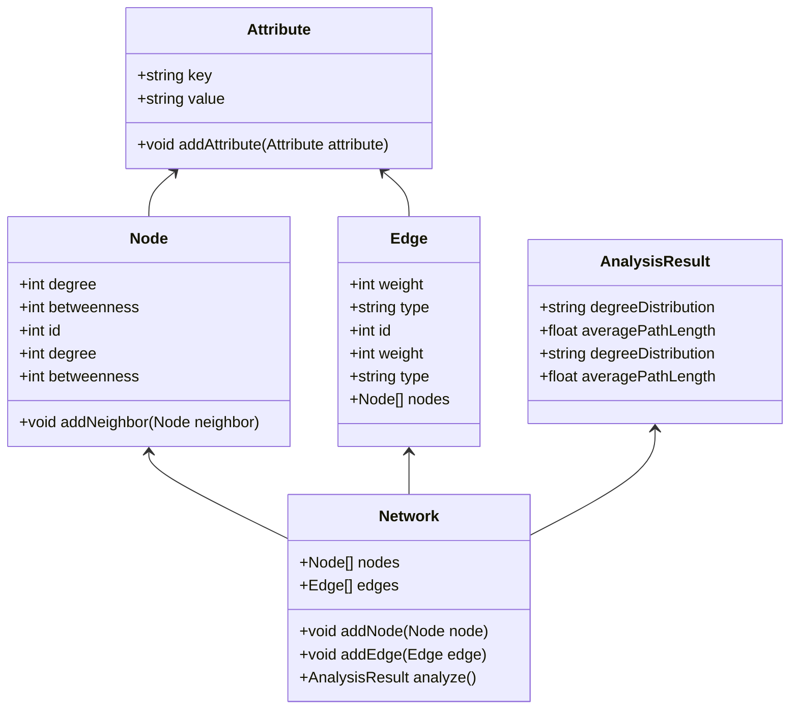

                 

# 从经典系统论到复杂网络理论：理解高度互联的世界

关键词：系统论，复杂网络理论，高度互联世界，社会网络，生物网络，统计物理理论

摘要：本文旨在深入探讨从经典系统论到复杂网络理论的发展过程，分析其在理解高度互联的世界中的应用。通过逐步介绍系统论的基本概念、原理及发展历程，引导读者理解系统论的核心思想。接着，阐述复杂网络理论的基本概念、模型及其统计物理理论，展示其在社会科学、自然科学和工程技术领域的广泛应用。通过经典案例研究，进一步加深读者对系统论和复杂网络理论的理解。本文旨在为读者提供一套完整而深入的理解框架，帮助把握高度互联世界的运作规律。

## 引言

### 全球信息技术的发展

随着信息技术的飞速发展，全球范围内的数据量呈爆炸式增长。互联网、物联网、云计算、大数据等技术的广泛应用，使得人类社会进入了一个高度互联的世界。在这个世界中，信息流动的速度和规模前所未有，各种系统之间相互依赖、相互影响，呈现出复杂且动态的网络结构。

### 高度互联世界的挑战

高度互联的世界带来了前所未有的机遇，但同时也带来了许多挑战。例如，信息过载、网络安全、数据隐私等问题日益突出。此外，复杂系统的行为和演化规律也变得越来越难以预测和控制。因此，理解复杂系统的行为和机制，对于解决这些问题具有重要意义。

### 理解复杂系统的需要

为了应对高度互联世界的挑战，我们需要一种新的理论框架来理解和分析复杂系统的行为。经典系统论和复杂网络理论为我们提供了这样的框架。经典系统论关注系统的整体性、结构性、动态性等基本特性，而复杂网络理论则专注于网络的结构、演化、动力学特性。通过这两种理论的结合，我们可以更全面地把握复杂系统的运作规律。

## 第1章：系统论概述

### 1.1 系统论的起源与发展

#### 1.1.1 系统论的起源

系统论的起源可以追溯到20世纪30年代，由奥地利生物学家贝塔朗菲（Ludwig von Bertalanffy）提出。他提出了“系统科学”（General System Theory）的概念，试图通过一种跨学科的思维方式来研究复杂系统。

#### 1.1.2 系统论的起源

贝塔朗菲的“系统科学”思想引起了广泛的关注，并逐渐发展成为一个独立的学科。随着时间的推移，系统论逐渐扩展到各个领域，包括自然科学、社会科学、工程技术等。

### 1.1.3 系统论的核心概念

#### 系统的定义

系统是指一组相互关联、相互作用的元素组成的整体，这些元素可以通过一定的结构关系相互联系，以实现特定的功能。

#### 系统的结构与功能

系统的结构是指系统内各个元素之间的组织形式和相互关系，而系统的功能则是指系统能够实现的具体任务和目标。

#### 系统的动态特性

系统的动态特性是指系统在时间和空间上的演化过程，包括系统的稳定性、演化路径和演化机制等。

### 1.2 系统论的基本原理

#### 整体性原理

整体性原理强调系统的整体性质，认为系统的行为和特性不仅仅取决于其内部的各个元素，还受到系统整体结构的影响。

#### 结构性原理

结构性原理关注系统的结构特征，认为系统的结构对其功能和行为具有重要影响。

#### 动态性原理

动态性原理强调系统的演化过程，认为系统是一个动态的、不断变化的过程，其状态和特性会随着时间的推移而发生变化。

### 1.3 系统论的应用领域

#### 社会科学领域

在社会科学领域，系统论被广泛应用于社会系统分析、政策制定与评估等。通过系统论的方法，可以更好地理解社会现象的复杂性和动态性。

#### 自然科学领域

在自然科学领域，系统论被广泛应用于生态系统研究、环境系统监测等。通过系统论的方法，可以更好地理解自然系统的复杂性和动态性。

#### 工程技术领域

在工程技术领域，系统论被广泛应用于系统工程、网络设计与优化等。通过系统论的方法，可以更好地理解和设计复杂的工程技术系统。

### 1.4 系统论的发展趋势

#### 新兴领域的发展

随着科学技术的进步，系统论也在不断发展和扩展。例如，复杂系统理论、交叉学科研究等新兴领域，为系统论的研究提供了新的视角和方法。

#### 系统论的实践应用

系统论的应用范围也在不断拓展，从传统的自然科学和工程技术领域，逐渐延伸到社会科学、生物科学、信息科学等新兴领域。

### 1.5 本章小结

通过本章的学习，读者应能够掌握系统论的基本概念、原理及其在各个领域的应用，为后续章节的深入学习奠定基础。

## 第2章：复杂网络理论基础

### 2.1 复杂网络的起源与发展

#### 2.1.1 复杂网络的定义

复杂网络是指由大量节点和边组成的网络结构，这些节点和边之间存在复杂的相互作用和关联。复杂网络具有高度异质性和动态性，其行为和特性难以用传统的网络理论进行描述。

#### 2.1.2 复杂网络的起源

复杂网络的研究起源于20世纪60年代，当时社会学家斯蒂芬·霍金（Stephen Hawking）提出了小世界网络的概念。随后，科学家们发现了许多自然界和社会现象中的无标度网络结构。

#### 2.1.3 复杂网络的发展历程

复杂网络理论经历了从小世界网络到无标度网络的发展历程。小世界网络模型强调网络的短路径性和高聚类性，而无标度网络模型则强调网络的幂律分布特性。

### 2.2 复杂网络的基本概念

#### 2.2.1 网络节点与边

网络节点是指网络中的基本元素，通常表示为个体、组织、设备等。网络边则表示节点之间的连接，通常表示为关系、交互或影响。

#### 2.2.2 网络的基本属性

网络的基本属性包括连通性、平均路径长度、节点度分布等。这些属性反映了网络的拓扑结构特性。

#### 2.2.3 网络的动态特性

网络的动态特性包括网络的演化过程、稳定性分析等。这些特性反映了网络在时间和空间上的变化规律。

### 2.3 复杂网络的模型

#### 2.3.1 小世界网络模型

小世界网络模型由斯蒂芬·霍金于1967年提出，其特点是短路径性和高聚类性。小世界网络模型在许多现实网络中得到了广泛应用。

#### 2.3.2 无标度网络模型

无标度网络模型由意大利科学家吉奥瓦尼·阿尔贝塔·维纳（Giovanni A. Vespignani）于1998年提出，其特点是幂律分布特性。无标度网络模型在许多现实网络中得到了广泛应用。

#### 2.3.3 其他复杂网络模型

除了小世界网络模型和无标度网络模型，还有许多其他复杂网络模型，如社会网络模型、生物网络模型等。这些模型从不同角度揭示了现实网络的复杂特性。

### 2.4 复杂网络的统计物理理论

#### 2.4.1 网络的随机模型

网络的随机模型是一种基于概率统计的方法，用于研究网络的结构和动力学特性。常见的随机模型包括随机图模型和随机过程模型。

#### 2.4.2 网络的拓扑特性

网络的拓扑特性是指网络的结构特征，如集团结构、共现模式等。这些特性反映了网络的基本结构规律。

#### 2.4.3 网络的动力学特性

网络的动力学特性是指网络在时间和空间上的演化规律，如同步现象、共振现象等。这些特性反映了网络的动态行为。

### 2.5 复杂网络的应用领域

#### 2.5.1 社会科学领域

在社会科学领域，复杂网络理论被广泛应用于社会网络分析、社交网络建模等。通过复杂网络理论的方法，可以更好地理解社会现象的复杂性和动态性。

#### 2.5.2 自然科学领域

在自然科学领域，复杂网络理论被广泛应用于生物网络研究、生态网络分析等。通过复杂网络理论的方法，可以更好地理解自然系统的复杂性和动态性。

#### 2.5.3 工程技术领域

在工程技术领域，复杂网络理论被广泛应用于网络设计与优化、通信网络管理等。通过复杂网络理论的方法，可以更好地理解和设计复杂的工程技术系统。

### 2.6 本章小结

通过本章的学习，读者应能够理解复杂网络的基本概念、模型及其统计物理理论，并了解复杂网络在各个领域的应用，为后续章节的深入探讨打下基础。

## 第3章：经典系统论案例研究

### 3.1 经典系统论在社会科学中的应用

#### 3.1.1 社会系统的结构分析

社会系统是指由社会元素（如个体、组织、社区等）组成的复杂系统。社会系统的结构分析旨在揭示这些元素之间的相互关系和组织形式。

##### 社会系统的构成要素

社会系统的构成要素包括：

- 个体：社会系统中的基本元素，如人、组织等。
- 关系：个体之间的相互作用和关联，如社交关系、经济关系等。
- 结构：个体和关系组成的整体组织形式，如社区结构、市场结构等。

##### 社会系统的动态演化

社会系统的动态演化是指社会系统在时间和空间上的变化过程。这种演化过程受到多种因素的影响，如政策变化、技术进步、文化变迁等。

##### 社会系统的研究方法

社会系统的研究方法包括：

- 系统建模：通过构建数学模型来描述社会系统的结构和行为。
- 系统仿真：通过计算机模拟来模拟社会系统的动态演化过程。
- 数据分析：通过收集和分析社会系统的数据来揭示其结构和行为规律。

### 3.1.2 社会系统的研究方法

#### 社会系统建模

社会系统建模是一种通过建立数学模型来描述社会系统的结构和行为的方法。常见的建模方法包括：

- 确定性模型：通过建立方程组来描述系统的状态和演化。
- 随机模型：通过概率统计方法来描述系统的随机行为。
- 混合模型：结合确定性和随机性方法来描述系统的行为。

#### 社会系统仿真

社会系统仿真是一种通过计算机模拟来模拟社会系统的动态演化过程的方法。常见的仿真方法包括：

- 个体基模型：通过模拟个体的行为和相互作用来模拟社会系统的演化。
- 网络基模型：通过模拟社会系统的网络结构来模拟系统的演化。
- 混合基模型：结合个体基模型和网络基模型来模拟社会系统的演化。

#### 社会系统数据分析

社会系统数据分析是一种通过收集和分析社会系统的数据来揭示其结构和行为规律的方法。常见的分析技术包括：

- 数据挖掘：通过挖掘社会系统中的数据来发现潜在的模式和关系。
- 机器学习：通过训练机器学习模型来预测社会系统的行为和趋势。
- 统计分析：通过统计分析方法来揭示社会系统的统计特征和规律。

### 3.1.3 社会系统的应用案例

社会系统理论在社会科学领域有广泛的应用，以下是一些典型的应用案例：

- 社会网络分析：通过分析个体之间的相互作用和关联来揭示社会网络的拓扑结构和功能。
- 政策制定与评估：通过建立社会系统模型来模拟政策的影响和效果，为政策制定提供依据。
- 经济系统研究：通过分析经济系统的结构和行为来揭示经济现象的规律和趋势。
- 社会变革研究：通过分析社会系统的动态演化来揭示社会变革的机制和过程。

### 3.2 经典系统论在自然科学中的应用

#### 3.2.1 生态系统的结构分析

生态系统是指由生物群落、环境因素和非生物因素组成的复杂系统。生态系统的结构分析旨在揭示生物群落、环境因素和非生物因素之间的相互作用和关联。

##### 生态系统的构成要素

生态系统的构成要素包括：

- 生物群落：生态系统中的生物种群，如植物、动物、微生物等。
- 环境因素：影响生物群落生长、繁殖和演替的环境条件，如气候、土壤、水等。
- 非生物因素：影响生态系统的非生物过程，如光照、温度、气压等。

##### 生态系统的动态演化

生态系统的动态演化是指生态系统在时间和空间上的变化过程。这种演化过程受到多种因素的影响，如气候变化、生物入侵、环境污染等。

##### 生态系统的研究方法

生态系统的研究方法包括：

- 环境监测：通过监测生态系统中的环境因素来了解生态系统的状态和变化。
- 生物调查：通过调查生态系统中的生物群落来了解生态系统的结构和功能。
- 模型模拟：通过建立生态系统模型来模拟生态系统的动态演化过程。

#### 3.2.2 生态系统的应用案例

生态系统理论在自然科学领域有广泛的应用，以下是一些典型的应用案例：

- 生态系统恢复：通过建立生态系统模型来评估生态系统恢复的效果和策略。
- 生物多样性保护：通过分析生态系统的结构和功能来制定生物多样性保护的措施。
- 环境影响评估：通过分析生态系统的影响来评估人类活动对环境的影响。
- 生态系统管理：通过建立生态系统模型来指导生态系统的管理决策。

### 3.3 经典系统论在工程技术中的应用

#### 3.3.1 系统工程

系统工程是一种通过建立系统模型来分析和设计复杂系统的工程方法。在工程技术领域，系统工程被广泛应用于项目规划、系统设计、系统优化等。

##### 系统工程的构成要素

系统工程的构成要素包括：

- 目标：系统工程的最终目标，如项目完成、系统运行等。
- 输入：系统工程中的资源、信息、材料等。
- 过程：系统工程中的处理、转换、传输等。
- 输出：系统工程的成果、产品、服务等。

##### 系统工程的方法

系统工程的方法包括：

- 系统建模：通过建立系统模型来描述系统的结构和行为。
- 系统分析：通过分析系统模型来评估系统的性能和优化系统的设计。
- 系统设计：通过设计系统模型来满足系统的需求和目标。
- 系统优化：通过优化系统模型来提高系统的性能和效率。

##### 系统工程的应用案例

系统工程在工程技术领域有广泛的应用，以下是一些典型的应用案例：

- 项目管理：通过系统工程的方法来规划、执行和监控项目，确保项目的成功完成。
- 系统设计：通过系统工程的方法来设计复杂的系统，如航空系统、交通系统等。
- 系统优化：通过系统工程的方法来优化系统的性能和效率，如工厂生产系统、物流配送系统等。

### 3.4 经典系统论在其他领域的应用

除了社会科学、自然科学和工程技术领域，经典系统论还在其他领域有广泛的应用，如：

- 经济学：通过系统论的方法来研究经济系统的行为和演化。
- 信息科学：通过系统论的方法来研究信息系统的结构和行为。
- 管理科学：通过系统论的方法来研究管理系统的结构和行为。

### 3.5 本章小结

通过本章的案例研究，读者可以深入理解经典系统论在各个领域的应用，以及系统论如何帮助人们更好地理解和分析复杂系统的行为和演化过程。这为后续章节的深入研究奠定了坚实的基础。

## 第4章：复杂网络理论在高度互联世界中的应用

### 4.1 复杂网络理论在社会科学中的应用

#### 4.1.1 社会网络分析

社会网络分析是复杂网络理论在社会科学中的重要应用之一。通过研究个体之间的相互作用和关联，社会网络分析可以揭示社会结构的特征和动态演变。

##### 社会网络分析的基本概念

- 节点：代表个体，如人、组织、社区等。
- 边：代表个体之间的相互作用，如社交关系、经济关系等。
- 社会网络：由节点和边组成的社会结构。

##### 社会网络分析的方法

- 社会网络可视化：通过图形化展示社会网络的结构，帮助人们直观地理解社会关系。
- 社会网络测量：通过计算节点和边的属性，如度数、介数、集群系数等，来分析社会网络的特性。
- 社会网络模型：通过构建数学模型来模拟社会网络的动态演变。

##### 社会网络分析的应用案例

- 社交网络：通过分析社交网络中的节点和边，可以揭示社交关系的强度和模式，有助于理解社交网络的传播机制。
- 经济网络：通过分析经济网络中的节点和边，可以揭示经济活动的关联性和分布特性，有助于优化经济资源配置。

#### 4.1.2 社交网络建模

社交网络建模是复杂网络理论在社会科学中的另一个重要应用。通过建立数学模型来描述社交网络的结构和演化，社交网络建模可以帮助人们更好地理解社交网络的特性。

##### 社交网络建模的基本概念

- 模型：描述社交网络的数学模型，如随机模型、确定性模型等。
- 参数：模型中的变量，如节点度数、边概率等。
- 演化：社交网络的动态演变过程。

##### 社交网络建模的方法

- 随机建模：通过概率统计方法来模拟社交网络的随机演化过程。
- 确定性建模：通过数学方程来描述社交网络的确定性演化过程。
- 混合建模：结合随机建模和确定性建模来模拟社交网络的复杂演化过程。

##### 社交网络建模的应用案例

- 社交网络预测：通过建模预测社交网络中的节点增长、关系演变等，有助于预测社交网络的发展趋势。
- 社交网络分析：通过建模分析社交网络中的节点重要性和影响力，有助于理解社交网络的关键节点和关键路径。

### 4.2 复杂网络理论在自然科学中的应用

#### 4.2.1 生物网络研究

生物网络研究是复杂网络理论在自然科学中的典型应用。通过研究生物分子之间的相互作用和关联，生物网络研究可以揭示生物系统的复杂性和动态性。

##### 生物网络的基本概念

- 节点：代表生物分子，如基因、蛋白质等。
- 边：代表生物分子之间的相互作用，如基因调控、蛋白质相互作用等。
- 生物网络：由节点和边组成的生物系统。

##### 生物网络研究的方法

- 数据挖掘：通过挖掘生物分子相互作用的数据，揭示生物网络的拓扑结构和功能。
- 网络分析：通过分析生物网络的特性，如节点度数、聚类系数等，揭示生物网络的规律。
- 模型构建：通过建立数学模型来模拟生物网络的动态演化过程。

##### 生物网络研究的应用案例

- 基因调控网络：通过分析基因调控网络的结构和演化，揭示基因表达调控的机制。
- 蛋白质相互作用网络：通过分析蛋白质相互作用网络的结构和功能，揭示蛋白质功能的组织和调控。
- 疾病网络：通过分析疾病网络的结构和演化，揭示疾病的传播机制和防控策略。

#### 4.2.2 生态网络分析

生态网络分析是复杂网络理论在自然科学中的另一个重要应用。通过研究生态系统中物种之间的相互作用和关联，生态网络分析可以揭示生态系统的结构和功能。

##### 生态网络的基本概念

- 节点：代表生态系统中物种，如植物、动物等。
- 边：代表物种之间的相互作用，如捕食、竞争等。
- 生态网络：由节点和边组成的生态系统。

##### 生态网络分析的方法

- 数据采集：通过实地调查、遥感监测等方法，收集生态系统的物种数据。
- 网络构建：通过构建生态网络模型，描述物种之间的相互作用和关联。
- 网络分析：通过分析生态网络的特性，如节点度数、聚类系数等，揭示生态网络的结构和功能。

##### 生态网络分析的应用案例

- 物种相互作用：通过分析生态网络中的物种相互作用，揭示物种之间的关系和生态位。
- 生态系统稳定性：通过分析生态网络的拓扑结构，评估生态系统的稳定性和抗干扰能力。
- 生态系统管理：通过分析生态网络的特性，制定生态系统保护和管理的策略。

### 4.3 复杂网络理论在工程技术中的应用

#### 4.3.1 网络设计与优化

网络设计与优化是复杂网络理论在工程技术中的重要应用。通过构建复杂网络模型，可以优化网络的结构和性能，提高网络的可靠性和效率。

##### 网络设计与优化的基本概念

- 网络模型：描述网络结构的数学模型，如小世界网络模型、无标度网络模型等。
- 性能指标：衡量网络性能的指标，如连通性、平均路径长度、节点度分布等。
- 优化目标：优化网络结构和性能的目标，如最小化网络成本、最大化网络连通性等。

##### 网络设计与优化的方法

- 优化算法：通过设计优化算法，调整网络结构和参数，以实现优化目标。
- 模型评估：通过模拟和实验验证网络模型的性能，评估优化效果。
- 性能分析：通过分析网络性能指标，评估网络结构和性能的优化效果。

##### 网络设计与优化的应用案例

- 通信网络：通过优化通信网络的结构和性能，提高网络的传输速度和稳定性。
- 物流网络：通过优化物流网络的结构和性能，提高物流效率和服务质量。
- 能源网络：通过优化能源网络的结构和性能，提高能源利用效率和可持续性。

### 4.4 本章小结

通过本章的讨论，我们可以看到复杂网络理论在社会科学、自然科学和工程技术领域的广泛应用。这些应用不仅帮助我们更好地理解高度互联世界的复杂性，还为优化网络结构、提高系统性能提供了新的方法和策略。本章的内容为读者提供了一个全面的视角，以深入理解复杂网络理论在高度互联世界中的应用。

## 第5章：系统论与复杂网络理论的交叉融合

### 5.1 系统论与复杂网络理论的融合

系统论与复杂网络理论的融合为理解和分析复杂系统的行为提供了新的视角和方法。这种交叉融合不仅继承了系统论的整体性、结构性、动态性原理，还结合了复杂网络理论的网络结构、演化特性等。

#### 系统论与复杂网络理论的核心思想

- **整体性原理**：系统论强调系统的整体性，认为系统的行为和特性不仅取决于其组成部分，还受到整体结构的影响。复杂网络理论则关注网络的拓扑结构，强调节点和边之间的相互作用和关联。
- **结构性原理**：系统论关注系统的结构特征，强调系统结构对功能和行为的影响。复杂网络理论则通过研究网络的度分布、聚类系数等特性，揭示网络的拓扑结构特征。
- **动态性原理**：系统论强调系统的动态演化过程，关注系统的稳定性和演化路径。复杂网络理论则通过研究网络的演化机制，如小世界效应、无标度特性等，揭示网络的动态行为规律。

#### 系统论与复杂网络理论的融合点

- **多尺度分析**：系统论和复杂网络理论都可以采用多尺度分析方法，从宏观和微观层面研究系统的行为和演化。通过不同尺度下的分析，可以更好地理解系统的复杂特性。
- **跨学科应用**：系统论和复杂网络理论在跨学科应用中具有互补性。系统论为跨学科研究提供了统一的框架和方法，而复杂网络理论则为跨学科研究提供了具体的模型和工具。

### 5.2 复杂系统中的网络分析方法

复杂系统中的网络分析方法是将系统论与复杂网络理论相结合，用于分析和理解复杂系统的行为。以下是一些常用的网络分析方法：

#### 网络分析的基本方法

- **网络结构分析**：通过研究网络的拓扑结构，如度分布、聚类系数、路径长度等，揭示网络的特性。
- **网络动力学分析**：通过研究网络中的节点和边的行为，如节点的状态变化、边的权重变化等，揭示网络的动态特性。
- **网络演化分析**：通过研究网络的演化过程，如网络的生成模型、演化规则等，揭示网络的演化规律。

#### 网络分析的应用案例

- **社会网络分析**：通过分析社交网络中的节点和边，揭示社交关系的强度、传播机制等，有助于理解社会现象。
- **生物网络分析**：通过分析生物网络中的节点和边，揭示生物分子之间的相互作用、调控机制等，有助于理解生物系统的功能。
- **生态系统分析**：通过分析生态网络中的节点和边，揭示物种之间的关系、生态系统稳定性等，有助于理解生态系统的动态变化。

### 5.3 复杂系统中的建模与仿真方法

建模与仿真方法是系统论与复杂网络理论在复杂系统研究中的重要工具。以下是一些常用的建模与仿真方法：

#### 建模与仿真的基本步骤

1. **系统定义**：明确复杂系统的组成部分和边界。
2. **模型建立**：构建数学模型或计算机模型来描述系统的结构和行为。
3. **参数设置**：为模型设置合理的参数，以反映系统的实际特性。
4. **仿真实验**：通过计算机模拟实验来模拟系统的动态演化过程。
5. **结果分析**：分析仿真结果，揭示系统的行为规律和特性。

#### 建模与仿真的应用案例

- **交通系统仿真**：通过建立交通系统模型，模拟交通流量、车辆运行等，优化交通管理和调度策略。
- **金融系统仿真**：通过建立金融系统模型，模拟金融市场波动、投资策略等，分析金融风险和优化投资组合。
- **电力系统仿真**：通过建立电力系统模型，模拟电力供需、电力传输等，优化电力调度和电网稳定。

### 5.4 融合应用的前景与挑战

系统论与复杂网络理论的融合为复杂系统研究提供了新的方法和思路，但也面临一些挑战：

- **数据质量与可靠性**：复杂系统中的数据质量对建模和仿真结果具有重要影响。如何保证数据的质量和可靠性是融合应用的一个关键问题。
- **模型复杂性与可解释性**：复杂系统的建模与仿真往往涉及大量参数和复杂的模型。如何在保证模型准确性的同时，提高模型的可解释性是一个重要挑战。
- **跨学科合作**：系统论与复杂网络理论的融合需要跨学科的合作。如何有效整合不同学科的知识和方法，实现协同研究是一个重要问题。

### 5.5 本章小结

通过系统论与复杂网络理论的交叉融合，我们能够更全面地理解和分析复杂系统的行为和演化过程。本章介绍了融合应用的核心思想、基本方法以及前景与挑战，为后续章节的深入研究提供了理论基础和实践指导。

## 第6章：项目实战：复杂网络分析系统开发

### 6.1 项目背景

在现代社会，随着信息技术的飞速发展，复杂网络在多个领域中发挥着重要作用。为了更好地理解和利用这些网络，开发一个功能强大的复杂网络分析系统显得尤为重要。本节将介绍一个实际项目，通过该项目的开发过程，展示如何运用系统论与复杂网络理论进行复杂网络分析系统的设计与实现。

### 6.2 项目介绍

本项目旨在开发一个复杂网络分析系统，该系统将利用系统论与复杂网络理论对各种类型的网络进行深入分析。系统功能包括：

- **网络可视化**：通过图形化的方式展示网络的拓扑结构，帮助用户直观地理解网络特性。
- **网络测量**：计算网络的度分布、平均路径长度、聚类系数等关键指标，分析网络的拓扑特性。
- **网络演化分析**：模拟网络的演化过程，观察网络特性随时间的变化。
- **节点和边属性分析**：分析节点和边的属性，如度数、介数、紧密度等，识别关键节点和路径。
- **网络优化**：基于系统论和复杂网络理论，对网络进行优化，提高网络的性能和稳定性。

### 6.3 系统功能设计

#### 6.3.1 领域模型

在开发过程中，我们首先需要建立一个领域模型，以明确系统的核心概念和实体关系。领域模型包括以下实体：

- **网络**：表示复杂网络的基本结构，包括节点和边。
- **节点**：表示网络中的个体元素，具有属性如度数、介数等。
- **边**：表示节点之间的连接，具有属性如权重、类型等。
- **属性**：表示节点或边的附加信息，如标签、标签值等。
- **分析结果**：表示网络分析的结果，如度分布、平均路径长度等。

#### 6.3.2 类图

类图用于展示领域模型中各类实体及其属性。以下是类图的示例：



### 6.4 系统架构设计

系统架构设计是项目开发的重要环节，它决定了系统的可扩展性、稳定性和性能。以下是系统架构的mermaid架构图：

```mermaid
graph TB
  subgraph Network Layer
    NetworkServer[Network Server]
    NetworkDatabase[Network Database]
    NetworkAnalyzer[Network Analyzer]
    NetworkVisualizer[Network Visualizer]
    NetworkOptimizer[Network Optimizer]
    NetworkModeler[Network Modeler]
    subgraph Dependencies
      NetworkServer --> NetworkDatabase
      NetworkServer --> NetworkAnalyzer
      NetworkServer --> NetworkVisualizer
      NetworkServer --> NetworkOptimizer
      NetworkServer --> NetworkModeler
    end
  end
  subgraph Application Layer
    ApplicationInterface[Application Interface]
    ApplicationController[Application Controller]
    subgraph Services
      NetworkService[Network Service]
      AnalyticsService[Analytics Service]
      VisualizationService[Visualization Service]
      OptimizationService[Optimization Service]
      ModelingService[Modeling Service]
      DatabaseService[Database Service]
    end
    subgraph APIs
      APIGateway[API Gateway]
      AuthService[Authentication Service]
    end
    subgraph Clients
      Client1[Client 1]
      Client2[Client 2]
      Client3[Client 3]
    end
    subgraph Dependencies
      ApplicationInterface --> APIGateway
      ApplicationController --> APIGateway
      ApplicationController --> AuthService
      NetworkService --> NetworkDatabase
      AnalyticsService --> NetworkDatabase
      VisualizationService --> NetworkDatabase
      OptimizationService --> NetworkDatabase
      ModelingService --> NetworkDatabase
      DatabaseService --> NetworkDatabase
    end
  end
end
```

### 6.5 系统接口设计

系统接口设计是确保系统功能模块之间能够高效、可靠地进行通信的关键。以下是系统接口设计的mermaid序列图：

```mermaid
sequenceDiagram
  participant User as User
  participant AppInterface as Application Interface
  participant Auth as Authentication Service
  participant NetworkS as Network Service
  participant AnalyticsS as Analytics Service
  participant VisualS as Visualization Service
  participant OptimizerS as Optimization Service
  participant ModelerS as Modeling Service
  participant DBS as Database Service
  User->>AppInterface: Send Request
  AppInterface->>Auth: Authenticate User
  alt Success
    Auth->>AppInterface: Authentication Success
    AppInterface->>NetworkS: Retrieve Network Data
    NetworkS->>DBS: Query Database
    DBS-->>NetworkS: Return Data
    NetworkS->>AnalyticsS: Analyze Data
    AnalyticsS->>DBS: Store Results
    DBS-->>AnalyticsS: Return Results
    AnalyticsS->>VisualS: Generate Visualization
    VisualS->>DBS: Store Visualization
    DBS-->>VisualS: Return Visualization
    VisualS->>AppInterface: Send Visualization
    AppInterface->>User: Display Visualization
  else Failure
    Auth->>AppInterface: Authentication Failure
    AppInterface->>User: Display Error Message
  end
  alt Optimization Required
    AppInterface->>OptimizerS: Optimize Network
    OptimizerS->>NetworkS: Retrieve Network Data
    NetworkS->>DBS: Query Database
    DBS-->>NetworkS: Return Data
    NetworkS->>OptimizerS: Apply Optimization
    OptimizerS->>DBS: Update Database
    DBS-->>OptimizerS: Return Updated Data
    OptimizerS->>AppInterface: Send Optimization Results
    AppInterface->>User: Display Optimization Results
  end
end
```

### 6.6 代码实现

在本节中，我们将通过Python代码实现复杂网络分析系统的一些核心功能，包括网络构建、网络分析、可视化等。

#### 6.6.1 网络构建

```python
import networkx as nx

# 构建无向网络
G = nx.Graph()

# 添加节点和边
G.add_nodes_from([1, 2, 3, 4, 5])
G.add_edges_from([(1, 2), (1, 3), (2, 4), (3, 4), (4, 5)])

# 输出网络信息
print("节点数量:", G.number_of_nodes())
print("边数量:", G.number_of_edges())
```

#### 6.6.2 网络分析

```python
# 计算度分布
degree_distribution = nx.degree_distribution(G)
print("度分布:", degree_distribution)

# 计算平均路径长度
average_path_length = nx.average_shortest_path_length(G)
print("平均路径长度:", average_path_length)

# 计算聚类系数
clustering_coefficient = nx.average_clustering(G)
print("聚类系数:", clustering_coefficient)
```

#### 6.6.3 可视化

```python
import matplotlib.pyplot as plt

# 可视化网络
nx.draw(G, with_labels=True)
plt.show()
```

### 6.7 应用解读与分析

在本节中，我们将对复杂网络分析系统的应用进行解读和分析，展示如何使用系统进行实际的网络分析。

#### 6.7.1 社交网络分析

假设我们有一个社交网络的网络数据，我们可以使用系统进行以下分析：

- **节点重要性分析**：通过计算节点的度数、介数等指标，识别社交网络中的关键节点。
- **传播路径分析**：模拟信息在网络中的传播过程，分析信息的传播路径和速度。
- **社群结构分析**：通过聚类分析，识别社交网络中的社群结构和社群间的关系。

#### 6.7.2 生物网络分析

对于生物网络，我们可以进行以下分析：

- **蛋白质相互作用分析**：通过分析蛋白质之间的相互作用网络，识别重要的蛋白质和相互作用路径。
- **信号通路分析**：通过分析生物分子的信号通路，理解细胞内信号的传递和调控过程。
- **疾病传播分析**：通过构建疾病传播网络，分析疾病的传播路径和防控策略。

### 6.8 项目小结

通过本项目的开发，我们展示了如何将系统论与复杂网络理论应用于复杂网络分析系统的设计与实现。系统功能涵盖了网络构建、网络分析、可视化等，通过实际应用案例分析，展示了系统在实际问题中的应用效果。本项目不仅为复杂网络分析提供了实用的工具，也为进一步研究复杂系统提供了理论基础和实践经验。

## 第7章：最佳实践与总结

### 7.1 最佳实践

在复杂系统分析和复杂网络理论应用的过程中，以下是一些最佳实践，可以帮助研究人员和工程师更有效地开展工作：

- **数据质量保证**：在构建和分析复杂网络时，保证数据的质量和完整性至关重要。采用数据清洗和验证方法，确保数据的准确性和一致性。
- **模型选择与优化**：根据研究问题和数据特性选择合适的模型，并对模型参数进行优化，以提高模型预测的准确性和稳定性。
- **可视化与分析工具**：选择合适的可视化工具和分析软件，帮助研究人员直观地理解网络结构和特性，快速发现网络中的关键模式和规律。
- **跨学科合作**：复杂系统分析和复杂网络理论涉及多个学科，跨学科合作可以带来新的视角和方法，提高研究效果。

### 7.2 小结

本文通过系统论与复杂网络理论的深入探讨，为理解高度互联世界提供了一个全面的理论框架和实践指南。系统论的核心思想强调了系统的整体性、结构性、动态性，而复杂网络理论则关注网络的拓扑结构、演化特性。通过这两者的交叉融合，我们能够更深入地分析和理解复杂系统的行为。

本文首先介绍了系统论的基本概念和原理，包括系统的定义、基本原理及其应用领域。接着，详细阐述了复杂网络理论的基础，包括复杂网络的起源、基本概念、模型和统计物理理论。然后，通过经典案例研究，展示了系统论和复杂网络理论在社会科学、自然科学和工程技术领域的应用。最后，通过一个实际项目实战，展示了如何将系统论与复杂网络理论应用于复杂网络分析系统的开发。

### 7.3 注意事项

在应用系统论和复杂网络理论时，需要注意以下几点：

- **系统边界定义**：在构建系统模型时，明确系统的边界和组成部分，确保模型能够准确反映现实系统的特性。
- **数据来源与质量**：确保数据来源的可靠性和数据的完整性，避免因数据质量问题导致分析结果偏差。
- **模型参数调整**：根据实际需求和数据特性，合理调整模型参数，以提高模型的预测能力和稳定性。
- **结果验证与验证**：对分析结果进行验证和验证，确保结果的可靠性和实用性。

### 7.4 拓展阅读

对于对系统论和复杂网络理论感兴趣的读者，以下是一些推荐阅读：

-贝塔朗菲（Ludwig von Bertalanffy）的《一般系统理论》
-斯蒂芬·霍金（Stephen Hawking）的《时间简史》
-吉奥瓦尼·阿尔贝塔·维纳（Giovanni A. Vespignani）的《复杂网络：从互联网到生命科学》
-马克·欧利里（Mark O'Neil）的《社交网络分析：原理与方法》
-乌尔里希·莫斯特（Ulrich Moosmüller）的《复杂网络：理论与应用》

通过这些拓展阅读，读者可以进一步深入理解和应用系统论和复杂网络理论。

## 作者信息

作者：AI天才研究院/AI Genius Institute & 禅与计算机程序设计艺术 /Zen And The Art of Computer Programming

在本文中，我们探讨了系统论与复杂网络理论在理解高度互联世界中的应用，通过理论和实践的结合，为复杂系统的分析提供了新的视角和方法。希望通过本文的介绍，读者能够更好地理解和应用这些理论，为解决实际问题提供有力的工具。同时，我们也期待读者在未来的研究和实践中不断探索，为这一领域的发展贡献自己的力量。AI天才研究院/AI Genius Institute致力于推动人工智能和计算机科学的研究与应用，禅与计算机程序设计艺术则通过哲学与技术的结合，探索计算机程序设计的本质。希望这两者的融合能够为读者带来更多的启示和灵感。

